# 浪潮已至——YouTube AI shorts私教陪跑复盘&YouTube深海圈启动

> 来源：[https://ncnmu5q1eqm9.feishu.cn/docx/GTCAdMDouoEyFCxiazuckwZqnnf](https://ncnmu5q1eqm9.feishu.cn/docx/GTCAdMDouoEyFCxiazuckwZqnnf)

# 前言

大家好，我是Gary曹淦，和方波妮一起担任生财有术YouTube AI shorts私教陪跑&YouTube深海圈总教练，深耕AI内容出海赛道。

第一期私教陪跑1月16日开始，于2月28日正式结营，憋了好一阵子，终于可以光明正大地宣布我们的战果了！

本次私教陪跑三方面结果如下：

*   YPP开通情况：本次私教陪跑共104名圈友参与，在陪跑期间超70位圈友共计达成107个YPP账号（包括数据达标暂未开通的），成功实现人均YPP！超过20位圈友达成了两个及以上YPP，小芬、九月、茜茜三位圈友在陪跑期间达成了夸张的4个YPP！

*   内容沉淀情况：本次私教陪跑围绕不同主题共开展6次专场直播、邀请优秀陪跑圈友进行加餐分享共12次，与大家一起打磨出17篇分享帖，其中精华帖7篇，囊括了AI达人秀、AI动物示警、AI动物故事、解说号、故事号、长视频等多个赛道的高质量复盘和相应的提质提效技巧。

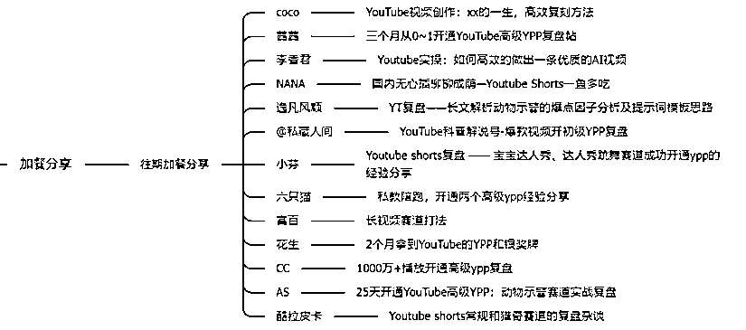

*   收益情况：由于私教陪跑周期仅有短短的一个月，开通审核需要时间，且多为AI赛道，在这期间产生的YPP收益其实并不高，不过也有花生、小芬、逸凡风顺、AS、cc等圈友通过YPP跑出了几百刀收益，以及NaNa把YouTube的视频分发到视频号跑出了单视频近3k RMB的收益。

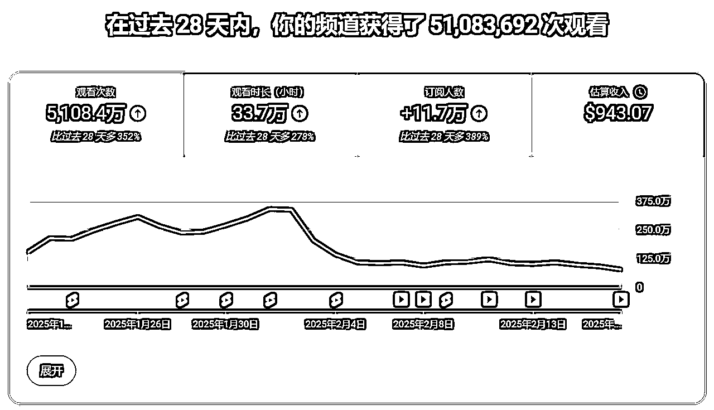

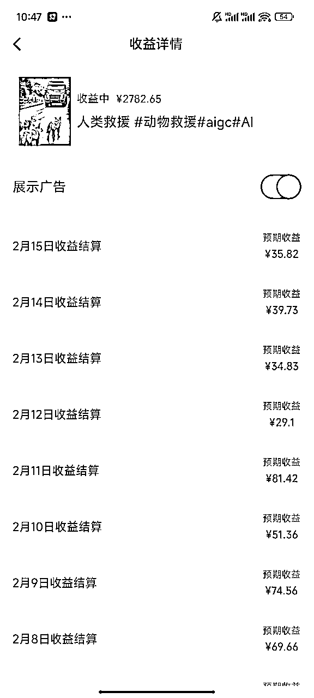

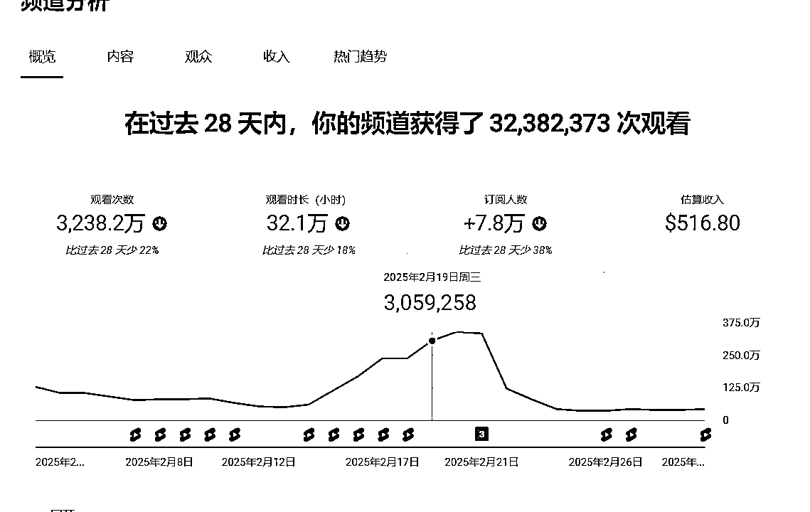

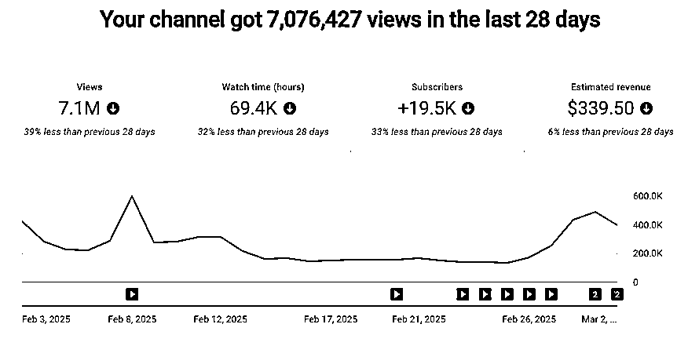

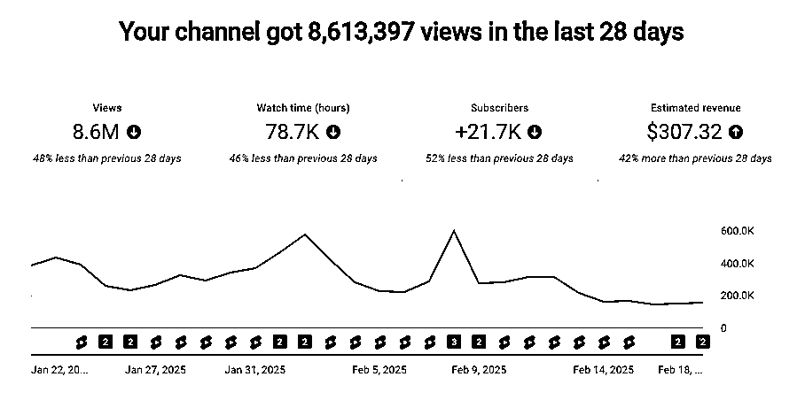

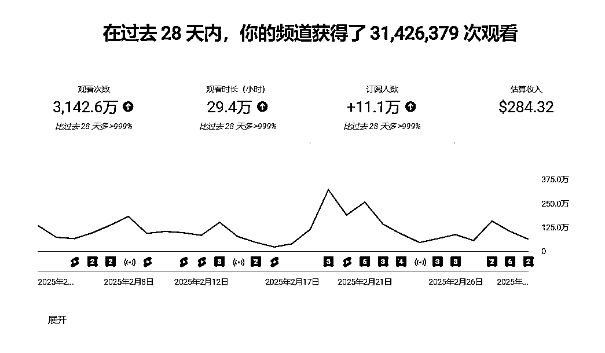

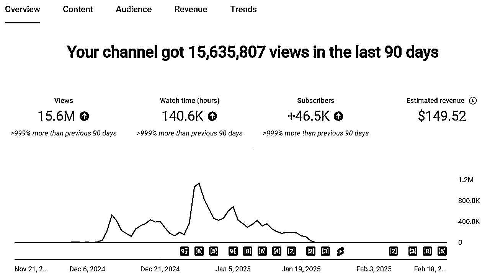

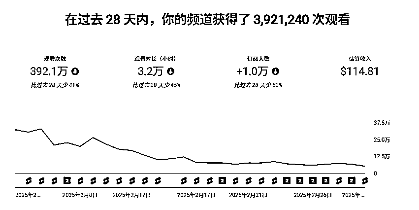

连我们自己也没想到，中期复盘帖里夸下100个YPP的海口，居然真的实现甚至超额完成，大家应该都很好奇，我们到底是怎么做到的？

那么今天就来对第一期的私教陪跑做一次完整的复盘，聊聊这一百多个YPP的“渡劫之路”。由于交付的内容已经在中期复盘帖里详细介绍过了，这里不会再赘述，感兴趣可前往 了解，这篇帖子的内容会按照各阶段交付目标来锚定，讲讲我们在各个阶段的目标、策略和心得，主要分为以下三个部分：

1.  筑基之道（1-14天）——重筑基础（基于航海），修炼YouTube AI shorts最新爆款创作的心法和手法，熟悉YouTube的生态规则

1.  结丹之难（15-25天）——金丹初成（方法论），能够熟练运用一门绝学（一条赛道）来进行爆款创作，达成百万级播放

1.  元婴大会（25-44天）——历劫成婴（YPP），开宗立派，群贤齐聚，冲击YPP账号数量和多样化的变现路径

# 筑基之道，引上正确的路

看到这个标题，也许大家会觉得奇怪，航海期间不是已经筑基了吗，为什么私教陪跑还要花有限的时间再做一次呢？本来我们也是这么想的，认为大家起码都是“筑基修士”，但是真正看到报名表单里填写的情况，才发现实际情况并不如我们所愿。

*   想象中的筑基修士：已经找对了赛道、找对了对标，能够基本复刻出对标的爆款视频

*   实际上的筑基修士：在凉掉的赛道默默耕耘，持续百播或常年万播；同时跑五六个账号，要么0播要么百播；赛道倒是还行，但是对标视频每天一个新花样；等等...

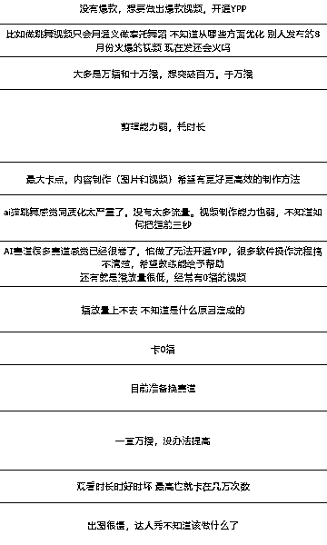

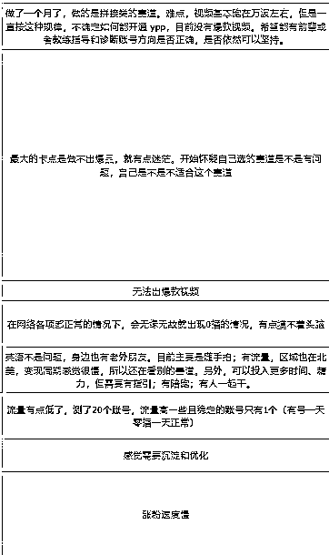

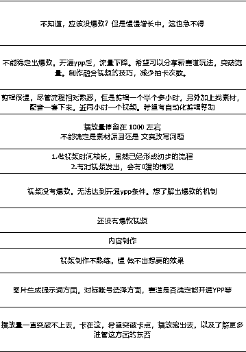

（摘录了一些当时报名表里大家填写的卡点，现在回头看是不是很唏嘘？）

这个时候我们意识到，必须要系统性地对大家现有的YouTube Shorts（特别是AI赛道）的认知和方法论做一轮校正，重筑基础，起码先让大家走上正确的道路，才有可能在45天之内拿到预期的结果。

那么问题来了，什么叫正确的路？

基于第一期陪跑的目标，即——让大家尽量在45天之内开通YPP，我们把”正确的路”拆解为以下三点：

## 选中正确的赛道和对标

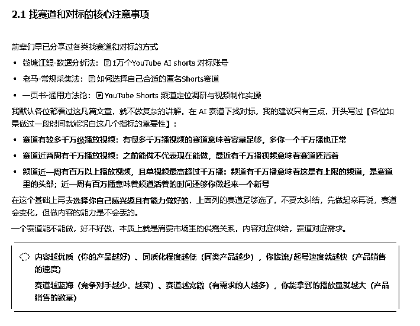

爆款赛道，尤其在AI赛道，周期性非常非常强。随着工具的衍生和迭代，很多赛道会非常快地产生、爆火、衰落，这个道理大家应该都知道，但真正做起来可能没那么容易意识到。

12月航海手册分享的一些赛道，比如萌宠跳舞、宝宝走秀的精华帖，其实写在11月初，而这些赛道本身都已经爆火几个月了，等到航海开始时已经在走下坡路，如果当初选择了这些流量下滑甚至已经没有流量的赛道，哪怕视频做得再好，也可能没有起色（除非结合时兴赛道开发出了新的变种，比如小芬的宝宝达人秀变身）

所以直播第一讲，就是讲赛道和对标，基于上面的标准，为大家优选出了近10个AI shorts的细分赛道和超过30个对标账号，确保即便100人一起下场，也不至于出现在一个赛道卷死彼此的情况，尽可能减少大家选错赛道、找错对标的可能性。

## 正确地复刻出爆款

选对赛道和对标之后，如何复刻出对标的爆款又成了一个新的问题。高难度的赛道别说复刻，就是制作视频都困难，低难度的赛道复刻了又没流量，我们发现很多圈友在常年百播万播中变得迷茫：

视频怎么做？复刻到底要复刻哪些要素？复刻是不是复制？

针对这个问题，我们设计了三个方向的应对

一是为视频制作能力不足的圈友提供低门槛高上限的爆款赛道复刻教程，比如动物示警，在赛道分享后的第二天我们就连夜制作复刻教程并分享，效果非常显著，许多原本无法完成动物故事、达人秀等复杂视频制作的圈友都通过动物示警拿到了第一批能稳定万播的视频，万播和百播是两码事，视频制作质量的提升为后续爆发奠定了基础。

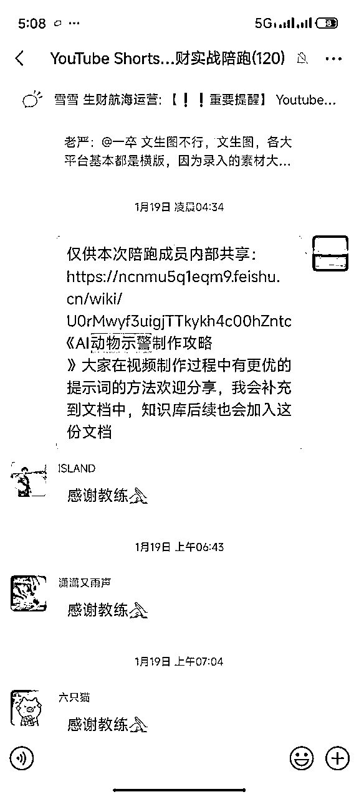

二是为动手能力强、有意愿复刻复杂视频的圈友们提供最先进（肯花心思）且有流量的视频制作手法，同时把大家制作视频遇到的难点和卡点进行采集，在手册和直播回答并现场答疑，拉高大家视频制作的上限，和普通的AI视频拉开差距。

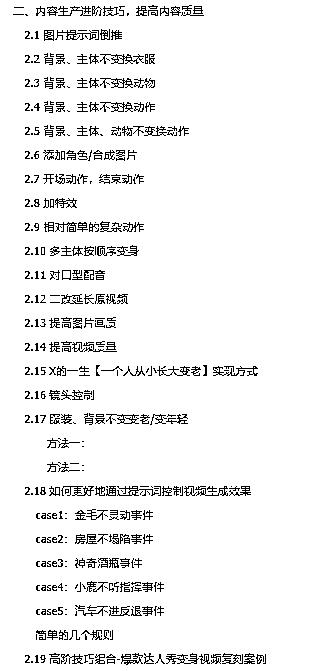

三是针对大家复刻过程中的一些错误动作制作了复刻爆款注意事项的专题内容，在直播、手册和一对一咨询中都进行强调，避免大家剑走偏锋误入歧途（复刻不是复制，请新人们务必不要使用即梦进行图生图的复刻，版权警告风险非常高）

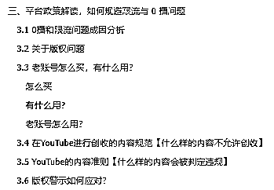

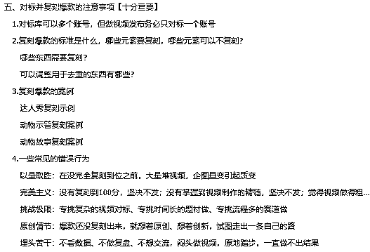

通过这几个方向的努力，我们基本解决了大家在视频制作上的问题，让大家能够正确地进行爆款复刻，接下来就是坚持和优化。

## 能正确地坚持更新并优化内容

相信很多开始YouTube时间不长的小伙伴都会困惑：

持续万播，到底要更新多久才能推流？所谓的推流机制是什么样的逻辑？看数据要怎么看？

这些问题在早期也都困扰着我，经过大量账号和数据的验证之后，我们终于推演出了一套相对可信的推流机制（仅针对AI shorts），并且验证了两个最重要的数据指标：选择观看率和观看时长百分比。（相关的信息会部分同步在航海手册，这里就不做过多的讲解）

同时由于不同赛道的数据不能直接比较，我们建立了不同赛道的数据参考表，收录了部分圈友百万和千万赛道账号的所有视频播放互动数据，以便于大家对自己的账号数据进行分析，判断视频的好坏，判断自己推流的时间，好调整预期、针对性地优化内容。

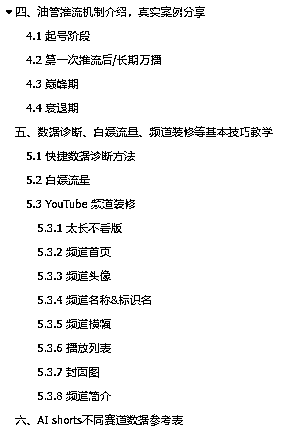

开始时走在了正确的道路上不代表能一直走在正确的道路上，为了自己能在正确的路上坚持下去，一是要管理预期，了解推流机制，比如视频质量不错、赛道不错，大多都会在15-25天之间推流，但前提是要坚持到推流那一天；二是要分析数据，通过数据指导自己的行动，该优化前三秒，还是优化视频整体的节奏；优化是正向的还是负向的；视频要迎合哪国人民偏好；等等，这些问题都可以在数据里找到答案。

# 结丹之难，走出自己的路

在修仙的世界里，凝结金丹，一般就有了自己的独门绝学，能够在一些小门派里当高手了。

而在这次陪跑过程中，我把结丹定义为“单视频跑出百万以上播放”，这意味着你或是复刻爆款到了不分敌我的地步，或是做了正确的微创新，在所处赛道里已经有一席之地，是个小高手了。

在我看来，结丹之难，难在走出自己的路，也就是逐步提炼出一套自己的、并且可行的爆款方法论。

其实如果运气好能赶上蓝海赛道的初期入坑，或许只需要做好“形”的复刻，就能轻松达成百万播放。但更贴近实际的情况是，当我们熟练地掌握了爆款复刻方法时，赛道已经不再蓝海（特指AI赛道），大家都在复刻，而我们的视频又不够出彩，导致内容卡在万播无法突破。

如果说在筑基阶段，复刻爆款学会了“形”的复刻，想要凭实力达到100w播放，就需要提炼出自己的方法论，迭代到“神”的复刻。要注意，刚开始如果连“形”都复刻不到位，看不到比较好的数据反馈，复刻“神”就只是空谈；也正是因为制作视频的关注点从“形”变成了“神”，方法论和微创新的意义才开始凸显。

那么问题又来了，怎么提炼出自己的方法论？怎么微创新？

虽然手册和直播分享了基本的方法论，但是因为面向100人，要足够泛用，所以当落地到具体的赛道和视频制作时，它并不一定符合每个人的习惯和需求。

这个时候就引出了这次陪跑的重要机制“加餐分享”。

中期复盘贴也提到过，我们会邀请陪跑过程中取得独创性结果的圈友对他们的独家秘笈、经验和感悟进行加餐分享，这实际上解决了“方法论落地”的问题，因为参与分享的各位圈友都是自己跑通、跑顺了流程的，都在自己的赛道中拿到了一定的结果，这样的分享对于同赛道的圈友能够提供非常有价值的参考：

拿到结果的人是怎么做的？哪些环节是我可以优化的？哪些环节是我做得更好的？

在陪跑圈子高密度的交流下，只要同赛道出现了一位拿到结果并且愿意分享的圈友，赛道内的信息差就可以被快速地抹平，这就是加餐分享和圈子的价值所在。在此基础上，大家能够很快地把方法论逐步迭代、升级到最适合自己的版本，更快地产出更高质量的视频。

同时，随着对爆款要素的理解加深，一个赛道的爆款视频往往能够在不同的视角下被拆解为不同的爆款要素，这些要素的拆分和重组，实际上就是微创新的过程，这里分享几位圈友对爆款要素的理解，这几位圈友都通过爆款要素的微创新拿到了不错的结果。

@NaNa

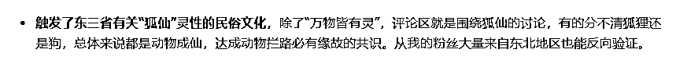

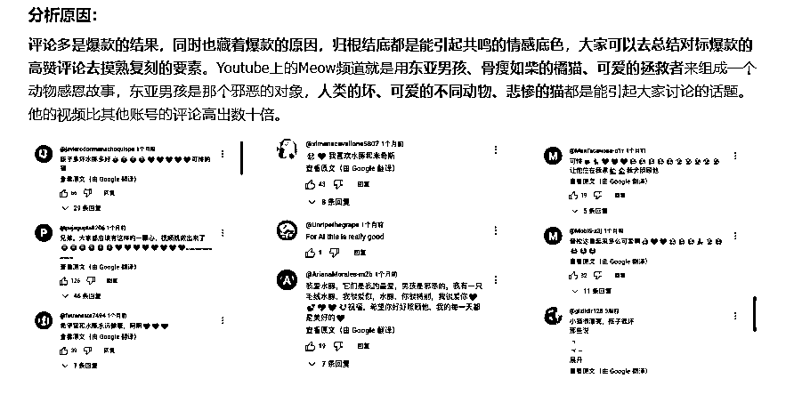

@小芬

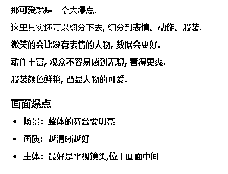

@逸凡风顺

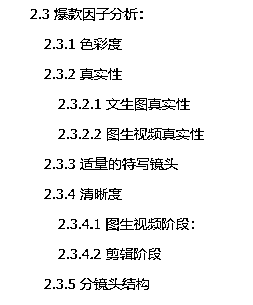

其实我们会发现，即便是同一个赛道，大家对于爆款要素的理解也可能不一致，但只要你基于自己的理解，对这些爆款要素的爆款能力进行了组合、创新、验证，并得到了好的结果，那它就是正确的，就是属于你自己的方法论。

没有谁想要一直活在盲目模仿爆款的阴影下，我们不能帮大家直接找到自己的路，但能通过手册、直播、一对一咨询、社群交流、加餐分享这些辅助手段让大家更快地找到自己的路，我想这就是私教陪跑和圈子存在的重要意义之一。

# 元婴际会，共同飞升的路

有惊无险，不少圈友在前面一个月的时间里或顺利或坎坷地度过了前面的筑基期和结丹期，经历雷劫（YPP审核）的洗礼，成为元婴大能（YPP创作者）。

这里要特别感谢@波妮 @花非花 波妮教练和博哥在我们的“YPP申诉群”里承担起了审核+辅导员的角色，增加了私教陪跑圈内部YPP审核机制，【文档指导+人工审查校对】双重保障一次性通过YPP，帮助超过20位YPP被拒的圈友优化申诉视频，让80%圈友一次性申诉成功

传送门：方波妮【YouTube 申请YPP被拒，成功申述攻略分享】https://wx.zsxq.com/group/1824528822/topic/1525145154284412

在这个阶段，随着曾经大家预想中最难的瓶颈——YPP被完全打通，我们的目标调整为中期复盘中写过的两个：

*   更多的YPP开通人数和账号数，冲刺100个YPP账号——因为我们坚信YPP是通往未来的门票

*   跑通除YPP外的更多变现路径，测试出能够复制和放大的路径——因为手握大量YPP、拥有高质高效内容生产能力的圈友们能快速放大测试出来的结果

我们意识到，凭借我们两位小小教练的精力和时间不可能实现这个目标，但是各位“元婴大能”们联合起来一定可以。

于是我们邀请第一批二十多位开通YPP的圈友，搭建了分组共创机制的雏形，将不同的高价值探索方向划分为了6个小组，每个小组都由具备相关经验的YPP圈友带队测试：

*   方向1：量产YPP（账号矩阵、内容批量生产、直播矩阵）

*   方向2：AI+长视频

*   方向3：YouTube直播带货

*   方向4：短视频爆款赛道开发

*   方向5：音乐商单新玩法测试

*   方向6：营销联盟引流

在分组后不到二十天的时间里，基本上每一个小组都跑出了一些超出我们预期的结果：

*   量产YPP组：跑出了29个YPP账号；

*   AI长视频组：跑出了时长五分钟，纯AI制作，1.9万播放，20美金收益，并仍在持续推流的作品；

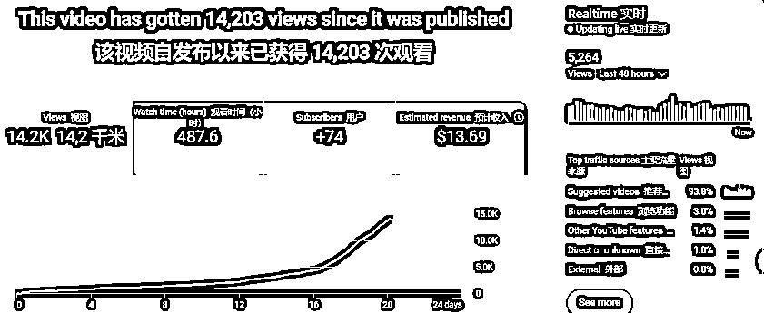

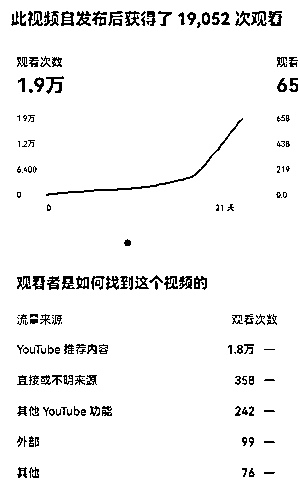

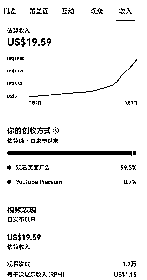

*   直播带货组：和TK团队联动，测试了多个品类的视频和直播带货；

*   短视频爆款组：挖掘出了超过10个近期热门的短视频赛道，小组测试的视频拿到了700万、300万播放；

*   音乐商单组：将解说、故事号YPP收益和音乐商单结合，达到万播3刀的收益（YouTube shorts）；

*   营销联盟组：申请开通了多个营销联盟的账号；

分组之后，大家的热情和执行力，我们设计分组机制的时候完全没有预料到，大家拿到的结果也大大出乎我们意料。

只要把优秀的人聚集在一起，只需稍加引导，就自然会产生好的结果，这或许就是我们在1月初接下私教陪跑这个任务时想象中的最理想画面：

高手齐聚一堂，同谋出海大事；

恰似元婴际会，共议飞升之道。

# 浪潮已至，顺应时代的路

眼下，时代的浪潮携不可阻挡之势滚滚袭来，当今是AI的时代、是出海的时代、是IP的时代。

看到亦仁老大今天在群里立下的flag，第一反应是：亦仁老大还挺保守（哈哈哈开个玩笑）。

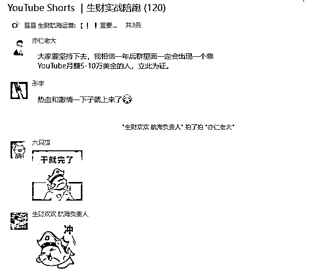

跟大家分享一个有趣的小数据，这是2025年3月5日的微信指数。

作为全球第一的视频平台，油管在国内的普及度竟然20倍低于入局门槛更高的TK和跨境电商。

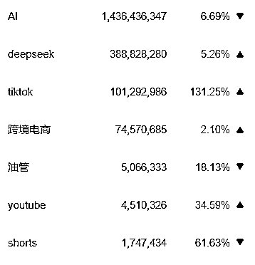

刚好今天看到曹政老师的文章《所谓选对方向，是选对做分子的路》，出海的概念火了这么多年，但油管似乎一直都游离在国人的视线之外，属于“分子”“分母”都不多的赛道。随着YouTube最大的门槛“YPP”被压到如今这般低，只有极少数人能在YouTube赚钱的时代已然成为过去式，在未来几年里，国内YouTube赛道的分子和分母都一定会飞速增长。

11月初，看到亦仁老大关于YouTube的超级标，开始了人生的第一条油管视频创作，YPP开通的1000万播放量门槛在当时看起来是那么的遥远。

那会根本无法想象，在短短4个月后，竟然能够和波妮教练一起带着大家跑出来100+YPP，写下这篇帖子。

我想，最大的原因是油管在国内极低的普及度和它极大的体量之间隐藏着无比巨大的增量机会。如果在11月初，把油管换成任何一个其他的项目，我相信自己不可能会这么快地被大家看见，但是我相信把我换成任何一位圈友来做这一切，都能做到我现在做到的事情，这就是油管和AI的时代红利。

实际上YPP只是一个开始、一张门票，随着YPP在国内数量的增加、门槛的降低，和YPP功能强绑定的油管“带货”功能也将登上各类跨境卖家、TK团队的视野。TK带货现如今迅猛的涨势，恰如国内短视频电商的快速增长期；而油管带货现如今无人问津的场面，也恰如22年视频号带货。能够想象，一旦油管带货的链路跑通，10个YPP就是10X，100个YPP就是100X，1000个YPP就是1000X，这是所有YouTuber的机会，也是所有电商人的机会。

私教陪跑，是我们和生财针对油管布局进行的一次尝试，如今尝试圆满成功，我想是时候向大家公布YouTube赛道下的年度社群产品——YouTube深海圈。不同于私教陪跑专注于交付YPP的跑通，深海圈将把YPP作为最基础的入门环节带领大家简单拿下，进而把更多的交付和资源倾注在YouTube的各种变现链路上，包括带货、音乐商单、AI长视频等等。

我和波妮是大家的教练、导师，亦是辅助大家一起出海搞钱的道友、伙伴，我们将和生财一起，打造出国内第一个，也是国内最高质量的YouTube社群：生财YouTube深海圈，和大家一起抓住这一次YouTube和AI的时代红利，成为亦仁老大口中那个月赚5万美金、10万美金的人。

邀君共谋出海计，凡人应潮上九天。

YouTube深海圈报名链接：https://sourl.cn/ByHuXY

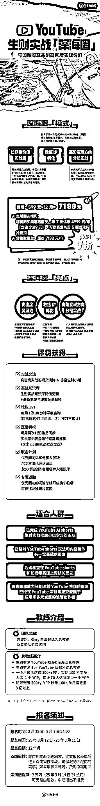