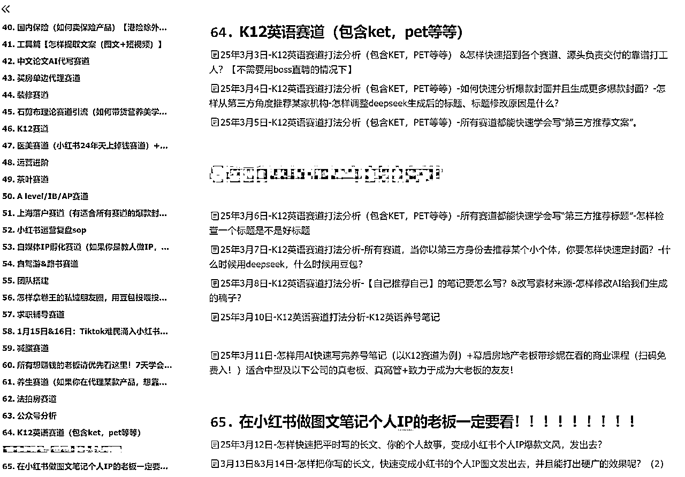
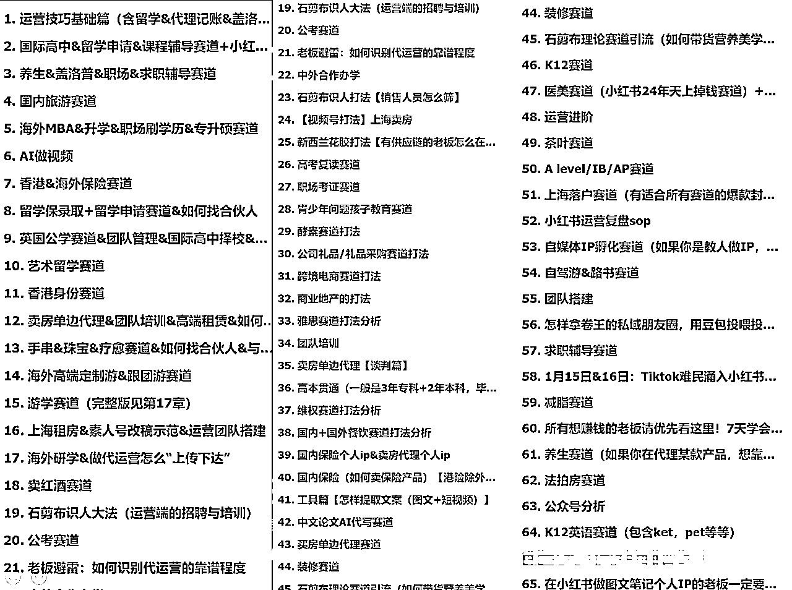
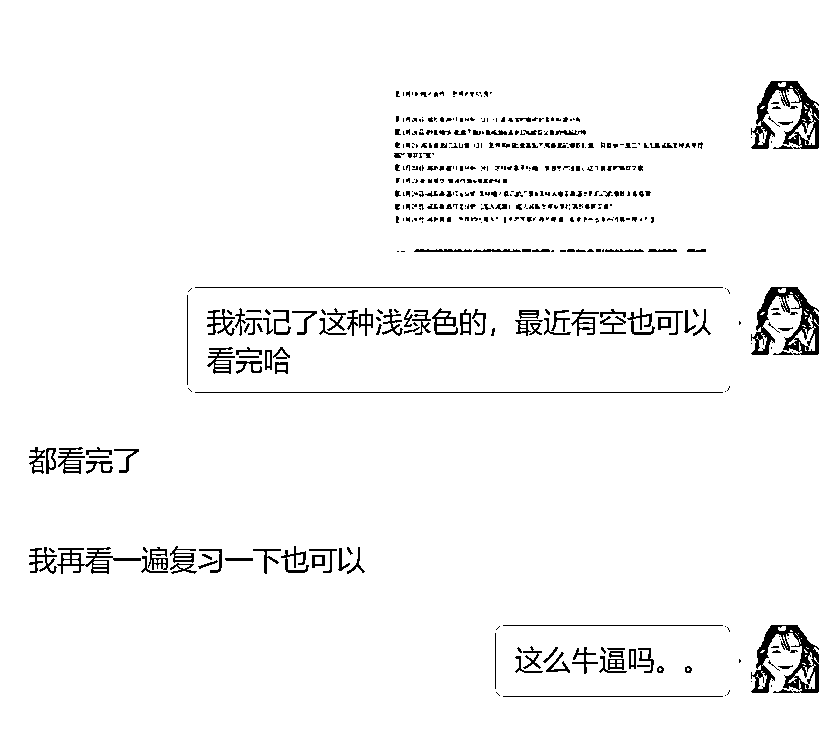

# 老板避雷手册5：如何招聘、筛选小红书运营人员？

> 来源：[https://ncn18orsgwl2.feishu.cn/docx/Cp7CdUqTyoSMSYxh69kcf4vwnj8](https://ncn18orsgwl2.feishu.cn/docx/Cp7CdUqTyoSMSYxh69kcf4vwnj8)

Hi，大家好呀，我是珍妮，1500元起家，在留学和房产赛道，靠自营和代运营，都做出了一些业绩。

感兴趣的友友可以看我过往帖子。

之前因为「老板避雷手册」而被生财邀请上了直播，一年过去了，我面试培养的运营人员越来越多，也因此发现了更多「老板筛人雷区」。

很多老板的生意之所以做不大，是因为他们一开始，在招聘的源头，就招错了人。

一个错误的人，无论你如何管理，如何培养，那都是错误的。

简单介绍一下自己：

我是珍妮子，1500元起家，从0搭建9人运营团队的时候，恰好做的是自营和代运营业务。

我知道一个创业小公司是如何起来的，所以从招聘、筛选、如何给人定薪资、如何管理员工的全套流程，我已经接触了太多太多。

有的老板想找我做企业小红书培训，我第一时间是问他：你的运营人员，是怎样的？

然后我会给他一个清单，告诉他：

“什么样的小红书运营，你可以招。

什么样的人，你不能招。

有些人招进来、给他们花钱做企业培训，就是浪费你的钱，这群人不仅不会有自我迭代能力，而且干一个月就会跑路，但凡你花钱去培养他，你就要随时承担损失。”

今天和大家分享：

1.  怎样用低成本，去招聘一个人？

1.1 更换招聘平台

1.2 扩充招聘渠道

1.3 更换招聘地区

1.  怎样筛选一个小红书运营人员？

2.1 在小细节里设置关卡，先笔试、后面试

2.2 从MBTI角度去筛选

2.3 从盖洛普角度去筛选

2.4 从一个人在微信上的说话风格来筛选

2.5 低成本识别奖惩错逆的员工

1.  怎样控制小红书运营人员的运营成本？

3.1 写一份通用型培训素材

3.2 区分核心写稿主力和非核心主力

3.3 安排配图人员定制好小红书爆款模版

3.4 用云机，去减少人工管理成本

关于如何管理运营人员，这背后又有一些细节，有机会珍妮会另外再分享。

# 怎样用低成本，去招聘一个人？

## 更换招聘平台

不少老板一提起招聘，第一反应肯定是去boss直聘、智联招聘，又或者说看有没有什么公众号、小程序、微信社群、QQ群，可以低价或者免费蹭一蹭招聘资源，这样可以少花一点钱。

但实际上，以上平台珍妮都试过，最后我发现一种：0成本的招聘方法。

这个方法，不仅适合老板，还适合每一位小个体。

做生意，一定得有反向思维。

我们要去思考：怎样可以让人找到我们？而不是我们去找人？

2023年的时候，我因为知道留学赛道迟早会在3-5年内下滑，所以哪怕那一年我们做了1100万营收，哪怕我可以更轻松的度过我的产后时光，我依旧在不停折腾，我在测赛道，我联系了很多留学细分赛道的人，给他们送客资。

我是怎么一下子联系上了这么多留学细分赛道的人呢？

当时我在小红书发帖，我说：

【我的留学生客资多到没法消化了，求留学行业的老板来帮我消化一下。】

这篇小红书做的极其粗糙。

我平时带运营团队都会把小红书笔记写得比这好100倍，但这篇笔记，因为可以给读者带来赤裸裸的利益，所以我随便做了个封面就发出去了。

一天下来，我没给任何人发我微信号，所有人都主动通过小红书上的暗示，自动找到了我微信。

我的小红书号没有因为发微信号而导致违规，可是我却被50-60个留学行业老板、负责人、渠道方加爆微信。

我让他们自报家门，把做什么生意、签约转化率、核心团队介绍全部告诉了我，我让他们自报自己可以给我多少返佣。

在那之后我就开始给小部分机构送客资。

而其他机构，我没给他们送过客资。

如果他们问起来，我就说：我已经找到了稳定的合作方。

我如法炮制。

再一次对外说“我客资消化不过来了，求独立XXX，机构、工作室勿扰”。

我用这个方法筛选了独立化妆师、独立剪辑师等等，甚至准备，等以后我孩子大了，如果要给他请家教，我也这么筛选一波。

## 扩充招聘渠道

在创业初期，我还没有想到可以用“客资消化不过来了，找独立XXX”这个套路去联系各个小个体。

我走的依旧是智联招聘、boss直聘，或者去某些招聘公众号，花400块钱投递招聘广告，招人。

那时候，为了减少投递招聘广告的成本，我还会给【已经招募过来的大学生】发红包，

我去拜托这些大学生，去他们学校内部网络或者微信社群，帮我发广告，

每招聘过来一个人，只要对方在我这干满超过1个月，过了试用期，我又会给【当时帮我招聘的大学生】发提成。

同时，我还会问大学生【你当时是在哪个平台看到的我的招聘广告呀】，

然后他们会告诉我“我在XX公众号看到的”。

然后我才知道：原来我花400块投递招聘广告后，广告商还帮我把广告也投递给了另一个小平台，而那个平台的广告费，如果我单独去联系，发布一个招聘广告只要20块钱。所以如果我囊中羞涩，舍不得花400块去投广告的时候，我就只花20块去投广告。

## 更换招聘地区

2024年7月之前，我住在长沙。24年7月之后，我住在深圳。

长沙和深圳的招聘用人成本，是完全不一样的。

也恰恰是因为我在长沙创业成功，我误打误撞，在创业初期捡了一张成本极低的好牌。

我的第一家公司创立在长沙，所以我在boss直聘发布广告的时候，自动被很多长沙人看到了。

长沙的工资比较低。

所以，我开给员工的基础工资也比较低，线上办公，能拿多少提成，要看他做出多少业绩。

虽然我基础工资低，但是我能判断出一个人一年下来是不是真的用心在工作，

真正用心工作而且创造收益的人，我经常在月底或者年底，私下转大红包。用这种突然掉落的惊喜，去奖励我想带着一块前行的人。

那时候为了能雇到合适的人，我会招聘以下几类人：

1）自己有主业，只是为了来我这兼职，所以我减少了社保开支。而且因为对方特别想把副业做好，所以他会工作特别积极。

2）把我这份工作当主业，从大专到一本不等。他们全部来自偏远地区。这类人我会重点培养，往操盘手方向去带。

3）家境富裕，很有能力，孩子都上初中了，就想找份线上工作干一下。这时候我给对方的运营类工作就比较少，更多给的是一份管理类或者行政的工作。

我在写招聘广告的时候，全部会强调一句：线上工作|不开会不打卡

所以那时候，我不需要买招聘平台的曝光卡，每天找我投简历的人都快把我淹没。

当然这里面还涉及到一些别的招聘小细节，只是不方便在公开平台说，感兴趣的老板可以dd我。

# 怎样筛选一个小红书运营人员？

## 在小细节里设置关卡，先笔试、后面试

有的老板走的还是传统的招聘形式，比如先看简历，然后再聊一聊，接着再笔试啦等等。

这些流程我都不做。

简历，是虚的，是可以包装的。

我们要招的是小红书运营人员，是负责执行的人，不是负责当管理层的人。

那么这样的运营人员，必须要执行力超强。

一个简历包装得特别强大，但执行力很差的人，是不适合做小红书运营的，ta也许适合去当管理层，去监督别人干活，又或者适合去别的岗位，但不适合去一线做小红书运营。

所以我不看别人的简历。

只要有人来找我，我就会设置层层关卡，把最有诚意的人吸引过来，能过关的人，我再让他们加我的微信。

笔试过关了的人，我才会回过头看一眼他们的简历。

举个例子，应聘者在boss直聘找我聊天，我不会和他们聊，我只会给一个暗示，让他们找到我的邮箱，去邮箱里给我发一段自我介绍，把往期作品发过来，并且上传自己的简历。

我还会要求他们按照固定的格式往我的邮箱发送内容，比如我会要求：

邮件主题命名为：你的学校+名字+手机号。

要把简历转成PDF形式发过来。

自我介绍低于200字。

接着我会开始筛人，找出最细心的人。

细心的人会完全按照我的格式要求来办，不细心的人会上传一个word文档的简历给我，又或者把自己的学校落下，还有的会把自我介绍长篇大论，写1000多字。

细心的人，我会把我的微信发给他们，让他们加我。

不那么细心的人，我会看一眼他的作品和自我介绍，通过娃姐（ayawawa）的石剪布理论，快速判断一下：眼前这个人是什么属性，适不适合做小红书运营。

如果比较适合做运营，我也会给他们我的微信，如果通过笔试，我依旧不会给他们特别重要的活，而是会一步一步观察他们。

特别粗心的人，我就不回消息了。

接着我会把设计好的笔试题发给他们，和他们说：

【你觉得什么时间你能完成？】

有些人会和我说：今天下午6点前。

我说“好的，那我给你定的截止时间是今晚8点，8点之前交稿，笔试稿过关，我会付你费用。8点之后，不用再投稿”。

很多人对自己的时间估算不精准，他们觉得下午6点能做完的活，往往真不一定能做完，所以我会往后给他们延长2个小时。

过了延长时间还不能按时交稿，那就不是我要找的人。

所以，我用这个方法，又淘汰了一批不守时的人。

小红书运营的一线人员，必须得执行力强，也必须守时。

我们招聘不同的工作岗位，要根据每个岗位的特点，去筛选不一样的人，抓大放小，只要方向对了，有的事情就睁一只眼闭一只眼。

笔试稿过关，我才会仔细看一下他们的简历，然后和他们谈工资。

一般前20篇笔记是试用期，前20篇笔记写完后，能过关的人，我会转成长期全职或者长期兼职。

## 从MBTI角度去筛选

我测过我们公司，做运营做得好的人的MBTI，

这里涉及到一些具体的MBTI属性，珍妮没法明说，感兴趣可以私聊珍妮。

但是总之：没有J属性，很难做好执行层面的一线运营岗。

由于运营岗位的人往往需要管理手机，及时回复小红书消息，所以就很需要运营岗的人还得是个I人，比如我司全员I人。

如果是个E人，他们很难管好手机，因为他们更想今天出门玩玩，明天出门玩玩，他们更适合去当销售，多和人打打交道。

但如果有老板就是想雇佣眼前的E人怎么办呢？

答案是：如果我们有一个I人去管手机，那么此时E人也是可以写稿子的，可以让E人试一试。

但如果让E人去回复小红书用户的消息，就是公司亏损的开端。

## 从盖洛普角度去筛选

盖洛普有4个条，执行力的条如果排在第一第二，就越适合做一线运营。

如果执行力排在第三第四，就不那么适合在一线做运营岗位。

举个例子，这是珍妮创业成功前（21年2月）的盖洛普，执行力排在了第三，那时候月收入最高也就是1.8万，就已经到了我的天花板了。

这是珍妮创业成功后（23年9月）的盖洛普，被社会毒打到执行力到了第二，战略思维也有了一点长进。

现在已经25年了，我没有再去测盖洛普，因为干活比较重要，我不再关注我的盖洛普有什么变化，我更关注：今天我做了什么事，这个事情有没有给人创造他们需要的价值？这个价值大不大？

我曾经花时间看了一下盖洛普的书，了解到：责任，专注，信仰，成就天赋在盖洛普前10的人，都执行力强。

这里珍妮不能拓展太多，感兴趣的老板可以去看盖洛普相关书籍。

## 从一个人在微信上的说话风格来筛选

在一线做运营这件事情上，一个初次加上HR微信、就喜欢找HR提问题，或者反问HR问题的人，是不太适合做运营岗位的。

这类人更适合去当销售，因为他们很有进攻意识。

但做运营的人，如果一上来就反问HR这这那那的问题，而不是先去执行，那就代表“这个运营人员多半不能指哪打哪”，得排除掉。

还有的人，他加上HR的微信后，就开始提问，比如要看公司营业执照，然后问“我们会不会骗ta，是不是画饼”blabla。

这样的人多半都非常内耗，不是好的运营人员。

一个会对从未谋面、加上微信的HR，去聊“自己之前上当受骗、被人画饼”的人，多半也是有些奇怪的。

因为上当受骗的根本原因都是因为贪心了自己能力范围内够不到的事情。

一个成年人偶尔上当受骗容易理解，但如果总是上当受骗、被人画饼，那多半是这个人本身的问题。

面对素未相识的HR倒苦水，说自己被骗、被人画饼的遭遇，然后反问HR“你们会不会骗我”，

这就是【交浅言深，内耗王者】的征兆，需要HR及时避雷。

还有的人，说话打字不空行，不分段，不加标点符号，密密麻麻一大片字发过来。

这都是没有同理心的表现。

没有同理心的人很难做好小红书运营，

## 低成本识别奖惩错逆的员工

当我们把一群人初步筛选出来后，又会遇到一个新的问题，你会发现：

有一些人，是你给他的钱和资源越多，他对你越好。这类人要重用。

有一些人，是你给他的钱和资源越多，他对你越差。这类人奖惩错逆，要远离。

比如珍妮遇到过：

我看A干活挺踏实的，我给A的钱就比市场价高，因为我想长期用A。

结果A转手把活外包给别人。我不介意外包，只要能帮我把质量把控好就行。但是A外包之后，就不再检查产品质量了。每次都需要我来检查产品质量，需要我来提出问题。我提出问题后，A的态度又很好，说“马上就改，改到满意为止”，然后每次都会犯同样的错误。

一般遇到A这一类人，我就会开始找备胎，等我找到下一个如意的，我就马上和A说拜拜。

那么怎样把这些不合适的人都筛选走呢？

答案是：

在初期，给一个小任务。这个任务是这个人他没法靠自己能力、去拿到的利益。

比如一个活只值10块钱，我给40块，我看对方能不能知道自己是多得了。

如果他知道，他下次接我的活就会很有干劲。

如果他不知道，他就会习惯了我对他的这份好，开始为所欲为，摆烂划水，

等我不给他派活或者把他裁员的时候，他还会抱怨我，对我发脾气，怪我给他安排的工作耽误了他时间。

我会平和的和他们解释：你很好，是我遇到了难处，blabla。

但心里会把他们拉入黑名单，不会再给他们任何新的工作机会。

创业，人不对，啥都白费。

不和错误的人前行，就是对创业者精力的最大保护。

这种“低成本识别奖惩错逆”的人的方法， 我日常生活中也经常用，避免了我在大事上，遭受损失，

因为我用几十上百块的损失，测试出了一些人。

# 怎样控制小红书运营人员的运营成本？

## 写一份通用型培训素材

来一个小红书运营人员，就要培训一次吗？

写了一份培训素材后，发现运营人员没法自己迭代，该怎么办？

新进来的员工也在犯老员工犯过的错误，要怎么和他沟通？

我曾经在这些事上走过很多弯路，耽误了我很多精力。

24年年初那会，我意识到：如果我再这样培训人，哪怕我写了一个傻瓜式项目运营教程，但是矩阵号的运营打法时刻在变，远不是说“我们想更换运营打法就能更换成功的，甚至很多时候迭代打法都要做无用功”。

迭代打法是非常难的事情，绝大多数运营人员都会迭代失败，包括曾经的我。

如果不能成功迭代，那么打法一旦失效，就会开始陷入内卷，平台不会分多少流量给我们，运营成本会不断增加，导致公司亏钱。

我作为负责带运营团队的人，

如果我不能把里面的底层逻辑全部拆开说明白，

那么每来一个新人，都会指望我三个月后去迭代运营打法，那我就抽不开身了。

所以，我从24年开始，一周六更我的付费社群，这是一个小圈子，有不同行业的老板和操盘手在里面，听我分享不同赛道可以落地的运营打法。

我把这些内容全部写成了喂饭式教程，很多都是我的实操经验。

所以我司的运营人员，我会告诉他们：

你要先看xx文档，再看xx文档。

如果我遇到他们在某个运营细节上反复犯错，我会说：

你去看xx文档。

如果我发现了「某个很适合我们赛道的运营打法」，我会转发给运营人员，说：

明天复刻这个打法，把ta用到房产赛道。

这极大减少了我的运营培训成本，甚至有大学生，利用3个多月，把我更新了一年多的内容看完了，也让我得以能很快培训他上路。

## 区分核心写稿主力和非核心主力

不是所有人都擅长做运营，不是所有人都运营天赋值达到80分。

但想要快速获客，就要把40分的人也能培养到60分的效果，广泛铺笔记，量大出奇迹。

所以我们要区分好：

1）谁是核心写稿主力

2）谁是非核心主力

要让核心主力去写有灵魂的稿子，让非核心主力负责拿AI洗稿「核心主力写出来的爆款」就好。

这样可以大大减少培养运营人员的成本。

针对核心主力，我们得用心培养，平时除了教ta运营技能，还要教ta一些识人用人的方法。如果有机会，后续我会再说。

## 安排配图人员定制好小红书爆款模版

我司的小红书封面模板一般都会找人提前做好，全部做成可画模板。其他人只需要去可画里复制副本，自己编辑一下就好。

我在2024年的时候，因为一周六更分析小红书不同赛道的运营打法，所以这些赛道的爆款封面有哪些，有什么共同特点，我都熟悉。

与此同时，我还知道：

「A赛道的封面能用到B赛道，但不能用到C赛道」的具体原因。

所以我在筛选封面时，也会一开始就淘汰不合适的封面。

因为有了这些认知，所以我们可以避免不必要的努力，从而节约自己的精力。

## 用云机，去减少人工管理成本

我们有一位程序员，做了一个云机系统，降低我们的设备成本，这样我们铺素人号之后，也不需要配太多手机和手机号。

但这个系统正在测试中，感兴趣的友友可以后续围观。

# 致谢：

感谢生财有术。

因为在生财有术发帖，我遇到了带我做项目的老板们，他们都来自不同的高客单领域，而我也因此接触到了很多好机会，通过做代运营，我得以更加深入了解了这些行业，并且拿到背后的高额返佣。

感谢给我机会的各行业老板。我本来只是局限于留学赛道，但现在我遇到了更多机会，也借此发现了各个赛道之间互通的流量成交密码。

感谢和我一起接代运营的友友们。只靠我一个人，靠内部团队，体量太小，接不了这么多代运营，但因为有更多优秀的伙伴们一块前行，所以能遇到的好项目也越来越多。

感谢在这条路上，一路能和你们一块前行。