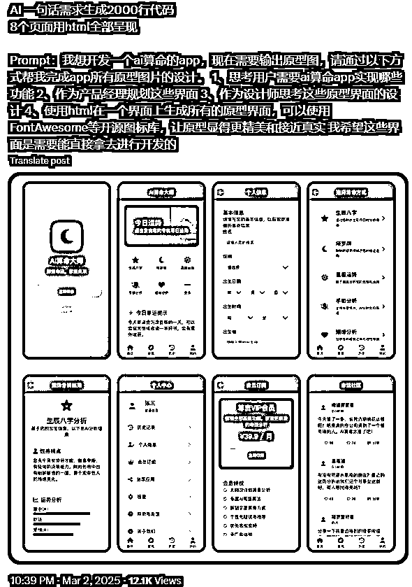
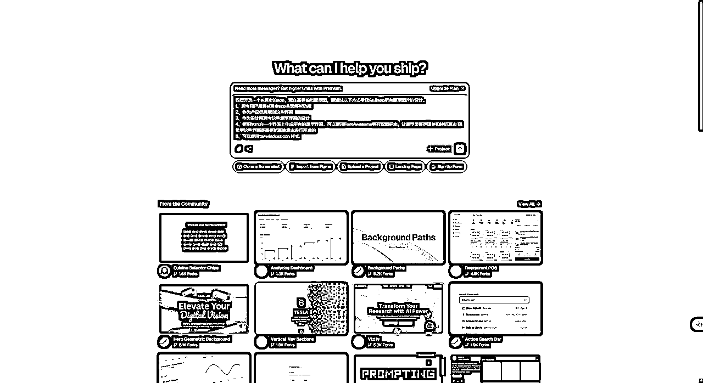
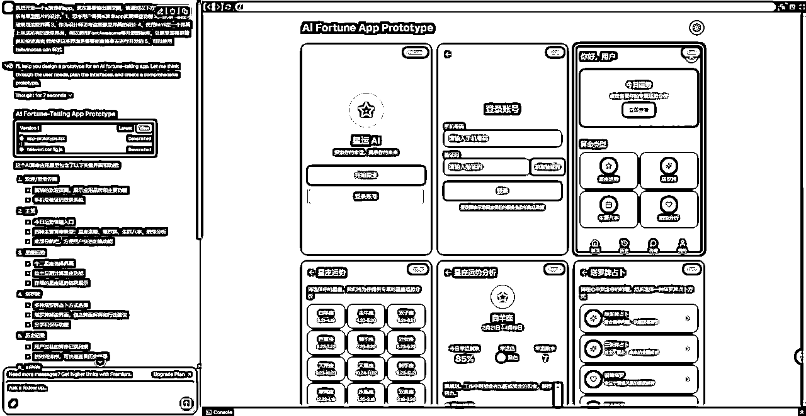

# 利用 V0，轻松产出产品原型和UI,助力AI编程开发

> 来源：[https://hqhhkfm2ink.feishu.cn/docx/PnXvde6Iao4gt9xdIrRczRwHnzL](https://hqhhkfm2ink.feishu.cn/docx/PnXvde6Iao4gt9xdIrRczRwHnzL)

# 起因

今天在X看到了有人使用了cursor + Claude 3.7 直接产出了一个APP 的原型图和UI。



# 实操

那我就想着用V0试试效果如何。提示词如下

```
我想开发一个ai算命的app，现在需要输出原型图，请通过以下方式帮我完成app所有原型图片的设计。
1、思考用户需要ai算命app实现哪些功能 
2、作为产品经理规划这些界面 
3、作为设计师思考这些原型界面的设计 
4、使用html在一个界面上生成所有的原型界面，可以使用FontAwesome等开源图标库，让原型显得更精美和接近真实 我希望这些界面是需要能直接拿去进行开发的 
5、可以使用tailwindcss cdn 样式
```

打开 V0 ： v0 by Vercel



回车，等待V0 输出原型图。



效果看起来还是不错的，而且也有交互的流转效果。

但是后面我又多尝试了几次，发现后面都是单页面，不是这种所有页面都在一个页面展示出来的形式了。


但是好像也可以。

大家可以去尝试尝试。