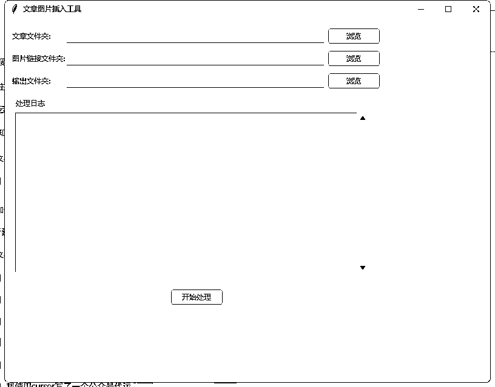

# 如何利用cursor实现文章中自动批量插入图片

> 来源：[https://si06f5z4e71.feishu.cn/docx/UD7vd0bajo0Z56xhirCcyB2bnZd](https://si06f5z4e71.feishu.cn/docx/UD7vd0bajo0Z56xhirCcyB2bnZd)

# 代运营批量文章插入图片是一个痛点

公众号代运营在文章中自动插入图片是一个痛点，也是我的一个痛点，通过对cursor学习以后，我实现了文章的插图和自动排版。主要是利用了两个点：

1.先将图片链接插入到txt文档中

2.将图片转换为html格式

3.在96编辑器做还原（这里主要是借鉴了猫哥的方式）

4.运行后，可以看到GUI界面，

注意每个文档是一篇文章的图片链接，然后根据文章文件名称和图片的文件名称对应匹配插入。

文末有脚本的源代码，大家自行下载使用！

import os

import random

import tkinter as tk

from tkinter import filedialog, ttk, messagebox

def insert_images_into_text(text_file_path, image_links_file_path, output_file_path):

try:

# 读取文章内容，保持原有格式

with open(text_file_path, 'r', encoding='utf-8') as f:

text_content = f.read()

# 读取图片链接并去重

with open(image_links_file_path, 'r', encoding='utf-8') as f:

image_links = []

used_links = set()

for line in f:

link = line.strip()

if link and link not in used_links:

image_links.append(link)

used_links.add(link)

# 随机选取3-5张图片

if len(image_links) > 5:

num_images = random.randint(3, 5)

image_links = random.sample(image_links, num_images)

elif len(image_links) > 3:

num_images = random.randint(3, len(image_links))

image_links = random.sample(image_links, num_images)

# 如果图片数量小于等于3，保持所有图片

# 将文章分割成段落，保持原有的换行符

paragraphs = text_content.split('\n')

# 计算插入位置

# 只计算非空段落的数量来确定图片位置

non_empty_paragraphs = [i for i, p in enumerate(paragraphs) if p.strip()]

total_paragraphs = len(non_empty_paragraphs)

total_images = len(image_links)

insert_positions = []

if total_images > 0:

step = total_paragraphs / (total_images + 1)

for i in range(total_images):

pos = non_empty_paragraphs[int(step * (i + 1))]

if pos >= len(paragraphs):

break

insert_positions.append(pos)

# 插入图片

final_content = []

image_index = 0

for i, paragraph in enumerate(paragraphs):

final_content.append(paragraph)

if i in insert_positions and image_index < len(image_links):

final_content.append('') # 图片前的空行

final_content.append(image_links[image_index])

final_content.append('') # 图片后的空行

image_index += 1

# 写入新文件

with open(output_file_path, 'w', encoding='utf-8') as f:

f.write('\n'.join(final_content))

return "success"

except Exception as e:

return f"error: {str(e)}"

class ImageInserterGUI:

def __init__(self, root):

self.root = root

self.root.title("文章图片插入工具")

self.root.geometry("800x600")

# 创建主框架

self.main_frame = ttk.Frame(root, padding="10")

self.main_frame.grid(row=0, column=0, sticky=(tk.W, tk.E, tk.N, tk.S))

# 文件夹选择区域

self.create_folder_selection()

# 日志显示区域

self.create_log_area()

# 执行按钮

self.create_execute_button()

def create_folder_selection(self):

# 文章文件夹选择

ttk.Label(self.main_frame, text="文章文件夹:").grid(row=0, column=0, sticky=tk.W, pady=5)

self.articles_path = tk.StringVar()

ttk.Entry(self.main_frame, textvariable=self.articles_path, width=60).grid(row=0, column=1, pady=5)

ttk.Button(self.main_frame, text="浏览", command=lambda: self.browse_folder(self.articles_path)).grid(row=0, column=2, padx=5, pady=5)

# 图片链接文件夹选择

ttk.Label(self.main_frame, text="图片链接文件夹:").grid(row=1, column=0, sticky=tk.W, pady=5)

self.images_path = tk.StringVar()

ttk.Entry(self.main_frame, textvariable=self.images_path, width=60).grid(row=1, column=1, pady=5)

ttk.Button(self.main_frame, text="浏览", command=lambda: self.browse_folder(self.images_path)).grid(row=1, column=2, padx=5, pady=5)

# 输出文件夹选择

ttk.Label(self.main_frame, text="输出文件夹:").grid(row=2, column=0, sticky=tk.W, pady=5)

self.output_path = tk.StringVar()

ttk.Entry(self.main_frame, textvariable=self.output_path, width=60).grid(row=2, column=1, pady=5)

ttk.Button(self.main_frame, text="浏览", command=lambda: self.browse_folder(self.output_path)).grid(row=2, column=2, padx=5, pady=5)

def create_log_area(self):

# 创建日志显示区域

log_frame = ttk.LabelFrame(self.main_frame, text="处理日志", padding="5")

log_frame.grid(row=3, column=0, columnspan=3, sticky=(tk.W, tk.E, tk.N, tk.S), pady=10)

self.log_text = tk.Text(log_frame, height=20, width=80)

self.log_text.grid(row=0, column=0, sticky=(tk.W, tk.E, tk.N, tk.S))

scrollbar = ttk.Scrollbar(log_frame, orient=tk.VERTICAL, command=self.log_text.yview)

scrollbar.grid(row=0, column=1, sticky=(tk.N, tk.S))

self.log_text['yscrollcommand'] = scrollbar.set

def create_execute_button(self):

# 创建执行按钮

ttk.Button(self.main_frame, text="开始处理", command=self.execute_process).grid(row=4, column=0, columnspan=3, pady=10)

def browse_folder(self, string_var):

folder_path = filedialog.askdirectory()

if folder_path:

string_var.set(folder_path)

def log(self, message):

self.log_text.insert(tk.END, message + "\n")

self.log_text.see(tk.END)

self.root.update()

def execute_process(self):

# 检查路径是否都已选择

if not all([self.articles_path.get(), self.images_path.get(), self.output_path.get()]):

messagebox.showerror("错误", "请选择所有必要的文件夹路径")

return

# 清空日志

self.log_text.delete(1.0, tk.END)

try:

result = match_and_insert_images(

self.articles_path.get(),

self.images_path.get(),

self.output_path.get(),

log_callback=self.log

)

messagebox.showinfo("完成", result)

except Exception as e:

messagebox.showerror("错误", str(e))

def match_and_insert_images(articles_folder, images_folder, output_folder, log_callback=print):

try:

if not os.path.exists(output_folder):

os.makedirs(output_folder)

# 获取所有文章文件

article_files = {}

log_callback("文章文件列表：")

for file in os.listdir(articles_folder):

if file.endswith('.txt'):

name = os.path.splitext(file)[0]

article_files[name] = os.path.join(articles_folder, file)

log_callback(f" - {name}")

# 获取所有图片链接文件

image_files = {}

log_callback("\n图片链接文件列表：")

for file in os.listdir(images_folder):

if file.endswith('.txt'):

name = os.path.splitext(file)[0]

image_files[name] = os.path.join(images_folder, file)

log_callback(f" - {name}")

# 显示匹配结果

log_callback("\n成功匹配的文件：")

matched_files = set(article_files.keys()) & set(image_files.keys())

for name in matched_files:

log_callback(f" - {name}")

log_callback("\n未匹配的文章文件：")

unmatched_articles = set(article_files.keys()) - set(image_files.keys())

for name in unmatched_articles:

log_callback(f" - {name}")

log_callback("\n未匹配的图片链接文件：")

unmatched_images = set(image_files.keys()) - set(article_files.keys())

for name in unmatched_images:

log_callback(f" - {name}")

# 匹配文件并处理

processed_count = 0

for name in matched_files:

output_file = os.path.join(output_folder, f"{name}.md")

# 调用原有的插入图片函数

result = insert_images_into_text(

article_files[name],

image_files[name],

output_file

)

if result == "success":

processed_count += 1

log_callback(f"成功处理: {name}")

else:

log_callback(f"处理失败: {name}, 错误: {result}")

return f"完成处理 {processed_count} 个文件"

except Exception as e:

return f"错误: {str(e)}"

if name == "__main__":

root = tk.Tk()

app = ImageInserterGUI(root)

root.mainloop()

# 脚本链接：