# 纯小白第一次做在线站，与顶级程序员cursor同事的沟通复盘

> 来源：[https://oqe2a3ttv4.feishu.cn/docx/Tlh5dns56o4XUAxKVOVcYdCOnSb](https://oqe2a3ttv4.feishu.cn/docx/Tlh5dns56o4XUAxKVOVcYdCOnSb)

## 一、废话讲一点

因为之前参加了YOUTUBE航海，所以自己本身就有提取视频帧的功能需求，就打算自己做一个这样的网站。

我开始做网站的时候，AI开发网站的航海手册只开放了一部分试看，但看了这一部分之后，瞬间给我来灵感了。因为通过AI做了YOUTUBE视频，所以怎么和AI沟通，我内心没有那么多OS，也没有用教练说的非常规范的格式。

我选择了简单粗暴...（后来想想，其实根本不懂教练为什么要说的那么全面的意义在哪里，因为即使问了我也看不懂，但只要做了几个网站之后，很多关键信息就要在一开始就问清楚，才会事半功倍。）直接把我之前用的视频帧提取网站发给了cursor，让他帮我做个这个...毕竟前路什么都未知，先从使用起来再说，就像孩子问大人，别脸红，想问什么就问什么。

之前的聊天记录翻了很多次，系统都奔溃了，因为没想着要写复盘，所以都没有记录。我花20美元月费的cursor，500用量早就用完了，一直现在在用的是slowly的……大概是因为实在太多了哈哈……所以我整理了下能翻到的，做一个总结。

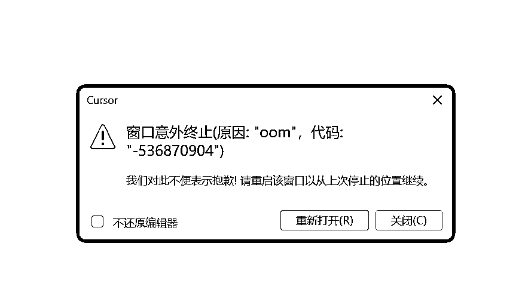

## 二、以为几小时能搞定，结果陆续花了7天才正式上线

跑通本地提取视频帧网站，我就花费了1、2个小时时间，我是超级开心的。

但是！后面部署上线，原来才是大头！！真正部署成功上线，我整整花费了2天半的时间！后面各种优化又出现了系统奔溃，BUG不断，我也差点奔溃。

在这2天半的时间里，我的心态：

从我必须要把你搞定——到怀疑AI到底行不行——再到我就不相信我不行——最后到跟着AI一起思考去搞定——才搞定上线。

不过正因为一周的时间消耗，让我弄懂了很多关系，也懂了“部署”两个字的意思。

第二天我开始部署上线。当然对于小白来说，cloudflare,versel,cloudflare r2,github……这些根本不懂其真正含义，这些平台的关系根本理不清，所以AI说什么，我就做什么。

## 三、我与AI程序员同事的交流集合

### 1、简单粗暴模式：

当你看了AI给你的方案之后，你自己一步步去页面上设置，但是看不懂的时候，请直接截图，红框标注出来，问他就行。

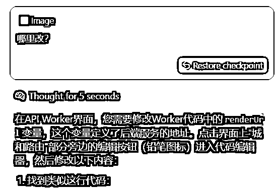

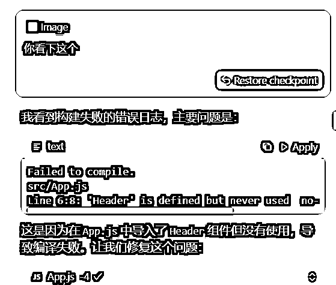

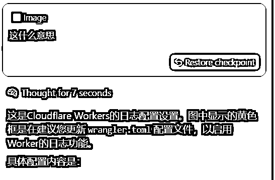

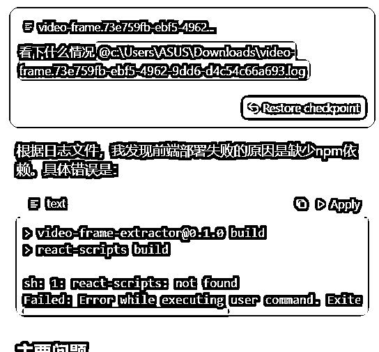

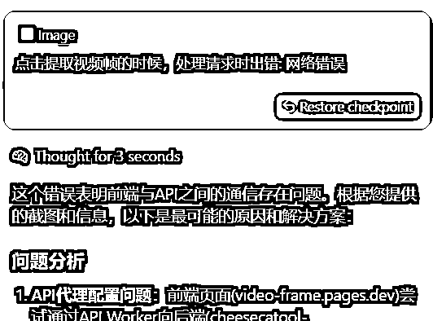

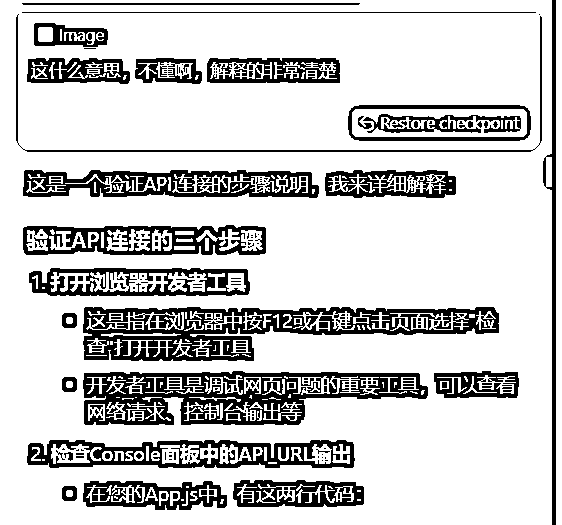

### 2、质疑模式：

当AI做的执行，你一个小白都发现感觉乱七八糟的，这个时候，你可以反问他，这个到底是什么情况，有没有问题，让他自己重新全部排查一遍，你就能知道你的感觉对不对！毕竟小白真的不知道前路还有多长的BUG等着自己，先跟着感觉去命令AI就对了。

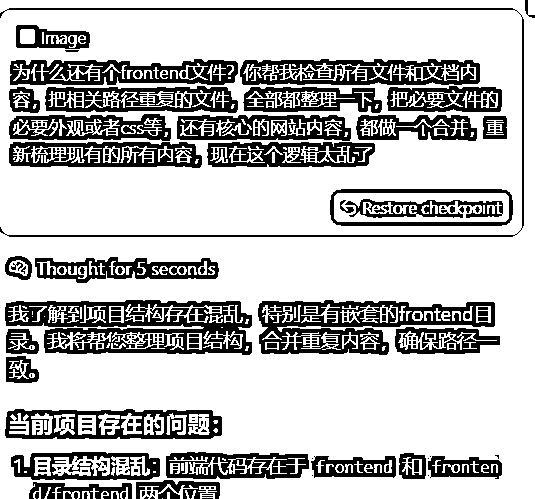

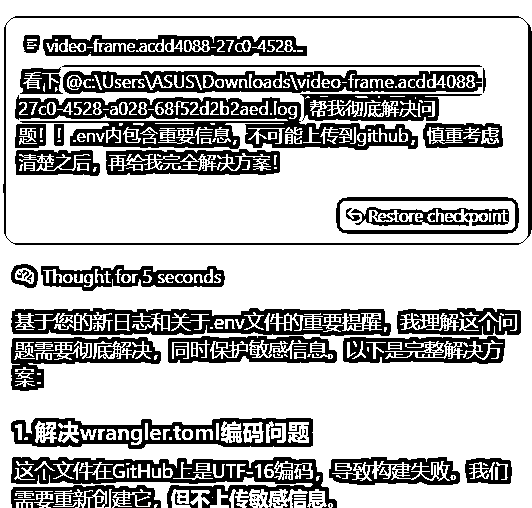

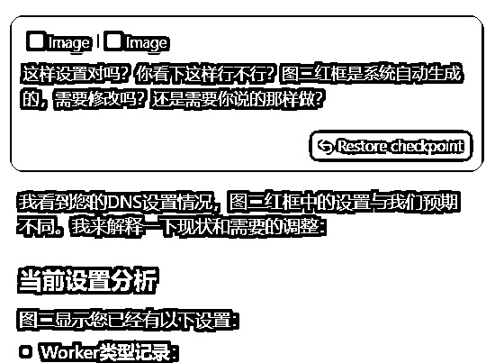

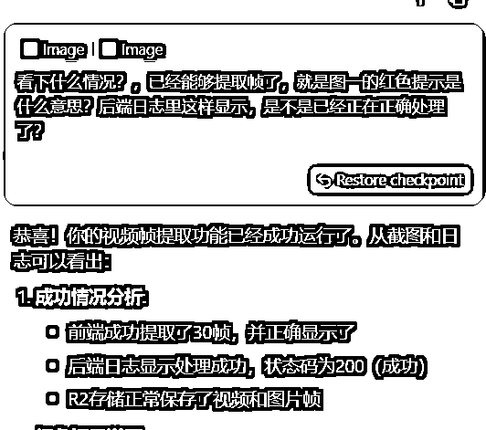

### 3、偷懒模式：

“刚开始启动的时候”和“渐入佳境时”，给AI关键词：“执行和测试……”，这个时候，你只要点击鼠标accept就行。

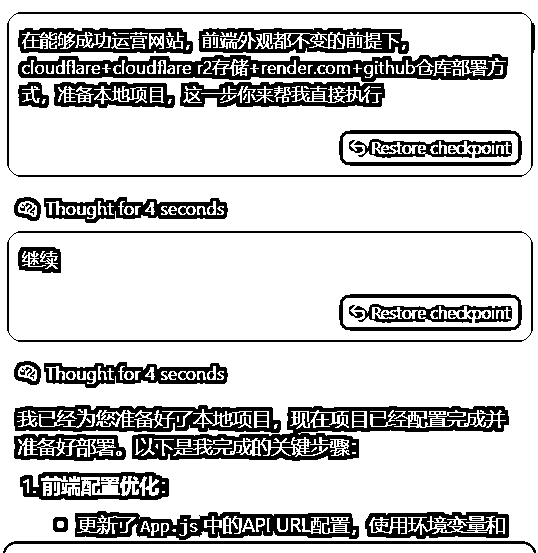

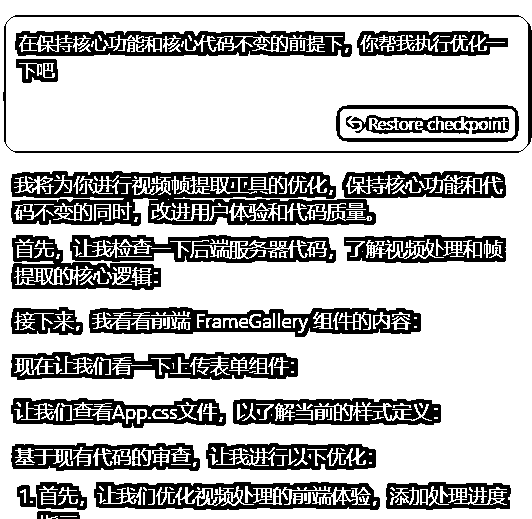

### 4、人工纠错自我拯救模式：

当你已经和AI沟通时间过长时，你自己在反复操作反复失败的过程中，你也能发现一些问题点，可以尝试问AI，是不是对应问题，也许一下子就能从无止境的修改BUG中走出来，所以修改BUG其实也是在自我进步中。

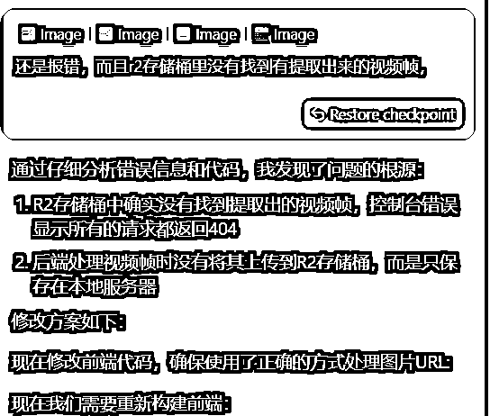

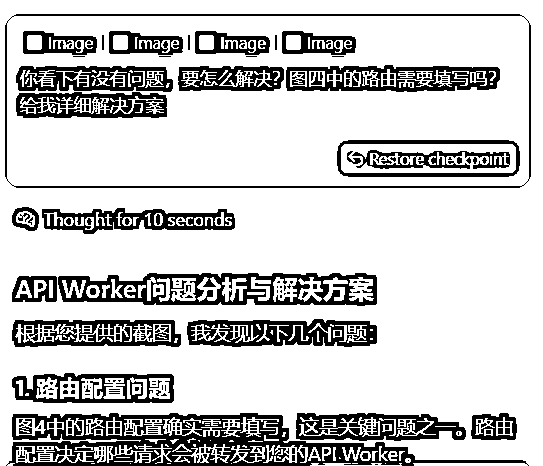

### 5、命令模式

当你有明确的要求的时候，可以罗列1、2、3……步骤，可以让AI一次性去执行。

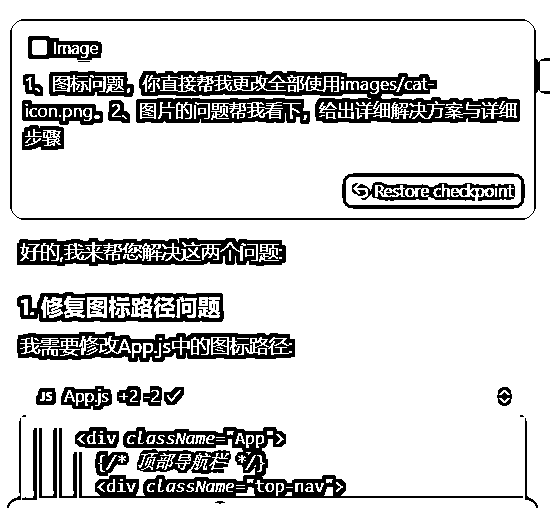

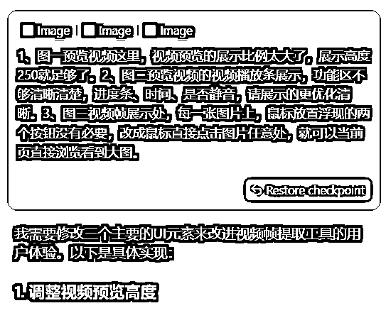

## 四、避坑要点：

经过了7天的“痛苦且欢乐”地挣扎，终于搞定了，昨天发了一条生财朋友圈，七天留言说可以分享一下复盘，我就觉得不管我做的每一步对不对，或者对大家有没有帮助，也都写一下吧，也算是纯小白日志记录了，实在不好意思，真的一点不懂的我……

### 1、不要太相信AI，每一个小MVP都先备份一下

新建一个关键环节备份文件夹，每走通一个小环节，都备份一下，以防万一。虽然现在cursor更新出来，只要你返回原来问题，所有代码“貌似”都会复原原来的，但是有时候还是会出现恢复不了的情况，所以别太相信他！

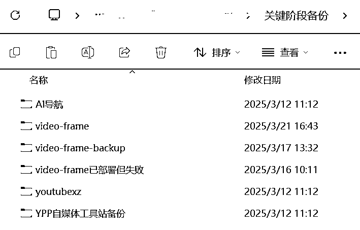

### 2、对话时一定要有大前提，不然AI总会给你些额外想法可能是你不想要的。

我通常用的是claude3.7，沟通下来更智能，执行方面更好。但是！特别有自己的想法，当你想改一个UI上的小细节，其他根本不要改动的时候，他会给你来个“惊喜”，只能又重新提问。

所以如果你不想要什么，你可以反复强调，反复强调就对了。

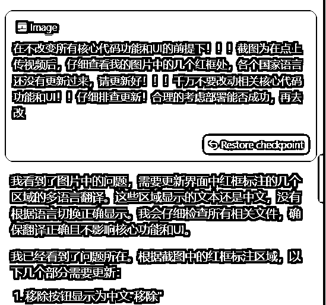

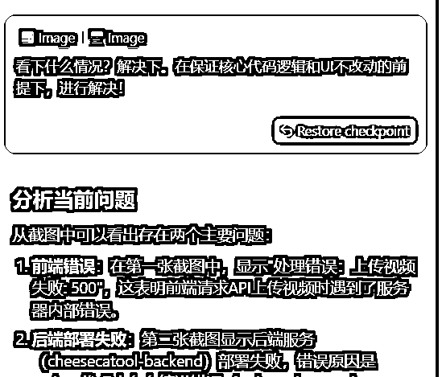

### 3、做之前先问清楚实现逻辑和免费部署指南

前期做网站，还不知道流量需求方面能不能有结果，肯定先0元搞定是最好的，所以我们在有想法的时候，可以先问下这个在线网站免费部署实现的最佳方案有哪些，可以让AI给建议，然后再去设计相对应的功能，会事半功倍很多。

### 4、先中文还是先英文的问题

另外，英文不好的人，看到英文真的头大，所以我在做网站的时候，先生成的是中文版本的，再去实现各国翻译功能的。但实现各国翻译功能的时候，把我的核心功能代码和UI也搞BUG了，我瞬间有点气炸，还有每个中文显示区域都需要排查反复很多遍，才能搞定。

所以我想，其实在一开始的时候，就可以直接让AI做各国版本了，这样的逻辑去做，会比先全中文，再加入各国翻译版本组建，要更方便。这个是我接下来要做新网站的时候，去跑测试的逻辑，看下哪个更合适。

AI时代，真的太方便了，只要你有好的想法，想要自己动手去实现，再也不是一件遥不可及的事情！也非常感谢生财，让我们与AI认知直接缩短咫尺距离，通过航海，又能有这么多高手亲自带领，满满安全感，目标方向感也更明确！！