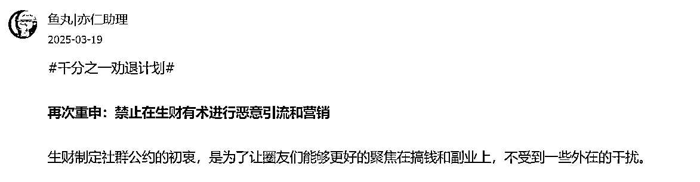
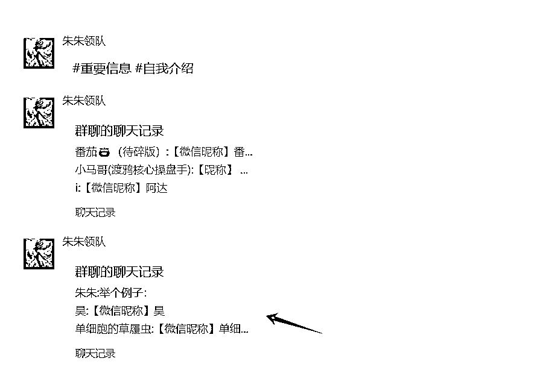
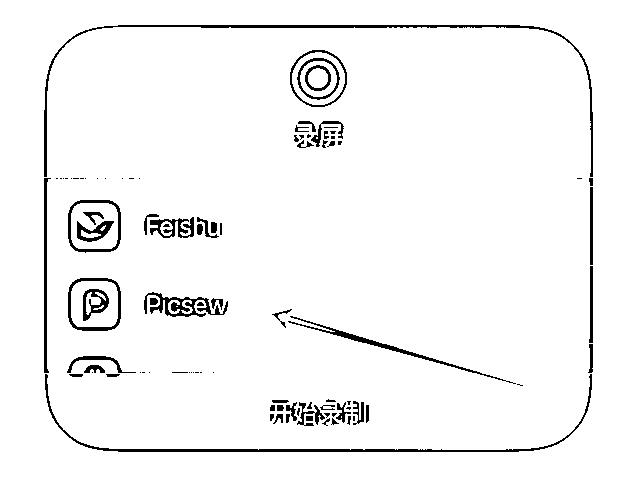
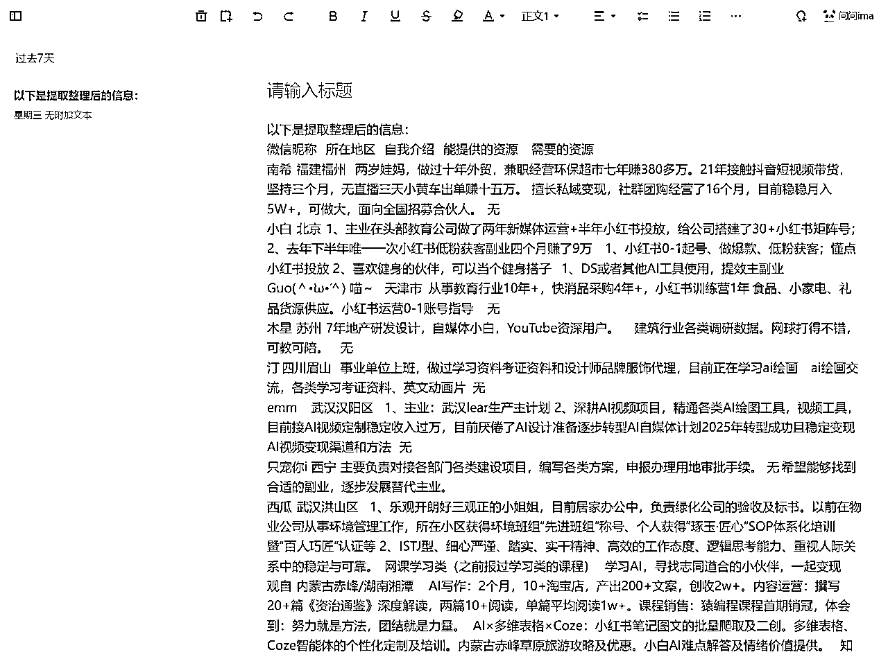
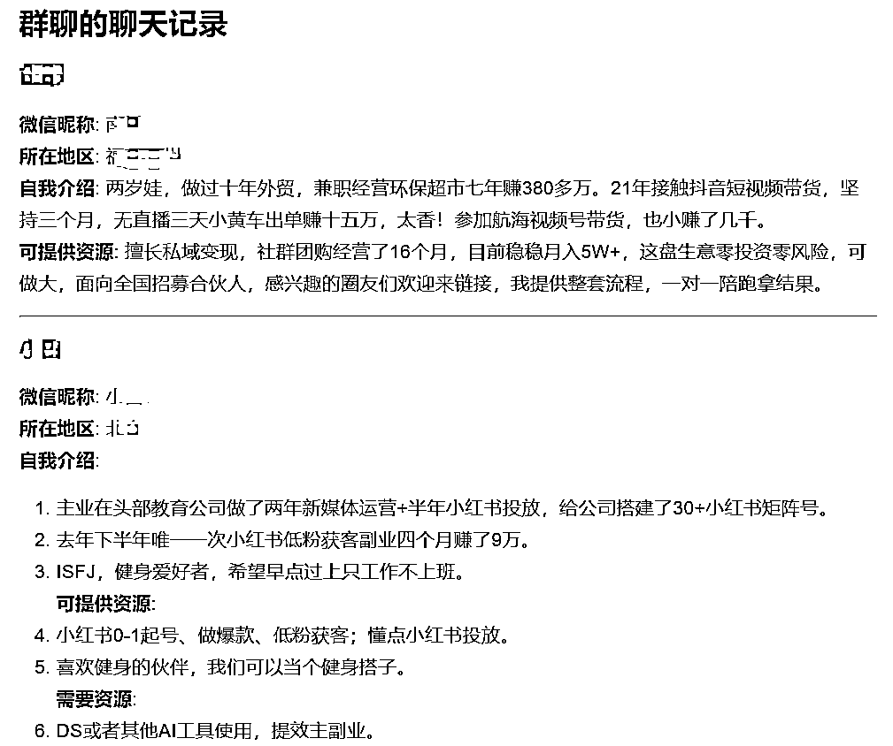
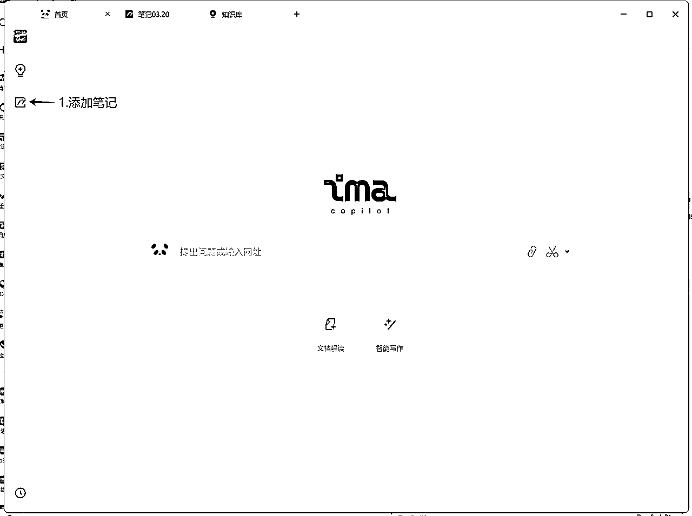
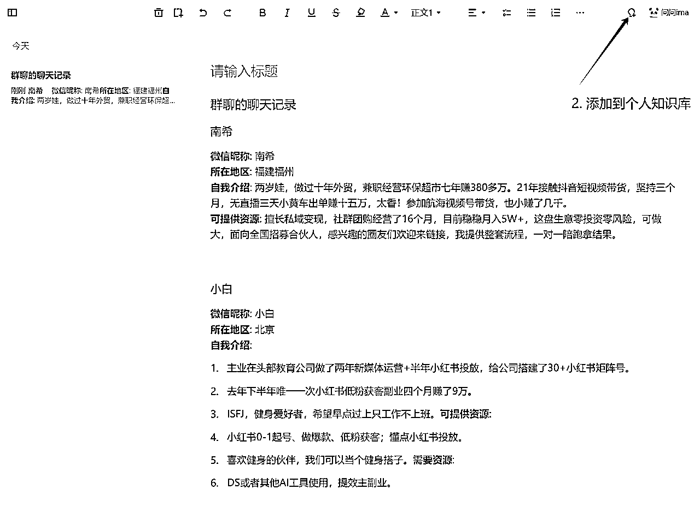
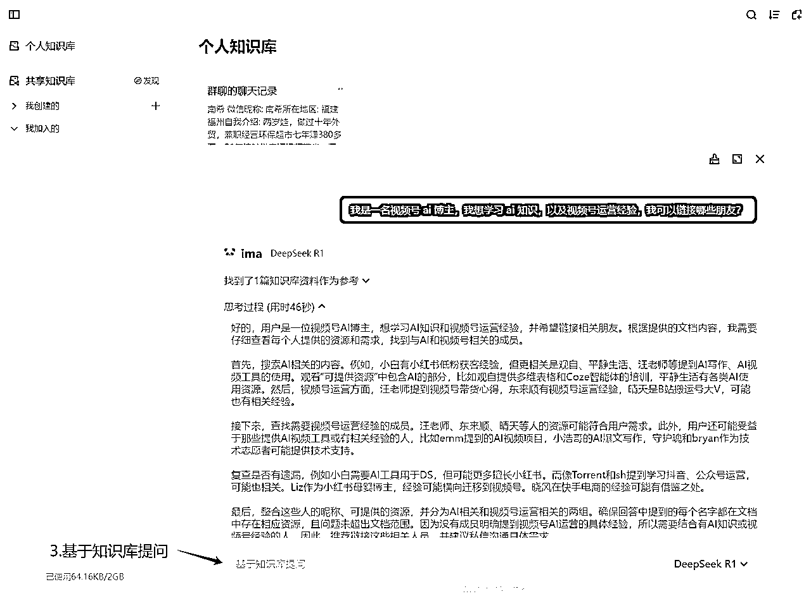
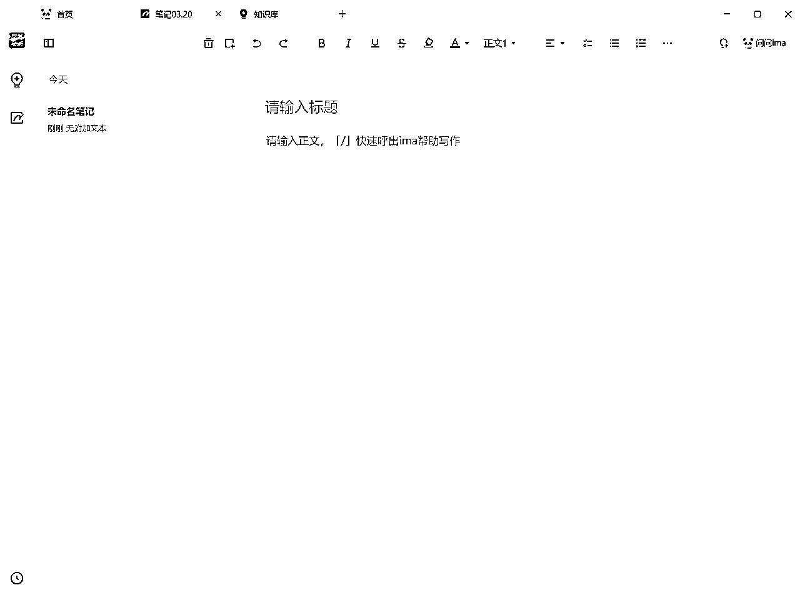
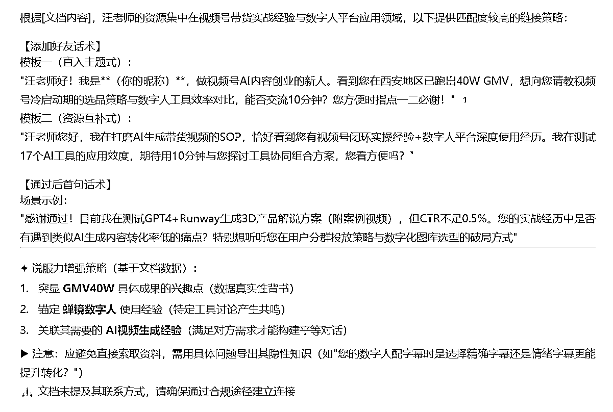

# 一招解决航海无效社交的问题，打造AI人脉网

> 来源：[https://v68e301vkv.feishu.cn/docx/URtNdXyfCoSkyPxy279cIR2Lneh](https://v68e301vkv.feishu.cn/docx/URtNdXyfCoSkyPxy279cIR2Lneh)

## 先看效果：

## 一、缘起

新人小白第一次参加航海，18号破冰的时候，属实感觉群内大佬如云，谁都想链接，没准哪个以后就是咱的贵人呢。

理想很美好，现实很骨感。群里500号人，挨个添加，再回信息，鬼知道搞得什么时候去。而且自我介绍一个接一个，加得多了我也不知道加到哪了。

另外，鱼丸也警告⚠️啦，禁止在生财有术进行恶意引流和营销，咱不能违反社群的规则。



起初，我还是浏览自我介绍，按顺序添加，复制同样的添加话术，同样的自我介绍，同样的第一句话。可是，添加的多了，我真的不知道谁是谁了，未来大概率要在通讯录里躺尸。

碰巧最近在玩 ima，前段时间也看了「本子在隔壁」的联系人管理方法论，就想着能不能利用ima搭建个AI通讯录呢？于是，就有了如今的实操。

## 二、实操

### Step:01：利用长截图工具对打包好的自我介绍进行截图。

破冰结束后，领队和志愿者都会在禁言群里，帮大家打包好全部的圈友自我介绍。



安卓手机，直接利用系统自带的长截图截屏即可，请使用安卓手机的圈友直接跳到第二步。

苹果手机，我本人用的是 Picsew ，操作方法和日常录屏一样，只是选择录屏方式时，选择Picsew即可。



该软件有免费限制，Pro 版本 15 元永久订阅，本着让大家能少花钱就少花钱的原则。

观自推荐，同时利用「滚动截屏app」进行配合，也可采用闲鱼等非官方手段处理。

### Step 02：打开 kimi1.5，提取截屏文字。

起初，我是直接上传截图，让其自行提取，探索一下他的能力，反馈结果经对比：信息完整，而且以表格形式呈现。

其他大模型在提取长截图文字，并结构化输出的能力，我认为是略逊于 Kimi 1.5 的。大家可自行检验对比，哪个顺手用哪个，我这里也是因为用习惯了，既然能够完美实现，也就懒得对比了。

但是后来我发现，ima 知识库目前对表格形式的文本处理效果不太好，粘贴过去格式是乱的。当然如果能接受的话，也是能一次性使用的。



对于我这种轻微强迫症而言，就没办法接受，于是我调整了我的提示词，直接让其以Markdown形式输出。

这回好了，直接以一块一块的文本输出了。.

```
将图片中的信息进行提取，以Markdown形式输出，相邻两个联系人用"---"分割。
```



### Step 03：上传到ima知识库，直接提问即可。

1.添加笔记



2\. 复制粘贴，并添加到知识库



3.基于知识库提问



视频教程如下：



### Step 04：群聊中直接搜索对于圈友进行链接

### Step 05：利用 ima 定制个性化链接话术

```
我想链接XX圈友，请帮我生成添加好友话术，以及添加成功后的第一句。
```



具体话术可根据自身实际情况进行调整，但我更推荐可以亲自设计。

因为AI 只能给我们提供选择，最终决策的一定是我们自己。AI 时代，不应让 AI 剥夺我们的表达力。

### 拓展玩法：利用 Trae+Obsidian 可动态记录链接结果

具体参考归藏老师的文章：Obsidian加Cursor就是最强AI知识库！藏师傅教你从零学习 Obsidian 01

如果大家有需求，我再尝试给归藏老师这篇文章做个小小的补充，哈哈哈哈，献丑了！

## 三、思考

写到这里，不禁让我想到费孝通老先生的乡土中国（不知道为什么，今天一看微信读书都被下架了），里面有这样一句话：

亲密社群的团结性就倚赖于各分子间都相互的拖欠着未了的人情。在我们社会里看得最清楚，朋友之间抢着回账，意思是要对方欠自己一笔人情，像是投一笔资。欠了别人的人情就得找一个机会加重一些去回个礼，加重一些就在使对方反欠了自己一笔人情。来来往往，维持着人和人之间的互助合作。

很多时候，人与人的感情是建立在小小的「麻烦你一下」中的，今天我麻烦你一下，我欠了你一个人请，改天我找机会感谢你一下，或者你有事情再麻烦我一下，这样你一来，我一往，任何人的关系就建立起来了。

过去的我就是不好意思麻烦别人，什么事情都要事无巨细的自己做，总觉得自己很牛逼。与此同时，在忙自己事情的同时，也没太多时间和他人交流。后来，慢慢的圈子就窄了，闭塞了。

直到，我看了黄执中老师的沟通与表达课，他用事实和逻辑证明了：我们是可以积极主动的去请求别人帮助的，对方帮助我们的可能性，没有我们想的那么低。

原来，即使有的事情，自己可以能做，也可以适当地寻求朋友的帮助，有什么不好意思的，这可是给自己建立链接的基础。

最后，希望大家都能在本次航海中建立有效链接，搭建属于自己的人脉网。同时感谢生财有术这个平台，让我这个新人，通过线下组局，也能够认识像大魔哥、刘同学、老陈、强总等优秀的前辈，也谢谢大家对我 3.22 线下组局的支持。

我深知大家的热情是因为多维表格与 Coze 的强大，是因为大魔哥的官方背书，是因为刘同学的线下坐镇，我是一名小白，是一个新人，我还有很大的成长空间，总有一天，我会让大家因为我的专业而如此热情。

* * *

### 参考资料

#千分之一劝退计划#再次重申：禁止在生财有术进行恶意引流和营销

Obsidian加Cursor就是最强AI知识库！藏师傅教你从零学习 Obsidian 01

❗️ Z-Library 下载，含水印，请勿随意搜索。

黄执中：成为懂情绪的高效沟通者

生命管理：强化记忆力和方向感的终身笔记系统