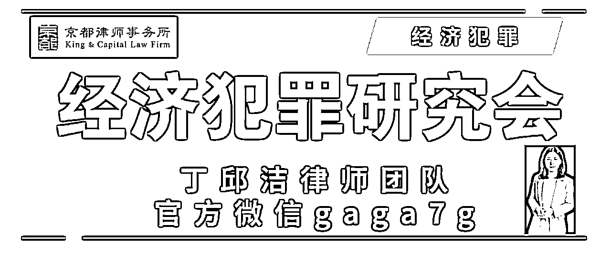

# 00后创业留学⚠️犯罪警示录「2025版」v1.0 20250321

> 来源：[https://ga48invstw.feishu.cn/docx/UtEyd2g5No6pR9xfFNIce8lknRf](https://ga48invstw.feishu.cn/docx/UtEyd2g5No6pR9xfFNIce8lknRf)

00后犯罪令人心痛无比。近有草根创业00后，游走在犯罪边缘，有些幸运，侦查阶段顺利被放、未被卷入，大多数未能逃脱法律制裁，要么家属付出高昂的应诉费用（律师费、赔偿金、补偿金、谅解金等），要么以吃牢饭留下案底人生改向收场。远有海外留学生不懂法、不敬畏、在法律与文化冲突边缘摩擦，锒铛入狱，家属远隔重洋救助失效，导致异国蹲监狱，毕业无望，毁掉自身前程，家庭也从此陷入沉寂。

法律的后果是严峻的，也是急需正视的。我们最近接待咨询，愈发感觉，助人者自救，得道者多助。能否在第一时间得到有效的法律帮助，至关重要。在本就稀缺的涉外法律方面，家属（家长）的手足无措会加剧涉罪后果，文化差异往往招致理解困难或被动漠视，也因此，更建议日常广结善缘，让律师愿意提供真诚帮助，避免涉罪的后果由00后自行承担。

为尽可能涵盖与避免，我们以2024年至今主办/接待的案例展开，分国内、海外/出海两个板块展开。千叮咛万嘱咐，远离！重视！

* * *

### 1.1、00后创业开公司：哪些业务不能碰？

特点：来钱快，不费脑，只出力，只出身份/名义，只出证件

#### 1\. 帮助信息网络犯罪活动罪（帮信罪）

案情：

某大学生找工作没头绪，精神压力大，不想搬砖费力，感觉打工受气，学历一般好像没有竞争力，从小红书、抖音看到商机，出借一张银行卡、一个身份证就能秒到帐2000块。构成犯罪！不只是涉罪。

判决结果：

认罪认罚+缓刑。有案底，有实质影响。

警示⚠️：

法律不会因为年轻不定罪，会因为年轻酌情轻罚。这个罪名实在是太频发占比过大，入罪的表现多种多样，怎样强调不要贪图轻松赚钱都不为过。

* * *

#### 2\. 侵犯公民个人信息罪

案情：

某大学生刷到赚钱视频，一件代发流量卡、电话卡，线上套利线下营业厅，59套餐秒变29卡，开卡成功返佣数百元，分析模式，感觉又是躺赚的机会，拉人头开搞，短视频加大曝光，直播纷纷承诺，还有人上网教话术，大姐大哥手耳相传选代理、发展代理的防坑秘籍。

判决结果：

尚未出判，同案涉罪人员一些被拘留、轻量级被释放，尚未定罪不等于业务无罪。

警示⚠️：

在灰色地带游走的业务，当刑法开始关注你，质疑业务本身时，从业人员切勿轻信与信奉经验主义，前辈未入坑不代表你不被抓被罚被判刑，刑法固然稳定，社会现象是流动的，为了打击犯罪，过去非罪、如今入罪，也是正常的。

* * *

#### 3\. 侵犯著作权罪1

案情：

某研究生搬运视频网站视频，心想反正这类搬运多如牛毛，于是加上开发小技巧，外接小程序，一边用广告赚钱，一边享受会员充值。两手抓两手稳，还没赚够小程序开发成本，案发，侦办机关全国布网，抓获15人，主犯公司老板判赔百万+，15人均获刑。

判决结果：

缓刑并处数倍罚金。

警示⚠️：

赚小钱不合法，事儿大，家破人未亡，妻离还子散。别人搬运未被抓，我模仿却被罚，感觉刑法不公平？案发缺的只是一个契机，权利人若是起诉民事赔偿，拿不到赔偿金、被告金蝉脱壳卷款走人，换个地方重新侵权，权利人深感不划算，一纸控告书到公安机关，既不费力，又能确保得到赔偿，还能以儆效尤，杀鸡儆猴不用牛刀，何乐不为？当事人问我们，为啥不起诉，非要让我坐牢，就是这个道理。身处案件漩涡，只见自己，不见权利人的权利受损泛滥成灾，便是如此下场。

* * *

#### 4\. 侵犯著作权罪2：代码"复制粘贴"，小心"侵权"惹麻烦

案情：

某大学生在一家软件公司工作，最近公司接到了一个新项目，需要开发一款新的应用程序。他负责这个项目的开发工作，时间紧、任务重，压力山大。某天，他在网上浏览时，发现了一个开源项目，这个项目的代码和他们要开发的应用程序功能很相似。他心想："这个开源项目正好可以帮我节省很多时间，我直接把它的代码复制过来，稍微修改一下就能用了。"于是，他未经原作者同意，就把开源项目的代码复制到了自己的项目中，并进行了修改和使用。起初，他觉得自己的计划天衣无缝，暗自窃喜。可没过多久，原作者发现了代码被侵权的情况，一查，发现了他的行为。

警示⚠️：

代码不是用来随意"复制粘贴"的，而是需要尊重原作者的劳动成果和著作权。在工作中，要诚实守信，遵守相关的法律法规和开源协议，如果需要使用他人的代码，一定要经过原作者的许可，并按照规定的方式使用。

* * *

#### 5\. 买卖国家机关证件相关犯罪

案情：

某大学生遇到贵人前辈，还没毕业就入股开公司，提供广告增值服务，抖音投流一条龙，流水大有钱赚心头乐开花，客户一看一边投流广告效果拉满，嘎嘎香，于是大腿一拍，增加预算开始规划店群使劲儿干，店铺又不敢串联、怕关联审核，公司立马推出证照一条龙服务，我出电子执照、法人身份、赠送法人视频验证，一拍即可，钱还没入口袋，大学生老板变看守所过夜。

判决结果：

尚未出判，同案涉罪人员一些被拘留、轻量级被释放，尚未定罪不等于业务无罪。

警示⚠️：

个体户、公司执照到底能不能"买卖"？法人出镜验证是否就是知情且同意？谁有权处分执照资格的交易行为。一切悬而未决，00后有能力细想，或者入伙前想过这业务是否违法犯罪？经验主义的坑，始终提防。这类行为，不能说就是犯罪，但是管不管、怎么管，难定论，有人被关，有人被放，业务还能不能做？看对价，价格如果是自由、有案底，恐怕多少钱，00后们都要好好掂量掂量了。

强调！！这个罪名多说两句，估计很多人在干！

「入罪门槛低：买卖国家机关证件罪是行为犯，只要实施了买卖行为，无论是否使用或造成后果，原则上都构成犯罪。工商执照、驾照、身份证，都能入罪。情节严重的情形：多次买卖、买卖重要证件（如护照、营业执照）、造成严重后果（如扰乱市场秩序、危害公共安全）等，会被认定为“情节严重”，量刑在三年以上十年以下。单位犯罪与共同犯罪：单位实施买卖证件行为的，对单位判处罚金，并对直接责任人追究刑事责任。共同犯罪的，所有参与者均需承担刑事责任。牵连犯罪的处理：如果买卖证件是为了实施其他犯罪（如诈骗、非法经营），可能构成牵连犯，数罪并罚。」

* * *

#### 6\. 非法经营罪

案情：

某程序员小刘，技术挺牛，一直想创业。某天，他发现虚拟货币交易挺火，就琢磨着："要不我做个虚拟货币交易平台，让大家买卖虚拟货币，我收点手续费，这生意应该能赚。"说干就干，小刘没多想，就开始搭建平台，设置交易功能，很快平台就上线了。可没多久，这个平台就被警方盯上了。

警示⚠️：

根据我国《刑法》第二百二十五条，未经许可经营法律、行政法规规定的专营、专卖物品或者其他限制买卖的物品，情节严重的，就构成非法经营罪。小刘未经许可搭建虚拟货币交易平台，从事虚拟货币买卖业务，就属于这种情况，可能涉嫌非法经营罪。

* * *

#### 7\. 洗钱罪「中国与中国香港」

案情：

某大学生帮朋友当香港公司董事/股东，结果未曾想，落入洗钱大网。

过往案例：

香港海关曾破获一起涉案金额高达数十亿港元的洗钱大案。犯罪团伙利用多个空壳公司，虚构国际贸易往来，通过复杂的资金流转，将来自内地电信诈骗、走私等犯罪活动的非法所得，伪装成正常的贸易款项，经地下钱庄流入香港，再通过香港的金融机构转移至海外。

警示⚠️：

在香港，洗钱行为严重威胁金融体系的安全与稳定。根据《打击洗钱及恐怖分子资金筹集（修订）条例》，将犯罪所得进行处理、转换，意图掩饰非法来源的行为，均构成洗钱罪。该条例对各类洗钱行为进行了细致规范，旨在全方位打击非法资金的流动。

* * *

### 1.2、哪些业务红线不可踩？

特点：开始合法，动机合法，目的单纯，但行为变形，最终涉罪

#### 1\. 非法获取计算机信息系统数据罪

案情：

某程序员小张，平时喜欢在网上逛逛，某天他发现一家电商平台有个新用户注册送优惠券的活动。小张心想："这优惠券挺香的，要是能多搞点，买点啥都能省不少钱。"于是，他开始琢磨怎么才能多注册几个账号。小张技术不错，很快编写了一个小脚本，自动注册账号、领取优惠券，一通操作下来，还真搞到了不少优惠券。小张心里美滋滋，觉得这下能省大钱了。可没过多久，电商平台的工作人员发现了异常，怎么有这么多账号在同一时间段注册，还都是新用户？他们一查，发现了小张的"小动作"。这不，小张就被请去警局喝茶了。

警示⚠️：

电商平台的注册系统是受法律保护的计算机信息系统，它里面存储着用户信息、账号数据等重要数据。小张未经允许，擅自编写脚本侵入这个系统，获取了大量账号数据和优惠券信息，这就属于非法获取计算机信息系统数据。而且，这种行为还可能给电商平台造成损失，比如优惠券成本增加、正常用户注册体验受影响等。

* * *

#### 2\. 非法控制计算机信息系统罪

案情：

某程序员小丁，平时喜欢研究各种软件的漏洞，觉得这挺有趣，也能提升自己的技术水平。某天，他发现一款流行的游戏存在一个漏洞，可以被利用来修改游戏数据，比如增加游戏币、解锁高级装备等。小丁心想："这不就是检验自己技术的好机会嘛！"于是，他开始尝试利用这个漏洞，没想到还真让他给"搞定"了。他成功修改了自己的游戏数据，获得了大量游戏币和高级装备，玩得不亦乐乎。可没过多久，游戏公司发现了数据异常，一查，发现了小丁的行为。

警示⚠️：

游戏的服务器系统是受法律保护的计算机信息系统，它里面存储着玩家的游戏数据、游戏进度等重要信息。小丁未经允许，擅自利用漏洞修改游戏数据，这就属于非法控制计算机信息系统。而且，这种行为还可能给游戏公司带来巨大的损失，比如影响游戏平衡、损害其他玩家的游戏体验等。

* * *

#### 3\. 破坏计算机信息系统罪

案情：

某程序员小陈，平时在公司里技术不错，但有时候喜欢开些"小玩笑"。某天，他发现公司内部的考勤系统存在一个漏洞，可以被利用来修改考勤记录。小陈心想："这不就是检验自己技术的好机会嘛！"于是，他开始尝试利用这个漏洞，没想到还真让他给"搞定"了。他成功修改了自己的考勤记录，把迟到、早退的记录都给"抹去"了。起初，小陈觉得挺好玩，心想自己只是改了自己的考勤记录，应该没什么大不了的。可没想到，这件事被其他同事发现了，他们也开始效仿小陈的做法，导致公司考勤系统一片混乱。公司管理层发现了问题，一查，发现了小陈的行为。

警示⚠️：

破坏计算机信息系统罪，是指违反国家规定，对计算机信息系统功能进行删除、修改、增加、干扰，造成计算机信息系统不能正常运行，后果严重的行为。简单来说，就是你如果对别人的计算机系统"动手脚"，让它不能正常工作，就可能触犯这个罪名。根据《中华人民共和国刑法》第二百八十六条的规定，情节严重的，处五年以下有期徒刑或者拘役；后果特别严重的，处五年以上有期徒刑。

* * *

#### 4\. 开设赌场罪

案情：

某程序员小张，突发奇想：“区块链不是去中心化、不可篡改嘛，要不我用这技术做个在线赌博平台，让玩家们放心地玩，岂不是一举两得？”说干就干，小张一头扎进代码里，没日没夜地开发起来。没过多久，在线赌博平台就搭建好了，玩家们可以用虚拟货币下注，赢了就能获得更多的虚拟货币。小张心想：“这下玩家们可以放心大胆地玩了，我也能靠这个平台赚点手续费，一举两得。”然而，好景不长，这个平台很快就引起了警方的注意。

判决依据：

根据我国《刑法》第三百零三条的规定，以营利为目的，开设赌场或者以赌博为业的行为，都是触犯刑法的。无论你是用传统的方式还是高科技手段，都一样要受到法律的制裁。警察经调查，发现小张的平台吸引了大量玩家参与赌博，赌资数额巨大，严重扰乱了社会秩序。小张因涉嫌开设赌场罪被刑事拘留。

警示⚠️：

开设赌场罪不仅适用于传统的线下赌场，也适用于线上赌博平台。无论使用何种技术手段，只要以营利为目的，组织赌博活动，都可能触犯刑法。程序员在开发平台时，务必注意业务模式的合法性，切勿因一时的新鲜和刺激，忽视法律风险。

* * *

#### 5\. 职务侵占罪

案情：

某程序员小陈，在一家科技公司工作，负责公司内部系统的维护和开发。某天，小陈在检查系统时，发现了一个漏洞，这个漏洞可以让他绕过权限限制，访问到公司的财务数据。小陈心想：“这漏洞要是被别人发现了，我肯定会被批评，不如我先利用一下，给自己多发点工资。”于是，他利用这个漏洞，偷偷给自己多发了几笔工资，金额也不少。起初，小陈觉得神不知鬼不觉，暗自窃喜。可没过多久，公司财务部门发现了异常，一查，发现了小陈的行为。

判决依据：

根据我国《刑法》第二百七十一条，公司、企业或者其他单位的工作人员，利用职务上的便利，将本单位财物非法占为己有，数额较大的，就构成职务侵占罪。小陈利用职务上的便利，非法侵占了公司的财物，可能涉嫌职务侵占罪。

警示⚠️：

技术是用来为公司创造价值的，不是用来侵占公司财产的。在工作中，要诚实守信，遵守公司的规章制度，发现漏洞要及时上报和修复，而不是利用漏洞为自己谋取私利。职务侵占罪不仅会导致法律制裁，还会严重影响个人职业生涯和声誉。

* * *

#### 6\. 挪用公款罪

案情：

某程序员小张，在一家大型国企工作，负责公司的财务系统维护。某天，小张急需一笔钱来支付新房的首付，但自己的积蓄还差一点。他心想：“公司财务系统里的资金那么多，我先挪用一小部分，等发了工资再还回去，应该不会被发现。”于是，他利用自己对财务系统的熟悉，悄悄挪用了公司的一笔公款，金额正好够他支付首付。起初，小张觉得自己的计划天衣无缝，暗自窃喜。可没过多久，公司财务部门在审计时发现了资金异常，一查，发现了小张的行为。

判决依据：

根据我国《刑法》第三百八十四条，国家工作人员利用职务上的便利，挪用公款归个人使用，数额较大、超过三个月未还的，或者虽未超过三个月，但数额较大、进行营利活动的，或者进行非法活动的，就构成挪用公款罪。小张作为国企员工，挪用公款归个人使用，可能涉嫌挪用公款罪。

警示⚠️：

公款是国家和单位的财产，不是用来“临时借用”的。在工作中，要诚实守信，遵守公司的规章制度，遇到资金困难时，要通过合法途径解决，不能打公款的主意。挪用公款罪不仅会导致法律制裁，还会严重影响个人职业生涯和家庭生活。

* * *

#### 7\. 侵犯商业秘密罪

案情：

某程序员小李，在一家互联网公司工作，负责公司的产品开发。某天，小李在和同事闲聊时，无意中得知公司即将推出一款新产品，这个产品采用了公司独有的核心技术，具有很强的市场竞争力。小李心想：“这个产品这么厉害，如果能提前知道一些细节，说不定能帮我找到更好的工作机会。”于是，他趁同事不注意，偷偷复制了一份包含商业秘密的技术文档，准备带回家研究。起初，小李觉得自己的行为神不知鬼不觉，暗自窃喜。可没过多久，公司发现了技术文档泄露的情况，一查，发现了小李的行为。

判决依据：

根据我国《刑法》第二百一十九条，以盗窃、利诱、胁迫或者其他不正当手段获取权利人的商业秘密，或者披露、使用、允许他人使用以前项手段获取的权利人的商业秘密，或者违反约定或者违反权利人有关保守商业秘密的要求，披露、使用或者允许他人使用其所掌握的商业秘密，给商业秘密权利人造成重大损失的，就构成侵犯商业秘密罪。小李未经公司允许，私自复制并泄露公司的商业秘密，可能涉嫌侵犯商业秘密罪。

警示⚠️：

商业秘密是公司的核心竞争力，不是用来随意获取和泄露的。在工作中，要诚实守信，遵守公司的保密制度，遇到需要获取商业秘密的情况，一定要通过合法途径，比如签订保密协议等。侵犯商业秘密罪不仅会导致法律制裁，还会严重影响个人职业生涯和公司声誉。

* * *

#### 8\. 非法向境外提供数据罪

案情：

某程序员小李，在一家互联网公司工作，负责公司的数据分析项目。某天，小李在处理一批用户数据时，发现这些数据中包含了一些敏感信息，比如用户的消费习惯、地理位置等。小李心想：“这些数据如果能分享给国外的同行，他们肯定会很感兴趣，说不定还能因此获得一些合作机会。”于是，他未经公司同意，擅自将这批数据通过邮件发送给了国外的一个朋友，希望对方能帮忙分析一下数据的潜在价值。起初，小李觉得自己的行为没什么大不了的，毕竟只是分享给朋友看看。可没过多久，公司发现了数据泄露的情况，一查，发现了小李的行为。

判决依据：

根据我国《数据安全法》第三十一条，关键信息基础设施的运营者在中华人民共和国境内运营中收集和产生的重要数据的出境安全管理，适用本法。未经批准向境外提供重要数据的，可能构成非法向境外提供数据罪。小李未经公司和相关部门的批准，擅自将重要数据发送到境外，可能涉嫌非法向境外提供数据罪。

警示⚠️：

数据不是用来随意“外传”的，尤其是涉及敏感信息和重要数据时，更要严格遵守相关的法律法规和公司规定。在工作中，要提高数据安全意识，妥善保管和使用数据，如果需要向境外提供数据，一定要经过合法的审批程序，确保数据安全可控。非法向境外提供数据罪不仅会导致法律制裁，还会严重影响公司业务和个人职业生涯。

* * *

### 1.3、留学涉罪/出海创业涉罪，怎么办？

#### 1\. 侵犯知识产权：境外开发"擦边"成"侵权"

案情：

某大学生在国外一家初创公司工作，负责开发一款新的应用程序。为了吸引用户，他和团队决定在产品设计上"借鉴"一些知名大公司的元素，比如使用了和Google标志相似的颜色和字体，还模仿了Google的界面布局和功能图标。他们心想："这些大公司的设计这么经典，我们稍微改动一下，应该不会有问题吧。"起初，他们觉得自己的产品设计很有创意，还吸引了不少用户。可没过多久，Google的法务部门发现了这个问题，一查，发现了他们的侵权行为。

警示⚠️：

技术人员开发产品时，一定要尊重他人的知识产权，不能为了追求所谓的"创意"或"效果"而侵犯他人的商标权、著作权等。在设计产品时，要注重原创性和独创性，避免使用他人的商标、界面设计、功能图标等元素。如果确实需要借鉴或使用他人的知识产权，一定要经过合法的授权和许可，并支付相应的费用。

更多涉美知识产权案件，请参见「如何在美国打官司」系列文章。

* * *

#### 2\. 伪造留学文件的黑色产业链「香港」

案情：

我们曾处理过一起拟申请留学生退费谈判，最终全额退还学费。谈判过程难、结果顺畅也是因为涉罪，中介机构有所顾虑，才全款退回。在香港留学申请中，学生需要提交学历证明、成绩单、推荐信等一系列文件。一些不法留学机构和个人看到了“商机”，形成了一条伪造留学文件的黑色产业链，声称可以帮助成绩不理想或学历不达标的学生，通过伪造文件的方式，成功申请到香港的高校。

案例：某大学生为了进入香港某知名大学，在虚荣心驱使与某留学机构的蛊惑下，伪造了本科成绩单和教授推荐信。留学机构声称有"特殊渠道"，可以确保文件不被发现，顺利通过学校审核。学生信以为真，支付了高额费用，提交了伪造文件。一旦伪造文件被发现，学生不仅会被取消入学资格，还将面临刑事指控。

警示⚠️：

#### 3.提供虚假文书罪

在香港，伪造留学文件属于严重的违法行为。根据《刑事罪行条例》，提供虚假文书意图误导他人（在此案中为高校招生部门），并造成不公平竞争等不利后果的行为，构成提供虚假文书罪，最高可判处14年监禁。

一旦伪造文件被发现，学生不仅会被取消入学资格，还将面临刑事指控。即使侥幸入学后被发现，也会被开除学籍。此前，香港多所高校都曾曝光过学生伪造文件入学的事件。被发现后，涉事学生的学业中断，个人声誉受损，未来的求学和就业之路也将布满阴霾。而参与伪造文件的留学机构和个人，同样会受到法律的严惩，面临罚款和监禁。对于留学家庭来说，选择留学机构时一定要谨慎。不要轻信那些承诺可以通过不正当手段帮助孩子入学的机构。要了解香港高校的正规申请流程和要求，通过合法途径提升孩子的竞争力。同时，学生自身也要树立正确的价值观，明白靠伪造文件获得的留学机会，最终只会害了自己。

* * *

### 1.4、美国犯罪警示

#### 1\. 危险驾驶罪（美国怀俄明州）

案情：

某留学生在怀俄明州留学期间，因超速驾驶被警方拦下。经检测，其血液酒精含量超标，属于酒后驾驶。根据怀俄明州法律，酒后驾驶属于危险驾驶罪，情节严重者可能面临吊销驾照、罚款甚至监禁。

警示⚠️：

在美国，各州对危险驾驶的法律规定有所不同，但普遍处罚严厉。留学生应严格遵守当地交通法规，切勿酒后驾驶，避免因一时疏忽导致严重后果。

* * *

#### 2\. 非法持有枪支罪（美国德克萨斯州）

案情：

某留学生在德克萨斯州留学期间，因好奇购买了一把未注册的手枪，并在校园内携带。根据德克萨斯州法律，未经许可持有枪支属于非法持有枪支罪，情节严重者可能面临重罪指控。

警示⚠️：

美国各州对枪支管理的法律规定不同，留学生应了解并遵守当地法律，切勿非法持有或携带枪支，避免触犯法律。

* * *

#### 3\. 学术欺诈罪（美国加州）

案情：

某留学生在加州某大学就读期间，因考试作弊被校方发现。根据加州法律，学术欺诈属于违法行为，情节严重者可能面临开除学籍、罚款甚至刑事指控。

警示⚠️：

在美国，学术诚信受到高度重视，留学生应严格遵守学校的学术规范，切勿因一时侥幸心理触犯法律，影响学业和未来前途。

* * *

### 结语：

00后创业和留学过程中，法律风险无处不在。希望通过这些案例的警示，能够帮助00后群体增强法律意识，避免因无知或侥幸心理触犯法律，毁掉自己的前程。