# YT shorts 复盘——动物赛道的爆点因子分析及提示词模板

> 来源：[https://n0qps32pq8.feishu.cn/docx/W6fYdvWp9owtbjxvbUkcGrkQn2g](https://n0qps32pq8.feishu.cn/docx/W6fYdvWp9owtbjxvbUkcGrkQn2g)

# 引言

大家好，我是逸凡风顺，12 月 YouTube 航海的一份子。从 YouTube 航海开始到现在，我的心路变化历程是这样的：兴奋——实操——怀疑——激动——焦虑——信心十足，因为在 12 月 YouTube shorts 航海开始前后那几天，我选择了不同的赛道作为尝试，因为之前是做内容出身的，所以我在看完老马教练分享的《YouTube Shorts 赛道选择与收益解读》后，我选择了自己擅长的解说类 shorts，但类型区别于老马教练在文章中举例的那些赛道——工厂解说赛道，流量还可以，第一条视频就取得了 4 万多的观看量，后续视频流量均破万播，但好景不长，在三四天后，账号直接 0 播，不论是新内容还是之前的内容都停止推荐。在持续坚持了几天 0 播后，第一个频道就此卒了。在重新看了生财所有有关 YouTube 的帖子后，发现自己忽略了一个点，

亦仁大佬发布的超级风向标是《通过 AI 生成的各种视频，上传到 YouTube 和 shorts，获取广告分成。生性爱钱的我只看到广告和分成字样，却没注意到 AI 生成。介于自己本身就有想学习 AI 有关的技能，何不借着这次航海学习一下这些 AI 应用呢，于是我的第一个 AI shorts 赛道开始了。

# Shorts AI 赛道的选择

## 个人数据分享

在开始赛道解析之前，先汇报一下我在航海期间取得的成绩，航海期间，AIshorts 赛道，取得 8 天达到初级 ypp 标准，18 天达到高级 ypp 标准，最高视频播放量为 3470 万左右。收获粉丝 18 万＋，总流量应该在 6000 万＋（没具体细算）。收入就先不晒了，因为踩了许多坑，导致没能获取到太多收益，这些会在后续提到。

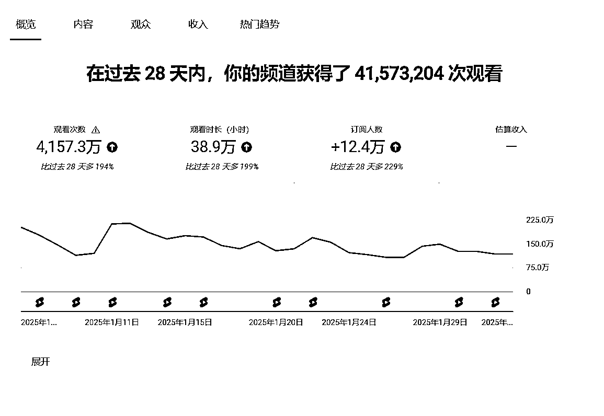

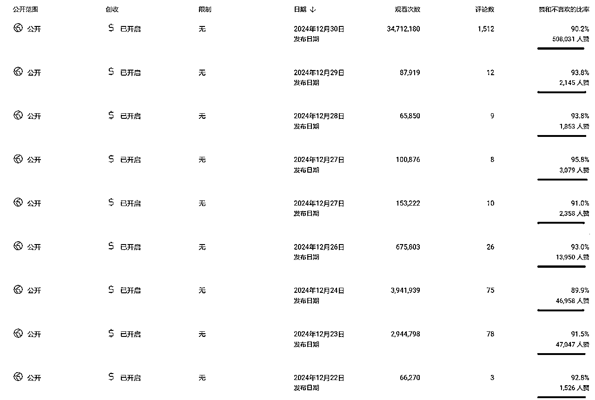

## 赛道选择——AI 动物警告

其实在看了方波妮教练的《YouTube Shorts 项目实操：从 0 到 1 跑通账号，12 天收获 2700+订阅与 90 万+播放》

圈友竹子的《YouTube Shorts 实操指南：AI 宝宝走秀与 Magic 变身视频制作》

老马教练《YouTube Shorts 赛道选择与收益解读》

这些文章后，我一开始选择了达人变身秀的这个赛道，之所以选择这个赛道，纯粹就是因为它在航海手册中，是经过教练验证过的赛道，但在理科直男的心理作用下，导致我对这个赛道的视频制作一直都不是很积极，在后续实操中所体现出来的就是，做视频很枯燥，心态上很消极，总是为了完成而完成，放两个我航海开始时做的达人变身秀视频给你们下饭

于是，我决定找个自己能做下去视频的赛道，在胡乱刷了几天油管后，我看到了第一个对标账号：快乐探险家

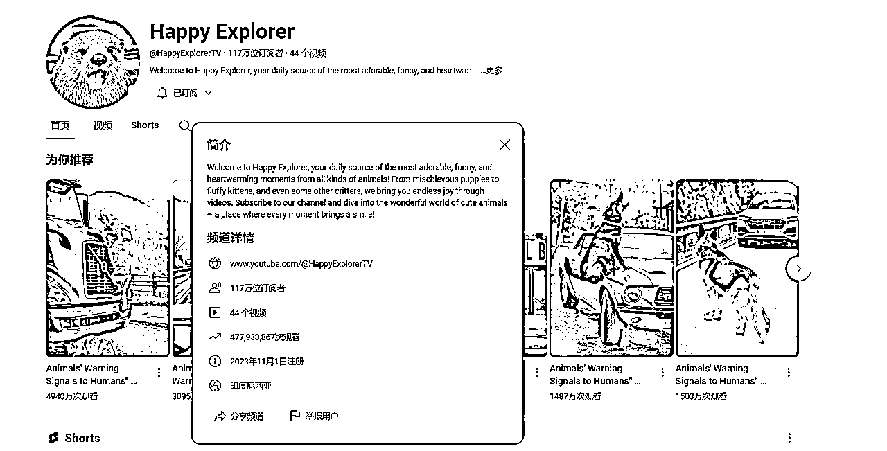

刚开始看到这个账号的时候，看了注册时间，看了视频数等一系列航海手册中所提到的一个合格对标账号的基本数据，发现这个频道虽然注册的时间较早，但这个类型的视频发布并没有多长时间，而且视频表现力很不错，于是我又根据这个账号的标签等信息，持续挖掘类型的账号。

但是很可惜，这类视频的账号当时并不是很多，找了好久才找到三个，而且在最开始的航海手册中也没有提到这个赛道，但值得注意的事这些账号的数据都不低。于是一通分析下来我决定对标这个账号，做这类视频，说干就干，生财圈友分享的工具、方法都用起来。

好在数据没有辜负，前几个视频基本都是 1.5 万左右的播放，在不断分析对标视频，不断精炼提示词后，终于我在第 6 个还是第七个视频的时候，迎来了自己的第一个小爆款：86 万的播放量。这让我更加坚定了这个赛道是能做出流量的。在后续的一个星期内，我陆陆续续迎来了几十万，几百万流量的视频，

并且，我制作视频的过程中，我逐渐找出了我自己认为这个赛道的爆款因子。

## 爆款因子分析：

在 AI 动物示警，AI 动物救援这些赛道中，这类视频主打的就是激发用户的同情心以及情绪共鸣的价值，这个国内外都一样，只要情绪到位，流量不是问题，但这个赛道本身就是拿捏的这个情绪点。为什么有的视频有流量，有的视频就是不爆呢？

我从卡万播就几十万，几十万，几千万流量的提升过程中，分析了一下我个人认为的爆款因子。现做一些分析，供圈友参考。

### 色彩度

在反复观看对标，以及自己视频第一次突破流量限制后，我得出的结论是，之所以对标账号流量高，我自己总是卡万播，是因为我的视频一眼就能看出是 AI 做的，而对标账号的视频几乎可以做到以假乱真。放两个视频大家对比一下就能看出区别。

第一个视频是 2.6 万播放，第二个视频是 3400 多万播放，除去运气成分外，我认为第二个视频之所以流量好是画面色彩度，更能让用户误以为这不是 AI 做的，评论区的评论也验证了这一猜想，因为这类视频的评论很少，一旦视频爆了，大部分评论都是分享他们亲身经历过的动物示警。

相信同赛道的部分圈友看到这里可能已经知道我的账号了，哈哈

建议：文生图的时候，着重注意一下图片的色彩度搭配，尽可能还原相机拍摄的既视感，明亮且低曝光！

这里放两张图片大家对比一下，可以直观的感受到图片的色彩度对真实性的影响；后面，我会分享我是如何做的。

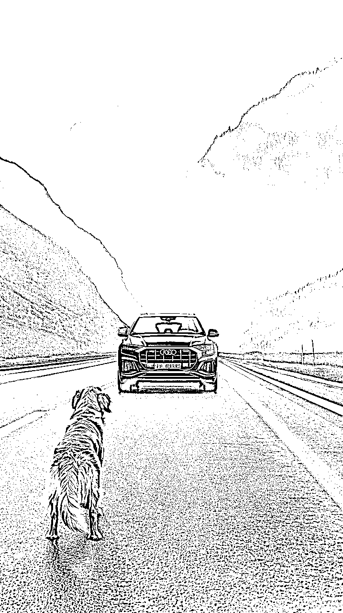

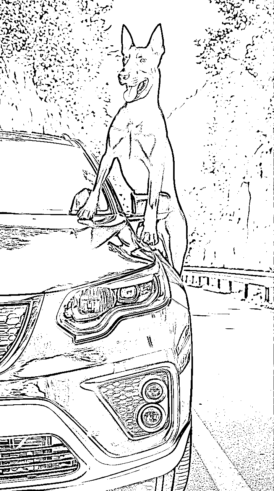

### 真实性

#### 文生图真实性

跟爆款因子一有关系，但这一点体现在多个环节，包括文生图，包括图生视频，在第一步文生图中，合理的调整提示词，选择不同的绘图工具后，生成的图片是不一样的，后续我会给大家分享我自己用到的软件。

#### 图生视频真实性

在文生图环节中保证了分镜头图片质量后，接下来便是图生视频的环节，图生视频环节的真实性，我的理解就是，主体运动符合自然规律，比如狗狗奔跑，蹦跳，攀爬等肢体动作，如果生成的动作很连贯，但动作过于僵硬或者明显的感受到是计算机生成，也就是AI痕迹明显，这样的视频一般不建议使用。

值得注意的是：第一步文生图的图片质量是会严重影响到图生视频的准确性和质量

当然，也有人专门玩抽象派，就是故意保留这些 AI 生成离谱镜头作为视频的槽点，进而诱导用户评论。这里自行选择，要真实就一直真实下去，要抽象就一直抽象下去。

### 适量的特写镜头

在经过一些视频验证过后，我发现，适当加入一些特写/近距离镜头，会让视频有不一样的效果，我一般会将动物异常举动的分镜头生成一些特写镜头，或者将镜头距离适当的拉近一下，这样不论是图生视频的视频质量还是视频整体的效果都会有意想不到的效果。这里放两张图片大家感受一下，近距离的好像更容易有代入感。

这点只是个人见解，具体因人而异！毕竟每个人的体质不同！

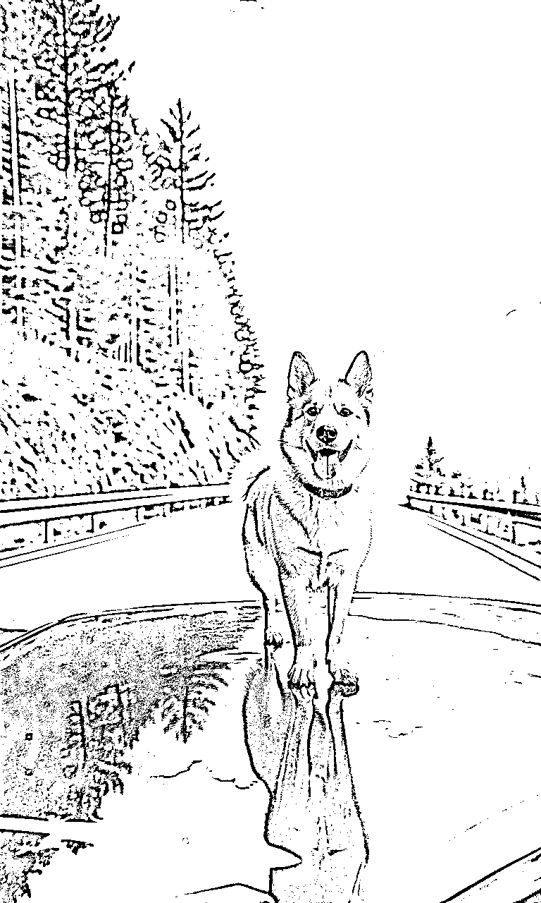

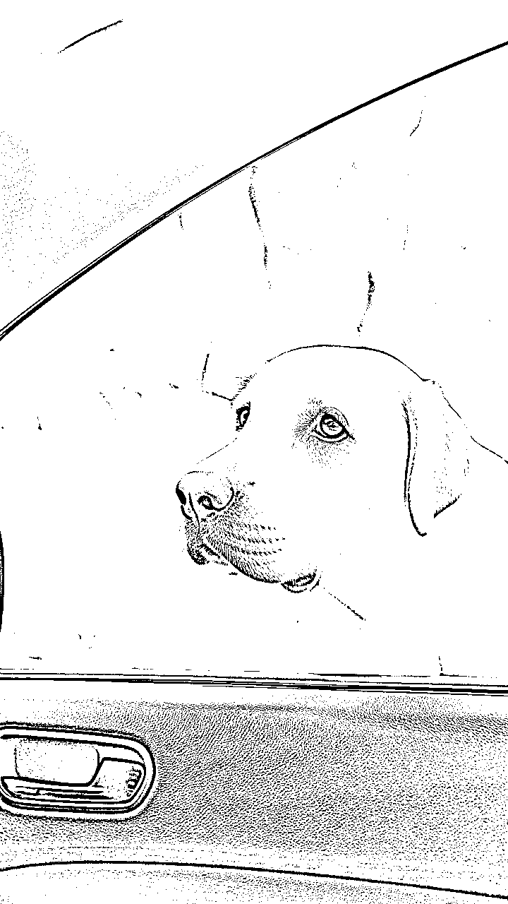

### 清晰度

一般来说，可能有部分圈友已经发现，明明自己生成的图片已经很清晰了，甚至都是超清画质，可为什么到了完整的成品出来后，却发现视频看着有一种说不出来的模糊感，而这个问题并不是出在图片上了。在我自己实操中也遇到过这些问题。

排除掉图片清晰度问题后，在图生视频和剪辑的过程中会造成视频成品画质看起来差。

#### 图生视频阶段：

其中图生视频这一块，因为不同家的模型它推理的模型也不同，有些会在推理过程中就自动将生成的视频画质损失掉一些，因为图生视频的模型不会因为你图片是4k的就给你输出4k画质的，高清的图片只是为了让模型能够更好的识别和推理提示词。

大多都是720或者1080，但有些平台会对会员开放更高画质的选择，如可灵（35灵感值的）、即梦开会员可选择高画质，智谱清言（开会员）在这个过程中，所以要根据自己能接受的价格去选择画质损失相对较少的平台。

#### 剪辑阶段

在生成每个分镜头的片段视频后，接下来就是配音效和剪辑了，而这个过程中，本身是不怎么影响画质的，哪怕为了去掉左下角或者右下角的水印，一般画面放大到105%左右，再通过调节y轴位置，一般-70到-80左右。也不会让画面看起来很糊，而最重要的就是导出时候的一些参数

这里以剪映为例，我建议是4k60帧导出，码率按照推荐即可。

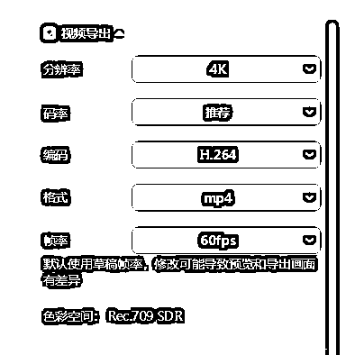

### 分镜头结构

我目前采用的是5-6个分镜头组合，即动物拦车+动物与车的互动（中景镜头，车外角度）+动物与车的互动（近景特写镜头、车内向车外拍摄角度）+灾难镜头（画面中主体车辆和动物二者选其一）+动物近景特写镜头（可选）+温馨时刻。这样的结构去制作的。这样基本在剪辑过程中保证视频时长在22-26秒这样的区间。

# 创作过程中的 AI 工具及使用心得

俗话说得好，工欲善其事，必先利其器。要想做好视频，好的工具必不可少，这里我将自己制作视频所用到的工具做一个使用体验。

## 提示词部分

*   提示词优化 AI 工具：GPT4、deepseek。

写提示词思路：先对对标视频进分镜头分析和拆解，然后根据自己的创作思路，整理出自己视频的分镜头图，然后通过 GPT 上传分镜头图，让其推导出提示词。。

这里说一下，至于为什么不用 mj，sd 等反推，一是 mj、sd 使用还不是很熟练，二是它们推导出来的提示词错乱的比较多。而 GPT 是可以识别图片的，用来推导提示词准确率相对高一些。为什么不用 deepseek，是因为 deepseek 只能识别图片中的文字，不能对图片整体识别推理

而这里使用 GPT 的原因，主要是想确定这类图片提示词的结构，因为提示词前后顺序是会影响提示词权重的。这里可以让 GPT 输出的时候，以中英文对照的形式发给你，以便后续的修改和优化。

比如，我想做个狗趴在窗外的分镜图，自己怎么写都出不来，最终我将我的想法和对标图发送给GPT，得到了我想要的效果。

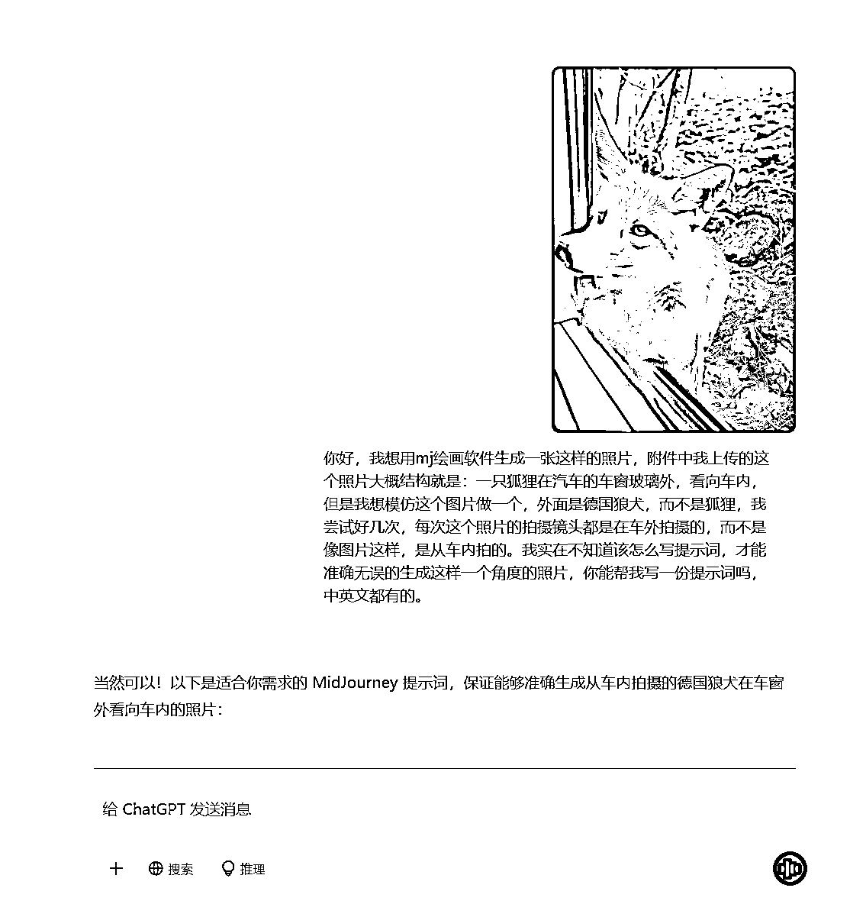

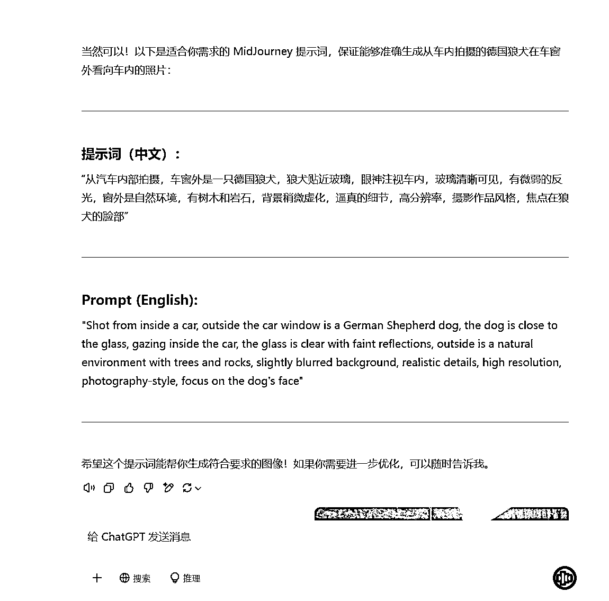

再比如这个，我想制作的分镜头是从侧面拍摄，车头掉进路面的一个坑里，但对标账号的视频中并没有这个镜头，于是我找了一个侧面镜头的网图，用来推理提示词，

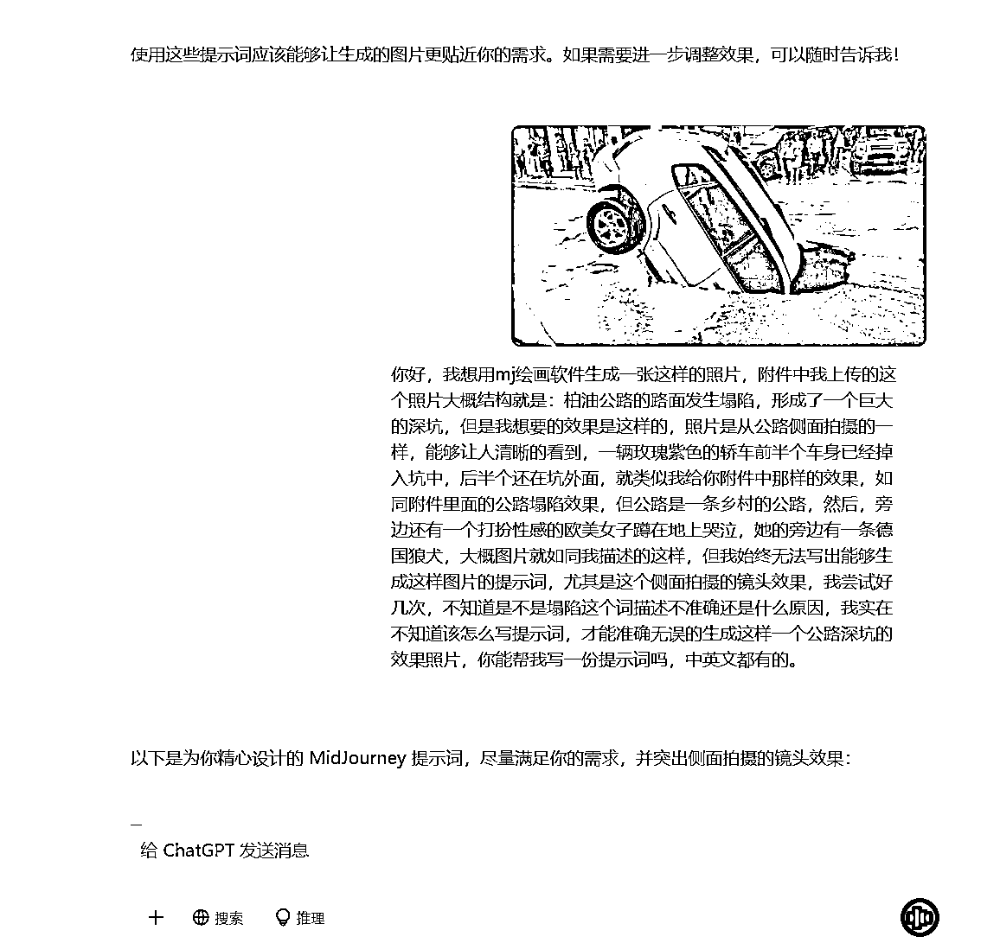

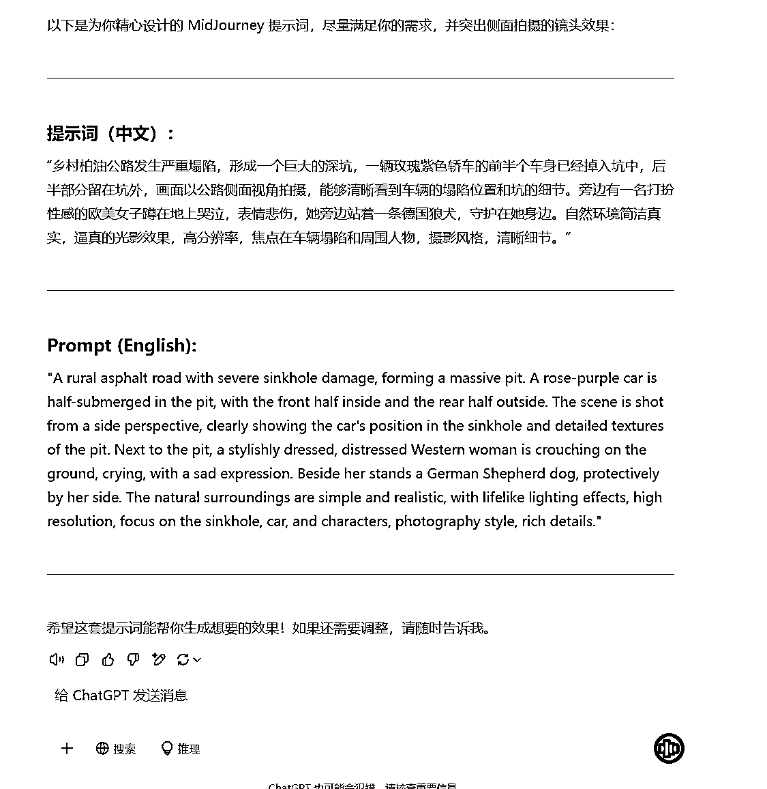

虽然但是，有时候 gpt 提供的提示词也不能百分百出来你想要的结果，这就需要用到 deepseek 了，其实 gpt 也行，只是最近 deepseek 太火了，就像试试，将 gpt 的提示词扔给 deepseek，将你生成后出现的问题一并告诉 deepseek，让它帮你优化，这样操作下来，你想要的图片效果基本上都可以实现。

但到这里并没有完，如果你只是简单的复制粘贴，那么，你将每天都不得不重复这个操作，将其整理成自己的，才是真正的降本提效。这一点我会在后面部分详细整理。

## 文生图绘画工具选择

*   文生图：mjdjourney，stable diffusion

这两个工具想必大家都比我这个新手用的好，因此使用方法就不说了，暂且说说上面提到的图片色彩度和真实性方面的一些心得，在我使用体验下来，sd 的出图效果是优于 mj 的。这里我就将我用到的模型和一些使用心得分享一下。

*   stable diffusion:

由于自身电脑配置带不动 F.1 模型，所以我使用的是 libulibu 在线端，地址：https://www.liblib.art/sd

大模型：绘梦写实摄影大模型，F.1 基础模型，星流 star-alpha 大模型

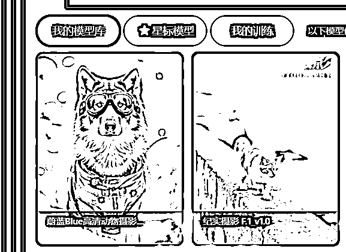

lora 模型：纪实摄影 F.1、蔚蓝 blue 高清动物摄影大模型。

*   mjdjourney

mj 模型选择 v6.1，但有时候生成的图片会过于清晰，色彩过于饱和，甚至给人一种黑黑的感觉。如果出不来我想要的色彩度，这个时候，我会选择先用 sd 生成一张图，然后再用垫图的方式让 mj 参考 sd 生成图片的风格，就是--sref+图片链接，这样出来的图片感觉会好很多。目前不知道还有没有别的方法让 mj 能够生成 sd 那种质感的图片。

不管是 sd 还是 mj，在文生图这块，我会优先看中图片色彩度和真实性，其次再去考虑图片中的部分变形或者主体的站位等因素。

ps：这两个 lora，效果虽然好，但仍没有达到我心中最理想的状态，如果找到更加真实，质感更强的动物模型，我会分享出来。

## 图生视频工具

*   即梦（pass，提示词稍微复杂点就会响应不精准，不开会员只能下载低画质）

*   runway（不会用，ps：总是抽不出符合自己预期的视频，可能是个人问题）

*   海螺（效果堪比可灵，甚至更优，但缺点也很明显，容易动画化）

*   可灵 AI（主要使用工具，基本一遍过，缺点就是基础不够用）

*   智谱清言（对于动作幅度小的镜头效果挺好，动作幅度大的容易变形，动作 AI 痕迹明显。

# 提效加速，打造万能提示词模板

## 提示词拆解及模板制作

为了提高生产效率和减少抽卡，在 gpt 和 deepseek 的优化下，我们可以将分镜头的文生图提示词进行拆分归类，我一般将提示词部分分为三个部分，即主体描述、环境描述、镜头语言、图片质量。例如：

一只拉布拉多站在乡间公路上，

back to the camera,

米白色的皮毛，俊美的外表

The 拉布拉多 is facing a 橘黄色轿车 approaching the camera，

the 橘黄色轿车's front headlights turned on and clearly visible。

这条路右边是高大的岩石峭壁，左边是草原和苔藓

天空下着毛毛雨，蓝色的天空，夏天的季节

focusing on the 拉布拉多's back and the 橘黄色轿车's front。

Natural light enhances realistic details.

照片视角是从人站立的高度拍摄的，中距离镜头拍摄

The image is in cinematic composition, realistic style, ,Film Photography,4k quality,

其中，绿色和红色部分为主体，黄色部分为环境模块，其余的则是镜头语言和图片质量。

为什么我会用中英文混合的方式去制作提示词模版呢，说起来有点惭愧，如果弄成全英文的，我就不认识了，分不清哪些是主体描述，哪些是环境描述。另外就是，翻译软件翻译的不确定性，对于一些特定的单词，尤其是一些镜头语言，翻译软件可能每次中译英翻译都不一样，导致一些只能靠特定单词触发效果的图片因素总是出不来想要的效果，所以我选择直接用英语固定住，避免翻译错误。

而中英文混合做的好处是：这样既可以避免在翻译的时候，出现翻译错误而导致的无效抽卡，这样做可以有效减少抽卡概率，我基本一遍过，但偶尔也会遇到变形问题。相较于之前的中文提示词抽卡次数减少太多太多。

同理，狗狗从窗外向车内观看的提示词

Shot from inside a car,

outside the car window is a 德国牧羊犬，

the 德国牧羊犬 is close to the glass，

gazing inside the car, the glass is clear with faint reflections,

outside is a 温馨的农场的自然环境，

focus on the 德国牧羊犬's face"

slightly blurred background, realistic details, Film Photography,4k quality,

同理，后续的分镜头也可以用同样的方法做出固定模板，有了固定镜头的提示词模板，在后续的创作过程中，便可以通过更换汉字部分，也就是主体、环境，而镜头、图片质量部分则保持不变。这样可以有效提高生图速度和减少抽卡次数。

分镜头1：动物拦车

一只 [动物] 站在乡间公路上,

back to the camera,

[外貌特征] 保持角色一致性

The [动物] is facing a [车辆] approaching the camera,

the [车辆] 's front headlights turned on and clearly visible.

这条路右边是 [环境] ，左边是 [环境2] 主要为后续灾难做适应性对照

[天气描述] 调节图片整体色彩构图

照片视角是从人的站立的高度拍摄的，中距离镜头拍摄

focusing on the [动物] 's back and the [车辆]'s front.

Natural light enhances realistic details. （自然光增强了逼真的细节）

The image is in cinematic composition, realistic style, ,Film Photography,4k quality,

分镜1示例输出：

A white moose stands on a rural road,

back to the camera,

white fur Huge antlers, domineering appearance

The moose is facing a dark green car approaching the camera,

The dark green sedan's front headlights turned on and clearly visible

On the right side of this road are tall rocky cliffs, and on the left side are grasslands and mosses

Blue sky, summer season

The photo perspective is taken from an individual's standing height, with medium range shots taken

Focusing on the white moose's back and the dark green sedan's front

Natural light enhances realistic details

The image is in cinematic composition, realistic style, ,Film Photography,4k quality,

分镜头2、3：动物异常举动

Shot from inside a car,

outside the car window is a [动物]

白色的皮毛.巨大的鹿角，霸气的外表

the [动物] is close to the glass,

gazing inside the car, the glass is clear with faint reflections,

outside is a [其中一侧环境]

[同步分镜一天气描述]

focus on the [动物]'s face"

The image is in cinematic composition, realistic style, ,Film Photography,4k quality,

分镜示例输出：

Shot from inside a car,

Outside the car window is an albino moose

White fur Huge antlers, domineering appearance

The albino moose is close to the glass,

gazing inside the car, the glass is clear with faint reflections,

Outside is a primitive forest with thick trunks

Blue sky, summer season,

Focus on the face of the albino moose

The image is in cinematic composition, realistic style, ,Film Photography,4k quality,

分镜头2、3：动物异常举动

驾驶员视角透过 [车辆] 挡风玻璃的极端特写，画面最底部边缘隐约可见方向盘，

一只[动物]站立在 [车辆] 前的公路上，

白色的皮毛.巨大的鹿角，[动物]脸部占据画面60%，唾液滴在引擎盖上，张开嘴巴，有口水流下来，

右边高大的岩石峭壁，左边是草原和苔藓，

[同步分镜一天气描述]

The image is in cinematic composition, realistic style, ,Film Photography,4k quality,

分镜示例输出：

Through the extreme close-up of the dark green car windshield from the driver's perspective, the steering wheel can be vaguely seen at the bottom edge of the image,

A white skinned Rangifer Taranduss stands on the road of a dark green sedan,

White fur The huge antlers of the albino reindeer occupy 60% of the screen, and saliva drips onto the hood. Opening its mouth, saliva flows down,

On the right is a tall rocky cliff, and on the left is grassland and moss,

Blue sky, summer season,

The image is in cinematic composition, realistic style, ,Film Photography,4k quality,

以此可将分镜头4：灾难/动物救治（救治需将动物病化），分镜头5：人与动物的友善互动（抚摸/拥抱）/（救治需展示动物伤势包扎后形象），便可做出一套是经过验证的模板。

## 视频拆解之同中求异

虽然有了固定镜头的提示词模板，但在视频创作过程中，还是会做一些变化，通过截图对标账号的分镜图再通过图生图的方式固然可以，但可变性稍差，有时候可以稍微做点分镜头变化，来保证表达同样的意思，但区别于对标的视频。

比如动物示警拆解对标账号后得出的通用模板是这样的

分镜一：动物拦车

分镜二、三：动物的异常举动

分镜四：灾害发生

分镜五：人与动物的接触互动

我们可以在保留关键分镜的情况下，对部分分镜图在保证表达意思不变的情况下进行略作调整。比如分镜二、三表达的动物异常举动分镜头上，可以通过调整动物的动作、动物与车互动的相对位置、镜头的视角（如从车内向外拍，还是车外后视图等）不同的视角呈现的效果是不一样的，但整体表达的还是动物想通过异常行为进行警示。

而自然灾害的镜头，则根据前面提示词中环境部分的描述词进行设定，如“山体滑坡，泥石流、巨石坠落、桥梁崩塌、地面塌陷、猛兽出没等等进行变换。

其次，如果通过修改提示词让动物示警变成动物自救、动物救援等，实现赛道的自由切换。只要拆解出视频思路，那么分镜头就很好弄了。由于我弄的视频可能对密集恐惧症人群感到不适，这里就不放视频了

# 视频制作全流程

## 文生图

将提示词模板复制放入翻译软件，对主体环境等进行修改，得到分镜头所有提示词，在通过绘画软件进行生图，这里我一般使用的是 stable diffusion，具体模型和 lora 详见 3.2 部分。可以得到分镜图

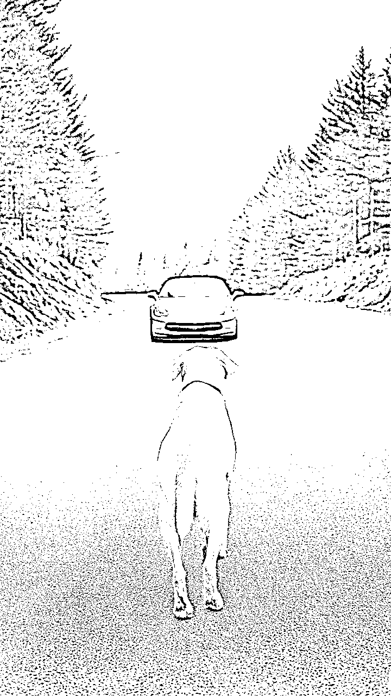

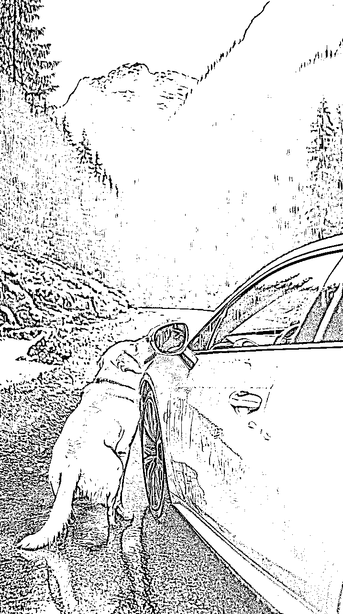

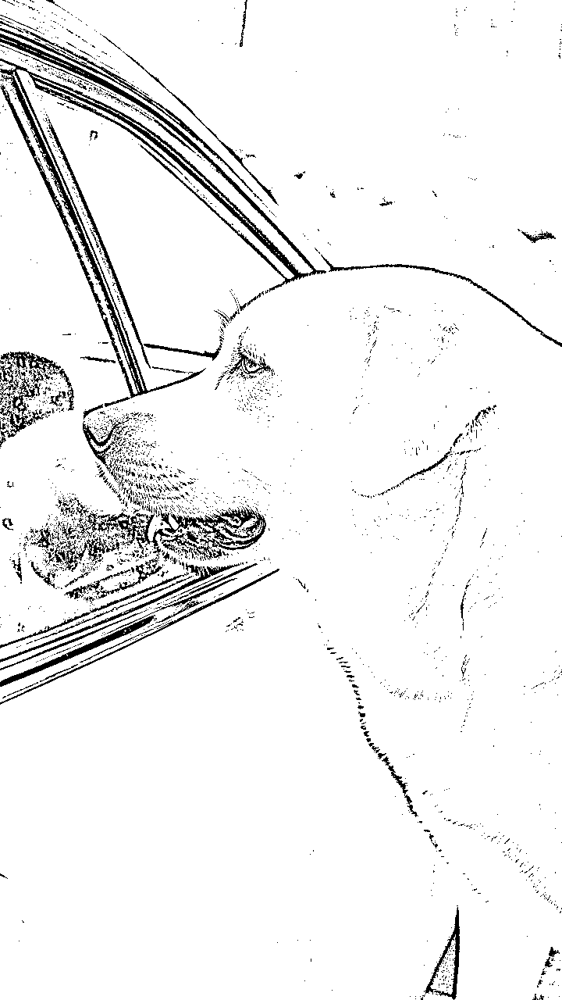

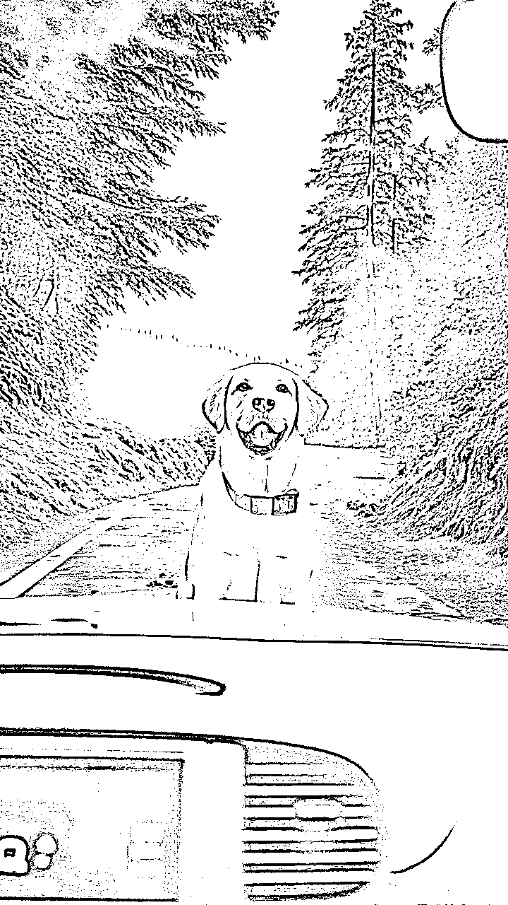

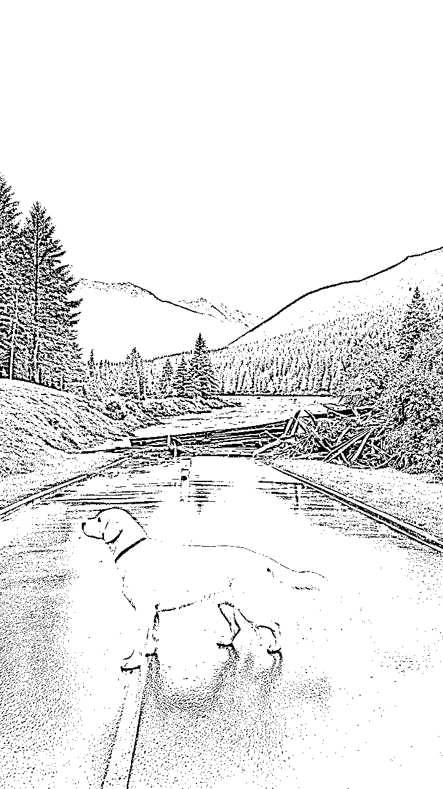

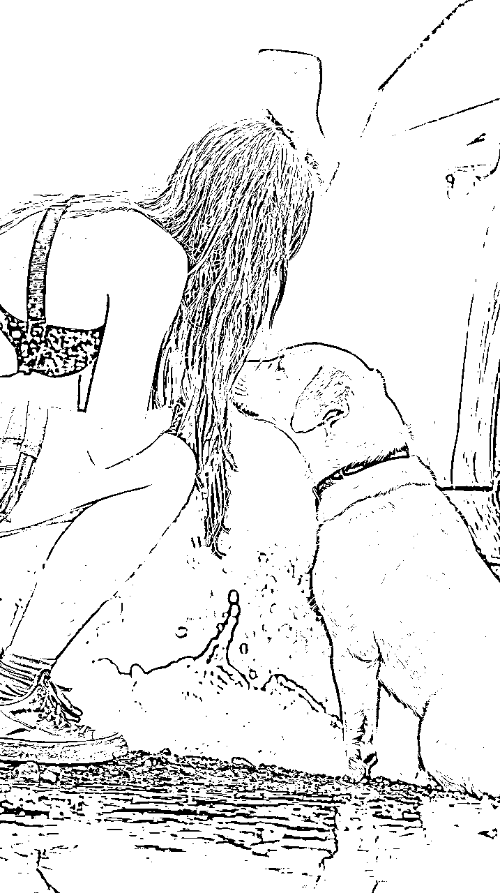

## 图生视频

随后，将得到的分镜头图再利用海螺 AI/可灵 AI 生成分镜头片段，图生视频也基本是固定模板的提示词，注意提示词的前后顺序，权重不一样，会导致出来视频的运动状态也不一样。

这里可灵 AI 我选用的是标准模式，因为比高品质模式更经济一些。

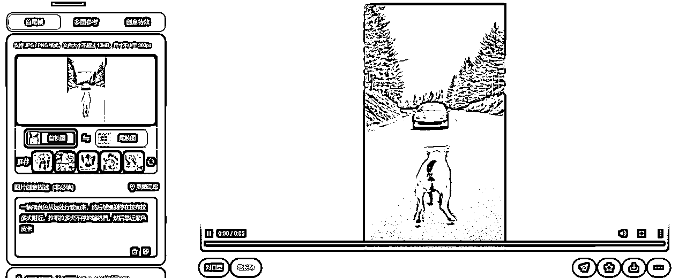

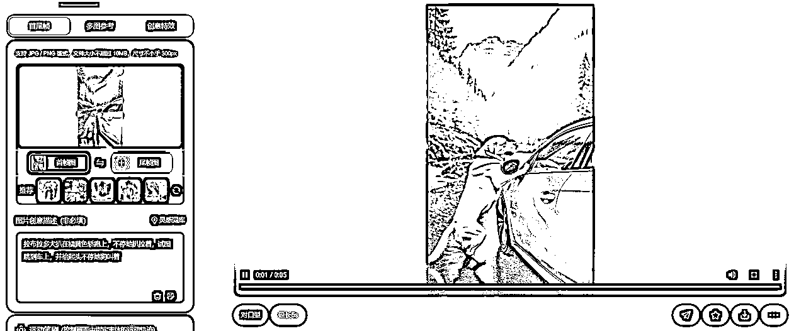

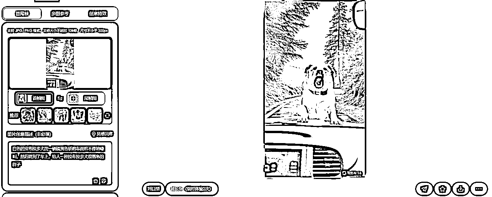

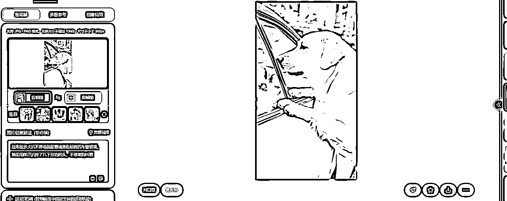

## 剪辑配音

和达人秀不同的是，达人秀可能只需要一个bgm就能让整个视频瞬间；来了感觉，但动物示警中，我们需要根据视频进度，严格对其进行音效匹配。

将生成好的分镜头片段按照顺序导入剪映当中，选中全部片段，先做个 1.2 倍速，这样可以使视频看起来更加紧凑一些。

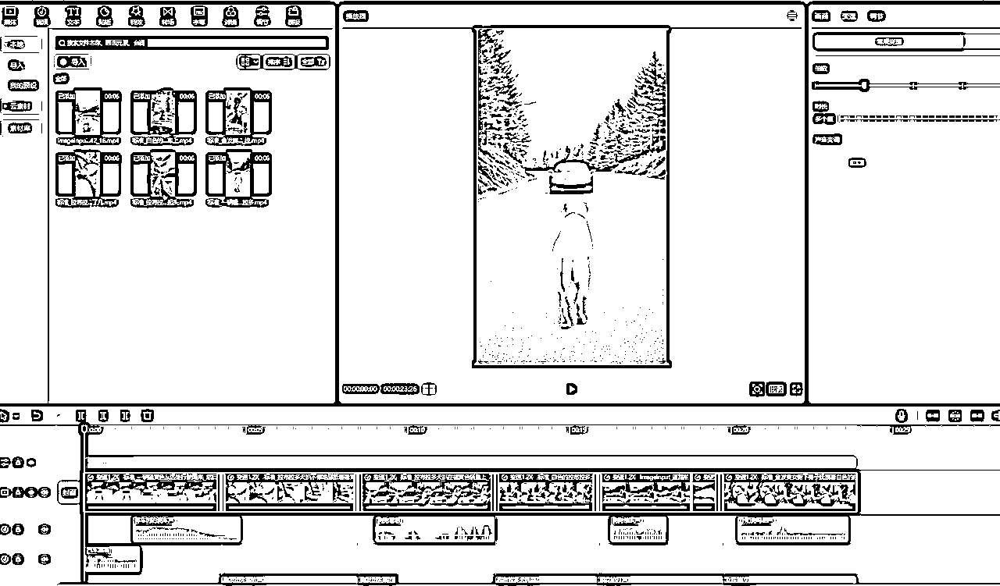

接下来再对每个片段进行检查，有些片段第一秒会出现静止状态，将这些影响视频流畅度的片段切割掉。随后便是对视频进行音效配音。

音效可以剪映自带的里面进行搭配。

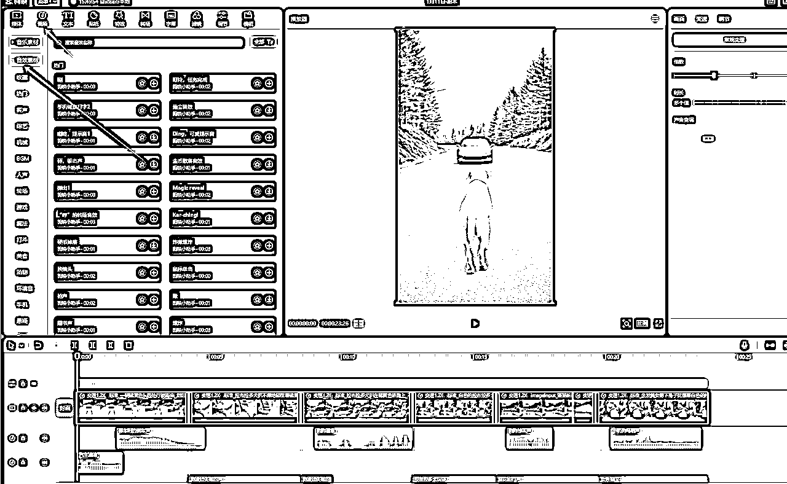

在搜索框搜索你需要的音效素材。

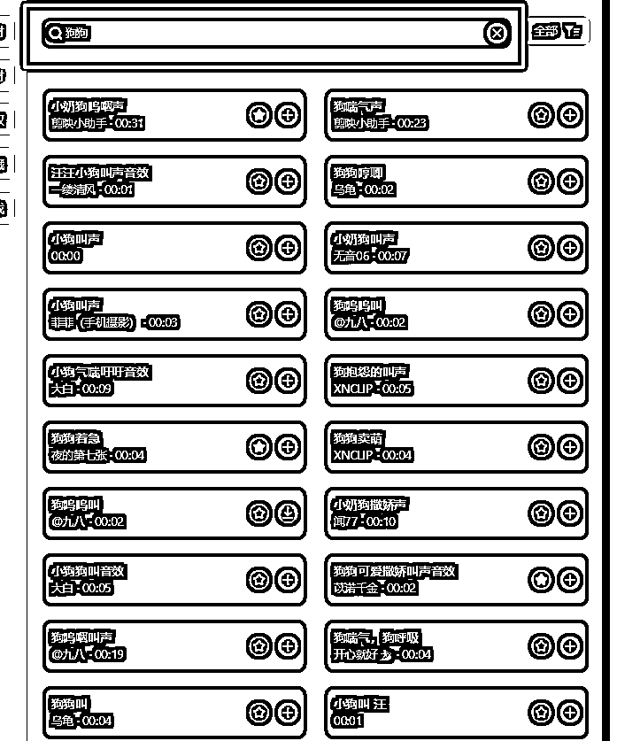

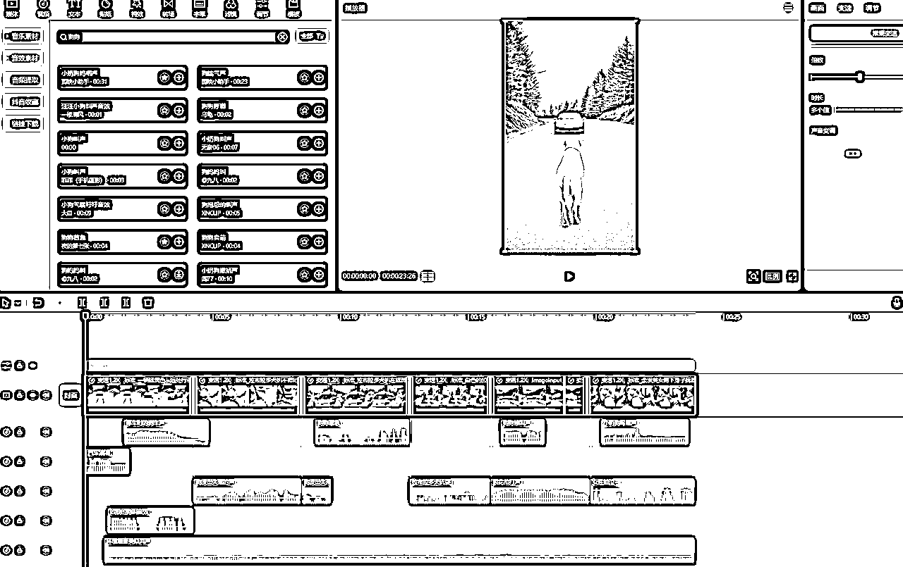

视频当中所用的音效素材有：环境白噪音、狗叫、狗委屈叫、狗着急叫、狗舔舐声音、拉布拉多玩耍声、汽车喇叭、汽车刹车、汽车发动机怠速声、浪花拍打声、这个根据视频和个人审美自己搭配就行。

还可以根据视频的表现对视频的色彩等进行调节，看个人审美。然后选择 4k 60 帧导出。

# 浅谈从起号到赚到第一个 100 美金过程中遇到的一些问题

## 网络问题

从实操开始，最开始遇到的问题便是网络问题，我其实对 ip 这块纠结了好久好久，总觉得这个 ip 行不行，那个 ip 行不行，用过大家常用的 airport，也按照圈友施仁的方法《搭建海外节点：三款免费工具 +99 元腾讯云，实现每月 1000G 流量》自行搭建过，还购买了数据中心 ip、静态住宅 ip。但无一例外都遇到了不同程度的 0 播问题。

这个参考航海实战中教练的方法进行测试，只要欺诈性，黑名单、等风险值处于安全范围内，我认为是可以用的。整体来说，YouTube 对 ip 的管控并不很严格，数据中心 ip、还是住宅 ip，都是可以做的，在考虑经济性的前提下，前期不建议直接上住宅 ip。当然，假如不在乎 ip 费用的话，那住宅 ip 肯定最优选择。是住宅 ip 贵也有贵的道理，它能模拟真实的家庭的宽带地址。只是价格相对较贵。

多账号操作的话，也可以参考这个视频《将任意协议节点转换为 socks 节点，无需搭建 socks 代理，小白一键生成 clash 配置文件，socks 代理多入口多出口，一个端口对应一个节点，助力跨境运营、网络爬虫，跨境电商必备工具》（需魔法观看），实现前期低成本运营。

账号可以通过自行注册和第三方购买得到，我一般会购买对应 ip 所在地区的账号，比如我的网络环境是新加坡，我会选择新加坡地区的账号，或者，我买了新加坡地区的账号，我会专门搭建一个新加坡的网络环境。减少地区跨度太大而导致触发谷歌系统的风控监测。

## 0 播问题

0 播问题这个是耽误我最长时间的一个问题了。在我第一个账号做的不错的时候，我便开始着手准备多账号了，在这期间，我经历了第一个视频就 0 播、前几天数据正常，三四天后，突然 0 播，包括前面的视频也不再推荐。我总结了以下一些原因

其次 0 播可从两个方向来判断是内容问题，还是账号 ip 等其他问题

0 播≠0 推荐

当你的视频内容出现 0 播放的时候，可以先从 YouTube 工作室——内容——覆盖面，这个数据面板查看是否有推流，如果推流次数有个位数，但播放次数为 0，至少可以说明账号是没问题的，这时候可以多更新几个视频观察观察。

如果推流次数为 0，自然也没播放次数，那么在账号、ip、内容三方面至少存在一项问题。这种情况下，只能挨个测试找出问题，或者直接更换账号。大部分情况可能是出现在账号问题上。

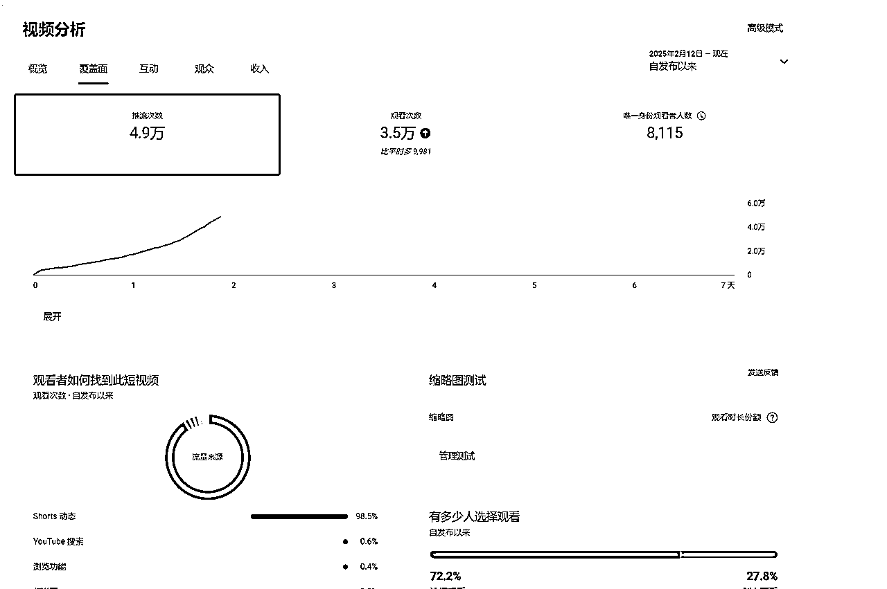

### 频道是否被收录

视频有播放的前提是你的频道是否被收录，倘若你的频道都搜不到，那么大概率你的视频也不会被搜索到，也必然得不到推荐，而新建立频道的收录时间大概是在 24 小时之内。所以在发视频之前，对于教练提到的频道装修最好都弄弄。最基本的头像，简介，名称要有。

第一个视频0播，可以先放放，说不定过两天就开始推荐了(我其中一个号发布第一条视频后，过了两天后才开始推荐）

### 网络导致的 0 播问题

在经过一系列亲自验证和一些圈友的实践经验得知，我的结论是：ip 会导致视频 0 播，而且并不是上述 ip 检测都达标，就一定不是 ip 原因导致的。有圈友在视频 0 播的情况下，换了一个网络环境，神奇的 0 播消失了。

### 界面语言导致的 0 播问题

我在新起小号的时候，在养号一个星期的前提下，发布视频后，又出现了神奇的 0 播，这已经是我第 7 个还是第 8 个 0 播账号了。在视频发出去两天没有一个观看的前提下，我因为无聊刷视频，总是刷不到日本的短视频，就突发奇想，把界面语言换成了日语，之前因为方便观看，设定的是中文，就这样，等二天我登录刷视频时，突然发现前两天发布的视频开始有了播放。所以，我怀疑可能是账号地区和我的界面语言不一致导致的 0 播问题。后续我严格按照哪个地区的账号就用哪个地区的语言，再也没有出现这么频繁的 0 播问题了。

### 更新几天突然 0 播的状况

这个情况我是出现在新账号、自建节点的情况下出现的，账号从注册到养号到发布内容，网络环境没变过，ip 是固定的，刚开始账号流量均能稳定破万播，但在三四天后突然出现新内容 0 推荐，目前没有好的解决办法，只能通过换号的形式暂时对应对。

## YPP 开通

我虽然在短时间便达到了开通初级 ypp 的条件，但是我的第一次 ypp 申请申请失败了。理由是再利用让人他人内容。

当时申请后出现这个后，感觉心态快要爆炸了，好不容易达到要求，却搞个这。于是，我开始找原因，甚至怀疑是不是 AI 赛道开通不了 ypp，于是，我将之前低流量、低画质的视频全部删除，只保留一些数据相对可以的。同时，我还将头像换了，昵称改了，准备等下次再申请。

可当我把申请失败的消息告诉教练方波妮后，不料方波妮教练却告诉我意料之内，很正常，申诉即可。并且让我不要担心！随即告诉我如何制作申诉方法，奈何再与波妮教练沟通前，我对频道的内容和昵称做了改变和删减，导致不符合申诉要求，于是，我便放弃了这次申诉机会，但与方波妮教练的交谈中，我还是宽心不少。决定好好准备下次的申请。

借此机会再次感谢方波妮教练，一个充满自信和能量的美女！

一个月后，当重新申请的时间达到后，我立马点击了申请，前一天晚上申请的，第二天早上审核通过。在重新申请的这段时间里。为了确保能够顺利申请通过，我对账号内容做出了以下调整。以便圈友参考

*   1.我在视频左下角添加了人头，自己录个几分钟的镜头，然后每次随机截取几十秒进行添加。

*   2.我在后续视频中添加了文字描述，以文本的形式对视频的故事情节做一个简单的描述讲解（纯文本无配音）

*   3.我在后台设定了视频简介模板，在后续的视频中我都自动添加的。（之所以添加，是因为在官方 ypp 审核文档中提到，会对视频简介也会做一个考量，为了确保万无一失，索性就全添加了）大致内容为：

Note: This is a short video generated by AI, not a real thing,

All the pictures and sound effects are made by myself, please do not copy or plagiarize,

Production software: mj, sd, runway, kelingAI, hailuoAI

The original intention of this channel and short video production is to call on everyone not to harm wild animals,

Sometimes, their abnormal behavior may simply be to help you.

Even without your knowledge, help you avoid danger.

# AI 动物示警赛道后续玩法的一些思考

## 思考

老马教练、方波妮教练、Gary 曹淦教练曾多次提到过一个事情，就是一个赛道，一个账号都必定存在一个流量的衰退期，当赛道衰退期来临的时候，AI 动物示警赛道又该如何进行转型之路呢？

以下是自己实践过程中的一点思考和见解。

前面曾提到，为了提高生产效率，我通过创作提示词模板的方式，减少了抽卡的概率，那么在转型之路上，我认为可以通过这个提示词模板来进行过渡。

以下是我的一点思路。

在动物示警的提示词模板中，如果将主体换成受伤的动物，或者最近比较火热的动物密集症救援（就那种爬满了蜜蜂，长满了虫子那种），然后第二，第三个动物互动的镜头同理，只需要将自然灾害镜头换成人类救援的分镜，比如人类给动物驱虫，人类给动物包扎、做手术。完全可以自由发挥，最后镜头再根据故事情节稍微进行调节即可。（这个玩法，我在小号上经过测试，是可以达到万播的基础流量池，基于新账号的流量规则，目前不能确定是否是个流量赛道，后续如果有爆款，会及时分享给大家。)

这样一个动物示警的提示词模板就可以巧妙的变成动物救援赛道。同理，发挥想象力，完全可以变换其他的，甚至更多的赛道。

这样，在后续的创作中，只需要更换动物主体、环境、等因素即可。这里分享一个我最近正在尝试的动物救治赛道的一个固定模板，可能存在一定的问题以及一些体验上的优化。模板已经是经过验证可以跑出来几十万流量的。但是我还没做到自动化，目前正在根据李哥帖子 学习。

## 分镜头模板库

分镜1：危机引入

A [动物] stands on [路面类型],

[受伤部位] trapped in [伤害源] (with [细节特征]), [液体描述] seeping from wounds.

[动物] faces camera sideways, [表情描写] reflecting pain and helplessness.

Right: [右侧环境], Left: [左侧环境].

[天空状态], [季节].

[镜头高度]+[镜头类型] focusing on [焦点].

The image is in cinematic composition, realistic style, Film Photography, 4k quality.

示例：A kangaroo stands on the gravel road of the grassland, with gray white fur.

Its neck was tightly tied with rusty wire mesh, sharp hooks deeply piercing the skin, and bright red liquid seeped out from the wound.

The kangaroo's expression was filled with pain, and its eyes reflected struggle and helplessness.

On the right side of this road is the vast African savannah, and on the left side is the marshland.

Blue sky, summer season.

The photo perspective is taken from the height of two people standing, with a mid-range lens.

The image is in cinematic composition, realistic style, Film Photography, 4k quality.

分镜2：车辆介入

A [动物] tenses as [车辆颜色] [车辆型号] approaches,

[重复伤害描述] with [新增细节].

[动物动作] showing [应激反应].

[车辆部件] dominates [画面占比].

Maintain [环境一致性].

[镜头参数] enhancing [关键元素].

The image is in cinematic composition, realistic style, Film Photography, 4k quality.

示例：A kangaroo stood on the gravel road of the grassland, its neck tightly bound by rusty wire mesh, sharp hooks deeply piercing its skin, and bright red liquid seeping out from the wound.

Back to the camera, the kangaroo's gray white fur glistens in the sunlight.

The kangaroo is facing a blue Jeep approaching the camera, its front headlights clearly visible.

On the right side of this road is the vast African savannah, and on the left side is the marshland.

Blue sky, summer season.

The photo perspective is taken from the height of two people standing, with a mid-range lens.

Focusing on the kangaroo's back and the blue Jeep's front.

Natural light enhances realistic details.

The image is in cinematic composition, realistic style, Film Photography, 4k quality.

分镜3：车窗视角（特写镜头）

A [动物] stands on [路面类型],

[受伤部位] trapped in [伤害源] (with [细节特征]), [液体描述] seeping from wounds.

[动物] faces camera sideways, [表情描写] reflecting pain and helplessness.

Right: [右侧环境], Left: [左侧环境].

[天空状态], [季节].

[镜头高度]+[镜头类型] focusing on [焦点].

The image is in cinematic composition, realistic style, Film Photography, 4k quality.

示例：Shot from inside the blue Jeep,

Through the car window, a kangaroo can be seen standing outside the car window.

Its neck was tightly tied with rusty wire mesh, sharp hooks deeply piercing the skin, and bright red liquid seeped out from the wound.

The kangaroo is close to the glass, gazing inside the car, the glass is clear with faint reflections of the vast African savannah outside.

Focus on the kangaroo's face, slightly blurred background, realistic details, high resolution.

The image is in cinematic composition, realistic style, Film Photography, 4k quality.

分镜4：动物与车的互动

A [动物] stands on [路面类型],

[受伤部位] trapped in [伤害源] (with [细节特征]), [液体描述] seeping from wounds.

[动物] faces camera sideways, [表情描写] reflecting pain and helplessness.

Right: [右侧环境], Left: [左侧环境].

[天空状态], [季节].

[镜头高度]+[镜头类型] focusing on [焦点].

The image is in cinematic composition, realistic style, Film Photography, 4k quality.

示例：A kangaroo stands on the gravel road of the grassland, licking the side of the blue Jeep.

Its neck was tightly tied with rusty wire mesh, sharp hooks deeply piercing the skin, and bright red liquid seeped out from the wound.

On the right side of this road is the vast African savannah, and on the left side is the marshland.

Blue sky, summer season.

Close-up shot, standing angle shooting, 3/4 right rear view, cinematography, realistic style, natural lighting, 4K image quality, Film Photography.

分镜5：人类介入

A [动物] stands on [路面类型],

[受伤部位] trapped in [伤害源] (with [细节特征]), [液体描述] seeping from wounds.

[动物] faces camera sideways, [表情描写] reflecting pain and helplessness.

Right: [右侧环境], Left: [左侧环境].

[天空状态], [季节].

[镜头高度]+[镜头类型] focusing on [焦点].

The image is in cinematic composition, realistic style, Film Photography, 4k quality.

示例：A kangaroo is standing on a gravel road in the grassland.

Its neck was tightly tied with rusty wire mesh, sharp hooks deeply piercing the skin, and bright red liquid seeped out from the wound.

Next to the kangaroo, there is a middle-aged white-haired man wearing a white shirt and blue denim, holding pliers and walking towards the kangaroo.

On the right side of this road is the vast African savannah, and on the left side is the marshland.

In the background, the blue Jeep is parked on the roadside.

Blue sky, summer season, taken at noon during the day.

The photo perspective is taken from the height of two people standing, with a mid-range lens.

Focusing on the kangaroo's body and the blue Jeep's front.

The image is in cinematic composition, realistic style, Film Photography, 4k quality.

分镜6：救援特写

A [动物] stands on [路面类型],

[受伤部位] trapped in [伤害源] (with [细节特征]), [液体描述] seeping from wounds.

[动物] faces camera sideways, [表情描写] reflecting pain and helplessness.

Right: [右侧环境], Left: [左侧环境].

[天空状态], [季节].

[镜头高度]+[镜头类型] focusing on [焦点].

The image is in cinematic composition, realistic style, Film Photography, 4k quality.

示例：A kangaroo is standing on a gravel road in the grassland.

A middle-aged man wearing a white shirt and blue denim is using pliers to remove the rusty wire mesh around the kangaroo's neck.

Deep cuts are visible on the neck, with dark red liquid staining gray white fur.

On the right side of this road is the vast African savannah, and on the left side is the marshland.

In the background, the blue Jeep is parked on the roadside.

Close-up shots of the man and the kangaroo, with the kangaroo occupying 70% of the photo.

The image is in cinematic composition, realistic style, Film Photography, 4k quality.

分镜7：救援递进

A [动物] stands on [路面类型],

[受伤部位] trapped in [伤害源] (with [细节特征]), [液体描述] seeping from wounds.

[动物] faces camera sideways, [表情描写] reflecting pain and helplessness.

Right: [右侧环境], Left: [左侧环境].

[天空状态], [季节].

[镜头高度]+[镜头类型] focusing on [焦点].

The image is in cinematic composition, realistic style, Film Photography, 4k quality.

示例：A kangaroo is standing on a gravel road in the grassland.

A middle-aged white-haired man wearing a white shirt and blue denim is wrapping a bandage around the neck of the kangaroo.

There is a dark red liquid oozing from the bandage around the neck.

On the right side of this road is the vast African savannah, and on the left side is the marshland.

In the background, the blue Jeep is parked on the roadside.

Close-up shots of the man and the kangaroo, with the kangaroo occupying 70% of the photo.

The image is in cinematic composition, realistic style, Film Photography, 4k quality.

分镜8：救治结束动物+车辆离开

A [动物] stands on [路面类型],

[受伤部位] trapped in [伤害源] (with [细节特征]), [液体描述] seeping from wounds.

[动物] faces camera sideways, [表情描写] reflecting pain and helplessness.

Right: [右侧环境], Left: [左侧环境].

[天空状态], [季节].

[镜头高度]+[镜头类型] focusing on [焦点].

The image is in cinematic composition, realistic style, Film Photography, 4k quality.

示例：A kangaroo stands on a gravel road in the grassland, facing the camera sideways, about one or two meters away from the camera.

Its neck was wrapped in circles of bandages, and a small amount of dark red liquid seeped out from the bandages.

The kangaroo's expression was filled with relief, and its eyes reflected gratitude.

On the right side of this road is the vast African savannah, and on the left side is the marshland.

The blue Jeep is parked on the roadside, with its rear facing the camera, as if it is heading towards the distance.

Blue sky, summer season.

The photo perspective is taken from the height of two people standing, with the middle taken away from the camera.

The image is in cinematic composition, realistic style, Film Photography, 4k quality.

# 特别感谢

@方波妮教练，如果你心态不对了，请一定找方波妮教练聊聊，一个自信乐观充满能量的美女。

@Gary 曹淦 曹教练，几乎可以称之为 YouTube 百事通，不管是什么问题总能在曹教练这找到解决办法。热情且慷慨，是真的在解决问题，分享干货。

@吖占 认识占哥是在后续的陪跑阶段，从此不再孤单，作为项目搭子，我跟占哥几乎每天都在交流如何增强视觉效果，互相分享新赛道，很享受这种互相激励，互相探讨，加油打气的氛围。

最后，感谢@七天老师、@波妮教练、@Gary曹教练对文章给予的指导！

后续有新的爆款玩法，再来给大家做汇报，祝大家早日开通ypp。

本文引用

1.老马教练：《YouTube Shorts 赛道选择与收益解读》

2.方波妮教练：《YouTube Shorts 项目实操：从 0 到 1 跑通账号，12 天收获 2700+订阅与 90 万+播放》

3.竹子：《YouTube Shorts 实操指南：AI 宝宝走秀与 Magic 变身视频制作》

4.老马教练：《YouTube Shorts 赛道选择与收益解读》

5.施仁：《搭建海外节点：三款免费工具 +99 元腾讯云，实现每月 1000G 流量》

6.李香君：《如何才能高效的产出AI视频》