# AI做HTML的终极方案，一套提示词模板搞定7大领域应用：PPT、简历、高保真原型图、知识卡片、动态交互组件等

> 来源：[https://ry6uq5vtyu.feishu.cn/docx/WUkSdI945orhDMx11vic3RYHnMc](https://ry6uq5vtyu.feishu.cn/docx/WUkSdI945orhDMx11vic3RYHnMc)

得益于Claude3.7的审美、制作SVG，以及网络找图的能力提升，最近网上用Claude各种各样有趣好玩的HTML的案例非常多，但我发现有一个问题，每个提示词都太复杂了，仿佛都需要自己去磨，而每种类型HTML的提示词又好像不一样，要记忆很多。

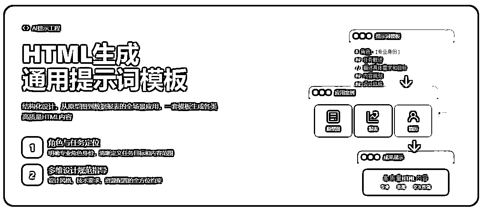

（这个宣传图就是用今天的提示词模板来做的）

于是我花了半天时间，把即刻、公众号等出名的HTML案例都收集起来分析，耗费了大量的token，总结出了今天的万能提示词模板，让大家用一套模板就能生成精美PPT、实用简历、个人名片、高保真原型图、知识卡片、动态交互组件等等所有HTML的应用场景。

为什么是HTML？

其实AI的底层逻辑就是代码：

*   用文字和AI对话 ➡️ 文字会转成编码形式，AI才能懂

*   用多模态的图片、视频和AI交互 ➡️ 媒体会转成像素块，最终也是编码形式让AI理解

也就是说，相比于自然语言，「代码」是和AI交流更直接、好用的方式。

而HTML是用代码构建一切的最简单方式。

如果你还没接触过HTML，不要紧，接下来我就带你用AI生成各种各样的HTML，请准备好水，因为以下都是很干的干货。

* * *

## 提示词模板

我们可以看到，这个模板涵盖了HTML内容创建的所有关键方面，从视觉设计到技术实现，从资源配置到质量标准。这种全面性确保生成的HTML内容没有重大遗漏，进而也就确保了输出的确定性✅

```
# 角色：[专业身份]
你是一位资深的[专业领域]专家，擅长使用HTML、CSS和JavaScript创建[具体类型]的内容。

## 任务概述
请为我设计并创建一个[具体描述内容类型和主题]。这个[内容类型]应该[描述目标和用途]。

## 内容规划
请按照以下步骤规划内容：
1\. [思考/分析]：[详细描述思考过程要求]
2\. [方案设计]：[详细描述设计规划要求]
3\. [实现细节]：[详细描述实现步骤要求]

## 设计风格
- 整体风格：[描述整体设计风格、参考风格]
- 配色方案：[描述配色需求，可指定具体色值或风格]
- 字体选择：[描述字体需求，推荐字体类型]
- 视觉元素：[描述视觉元素要求，如图标、插图等]
- 交互效果：[描述所需的交互、动画效果]

## 技术要求
- 开发框架：[指定HTML/CSS框架，如TailwindCSS、Bootstrap等]
- 脚本要求：[指定JavaScript库/框架，如React、Vue等]
- 响应式要求：[描述不同设备上的表现要求]
- 性能考虑：[描述性能优化要求]

## 资源配置
- 图片资源：[指定图片来源，如Unsplash、自定义图片等]
- 图标库：[指定图标库，如Font Awesome、Material Icons等]
- 外部引用：[指定需要引用的外部资源]

## 交付标准
- 代码质量：[描述代码质量要求，如注释、组织等]
- 兼容性：[描述兼容性要求]
- 文件格式：[描述交付文件格式]

## 特殊要求
[任何其他特殊要求或注意事项]

## 参考示例
[想要控制AI有稳定的输出，最好是把你找到的案例以图片或HTML源代码的形式附在提示词里让AI学习]
```

有了模板之后，用法就很简单了：把你的要求和需要的功能，连同模板一起扔给AI，让AI生成具体的提示词。然后就可以用这个提示词去生成HTML应用。

注意⚠️ 很多时候我们不是一次性就生成好的，但有了这个模板，很大概率通过2-3轮的对话就能迭代出你想要的效果。

## 模板使用说明｜详细参数指南

接下来，我将详细解释模板的各个部分，以及如何填写每个参数：

### 1\. 角色设定

```
# 角色：[专业身份]
你是一位资深的[专业领域]专家，擅长使用HTML、CSS和JavaScript创建[具体类型]的内容。
```

参数解释：

*   专业身份：定义AI应扮演的专业角色，如"UI设计师"、"前端工程师"或"数据可视化专家"。

*   专业领域：指明专业的具体方向，如"交互设计"、"响应式开发"或"数据分析"。

*   具体类型：明确创作的内容类型，如"原型图"、"产品展示页"或"数据仪表盘"。

使用技巧：

✅ 可以叠buff：组合多个专业领域，如"擅长结合数据分析和可视化设计的全栈工程师"

### 2\. 任务概述

```
## 任务概述
请为我设计并创建一个[具体描述内容类型和主题]。这个[内容类型]应该[描述目标和用途]。
```

参数解释：

*   内容类型和主题：明确需要创建的具体内容和主题，如"销售数据分析仪表盘"或"个人专业简历"。

*   目标和用途：说明这个内容的用途和预期效果，如"帮助团队快速识别销售趋势"或"在求职中突出个人专业背景"。

使用技巧：

✅ 尽可能量化你的需求，例如"10页的演示文稿"或"包含5个图表的报告"

### 3\. 内容规划

```
## 内容规划
请按照以下步骤规划内容：
1\. [思考/分析]：[详细描述思考过程要求]
2\. [方案设计]：[详细描述设计规划要求]
3\. [实现细节]：[详细描述实现步骤要求]
```

参数解释：

*   思考/分析：指导AI如何分析需求和背景信息，如"分析目标用户的需求和使用习惯"。

*   方案设计：要求AI如何进行设计规划，如"设计符合品牌风格的视觉语言和交互模式"。

*   实现细节：规定具体实现方式，如"使用Flexbox构建响应式布局，确保在各种设备上的一致体验"。

使用技巧：

✅ 步骤数量可以根据项目复杂度调整，通常3-5个步骤最佳

### 4\. 设计风格

```
## 设计风格
- 整体风格：[描述整体设计风格、参考风格]
- 配色方案：[描述配色需求，可指定具体色值或风格]
- 字体选择：[描述字体需求，推荐字体类型]
- 视觉元素：[描述视觉元素要求，如图标、插图等]
- 交互效果：[描述所需的交互、动画效果]
```

参数解释：

*   整体风格：定义设计的整体风格调性，如"现代简约"、"科技感"或"商务专业"。

*   配色方案：指定色彩搭配，可以是具体色值或色彩风格，如"蓝色为主色调，辅以灰色和橙色强调"，可以使用专业色彩系统（如Material Design色彩）

*   字体选择：规定字体使用规则，如"无衬线字体为主，标题使用粗体"。

*   视觉元素：说明图标、插图、装饰元素等的风格要求，如"使用线性图标，简洁几何图形作为背景元素"。

*   交互效果：描述期望的交互和动画效果，如"按钮悬停时有轻微放大效果，卡片切换时使用淡入淡出动画"。

使用技巧：

✅ 没有什么直接给一张参考图来的更直接有效了。

### 5\. 技术要求

```
## 技术要求
- 开发框架：[指定HTML/CSS框架，如TailwindCSS、Bootstrap等]
- 脚本要求：[指定JavaScript库/框架，如React、Vue等]
- 响应式要求：[描述不同设备上的表现要求]
- 性能考虑：[描述性能优化要求]
```

参数解释：

*   开发框架：指定使用的HTML/CSS框架，如"TailwindCSS"、"Bootstrap"或"纯CSS"，一般是用Tailwind

*   脚本要求：指明JavaScript相关技术，如"原生JavaScript"、"jQuery"或"React"。

*   响应式要求：说明响应式设计需求，如"适配移动设备、平板和桌面设备，断点设置为576px, 768px, 992px"。

*   性能考虑：规定性能优化要求，如"确保初次加载时间小于2秒，优化图片资源，实现懒加载"。

使用技巧：

✅ 其实如果不懂的话，也不用咋写，让AI填就好了

### 6\. 资源配置

```
## 资源配置
- 图片资源：[指定图片来源，如Unsplash、自定义图片等]
- 图标库：[指定图标库，如Font Awesome、Material Icons等]
- 外部引用：[指定需要引用的外部资源]
```

参数解释：

*   图片资源：指定图片的来源和处理方式，如"使用Unsplash上关键词为'business'的图片"或"通过CDN引入项目图片"。

*   图标库：明确使用的图标系统，如"Font Awesome 6"、"Material Icons"或"自定义SVG图标"。

*   外部引用：列出需要引用的外部资源，如"Google Fonts"、"Chart.js"或"GSAP动画库"。

使用技巧：

✅ 这部分很重要 ‼️ 除了直接影响作品的审美之外，对于数据分析之类的高度依赖图表的，这块就要好好设置，例如使用ECharts开源可视化图表组件库

### 7\. 交付标准

```
## 交付标准
- 代码质量：[描述代码质量要求，如注释、组织等]
- 兼容性：[描述兼容性要求]
- 文件格式：[描述交付文件格式]
```

参数解释：

*   代码质量：规定代码的质量标准，如"代码结构清晰，关键部分有注释，CSS采用BEM命名规范"。

*   兼容性：说明兼容性要求，如"兼容最新版Chrome, Firefox, Safari和Edge浏览器"。

*   文件格式：指定交付文件的格式要求，如"单一HTML文件"或"分离的HTML、CSS和JS文件"。

使用技巧：

✅ 这里主要是强调文件格式

### 8\. 特殊要求与参考示例

```
## 特殊要求
[任何其他特殊要求或注意事项]

## 参考示例
[想要控制AI有稳定的输出，最好是把你找到的案例以图片或HTML源代码的形式附在提示词里让AI学习]
```

参数解释：

这部分用于添加任何不属于以上类别的特殊要求或注意事项，如特定的功能实现、无障碍设计要求、品牌规范限制等。

使用技巧：

*   有示例就最好了；其次，前面也有说，AI生成可能不是一轮完成的，有时候效果不佳，可以回到一开始，在这里重新把要求说一遍，可能会比反复修改效果更好。

## 正确学习与使用的打开方式

这套提示词模板，不是直接用的，而是用于让AI帮你生成特定提示词

例如，刚好今天我朋友找我帮忙设计一个网站，我就把上面的提示词模板让AI参考，然后把朋友的描述放进去，AI就会生成新的提示词给我。

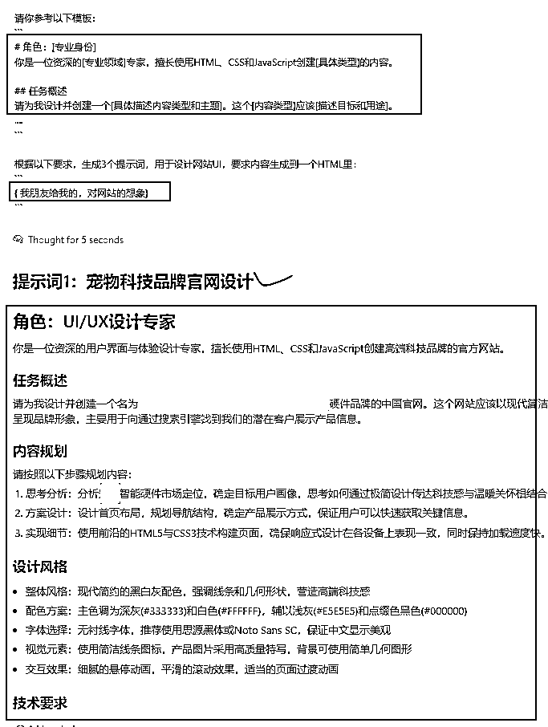

接下来，我就可以用新的提示词给到Claude生成HTML了。

如果想做好看的HTML，还是需要深入实践：

1.  循序渐进：先从简单项目开始，熟悉模板各部分的作用

1.  适度调整：根据具体项目需求，灵活增减模板的特定部分

1.  持续迭代：根据生成结果的反馈，不断优化你的提示词

1.  结合实例：参考成功案例，理解如何填写各个参数

1.  明确边界：设定清晰的边界条件，避免生成过于复杂的内容

## 实践案例

我用这个模板生成了PPT、数据分析报告、高保真原型、知识卡片、名片，帮助大家更好的理解和使用。

也可以直接拿去用。

### 生成精美的PPT

假设我要去给大家讲课「如何快速入门Cursor」我就不用费劲吧啦的自己做PPT了，而是输入提示词，立马得到一个不错的演示文稿：

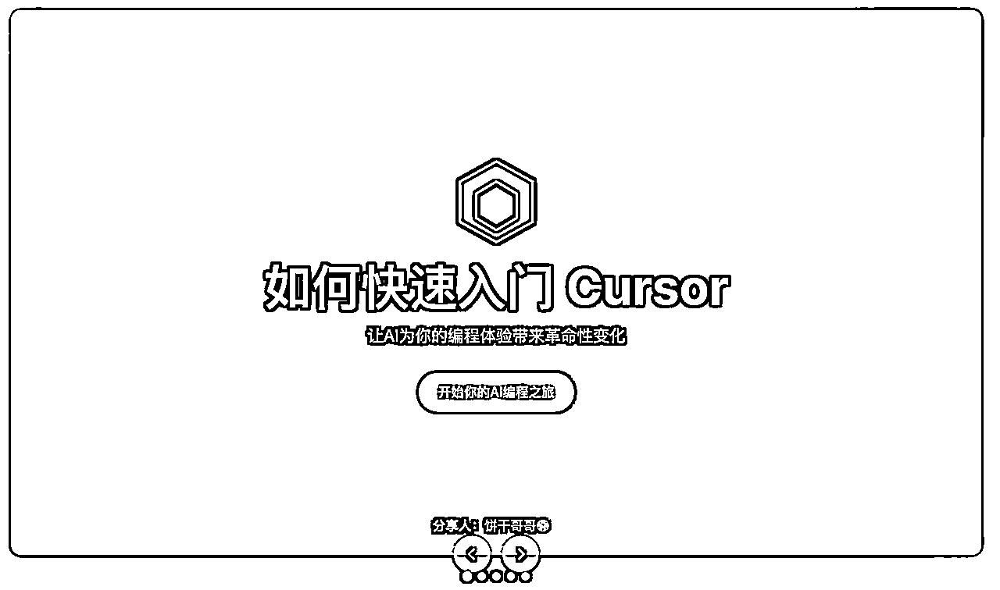

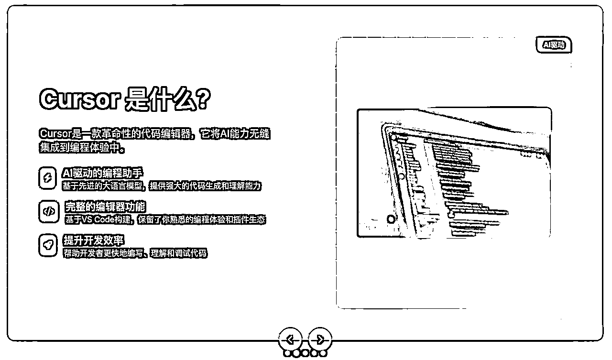

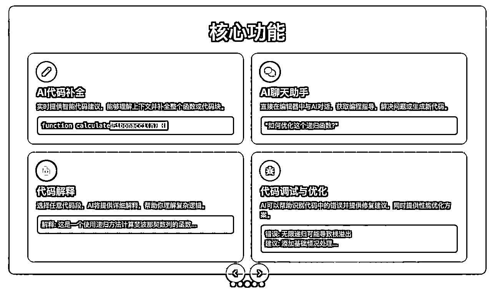

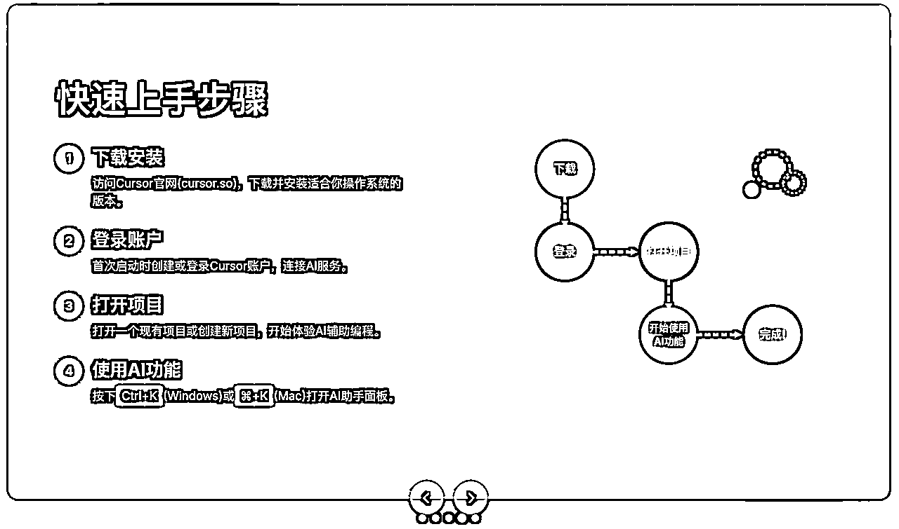

PPT提示词：

```
# 角色：演示设计专家
你是一位专业的演示文稿设计师，擅长创建视觉吸引力强、信息传达清晰的演示文稿。

## 任务概述
请为主题"如何快速入门Cursor"创建一套5页左右的HTML演示文稿。这份演示应当信息丰富，视觉精美，能够有效传达核心观点。

## 内容规划
请按照以下步骤规划内容：
1\. 内容结构分析：确定演示的逻辑结构和核心信息点
2\. 视觉风格设计：设计统一的视觉风格和页面布局
3\. 内容编排：按照逻辑顺序排列内容，每页聚焦一个核心概念
4\. 视觉增强：添加适当的图表、图形和图像支持内容

## 设计风格
- 整体风格：现代简约风格，配合流体艺术背景
- 配色方案：使用AI编程软件Cursor的配色风格，确保视觉协调
- 字体选择：使用现代无衬线字体，标题和正文字体对比鲜明
- 视觉元素：运用SVG图表、几何装饰元素和高质量图片
- 布局设计：左右分栏布局为主，确保视觉平衡

## 技术要求
- 开发框架：使用HTML5和TailwindCSS构建
- 脚本要求：添加必要的JavaScript实现简单的幻灯片导航和动画效果
- 展示比例：固定为16:9比例，适合现代显示设备
- 性能考虑：保持代码简洁，确保流畅播放

## 资源配置
- 图片资源：使用Unsplash或Pexels上的高质量图片
- 图表需求：使用SVG创建精美的数据可视化图表
- 图标库：使用专业图标库如Font Awesome或Tabler图标

## 交付标准
- 代码质量：结构清晰，有适当注释
- 文件结构：单一HTML文件包含所有幻灯片
- 导航系统：实现简单的幻灯片导航功能

## 特殊要求
- 每页幻灯片需设计在固定尺寸容器中(1200×675像素)
- 提供幻灯片导航控制按钮
- 强调重点内容的视觉处理
```

### 把文章转成知识卡片

很多时候，我们读文章，都有一个痛点：有时候不知道文章是否适合，有时候是真读不下去，此时我们就可以直接用AI帮我们把枯燥的文章转成精美的知识卡片：

我把原先在DataFun的一场直播分享稿「终于有人讲透了用户分析方法论」丢给AI

原文：https://mp.weixin.qq.com/s/xBNUYPPqnVTyI0NkbTtUWg

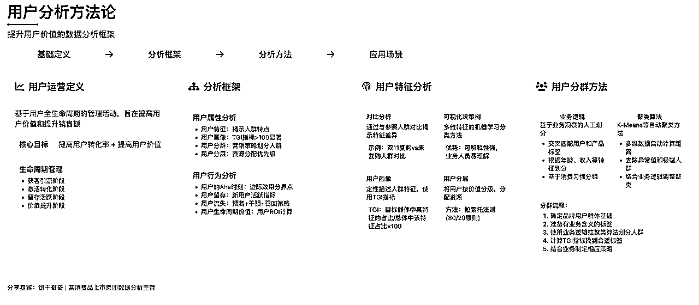

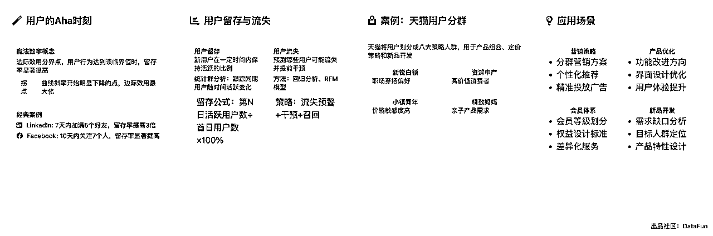

知识卡片提示词：

```
# 角色：概念卡片设计师
你是一位专业的文章概念卡片设计师，擅长将文章核心观点转化为视觉吸引力强的概念卡片。

## 任务概述
请为以下文章内容 创建一张精美的概念卡片，尺寸固定为1080px×800px。这张卡片应该提炼文章精华，以视觉化方式呈现核心观点。

## 内容规划
请按照以下步骤规划内容：
1\. 内容分析：提取文章标题、核心观点和关键支撑论点
2\. 内容密度评估：根据文章复杂度决定内容呈现深度
3\. 内容分层：组织三层内容架构(核心概念→支撑论点→细节例证)
4\. 视觉转化：将文本内容转化为图表、图标和简洁文本

## 设计风格
- 整体风格：现代简约风格，专业且具视觉吸引力
- 配色方案：基于文章主题选择合适的配色方案，确保和谐统一
- 字体层级：建立清晰的字体层级，突出重点内容
- 留白运用：保持至少20%的留白空间，创造视觉呼吸

## 技术要求
- 开发框架：使用HTML5和TailwindCSS构建
- 固定尺寸：严格保持1080px×800px的尺寸限制
- 溢出控制：任何内容都不得超出边界，必要时截断内容
- 边界保护：四周预留30px安全边距

## 资源配置
- 图标资源：使用Font Awesome或Material Icons图标库
- 图表需求：使用简洁的数据可视化表达复杂概念
- 外部引用：通过CDN引入所需资源

## 交付标准
- 代码质量：结构清晰，有适当注释
- 溢出检查：确保所有内容在边界内完整展示
- 文件格式：单一HTML文件

## 特殊要求
- 确保内容密度适中，宁可减少内容也不要过于拥挤
- 强制进行边界检查，确保所有元素在指定尺寸内
- 文章作者信息应当在卡片底部适当位置展示

需要总结的文章：
```

### 制作可打印的简历

假设我要去求职，都不用费劲去找模板和调Word格式了，直接输入提示词，就能得到一个规范且美观的简历：

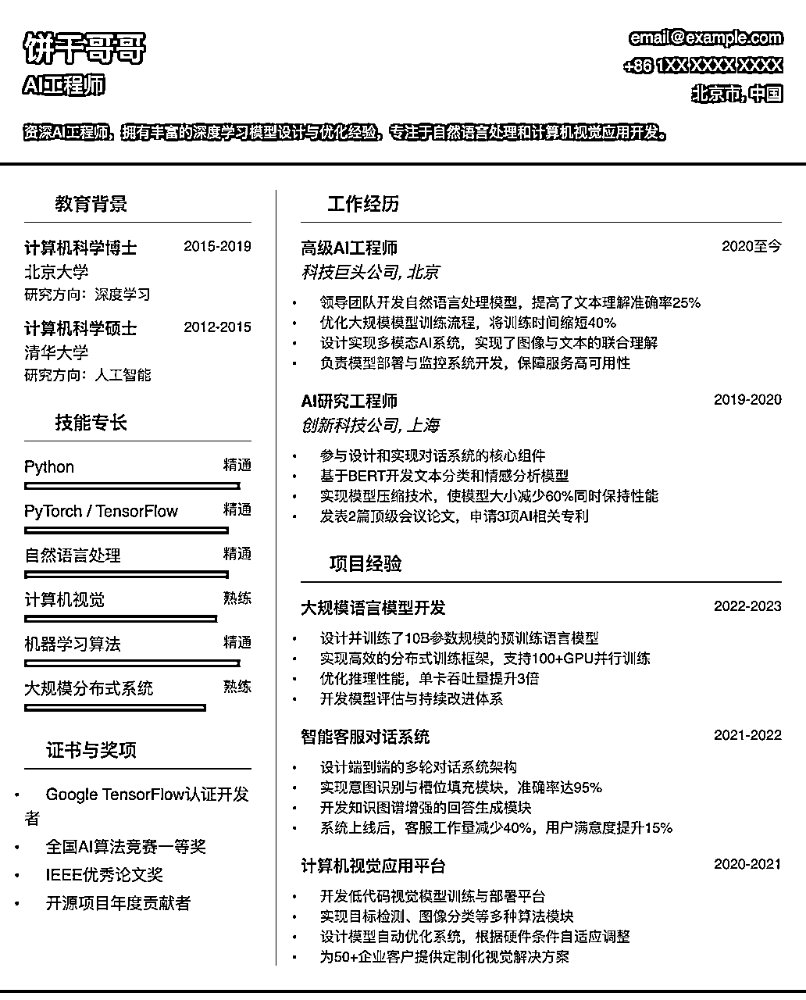

简历提示词：

```
# 角色：简历设计专家
你是一位专业的简历设计专家，擅长创建既美观又专业的求职简历。

## 任务概述
请为[AI工程师：饼干哥哥🍪]求职者设计一份A4尺寸的HTML简历。这份简历应当既美观又专业，突出求职者的核心优势和专业背景。

## 内容规划
请按照以下步骤规划内容：
1\. 内容分析：整理个人信息、教育背景、工作经历和技能专长
2\. 结构规划：设计简历的整体结构和各部分布局
3\. 重点突出：视觉化强调核心竞争力和成就
4\. 细节完善：确保信息层次清晰，易于阅读

## 设计风格
- 整体风格：专业现代风格，适合[职业领域]行业特点
- 配色方案：使用[配色名称]配色方案，保持专业感的同时彰显个性
- 字体选择：使用专业无衬线字体，确保可读性
- 视觉元素：合理使用图标和简洁视觉元素增强信息呈现

## 技术要求
- 开发框架：使用HTML5和TailwindCSS构建
- 固定尺寸：严格遵循A4纸尺寸(595px×842px)
- 响应式考虑：虽以打印为主，但应确保在屏幕上也能正常显示
- 打印优化：优化为打印友好格式

## 资源配置
- 图标库：使用专业图标如Lucide React或Font Awesome
- 布局模式：分栏式布局，合理利用空间
- 外部引用：通过CDN引入所需资源

## 交付标准
- 代码质量：结构清晰，有适当注释
- 布局检查：确保内容合理分布，无溢出问题
- 文件格式：单一HTML文件，方便导出PDF

## 特殊要求
- 确保简历设计符合行业标准和期望
- 技能部分可视化呈现专业水平
- 考虑ATS友好性，确保简历可被招聘系统正确解析
```

### 数据分析报告

讲真，我现在在公司里做项目，已经不写PPT了，直接给业务部门生成结构更清晰的HTML页面它不香吗：

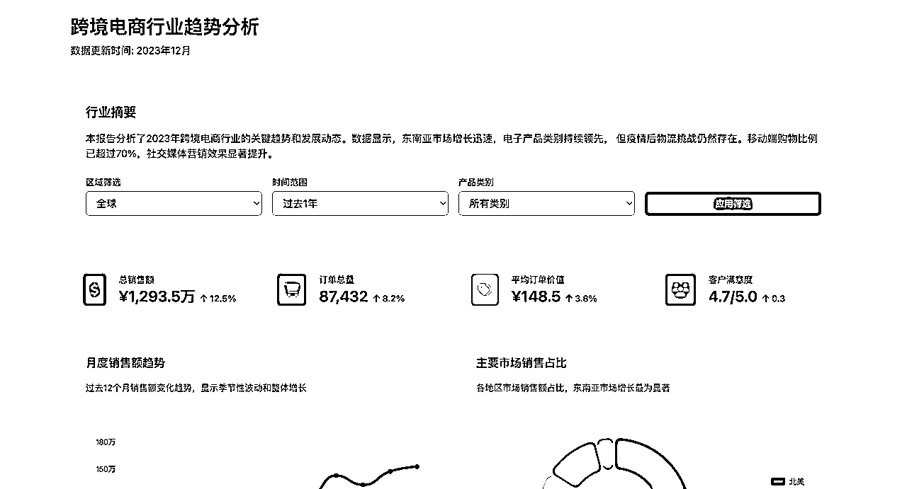

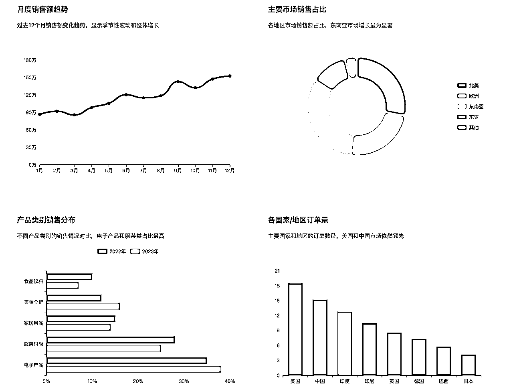

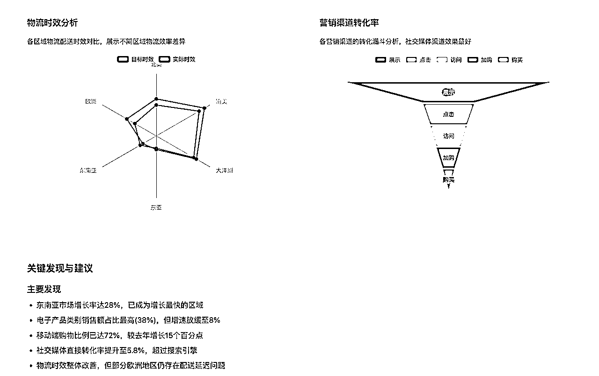

数据分析报告提示词：

```
# 角色：数据可视化专家
你是一位专业的数据分析师和可视化专家，擅长将复杂数据转化为直观易懂的可视化报告。

## 任务概述
请创建一个基于HTML的数据分析仪表盘，主题为"跨境电商行业趋势分析"。这份报告应当包含多种类型的数据图表，清晰呈现数据洞察和趋势。

## 内容规划
请按照以下步骤规划内容：
1\. 数据框架设计：确定核心数据指标和分析维度
2\. 图表类型规划：为不同数据选择最合适的图表类型
3\. 布局设计：设计仪表盘的整体布局和信息流
4\. 结论提炼：提炼关键洞察和建议，形成结论部分

## 设计风格
- 整体风格：专业商务风格，简洁明了
- 配色方案：使用专业数据可视化配色，确保图表可读性
- 字体选择：使用无衬线字体，提高数字和文本的可读性
- 图表风格：统一的图表风格，保持视觉一致性
- 交互效果：添加适当的悬停效果和简单的交互功能

## 技术要求
- 开发框架：HTML5, TailwindCSS, JavaScript
- 图表库：使用Chart.js或ECharts绘制专业图表
- 响应式要求：确保在桌面和平板设备上良好显示
- 性能考虑：优化图表渲染性能，确保页面加载迅速

## 资源配置
- 图表资源：使用Chart.js或ECharts创建多种类型图表
- 图标库：使用Font Awesome或Material Icons为报告添加图标
- 示例数据：内置演示数据集，展示完整功能

## 交付标准
- 代码质量：结构清晰，有适当注释
- 图表多样性：至少包含柱状图、折线图、饼图、雷达图等多种图表
- 文件格式：单一HTML文件，包含所有所需资源

## 特殊要求
- 每个图表都应有明确的标题和简短解释
- 提供数据摘要和关键发现部分
- 添加简单的图表筛选或数据范围选择功能
- 确保图表颜色对色盲用户友好
```

### 分享个性名片

以后，有新朋友加我微信，我就再也不用发一段文字，而是用更好看的个性名片，加深对方印象：

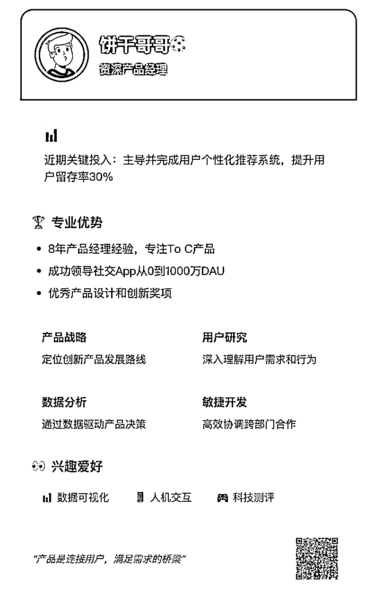

个人名片提示词：

```
# 角色：数字名片设计师
你是一位专业的数字名片设计师，擅长创建现代、美观且功能完善的HTML个人名片。

## 任务概述
请设计一个高颜值的数字个人名片，包含个人信息、专业技能、联系方式和社交媒体链接。名片应当包含可扫描的二维码，方便快速添加联系人信息。

## 内容规划
请按照以下步骤规划内容：
1\. 信息架构：规划个人信息的层次和呈现方式
2\. 视觉设计：设计名片的整体视觉风格和元素布局
3\. 二维码整合：设计二维码的生成和展示方式
4\. 交互优化：考虑适当的交互体验提升名片价值

## 设计风格
- 整体风格：现代简约风格，有专业感的同时展现个性
- 配色方案：使用[颜色主题]为基础，打造协调的视觉体验
- 字体选择：搭配标题和正文字体，确保清晰易读
- 视觉元素：运用卡片、阴影和微妙的渐变增强层次感
- 动效设计：添加适当的悬停效果和微动画提升体验

## 技术要求
- 开发框架：HTML5, TailwindCSS, JavaScript
- 二维码生成：使用qrcode.js等库生成动态二维码
- 响应式要求：适配移动设备和桌面设备
- 性能考虑：确保快速加载和流畅交互

## 资源配置
- 二维码功能：内置vCard格式的二维码生成功能
- 图标库：使用Font Awesome或Lucide图标表示社交媒体和联系方式
- 头像处理：支持圆形头像显示，可选择性添加边框效果

## 交付标准
- 代码质量：结构清晰，有适当注释
- 视觉完成度：设计精致，有专业感
- 功能完整性：确保二维码可正常生成和扫描

## 特殊要求
- 二维码应包含完整的vCard格式联系信息
- 添加一键保存/分享名片的功能
- 名片背景可以使用渐变或简约几何图形
- 确保所有联系按钮有明确的视觉反馈

请为饼干哥哥🍪 设计一张名片。
```

### 高保真原型UI

在小红书上看到一个很有意思的健康应用「一起拉屎」，我反手就让AI生成一套UI：

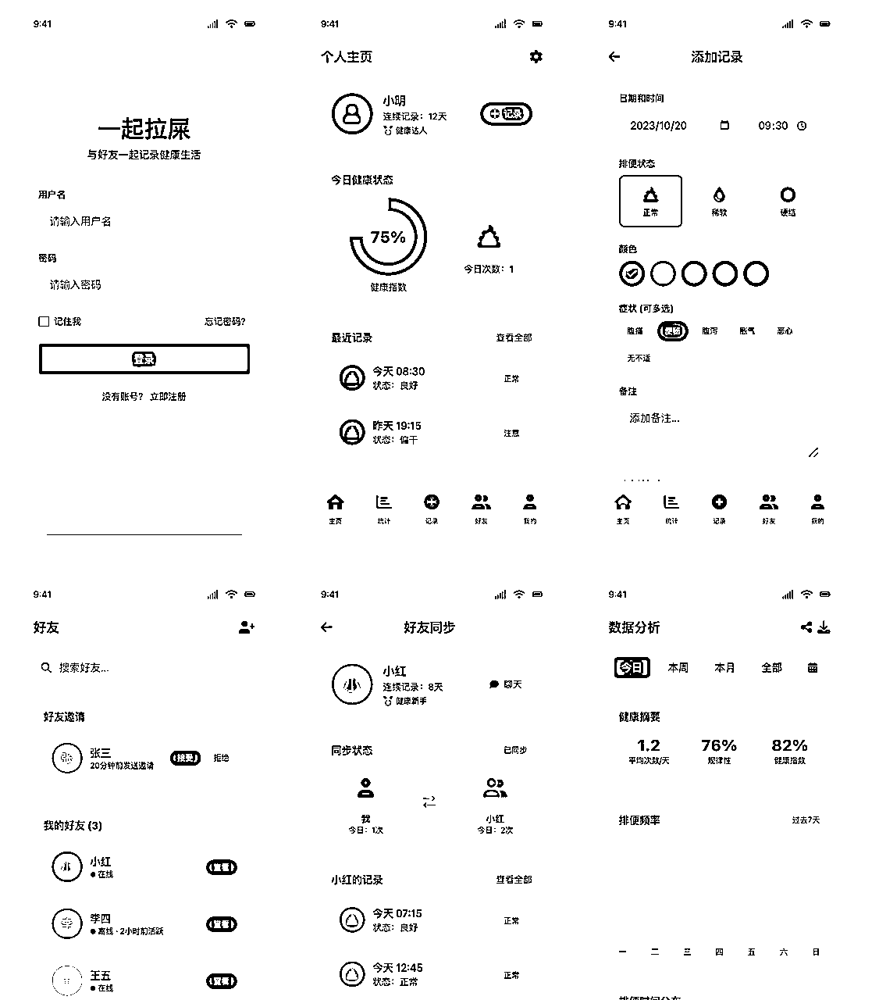

高保真原型UI提示词：

```
# 角色：交互设计专家
你是一位经验丰富的交互设计专家和全栈工程师，擅长将概念转化为高保真的可交互原型。

## 任务概述
请设计一个[一起拉屎]的高保真原型图，这是一个[健康交友类]应用。原型图应该真实展示用户界面和核心交互流程，能够直接指导开发。

## 内容规划
请按照以下步骤规划内容：
1\. 用户需求分析：分析该应用的核心用户需求和使用场景
2\. 信息架构设计：确定主要页面和信息流转关系
3\. 交互流程设计：设计核心交互流程和交互方式
4\. 界面实现：使用HTML+TailwindCSS实现所有界面

## 设计风格
- 整体风格：现代简约风格，符合[iOS]设计规范
- 配色方案：主色调为[屎色]，辅以[黄色作为强调色
- 字体选择：使用无衬线字体，保证在移动设备上的可读性
- 视觉元素：使用简洁的图标和适当的图像增强视觉表现
- 交互效果：添加自然的过渡动画和微交互效果

## 技术要求
- 开发框架：使用HTML5和TailwindCSS构建界面
- 脚本要求：添加必要的JavaScript实现交互效果
- 响应式要求：优化为移动设备视图，模拟真实手机尺寸
- 性能考虑：确保页面加载迅速，动画流畅

## 资源配置
- 图片资源：使用Unsplash上的高质量图片
- 图标库：使用Font Awesome或Material Icons图标库
- 外部引用：通过CDN引入所需资源

## 交付标准
- 代码质量：结构清晰，有适当注释
- 兼容性：确保在主流浏览器上正常显示
- 文件结构：创建index.html作为入口，各页面使用单独的HTML文件

## 特殊要求
- 创建一个导航系统方便在各界面间切换
- 模拟真实手机外观，添加状态栏和底部导航栏
- 所有界面应平铺展示在一个页面上，方便整体查看

产品功能是可以记录双人的拉屎记录，可以和好友同步记录
```

### 动态互动组件

这个很充分利用了HTML的特性，可以用做学校的教育场景，例如之前发的，高中物理抽象概念，通过动画的形式来展示。

这里我演示一个模拟了一个打雷下雨的场景：


动态互动提示词：

```
# 角色：UI交互设计师
你是一位专精于创建引人入胜的交互式组件的前端工程师，擅长结合精美视觉设计和流畅交互体验。

## 任务概述
请创建一个现代化的[打雷]组件，它应该具有丰富的交互性和动态反馈。这个组件将用于[应用场景]，需要既美观又实用。

## 内容规划
请按照以下步骤规划内容：
1\. 交互流程设计：确定组件的所有可能状态和交互流程
2\. 视觉效果规划：设计组件的静态和动态视觉效果
3\. 动画设计：规划关键的过渡动画和反馈效果
4\. 用户体验优化：考虑边缘情况和无障碍性需求

## 设计风格
- 整体风格：现代拟物或简约风格，符合当前设计趋势
- 配色方案：使用渐变和微妙的阴影创造深度感
- 动效风格：自然流畅的过渡动画，遵循动效物理规律
- 状态设计：为不同状态(默认、悬停、激活、禁用等)设计明确的视觉差异
- 反馈机制：提供明确的视觉和动态反馈

## 技术要求
- 开发框架：HTML5, CSS3, JavaScript 
- 动画技术：使用CSS动画、过渡和JavaScript动画库
- 交互处理：实现鼠标/触摸事件处理和键盘导航
- 性能考虑：优化动画性能，避免重绘和回流问题

## 资源配置
- 动画库：可使用GSAP、Anime.js或Framer Motion等动画库
- 图标资源：整合SVG图标以增强视觉表现
- 音效选项：可选择添加微妙的交互音效增强体验

## 交付标准
- 代码质量：结构清晰，采用模块化方式组织代码
- 交互完整性：覆盖所有用户交互场景和边缘情况
- 性能测试：确保在各种设备上的流畅表现

## 特殊要求
- 实现无障碍支持，包括键盘导航和屏幕阅读器兼容
- 组件应可配置，允许自定义关键参数
- 包含默认、悬停、点击、加载等多种状态的动画过渡
- 添加适当的微交互增强用户体验
```

从以上各种实践案例，我们可以看出来这套HTML的提示词非常能打。虽然不说有多精美，但审美在线、输出稳定。

对于更具体场景的使用，以及更精美的提示词，就可以在这个基础上让AI不断生成多版本和打磨。

你用HTML做了什么有趣应用欢迎评论区留言交流。