# 我利用影刀制作了一批自动发布工具，在解决了拖延的同时还提高了效率，方法和工具奉上

> 来源：[https://y9j12wbinr.feishu.cn/docx/Wv4ed7f7XocSlPxWFKccUXFenzb](https://y9j12wbinr.feishu.cn/docx/Wv4ed7f7XocSlPxWFKccUXFenzb)

我平时有很严重的拖延症，对于自己这个缺点我看了很多文章或者资料，总是找不到一种对症下药的感觉。有一天我早上起来喝茶的时候把自己手上实操的项目和每天要做的事情写在纸上整理了一下，突然想起大学那会学到的泰勒科学管理法，找到了自己的病因和对应的配方，希望这篇文章可以帮助到和我一样的朋友。

# 发现问题

大家可以一起思考一下，我们在互联网创业中面对的是各种各样的平台，比如视频类的有抖音，快手，b站，视频号。图文类的有小红书，小绿书。文章类的有公众号，知乎。我们普通人想要在这些平台里面混口饭吃，必须要摸清楚什么样的内容更符合平台的规则。我之前喜欢用一键发布工具，做完一个视频，我直接就所有平台分发了，所以在其中就会犯一个十分致命的错误，四个平台的爆款杂糅到一起，最后结果就是做出来的内容四个平台都不受欢迎。我相信这个问题很多人遇到过，这我想告诉大家，对于一些有价值的平台，一定不要假装努力。

上面问题的解决方法是我开始针对性的做内容，根据小红书的爆款特点做出来的内容，我只去发小红书，针对抖音的爆款特点做出来的内容，我只去发抖音。我的拖延症也是从这开始放大的，我可能一个小时做完小红书的内容之后，我就去做抖音的了，这是最理想的状态，但是常态是我做完小红书的内容之后，我可能跑去喝茶了，或者去看视频看书了，这样的后果是俩个小时可以解决的问题直接变成了四个小时都完成不了。于是就有了今天要给大家分享的这套方法，希望可以帮助到有需要的朋友。（铺垫了这么多只是为了展示我整个心路变化，可能有一些朋友正处在某个阶段绕不出去，可能像我走过弯路的一句话就能解决大家的问题）

# 解决问题

## 理论基础

这个方法就是我上面和大家分享的泰勒科学管理法，这个方法在我们生活中是随处可见的，一个公司有不同的部门，每个部门只负责用最效率的方法解决自己专业领域内的事情，这样无数个分散的部门就组成了一个完整的公司。在我们工作中其实也是同样的道理，大家肯定会有这种感觉，你在连续做同一个或者相似的工作的时候，你重复俩次之后，基本你的平均用时会变短，而且神奇的是做出了的效果可能会更好。这个就是这个管理法最神奇的地方，我的理解是我们在重复俩三次之后会进入一种心流状态，在心流状态中真的可以说是事半功倍。

## 理论在实践过程中的困难

针对上面这个方法，我的做法是，专注于一点，一次性完成某些工作的一周的任务量。比如我周一上午，我只用来做小红书的图文，其他的工作我都不去做。这样做果然效率提高了很多，但是有一个缺陷就是我不得不到时间就去发布一下其他做好的内容，比如我周一做完了一周的小红书任务量，我给自己定的时间是每天上午10点发送一次，下午5点发送一次，但是可能在上午10点的时候，我还在做抖音的内容，我不得不去放下抖音去发布小红书，尽管发布这种小事情浪费不了多少时间，但是我的注意力不够集中，很容易被分散开。这个问题纠结了我很久，后来突然想到自己会一点rpa，如果我用rpa把发布作品的任务取代了，那我是不是可以专心做自己的事情了。只需要在喝水或者点烟的时候点个启动键就解决了，其他的都不需要我去考虑。

## 用rpa来解决解决瑕疵

这个主要来说一下rpa的一些作用和效果。我刚开始给自己做的rpa工具十分随意，因为毕竟只是自己用嘛，比如我买了某个ai综合站的会员，我就不会再花钱去调用其他ai的api了，我直接就模拟人工去识别某个完成元素，之后把内容批量放到表格里面，有时候专门跑内容的话我看后台记录能跑200万token，像自动发布工具刚开始那些就是我用什么，就做什么，而且针对性特别强，比如我嫌弃识别元素识别的麻烦，就直接识别图片，在我自己的俩个电脑上面运行的相当丝滑。

这段时间属于是效率飞速提升的阶段。之后正好马上快315了，互联网流量都不太好，我就静下心来搓了几个大家都可以适用的工具。效果还是很不错的，基本上实现了大家用三十分钟配置好表格，剩下的就是每天点几下的事了。

## 升级后rpa工具

我自己属于一个干活的，所以能理解很多朋友的感觉，我给自己的影刀工具分别做了4个市场。

分别是edge浏览器单账号版本，谷歌浏览器单账号版本，谷歌浏览器多账号版本，比特浏览器多账号版本。

目前发布工具我只做了抖音，小红书，公众号，b站，小绿书，闲鱼自动上架。后续再抽空弄一下视频号的。

ai生产工具目前只有一个是万能文章洗稿工具。（具体大家可以看图）

毫不夸张的说，大家只要把我这个配置表填准确了，你都不用去检查发布过程，让他自己去操作就够了。我给大家举几个例子：我在小红书发布流程里面设置了自己设置想要的合集和群聊，公众号发布支持自定义添加开头和结尾，我相信很多朋友都需要这个功能，文章洗稿里面我设置的默认提示词是markdown格式）

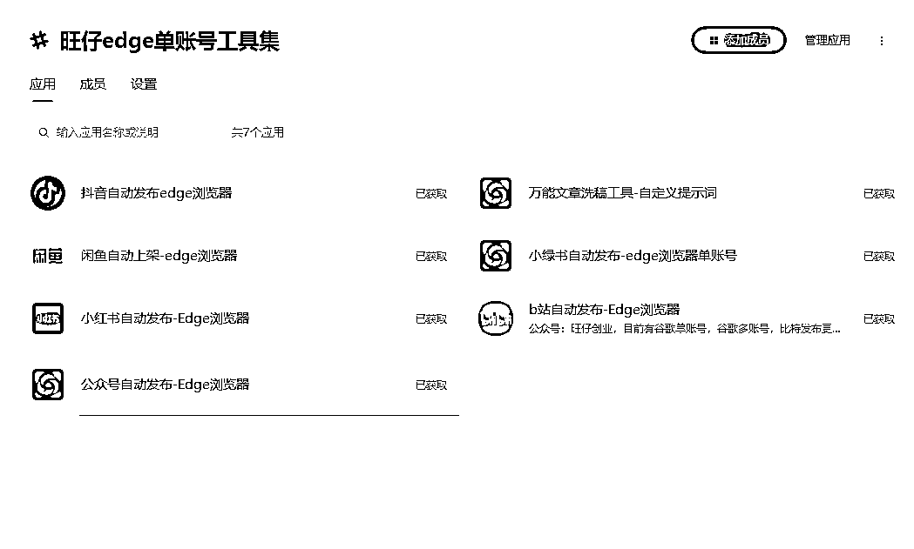

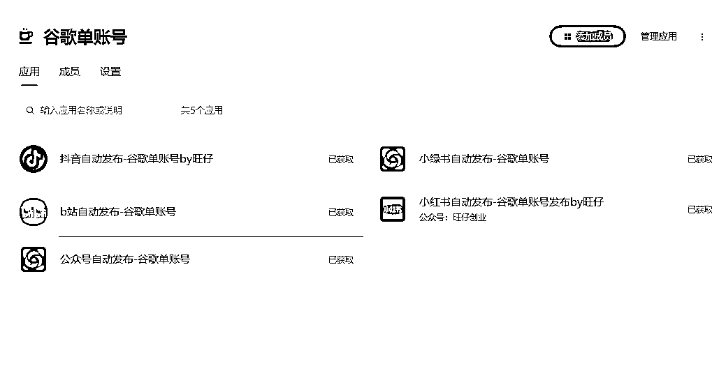

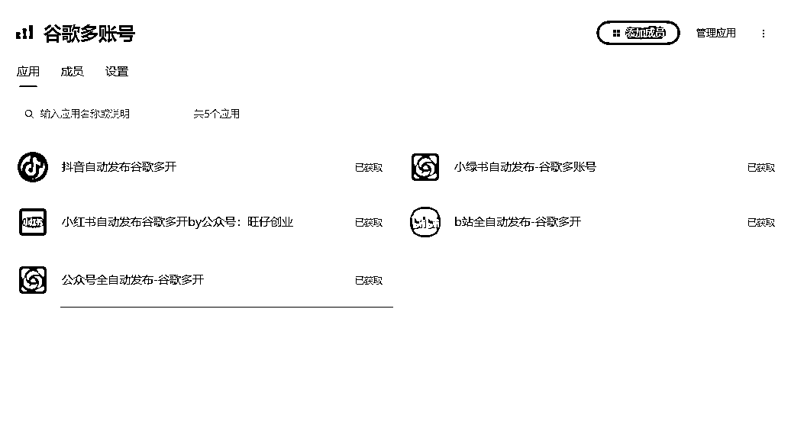

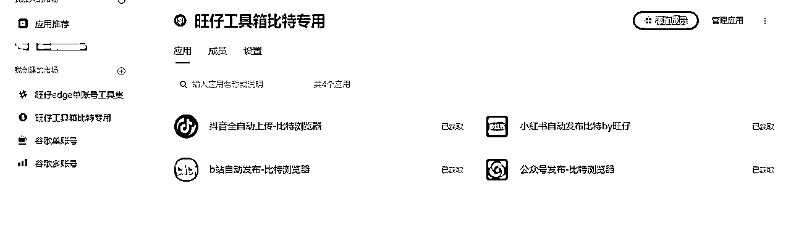

# rpa工具介绍

今年我会分享很多影刀工具，并且持续更新，本篇文章给大家具体分享一下我给大家的影刀脚本链接如何使用。新手小白可以跟着教程一步一步来，老司机直接获取链接用就可以了

我在脚本里面设置了暗号，大家在暗号栏目里面输入：生财有术。

## 影刀首次安装视频教程演示

## 影刀首次安装图文教程

### 一：下载影刀（有影刀忽略）

https://www.winrobot360.com/share/activity?inviteUserUuid=598859198794305538

### 二：加入应用市场（有账号的直接登录，没账号注册一个）

https://www.winrobot360.com/share/accede?inviteKey=e63955eb-3ba7-4bf4-bd67-2476508a3a39

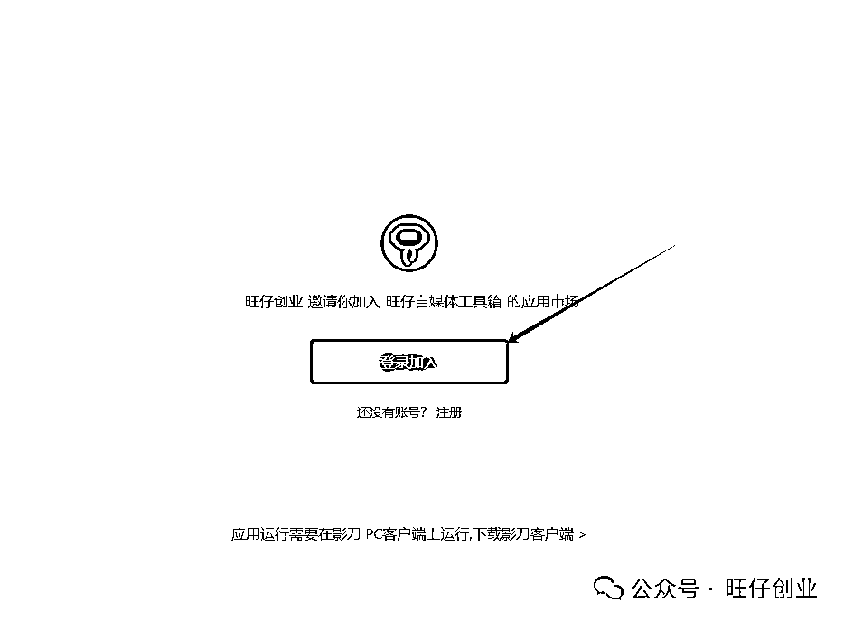

### 三：验证是否添加应用

进入影刀桌面版-点击市场（可以看到加入的市场）

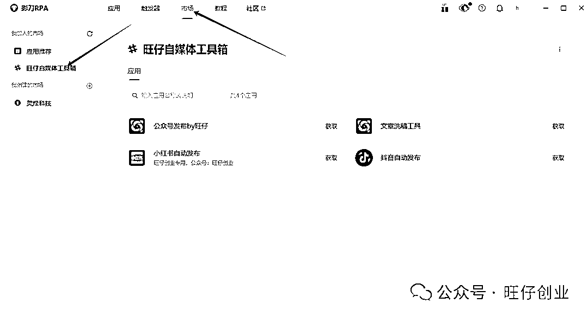

### 四：对应应用点击获取

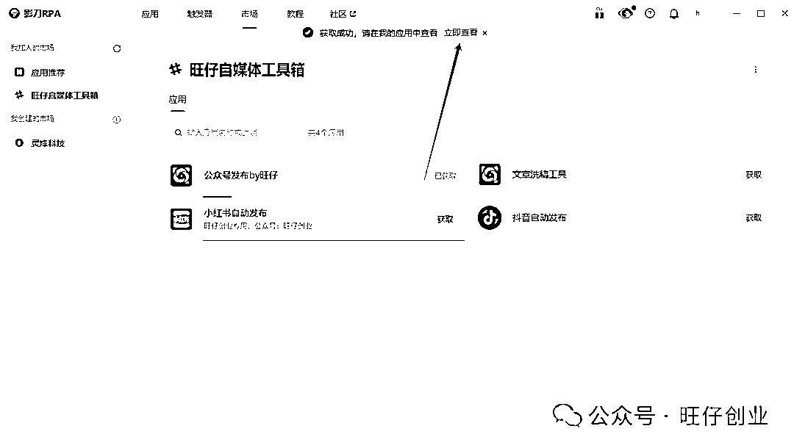

### 五：查找对应获取应用即可

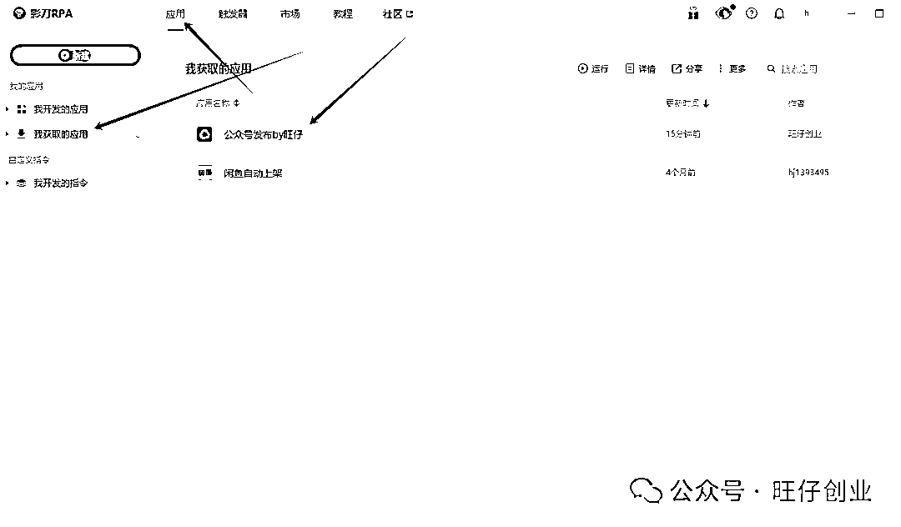

### 六：浏览器配置

我用的基本是系统自带的Microsoft Edge和比特浏览器，所有只做这俩个的教程，其他的相似。（此次就用官方教程借花献佛了）

#### Microsoft Edge

Microsoft Edge 安装插件说明 - 影刀帮助中心

#### 谷歌浏览器

浏览器插件安装说明 - 影刀帮助中心

#### 比特浏览器

##### 1.下载比特浏览器

下载比特浏览器：https://www.bitbrowser.cn/download/

在下载安装好比特浏览器之后，注册账号，免费账号可以开十个环境，一天一共打开50次，对于普通人来说绰绰有余了。

##### 2.在比特浏览器中安装影刀插件

##### 2.1 影刀插件安装

打开比特浏览器找到扩展中心，输入影刀，之后点击搜索，在设置中选择所有窗口

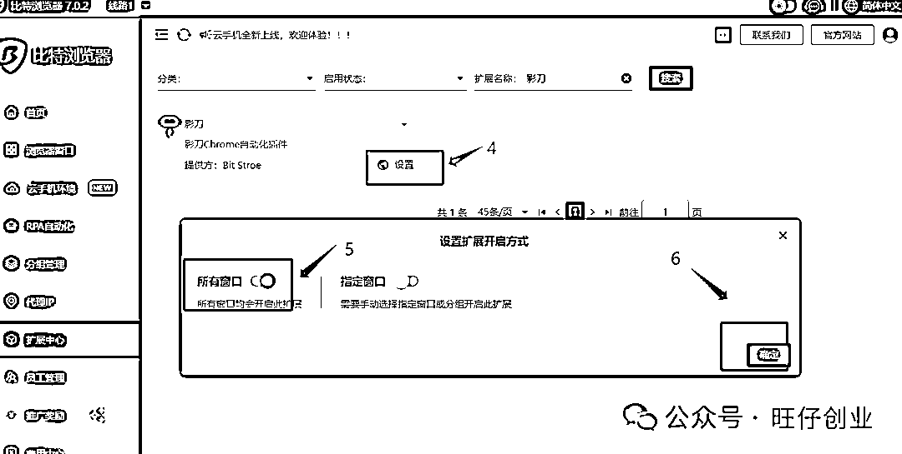

##### 2.2 验证影刀插件是否安装成功

1.随便创建一个窗口

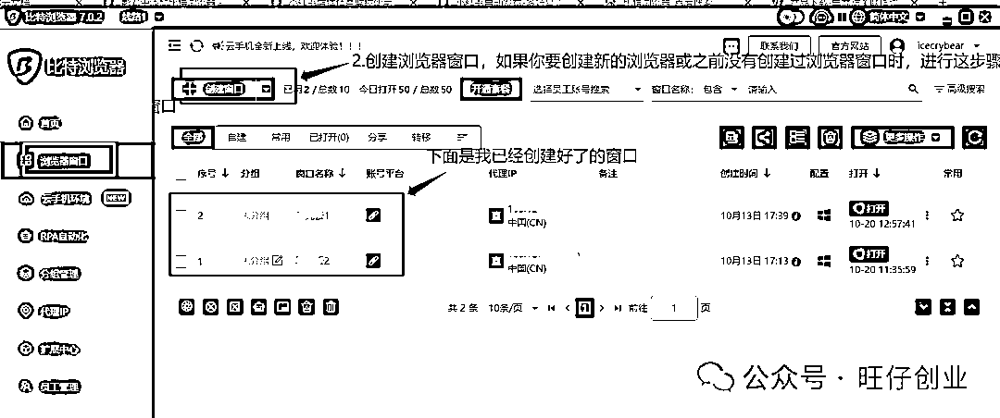

打开窗口看看影刀浏览器是否安装成功

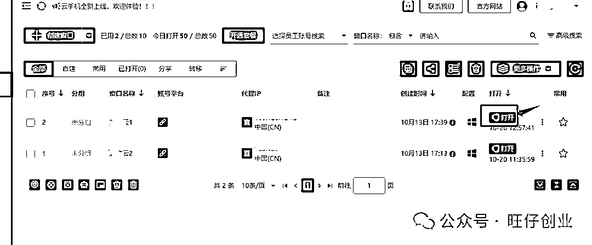

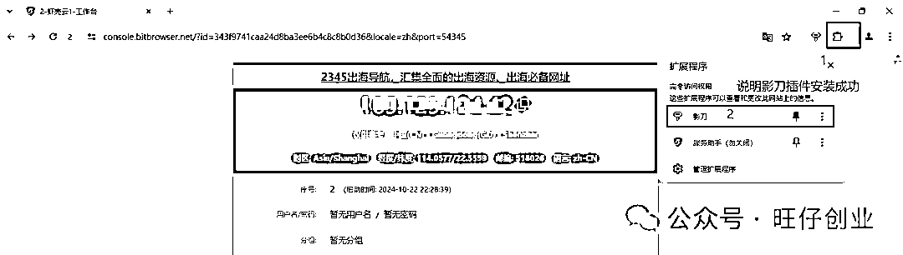

##### 3.在影刀中添加比特浏览器的路径

3.1 随便打开一个比特浏览器窗口

3.2 在电脑下方任务栏右键鼠标，找到任务管理器，点击

3.3 找到刚打开的比特浏览器进程后鼠标右键，（一定要注意打开和我图片显示一样演示的进程，里面有一个进程容易混淆，打开文件所在目录，然后复制这个目录地址，保存下来，待会会用上。

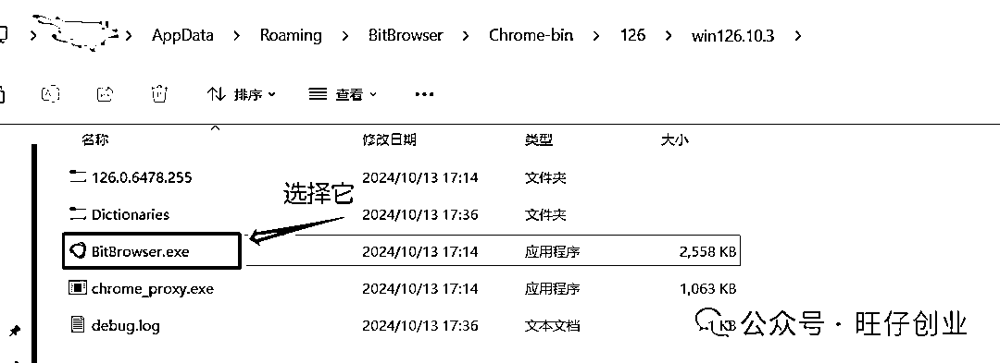

复制以上目录地址，为以下影刀中添加比特浏览器时，能快速找到比特浏览器。

##### 4.影刀中添加比特浏览器

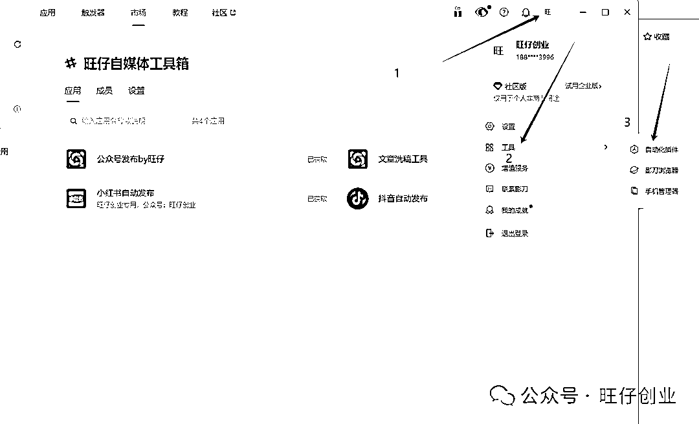

将比特浏览器所在的目录地址复制到文件地址栏，回车。就可以看到比特浏览器文件，选择它就行。成功之后就和我上面的图显示一样。

##### 比特浏览器，需要获取对应窗口的id

### 七：操作页面

每个工具都有对应的表格模板，大家自行下载即可

暗号：生财有术

可以勾选记住内容，方便第二次使用

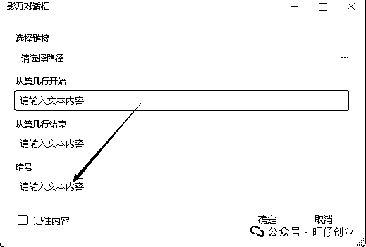

# 万能文章洗稿工具

文章链接可以公开访问的就可以洗稿，测试稳定的是公众号链接，今日头条，搜狐号。

所有应用不支持mac电脑，如果是mac电脑，请开启双系统win模式（自行百度）

## 一：注册下载影刀

https://www.winrobot360.com/share/activity?inviteUserUuid=598859198794305538

## 二：加入应用

https://www.winrobot360.com/share/accede?inviteKey=e63955eb-3ba7-4bf4-bd67-2476508a3a39

加入应用后，在桌面版找到应用

## 三：影刀首次内部插件配置

（内部包含edge，谷歌，比特浏览器插件安装）

## 四：使用教程

## 一：配置表格

表格下载：

我用夸克网盘分享了「万能文章洗稿工具」

链接：https://pan.quark.cn/s/7587d3317a90

只需要在表格第一列放进去你要洗稿的文章链接就行，我这亲测的公众号，头条都可以，（理论上每一个链接访问的文章都可以洗）

后面的不需要在改写完文章后会自动填入

## 二：启动界面配置

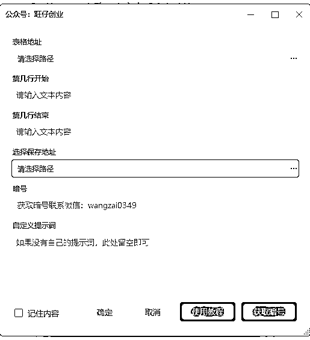

保存地址：选择洗稿后保存word的文件夹，就像我演示上面选择的文件夹，文件夹名称就是洗稿后的文章标题，文件夹里面就是对应的洗稿后的word。

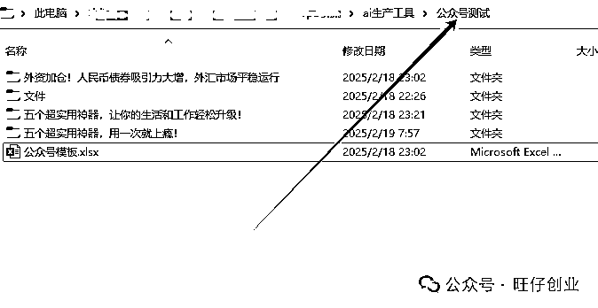

开始行：从第几行开始

结束行：洗稿到第几行结束

暗号:生财有术

自定义提示词：如果有自己的提示词就直接输入，如果没有提示词的话可以直接留空，我里面内置了。

（自己的提示词最好加这一段：只要以代码块模式输出的标题和正文，不要输出任何提示语以及上面的markdown）

ps：一次可以多输入一些链接去洗稿，后续搭配我给大家的公众号自动发布工具就省事多了。

## 三：使用前注意

### 在edge浏览器登陆好kimi：https://kimi.moonshot.cn/

# 公众号发布（edge浏览器/谷歌浏览器单账号）

所有应用不支持mac电脑，如果是mac电脑，请开启双系统win模式（自行百度）

## 一：注册下载影刀

https://www.winrobot360.com/share/activity?inviteUserUuid=598859198794305538

## 二：加入应用

edge浏览器应用市场

谷歌应用市场

加入应用后，在桌面版找到应用

## 三：影刀首次内部插件配置

（内部包含edge，谷歌，比特浏览器插件安装）

## 四：使用教程

### 1：配置表格

表格下载地址：

我用夸克网盘分享了「公众号自动发布模板」，点击链接即可保存。打开「夸克APP」，无需下载在线播放视频，畅享原画5倍速，支持电视投屏。

链接：https://pan.quark.cn/s/c88b18f6864d

下载好配置表格，结合上面给大家的洗稿工具

### 1.1原创者配置（A列）

如果要勾选原创选项，在A列输入名字，不勾选原创则留空。

### 1.2标题（B列 顾名思义，不赘述）

### 1.3内容地址（C列）

如果是用我的洗稿工具洗出来的，直接复制洗稿之后的表格即可

如果是自己的内容，填入文件夹地址（该文件夹下务必只有一个word文件）

### 1.4封面图地址（D列）

复制封面图的文件地址进去，右键图片，找到复制路径，复制出来的是这样的格式："F:\下载文件暂存\海报中转\蓝色科技扫码关注公众号二维码.png"

在填入表格时去掉引号，即：F:\下载文件暂存\海报中转\蓝色科技扫码关注公众号二维码.png

如果不添加封面图，表格留空就行

### 1.5话题（E列）

如果要添加话题的话用上面的格式即可：#话题

如果不添加话题留空

### 1.6原文链接（F列）

要添加链接直接表格内放入链接

不添加留空即可

### 1.7创作来源（G列）

一共4种来源选择，按照我表格模板来就行（切记不要更改，比如你要选择ai生成，就直接在表格输入ai）

不选择来源则留空

### 1.8发布状态（H列）

在文章发布后会自动输入状态，方便更改

### 1.9固定开头（I列）

如果文章要在开头插入固定开头，先创建一个word文档，把要固定的内容填入word。之后在I列输入开头文档的文件地址。

### 1.10固定结尾（J列）

如果文章要在结尾插入固定结尾，先创建一个word文档，把要固定的内容填入word。之后在J列输入结尾文档的文件地址。

## 2：启动页面配置（可以选择记住内容方便下次用）

开始行号：从表格第几行开始发布文章

结束行号：到表格第几行的文章结束

ps：如果只发一篇文章，比如只发第二行的文章，就在开始行和结束行都写2

如果一次发俩篇文章，就在开始行填2，结束行填3，就会生成下图的格式

单词最多可添加8篇文章，要注意

暗号：生财有术

## 五：准备工作

首先在edge或者谷歌浏览器内部登陆

公众号：https://mp.weixin.qq.com/

墨滴平台：https://editor.mdnice.com/

如果是第一次使用墨滴，务必先创建一个文件夹，在文件夹内创建一个文章标题

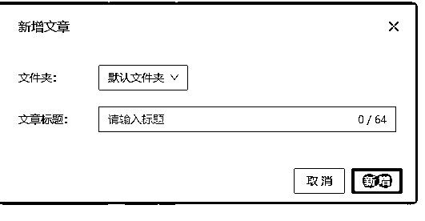

# 公众号发布（谷歌浏览器多账号）

所有应用不支持mac电脑，如果是mac电脑，请开启双系统win模式（自行百度）

## 一：注册下载影刀

https://www.winrobot360.com/share/activity?inviteUserUuid=598859198794305538

## 二：加入应用

谷歌浏览器多账号脚本市场:邀请加入应用市场_影刀RPA

加入应用后，在桌面版找到应用

## 三：影刀首次内部插件配置

（内部包含edge，谷歌，比特浏览器插件安装）

## 四：使用教程

### 1：配置表格（所有表格全部设置单元格格式为文本）教程

表格下载：

我用夸克网盘分享了「公众号自动发布模板」，点击链接即可保存。打开「夸克APP」，无需下载在线播放视频，畅享原画5倍速，支持电视投屏。

链接：https://pan.quark.cn/s/bd20a449f085

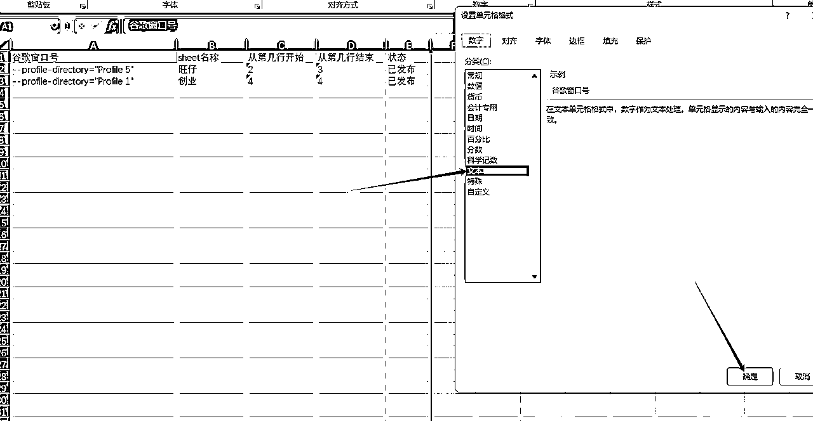

下载好配置表格，结合上面给大家的洗稿工具

#### 1配置页

谷歌多账号最好控制在3-5个账号之内，再多了就需要比特浏览器了。

##### A列谷歌窗口号

（这里可以理解为一个窗口一个号）

找到对应谷歌用户id

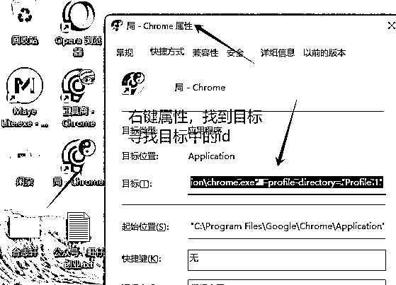

目标中的路径是这样："C:\Program Files\Google\Chrome\Application\chrome.exe" --profile-directory="Profile 1"

把其中的--profile-directory="Profile 1

放入表格

##### B列sheet名称

名称不要起单数字，可以起汉字，或者数字加符号，例如：18-0

其中配置页这个sheet名称不要改

其他的像旺仔 创业 这俩个sheet页面只要能和表格名称对应上就行

##### CD列从第几行开始

C列这里代表着你对应sheet名称的文章从第几行开始发布（下面就代表着从名称为旺仔的表格的第二行开始发布文章）

D列这里代表着你对应sheet名称的文章从第几行结束发布（下面就代表着从名称为旺仔的表格的第三行的文章发布之后就会结束）

开始行号：从内容页面表格第几行开始发布文章

结束行号：到内容页面表格第几行的文章结束

ps：如果只发一篇文章，比如只发第二行的文章，就在开始行和结束行都写2

如果一次发俩篇文章，就在开始行填2，结束行填3，就会生成下图的格式

单词最多可添加8篇文章，要注意

##### E列状态

在该窗口的谷歌浏览器结束后，会自动记录

#### 2.1原创者配置（A列）

如果要勾选原创选项，在A列输入名字，不勾选原创则留空。

#### 2.2标题（B列 顾名思义，不赘述）

#### 2.3内容地址（C列）

如果是用我的洗稿工具洗出来的，直接复制洗稿之后的表格即可

如果是自己的内容，填入文件夹地址（该文件夹下务必只有一个word文件）

#### 2.4封面图地址（D列）

复制封面图的文件地址进去，右键图片，找到复制路径，复制出来的是这样的格式："F:\下载文件暂存\海报中转\蓝色科技扫码关注公众号二维码.png"

在填入表格时去掉引号，即：F:\下载文件暂存\海报中转\蓝色科技扫码关注公众号二维码.png

如果不添加封面图，表格留空就行

#### 2.5话题（E列）

如果要添加话题的话用上面的格式即可：#话题

如果不添加话题留空

#### 2.6原文链接（F列）

要添加链接直接表格内放入链接

不添加留空即可

#### 2.7创作来源（G列）

一共4种来源选择，按照我表格模板来就行（切记不要更改，比如你要选择ai生成，就直接在表格输入ai）

不选择来源则留空

#### 2.8发布状态（H列）

在文章发布后会自动输入状态，方便更改

#### 2.9固定开头（I列）

如果文章要在开头插入固定开头，先创建一个word文档，把要固定的内容填入word。之后在I列输入开头文档的文件地址。

#### 2.10固定结尾（J列）

如果文章要在结尾插入固定结尾，先创建一个word文档，把要固定的内容填入word。之后在J列输入结尾文档的文件地址。

### 2启动页面

从第几行开始代表着从配置页的第几行开始，不是代表着文章发布页第几行，这里代表着从5号窗口开始运行，结束也是同样的道理

暗号：生财有术

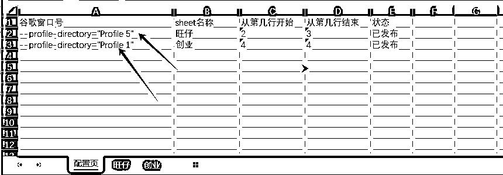

## 五：准备工作

首先在edge浏览器登入墨滴平台（https://editor.mdnice.com/）

在不同用户谷歌浏览器内部登陆对应公众号：https://mp.weixin.qq.com/

如果是第一次使用墨滴，务必先创建一个文件夹，在文件夹内创建一个文章标题

# 公众号发布（比特浏览器多账号）

所有应用不支持mac电脑，如果是mac电脑，请开启双系统win模式（自行百度）

## 一：注册下载影刀

https://www.winrobot360.com/share/activity?inviteUserUuid=598859198794305538

## 二：加入应用

比特浏览器脚本市场：邀请加入应用市场_影刀RPA

加入应用后，在桌面版找到应用

## 三：影刀首次内部插件配置（切忌，这里新手务必看此教程的比特配置）

（内部包含edge，谷歌，比特浏览器插件安装）

## 四：使用教程

### 1：配置表格（所有表格全部设置单元格格式为文本）教程

表格下载：

我用夸克网盘分享了「公众号自动发布模板」，点击链接即可保存。打开「夸克APP」，无需下载在线播放视频，畅享原画5倍速，支持电视投屏。

链接：https://pan.quark.cn/s/bd20a449f085

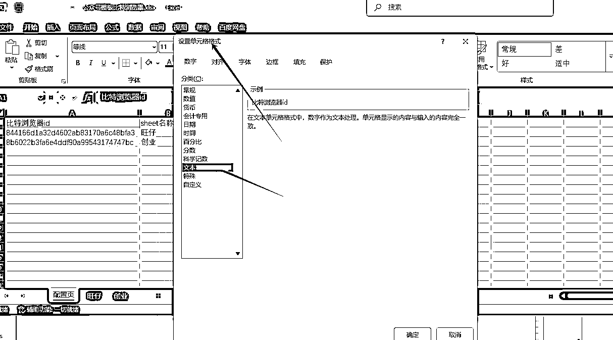

下载好配置表格，结合上面给大家的洗稿工具

#### 1配置页

##### A列比特窗口号

不会配置比特浏览器的看这里面的比特插件安装

##### B列sheet名称

名称不要起单数字，可以起汉字，或者数字加符号，例如：18-0

其中配置页这个sheet名称不要改

其他的像旺仔 创业 这俩个sheet页面只要能和表格名称对应上就行

##### CD列从第几行开始

C列这里代表着你对应sheet名称的文章从第几行开始发布（下面就代表着从名称为旺仔的表格的第二行开始发布文章）

D列这里代表着你对应sheet名称的文章从第几行结束发布（下面就代表着从名称为旺仔的表格的第三行的文章发布之后就会结束）

开始行号：从内容页面表格第几行开始发布文章

结束行号：到内容页面表格第几行的文章结束

ps：如果只发一篇文章，比如只发第二行的文章，就在开始行和结束行都写2

如果一次发俩篇文章，就在开始行填2，结束行填3，就会生成下图的格式

单词最多可添加8篇文章，要注意

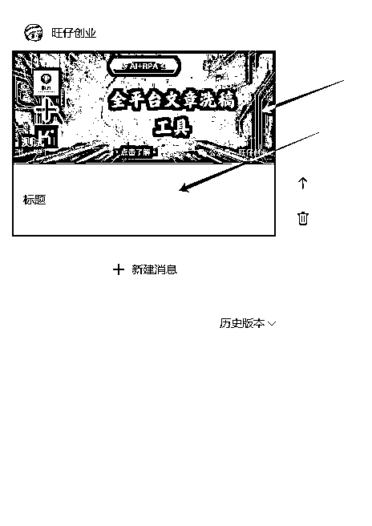

##### E列状态

在该窗口的谷歌浏览器结束后，会自动记录

#### 2.1原创者配置（A列）

如果要勾选原创选项，在A列输入名字，不勾选原创则留空。

#### 2.2标题（B列 顾名思义，不赘述）

#### 2.3内容地址（C列）

如果是用我的洗稿工具洗出来的，直接复制洗稿之后的表格即可

如果是自己的内容，填入文件夹地址（该文件夹下务必只有一个word文件）

#### 2.4封面图地址（D列）

复制封面图的文件地址进去，右键图片，找到复制路径，复制出来的是这样的格式："F:\下载文件暂存\海报中转\蓝色科技扫码关注公众号二维码.png"

在填入表格时去掉引号，即：F:\下载文件暂存\海报中转\蓝色科技扫码关注公众号二维码.png

如果不添加封面图，表格留空就行

#### 2.5话题（E列）

如果要添加话题的话用上面的格式即可：#话题

如果不添加话题留空

#### 2.6原文链接（F列）

要添加链接直接表格内放入链接

不添加留空即可

#### 2.7创作来源（G列）

一共4种来源选择，按照我表格模板来就行（切记不要更改，比如你要选择ai生成，就直接在表格输入ai）

不选择来源则留空

#### 2.8发布状态（H列）

在文章发布后会自动输入状态，方便更改

#### 2.9固定开头（I列）

如果文章要在开头插入固定开头，先创建一个word文档，把要固定的内容填入word。之后在I列输入开头文档的文件地址。

#### 2.10固定结尾（J列）

如果文章要在结尾插入固定结尾，先创建一个word文档，把要固定的内容填入word。之后在J列输入结尾文档的文件地址。

### 2启动页面

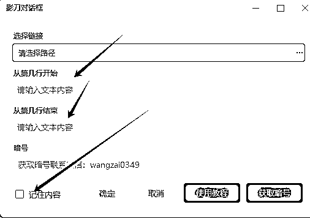

从第几行开始代表着从配置页的第几行开始，不是代表着文章发布页第几行，这里代表着从第几行的窗口开始运行，结束也是同样的道理

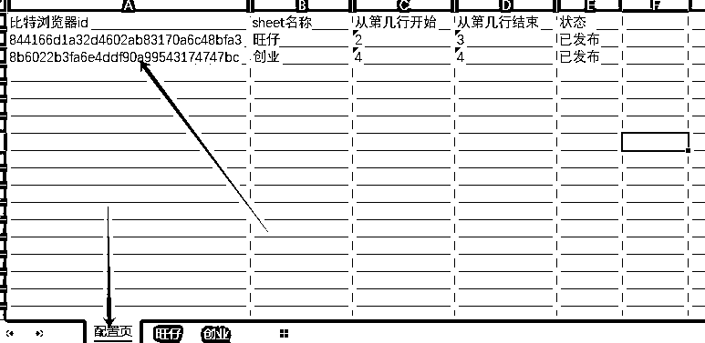

## 五：准备工作

首先在edge浏览器登入墨滴平台（https://editor.mdnice.com/）

在不同用户的比特浏览器内部登陆对应公众号：https://mp.weixin.qq.com/

如果是第一次使用墨滴，务必先创建一个文件夹，在文件夹内创建一个文章标题

# 小红书发布（edge/谷歌浏览器单账号）

所有应用不支持mac电脑，如果是mac电脑，请开启双系统win模式（自行百度）

## 一：注册下载影刀

https://www.winrobot360.com/share/activity?inviteUserUuid=598859198794305538

## 二：加入应用

edge浏览器应用市场

谷歌应用市场

加入应用后，在桌面版找到应用

## 三：影刀首次内部插件配置

（内部包含edge，谷歌，比特浏览器插件安装）

## 四：使用教程

### 1：配置表格

表格下载：

我用夸克网盘分享了「小红书模板」，点击链接即可保存。打开「夸克APP」，无需下载在线播放视频，畅享原画5倍速，支持电视投屏。

链接：https://pan.quark.cn/s/2ba2577fc0dc

#### 1.1笔记类型（A列）

在A列选择图文或者视频。

#### 1.2保存状态（B列）

目前设置了三种状态，一种直接发布，一种定时发布，一种存草稿。这11个字不要改动，按我模板来。

（存草稿的时候要注意，小红书只能保存最近一条内容，而且存完草稿后不能发布作品了，要不然会把之前的草稿顶掉）

#### 1.3文件存放地址（C列）

此次为文件夹地址（确保此文件夹内部只有你要发布的图片或者视频）

图文：需要给文件排一下序号，默认第一个是封面图

视频：最好的搭配是一个视频搭配一个封面图（视频格式要mp4）

#### 1.4视频封面图地址（D列）

此次放入视频的封面图地址：

案例：F:\旺仔\旺仔创业引流\rpa引流\自动发布工具\小红书发布\测试\视频存放\2.jpg

如果没有封面图或者是图文类的，此处留空即可

#### 1.5标题（E列）

#### 1.6正文（F列)

直接把文案复制到表格即可，表格里面什么格式，到发布页面就是什么格式

#### 1.7话题（G列）

如果要添加话题的话用上面的格式即可：#话题

如果不添加话题留空

#### 1.8地址(H列）

如果要添加地点直接就填入框中，如果不添加则留空

#### 1.9合集（I列）

从上往下数，第一个就填1，后面一次类推（不选择就留空）

#### 1.10群聊（J列）

从上往下数，第一个就填1，后面一次类推（不选择就留空）

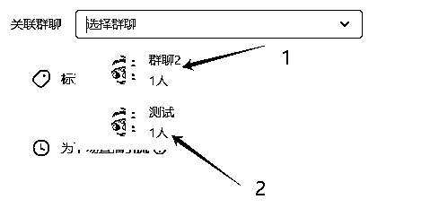

#### 1.11定时发布（K）列

如果设置定时发布，就在1.2保存状态处填写：定时输出，发布时间格式为：2025-03-15 11:20

如果不设置就留空

#### 1.12状态（L）列

此次不需要填写内容，在表格运行后会自动输入

#### 1.13商品id（M）列

这会自动挂商品，大家在表格输入商品id，如果一次添加多个商品，就以这种格式输入：

第一个/第二个（例如：67ced07a9635/671ae3e3a）

### 2：启动页配置

开始行号：从表格第几行开始发布文章

结束行号：到表格第几行的文章结束

发布时间间隔：我这设置默认60（速度太快浏览器会出现验证）

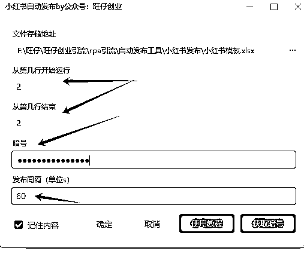

## 五：准备工具

表格配置之后在edge或者谷歌浏览器登陆小红书对应账号

# 小红书发布（谷歌浏览器多账号）

所有应用不支持mac电脑，如果是mac电脑，请开启双系统win模式（自行百度）

## 一：注册下载影刀

https://www.winrobot360.com/share/activity?inviteUserUuid=598859198794305538

## 二：加入应用

谷歌浏览器多账号脚本市场:邀请加入应用市场_影刀RPA

加入应用后，在桌面版找到应用

## 三：影刀首次内部插件配置

（内部包含edge，谷歌，比特浏览器插件安装）

## 四：使用教程

### 1：配置表格（所有表格全部设置单元格格式为文本）教程

表格下载：

我用夸克网盘分享了「小红书模板」，点击链接即可保存。打开「夸克APP」，无需下载在线播放视频，畅享原画5倍速，支持电视投屏。

链接：https://pan.quark.cn/s/2ba2577fc0dc

#### 1配置页

谷歌多账号最好控制在3-5个账号之内，再多了就需要比特浏览器了。

##### A列谷歌窗口号

（这里可以理解为一个窗口一个号）

找到对应谷歌用户id

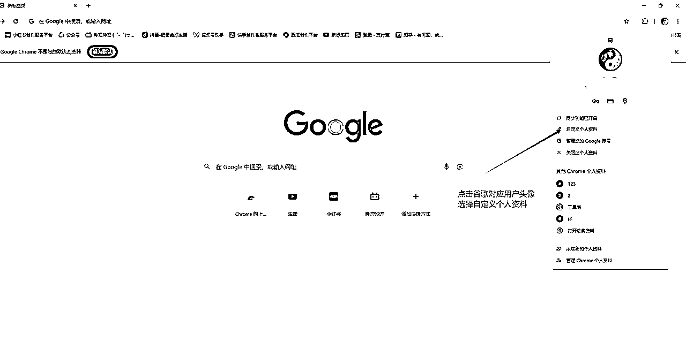

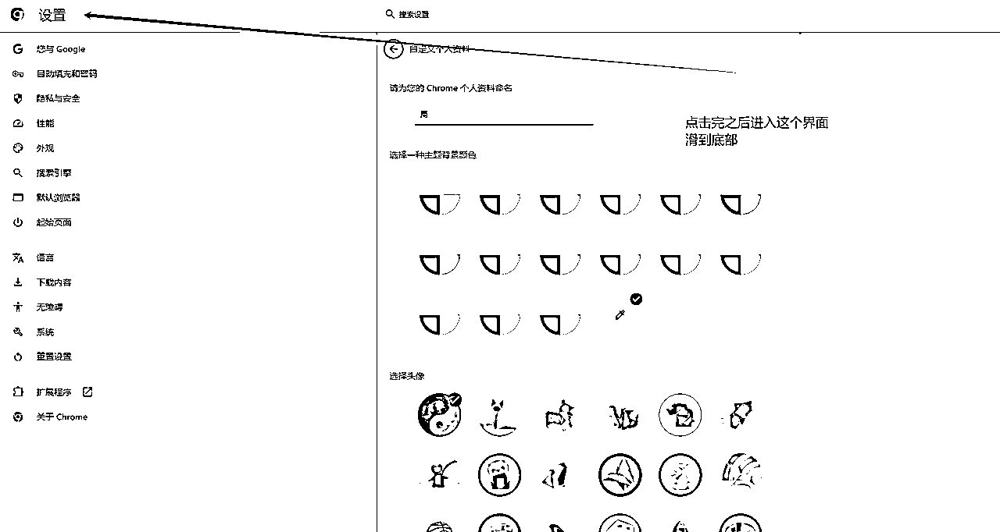

目标中的路径是这样："C:\Program Files\Google\Chrome\Application\chrome.exe" --profile-directory="Profile 1"

把其中的--profile-directory="Profile 1

放入表格

##### B列sheet名称

名称不要起单数字，可以起汉字，或者数字加符号，例如：18-0

其中配置页这个sheet名称不要改

其他的像旺仔 创业 这俩个sheet页面只要能和表格名称对应上就行

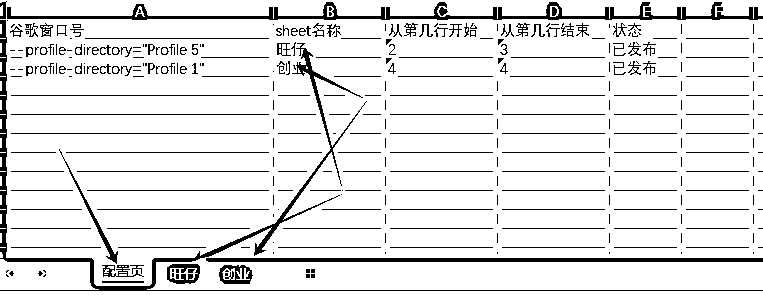

##### CD列从第几行开始

C列这里代表着你对应sheet名称的文章从第几行开始发布（下面就代表着从名称为旺仔的表格的第二行开始发布文章）

D列这里代表着你对应sheet名称的文章从第几行结束发布（下面就代表着从名称为旺仔的表格的第三行的文章发布之后就会结束）

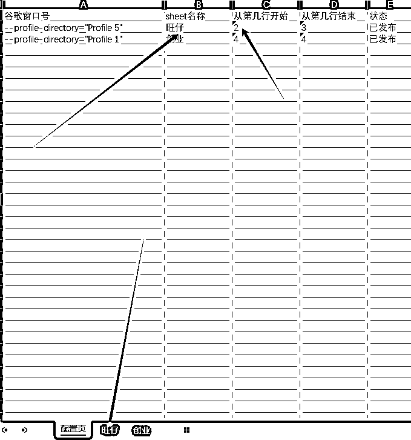

#### 2内容页配置

##### 2.1笔记类型（A列）

在A列选择图文或者视频。

##### 2.2保存状态（B列）

目前设置了三种状态，一种直接发布，一种定时发布，一种存草稿。这11个字不要改动，按我模板来。

（存草稿的时候要注意，小红书只能保存最近一条内容，而且存完草稿后不能发布作品了，要不然会把之前的草稿顶掉）

##### 2.3文件存放地址（C列）

此次为文件夹地址（确保此文件夹内部只有你要发布的图片或者视频）

图文：需要给文件排一下序号，默认第一个是封面图

视频：最好的搭配是一个视频搭配一个封面图（视频格式要mp4）

##### 2.4视频封面图地址（D列）

此次放入视频的封面图地址：

案例：F:\旺仔\旺仔创业引流\rpa引流\自动发布工具\小红书发布\测试\视频存放\2.jpg

如果没有封面图或者是图文类的，此处留空即可

##### 2.5标题（E列）

##### 2.6正文（F列)

直接把文案复制到表格即可，表格里面什么格式，到发布页面就是什么格式

##### 2.7话题（G列）

如果要添加话题的话用上面的格式即可：#话题

如果不添加话题留空

##### 2.8地址(H列）

如果要添加地点直接就填入框中，如果不添加则留空

##### 2.9合集（I列）

从上往下数，第一个就填1，后面一次类推（不选择就留空）

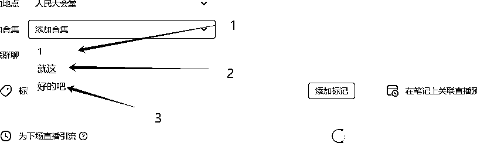

##### 2.10群聊（J列）

从上往下数，第一个就填1，后面一次类推（不选择就留空）

##### 2.11定时发布（K）列

如果设置定时发布，就在1.2保存状态处填写：定时输出，发布时间格式为：2025-03-15 11:20

如果不设置就留空

##### 2.12状态（L）列

此次不需要填写内容，在表格运行后会自动输入

##### 2.13商品id（M）列

这会自动挂商品，大家在表格输入商品id，如果一次添加多个商品，就以这种格式输入：

第一个/第二个（例如：67ced07a9635/671ae3e3a）

### 2：启动页配置

开始行号：从表格第几行开始发布文章

结束行号：到表格第几行的文章结束

发布时间间隔：我这设置默认60（速度太快浏览器会出现验证）

从第几行开始代表着从配置页的第几行开始，不是代表着文章发布页第几行，这里代表着从5号窗口开始运行，结束也是同样的道理

## 五：准备工具

表格配置之后在edge或者谷歌浏览器登陆小红书对应账号

# 小红书发布（比特浏览器多账号）

所有应用不支持mac电脑，如果是mac电脑，请开启双系统win模式（自行百度）

## 一：注册下载影刀

https://www.winrobot360.com/share/activity?inviteUserUuid=598859198794305538

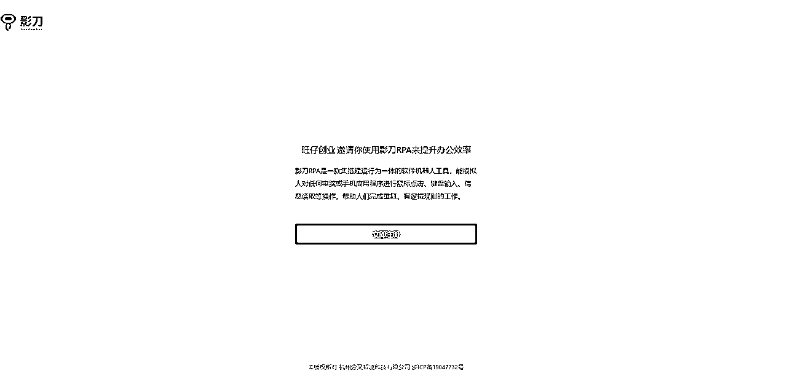

## 二：加入应用

比特浏览器脚本市场：邀请加入应用市场_影刀RPA

加入应用后，在桌面版找到应用

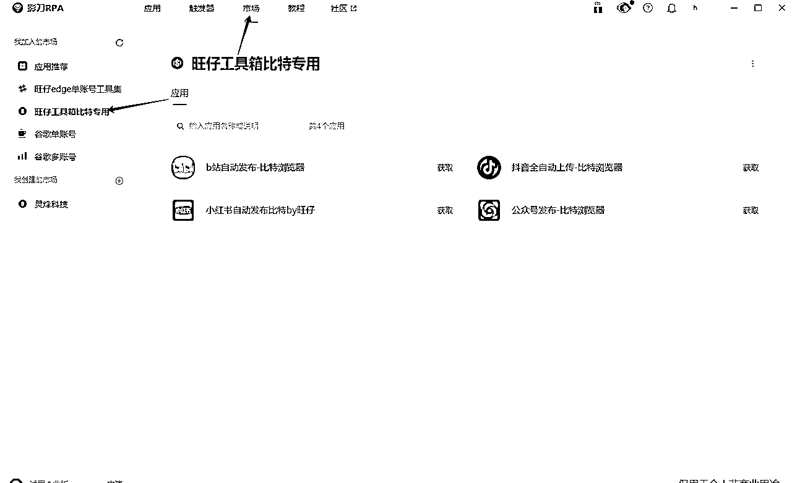

## 三：影刀首次内部插件配置

（内部包含edge，谷歌，比特浏览器插件安装）

## 四：使用教程

### 1：配置表格（所有表格全部设置单元格格式为文本）教程

表格下载：

我用夸克网盘分享了「小红书模板」，点击链接即可保存。打开「夸克APP」，无需下载在线播放视频，畅享原画5倍速，支持电视投屏。

链接：https://pan.quark.cn/s/2ba2577fc0dc

#### 1配置页

##### A列比特窗口号

不会配置比特浏览器的看这里面的比特插件安装

##### B列sheet名称

名称不要起单数字，可以起汉字，或者数字加符号，例如：18-0

其中配置页这个sheet名称不要改

其他的像旺仔 创业 这俩个sheet页面只要能和表格名称对应上就行

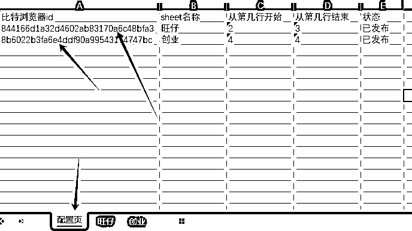

##### CD列从第几行开始

C列这里代表着你对应sheet名称的文章从第几行开始发布（下面就代表着从名称为旺仔的表格的第二行开始发布文章）

D列这里代表着你对应sheet名称的文章从第几行结束发布（下面就代表着从名称为旺仔的表格的第三行的文章发布之后就会结束）

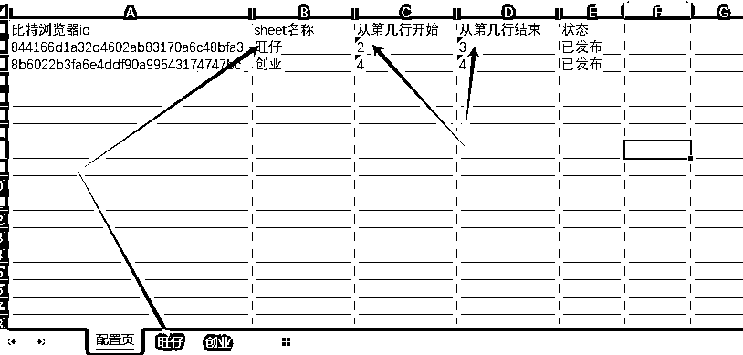

开始行号：从内容页面表格第几行开始发布文章

结束行号：到内容页面表格第几行的文章结束

##### E列状态

在该窗口的谷歌浏览器结束后，会自动记录

#### 2内容页配置

##### 2.1笔记类型（A列）

在A列选择图文或者视频。

##### 2.2保存状态（B列）

目前设置了三种状态，一种直接发布，一种定时发布，一种存草稿。这11个字不要改动，按我模板来。

（存草稿的时候要注意，小红书只能保存最近一条内容，而且存完草稿后不能发布作品了，要不然会把之前的草稿顶掉）

##### 2.3文件存放地址（C列）

此次为文件夹地址（确保此文件夹内部只有你要发布的图片或者视频）

图文：需要给文件排一下序号，默认第一个是封面图

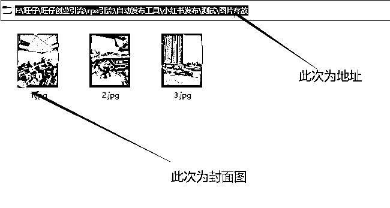

视频：最好的搭配是一个视频搭配一个封面图（视频格式要mp4）

##### 2.4视频封面图地址（D列）

此次放入视频的封面图地址：

案例：F:\旺仔\旺仔创业引流\rpa引流\自动发布工具\小红书发布\测试\视频存放\2.jpg

如果没有封面图或者是图文类的，此处留空即可

##### 2.5标题（E列）

##### 2.6正文（F列)

直接把文案复制到表格即可，表格里面什么格式，到发布页面就是什么格式

##### 2.7话题（G列）

如果要添加话题的话用上面的格式即可：#话题

如果不添加话题留空

##### 2.8地址(H列）

如果要添加地点直接就填入框中，如果不添加则留空

##### 2.9合集（I列）

从上往下数，第一个就填1，后面一次类推（不选择就留空）

##### 2.10群聊（J列）

从上往下数，第一个就填1，后面一次类推（不选择就留空）

##### 2.11定时发布（K）列

如果设置定时发布，就在1.2保存状态处填写：定时输出，发布时间格式为：2025-03-15 11:20

如果不设置就留空

##### 2.12状态（L）列

此次不需要填写内容，在表格运行后会自动输入

##### 2.13商品id（M）列

这会自动挂商品，大家在表格输入商品id，如果一次添加多个商品，就以这种格式输入：

第一个/第二个（例如：67ced07a9635/671ae3e3a）

### 2：启动页配置

开始行号：从表格第几行开始发布文章

结束行号：到表格第几行的文章结束

发布时间间隔：我这设置默认60（速度太快浏览器会出现验证）

从第几行开始代表着从配置页的第几行开始，不是代表着文章发布页第几行

## 五：准备工具

表格配置之后在比特浏览器登陆小红书对应账号

# 抖音发布（edge/谷歌浏览器单账号）

所有应用不支持mac电脑，如果是mac电脑，请开启双系统win模式（自行百度）

## 一：注册下载影刀

https://www.winrobot360.com/share/activity?inviteUserUuid=598859198794305538

## 二：加入应用

edge浏览器应用市场

谷歌应用市场

加入应用后，在桌面版找到应用

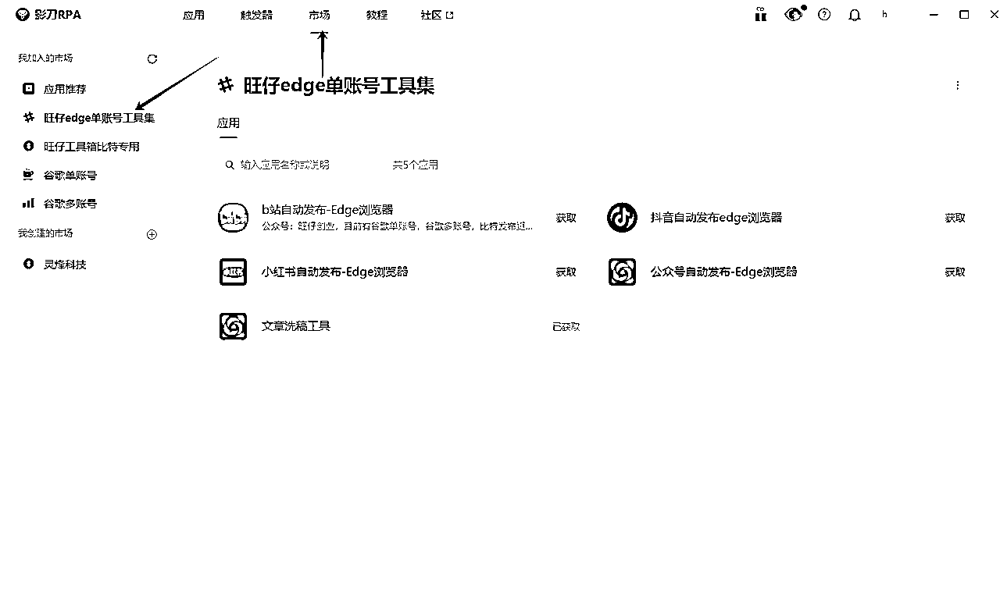

## 三：影刀首次内部插件配置

（内部包含edge，谷歌，比特浏览器插件安装）

## 四：使用教程

### 1：配置表格

表格下载：

我用夸克网盘分享了「抖音模板」，点击链接即可保存。打开「夸克APP」，无需下载在线播放视频，畅享原画5倍速，支持电视投屏。

链接：https://pan.quark.cn/s/25a001c72456

#### 1.1笔记类型（A列）

在A列选择图文或者视频。

#### 1.2保存状态（B列）

目前设置了三种状态，一种直接发布，一种定时发布，一种存草稿。这11个字不要改动，按我模板来。

（存草稿的时候要注意，抖音只能保存最近一条内容，而且存完草稿后不能发布作品了，要不然会把之前的草稿顶掉）

#### 1.3文件存放地址（C列）

此次为文件夹地址（确保此文件夹内部只有你要发布的图片或者视频）

图文：需要给文件排一下序号，默认第一个是封面图

视频：最好的搭配是一个视频搭配一个封面图（视频格式要mp4）

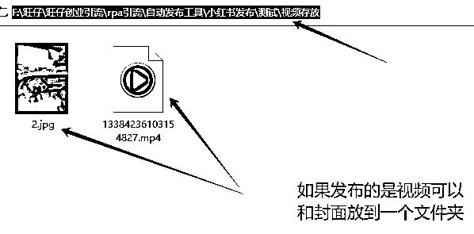

#### 1.4视频封面图地址（D列）

此次放入视频的封面图地址：

案例：F:\旺仔\旺仔创业引流\rpa引流\自动发布工具\小红书发布\测试\视频存放\2.jpg

如果没有封面图或者是图文类的，此处留空即可

#### 1.5标题（E列）

#### 1.6正文（F列)

直接把文案复制到表格即可，表格里面什么格式，到发布页面就是什么格式

#### 1.7话题（G列）

如果要添加话题的话用上面的格式即可：#话题

如果不添加话题留空

#### 1.8合集（H列）

从上往下数，第一个就填1，后面一次类推（不选择就留空）

#### 1.9定时发布（I）列

如果设置定时发布，就在1.2保存状态处填写：定时输出，发布时间格式为：2025-03-15 11:20

如果不设置就留空

#### 1.10状态（J）列

此次不需要填写内容，在表格运行后会自动输入

#### 1.11图文添加音乐（K）列

如果要给图文配音乐，在此列写入音乐名称，会自动运行第一行

### 2：启动页配置

开始行号：从表格第几行开始发布文章

结束行号：到表格第几行的文章结束

发布时间间隔：我这设置默认60（速度太快浏览器会出现验证）

## 五：准备工具

表格配置之后在edge或者谷歌浏览器登陆抖音对应账号

# 抖音发布（谷歌浏览器多账号）

所有应用不支持mac电脑，如果是mac电脑，请开启双系统win模式（自行百度）

## 一：注册下载影刀

https://www.winrobot360.com/share/activity?inviteUserUuid=598859198794305538

## 二：加入应用

https://www.winrobot360.com/share/accede?inviteKey=e63955eb-3ba7-4bf4-bd67-2476508a3a39

加入应用后，在桌面版找到应用

## 三：影刀首次内部插件配置

（内部包含edge，谷歌，比特浏览器插件安装）

## 四：使用教程

### 1：配置表格（所有表格全部设置单元格格式为文本）教程

表格下载：

我用夸克网盘分享了「抖音模板」，点击链接即可保存。打开「夸克APP」，无需下载在线播放视频，畅享原画5倍速，支持电视投屏。

链接：https://pan.quark.cn/s/25a001c72456

#### 1配置页

谷歌多账号最好控制在3-5个账号之内，再多了就需要比特浏览器了。

##### A列谷歌窗口号

（这里可以理解为一个窗口一个号）

找到对应谷歌用户id

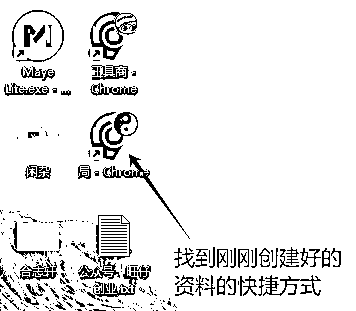

目标中的路径是这样："C:\Program Files\Google\Chrome\Application\chrome.exe" --profile-directory="Profile 1"

把其中的--profile-directory="Profile 1

放入表格

##### B列sheet名称

名称不要起单数字，可以起汉字，或者数字加符号，例如：18-0

其中配置页这个sheet名称不要改

其他的像旺仔 创业 这俩个sheet页面只要能和表格名称对应上就行

##### CD列从第几行开始

C列这里代表着你对应sheet名称的文章从第几行开始发布（下面就代表着从名称为旺仔的表格的第二行开始发布文章）

D列这里代表着你对应sheet名称的文章从第几行结束发布（下面就代表着从名称为旺仔的表格的第三行的文章发布之后就会结束）

#### 2内容页配置

#### 2.1笔记类型（A列）

在A列选择图文或者视频。

#### 2.2保存状态（B列）

目前设置了三种状态，一种直接发布，一种定时发布，一种存草稿。这11个字不要改动，按我模板来。

（存草稿的时候要注意，抖音只能保存最近一条内容，而且存完草稿后不能发布作品了，要不然会把之前的草稿顶掉）

#### 2.3文件存放地址（C列）

此次为文件夹地址（确保此文件夹内部只有你要发布的图片或者视频）

图文：需要给文件排一下序号，默认第一个是封面图

视频：最好的搭配是一个视频搭配一个封面图（视频格式要mp4）

#### 2.4视频封面图地址（D列）

此次放入视频的封面图地址：

案例：F:\旺仔\旺仔创业引流\rpa引流\自动发布工具\小红书发布\测试\视频存放\2.jpg

如果没有封面图或者是图文类的，此处留空即可

#### 2.5标题（E列）

#### 2.6正文（F列)

直接把文案复制到表格即可，表格里面什么格式，到发布页面就是什么格式

#### 2.7话题（G列）

如果要添加话题的话用上面的格式即可：#话题

如果不添加话题留空

#### 2.8合集（H列）

从上往下数，第一个就填1，后面一次类推（不选择就留空）

#### 2.9定时发布（I）列

如果设置定时发布，就在1.2保存状态处填写：定时输出，发布时间格式为：2025-03-15 11:20

如果不设置就留空

#### 2.10状态（J）列

此次不需要填写内容，在表格运行后会自动输入

#### 2.11图文添加音乐（K）列

如果要给图文配音乐，在此列写入音乐名称，会自动运行第一行

### 2：启动页配置

开始行号：从表格第几行开始发布文章

结束行号：到表格第几行的文章结束

发布时间间隔：我这设置默认60（速度太快浏览器会出现验证）

## 五：准备工具

表格配置之后在edge或者谷歌浏览器登陆抖音对应账号

# 抖音发布（比特浏览器多账号）

所有应用不支持mac电脑，如果是mac电脑，请开启双系统win模式（自行百度）

## 一：注册下载影刀

https://www.winrobot360.com/share/activity?inviteUserUuid=598859198794305538

## 二：加入应用

比特浏览器脚本市场：邀请加入应用市场_影刀RPA

加入应用后，在桌面版找到应用

## 三：影刀首次内部插件配置

（内部包含edge，谷歌，比特浏览器插件安装）

## 四：使用教程

### 1：配置表格（所有表格全部设置单元格格式为文本）教程

表格下载：

我用夸克网盘分享了「抖音模板」，点击链接即可保存。打开「夸克APP」，无需下载在线播放视频，畅享原画5倍速，支持电视投屏。

链接：https://pan.quark.cn/s/25a001c72456

#### A列比特窗口号

不会配置比特浏览器的看这里面的比特插件安装

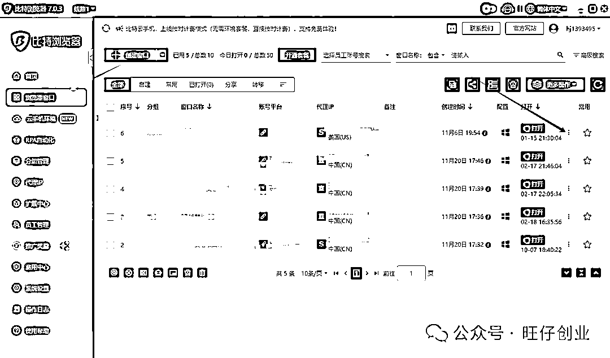

#### B列sheet名称

名称不要起单数字，可以起汉字，或者数字加符号，例如：18-0

其中配置页这个sheet名称不要改

其他的像旺仔 创业 这俩个sheet页面只要能和表格名称对应上就行

#### CD列从第几行开始

C列这里代表着你对应sheet名称的文章从第几行开始发布（下面就代表着从名称为旺仔的表格的第二行开始发布文章）

D列这里代表着你对应sheet名称的文章从第几行结束发布（下面就代表着从名称为旺仔的表格的第三行的文章发布之后就会结束）

开始行号：从内容页面表格第几行开始发布文章

结束行号：到内容页面表格第几行的文章结束

#### E列状态

在该窗口的谷歌浏览器结束后，会自动记录

### 2内容页配置

#### 2.1笔记类型（A列）

在A列选择图文或者视频。

#### 2.2保存状态（B列）

目前设置了三种状态，一种直接发布，一种定时发布，一种存草稿。这11个字不要改动，按我模板来。

（存草稿的时候要注意，抖音只能保存最近一条内容，而且存完草稿后不能发布作品了，要不然会把之前的草稿顶掉）

#### 2.3文件存放地址（C列）

此次为文件夹地址（确保此文件夹内部只有你要发布的图片或者视频）

图文：需要给文件排一下序号，默认第一个是封面图

视频：最好的搭配是一个视频搭配一个封面图（视频格式要mp4）

#### 2.4视频封面图地址（D列）

此次放入视频的封面图地址：

案例：F:\旺仔\旺仔创业引流\rpa引流\自动发布工具\小红书发布\测试\视频存放\2.jpg

如果没有封面图或者是图文类的，此处留空即可

#### 2.5标题（E列）

#### 2.6正文（F列)

直接把文案复制到表格即可，表格里面什么格式，到发布页面就是什么格式

#### 2.7话题（G列）

如果要添加话题的话用上面的格式即可：#话题

如果不添加话题留空

#### 2.8合集（H列）

从上往下数，第一个就填1，后面一次类推（不选择就留空）

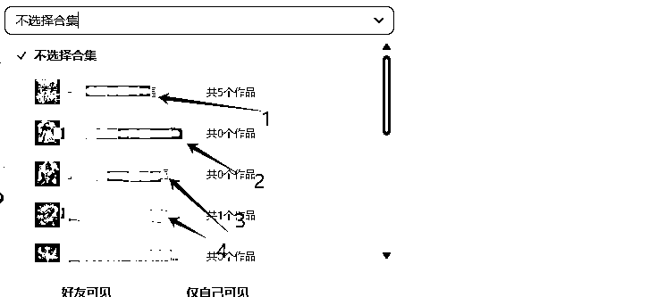

#### 2.9定时发布（I）列

如果设置定时发布，就在1.2保存状态处填写：定时输出，发布时间格式为：2025-03-15 11:20

如果不设置就留空

#### 2.10状态（J）列

此次不需要填写内容，在表格运行后会自动输入

#### 2.11图文添加音乐（K）列

如果要给图文配音乐，在此列写入音乐名称，会自动运行第一行

### 2：启动页配置

开始行号：从表格第几行开始发布文章

结束行号：到表格第几行的文章结束

发布时间间隔：我这设置默认60（速度太快浏览器会出现验证）

## 五：准备工具

表格配置之后在比特浏览器登陆抖音对应账号

# B站发布（edge/谷歌浏览器单账号）

所有应用不支持mac电脑，如果是mac电脑，请开启双系统win模式（自行百度）

## 一：注册下载影刀

https://www.winrobot360.com/share/activity?inviteUserUuid=598859198794305538

## 二：加入应用

edge浏览器应用市场

谷歌应用市场

加入应用后，在桌面版找到应用

## 三：影刀首次内部插件配置

（内部包含edge，谷歌，比特浏览器插件安装）

## 四：使用教程

### 1：配置表格

表格下载：

我用夸克网盘分享了「b站模板」，点击链接即可保存。打开「夸克APP」，无需下载在线播放视频，畅享原画5倍速，支持电视投屏。

链接：https://pan.quark.cn/s/5e034b4a593f

#### 1.1发布状态（A列）

b站最多可以保存30个草稿，不要保存太多。

#### 1.2视频标题（B列）

#### 1.3文件存放地址（C列）

此次为文件夹地址（确保此文件夹内部只有你要发布的视频）

视频：最好的搭配是一个视频搭配一个封面图（视频格式要mp4）

#### 1.4视频封面图地址（D列）

此次放入视频的封面图地址：

案例：F:\旺仔\旺仔创业引流\rpa引流\自动发布工具\小红书发布\测试\视频存放\2.jpg

如果没有封面图或者是图文类的，此处留空即可

#### 1.5标签（E列）

如果要添加话题的话用上面的格式即可：#话题

如果不添加话题留空

#### 1.6简介（F列)

如果不写留空即可

#### 1.7合集（G列）

默认添加第一个

#### 1.8发布状态（H列）

此次不需要填写内容，在表格运行后会自动输入

### 2：启动页配置

开始行号：从表格第几行开始发布文章

结束行号：到表格第几行的文章结束

发布时间间隔：我这设置默认60（速度太快浏览器会出现验证）

## 五：准备工具

表格配置之后在edge或者谷歌浏览器登陆b站对应账号

# B站发布（谷歌浏览器多账号）

所有应用不支持mac电脑，如果是mac电脑，请开启双系统win模式（自行百度）

## 一：注册下载影刀

https://www.winrobot360.com/share/activity?inviteUserUuid=598859198794305538

## 二：加入应用

谷歌浏览器多账号脚本市场:邀请加入应用市场_影刀RPA

加入应用后，在桌面版找到应用

## 三：影刀首次内部插件配置

（内部包含edge，谷歌，比特浏览器插件安装）

## 四：使用教程

### 1：配置表格（所有表格全部设置单元格格式为文本）教程

表格下载：

我用夸克网盘分享了「b站模板」，点击链接即可保存。打开「夸克APP」，无需下载在线播放视频，畅享原画5倍速，支持电视投屏。

链接：https://pan.quark.cn/s/5e034b4a593f

#### 1：配置页

谷歌多账号最好控制在3-5个账号之内，再多了就需要比特浏览器了。

##### A列谷歌窗口号

（这里可以理解为一个窗口一个号）

找到对应谷歌用户id

目标中的路径是这样："C:\Program Files\Google\Chrome\Application\chrome.exe" --profile-directory="Profile 1"

把其中的--profile-directory="Profile 1

放入表格

##### B列sheet名称

名称不要起单数字，可以起汉字，或者数字加符号，例如：18-0

其中配置页这个sheet名称不要改

其他的像旺仔 创业 这俩个sheet页面只要能和表格名称对应上就行

##### CD列从第几行开始

C列这里代表着你对应sheet名称的文章从第几行开始发布（下面就代表着从名称为旺仔的表格的第二行开始发布文章）

D列这里代表着你对应sheet名称的文章从第几行结束发布（下面就代表着从名称为旺仔的表格的第三行的文章发布之后就会结束）

#### 2：内容页

##### 2.1发布状态（A列）

b站最多可以保存30个草稿，不要保存太多。

##### 2.2视频标题（B列）

##### 2.3文件存放地址（C列）

此次为文件夹地址（确保此文件夹内部只有你要发布的视频）

视频：最好的搭配是一个视频搭配一个封面图（视频格式要mp4）

##### 2.4视频封面图地址（D列）

此次放入视频的封面图地址：

案例：F:\旺仔\旺仔创业引流\rpa引流\自动发布工具\小红书发布\测试\视频存放\2.jpg

如果没有封面图或者是图文类的，此处留空即可

##### 2.5标签（E列）

如果要添加话题的话用上面的格式即可：#话题

如果不添加话题留空

##### 2.6简介（F列)

如果不写留空即可

##### 2.7合集（G列）

默认添加第一个

##### 2.8发布状态（H列）

此次不需要填写内容，在表格运行后会自动输入

### 2：启动页配置

开始行号：从表格第几行开始发布文章

结束行号：到表格第几行的文章结束

发布时间间隔：我这设置默认60（速度太快浏览器会出现验证）

## 五：准备工具

表格配置之后在谷歌浏览器登陆b站对应账号

# B站发布（比特浏览器多账号）

所有应用不支持mac电脑，如果是mac电脑，请开启双系统win模式（自行百度）

## 一：注册下载影刀

https://www.winrobot360.com/share/activity?inviteUserUuid=598859198794305538

## 二：加入应用

比特浏览器脚本市场：邀请加入应用市场_影刀RPA

加入应用后，在桌面版找到应用

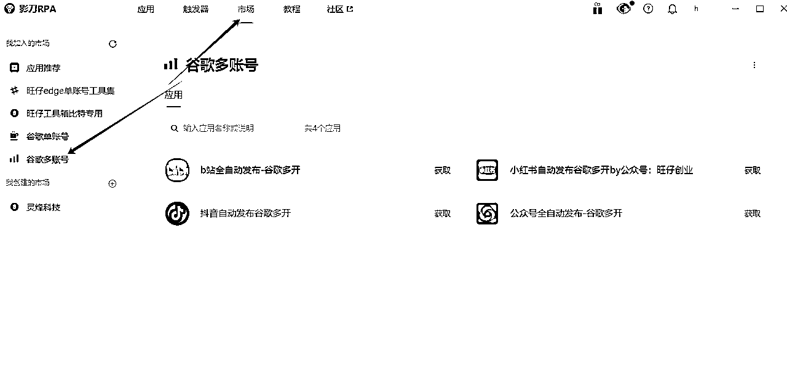

## 三：影刀首次内部插件配置

（内部包含edge，谷歌，比特浏览器插件安装）

## 四：使用教程

### 1：配置表格（所有表格全部设置单元格格式为文本）教程

表格下载：

我用夸克网盘分享了「b站模板」，点击链接即可保存。打开「夸克APP」，无需下载在线播放视频，畅享原画5倍速，支持电视投屏。

链接：https://pan.quark.cn/s/5e034b4a593f

#### 1配置页

##### A列比特窗口号

不会配置比特浏览器的看这里面的比特插件安装

##### B列sheet名称

名称不要起单数字，可以起汉字，或者数字加符号，例如：18-0

其中配置页这个sheet名称不要改

其他的像旺仔 创业 这俩个sheet页面只要能和表格名称对应上就行

##### CD列从第几行开始

C列这里代表着你对应sheet名称的文章从第几行开始发布（下面就代表着从名称为旺仔的表格的第二行开始发布文章）

D列这里代表着你对应sheet名称的文章从第几行结束发布（下面就代表着从名称为旺仔的表格的第三行的文章发布之后就会结束）

开始行号：从内容页面表格第几行开始发布文章

结束行号：到内容页面表格第几行的文章结束

##### E列状态

在该窗口的谷歌浏览器结束后，会自动记录

#### 2内容页配置

##### 2.1发布状态（A列）

b站最多可以保存30个草稿，不要保存太多。

##### 2.2视频标题（B列）

##### 2.3文件存放地址（C列）

此次为文件夹地址（确保此文件夹内部只有你要发布的视频）

视频：最好的搭配是一个视频搭配一个封面图（视频格式要mp4）

##### 2.4视频封面图地址（D列）

此次放入视频的封面图地址：

案例：F:\旺仔\旺仔创业引流\rpa引流\自动发布工具\小红书发布\测试\视频存放\2.jpg

如果没有封面图或者是图文类的，此处留空即可

##### 2.5标签（E列）

如果要添加话题的话用上面的格式即可：#话题

如果不添加话题留空

##### 2.6简介（F列)

如果不写留空即可

##### 2.7合集（G列）

默认添加第一个

##### 2.8发布状态（H列）

此次不需要填写内容，在表格运行后会自动输入

### 2：启动页配置

开始行号：从表格第几行开始发布文章

结束行号：到表格第几行的文章结束

发布时间间隔：我这设置默认60（速度太快浏览器会出现验证）

## 五：准备工具

表格配置之后在比特浏览器登陆b站对应账号

# 小绿书发布（edge浏览器/谷歌浏览器单账号）

所有应用不支持mac电脑，如果是mac电脑，请开启双系统win模式（自行百度）

## 一：注册下载影刀

https://www.winrobot360.com/share/activity?inviteUserUuid=598859198794305538

## 二：加入应用

edge浏览器应用市场

谷歌应用市场

加入应用后，在桌面版找到应用

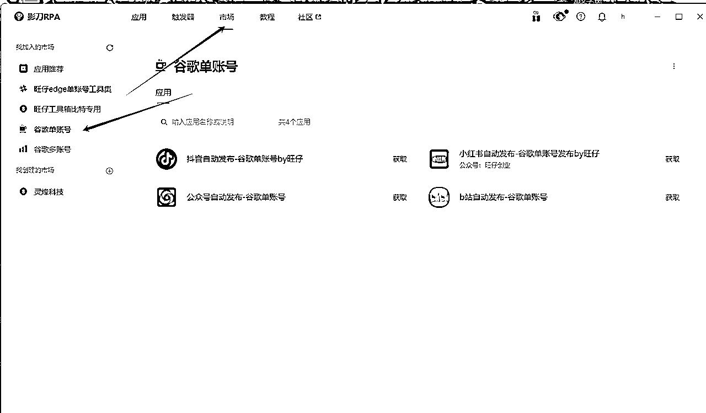

## 三：影刀首次内部插件配置

（内部包含edge，谷歌，比特浏览器插件安装）

## 四：使用教程

### 1.配置表格

表格下载地址：

我用夸克网盘分享了「小绿书模板」，点击链接即可保存。打开「夸克APP」，无需下载在线播放视频，畅享原画5倍速，支持电视投屏。

链接：https://pan.quark.cn/s/3875d9b42917

#### 1.1图片地址（A列）

此次为文件夹地址（确保此文件夹内部只有你要发布的图片）

图文：需要给文件排一下序号，默认第一个是封面图

#### 1.2文章标题（B列）

顾名思义

#### 1.3文章内容（C列）

顾名思义

#### 1.4创作来源（D列）

一共4种来源选择，按照我表格模板来就行（切记不要更改，比如你要选择ai生成，就直接在表格输入ai）

不选择来源则留空

#### 1.5发布状态（E列）

在文章发布后会自动输入状态，方便更改

### 2启动配置

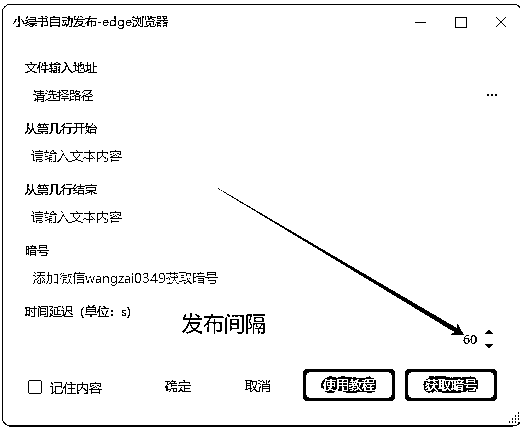

开始行号：从表格第几行开始发布文章

结束行号：到表格第几行的文章结束

时间延迟：防止操作太快浏览器跳验证

暗号：生财有术

## 五：准备工作

首先在edge或者谷歌浏览器内部登陆

公众号：https://mp.weixin.qq.com/

# 小绿书发布（谷歌浏览器多账号）

所有应用不支持mac电脑，如果是mac电脑，请开启双系统win模式（自行百度）

## 一：注册下载影刀

https://www.winrobot360.com/share/activity?inviteUserUuid=598859198794305538

## 二：加入应用

谷歌浏览器多账号脚本市场:邀请加入应用市场_影刀RPA

加入应用后，在桌面版找到应用

## 三：影刀首次内部插件配置

（内部包含edge，谷歌，比特浏览器插件安装）

## 四：使用教程

### 1.配置表格

表格下载地址：

我用夸克网盘分享了「小绿书模板」，点击链接即可保存。打开「夸克APP」，无需下载在线播放视频，畅享原画5倍速，支持电视投屏。

链接：https://pan.quark.cn/s/3875d9b42917

#### 1配置页

谷歌多账号最好控制在3-5个账号之内，再多了就需要比特浏览器了。

##### A列谷歌窗口号

（这里可以理解为一个窗口一个号）

找到对应谷歌用户id

目标中的路径是这样："C:\Program Files\Google\Chrome\Application\chrome.exe" --profile-directory="Profile 1"

把其中的--profile-directory="Profile 1

放入表格

##### B列sheet名称

名称不要起单数字，可以起汉字，或者数字加符号，例如：18-0

其中配置页这个sheet名称不要改

其他的像旺仔 创业 这俩个sheet页面只要能和表格名称对应上就行

##### CD列从第几行开始

C列这里代表着你对应sheet名称的文章从第几行开始发布（下面就代表着从名称为旺仔的表格的第二行开始发布文章）

D列这里代表着你对应sheet名称的文章从第几行结束发布（下面就代表着从名称为旺仔的表格的第三行的文章发布之后就会结束）

#### 2内容页配置

##### 2.1图片地址（A列）

此次为文件夹地址（确保此文件夹内部只有你要发布的图片）

图文：需要给文件排一下序号，默认第一个是封面图

##### 2.2文章标题（B列）

顾名思义

##### 2.3文章内容（C列）

顾名思义

##### 2.4创作来源（D列）

一共4种来源选择，按照我表格模板来就行（切记不要更改，比如你要选择ai生成，就直接在表格输入ai）

不选择来源则留空

##### 2.5发布状态（E列）

在文章发布后会自动输入状态，方便更改

### 2启动配置

开始行号：从表格第几行开始发布文章

结束行号：到表格第几行的文章结束

时间延迟：防止操作太快浏览器跳验证

暗号：生财有术

## 五：准备工作

首先在谷歌浏览器内部登陆

公众号：https://mp.weixin.qq.com/

# 小绿书发布（比特浏览器多账号）

所有应用不支持mac电脑，如果是mac电脑，请开启双系统win模式（自行百度）

## 一：注册下载影刀

https://www.winrobot360.com/share/activity?inviteUserUuid=598859198794305538

## 二：加入应用

比特浏览器脚本市场：邀请加入应用市场_影刀RPA

加入应用后，在桌面版找到应用

## 三：影刀首次内部插件配置

（内部包含edge，谷歌，比特浏览器插件安装）

## 四：使用教程

### 1.配置表格

表格下载地址：

我用夸克网盘分享了「小绿书模板」，点击链接即可保存。打开「夸克APP」，无需下载在线播放视频，畅享原画5倍速，支持电视投屏。

链接：https://pan.quark.cn/s/3875d9b42917

#### 1配置页

##### A列比特窗口号

不会配置比特浏览器的看这里面的比特插件安装

##### B列sheet名称

名称不要起单数字，可以起汉字，或者数字加符号，例如：18-0

其中配置页这个sheet名称不要改

其他的像旺仔 创业 这俩个sheet页面只要能和表格名称对应上就行

##### CD列从第几行开始

C列这里代表着你对应sheet名称的文章从第几行开始发布（下面就代表着从名称为旺仔的表格的第二行开始发布文章）

D列这里代表着你对应sheet名称的文章从第几行结束发布（下面就代表着从名称为旺仔的表格的第三行的文章发布之后就会结束）

开始行号：从内容页面表格第几行开始发布文章

结束行号：到内容页面表格第几行的文章结束

##### E列状态

在该窗口的谷歌浏览器结束后，会自动记录

#### 2内容页配置

##### 2.1图片地址（A列）

此次为文件夹地址（确保此文件夹内部只有你要发布的图片）

图文：需要给文件排一下序号，默认第一个是封面图

##### 2.2文章标题（B列）

顾名思义

##### 2.3文章内容（C列）

顾名思义

##### 2.4创作来源（D列）

一共4种来源选择，按照我表格模板来就行（切记不要更改，比如你要选择ai生成，就直接在表格输入ai）

不选择来源则留空

##### 2.5发布状态（E列）

在文章发布后会自动输入状态，方便更改

### 2启动配置

开始行号：从表格第几行开始发布文章

结束行号：到表格第几行的文章结束

时间延迟：防止操作太快浏览器跳验证

## 五：准备工作

首先在比特浏览器内部登陆

公众号：https://mp.weixin.qq.com/

# 闲鱼自动上架

所有应用不支持mac电脑，如果是mac电脑，请开启双系统win模式（自行百度）

## 一：注册下载影刀

https://www.winrobot360.com/share/activity?inviteUserUuid=598859198794305538

## 二：加入应用

https://www.winrobot360.com/share/accede?inviteKey=e63955eb-3ba7-4bf4-bd67-2476508a3a39

加入应用后，在桌面版找到应用

## 三：影刀首次内部插件配置

（内部包含edge，谷歌，比特浏览器插件安装）

## 四：使用教程

### 1.配置表格

表格下载地址：

我用夸克网盘分享了「闲鱼模板」，点击链接即可保存。打开「夸克APP」，无需下载在线播放视频，畅享原画5倍速，支持电视投屏。

链接：https://pan.quark.cn/s/d4496a50f3fc

#### 1.1账号序号（A列）

如图，如果下面有更多的账号就一次3，4，5（看自己账号）

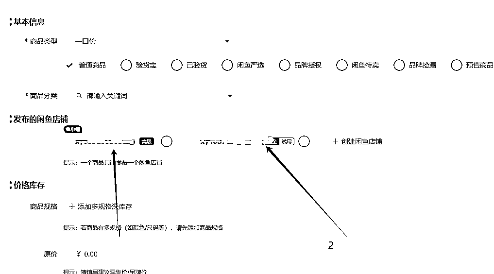

#### 1.2商品标题（B列）

#### 1.3商品内容（C列）

#### 1.4商品分类（D列）

在这可以输入自己的商品分类，虚拟游戏 / 游戏 / 游戏服务 / 其他游戏服务，图省事也可以直接输入三级四级类目，例如：游戏服务 / 其他游戏服务。会默认选择第一个分类

#### 1.5商品图片地址（E列)

在此文件夹下面不要放除了商品图外任何东西。

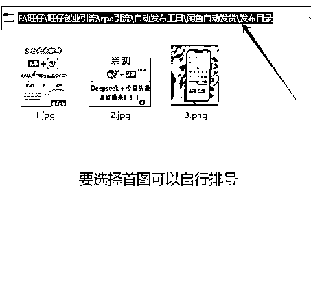

#### 1.6发货地（F列）

例如：广东省/潮州市/潮安区

按照闲鱼给的地址填写，例如这个就输入：北京/北京市/西城区

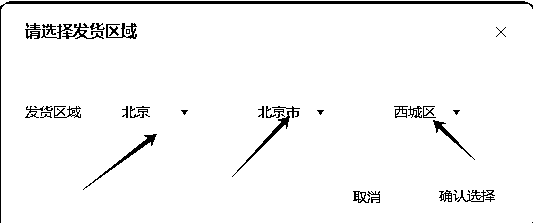

#### 1.7售价（G列）

#### 1.8原价（H列）

#### 1.9库存（I列）

#### 1.10状态（J列）

### 2启动配置

开始行号：从表格第几行开始发布商品

结束行号：到表格第几行的商品结束

时间延迟：防止操作太快浏览器跳验证

## 五：准备工作

首先在edge或者谷歌浏览器内部登陆

闲管家：https://goofish.pro/sale/statistics