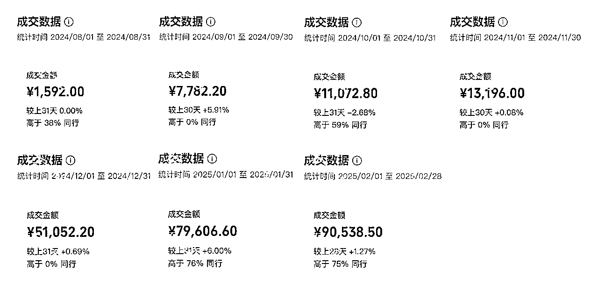
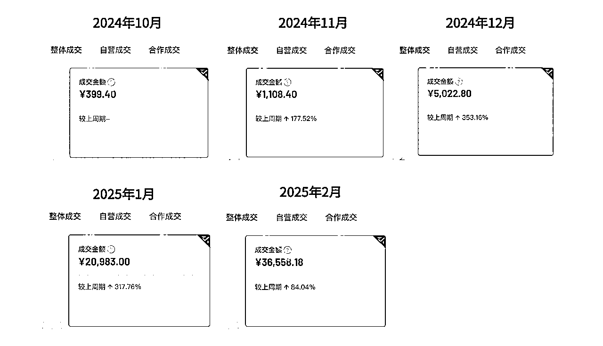
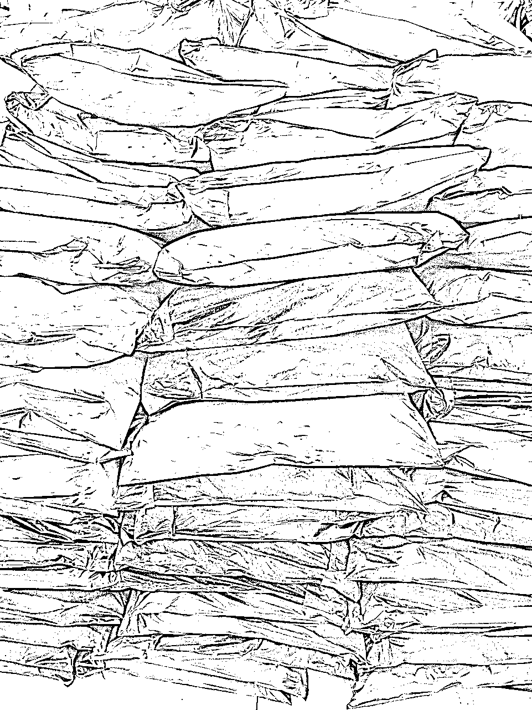

# 从0到月销13万，实体女装店零基础转型直播电商实录

> 来源：[https://r3f52rq7nv.feishu.cn/docx/XChkd9WFYo5ohDxvvgVcG32TnHc](https://r3f52rq7nv.feishu.cn/docx/XChkd9WFYo5ohDxvvgVcG32TnHc)

# 前言与数据

这位主播有点意思：0基础，奔五的年纪，几乎不会用电脑，话术靠手写，之前从来没在直播间买过东西。她用7个月从0做到了单月13万GMV。

没有财富故事，没有华丽的数据，也没有什么技巧，通篇都是两个普通人遇到问题、解决问题的笨办法，是正在发生的真实故事。

全程不投流、无技巧，硬起号。

文章中您将看到这件事情的背景、计划、筹备、问题、解决问题的过程、踩过的坑和经验总结。

直播电商领域我们的积累非常浅薄，恳请希望各位大神能在各方面给一些建议，感激不尽。

话不多说，先看数据：

先看视频号：

抖音的：

视频号从8月份正式启动，抖音10月启动，边播边练，因为风姐还有店铺要经营，还有一些家事要处理，进展一直不快。12月中旬风姐关店，正式投入直播。12月开始每个月播40场左右，每场2-3小时。到上个月（2025年2月）视频号和抖音加起来GMV近13万，退款率45%左右（因假期和预售原因，比前几个月高10%+），退货退款率25%左右。

2月只有28天，过年那段时间没怎么播，综合工厂放假货源不稳定、预售15天、发货时间长、物流时效低等假期情况，发货前退款率异常高，否则数据应该再好一些。

数据大致就是这样，下面开始讲故事。

故事的主人公：

1、风姐，女装自营店老板，奔五的年纪。最多的时候开4个店，每个月单店10万+业绩，选品、采购、陈列、动线设计都自己搞定。早年在女装工厂工作，几乎做过女装工厂的所有工序。而且有一手非常好的织补技能，如果你的毛衣破了个洞，她可以从这件衣服的其他地方抽一些线下来把这个洞补上，完全看不出来。疫情后生意越来越差，自己着急就乱投资（餐饮、美妆），血本无归，剩下了一个店。店铺房租加电费每月就要3.5万，还没有算她一个正式店员和一个兼职店员工资。去年6月和我探讨直播卖女装，8月份开始正式直播。在连续多个月每月亏损2万以上后，去年年底实在做不下去了，12月关了店，全职做直播电商。

2、龙一心，本人，在做了10年HR，机缘巧合还在副业瞎折腾，跨境、线下美业、小众医疗器械电商、视频号带货多少有一点微不足道的小结果。前年开始，尝试用自己会的这点东西帮身边朋友做业务拓展或者转型，积累了一点成功的案例。虽然在直播电商中，我还是个小白，但和风姐沟通后，我觉得可以尝试孵化一个直播间。就有了这个故事。

# 计划

## 1.1 为什么优先选视频号？

我觉得视频号的还没有很卷，包容性比较强（只要愿意播，播的差一点也能出单），获得正反馈相对容易（也只是相对容易一点）。有正反馈就能做下去，到时候开其他平台也会相对顺利。

## 1.2 我们有哪些优劣势？

新的业务需要看看能力和资源能否支撑，俗称看看自己几斤几两。

### 1.2.1 风姐的优劣势

优势：精通服装行业，清楚普通中老年人的服装需求与喜好，在产品上不会被骗，对爆品感知敏感（这项优势在后面被不断验证）。

劣势：风姐身高不高，或者说很矮，先天条件不太适合全身出镜做女装直播。年龄较大，长时间站着直播体力是个很大的挑战。对电商完全不了解，对电脑的使用仅限于用别人装好的收银软件收银，用电脑打字都费劲。从来不在直播间购物。

### 1.2.2 我的优劣势

优势：参与过很多期视频号的航海，对视频号相对了解。独立跑通过新奇特、养生茶等类目，有过单日佣金过万的经验。做过拼多多、Tiktok+Shopify、抖音引流实体，短视频、商品图都有独立完成的能力，可以独立完成业务中的全部闭环。在多家百亿以上规模企业，先后做过招聘负责人、组织发展负责人，能用风姐能听懂的方式解释商业模式和线上运营的内容，对新业务流程梳理与执行有一定经验。

劣势：从来没有接触过服装行业，对女装更是完全没有感知。没有做过服装类直播，这个类目对直播的要求比之前我有点经验的新奇特、养生茶等类目要求高很多，设备、灯光、机位、直播配置等等都是未知的挑战。

## 1.3 策略与定位

（1）像素级模仿：过往经验告诉我（也是从生财学到的），同行一定是聪明的，所有看似不合理的点可能都是在现有资源下妥协的结果，对于新人而言，一切先模仿再说，即使当前觉得不合理。

（2）极致性价比：对于服装这种不需要什么教育成本的产品，我觉得想做的长久一些，性价比是核心，质量好不好拿到手上就知道了，现在运费险是标配，不合适反手就退了。

（3）中老年女装：我们选择了做中老年女装，一是因为视频号本身人群画像，二是因为风姐一直在经营中老年女装，对于这个领域的选品和供应链情况都很清楚。

（4）最小成本启动：没赚钱的时候就别不花太多钱，一切能凑合就凑合，先跑起来再说。

# 筹备

有了计划，就开始筹备这件事情。

但是，应该从哪儿入手呢？看直播。

## 2.1 看直播

因为风姐完全零基础，之前不看直播也不在直播间买东西，网购全部拼多多，网感仅限于没事儿刷刷家长里短的抖音。为了让她快速找到感觉，我让她每天在视频号上看女装直播，每天至少看2个小时，先看，前三天不要问我问题，看看自己能不能找到答案。为什么前三天不要问我问题？因为不看就一些不能从直播中自己找到答案，还因为我也得看直播，我多少对直播带货了解一些，应该能先一步看出点东西。

看直播可以看出什么？

至少可以从看中回答出以下问题：

1、小店开了多长时间？卖了多少单？目前每场能卖多少单？转化率是多少？

2、每天播几场，开播和下播时间是什么时候？

3、直播间有几个主播？

4、直播间除了主播还有几个人？

5、直播间在哪里？

6、直播间是真实背景还是假背景？

7、这个主播在几个平台直播，哪个平台是主要平台？

8、这个团队有多少直播间（从带的品和话术的一致性看）？

9、用的直播伴侣还是手机，用不用镜子辅助直播？

如果看的时间足够长，看可能发现：

10、如果是直播伴侣，摄像设备用的手机投屏还是相机，手机投屏用的什么软件（不夸张，看的足够多了就可能看到手机切屏时候的软件）？

11、如果是手机直播，有几个机位，分别对应的什么平台，主机位是哪个平台？

12、直播间有几盏灯，什么灯，分别放在什么位置（可以结合账号发的短视频观察）？

13、直播间有多大，有几个场景，分别用来做什么？

.......

仔细观察还可以挖掘出很多需要的内容，每一个观察到的信息都是有价值的。

## 2.2 选择什么账号作为对标账号？

我的选择是：转化率在2%以上的1年内开店，每场（4个小时）卖300件以上，个人或者小团队，只有1-2个主播，直播话术近乎于平播，只卖自己小店的产品的账号作为对标账号。

## 2.3 为什么选这样的账号？

转化率在2%以上的1年内开店、每场（4个小时）卖300件以上，说明起号成功，个人/小团队能力比较强，这种直播间一般是主播播的不错，找两三个人帮忙，一般不大量投流、评论区没有太多水军，容易复制。这种直播间直播话术近乎于平播，模仿对标账号话术容易模仿，对于从来没有做过直播的人，很专业的话术很难模仿演绎，特别是冷启动时期。

## 2.4 为什么要选择卖自己小店产品？

因为视频号里多数服装的直播间都是卖的自己店铺的商品。我当时想，同行一定是最聪明的，大家都这么做，一定是有原因的。我也是跑了一趟市场以后，结合主播们卖的产品才知道为什么。在后面选品的部分会分析为什么。

下一步，该筛选对标账号了。

## 2.5 筛选什么样的对标账号？

因为以前做的项目账号（养生茶、新奇特）周期都不长，长的半年，短的几周，虽然短期内能赚到些钱，我也有几场单场直播佣金破万的经历，但经常在选品和流量里容易迷失，所以现在我选择的项目都希望周期长一些。

对标账号运营上不要有太多花活，在我看来越踏实的方法账号生命周期越长，最好就是那种硬播播起来的。按照平台的要求，就是靠“好产品、好内容、好服务”，最重要的是“能复制”。

1、好产品：服装不需要教育用户，用户上手就知道什么是好什么是不好，所以起号之前我的选品和定价标准就是”极致性价比“。所以选出对标账号后，我们把产品都买来看过。选出我们认为的高性价比产品直播间，作为对标账号。

2、好内容：直播间套路不多，多数时间是讲产品、展示产品，而不是大量的时间用各种花活塑品、制造稀缺感、做逼单。

3、好服务：这个相对容易，及时回复消息、及时发货、及时处理售后。

4、能复制：最重要的就是能复制，别人的直播间再好，自己复制不了都是空谈，看到别人的直播间，心里要能想出复制的方法。

账号选好了，下一步就要进行实操，进行像素级模仿。

# 模仿

## 3.1 怎么像素级模仿？

同款话术、同款场景、同款产品。

同款话术：最容易，录屏转文字，整理。

同款场景：也不难，别人有什么自己就做什么。

很明显，这里面最难的就是同款产品。怎么办？找。

## 3.2 怎么找同款产品

首先想到的就是网上找，1688、拼多多、淘宝、各种批发网......结论，没找到。

我和风姐用了最原始的办法，找营业执照注册在某个服装批发市场的账号，买了一单她直播间的产品，营业执照注册地址和发货地址一致，我们判断大概率她就是从这个批发市场拿货的。那就走一趟批发市场！

这一趟，我见到了对标账号主播！

那天一大早，我和风姐就到了批发市场，偌大的市场两个人用脚一家家店丈量，一个市场逛完去旁边一个市场，一个区逛完去另一个区。终于在逛了1个多小时的时候发现了同款，但是质量差很多，再逛，又发现同款，但是面料不一样。再逛，有一家感觉款式和质量都差不多，但是好像有点点薄，因为挂出来的裤子也没有吊牌（有吊牌也没用，因为很多店会把吊牌换成自己的），也不知道是不是同一家。

正当我和风姐小声谈论着是不是一样的裤子的时候，一个熟悉的身影迎面走来，进了这个店，和店主交谈。这个人正是我们对标账号的主播！看了她太多直播了，虽然她带着口罩，但我们一眼就认出来了。简直有如神助！

*   就好像我们正讨论：“是不是这款啊？”

*   对标账号的主播走过来说：“别找了，就这款，就是从这家拿的货！”

等她们聊完，我们问这个衣服怎么拿货，老板娘问我们要多少，要的少还有，多了没有，有个客户定了，客户卖爆了。这也侧面印证了这就是货源。我们拿了几手（每个尺码拿一件为一手）走，要了名片，拍了门头。

因为主播出了卖这个当季爆款还有前一季的款，和其他当季的衣服，我们又找了几个有同款，衣服质量差不多的店铺，拿了点货建立初步链接，留了联系方式，以备后期合作。

好，找货源的故事就这样，大家看个乐呵，同时，验证了风姐的选品能力很强，对服装行业十分了解。一路上她都很好的回答了我这个门外汉的疑问，在批发市场她看中的品，她说的：“这个现在也能卖的很好“”这个再过段时间会很好买”“这个流苏款比这个带标的好卖”等等，在后来其他人的直播间也一一得到了印证。

这趟的重点结论是通过分析产品价格和质量，我们判断出对标账号的定价策略：

毛利率：主推款毛利40-50%，其他款50-70%。

让有丰富线下经验的风姐评估了产品质量和线下的售价，属于性价比非常高的。

综合各类费用测算，这个定价基本没有下浮空间，是个没多少空间投流的品。虽然竞争激烈，但不用和打付费的团队抢市场，算是资源相对对称的竞争。我理解，应该是一个可以凭借稳扎稳打得到不错结果的长期项目。

至此，同款产品找到了。下面着手复制场景。

## 3.3 怎么复制同样的场景

我之前只尝试过短视频引流、开直播成交的直播，或者绿幕直播间，场景搭建相对容易，服装的直播间难度大很多。这个时候在“看直播”的时候看出的结果就有用了。

### 3.3.1 实景

对标账号是实装实景，墙面是实装的板材、有实木装饰条。我们遵循计划阶段的策略”最小成本启动“，打算这么复制。

1、场地：我们找了个老小区，40平左右，一个月1500不到。

2、墙面：墙面用贴上与对标直播间墙面板材颜色相近的墙纸，装饰条用泡沫装饰条代替，200块搞定。

3、地毯：照着对标账号买了个2.5米x3米地毯，180左右。

### 3.3.2 软装

这个更简单，她后面放了个落地式衣架我们也买了一个颜色、款式都一样的；她后面放了个小沙发，我们就买个颜色大小都差不多的小沙发；她沙发上放了个小抱枕，那我们也买个颜色大小差不多的抱枕。摆放位置和角度，她怎么摆，我就怎么摆。

### 3.3.3 灯光

这个在当时的我看来是最难的，因为我也没有经验。灯的功率、色温、位置、距离都在不断的尝试调整过程中。这个方面生财里有很多大神，短视频平台也有分享。这里说下我的实践感知，对于小直播间而言，最简单的方法，两个球灯打亮左右两侧，腿灯打亮下半身，顶灯打亮空间和背景就差不多了。目标受众的要求也没有这么高。

### 3.3.4 搭配

主播的服装搭配直接模仿目标主播就好，她穿什么上衣、什么裤子、手上戴什么，尽可能从色彩、款式保持一致。

### 3.3.5 摄像

无非是手机、相机或者有些直播摄像设备。我们最开始用的是手机，我的备用机iPhone 12，效果只能说相当凑合，后来因为换新品的时候，双色面料在手机上的表现太差，拿了朋友的一台Sony微单，用直播伴侣直播。

### 3.3.6 收音

这个要求不高，直播测试的时候能听清楚就好。如果觉得主播声音小，就带着无线麦克风。如果用直播伴侣直播，还可以把声音增益调整一个合适的值。

场景搭建好用了5000不到。看了一下镜头里的样子，真的很像，场景复制完成。上架商品后，就可以直播开卖了。

## 3.4 怎么上架商品？

开店这个部分，生财航海手册里都会涉及，我就不多说了，整体不复杂。注册好营业执照，去开店就好了，建议自己在当地申请个体工商户就可以，不建议去网上买，以免后续有很多未知的麻烦不好处理。

简单说一下商品上架部分，也相对容易。

1、关于详情图片：货源无论是批发商还是工厂，都会有产品图片，找几张直接上传就好。如果实在只有1-2张，不满足图片数量要求就找找对标账号，或者各大电商平台以图搜商品，基本都能找到这款的其他图片。如果图片过大就压缩一下。不过批发商和工厂给的图片基本都带有货号，如果想把货号去掉可以用美图秀秀等工具去除。

2、关于商品标题：可以直接复制对标账号的，我可以根据你理解的产品特点改改。这部分对于纯直播带货而言，我觉得影响没有太大。

到这儿，筹备就基本结束了。有了货，有了店铺，有了账号，再有个主播带货就可以了，可主播在哪儿呢？基于“没赚钱的时候就别不花太多钱”的基础策略，没得选，只有风姐，那就只能训练风姐成为一名主播。

# 启动

## 4.1 怎么训练主播？

因为过往工作的原因，我大概算是一名凑合着能看的培训师，有一点点关于说话的经验。战战兢兢地开始了我第一次孵化主播的过程。

### 4.1.1 第一阶段：理解、有感

#### 4.1.1.1 理解

首先，要让风姐理解电商的业务逻辑是什么，让风姐知道整个业务的全貌是什么，她在整个业务中承担什么角色。

对于一个奔五，几乎不会使用电脑，没在直播间买过东西的人，告诉她账号、流量、平台、服务费、投流、各种率她一头懵怎么办？

用她最熟悉的业务给她解释。这部分对于圈友们是常识，对于风姐，用风姐的话说“还有这么多道道的”“很高级”。

比如：

*   平台是什么？就是你之前开店的商场。

*   店铺是什么？就是你在商场开的店。

*   有什么不同？在线下，商场不管你有没有生意，按月先把租金交了；在线上，平台这个商场从你每笔生意里抽一点服务费作为租金，多卖多交，少买少交，不卖不交。

*   成交过程是什么？流量就是从你店门口过的人，点击就是进店，直播就是店员在进店客户面前介绍产品，下单就是把衣服拿到收银台，付钱还是付钱。

*   直播购物和拼多多购物有什么不同？买家从拼多多这类传统电商买东西，东西好不好只能从商品详情页和评价中判断；从直播间买东西，主播可以展示更多的有用信息，你想看什么还可以提提要求、看看细节。

*   快递和退货是怎么回事？线下客户能看到、摸到、试穿、照镜子看看上身效果。线上客户只能听主播说，看评论区和商品评价反馈，不能第一时间拿到衣服，那就用快递寄给她让她看看、摸摸、试试、照照镜子。

*   不合适不喜欢怎么办？不合适就退给商家。让买家放心下单，没有后顾之忧。

*   那退货的快递费谁承担？为了让想买的人放心买，退货运费商家出了，每一单买的运费险大概可以理解成退货运费兑换券，有这个券就能免费退一次。

*   ......

如此等等。

#### 4.1.1.2 有感

还有一个贯穿始终部分的就是培养网感。从让风姐开始看直播的时候，其实就已经开始了。培养网感方法三个部分：找、看、拆。

1、找，找对标账号，这个前面说过了，不多赘述。

2、看，看对标账号的主播直播间，每天看，看完每天复盘、交流，根据风姐当天的学习情况，描述她理解的话术结构和动作要点。

3、拆，拆解对标账号话术，话术结构、产品要点。用自己觉得合适的方式重新组合。最次也要能区分话术结构，至少会回答目标客户几个问题：

*   我为什么需要？

*   我为什么要这个价格买？

*   我为什么要从你这儿买？

*   我为什么要现在买？

*   我适合什么颜色什么尺码？

*   我怎么下单？

关于话术这部分生财的帖子和航海手册也很丰富，不过多阐述。

由于风姐对软件使用不熟悉，所以她开始了一遍遍手写整理，我深受震撼，下图是其中的一遍。

### 4.1.2 第二阶段：能说、会演

有一个有趣的现象，一些人当着真人可以充分表达，但是一旦不面对真人，对着摄像头就说不出话。

我有一个管理咨询机构的朋友，行业里有点名气的讲师，有一次我邀请他帮我录制一门放在公司E-learning系统里的线上内训课程，他告诉我，他对着镜头张不开嘴。

风姐也是这样，她个成熟的销售，但是她面对镜头也不知道说什么，大脑一片空白。而且确实线下销售和线上直播销售确实有很多不一样的地方。因为场景的不同，线下一对一，离客户近，可以干预客户消费决策的方法和动作都很多，客户也可以自己感受产品的方方面面；但线上隔着屏幕干预客户的方式少了很多，客户获得产品信息全靠主播介绍，和线下销售话术也有很多不同。就连话说的方式和状态也不同，隔着屏幕还要让客户感受到热情。

那就先让风姐能说出来，然后能演绎出来。

#### 4.1.2.1 能说

能说，先从没话说到有话说。

首先是读，把前面整理的话术读熟，让自己有话说。

然后是改，读多了以后自然会发现自己发音别扭或者拗口的地方，改成自己读起来顺口的。

要读到什么程度呢？我会问各种相关的问题，要立刻能用话术回答。

#### 4.1.2.2 会演

服装的直播，有话说是远远不够的。服装是个不用教育用户，还可能被用户教育的类目。对直播的要求就会更高。

把改好的话术，带着产品在场景中练习，话术、动作、表情配合起来。这个过程花了比较长的时间，风姐开始的时候比较紧张，花了很多时间和她一点点扣动作和表达。

忘词是经常发生的，这里我用了记忆方法中的“记忆宫殿法”，眼睛看到哪儿，手指到哪儿，话术说到哪儿，忘词的情况就好很多。

### 4.1.3 第三阶段：协作、优化

从风姐能相对连贯的演绎之后，我们就开始了直播，没有直播压力的情况下，她播个几分钟十几分钟总想休息一下，我就直接开直播。最开始直播从每场半个小时开始，我们约定，只要开播后，哪怕站也要站满30分钟，我不给关播信号不许下播。

就这样，努力的风姐在残忍的强迫成长下，渐渐开始出单，每天场1单，每场5单，到现在最高一场99单。

我们还在不断优化迭代，我还在见证风姐的进一步。

# 踩坑

当然，踩坑是必然的，这里把我感受深的、需要较时间折腾寻找答案的分享出来，如果也有这个赛道的新手圈友以后可以少走弯路。

## 5.1 退货退款

这里我觉得是个很大的坑，会让人内心有些难过，因为或多或少会看到人性中瑕疵的部分。

### 5.1.1 我理解的退货退款合理操作流程：

客户申请退货退款-客户退货-商家收到包裹-在高清摄像头下拆包（最好附带扫码退货系统）-确认退货内容数量无误、商品不影响二次销售-系统操作退款

恶意欺诈退货和客户不小心寄错了退货很常见。流程错一点，可能就赔了一件衣服，虽然价值不高，但是让人心里十分难受，影响情绪。我就遇到过两次，买家从网上买了一包榨菜寄到退货地址，在这包榨菜签收的第二、第三天在系统上填写退货物流单号。如果商家已经把退货的榨菜快递拆了，就说不清楚了。寄错的衣服就更多了，每周都能收到几件，且没有一件质量好于我们售卖商品的。

小卖家在实际操作中很难按照上面那个流程操作。我们遇到的实际问题是，房间小，除了直播间的区域，其他区域堆得都是货，没办法摆放拆包摄像头工作台。同时考虑到人力紧缺，都在摄像头下拆包还是影响工作效率的，量小的时候也不必要。

怎么办呢？经过摸索，目前的流程我觉得比较合适小卖家。

### 5.1.2 我摸索的适合小卖家的退货操作流程

客户申请退货退款-客户退货-商家收到包裹-用剪刀在快递表面拆个小口，核对商品是否是店铺售卖的，吊牌、商品包装袋是否还在（经验告诉我们，有商品包装袋的多数没问题，也有少数例外）-核实商品数量-系统操作退款-退货中查不到的快递妥善保存备用

如果发现商品包装袋没有了、不是原商品包装袋、退货不是店铺售卖的要用手机拍下拆包视频，协商、拒绝退款的时候使用。平台基本都能支持商家，就是时间有些长。

流程很重要，错一个顺序就可能损失一件衣服。

## 5.2 退款率、退货率

退款率、退货率一直是女装类目的大话题

### 5.2.1 降低发货前退款率

降低发货前退货率的方法就是挂现货链接、及时打单发货。

挂现货链接：过年前后因为供货不稳定，部分备货不足，只能挂预售，发货前退款率非常高。

及时打单发货：前一天晚上的直播可以第二天一早打单，白天的直播可以播完就打单。能有效降低发货前退款率。

### 5.2.2 降低退货率

降低退货率的核心是减少预期差，主要是质量、颜色、尺码。

质量：同一个版型、样式的上衣，拿货价有60的、有30的、有15 的。有一些直播间展示的是60的，买的是30 甚至15的，退货率自然就比较高。在我们这个业务逻辑里，“极致性价比”是核心。

颜色：也是个重要的维度，这和直播间灯光色温、亮度、直播软件调色相关。多找几个主流品牌、主流型号的手机测测看。

尺码：退货退款的原因里尺码不合适占比最大，不同人身形不同，很难有一个绝对合适的推荐建议，综合同行和有经验的人评估，通过换品后的一段时间对退货用户的电话回访可以适当修正。

## 5.3 错发漏发

发错货是个不可避免的话题，刚开始起量的第三周我突然感知到最近发错货、漏发的情况很多。抖音还好，异常包裹还有提示，微信小店连异常包裹提示都没有。特别是在换季换品的时候发错货、漏发的情况就更多，怎么避免呢？我们采用了下面两个办法。

### 5.2.1 分开打印

订单里不同货号的产品单独打印，一般主推款占绝大多数，其他款单独打印，2件以上的单独打印。发货的时候不同款单独发货就能避免错发的情况。

### 5.2.2 二次核对

为什么会发错？理论上，面单上是什么颜色什么尺码拿什么打包就可以了。但实际上，我们会有各种各样可能出错的地方。比如打包时间长了有些累，人会有点懵；去拿对应的货的时候走神拿错了......特别是货很多，打包时间很紧，人力又不足的时候出错的可能就更大。

为什么会漏发？打包的时候为了快，会把打印出来的一长串面单撕开分类，一个颜色的让同一个人去发货，因为空间比较小，货比较多，面单拿着拿着就可能掉到哪个缝里，或者被哪个包装袋盖住。反正一片狼藉的打包场景中，非常常见。

这对于HR出身的我，这种感觉简直崩溃，所以我优化了这个流程，我叫它“二次核对”。

1、第一次核对：贴标签

按照商品的货号、颜色、尺码，用热敏贴纸打印小标签备用。打包的时候，将对应的小标签贴在快递袋外面。

这和直接贴快递单有什么不同吗？仅从文字看，可能有些抽象，但从实践看，这种方法相对便捷。简单点说，以前判断面单和货是否对应，现在只需要确定里面包的是什么货就可以了，节省了大量心力，也降低了因为贴错面单或者其他意外重新打单的麻烦。如此等等。

2、第二次核对：贴面单

每场播完，直接打印面单，长长的面单不撕开，从头到尾按顺序把面单贴到有小标签的快递包裹上。贴完后，把长长的面单纸用手捋一遍，确定没有遗漏的面单，就可以安心等快递上门取件了。

这种方法用于大量的单件商品的包裹非常好用。不仅减少了错发漏发，降低了集中发货的压力。因为只要有货，空闲的时间就可以把每一件都打包好、贴上对应的标签。直播完，只需要打印面单，贴上就可以了。我觉得对于人力不足的小团队是个不错的方法。同时，也求教各位大神有没有更好的办法。

## 5.4 直播伴侣

视频号直播伴侣和抖音直播伴侣默认的亮度等指标是不一样的，同一个视频信号源在视频号上看着刚好，但在抖音上看着浅色衣服就容易过曝，色彩看起来也有些奇怪。

由于视频号可调节的空间比较小，我的方法是先照顾视频号的画面质量，抖音多调整一些就可以。

## 5.5 没有流量

遇到没有流量、不出单的时候多从主播、话术、动作、表达上找原因。不要过多琢磨换对标、换场景、换设备。

# 结语

我也没想到写到这儿近10000字了。因为篇幅原因、细节太多，就不一一展开了。关于运营相关的内容生财里非常丰富，文中没有占用太多篇幅。

再次恳请大家给一些优化建议，当局者迷，感激不尽。

这篇文章除了复盘这个过程、分享一些我觉得有价值的经验以外，还想和大家分享的是风姐的执着和不断自我迭代的精神。过程中因为长时间不出单、不能稳定出单，哭过多次，但不影响半小时后她擦干眼泪继续干。只要路是通的，不断优化就一定走的通。

最后分享一下风姐第一次单日发货破百的场景，祝大家都能源源不断的生财。

