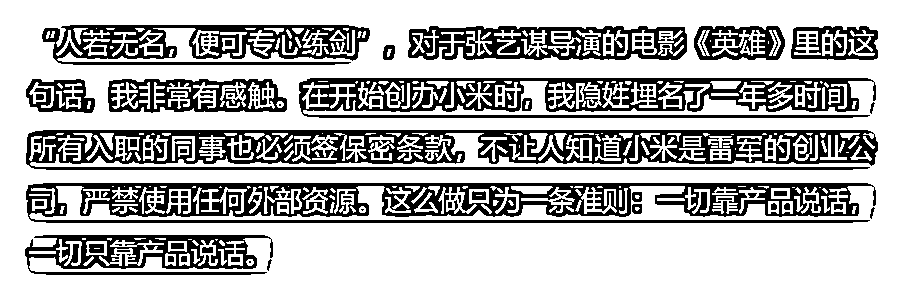

# 新手如何迈出第一步？首条视频突破1.2w播放的心路历程。

> 来源：[https://v68e301vkv.feishu.cn/docx/XmP3dECt2omCTzx8JNCcSMHhnke](https://v68e301vkv.feishu.cn/docx/XmP3dECt2omCTzx8JNCcSMHhnke)

## 一、缘起

### 一）热点

3 月 6 日的中国 AI，无疑是 Manus 最火。前有数字生命卡兹克、赛博禅心等头部 AI 自媒体实测后大加赞赏，后有一堆自媒体账号拿着官方演示跟风夸赞。

国产 AI 相较于外国 AI，一定是更受俺们中国人喜欢。这样以后出去跟外国人吹逼的时候，就能说你看我们家的 AI 甩你们几条街呢。

稀缺，妥妥的稀缺。就连头部的 AI 博主都要走关系，走后门，才能能拿到邀请码，大多数人甚至连网络问题都解决不了，即使解决了，又要填申请表，能不能拿到，什么时候拿到都不是自己说的算。

社会+权威+我们+稀缺，一下子占据了《影响力》的四要素，而且这还不止。

### 二）反差

当天中午，硅星人，同样是 WaytoAGI 推荐的头部自媒体，发表了署名为王兆洋的文章 《想并肩 DeepSeek 不能靠自嗨和邀请码》，不再是说如何如何的好，由此矛盾的对立面由此产生。

与此同时，在如此火爆的情况下，又极度的稀缺，势必会出现黄牛。不出所料，闲鱼当天又卖注册教程的、又代注册的，更有甚者一个邀请码被炒到了 8.8w，吓得官方也出来急忙回应，由此开始转向。

这不就是做自媒体常见的反差嘛！

### 三）高价值

即使到这个时候，还不足以支撑我做这个视频，顶多就是看看，看看这家怎么说，那家怎么说。因为我想不出，在没有实测的情况下，通过他们的只言片语，该如何构建出属于我自己的内容？

直到我看到老图发的《手把手教你，5分钟申请到8w元一个的Manus邀请码!》，这个时候已经晚上 10 点钟了，我之前也并未发过一条短视频，但当时，我的身体告诉我，你去吧。

因为这时候我觉得，我能为用户带来价值了，我可以教他们如何避坑，我可以教他们如何注册。即使各大社群的圈友都知道如何注册了，但这只是可得性偏差，一定存在苦苦求索的观众，他们就是我想要把握的人！

## 二、How？

### 一）压力

#### 1、害怕被熟人看到

不谈大多数人怎样怎样，只谈我当时确实有考虑：被朋友看见了怎么办？他们会不会嘲笑我？我这样拍是不是太丑了？我也不上镜啊！我也不会写文案啊，我也不会剪辑啊。某某某都做的那么好了，这不是丢人现眼吗？

一堆的问题，一堆的借口，都在给我接下来可能采取的逃避提供支撑。我难道真的又要逃避吗？

我不想做逃兵，但是这些问题当时我确实有考虑。既然如此，正面攻击没有必胜的决心，我就迂回一下，让你们看不见不就得了。

我用小号！只要我大号不给点爱心不就得了。

#### 2、太晚了，影响对象睡觉

当时已经是晚上 10 点多了，按照平时的作息规律，这时候该洗漱上床，两个人一起打游戏、看电视，或者我看书，她刷抖音的。

可当时我确实想做这条视频，于是一个人在客厅，一直在喊：中国 AI 又出王炸了！哎呀，不行，重来！

我们租的是 400 块钱的毛坯房，房间很空，即使她在最里面的房间，也听得一清二楚。果不其然，她生气了！

我不是一个特别会哄女朋友的人，有的时候我甚至会想：就这点小事，也会生气。以至于我采取的行动就是，摸摸头，抱一抱，说：“宝宝，等一会嘛，我尽快！”即使嘴上这样说，脸上也是有不耐烦的，心里想的也是我一会该怎么拍好。

有时候我甚至会刻意降低我的记忆力，每次的生气，打闹，睡一觉我就会忘的一清二楚。

有的人宁愿忍受痛苦，也不愿意解决问题。我宁愿摆脸子去安慰她，也不愿意心平气和的和她沟通。

当时的我，最终是采取一会跑到电脑前，一会跑到女朋友前，循环往复，直到最终的视频发出去。

### 二）文案

虽然写过 10w+ 的爆文，但我深知，由于常年社交的缺失，以及常年不刷短视频，我的表达能力，以及网感，是确实的。加上时间的有限性，由此，不得不借助 AI 的帮助。

没有直接选用 DeepSeek 官网的原因是：其联网能力略有欠缺，而是采用依靠腾讯生态的元宝+DeepSeek，可以直接联网读取近期的公众号文章。

因为是推理模型，所以不太需要结构化提示词。李继刚老师在《推理模型的prompt》中提到，只需要表明 A 背景，以及 B 目标 ，即可。

对于我自身而言，我认为和大模型的沟通就类似于与人沟通，与人沟通，就不得不提到一本书，叫做《非暴力沟通》，四个要素：观察、感受、需求、请求。

基于此，我用了一个很简单，也略显粗糙的提示词。

但是，元宝貌似不知道 Manus 是什么？它跟我说：这个刚火起来的Web3域名，注册完全免费！

于是，我准备和他对齐一下，说明这是一个 AI Agent。搞笑的是，我也是在写这篇文章的时候，才看见，写的竟然是“重新挑战脚本”，我想我本来的想法应该是“重新撰写脚本”，足以证明当时的场面有多焦灼，以至于如今才发现。

不过，元宝倒是没让我失望，它给我重新设计了一个脚本。

但是，问题在于它确实是一个脚本，我没有那么多时间，我没办法给你搞什么：创业历程快剪、科技感史诗音乐、警示灯特效，我要的就是一个能直接拍、直接发的文案。

这次，它给了我 5 个版本，第一个版本不错，但是缺少如何注册的内容，加上就得了！只话不多说，直接开拍。

### 三）拍摄及剪辑

我没有手机支架，没办法固定在一个角度；前文也说了，住的是毛坯房，都是大白墙，人货场中的场，就不可能那么专业；天气降温，2 天没洗澡，头发已经变成鸡窝，这么晚了，我也不可能为了拍个视频，去洗澡、吹头发。

如果我真的告诉自己，等解决这三个问题后，再去拍摄。我敢保证，我一定不可能拍成。对于当时的我而言，哪个问题解决起来，都是难题。

我没办法，没有支架我就手拿着。背景不好，我就挡住。头没洗，我就把脸拍的大一点。干就完了！奥利给！

之前看盗版的生财视频号口播手册，有一个快提词的提词器app。因为好久没用，登录状态掉了，重新登录的话需要另一个在卧室的手机接受验证码，否则就要重新注册，实在是太麻烦了，我自己背，多读几遍，不就背下来了，人都是逼出来的。

一遍一遍地走，一遍一遍地说，哪怕磕绊，哪怕停顿，哪怕忘词，又怎么样，我不靠专业获胜，我只有真诚。

拍摄就这样结束了，剩下的就是剪辑。没有背景音乐、没有音效、没有动画，就我一个怼脸的视频，加上各个地方截得一张有一张图片，字幕用的还是剪映刚下载送的每月一次免费的识别字幕，没有用智能剪口播。

封面都是系统自动生成的，以至于第二天爆了之后，我觉得不太美观，才找对标更换的。

标题就是文案的第一句话，没有再让 AI 生成爆款标题，标签也是自己随便打的。

就这样在 12 点前发出去，一身轻松，立马回屋哄女朋友，睡觉。

## 三、由此产生的思考

### 一）运营？爆款？内容？

第二天起床，播放量 3000 多，这条视频爆了，内心毫无疑问会激动。

但我知道，让这条视频爆的原因，并非我的专业，而仅仅是热度到了。

纵使播放量很高，有点赞、有爱心、有关注，对于我而言，可能并不会过于高兴。

精神层面，我不喜欢追热点，我也知道，我追不上热点。我也不喜欢，每10分钟一轮话术，不断的靠炫技割韭菜，我更喜欢踏踏实实的做内容。

物质层面，爆款给我带来的是泛流量，除了未来可能参加的创作者分成，目前没有带来一分钱的变现。

我想要的精准用户是谁？我想要团结的人是谁？我想要打击的人是谁？谁是我的朋友？谁又是我的敌人？这个问题，我一直在思考。

我目前能想到的是，参考 B 站 up 主「古必的精读书柜」，隔一段时间做优质短视频，每天学习 AI 方面的知识（最好是聚焦于一个领域，AI 作为辅助工具），在晚上直播进行教学，直播是免费的，全套的回放进行收费。

这样我就不需要关注流量的起伏，也不需要忍受重复话术的无聊，在一定程度上，对于我未来的成长而言，也是有帮助的。

### 二）用小号还是用大号？

3 月 7 号的晚上，第一条视频正式突破 1w 播放量，我在包含我爸、我妈、我弟的家庭群中，分享了这个消息。

让我没想到的是，第二天清晨，在我还在熟睡的时候，我爸给我发了个朋友圈。至此，我的亲戚朋友纷至沓来，一时间我有些反感。

直到晚上，在学校准备回家坐电梯等待中的我，在 flomo 中写了这样一句话：如果你现在还不想让他们知道，你就永远无法被所有人熟知。

不想再逃避了，不想再重新起号了，不想再在意他们的看法了。有人提意见有什么不好呢？平时没时间给他们打电话，他们在家无聊，还能看见我，又有什么不好呢？我可能不是最完美的，但是我每条视频都有进步就好啦，这就是我啊，这就是最真实的我啊。

就在昨天，阅读《小米创业思考》的时候，看到这样一句话：

这就是我梦想的状态。即使如今被亲戚、朋友知道了，也还仅仅是小部分人群，希望自己能够专心练剑，小号大号又怎样，小号也能变成大号，大号也都是从小号过来的，总有一天，你也可以「靠产品说话」！

### 三）1+1≠3，也是答案。

这是我在猿编程卖课打 1500 多分钟电话，体会到的。tmk 来的用户，对编程大多没有认知，几乎都不是精准用户，这样的情况下，只孩子上4节课，就想让他拿出 2000 多块钱，是不容易的。

一个周期 10 天，30 个家长，你会遇见不接电话的、空号的、骂人的、不加微信的、不下载 app 的、不上课的、不完成作业的、拉黑的，各种各样的情况。不到最后，你永远不知道谁是你的真命天子。

没办法遇见一个上来就跟你说买课的人，即使他每天准点上课，按时完成作业，回信息积极，你以为是真命天子，有可能也只是想白嫖。

但你能说，不打电话吗？不发消息吗？就等他自己下单吗？怎么可能！

那新手不会说怎么办？有现成的话术，有固定的 sop，甚至精细化到每五分钟应该发什么，打不就得了，发不就得了。

说错了怎么办？说错了，下次就改呗！当时说错了，就当时跟家长承认错误，事后想起来不对劲，就下次电话承认错误，家长也是人，他们不喜欢死板的话术，有时看见你道歉，还会被你的真诚和努力打动。

分配的用户，你根据经验判断，一定不会买课怎么办？难道就这样放弃了吗？练手呗！练你的话术，把你能想到的话，都说一遍。还能去了解，他一定不买的原因是什么？痛点是什么，下次碰见这样的用户怎么提前预防？

凡所发生，必利于我。写文案、做视频、做直播，这样看来，也是一样喽。

实在不济，你打了很多电话，可就是卖不出去，这时候你身边的同事、主管，也会被你的努力所感动，他们不舍得看到你努力了没有成绩，他们在你身上看见了过去的自己，这时候都会来帮你的。

此时，你的努力就是方法，团结就是力量。（但这是水到渠成的事情，切勿刻意为之。）

## 四、总结

发这篇帖子的原因是，想让太多太多和我一样，不敢迈出第一步的人，能看到我当时的犹豫、徘徊与迷茫，从而能鼓足勇气，踏出属于自己的第一步。2025 让我们一起携手同行。

其次呢，作为一名刚正式加入生财的小白，也希望通过自己的复盘，得到各位前辈们的建议和指点，你们的真知灼见，就是晚辈成长的翅膀。

最后呢，想以主席的诗词作为结尾，共勉。

《忆秦娥·娄山关》

西风烈，长空雁叫霜晨月。霜晨月，马蹄声碎，喇叭声咽。

雄关漫道真如铁，而今迈步从头越。从头越，苍山如海，残阳如血。

* * *

## 参考文章

王兆洋：想并肩 DeepSeek 不能靠自嗨和邀请码

李继刚：推理模型的prompt