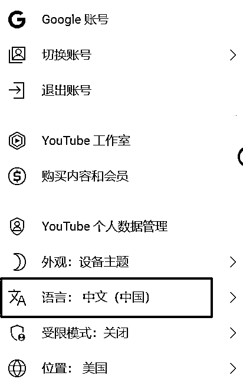
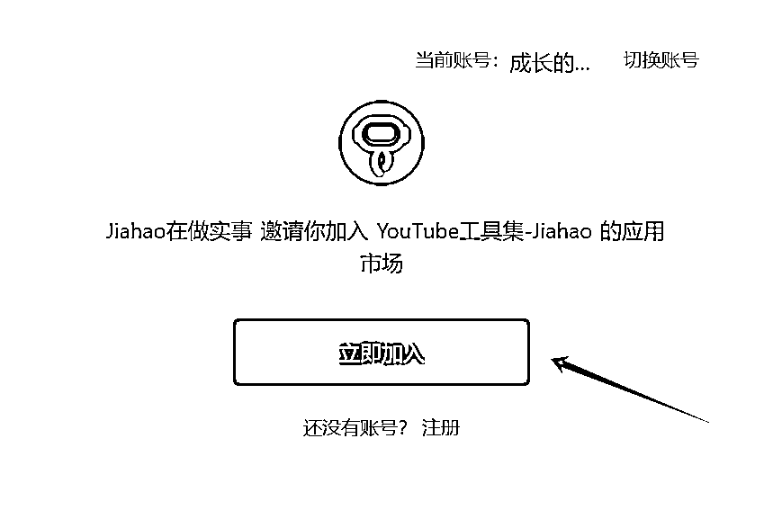
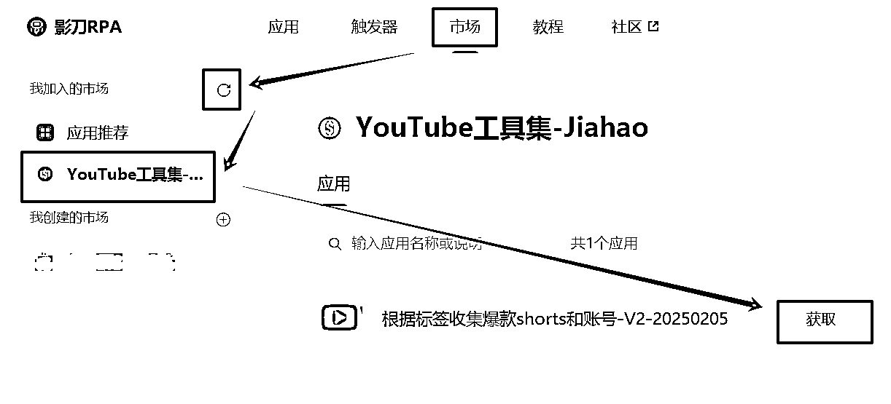
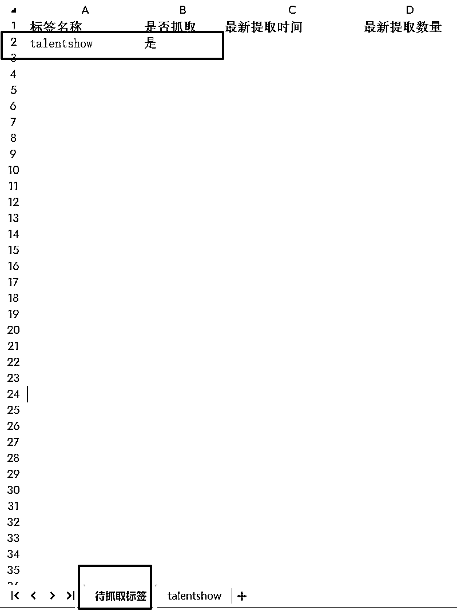
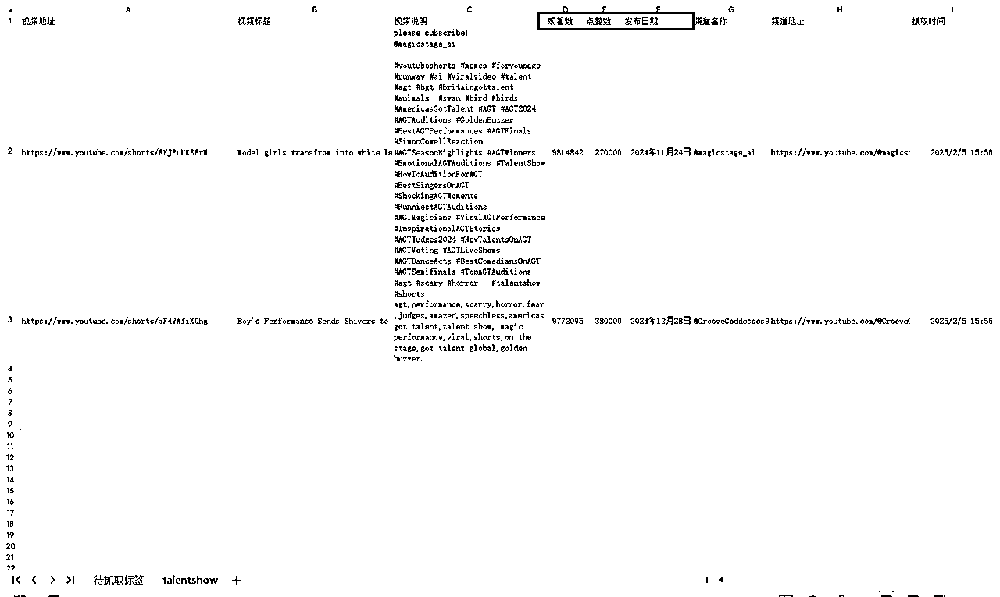
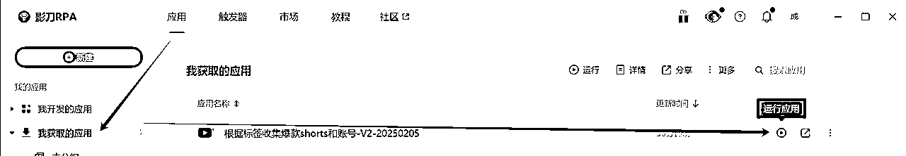

# 根据标签收集爆款shorts和账号工具

> 来源：[https://gpbr9zf6b9.feishu.cn/docx/DeaCdva9qoilWDxicPTcmRXznWe](https://gpbr9zf6b9.feishu.cn/docx/DeaCdva9qoilWDxicPTcmRXznWe)

# 工具简介

因youtube根据标签查询视频的页面不是太好用，每个视频必须点击了才能看到发布时间和详细信息，全是重复性的低价值工作，于是本工具应运而生。本工具主要是以RPA的方式，通过excel方式批量配置需要抓取的视频标签，自动抓取一定数量的视频，便于后续更快速找到对标账号。

# **重要提醒**

本程序目前仅支持简体中文，运行前请先设置好youtube的语言！

本程序未经很严格的测试，我抓取过1000多个视频，暂时没发现明显问题。

因对爬虫行业理解不深，不明确同一个IP大量抓取视频会不会导致IP被封禁的问题，欢迎反馈。

如果担心账号受影响，可以在不登录youtube的情况下使用本程序，实测可以正常运行。

# 更新日志

## V3-2025.2.7

测试24小时持续打开视频可稳定运行，在绝大多数情况下提取信息失败自动关闭网页防止浏览器保留太多tab，偶尔会有一两个视频信息页元素定位不到的问题。

已知问题：在运行24小时左右，本机可能是梯子或是youtube临时封禁，会出现网页打不开报错问题，tab无法实现自动关闭，建议一次性要提取的标签不要太多，每个标签采集的视频数按需尽量少采集。有条件可以多机并行跑不同标签，效率高一些，出错几率也更低。

# 运行环境要求

Window 10+

wps或office

chrome

影刀

科学上网工具

# 工具获取方法

## 影刀账号注册

因我的影刀是创业版账号，只要我一直是创业版，大家就可以一直使用本工具，因此请先通过以下链接注册影刀，每注册一个账号我的创业版可自动续期3-5天（https://www.winrobot360.com/share/activity?inviteUserUuid=700552019417403394）。

新注册的账号会赠送30天的创业版权限，只有创业版以上的账号才可以使用本工具，如果没有手机号可注册或实在不想注册，可以到闲鱼两块钱买一个现成的30天号。

## 应用获取

点击下方链接，加入市场：

https://www.winrobot360.com/share/accede?inviteKey=097fee56-c747-40bf-9e3e-5f776ccae964

本机打开影刀，按照下方路径输入密码scys2025获取应用：

# 工具使用教程

## 获取excel模板并填写待抓取标签

点击下载下方的excel模板，在“待抓取标签”页，第一列填写需要抓取的标签，第二列填写“是”或“否”，如果是“否”，运行程序时不会抓取。这一步就这么简单，模板里的其他字段都不需要填写，程序运行后会自动填。另外talentshow这个表单，仅仅用于展示一下最后提取的信息，看完删除了就好。

抓取后的效果：

## 运行应用

按照下图方法 点击影刀的应用-->我获取的应用，点击对应应用右侧的运行按钮，首次运行可能要稍等一会。

等待运行参数设置窗体出现后，设置参数后，点击确定即可运行：

1）标签excel文件：选择上一步下载并填写完的excel文件即可；

2）每个标签鼠标滚动次数：youtube标签短视频界面默认7行共35个视频，3次可以开始拉取更多视频，30次大概可以拉取400-500个，大家按实际来填即可；

3）记住内容：建议勾选，标签excel文件可以一直用同一个，不断补充标签，或者重复运行即可，程序不会删除原来已经抓取到的数据，但去重需要自己在excel里操作一下。

因程序会抢占鼠标，建议使用空闲电脑或云服务器来运行本应用，或者是等晚上睡觉的时候让它自己跑。