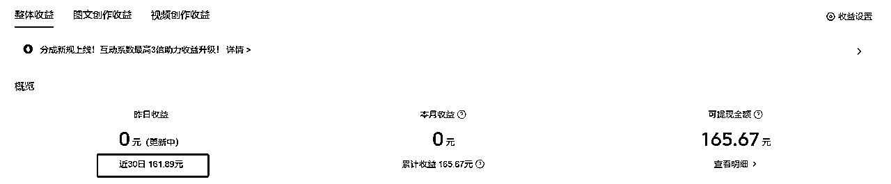
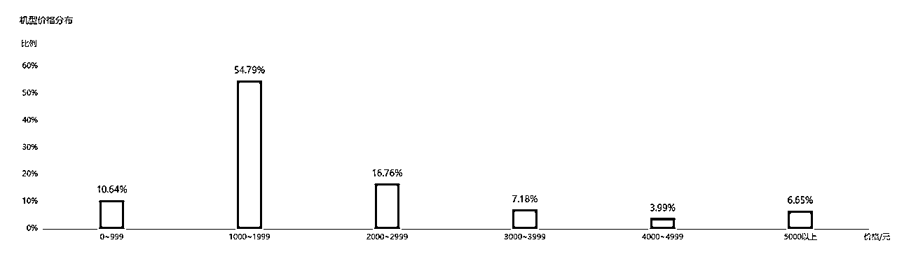

# RPA+deepseek+多维表，实现头条号文章批量生成和发布

> 来源：[https://dcsnt4film.feishu.cn/docx/YVBed7SLCoRaSTx49fYc9925n4c](https://dcsnt4film.feishu.cn/docx/YVBed7SLCoRaSTx49fYc9925n4c)

# 头条号介绍

头条号就是今日头条的创作中心，收益还不错因为头条在推首发激励，72h头条首发3倍分成，AI时代原创的边际成本几乎为零。账号应该是一个人只能实名一个，一个公司主体2个。

公众号运营社群一搜一大把，每期航海也都安排了，头条号相关内容不多。

先po一下数据来点鸡血：

我头条号废弃2年多，重启时账户余额4块，单号连续发文一周，每天半小时，现金收益160，涨粉300+，后被判违规暂停更新，后面细说。

我想注意平台限制+矩阵操作是个值得放大的小项目，月入几千是完全可以实现的，时间投入也不会太多。

# 整体思路和流程

开年deepseek王炸，@orange AI https://t.zsxq.com/xmIZk的帖子一出我非常激动，马上就想到文章创作是个很适合的切入点，够轻够简单。

多维表的配置这篇已经讲很详细了，后面不赘述。deepseek提示词的精髓就是忘记套路，直接说出你的需求就行。

图文创作的流程很简单，只是考虑到流量和平台限制，增加一些补丁工作。

这个玩法一年前@卟言已经分享了，还拿到精华。

当时的限制有2：

1.  必须要下载飞书国际版也就是lark

1.  一次只能生成400字文章

（只有400字的爆文貌似不多？靠图片来凑吗）

飞书多维表+deepseek的出现，完美升级2.0，只剩上手干了~

# 1.0版：获取、初步处理数据RPA50%自动，后面手搓

## step1：方向选取

个人理解，这里的前五类不是对文章真实性本身要求高（美国总统不能是普京吧），就是对图文匹配性要求高（讲哪吒的不好放个射雕的剧照上去吧），这也意味着对文章本身的校验和图片选取上要花更多时间，当然可能收益上会好些。

所以我选择第6类情感类，有流量，图片可以无脑上。

## step2：爆文获取

易攥299两年，值得！票价已回

这段的RPA

网页Excel下载，易攥网页也简单，9步配置每天等着收Excel。

单账号24h爆文也够用了，多账号的话可以把时间区间拉久一点，爆文取之不尽用之不竭。

## step2.5：人工筛选

前面A-H列是易攥下载的内容

后面我加上了图片数、字数用作内容筛选，正文和组合就是我想要的内容啦。

### 图片数和字数

有两类文章是需要直接pass的

1.  全是图片，正文一个字没有。这样的文章直接PaaS，调用去重工具去重生成图片再用也行，在文章创作这块属于少数，不值得搞分支，倒可以直接开个账号只发图文。

1.  字很多，大几千到几万，连载中的一章

所以这块可以大概看看字数太多或太少可以剔除。

图片的异常值我也会看一下，一般一篇图片数在各位数，一张图没有或者＞20张的，我会点进去原文看看。

### 正文和组合

跑一下RPA根据链接把每篇文章的正文获取下来。

组合=标题&正文，因为多维表里deepseek只能调用一个字段。

### tips：看看后台数据

头条号后台的数据蛮清晰全面的，前两天我也是无脑冲，到第3天我看了下讲家长里短的文章展现阅读会更好些，讲年轻姑娘小伙文章的几乎没什么点击。

再看看粉丝数据，哦我的粉丝是一帮退休大爷大妈，笑。

*   大爷大妈爱看什么，看家长里短婆媳关系，2.5步那里获取的爆文讲年轻人求职之类的文章我直接PaaS了

*   呼应前文，deepseek的提示词就是没有套路，我把“我的账号用户是50岁以上的老人”直接写进提示词了

我这么做有点粗暴，也许应该再观察一下数据，也许不管它模型跑下来后面的用户画像会有变化。

附上这段的RPA

# 2.0版：70%自动，手动做最后发布操作

方向选取、爆文获取、人工筛选不变，后面的部分加上自动化。

还在学影刀中级课程的我到飞书多维表那就不会了，1.0版本后半截全靠手搓，好在都是复制粘贴的活也没花多少时间。

前两天@leeka分享了RPA+飞书多维表的玩法https://t.zsxq.com/BHptW，赶紧付费学习~

## step3：AI改写

多维表配置好后直接把刚才Excel里的“组合”粘到“文本”列，deepseek就会自动干活啦

这段的RPA

## step4：排版发布

## 排版

这里有点坑deepseek输出的字段是飞书新功能，影刀没法通过指令获取，试了下可以回归老本行调用应用-下载Excel再在Excel里操作。

还有一个小挑战是多维表的输出也限制在一个单元格里，我直接提示词“以markdown的格式输出”，即使这样也有点小坑，各家工具（包括飞书文档、头条）都连带表格一起上了，没法识别，试了半天语雀完美识别，点个按钮就行。

直接粘到飞书文档是这样滴

头条也是带表格识别不了

语雀点击【立即转化】就是完美排版

附上这段的RPA

这段配置下来的感受是，一顿操作猛如虎手动更快哈哈。

## 校验配图定时发布

RPA操作完了之后所有要发布的内容都保存到了【草稿箱】，进来校验、配图、设置定时发布。

我会在每篇发布之前花1分钟扫一下，确保没有明显的不合适的内容：比如暴力言论，比如给自己起个名字，比如不合适的段落，有时候首行也就是标题识别不了要手动一下。

配图直接用头条“内容建议”的素材，一篇够3个张能生成三图封面就行。

定时发布的时间稍微错开一点，我一般隔个1h/篇。

# 踩的坑

## 1.连续2篇被判与其他作者内容高度相似

我拿头条提供的原链接尝试了几种方式检测原创度，效果都不好！

AI派——全军覆没

Deepseek

海螺

kimi说明了头条也搜不到

其它工具也不大好使

易攥倒是检测出原创度低了，不是头条的

易媒助手emm

## 2.直接把首发声明给关了

这块的原因我想有2点，一个是发文太频繁，没有仔细统计过，我密集发文这周一天10~15条是有的，另一个是如截图内容质量不行。

规避也简单：

*   单账号减少发文到5-8篇/天

*   增加内容质量检测：查重、查质量

*   换账号