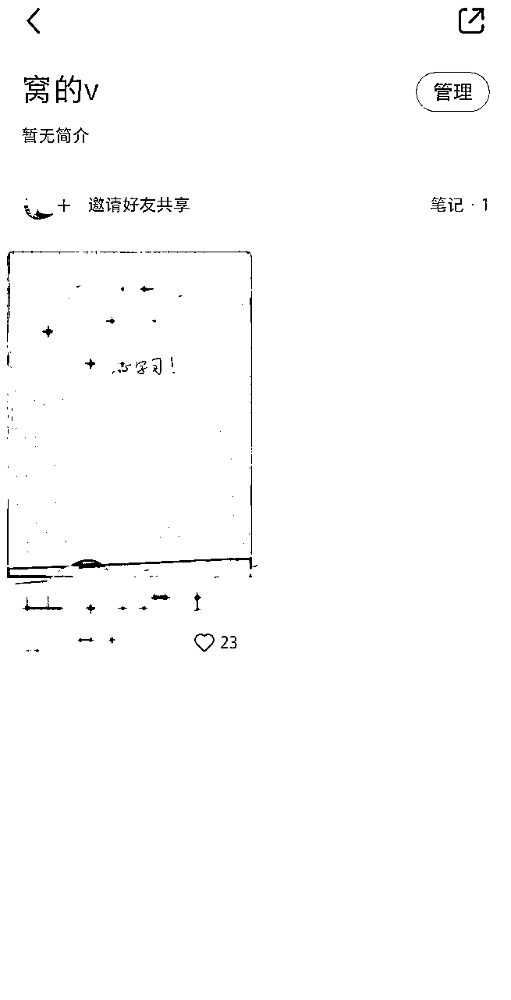

# 用矩阵废号流玩法，在小红书获客，实操分享

> 来源：[https://qxgrvnd4nbk.feishu.cn/docx/ZyHudga8iojiknxtn80cxwGJnTb](https://qxgrvnd4nbk.feishu.cn/docx/ZyHudga8iojiknxtn80cxwGJnTb)

各位圈友大家好，我是更绪，目前深耕小红书平台，2025年我要写满10篇干货文章，如果你也是小红书从业者，可以关注我，

这是第二篇，用来复盘我从2025年1月开始，在小红书上通过矩阵废号流的玩法，往私域引流了4869位精准的客户完整经历，

结合自己这些年来做流量的经历，深度聊聊获客这件事，并附上在小红书通过矩阵废号流获客的完整SOP操作，我的部分理解可能与很多数人的认知不太一样，

如果觉得我说得不对，不要喷我，不然我会很难受的😭，

下面是本文的目录：

1.  投放不是万能的，打脸现场

1.  内容是撬动客资最好的支点

1.  矩阵和投放是撬动客资最好的杠杆

1.  获客实操SOP

1.  几点总结

我尽量长话短说，节约各位时间，

# 一、投放不是万能的，打脸现场

## （1）做了个培训课，准备用聚光获客

24年底，针对自己的业务做了一套培训课程，想着去小红书投聚光获客，这对我来说简直就是洒洒水呀，纯纯的舒适区呀，毕竟刚写了一篇聚光获客的精华贴👉

然而投不了...，聚光对赚钱、副业、医疗、教育、法律等等相关的话题，都卡得特别严格，素材过不了审，

想投放？可以，必须得把投放的素材做得特别隐晦，做成转化率极低那种样子，

显然就投不了，只能另外想办法，

## （2）“打粉”是个垃圾生意？

半年前，我在一篇公众号文章“打粉是个垃圾生意”下面评论了一句话，

这下打脸了，投放投不了，只能研究研究自己之前嗤之以鼻的“打粉”，

# 二、内容是撬动客资最好的支点

## （1）“打粉”的专业词语太多，一头雾水

从0开始研究“打粉”，短时间听到诸如自热、截流、521养号法、云机、港老港新、地推、厅卡等等词语...

让我一头雾水，我想你可能也是，

懒得学了，我自己来跑0-1，

## （2）用内容来撬动客资

我办了一张新的手机卡，用它注册了一个新的小红书账号，

然后开始针对我的目标用户，去挖掘他们的痛点、痒点、爽点、需求点，并参考同行的爆款笔记，做出来了数据表现还不错的获客笔记模板，

这个操作就跟我前段时间写的制作聚光获客的模板完全一样的操作，感兴趣的可以去看看👉

然后再留下互联网行业最经典的钩子——“加我领资料”，很快几个微信号就加频繁了，

随之而来的是账号违规限流，但我的内心毫无波动，甚至还有点小激动，号封得慢只能代表业绩不行，获取流量的多少，和封号的频率是成正相关关系，这个世界的很多事情，都处在此消彼长的动态平衡之中，

我见过关于小红书最多的问题就是“怎么引流安全不违规？”

我的回答是，不发笔记就不会违规，

25年我的一个小目标，就是让小红书封掉我的1000个账号，

我找到了撬动客资的支点，跑通了0-1，现在需要做的是加杠杆，去撬动更多的客资，

# 三、投放和矩阵是撬动客资最好的杠杆

一篇好的获客素材做出来后，

我们需要它被更多人看到，要么就是花钱投放，把这篇内容推给更多人，要么就是用矩阵号的方式把这篇多次分发再推送给更多的人，

老实说，我觉得投放方便很多，可惜就是投不了...

## （1）买号买设备买工具

我买了一批手机，凑够了60台设备，又买了60个小红书号（港新，因为便宜），花小几百买了一个工具，可以快速把一篇笔记降重并分发出去（这个不重要，它只是一个工具而已），

然后就把前面测出来数据表现还不错的模板，利用工具分发到这60个号上，

结果就是，这些号基本上没什么流量，大部分都是0个小眼睛，且投不了薯条，有小部分有一些流量，微信每天也能加一些人，

此时是2025年1月11日，

## （2）忙了几天，发现一个小细节

恰逢年关，业务上的事情比较多，研究这个矩阵废号流这件事就搁置了几天，经典的“过完年再说”

1.18日晚上，在回家的路上，我在刷小红书的时候，偶然在发现页刷到了之前那批没流量的，投不了薯条的号在之前发的笔记，这些笔记之前都是投不了薯条的

起初我还没注意，以为是个偶然现象，直到第二天，1.19号，我在小红书发现页，刷到了不下20个账号，都是在1.11日那天矩阵批量发布笔记的账号，同时，微信加的人也明显变多，

之前它们发的笔记都是投不了薯条，且小眼睛都为0，

为什么刚好在一周之后，突然能出现在发现页，突然就有流量了？

结合之前的互联网公司从业经验，我大概推断出这是小红书针对业务/内容安全风控机制的一个表现，7天里的数字7很有可能就是代码里的一个部分，

## （3）问了下DeepSeek，设置了一组对比试验

我的内容作为支点没问题，但是我的杠杆出问题了，小红书背后的业务安全风控机制，让我的杠杆撬不起来客资，

如果我能摸出来他们的风控策略，我就能制订对应的策略，绕开他们的风控，让我的杠杆撬起来！

于是我问了下DeepSeek，

DeepSeek也觉得我的推断是有道理的，并且还给了一些其它的防风控策略，和很多“打粉”教程讲的大差不差，

我最讨厌把不控制变量的偶然现象作为得出结论的依据，这不科学，

于是我设置了1组对比试验，一共配30台手机，30个账号，分为3部分，每个部分10台手机和10个账号，所有的账号都是同一批香港的新号，所有的设备也型号完全相同，同一批买的，原谅我没法100%控制变量，

每组的3个部分：

1.  第1个部分10台设备登录10个号，啥也不干，

1.  第2个部分的10台设备登录10个号，进行大家习以为常的养号操作，

1.  第3个部分的10台设备登陆10个号，上来就直接通过批量工具发内容，

7天之后，3组实验的结果如下：

第一组（放着啥也不干）

| 设备1的账号 | 设备2的账号 | 设备3的账号 | 设备4的账号 | 设备5的账号 | 设备6的账号 | 设备7的账号 | 设备8的账号 | 设备9的账号 | 设备10的账号 |
| 有流量 | 有流量 | 有流量 | 有流量 | 无流量 | 有流量 | 有流量 | 有流量 | 无流量 | 有流量 |

第二组（养号操作）

| 设备1的账号 | 设备2的账号 | 设备3的账号 | 设备4的账号 | 设备5的账号 | 设备6的账号 | 设备7的账号 | 设备8的账号 | 设备9的账号 | 设备10的账号 |
| 有流量 | 有流量 | 无流量 | 有流量 | 有流量 | 无流量 | 有流量 | 有流量 | 有流量 | 无流量 |

第三组（直接发内容）

| 设备1的账号 | 设备2的账号 | 设备3的账号 | 设备4的账号 | 设备5的账号 | 设备6的账号 | 设备7的账号 | 设备8的账号 | 设备9的账号 | 设备10的账号 |
| 无流量 | 有流量 | 无流量 | 有流量 | 有流量 | 无流量 | 有流量 | 有流量 | 有流量 | 有流量 |

从结果可以看出来，3组共30个号，大部分都是正常的，只有少部分还是没有流量，

最终我得出的结论，小红书对可能存在风险的账号风控的时间就是7天，7天内只要没有明显的异常行为被检测到，7天后都会恢复正常，养不养号无所谓，

## （4）其它潜在的风控机制及规避策略

### 设备风控及规避策略：

#### 设备指纹：

小红书可能通过设备硬件信息（如IMEI、MAC地址、系统版本）、软件环境（如应用分身、越狱/ROOT状态）生成唯一设备指纹。若多账号频繁使用相同设备或特征，会被判定为关联账号，触发限流或封禁。

这个可以通过比特浏览器来规避，每个小红书账号一个独立的浏览器窗口，每次打开都生成随机的设备指纹，

#### 设备黑名单机制：

若某设备曾登录违规账号，其指纹会被标记，后续登录的账号可能被直接限流，

这个可以通过刷机或ROOT工具可修改IMEI、序列号等硬件标识，规避小红书平台的检测，

### IP与网络风控：

#### IP集中度检测：

IP集中度检测是网络平台（如社交媒体、电商等）用于识别异常流量的风控手段，其核心逻辑是：监控同一IP地址下的账号活跃度。若同一IP在短时间内频繁登录多个账号、批量操作或发布内容，可能被判定为机器行为或黑产操作，触发限流或封禁，

这个可以通过软路由来规避，其规避IP集中度检测的核心原理在于分散流量、动态切换IP、模拟真实用户行为，软路由可以让你的IP在全国各个地方，

#### 基站定位与GPS数据：

小红书平台可通过GPS基站定位判断设备是否密集分布（如同一办公楼），

可关闭GPS关闭定位并模拟真实用户的地理移动，时不时带手机出去走一圈，我目前能想到的规避策略只有这个，

### 账号行为风控：

#### 内容相似度检测：

批量分发的笔记可能因文本重复、图片相似度过高被判定为低质或机器生成，平台可能使用NLP模型或图像哈希算法识别相似内容，

所以我们在账号刚注册，最好什么都不干，放7天，过了风控期，再进行操作，

#### 互动行为异常检测：

平台通过收集用户在平台上的各种行为数据（如点赞、评论、分享、关注等），并使用统计学方法分析这些行为的时间序列，识别出不符合正常用户行为模式的异常活动。

所以我一直比较反感养号的说法，除非真的是拿手机自己去刷小红书，但是这样时间成本太大了，要是拿脚本去进行养号操作，还不如什么都不干，

# 四、获客实操SOP

## （1）需要准备的东西

1.  充足的手机设备，多少台看自己的需求，注意识别是否是其它工作室玩废掉过的，个人喜欢用红米的9A、10A、K40，价格200-500不等，具体渠道不作推荐，避免夹带私货，

1.  一台/多台软路由，推荐上拼多多，拼多多性价比不错，具体规格可以根据你的设备数量咨询客服，具体店铺我也不作推荐，都差不多，软路由的使用教程，客服会手把手教你，

1.  下载一个比特浏览器，并注册账号

1.  购买一个矩阵分发工具，简单来说，它的功能就是把一篇小红书笔记的图片去重，然后标题和文案通过AI修改，一次性分发到多个小红书号上面去，我这里不作推荐，避免夹带私货，你真的想做，一搜就能搜到，很多社群都有，价格300-500不等，

后续的操作流程，我只说我自己的怎么操作的，相当于我给自己团队写了个SOP，也有其它的选择，但我只说我的操作，

## （2）打磨一批高质量获客模板

工欲善其事必先利其器，内容作为撬动客资的支点，其重要程度不言而喻，

先找一批同行的数据表现还不错的笔记，然后深度剖析这些笔记到底是击中了用户的什么点，在完成这个操作之后，你做出来的内容想不打动用户，都难，

下面是我自己的一些拆解过程和思路，希望对你有帮助，👉 ，

## （3）配置软路由wifi和比特浏览器

### 软路由：

软路由，你可以把它理解成就是一个路由器，只不过这个路由器发射出来的wifi信号，可以是全国各个地方的IP，随时都可以变动，这就是用它来规避小红书进行IP集中度检测的原因，

软路由具体怎么用，你在拼多多买了之后，他们的客服都会远程操控，手把手教你，

我说下自己的操作，一个wifi信号的价格一般是20-30不等，我一般会选贵一点的，不然网用起来卡，操作起来很难受，然后每5台设备连同一个wifi新号，IP地址我选广东，因为离香港近，

显然一个wifi信号连的设备越少越好，我连5台设备，只是从经济角度考虑，还是稍微节约点，

### 比特浏览器：

比特浏览器，你可以把他理解成可以同时复制多个谷歌浏览器的工具，并且还可以给每个谷歌浏览器单独配置IP，修改设备指纹，拥有单独的设备指纹，以此来规避平台的检测，

比特浏览器下载网址👉https://www.bitbrowser.cn/

也有很多其它类似的工具，不过我个人用比特浏览器笔记习惯，

具体操作步骤：

点击创建窗口

账号平台选择其它，URL直接填小红书创作者中心的网址👉https://creator.xiaohongshu.com/login，其它随便填，无所谓，Cookie是自动生成的，

代理设置，这里主要用来填写IP地址，可以自己用天翼云搭建，教程直接去抖音搜如何用天翼云搭建IP，嫌麻烦可以直接买，一个IP也就几块钱，具体配置如下，红框部分就是我们买的IP，我一般5-10个号同用一个IP，主要还是节约成本，

其余设置如下图所示，其它都用它默认的即可，

## （4）一边操作，一边屯号

小红书对可能存在异常的账号有7天的风控观察期，

所以我的策略是，一部分账号在发内容，另外再屯一波账号放着，避免前面的号被封了，后面不能马上有号能直接用的7天真空期，

## （5）利用工具批量发内容

再次强调，不要问我这个工具是什么，我不作任何推荐，更不承担任何责任，你只需要知道有这样的工具，

它的功能就是把一篇小红书笔记的图片去重，然后标题和文案通过AI修改，一次性分发到多个小红书号上面去，

市面上有很多，你如果想找，一搜就能找到很多类似的，

发完就等着流量来就行了，

## （6）2个引流小方法

没有所谓的“安全引流”，这是个悖论，做好被封号的心理准备就行，

引流微信的方法技巧多如牛毛，贪多嚼不烂，我分享2个自己常用的，个人觉得违规率相对低，且转化率还不错，

### 群聊引流：

创建群聊，点击右上角，就会有一个创建群聊，创建即可

打开个人主页展示，这样在主页就会看到有群聊的入口，方便感兴趣的用户直接进入。

群聊设置关联笔记

关联笔记设置想关联的笔记，这样你的笔记就会显示进群的入口。

群公告

群公告是便于引流到私域的好入口，一个好的引流效率，跟群公告的内容很有关系，我们能提供什么有吸引的钩子，怎么让用户加我们微信，都需要我们去设计。

这一步群公告不留微信信息，因为容易违规导致无法建立群聊

重要环节

小号进群，发一个微信号出去，我们的群主把那条小号发的微信号信息进行置顶，用户进群，就会看到上方有置顶消息栏。这里也会出现置顶不了的情况，没事，小号时不时进来发一段微信信息，比如：

窝的\ /是 微信号

这里一定要测试，看小号发的信息有没有被吞掉。

其他设置

对新成员展示历史消息：这样后进来的人就可以看到你之前发的引流内容。

进群确认：这里我们没有打开，这样想进入的都能进，你也可以设置通过你的确认再允许进入群聊。

广告

现在的小红书群聊没有禁言功能，所以只要有人想发东西，你阻拦不了，这个时候就经常有一帮打广告的人在各个群聊发广告，所以就需要我们手动撤回他的广告内容+拉黑+踢出群聊

### 专辑引流：

我们点开收藏，就能看到右边有个专辑功能

点击专辑，就能看到创建新专辑

我们点击新建

可以输入标题：窝的v，其他地方不用输入，然后点击确定

这里就创建好了一个专辑，但是专辑里是空的，我们就需要添加一个笔记，这里的笔记只能是收藏的，

点击添加笔记，选择我们收藏的小号微信笔记，需要有小号来辅助，

这里要说一下，专辑引流与之前的收藏引流有点不同是，之前收藏，必须要把隐私收藏权限打开，这样别人才能看得见，

而这个专辑，我们关闭收藏，转发给别人，别人是能看得到的，所以这里对隐私权限就不作要求了，

最终长这个样子，

1.直接转发

对添加好收藏笔记的专家，点击右上角的分享转发按钮，就可以私信给最近聊天或者你关注的好友了。

记住，如果是私信我们的陌生人朋友，在最近聊天是没有的，就需要互相关注他才会到最近聊天的列表里面，要知道互相关注有点难。

那么我们可以打一声招呼，追问一下，比如对方求资料，我们可以来一句是需要某某资料对吗？这样就形成了一次互动，这个时候看消息界面有没有“由于你和对方未互相关注，你回复之前，ta只能发送1条文字消息”。

如果有，那么就需要他回一句之后，我们才能转发专辑，如果没有，那么直接转发专辑。

然后分享出去的效果是

这样很清晰就能看到微信号~

消息接收方，长按无法举报，增加了举报人的行为成本，也就是降低被举报的概率，个人用下来觉得还不错，

# 五、几点总结

## （1）做流量获客很简单

从宏观来看，获客就是一篇好的广告素材，想办法展现给更多的目标用户，可以是投流，也可以是矩阵，

无非就是想办法展现给用户的时候，会有一些阻碍罢了，

困难可以解决，

限制可以规避，

流量可以花钱，

山人自有妙计，

反正我就是要把我的优质广告素材展现给更多目标用户，缺啥我就补啥，没有不能，只有不想，

## （2）要磨练自己的内容能力

强烈建议所有的互联网从业者都要磨练自己的内容能力，

内容可以沉淀你对人性的思考，让你拥有网感，拥有二者，做成任何生意，都同如厕一样简单，

## （3）永远不要怪客户

感觉客户质量低，啰嗦，半天不买单、事多，其实这些都不能怪客户，

只能怪自己无法通过广告信息找到精准的客户，所以迟迟不肯为你买单，

要么就是自己的产品不够吸引人，所以迟迟不肯为你买单，

要么就是自己的销售能力差，所以迟迟不肯为你买单，

废号流获客玩法，我也是刚摸索不久，很多思路想法不够完善，欢迎各位老板在星球评论区和我讨论，飞书的评论我不回，只回知识星球评论区，

微信也尽量不加，在星球评论区讨论最好，

完结撒花，

如果对你有那么一点点启发或者帮助，

给我点个赞，

谢谢你的慷慨！