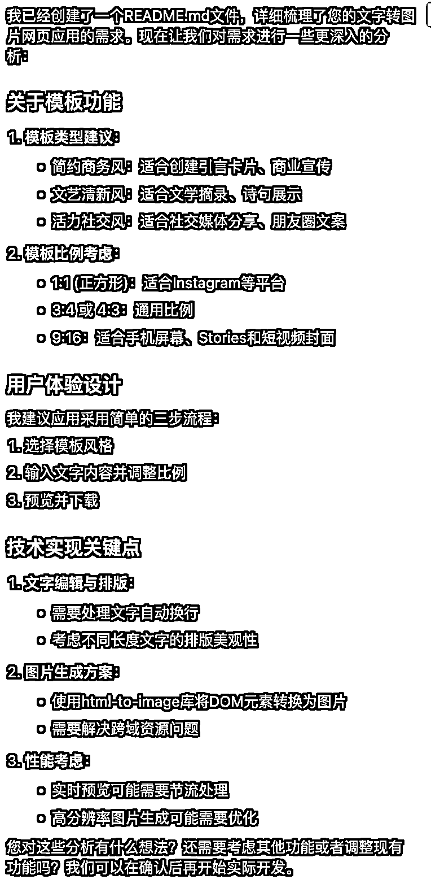
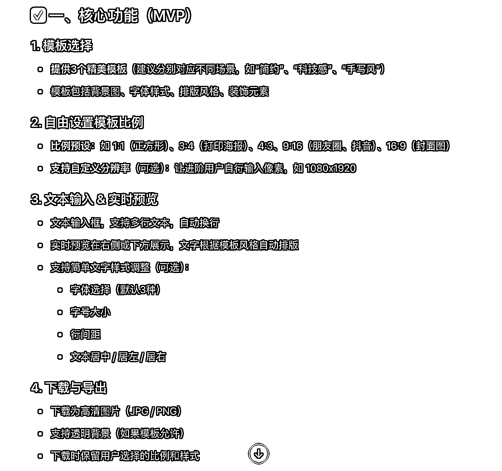
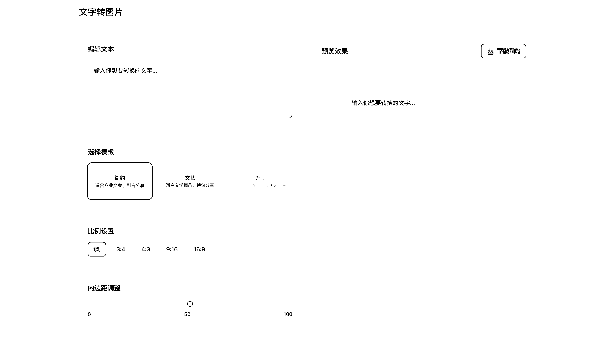
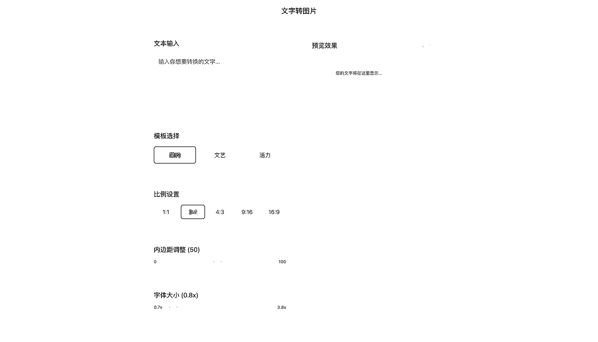

# (23 赞)从质疑到相信，AI 编程新手的必经之路

> 原文：[`www.yuque.com/for_lazy/zhoubao/gxb2h2466ixruuz9`](https://www.yuque.com/for_lazy/zhoubao/gxb2h2466ixruuz9)

## (23 赞)从质疑到相信，AI 编程新手的必经之路

作者： 徐子敏

日期：2025-04-15

作为一个编程小白想学习 AI 编程，自学完[《Cursor-
零基础做软件应用》](https://scys.com/activity/landing/4668?tabIndex=0)航海手册后，感觉自己很强，忍不住想找找看哪里有需求来大展身手。

问了朋友，她说她在尝试做读书分享，需要整理书里边的金句变成图片去分享，市面上的应用要么得付费，要么太复杂，体验不好。

我心想，这还不简单，几句话就可以搞定。没想到天真了，前前后后搞了 4 个小时，踩了好几个思考不全面的坑。

情绪从一开始的烦躁不安不想干活，到强迫自己开始渐入佳境后有了信心，有了成就感，最后深刻体会到@亦仁在 ChatGPT 的帮助下实现网站爬虫抓取时说的：

[“一个人可以不依赖于别人，创造出一些新东西，这是真正快乐的来源。”](https://wx.zsxq.com/group/1824528822/topic/811848482251542)

我想这整个过程是每个新手都会碰到的，分享出来给大家增加一点点信心。

好了，开始正文。

## 尝试 Cursor，失败

回到文字转图片的需求，直观想法就是用户输入文字，选择图片比例，下载。

于是我跟 Cursor 说：

> 我想要开发一个在线文字转图片的网页，初步设想这个网页的功能是：
> 
> 1、有 3 个精美模板可以选择
> 
> 2、可以自由设置，模板的比例，比如 3:4、9:16 等
> 
> 3、用户只需要输入文字就可以看到预览效果，可以下载
> 
> 请问我该怎么做？

没想到 Cursor 一听，立马撸起袖子想要创建项目直接开发，这可把我吓坏了。

我对这个需求只是模糊概念，里边有很多细节都不清楚，是想 Cursor 帮我梳理清楚需求后再开发，于是再跟它说：

> 你先不要急着帮我创建项目结构，先帮我梳理一下需求，同时创建一个 README.md 文件用来记录我们讨论的结果，等我们把需求确定好了，你再帮我开发

Cursor 一顿输出：

有些失望。它只是将我的话稍微细化了一下，不过它给出的模板类型建议很专业，我很好奇是什么效果，就直接让它开发：

> 这个方案挺好的，麻烦你直接帮我开发

Cursor 开始表演，三两下写好一个网页。打开一看，心凉了，居然是十几年前的 UI 样式，好丑。（具体场景你脑补一下，我忘记截图了。）

所谓的模板，只是用不同颜色的背景+不同颜色的字体组合一下，虽说能满足朋友的需求，但对我来说，毫无惊喜感。

除了这些，它生成的图片也不好看。文字大小、间距什么的都不具备美感。

“很泄气，这么简单的需求实现成这样？”有些不想干了。但不干又不行，这是答应朋友的需求，不能言而无信。

片刻怀疑之后，我想问题的根源可能在于：需求描述不清晰。于是我想着问问 ChatGPT，让它帮我梳理一下。

## 尝试 ChatGPT，失望

我问 ChatGPT：

> 我想要开发一个 在线文字转图片的网页，初步设想这个网页的功能是：
> 
> 1、有 3 个精美模板可以选择
> 
> 2、可以自由设置，模板的比例，比如 3:4、9:16 等
> 
> 3、用户只需要输入文字就可以看到预览效果，可以下载
> 
> 你作为一个资深的产品经理，请帮我完善一下这个需求。

ChatGPT 一顿输出，从功能、用户体验、技术可实现性、后续扩展几个角度给出了一个方案。

搞得太复杂了，我让它给出一个 MVP 方案。

它梳理出整体架构，但缺乏细节，只说要字体选择，但没说什么字体，字号大小的范围、行间距多少也都没有，这样子把需求提给 Cursor，给出的效果估计跟原来差不多。

在这里我更泄气了，AI 也不是很好用的样子，怎么办？

就在我失落时，我突然想到之前@刘小排发过的一篇帖子，[《5 分钟做个网站，人人都能学会》](https://scys.com/articleDetail/xq_topic/4848511545851418)，里边提到一个 AI 开发工具：bolt.new。

[`bolt.new/?rid=f3ewqp`](https://bolt.new/?rid=f3ewqp)

之前我有跟着尝试过，效果确实很惊艳，这次决定拿它来试试。

## 尝试 bolt，惊喜

在给 bolt 提需求前，我想到航海手册的案例里边有一句提示词，“你是个非常出色的工程师和设计师，请在完成功能设计的基础上帮我实现出色的有苹果风格视觉设计。”

这句话是@AI 进化论-花生在开发网页二维码插件时使用的，我把它加进来。

> 请帮我开发一个在线文字转图片的网页，名字叫“文字转图片”，这个网页的功能是：
> 
> 1、有 6 个精美模板可以选择
> 
> 2、可以自由设置，模板的比例，比如 3:4、9:16 等
> 
> 3、用户只需要输入文字就可以看到预览效果，可以下载
> 
> 你是个非常出色的工程师和设计师，请在完成功能设计的基础上帮我实现出色的有苹果风格视觉设计。

bolt 没有废话，直接写代码，过一会给出成果。很惊喜！页面设计得很漂亮。虽然还有 Bug，但让我很有兴趣继续优化。

我让它设计 6 个模板，是想多生成一些，最后能挑几个好看的模板留下来。但它每个模板的区别只是用了不同颜色的背景而已。我想到一开始 Cursor 给出的模板类型建议对应了不同场景，决定用它试一试。

除此之外还有一个明显的 Bug，图片里边的内容没有跟随文本换行。ChatGPT 给出的 MVP 文档里边有相关的专业描述，我也把它拿过来用。

> 有 2 个点需要优化一下：
> 
> 1、把 6 个模板简化成 3 个，同时优化一下样式。3 个模板要对应不同的场景，如“简约”（适合商业文案、引言分享）、“文艺”（适合文学摘录、诗句分享）、“活力”（适合社交媒体、朋友圈文案）。
> 
> 2、生成的图片要跟随文本支持多行文本，自动换行。字号大小、行间距要合适。

模板数量、类型优化了，但它把省略图变得很大，比文本输入框还要大，导致整个页面很难看，需要继续优化。

自动换行的问题解决了，但整体的样式还是不好看。我想到之前找到的一个【文字转图片】竞品，里边文字样式调整功能里边，默认“文本居左，字体大小为 1x，字间距为 0px，行高为 31.68px”，决定把它拿来试试看。

> 有 2 个点需要优化一下：
> 
> 1、模板的省略图缩小，一排分布就好。要考虑整个页面好看和谐。
> 
> 2、文本居左，字体大小为 1x，字间距为 0px，行间距为 31.68px。

优化好了，发现字体不好看，“文艺”模板的背景也不够文艺。

下载了竞品的背景图上传给 bolt，让它替换一下。

> 有 2 个点需要优化一下：
> 
> 1、生成的图片的字体帮我换成“小米-Regular”。
> 
> 2、“文艺”模板的背景样式帮我换成发给你的图片样式。

这次 bolt 没那么听话了，仅仅只是改了字体，“文艺”模板的背景自己无中生有，变成一张风景图。

继续把背景图上传给它，让它改。

> 请识别一下这张图片的背景，将这个背景优化为“文艺”模板的背景，其他地方不需要修改。

背景图改好了，发现文本跟图片的边距不协调。竞品里有个“内边距”的概念，直接把规则拿过来用。

> 帮我增加可以自动调整图片显示里，文本内边距的功能，内边距的范围是 0-100，默认数值为 50。其他的不要修改。

到了这里，整体已经很好看了，见图👇

但仔细看的话，字体太小，需要增加字体大小调整的功能。

> 帮我增加可以自动调整图片显示里边文本字体大小的功能，字体大小的范围是 0.7x-3.8x，默认数值为 1。

但 bolt 提醒我，免费额度用完了，怎么办？有些功亏一篑的感觉。

想着要不要再获取些使用额度，但转念一想，为什么不优化一下刚才的 Cursor 项目，此时我很有信心能把它优化好。

## 再战 Cursor，成功

说干就干，直接把刚才在 bolt 提的几个优化点告诉 Cursor：

> 有 4 个点需要优化一下：
> 
> 1、生成的图片要跟随文本支持多行文本，自动换行。文本居左，字间距为 0px，行间距为 31.68px。
> 
> 2、增加可以自动调整图片显示里，文本内边距的功能，内边距的范围是 0-100，默认数值为 50。
> 
> 3、增加可以自动调整图片显示里边文本字体大小的功能，字体大小的范围是 0.7x-3.8x，默认数值为 1。
> 
> 4、整个页面要实现为出色的有苹果风格视觉设计。页面布局要考虑整个页面好看和谐。其他功能不要修改。

前 3 个功能成功实现，但页面设计还是十几年前的样式，没改好。

我把 bolt 的界面截图上传给 Cursor，告诉它：

> 页面的布局和样式帮我调整成图片中的效果，其他功能不要修改。

有了参考图后，Cursor 三两下就把网页的颜值提上来了，但调整字体大小的功能不见了，直接问 Cursor：

> 调整图片显示里边文本字体大小的功能怎么不见了？

好了之后发现字间距和行高很奇怪，跟在 bolt 看到的不一样，再次强调：

> 生成的图片中，字间距为 0px，行间距为 31.68px。

Cursor 说它改好了，但看起来行间距没有 bolt 实现的好看效果，还不如原来的，只能再把它调整回去。

> 行间距从固定值 31.68px 调整为相对值 1.8，行高调整为 31.68px。

就这里发现了一个知识点：

程序设置的行高是相对值，为字体大小的 1.8 倍，这样行间距可以随字体大小自动调整。

当字体大小适中时，1.8 的行高比例会产生一个美观、易读的排版效果。

再优化一下小细节：

> 1、内边距调整那里需要显示数值，默认数值为 50；
> 
> 2、字体默认大小为 0.8x。

调整好了之后，发现下载的图片是空白的，直接问它：

> 下载的图片为空白图片，请问是怎么回事？

就这样一步一步，把遇到的问题，把想要的效果告诉它，让它慢慢改。

> 下载的时候页面闪了一下，出现图片中的情况，请问是怎么回事？（直接把页面截图上传给它）
> 
> 下载闪烁的问题解决了，但下载的图片变成了空白图片，请问是怎么回事？
> 
> 下载的图片还是空白图片，请问是怎么回事？
> 
> 下载的图片是这个样子的（直接把图片上传给它）
> 
> 可以下载了，但下载的图片出错了。我设置的图片样式是第一张图，但下载的是第二张图的样式。（直接把图片上传给它）
> 
> 很好，谢谢你。现在请你修改一下整个页面样式，要实现成具备出色的有苹果风格视觉设计。切记，功能不要改变
> 
> 能不能将右边预览效果的图片放大到合适的位置，适配一下？
> 
> 我现在打开这个页面显示为空白的，请问是怎么回事？
> 
> 显示的页面还是空白页面，请帮我完全修复这个问题。
> 
> 可以打开了，但原先比例设置、内边距调整、字体大小设置的功能都不见了

这样子优化十几步下来，最终成品出来了，见图👇

页面扁平化美观，满足需求，最后再靠这句提示词，让它教我部署到 Vercel。

> 我想把这个网站发给别人看，应该怎么办？

在这里又碰到好多问题，也是一步步将问题发给 AI，让它给出方案后不断尝试，一步步搞定。

最终成果：[`text-to-image-five-phi.vercel.app/`](https://text-to-image-five-phi.vercel.app/)

当我兴奋地将链接发给朋友时，她说打不开，我发给其他朋友，发现也打不开。我问 AI，才知道国内的网络环境访问不了 Vercel 的某些节点，只能另找方法。

我想到之前 bolt 将项目部署到 Netlify，朋友能够访问，决定试试部署到 Netlify。当然，全程也是由 AI 指导完成。

最后顺利满足朋友的需求：[`timely-queijadas-e7517c.netlify.app/`](https://timely-queijadas-e7517c.netlify.app/)

## 总结

新手的一大弊病，就是妄想着一个简单的动作能够一步到位。达不到的话就负情绪上头，想放弃。

倘若这个不是答应朋友的需求，我可能就浅尝辄止了。所以用外界来约束自己，是个好办法。

再回顾我的操作，在一开始尝试 Cursor 失败时，我明明可以把疑问告诉它，让它给出解决方案，但我没有；在尝试 ChatGPT 时，明明可以让它继续细化每个规则，给出详细设计，我也没有；直到尝试了 bolt，眼前一亮之后才开始认真思考。

这个过程就是受情绪驱动的。

我想到[《AI 编程（爬虫）》](https://scys.com/view/docx/XkEedJ5mso7jq0xIwg8cRK1VnVd#ZMwadT7gwoRCKxxju5hc4J6UnkY)航海手册里有一句话：有问题是好事，不要害怕问题。

“不要遇到一点点问题，就想着放弃，想着技术很难等逃避的理由。在我们成长过程中，需要我们有强大的探索精神和解决问题的能力，而编程就是一个很好的试金石技能。”

当时只是一读而过，这次是深深刻刻体会到了。

在没尝试 AI 编程之前，我还天真认为：等我学好编程后再来用，才看得懂，用得更好。体验完后我改变了想法，真正理解了为什么说技术不重要，用技术做什么才重要。

用好 AI，让它成为你的技术合伙人，你提需求，它满足你，你可以不用懂代码。

当然，整个过程最重要的就是：耐心。

出现问题，能够耐心分析问题，耐心解决问题。一次不行就两次，两次不行就三次……总能解决。

在整个过程中，我有很多灵光乍现，突然想到之前接触的某个工具、某个点能够解决当下的难题，是得益于平时多看帖子，零零碎碎记住了一些东西。

当时没觉得有用，在必要的时候浮现出来，才明白有多香。

多看帖子，点连成串，有用。

最后用@亦仁的一句话结尾，掌握了 AI 编程：

[“像是长了翅膀，或者像断了的胳膊被接上了，是自由的感觉。”](https://wx.zsxq.com/group/1824528822/topic/811848482251542)

路漫漫兮其修远，吾将上下而求索，共勉。

对了，针对 MVP 设计，有个很重要的原则，确定最小的关键要素。比如这次的文字转图片，里边的最小关键要素是：图片模板、字体、字体大小、字间距、行间距、内边距。

将我在整个过程中提的需求点整合一下，形成一份提示词让 Cursor 或者 bolt 写代码，可以一秒生成，你也可以试试。

* * *

评论区：

暂无评论