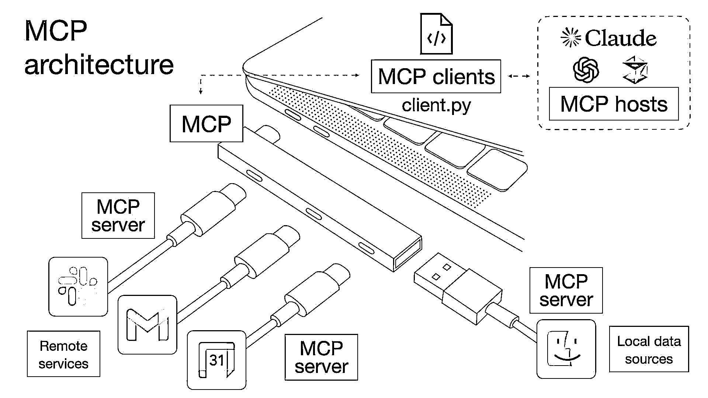
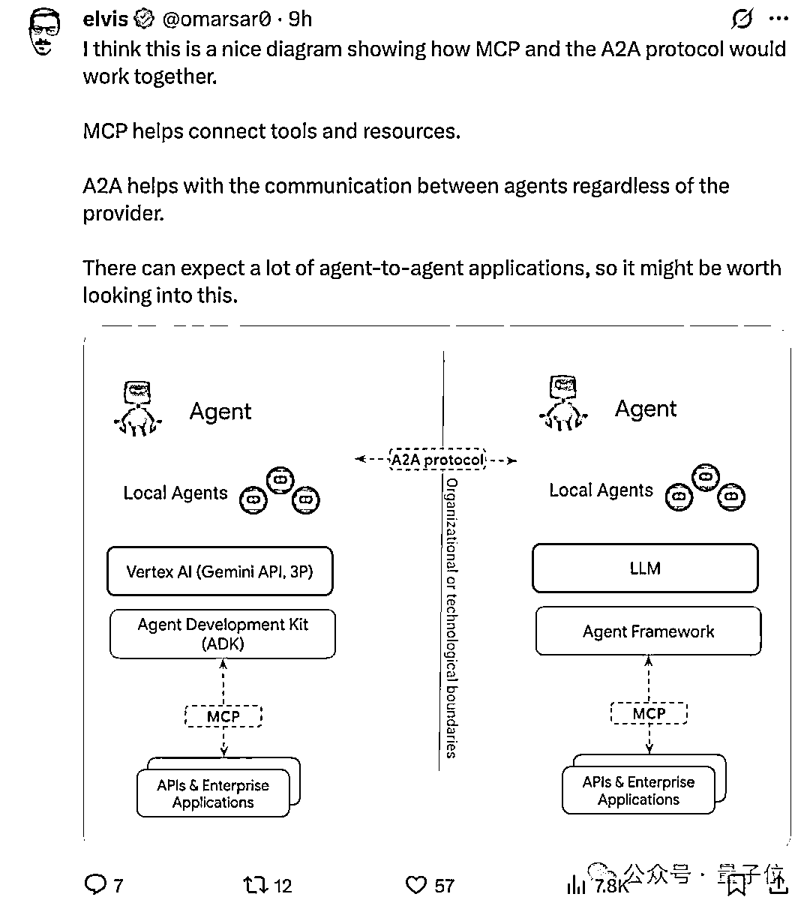
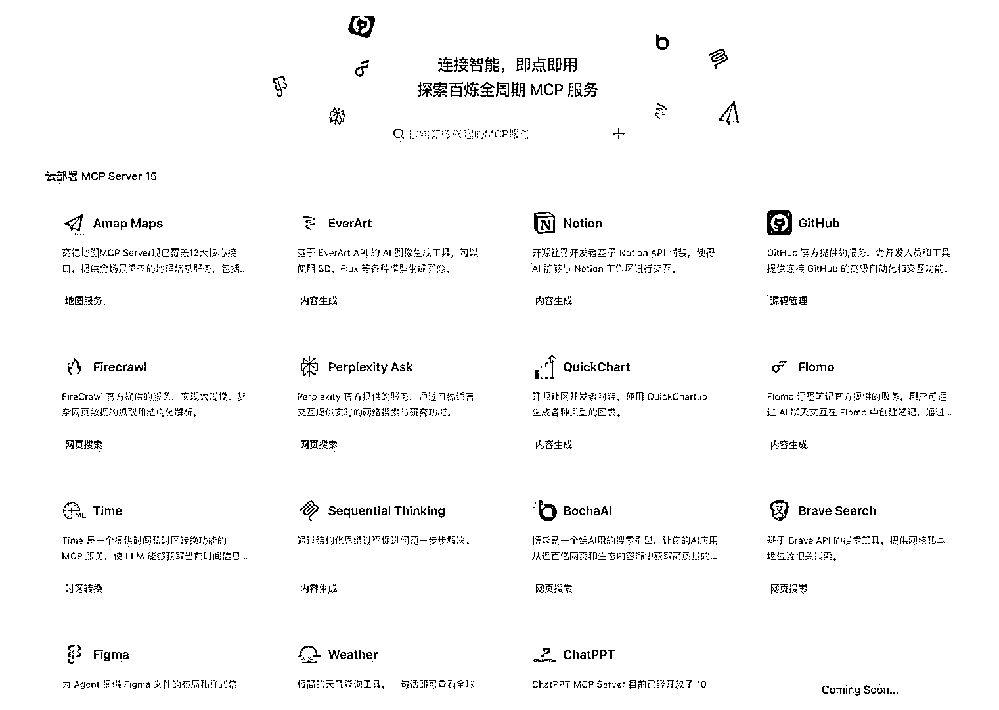
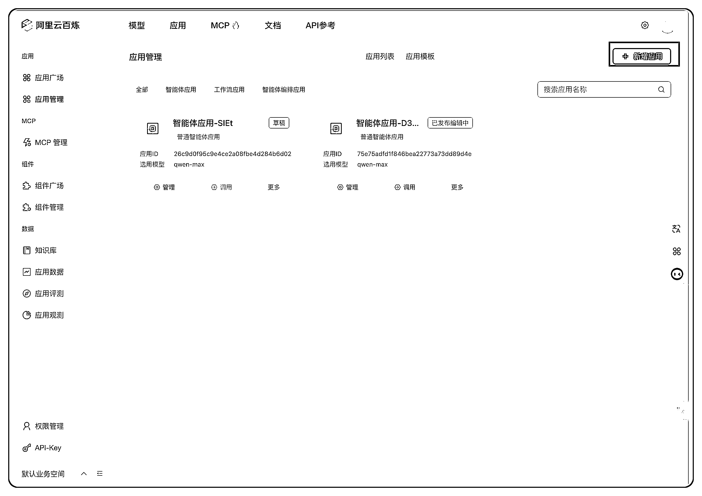
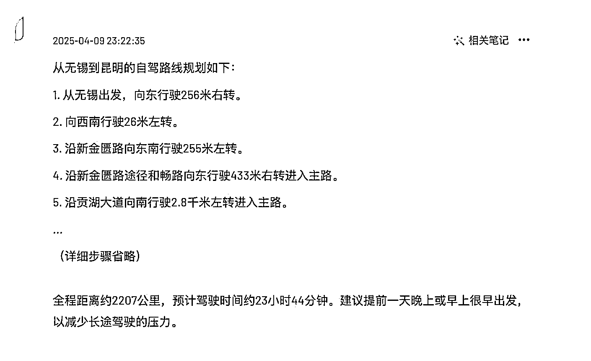

# (18 赞)终于有人把 MCP 和 A2A 讲明白了！小白也能看懂的硬核科普！

> 原文：[`www.yuque.com/for_lazy/zhoubao/qtpfc2raggahxmwp`](https://www.yuque.com/for_lazy/zhoubao/qtpfc2raggahxmwp)

## (18 赞)终于有人把 MCP 和 A2A 讲明白了！小白也能看懂的硬核科普！

作者： sky 陈天

日期：2025-04-16

各位生财圈友大家好，我是 sky 陈天，一名 AI 企业培训讲师、企业 AI 业务提效顾问。

最近圈子里有两个词特别火：**MCP** 和谷歌提到的 **A2A 协议** 。

听起来是不是有点“高大上”？别担心，今天我就用大白话，结合我自己的体验，跟大家聊聊这俩到底是啥，以及为啥我觉得它们可能预示着 **AI
智能体（Agent）真正“落地”的大时代，真的要来了！**

### 一、给 AI 装上“万能插座”与“通用语”：MCP 和谷歌 A2A 是干啥的？

咱们先说说 **MCP (Model Context Protocol ）**

你可以把它想象成一个**“通用语言”或者“标准接口”** ，主要用来解决 **“一个 AI 智能体如何更好地调用外部工具和获取信息”** 的问题。就像我们给各种电器用的 **USB 接口** 一样，有了它，AI 想用个计算器、查个地图、或者连个数据库，就能更顺畅、更标准化。

1.  **目标：** 让单个 AI 调用各种“工具”更方便、更规范。

2.  **解决啥问题：** AI 智能体与外部工具/数据源之间的“沟通障碍”。

在 MCP 让 AI 更会“用工具”的同时，谷歌这边则更进了一步，提出了一个叫 **A2A (Agent-to-Agent) 协议** 的东西，而且这还是个**开放标准** ！

**A2A 协议的核心目标，是解决 AI 智能体 之间 _ 的互操作性问题。** 啥意思呢？就是让**来自不同公司、用不同技术框架开发的 AI
智能体，也能互相“理解”、“对话”和“协作”，打破彼此之间的“系统孤岛”！**

想象一下，未来你可能有一个专门帮你写邮件的 AI，一个专门帮你分析数据的 AI，还有一个专门帮你做设计的 AI。

它们可能来自不同的开发商。**A2A 协议，就像是给这些来自五湖四海的 AI 智能体们，制定了一套通用的“协作规范”和“沟通语言”** ，让它们能：

1.  **互相“认识”（能力发现）：** 通过像“Agent Card”这样的电子名片（用 JSON 格式描述），了解对方擅长什么、怎么联系。

2.  **分配和管理任务：** 支持完整的任务创建、状态跟踪和结果交付流程，就像团队成员之间分配工作一样。

3.  **顺畅沟通协作：** 可以动态地用多种方式（文字、图片等）交流，而且不需要共享底层的代码或资源。

4.  **高效对接：** 能协商好用什么格式传递信息，确保合作顺畅。

**所以，关键点来了：**

**A2A 协议并不是要取代 MCP，它们俩是好搭档，是互补关系！**

1.  **MCP 更侧重于解决单个 AI 智能体 如何使用工具和获取外部信息 _ 的问题 (Agent** **↔️** **Tool/Data)。**

2.  **A2A 则专注于解决 不同 AI 智能体之间如何有效协作 _ 的问题 (Agent** **↔️** **Agent)。**

**一个是让 AI 自己“兵器”使得更顺手，一个是让不同的 AI 组成“军队”能协同作战。**

谷歌推动 A2A 成为一个**开放、社区驱动的标准** ，目标很宏大：就是要构建一个开放的智能体协作生态系统，让所有玩家都能参与进来，共同推动 AI
协作能力的进步。

**总而言之，MCP 和 A2A 这对“组合拳”，都在致力于同一个方向：**

**让 AI 不再仅仅是一个“能说会道”的聊天机器人（Chatbot），而是变成一个真正能“动手干活儿”、能调用各种工具、并且能与其他 AI
高效协同作战的智能体（Agent）！**

**从“动口”到“动手”，再到“团队协作”，这是质的飞跃！**

### 二、实测阿里百炼 MCP：智能体落地，真的近了！

光说不练假把式。所以，**我第一时间我就去测试了一下阿里百炼的 MCP 平台。**

百炼：[`bailian.console.aliyun.com/?tab=app#/app-center`](https://bailian.console.aliyun.com/?tab=app#/app-center)

什么感受呢？**就是感觉智能体落地又前进一大步了啊！**

**“会调用工具的 AI 比只能聊天的 chatbot 强 10 倍。”**

我让它帮我做一个**云南旅游攻略** 。这可不是简单聊几句，它需要：

1.  **理解我的需求：** 我想去云南玩，需要行程建议、景点信息等。

2.  **调用工具 - 地图服务：** 它自动连接了**高德地图** ，获取了真实的地点信息、路线规划等数据。

3.  **调用工具 - 笔记应用：** 生成攻略后，它还能根据我的指令，把结果自动**存到我的 Flomo 笔记** 里。

**全程都是 AI 帮我干的！** 我只需要下达最初的指令，然后看着它一步步规划、调用工具、整合信息、最终输出结果并保存。

当然这个输出最终有点省略和敷衍...

这个体验，跟我去年关注 Claude 的 MCP
概念时相比，感觉完全不一样了。那时候还只是个“想法”，还有很多需要开发配置的东西，**今天阿里直接做了一个平台出来，就算你不懂技术也可以调用各种工具，让这个过程变得触手可及。**

现在，请大家想象一下：

1.  如果 AI 调用的不是高德地图，而是你公司的 **CRM 系统** ，帮你自动更新客户信息、生成销售报告呢？

2.  如果 AI 调用的不是 Flomo，而是 **PPT 或 Excel** ，根据你的数据或想法，自动生成演示文稿或数据分析图表呢？

3.  如果 AI 能连接你常用的**各种办公软件、行业软件、甚至是实体设备** 呢？

**这个想象空间，太大了！** 这意味着 AI 将能深入到我们工作流的方方面面，真正成为我们提效的“超级助理”。

### 三、未来已来：2025，AI 智能体落地元年？

结合 MCP 的标准化、各大平台（像阿里、谷歌等）的发力、以及 AI 模型本身能力的不断提升，

**“2025 真的是 AI 智能体落地元年啊！”**

这里的“落地”，不是指实验室里的概念，而是指**真正能在我们的工作和生活中广泛应用、产生实际价值的 AI 智能体。**

未来会怎样？我大胆预测几点：

1.  **个性化超级助理普及：** 每个人都可能拥有一个或多个 AI 智能体，帮你处理邮件、安排日程、预订差旅、管理知识、甚至控制智能家居。

2.  **企业工作流深度自动化：** 大量重复性、流程化的工作将被 AI 智能体接管，人类员工将更专注于创造性、决策性的任务。

3.  **新应用形态涌现：** 会出现更多基于多智能体协作的新型应用和服务，解决更复杂的问题。

当然，罗马不是一天建成的。技术的普及还需要时间，也会遇到各种挑战。但**方向已经非常明确了：AI 正朝着更实用、更能干、更懂协作的方向狂奔。**

对于我们普通人来说，保持关注，理解这些趋势，尝试把这些新能力融入自己的工作流，或许就是抓住这波技术红利最好的方式。

* * *

评论区：

暂无评论