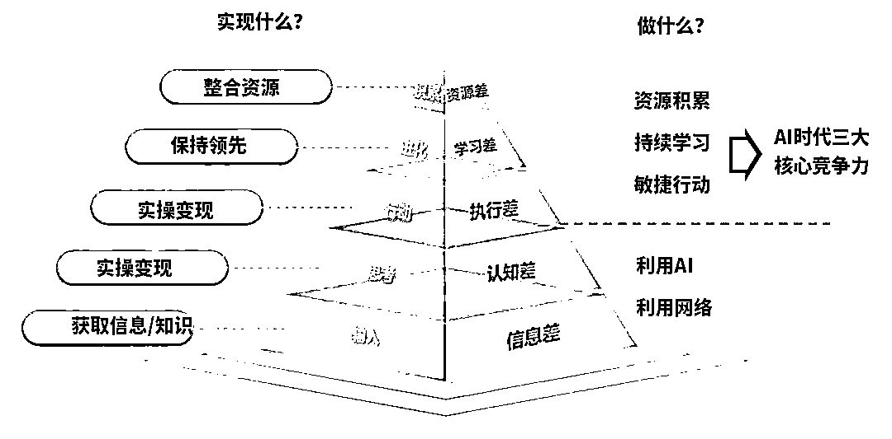

# (15 赞)AI 小白到 AI 畅销书作者的逆袭之路，你也可以做到

> 原文：[`www.yuque.com/for_lazy/zhoubao/ozkbqf1ri9k86a6h`](https://www.yuque.com/for_lazy/zhoubao/ozkbqf1ri9k86a6h)

## (15 赞)AI 小白到 AI 畅销书作者的逆袭之路，你也可以做到

作者： 来来

日期：2025-04-16

来来想和各位新加入生财有术的圈友说，虽然来来现在有着光鲜亮丽的履历和成绩，但是我和很多人一样，并不是一开始就走在 AI 这条前途无量的道路上，作为一个师范专业专科毕业的大专生，人生并非坦途，而是经历过一路的披荆斩棘，一路的打怪升级，在不断试错中找到方向。在这一路的人生迭代升级过程中，生财有术扮演了人生导师的角色，在我焦虑和迷茫的时候，一次次把我从泥潭中拖出来，进入正轨。曾经做了 10 年老师的来来，很愿意把生财有术陪伴我成长的过程与你分享，**希望你能通过生财有术的陪伴，找准自己的人生方向，拒绝焦虑，做好自己，找到适合自己的生财之路。请相信你自己，来来在 23 年加入生财有术之前，也是没有任何 AI 经验的小白，最终也能通过生财有术逆袭成为 AI 畅销书作者，那么请相信自己，你也可以做到。****来来将用亲身经历，详细告知生财有术新人，怎么打破下面的 5 大差距？**

# 文章目录：

1. 新手怎么通过风向标快速消除 AI 领域信息差？ 2. 新手怎么通过生财小组快速构建 AI 领域认知差？

3. 新手怎么通过精华帖快速抹平 AI 领域执行差？

4. 新手怎么通过航海实战快速建立 AI 领域学习差？

5. 新手怎么通过线下聚会/航海家快速建立 AI 领域资源差？

# 飞书链接

[`aigcstudy.feishu.cn/wiki/VwhrwoBa3iv3OYkHHNMcSf0enuf`](https://aigcstudy.feishu.cn/wiki/VwhrwoBa3iv3OYkHHNMcSf0enuf?from=from_copylink)

* * *

评论区：

暂无评论