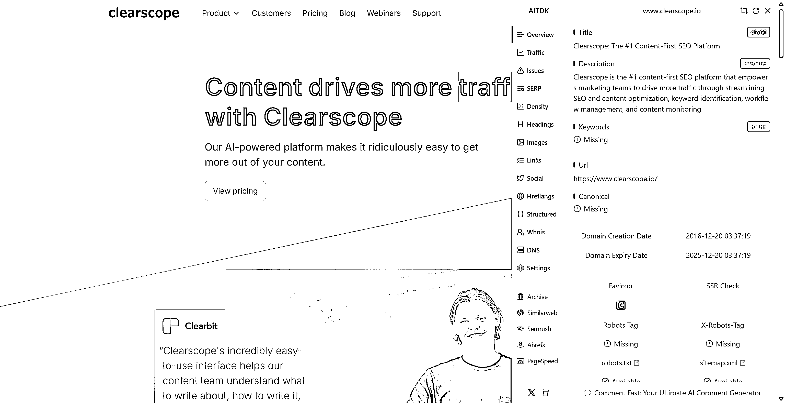

# (10 赞)看榜单（7）Best-AI-Tools-revenue501

> 原文：[`www.yuque.com/for_lazy/zhoubao/pedd0pmmqvyff2q3`](https://www.yuque.com/for_lazy/zhoubao/pedd0pmmqvyff2q3)

## (10 赞)看榜单（7）Best-AI-Tools-revenue501

作者： 行知

日期：2025-04-14

> 深受刘小排老师关于 AI 产品的洞察启发，我立志每日精研 AI 榜单产品。偶然发现“良辰美”已在实践，其基于刘老师“翻石头”的提问框架，让我确信这是深入理解产品的有效方法。我已开启每日一品的学习计划，在此公开，恳请各位圈友监督，并期待大家的真诚反馈，助我校准方向，共同成长！
> 
> 今天看到别人刷产品的速度太快了， 我在反思如果按照我当前的速度，全部刷完这个榜单就要 1 年多。这黄花菜都凉了。
> 
> 那么我的适当地加速，但考虑到有很多东西是第一次接触，不是很熟悉；我会分成几个阶段进行调整  第一阶段：把总榜刷完：每日看一个产品 -》没有新鲜的东西的时候 进行选择性加速或者过滤
> （要重点保护自己状态）按找自己的可以自我接受的方式进行。但整个 SOP 需要过一遍，每日只投入 1 个小时。
> 
> 第二阶段：去根据产品分类、关键，去批量看这类的产品。
> 
> 第三阶段：调整成日常去看产品。

Clearscope 是一款领先的人工智能驱动的内容优化平台，因其易用性和提高 SEO
效果的有效性而备受赞誉，尤其是在预算充足的大型组织和内容团队中。其优势在于用户友好的界面、有价值的关键词建议和无缝集成。然而，其高昂的定价以及在 AI
写作和页面分析等方面的局限性为竞争对手提供了机会。

内容优化市场竞争激烈但持续增长，这得益于自然搜索对于企业日益增长的重要性。虽然创建直接与 Clearscope
竞争的产品需要大量的技术和财务资源，但专注于价格合理性、集成 AI 写作或细分市场的差异化方法可能会取得成功。

最终，创建成功的竞争产品的可行性取决于对用户需求的深刻理解、提供优于现有解决方案的独特优势的引人注目的价值主张以及对创新和客户满意度的持续承诺。通过分析
Clearscope 获得的见解为探索此类机会提供了一个有价值的起点。

[`vz1gcav68m.feishu.cn/wiki/V88NwTVhliIPlikfPCZcUMmqnKc?from=from_copylink`](https://vz1gcav68m.feishu.cn/wiki/V88NwTVhliIPlikfPCZcUMmqnKc?from=from_copylink)

* * *

评论区：

赵坤 : 想请教下大概每天花多长时间整理的这个，有借助 ai 整理内容吧

糖饼 : 直接看这里 这位圈友及时响应的[[https://toolify-insights.online]](https://toolify-insights.online])([`toolify-`](https://toolify-) insights.online)

行知 : 每天 1 2 个小时吧；那必须借助于 ai，不然刘小排老师的精华贴就白读了。

山的那边 : 请问一下，看得小排老师的哪篇文章？

行知 : 这一篇：翻石头 tps://scys.com/articleDetail/xq_topic/5121548228815414

山的那边 : 感谢