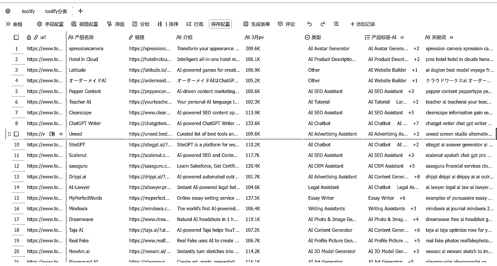

# (10 赞)看榜单（8）Best-AI-Tools-revenue497

> 原文：[`www.yuque.com/for_lazy/zhoubao/peewq8txo64a9vft`](https://www.yuque.com/for_lazy/zhoubao/peewq8txo64a9vft)

## (10 赞)看榜单（8）Best-AI-Tools-revenue497

作者： 行知

日期：2025-04-15

> 深受刘小排老师关于 AI 产品的洞察启发，我立志每日精研 AI 榜单产品。偶然发现“良辰美”已在实践，其基于刘老师“翻石头”的提问框架，让我确信这是深入理解产品的有效方法。我已开启每日一品的学习计划，在此公开，恳请各位圈友监督，并期待大家的真诚反馈，助我校准方向，共同成长！

昨天看了一下才发现，自己才看了个零头，为了提高效率，我把 toolify
的榜单全部划拉下来。后面可以根据类型进行批量来刷，在进行多个维度对比，来增加刷榜单的趣味性。
总之，后面要随时调整刷榜单的方式，保护好自己的热情，让自己持续地看下去。

另外，提醒自己，看榜单当前的一部分，但不是最重的部分，别本末倒置了。

在此，感谢大家的点赞。

[`vz1gcav68m.feishu.cn/wiki/Oqcow8wDBieNSMk1RDdcrtYAnnb?from=from_copylink`](https://vz1gcav68m.feishu.cn/wiki/Oqcow8wDBieNSMk1RDdcrtYAnnb?from=from_copylink)

* * *

评论区：

暂无评论