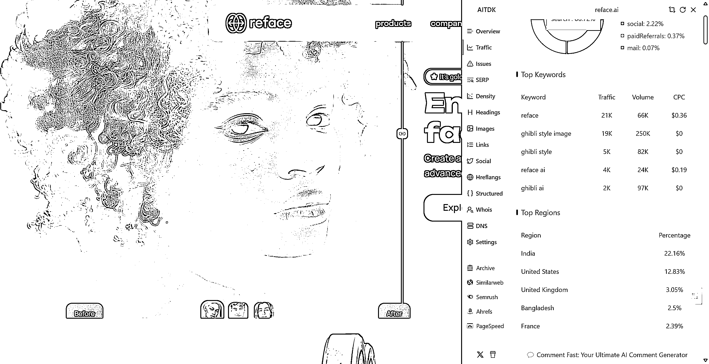

# (7 赞)看榜单（9）Best-AI-Tools-revenue133

> 原文：[`www.yuque.com/for_lazy/zhoubao/rhgi6gtqcn99bv6g`](https://www.yuque.com/for_lazy/zhoubao/rhgi6gtqcn99bv6g)

## (7 赞)看榜单（9）Best-AI-Tools-revenue133

作者： 行知

日期：2025-04-16

> 深受刘小排老师关于 AI 产品的洞察启发，我立志每日精研 AI 榜单产品。偶然发现“良辰美”已在实践，其基于刘老师“翻石头”的提问框架，让我确信这是深入理解产品的有效方法。我已开启每日一品的学习计划，在此公开，恳请各位圈友监督，并期待大家的真诚反馈，助我校准方向，共同成长！

源于，这个产品被 ghibli 这个关键词 3 月带来了 40w 左右的流量，出于好奇；临时调整成这个产品。另外看一下印度流量占了很大一部分，也验证了 3 月份通过
ghibli 带来了很多自然流量。

[`vz1gcav68m.feishu.cn/wiki/UHpRweiyLiMeuNkob44c7Ap2nMb?from=from_copylink`](https://vz1gcav68m.feishu.cn/wiki/UHpRweiyLiMeuNkob44c7Ap2nMb?from=from_copylink)

* * *

评论区：

暂无评论