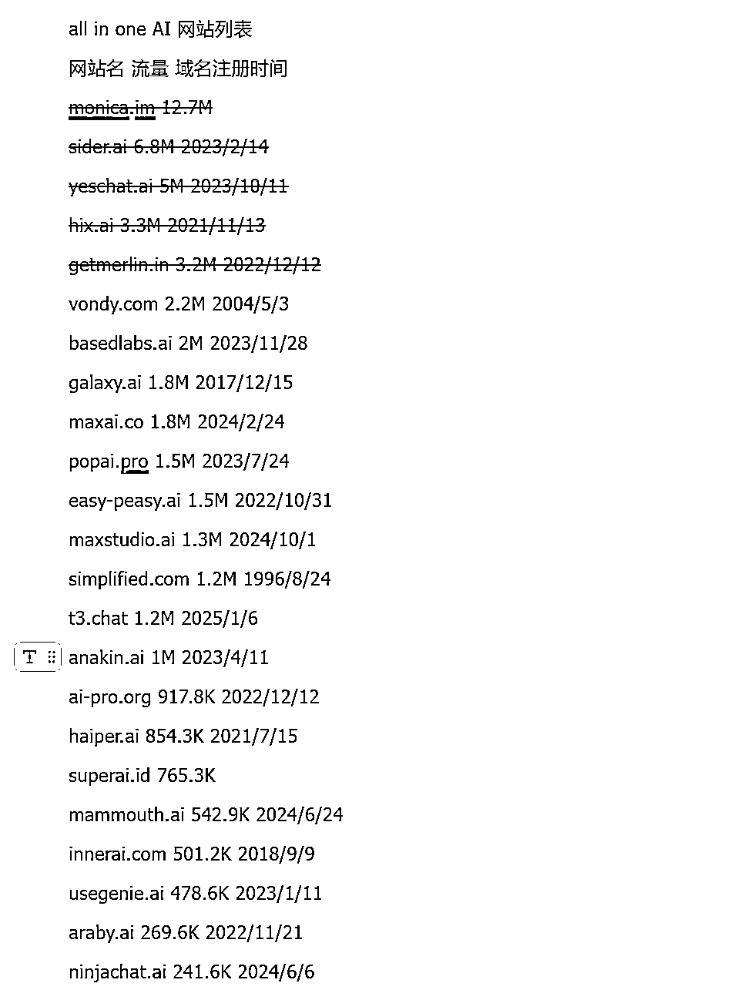

# (12 赞)看榜单(10) All in one AI 列表

> 原文：[`www.yuque.com/for_lazy/zhoubao/hvuytaoh991padgu`](https://www.yuque.com/for_lazy/zhoubao/hvuytaoh991padgu)

## (12 赞)看榜单(10) All in one AI 列表

作者： 行知

日期：2025-04-17

> 深受刘小排老师关于 AI 产品的洞察启发，我立志每日精研 AI 榜单产品。偶然发现“良辰美”已在实践，其基于刘老师“翻石头”的提问框架，让我确信这是深入理解产品的有效方法。我已开启每日一品的学习计划，在此公开，恳请各位圈友监督，并期待大家的真诚反馈，助我校准方向，共同成长！



## **综合对比与反思**

### 相同点 (Common Themes)

**AI 驱动核心价值:** 所有产品都围绕 AI
技术提供核心价值，主要集中在提升效率（助手、自动化）、增强创造力（写作、设计、音视频）、改善信息获取与处理。

**主流产品形态:**

```
1\. 1.
```

**AI 助手/Copilot (浏览器插件):** 如 Monica, Sider, Merlin,
MaxAI，通过集成到浏览器，成为高频使用的入口，市场竞争激烈。

```
2\. 2.
```

**AI 写作/内容生成平台:** 如 Hix.ai, Easy-Peasy.ai，提供大量模板和工具满足特定内容创作需求。

```
3\. 3.
```

**AI 聊天聚合/访问平台:** 如 YesChat.ai, t3.chat，满足用户体验不同或免费使用先进模型的需求。

```
4\. 4.
```

**AIGC 创意工具:** 如 BasedLabs, MaxStudio, Haiper，专注于图像、视频等生成。

**商业模式:**  **Freemium** 是绝对的主流，通过免费版本吸引大量用户，再通过付费订阅（按功能、用量分级）实现变现。

**获客渠道:**  **SEO** (尤其对于写作和聊天聚合类) 和 **浏览器插件商店** (对于助手类)
是关键的有机增长渠道。内容营销和口碑传播亦十分重要。

**新近入局者众多:** 大部分高流量产品的域名注册时间都在 2022 年底至 2024 年初，反映了 ChatGPT 引爆的 AI 应用创业浪潮。

**技术依赖:** 产品能力很大程度上依赖于底层大模型（如 OpenAI, Anthropic, Google 的模型）的能力和 API 供应。

### 不同点 (Variations & Nuances)

**产品定位与功能侧重:** 从全能型助手，到专项写作工具，再到聊天聚合、AIGC、自动化平台、甚至区域性/语言性服务，定位差异显著。

**目标用户细分:** 虽然有广泛重叠，但不同产品会通过功能侧重吸引特定用户群（如 Hix 面向写手，Haiper 面向视频创作者，Araby
面向阿拉伯语用户）。

**成熟度与背景:** 存在老牌公司转型（Vondy, Simplified）和大量新兴创业公司。域名注册时间跨度极大。

**流量规模:** 从千万级到几十万级，差异巨大，反映了市场竞争格局和不同产品的生命周期阶段。

**地域/语言焦点:** 出现了面向特定区域（Superai.id - 印尼）或语言（Araby.ai - 阿拉伯语）的产品，显示出市场细分的趋势。

**创新与差异化:** 头部产品功能趋同，差异化主要体现在 UI/UX、特定小功能、支持的模型种类、定价策略以及可能的生态整合上。YesChat
这类则走了“免费”的差异化（但有风险）。

**域名策略:**  `.ai` 是主流，但也有 `.com`, `.co`, `.in`, `.pro`, `.org`, `.id`, `.chat` 等，反映了不同考量（可用性、定位、区域等）。

### 个人洞察与思考

**市场极度拥挤，但需求旺盛:** AI 助手/工具市场已成红海，尤其在通用助手和写作领域。然而，巨大的流量表明用户对 AI
提效、创作的需求非常真实且庞大。

**浏览器插件是关键战场:** 对于通用 AI 助手，浏览器插件提供了无缝集成用户工作流的最佳体验，是兵家必争之地。

**“免费”的诱惑与风险:** YesChat
类产品的高流量显示了免费策略的强大吸引力，但也伴随着合规性、可持续性的巨大风险。这不是一条值得推荐的长期路径。

**差异化是生存之道:** 新入局者或现有玩家需要找到明确的差异化策略：

```
1\. 1.
```

**垂直深耕:** 针对特定行业、职业或任务流做深做透。

```
2\. 2.
```

**极致体验:** 在 UI/UX、性能、可靠性上做到卓越。

```
3\. 3.
```

**技术创新:** 利用新的 AI 模型能力或独特的数据/算法。

```
4\. 4.
```

**社区与生态:** 构建用户社区或与其他工具深度集成。

```
5\. 5.
```

**区域/语言:** 服务好特定的地理或语言市场。

**老牌公司转型潜力:** 拥有老域名的公司（如 Vondy, Simplified）如果能有效整合 AI
到其现有业务和用户群中，具备一定优势（信任、用户基础、可能的数据）。

**AIGC (尤其是视频) 是增长点:** Haiper 等产品的出现表明，超越文本的 AI 应用（图像、视频、音频）是重要的创新方向。

**变现仍是挑战:** 虽然 Freemium 普遍，但如何有效提高付费转化率、设定合理的 ARPU，并覆盖高昂的 AI
调用成本和研发投入，是所有玩家面临的挑战。

**对创始团队的要求极高:** 既要懂 AI 技术（或至少能很好地集成），又要懂产品设计和用户体验，还要擅长市场推广和增长，同时要应对快速变化的市场和技术。

总而言之，这个列表展示了一个充满活力但也竞争异常激烈的 AI
应用市场。对于想要进入或已经身处其中的玩家来说，清晰的定位、持续的创新、有效的获客以及健康的商业模式缺一不可。对于个人用户而言，这是一个幸福的烦恼——选择众多，但也需要仔细甄别，找到最适合自己需求的工具。

[`vz1gcav68m.feishu.cn/wiki/I7StwKhlNi3YgNkRY5scY9g5nkh?from=from_copylink`](https://vz1gcav68m.feishu.cn/wiki/I7StwKhlNi3YgNkRY5scY9g5nkh?from=from_copylink)

* * *

评论区：

暂无评论