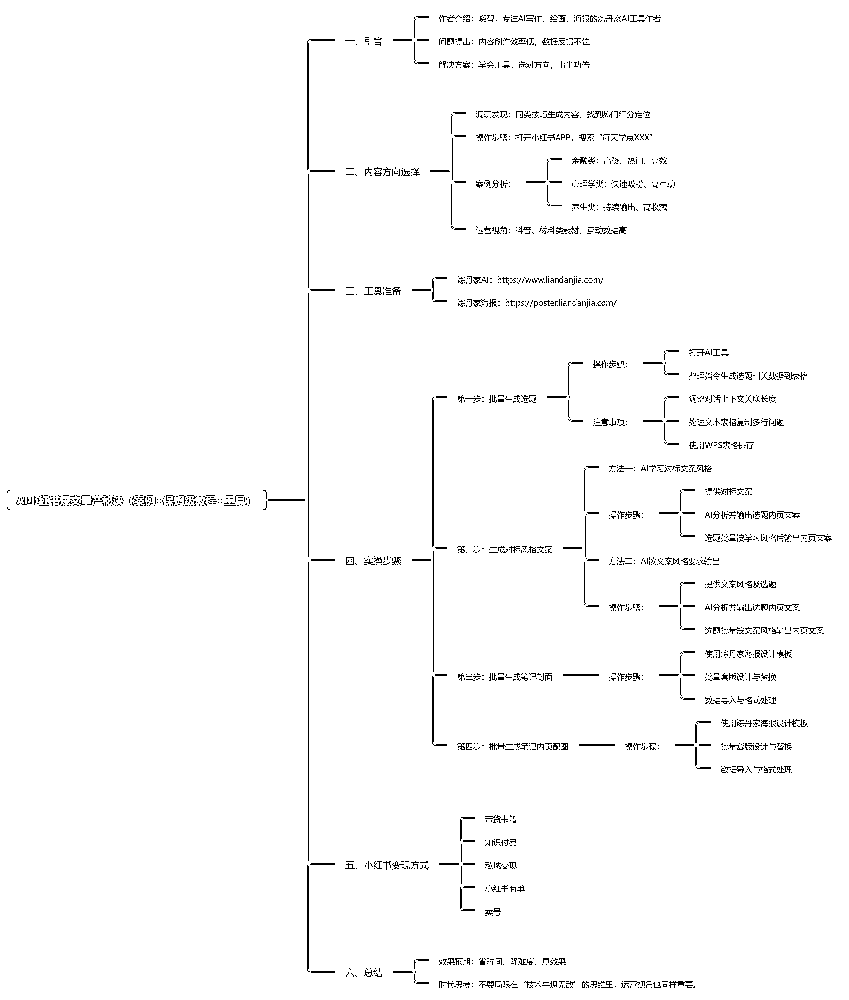

# (49 赞)4 步解锁，AI 小红书爆文量产秘诀！（案例+保姆级教程+工具）

> 原文：[`www.yuque.com/for_lazy/zhoubao/avwirg0526s2zfgv`](https://www.yuque.com/for_lazy/zhoubao/avwirg0526s2zfgv)

## (49 赞)4 步解锁，AI 小红书爆文量产秘诀！（案例+保姆级教程+工具）

作者： 柒。

日期：2025-04-17

**大家好，我是晓智！专注 AI 写作、绘画、海报的炼丹家 AI 工具作者。**

**  **

**发现好多朋友都是已经掌握了各种批量提效技能，但在内容创作上还是头疼，投入精力时间测作品，经常又没好的数据反馈...试试换个方向，同样的创作技巧，可能就事半功倍了！**

**  **

**本篇我会******分享如何在小红书找到合适的内容方向、DeepSeek 输出选题及内容、炼丹家设计批量制作小红书封面及配图**，让大家都能掌握【**更省时间、降难度、显效果**】的本领。**

为了观感体验，具体可以移步飞书链接：[`i23vi4cvyf.feishu.cn/docx/OcwrdGRrAoKZEsxuT98crImpnwf?from=from_copylink`](https://i23vi4cvyf.feishu.cn/docx/OcwrdGRrAoKZEsxuT98crImpnwf?from=from_copylink)

**觉得不错，记得点赞、在看、转发，因为我需要您的反馈。**

**小手一赞，年薪千万！！！**

* * *

评论区：

暂无评论