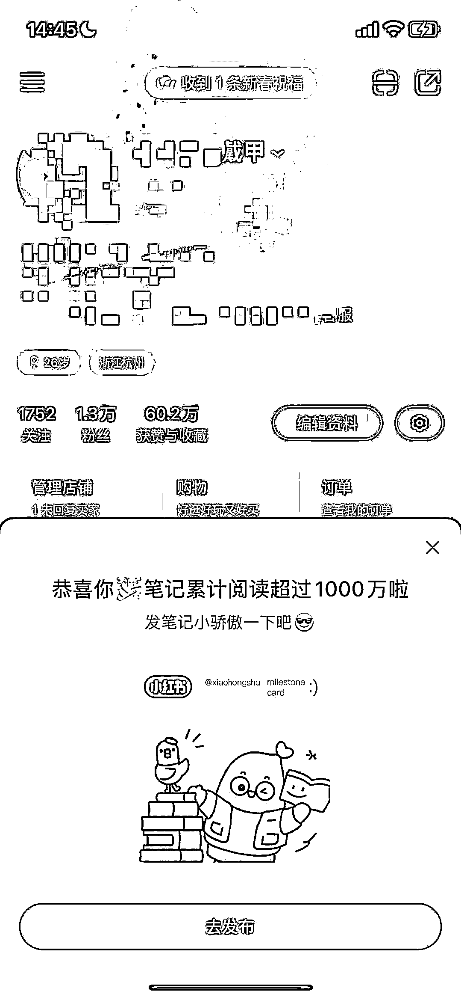
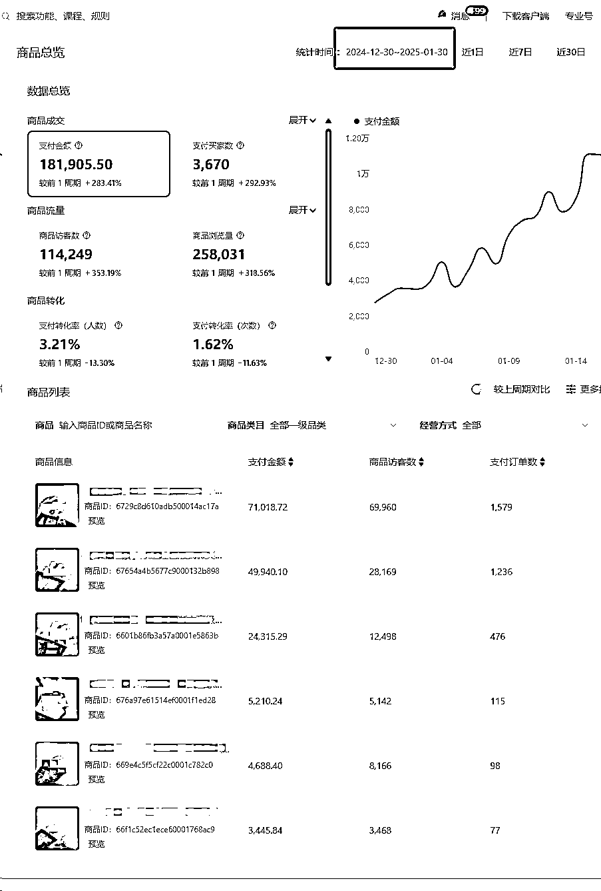

# (22 赞)单月从 0 到 18 万 GMV——小红书电商（爆款模板）深度剖析

> 原文：[`www.yuque.com/for_lazy/zhoubao/ku26xsltgutks127`](https://www.yuque.com/for_lazy/zhoubao/ku26xsltgutks127)

## (22 赞)单月从 0 到 18 万 GMV——小红书电商（爆款模板）深度剖析

作者： 温妮

日期：2025-04-15

Hello 大家好，我是温妮，98 年的电商摄影师，大白话就是：“给淘宝/小红书商家拍图/视频的”，坐标杭州。

进入电商摄影行业的经历👇[`t.zsxq.com/JDqI0`](https://t.zsxq.com/JDqI0)

ai 电商摄影探索经历👇[`t.zsxq.com/19tzke75B`](https://t.zsxq.com/19tzke75B)

23 年 11 月我搬到杭州，一边继续电商摄影的工作，一边探索小红书穿戴甲项目。

在 24 年 4 月做出了小红书【爆款模板】，并做出了几个浏览量 1000W+的穿戴甲账号。

无直播，无投流，依靠【爆款模板】反复发的方式，于 25 年年前旺季做出了单账号单月 18W+的 GMV。

详情移步飞书👇[`hte5jh8fk0.feishu.cn/docx/HDzSdBgU9o9XU8xvuFpcQet6npb?from=from_copylink`](https://hte5jh8fk0.feishu.cn/docx/HDzSdBgU9o9XU8xvuFpcQet6npb?from=from_copylink)

* * *

评论区：

鱼丸|亦仁助理 : 链接错误

温妮 : 你看看现在是不是可以了

旭宏 : “拆商”这个词，很赞[强]