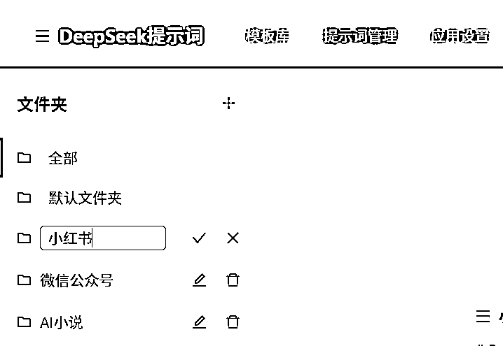

# (精华帖)(170 赞)零基础用 Cursor + Claude3.7 做了一个 DeepSeek 提示词管理工具（含浏览器插件）

> 原文：[`www.yuque.com/for_lazy/zhoubao/grwt8kqokux091gf`](https://www.yuque.com/for_lazy/zhoubao/grwt8kqokux091gf)

## (精华帖)(170 赞)零基础用 Cursor + Claude3.7 做了一个 DeepSeek 提示词管理工具（含浏览器插件）

作者： 靓仔

日期：2025-04-14

首先要感谢生财 3 月份 AI 网站开发的航海教练们，我通过在航海期间听话照做用 AI 编程上线了 2 个网站，现在徒手做一个工具网站算是比较驾轻就熟了！上周大概花了 2-3 天时间做了一个 DeepSeek 提示词管理工具，解决了自己在 AI 提示词使用过程中管理不便的痛点。

**感谢 AI 编程，让创造的成本大大降低，2 天时间哪怕只解决了自己的问题也是赚到了呀！**

### **一、分享一下创作过程**

**1、需求来源**

需求纯纯来源于个人，生财里面各种大佬的优秀提示词满天飞，之前自己是会复制粘贴到笔记软件或者飞书里，但是东一个西一个想用的时候找不到。

DeepSeek 官方在网站功能迭代上确实太佛了，一直保持一个极简的聊天框，就想着是不是可以做 DeepSeek 的提示词管理的辅助插件，在官网跟 deepseek 聊天的可以一键插入收藏好的提示词到输入框。

虽然说我们要尽量避免做自嗨需求，自己的需求未必是真实的用户需求，但是只需要 2 天时间就能做出来一个能满足自己的需求的小玩意~低成本地让自己成为自己的用户还不够吗，我反正是觉得够了。

**2、具体用 AI 编程的过程分享**

**【步骤 1】做需求调研**

通过 Claude3.7 进行需求调研，输入关键词：DeepSeep 提示词管理平台，让他写一份需求调研和市场调研文档，期间你可以不断地对需求调研文档进行提问和质疑，大模型会根据你的想法和建议不断迭代文档内容。

需求调研的目的有 2 个：

1）明确你第一版具体需要解决的用户痛点

MVP 版本建议只解决 1-2 个用户痛点，因为你想做的越多，一次能完整的实现的难度越大，bug 就越多，正反馈来得越慢，可能会坚持不到第一版上线就想放弃。

2）基于你要打的痛点，列出第一版的具体功能清单

AI 会根据市场上的一些竞品产品信息，给你推荐可以做的功能，你只需要你确定要打的痛点去筛选你想要实现的功能，你也可以尝试输入自己的想法，让 AI 帮你完善。

**【步骤 2】基于需求调研结论写需求文档**

让 Claude3.7 针对上述痛点和功能清单输出一份详细的产品需求文档。写需求文档的目的是避免“一句话需求”，减少让 AI 编程自由发挥的空间，从步骤 1 得出来的功能点往往是不够具体的，还需要在这个阶段去把控提前把控一些功能细节（把文档中明确你想要的功能，和删减一些不想做的功能，通常是要做删减，AI 往往容易过度设计）

**【步骤 3】基于需求文档写技术方案（非必要）和拆解开发任务（建议要）**

技术方案主要是对于不懂技术的同学可以留个档，知道 AI 会用到哪些技术，你后面感兴趣可以再慢慢学习；对于懂技术的同学就可以跟 AI 讨论技术方案细节，然后做调整。

拆解开发任务的目的是让 AI 和你方便查看当前项目的进度，什么功能实现了什么没有实现，主要是让你心里有底，这一步稍微做大一点的需求还是强烈建议要让 AI 列出开发任务清单的，不然容易失控，容易正反馈一下接不上，气得摔桌子。

**【步骤 4】Agent 编程**

把以下提示词给 Cursor，开启 Agent+Claude3.7+thinking ，然后喝茶看报等待佳音：

> 我是一个编程小白，请根据需求文档 @product.md 和技术方案 @tech.md 和开发任务清单 @todolist.md
> 一步一步完成 DeepSeek 提示词管理平台的开发，每完成一步开发后要更新 @todolist.md

相信我，按照上述步骤就可以让 AI 自己进行编程了，等 todolist 的清单全部都勾上了以后，AI 会惊艳到你，基本上一个还算完整的 MVP 版本就出来了！

**【步骤 5】细节调整和功能迭代**

接下来就是不断地去跟 AI 反馈你体验中遇到的 bug 和提你的小需求，让这个产品更加完整。

### 二、**产品发布**

**【以下是产品发布介绍，首发生财，免费分享给有同样痛点的圈友们一起使用】** 你是不是也用 DeepSeek
用到上头，但总被那些超好用又散落各地的提示词搞得很烦？东一个西一个的，找都找不全！

1.  **灵光一闪** 写出的绝妙 Prompt，想再次使用时却**翻遍记录也找不到** ？😩

2.  收藏夹里的提示**越来越多、越来越乱** ，像个无人打理的旧仓库？📂

3.  精心调试的提示词模板，想在不同设备上使用却**难以同步** ？💻➡️📱

4.  看到别人分享的高级玩法，想**系统地学习和管理** 却无从下手？🤔

**高质量的提示词，就像是烹饪 AI 大餐的独家秘方！但如果秘方随手乱丢、管理混乱，再好的创意也可能变成一锅"黑暗料理"。**

别担心，你的救星来了！🎉 我们隆重推出——「**DeepSeek 提示词管理平台** 」，一个专为 DeepSeek 用户和广大 AI
内容创作者精心打造的、完全免费的提示词管理解决方案！

#### ***� 核心价值：我们帮你解决了哪些"心头大患"？**

我们倾听了许多 AI 玩家的声音，深刻理解你在提示词管理上的痛点。这个平台就是为了解决这些问题而生：

1.  **告别杂乱无章** **👉** **文件夹分类，井井有条**

我们提供强大的文件夹管理系统，你可以自由创建、命名、甚至**拖拽排序** 你的文件夹！无论是按项目、按类型、按灵感来源，你的提示词都能被妥善归类，查找起来一目了然。

*   **拒绝好词难寻** **👉** **内置模板库，快速启动**

内置覆盖**IT 编程、语言翻译、内容写作、生活娱乐等广泛主题** 的专业提示词模板库。无论你需要解决什么场景的问题，都能在这里快速找到起点，一键复制或应用，激发高质量内容生成。

1.  **提高复用效率** **👉** **便捷管理，随心编辑**

轻松添加、修改、删除你的私人提示词。编辑功能简单直接，常用指令、常用模板，现在触手可及！

1.  **守护数据隐私** **👉** **本地存储，安全可控**

我们深知数据安全的重要性。平台采用**纯前端技术** ，你的所有提示词、文件夹和设置都**只存储在你自己的浏览器本地存储空间中** ，不会上传到任何服务器。你的数据，你做主！🛡️

1.  **提升官网体验** **👉** **配套插件，无缝集成**

我们还提供了配套的 Chrome 浏览器插件。安装后，你可以在 DeepSeek 官网直接、快速地访问和使用你管理的提示词，无需来回切换页面，效率倍增！🚀

#### ***�️ 功能巡礼：强大功能，触手可及**

让我们深入了解一下这个平台能为你做些什么：

**【网站端 - 你的管理大本营】**

*   **专业模板库** **✨**

*   内置海量高质量提示词模板（**目前已收录 263 条，每日持续更新中** ）。

*   覆盖**广泛的主题与领域** ，例如**IT/编程、中英互译、写作辅助、生活娱乐、教育学习** 等等，满足您多样化的 AI 应用需求。

*   您可以根据具体的**场景或主题** 快速筛选和查找所需模板。

*   支持模板预览、一键复制内容、快速应用模板创建你自己的提示词。

1.  **提示词管理 �***

2.  集中展示你的所有私人提示词。

3.  支持按文件夹筛选、关键词搜索。

4.  提供简洁的编辑界面，方便你随时调整和优化提示词内容。

5.  支持提示词拖拽排序，常用提示词轻松置顶。

1.  **文件夹系统 �***

2.  自由创建文件夹，构建你的个性化分类体系。

3.  **全新功能** ：支持文件夹重命名、删除（内含提示词将自动移至默认文件夹）、**拖拽排序** ！管理更灵活。

1.  **数据安全与备份 �***

2.  再次强调：所有数据存储在浏览器本地。

3.  提供**数据导出/导出** 功能（在设置页面），方便你在不同浏览器或电脑间迁移数据，也强烈建议**定期导出备份** ，以防意外情况！

**【浏览器插件 - DeepSeek 官网效率神器】**

1.  **目标** ：让你在 DeepSeek 官网（chat.deepseek.com）与你的提示词库无缝交互。

2.  **核心功能** ：

3.  在页面侧边栏快速搜索和浏览你的私人提示词和文件夹。

4.  一键复制提示词内容。

5.  点击“使用”一键将提示词填入 DeepSeek 输入框。

1.  内置海量高质量提示词模板（**目前已收录 263 条，每日持续更新** ）。

2.  点击“使用”一键将提示词填入 DeepSeek 输入框。

💖 幕后故事：从一个想法到实用工具

这个平台的诞生，源于我自己在使用 DeepSeek 时的真实需求。我发现，虽然 AI
能力强大，但提示词的管理却成了效率的瓶颈。于是，我决定动手打造一个简单、高效、安全的工具。

我选择了 **React + Vite** 作为基础框架，追求快速的开发体验和优秀的性能。UI 上采用了 **Ant Design** ，力求界面美观易用。为了保证用户数据的绝对隐私，我采用**浏览器本地存储** 方案。

开发过程中，我也遇到了一些挑战，比如如何优雅地实现文件夹和提示词的**拖拽排序**(react-beautiful-dnd
的应用)，如何高效处理**大量模板数据** ，以及 Chrome 插件打包 (.zip) 和提交审核过程中的那些"小插曲"（比如被隐私政策链接绊倒 😉）。

但最终，我克服了这些困难，将这个自己也非常需要的工具带给了大家。

### ***� 使用指南：三分钟快速上手**

**第一步：访问网站端**

这是你管理所有提示词和模板的主要地方。

1.  **访问地址** ：[`www.deepseekprompt.top`](https://www.deepseekprompt.top)/

2.  **快速浏览** ：首页是模板库，左侧导航可以进入"提示词管理"页面。花几分钟熟悉一下界面布局。

**第二步：安装浏览器插件（强烈推荐！）**

为了在 DeepSeek 官网获得最佳体验，请安装我们的浏览器插件。

1.  **下载页面** ：

2.  [`www.deepseekprompt.top/download-extension/`](https://www.deepseekprompt.top/download-extension/)

1.  **启用插件** ：把浏览器插件的开关打开，然后进入 DeepSeek 官网 chat.deepseek.com，页面就会自动加载你的提示词管理侧边栏啦。

🌱 未来展望：持续进化，敬请期待

一个好工具需要不断打磨。未来，我计划：

1.  持续丰富和优化内置的**专业模板库** 。

2.  进一步提升界面**交互体验和性能** 。

3.  探索更多实用功能

我相信，「DeepSeek 提示词管理平台」能够帮助你摆脱提示词管理的烦恼，让你更专注于利用 AI 进行创造，显著提升你的工作和学习效率。

**现在就行动起来吧！**

感谢你的阅读！希望这个平台能成为你 AI 之旅上的得力助手！如果你觉得好用，也请分享给更多有需要的朋友吧！❤️

欢迎在评论区告诉我你的想法！聊一聊你平时都是怎么管理提示词的[有好用的提示词管理产品也可以推荐给我瞧一瞧哦]

* * *

评论区：

Jupiter-ze* : 下载的插件是 html 格式的

靓仔 : 感谢指正！现在改好了又发布了一半版，你看下你那边可以下载了不

苏苏 : 这就去试试 感谢！

靓仔 : 好滴，有使用问题和建议随时找我～

惜余 : 厉害，有用

靓仔 : 感谢支持！欢迎后面多多使用和提建议，还会继续迭代

七月 : 感谢分享！

靓仔 : 感谢支持[爱心]