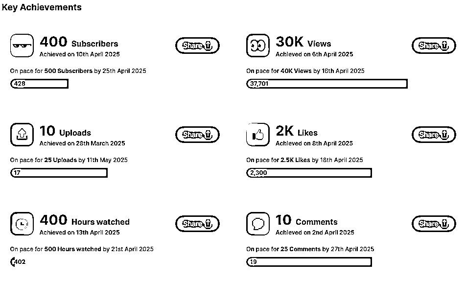
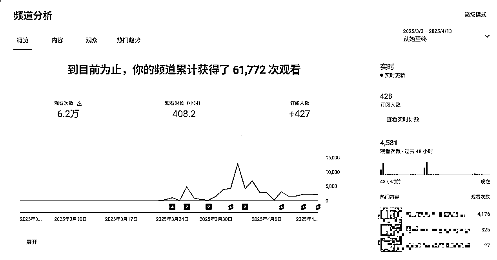

# (27 赞)YouTube 第一次航海总结复盘： 从“素人”到“航海者”的心路历程

> 原文：[`www.yuque.com/for_lazy/zhoubao/fiqftvk4cc1dpnmm`](https://www.yuque.com/for_lazy/zhoubao/fiqftvk4cc1dpnmm)

## (27 赞)YouTube 第一次航海总结复盘： 从“素人”到“航海者”的心路历程

作者： 老鹰

日期：2025-04-14

大家好，我是老鹰，一个刚刚加入生财有术的“素人”。虽然这不是我第一次写项目复盘，但这次是我加入生财后的第一次航海，心情既兴奋又忐忑。兴奋的是，终于有机会系统地学习 Youtube 运营；忐忑的是，作为一个新手，我能否跟上大家的步伐，甚至做出一点成绩？

到目前为止，我的频道数据并不亮眼：订阅用户 427，观看量 6 万。

说实话这个数据在项目里可能算是“垫底”了。但我分享这个数据的目的不是为了比惨，而是想告诉大家：

**  **

**在航海前，一定要预设好合理的预期** 。当你看到最终的数据时，不至于因为落差太大而心态崩掉。

3 月航海实战让我不仅学到了很多技能，更重要的是我对自己有了更清晰的认识，这里分享一些自己在这次航海中的心路历程和一些感悟吧.

主要包括这四部分的内容：航海前的准备、正式航海的执行、遇到的问题及解决方法、最终的收获和下一步计划。

更详细的内容请移步飞书文档进行阅读：[‌​⁠‬‍​​​⁠​⁠⁠​​​‌‌​​​​⁠​‬​​‬​​​‌​⁠⁠‌​​‬‌​‌​‬​Youtobe
第一次航海总结复盘 从“素人”到“航海者”的心路历程 -
飞书云文档](https://p76vqogctb.feishu.cn/docx/VGMXdJilGohhUVx3AmgczwXYnHf)

* * *

评论区：

九月 : 不错总结

团子 Jocelyn(* : 感谢老鹰的真诚分享，分享得很细致很棒[强]

池月白 : YouTube，标题的拼写错了[偷笑]

老鹰 : 非常感谢指正，已修改！[捂脸][捂脸]

炘 : 你们是怎么上的外网啊啊啊