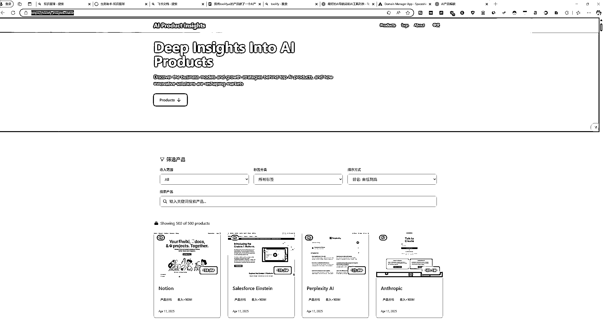
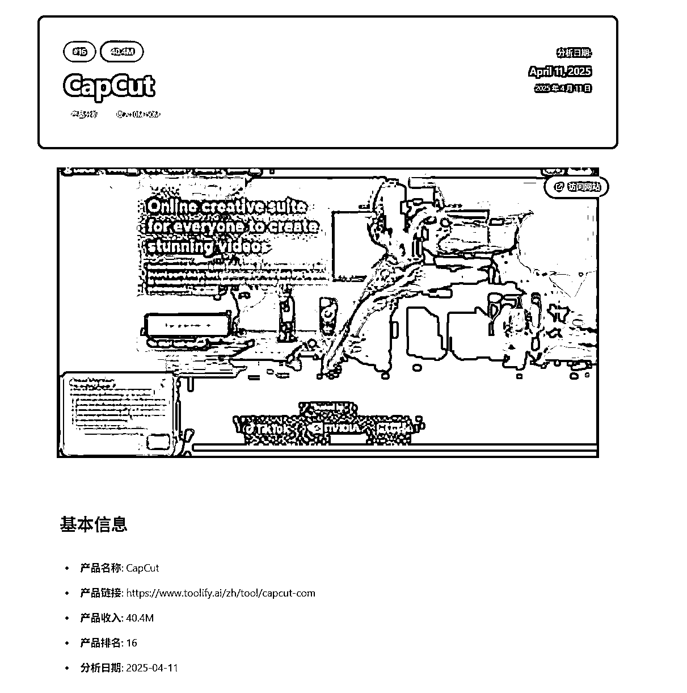
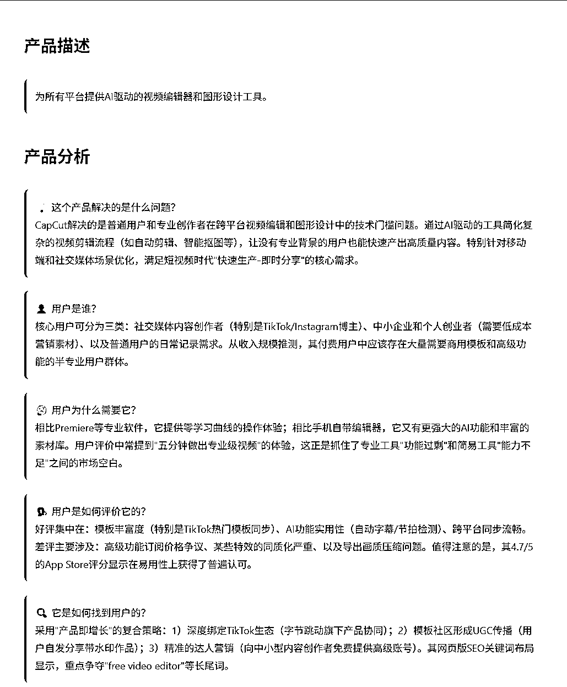
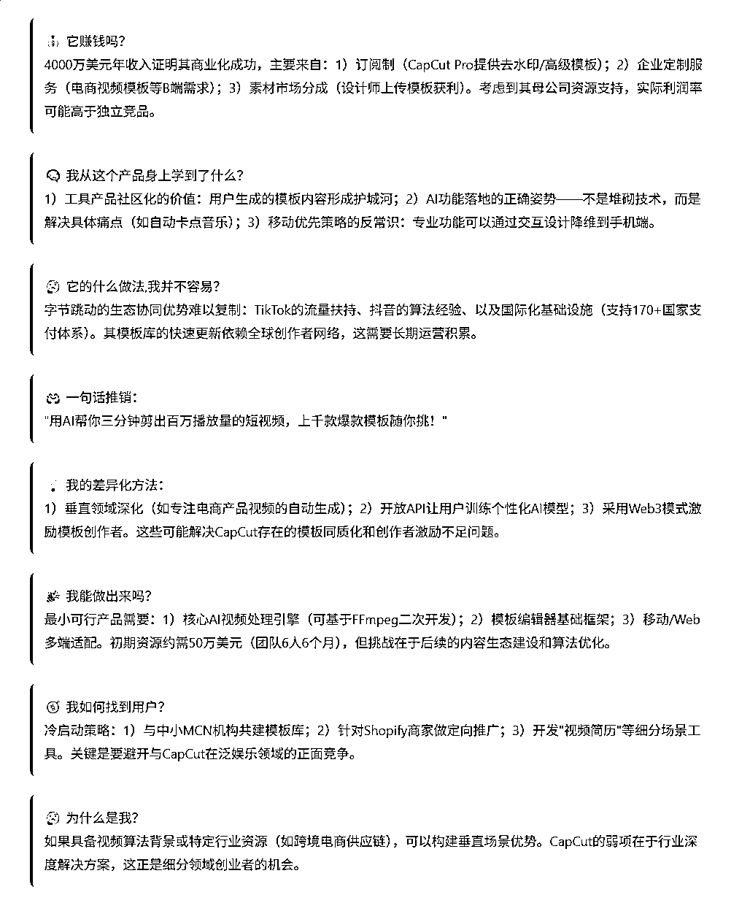
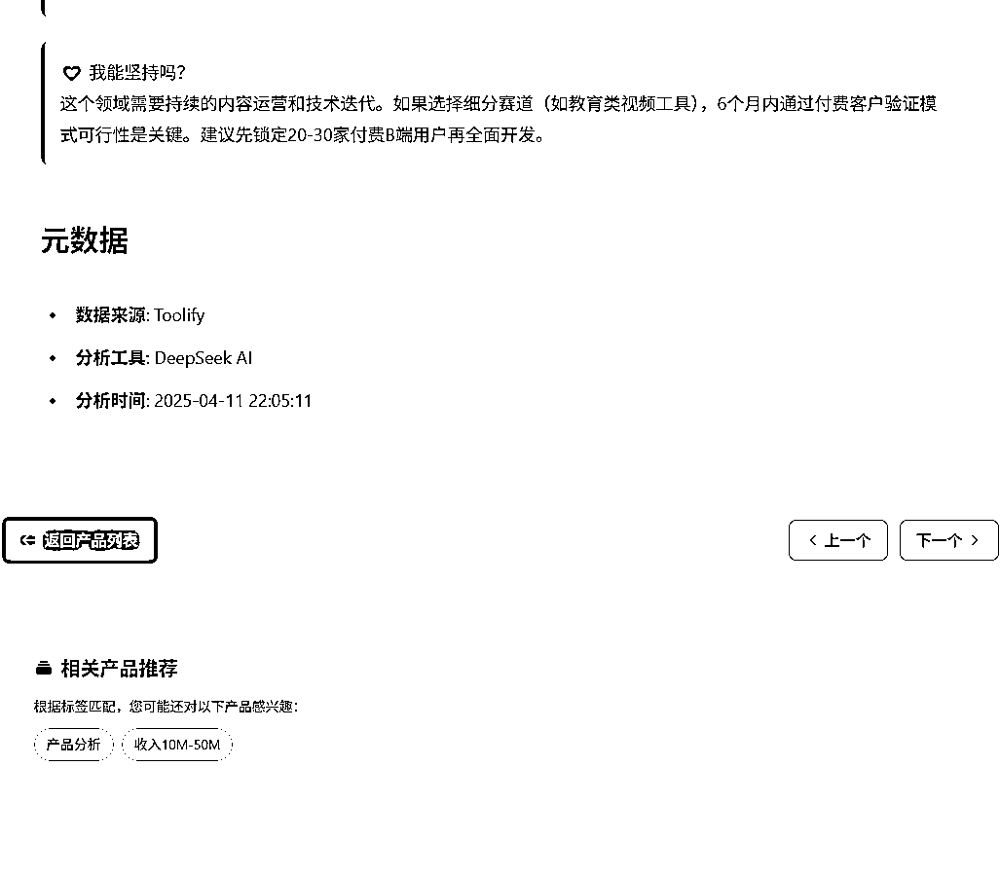
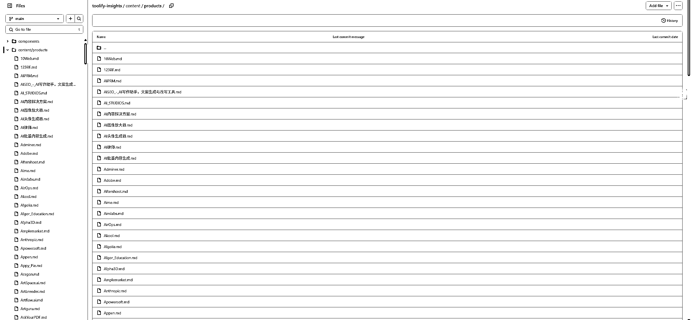
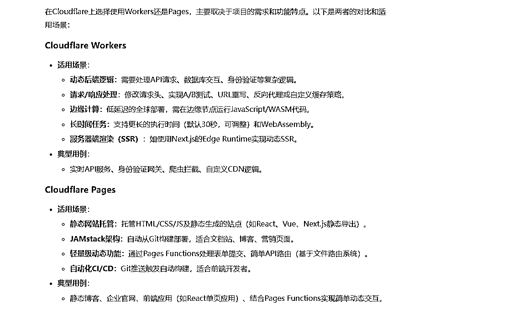
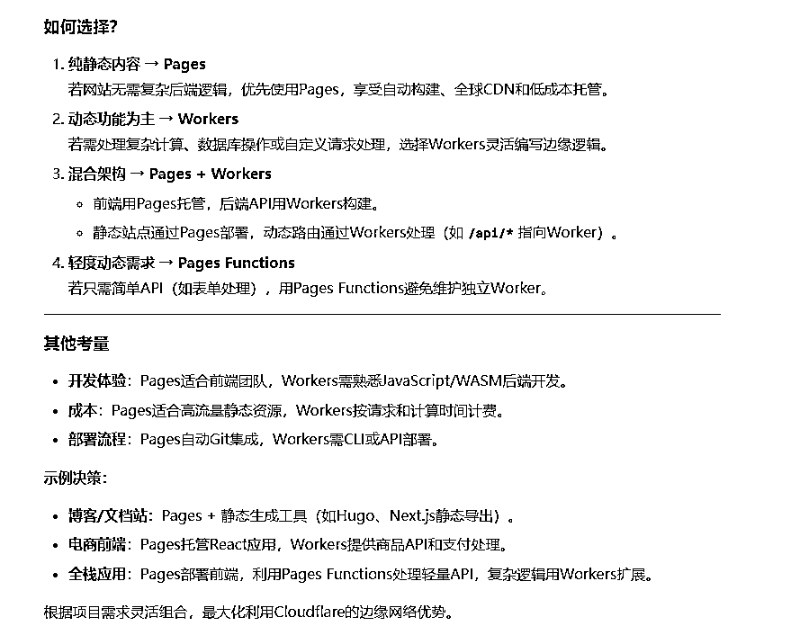
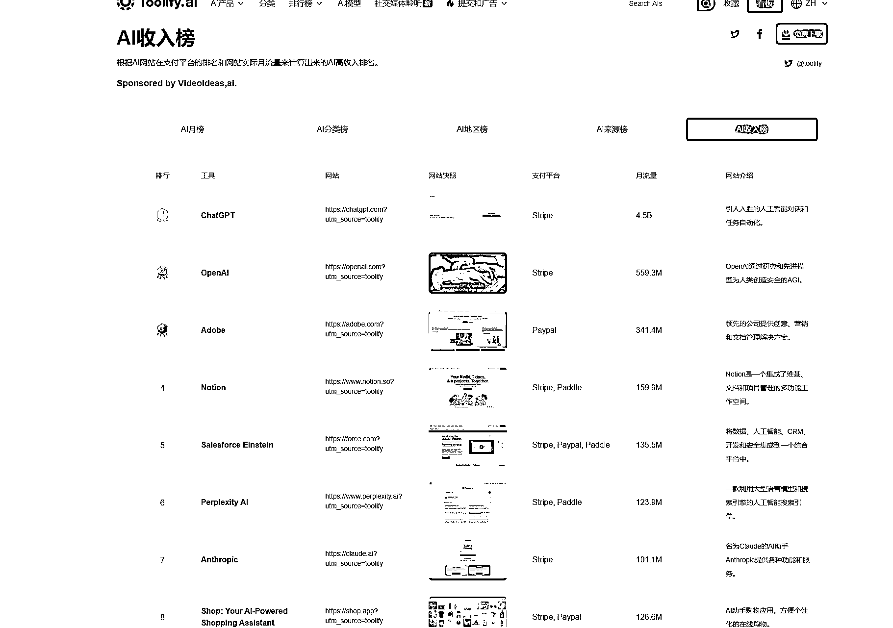

# (17 赞)我将 toolify.ai 的 AI 产品做了一个 AI 产品解读网站

> 原文：[`www.yuque.com/for_lazy/zhoubao/blxz4tk3hkvxu53e`](https://www.yuque.com/for_lazy/zhoubao/blxz4tk3hkvxu53e)

## (17 赞)我将 toolify.ai 的 AI 产品做了一个 AI 产品解读网站

作者： 锂电公社

日期：2025-04-15

先展示效果：[`toolify-insights.online/`](https://toolify-insights.online)

你看到的是我的一个网站的示例解析，这个网站是基于圈友@小学生的开源项目的基础上做的，在此非常感谢圈友

@小学生，我的理解需求的寻找可能不只是教练教的那些方法，我目前大部分的网站需求都是来自于生财，生财需

要的，可能也会是市场的真需求。

通过本次开发，让我比较受益较大的有以下几点：

1.需要将单独的文件独立出来，可以实现更好的更新和删除。

2.解决了之前在本地开发过程中老是需要服务器，我一直以为这样就避不开使用服务器，一直很懊恼，这次发现直接通过 cloudfare 的 page 就可以解决掉，嘎嘎香。怎么区分使用 workers 还是 pages？让我们看看 AI 怎么回答的：

3.通过圈友小学生分享的开源代码，对 AI 产品的解析，让我学会了使用 API，似乎真的很香，我又把从 toolify.ai 下载重新跑了一遍，因为圈友做出来的 md 文件的产品链接是基于 toolify 的，我想增加的可以访问对应的网站。

本网站优化点：

1.增加产品分析的英文界面，暂时没有转化过来

2.增加原网站访问链接

3.添加更多 AI 产品解析

4.增加赞赏功能

5.增加支付功能

对网站有更多建议的朋友欢迎提意见！！！ [`si06f5z4e71.feishu.cn/wiki/KF5SwMYoDiDePWkdpBqc4O05nDb?from=from_copylink`](https://si06f5z4e71.feishu.cn/wiki/KF5SwMYoDiDePWkdpBqc4O05nDb?from=from_copylink)

* * *

评论区：

黑帽子 : 这个网站的中英文组件是在客户端渲染的，最好在服务端实现，这样会比较有利于 SEO

锂电公社 : 好的，谢谢，我跟 AI 说一下，让他帮我改一下

良辰美 : 很不错，我也在开发中，不过不止于
toolify，你这里是只有那五百个产品吗，我想把全网几十万个产品全部弄一遍，还有好几个功能也在开发中，工作量有点大就还没弄完，但是发帖子也想等自己实践出来一些方法论有结果了再写

锂电公社 : 我也会增加其他的 AI 产品，目前上了 500 个