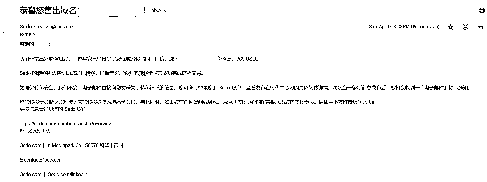
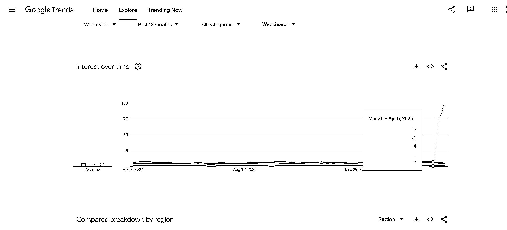
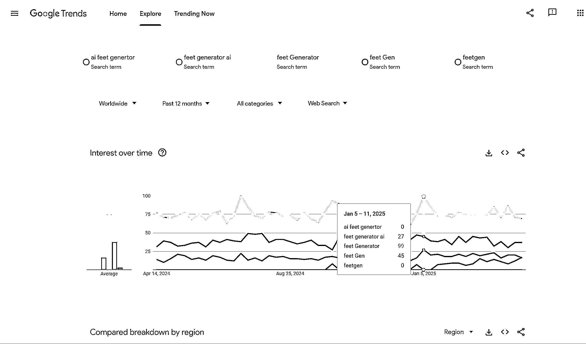
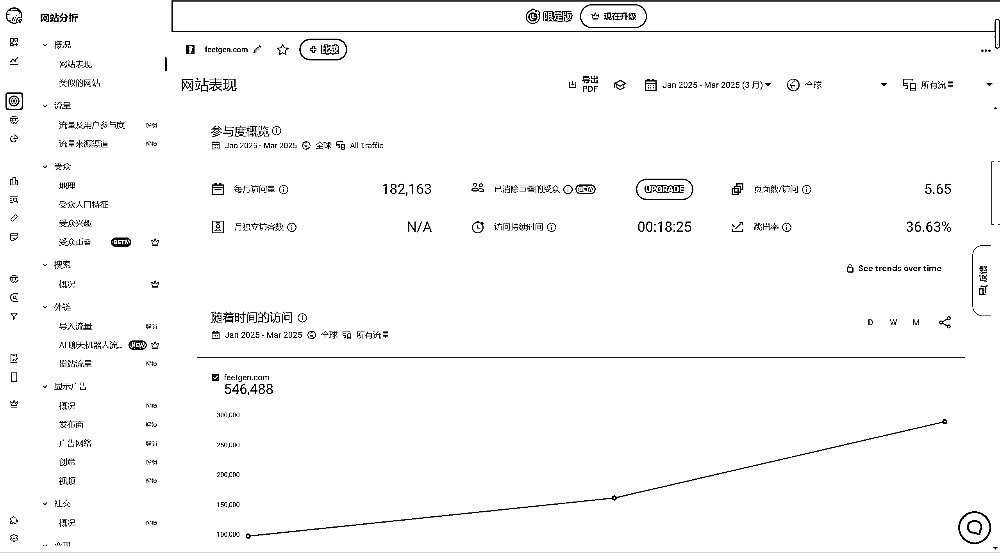
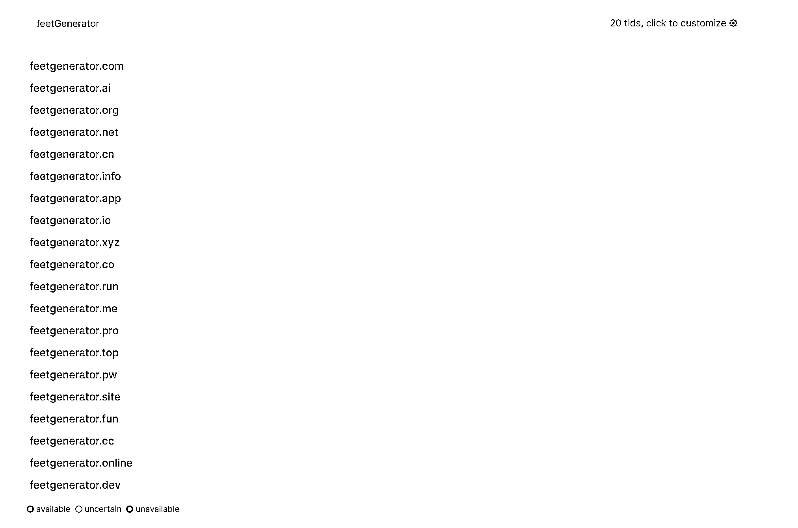

# (精华帖)(158 赞)获得第一笔找新词收入，来自卖域名，分享我的找词思路

> 原文：[`www.yuque.com/for_lazy/zhoubao/wux41wvqm3m456if`](https://www.yuque.com/for_lazy/zhoubao/wux41wvqm3m456if)

## (精华帖)(158 赞)获得第一笔找新词收入，来自卖域名，分享我的找词思路

作者： 嘟

日期：2025-04-14

昨天卖出了一个新词域名。  

从谷歌趋势看，昨天，也就是 13 号，正是谷歌趋势更新，能够看到上周这个新词势头正开始暴涨的时候，或许这时候在谷歌趋势的热词里出现了这个词，开始被多数人关注。 

但我是 9 号看到的这个词，那时候 6-12 号这段折线还没更新，在 30 号到 5 号刚出现小拐点的时候，搜索量显示还不算太高，后面这段黄色实线还是虚线，只是预测趋势。

根据我的能力，这个词的功能我实现不了，但是这么早发现潜力词，先拿下域名总没有坏处，买到后立马就挂在 sedo 上出售了。

第一次卖域名，没什么经验，觉得能卖出去，验证这套流程的可行性就不亏，所以挂了个比较低的价格。

**以下是我的找词思路：**

根据我对自己能力和认知的了解，目前适合做的是，**找新词的第一阶段，挨个去看。**

我是这么想的，我对某个词、某个领域的了解，几乎完全是小白，所以我需要大批量去看这个词相关的概念，相关的搜索需求，来了解这个词能做什么、人们想用它来做什么。

目前我在很多教程学到的找新词的方法，一个是看 semrush 这一类数据分析平台，找竞争度低的新词，一个是在谷歌趋势挖有商业潜力的热搜词。

这两种方法，对我一个新人来说，我认为难度有些大，本身英语水平就不是很好，还要看海量不同领域不同类型的词，太考验我的知识存储量和判断力。

**所以我用了一个笨方法，根据想了解的领域，去反查用户们都在找什么工具。**

方法就是，根据想了解的词根，用爬虫去批量获取相关下拉词，简单来说，比如想看“AI”相关的词，就让它**在浏览器模拟输入"ai a"到"ai
z"，批量获取下拉词列表** ，看看人们都在搜什么。

然后根据出现的词，其中一些感兴趣的、陌生的，去谷歌趋势看看，去放在谷歌搜索试一下，看看人们的真实搜索意图是什么，有没有解决方案。

然后会在其中发现另外一些有潜力的词根，作为词根再去获取全部下拉词，挖掘潜力需求。

在这个过程中，会有很多“原来还有这种需求”“原来还有这种工具”的感叹。

我卖出域名的潜力新词，就是用这种笨方法找到的。

随着对词根相关词汇的了解越来越多，**我的下一步思路是，每天用脚本跑一遍下拉词，和以前获取的列表作对比，去重后获取每日新词** ，这个新词应该不会太多，人工判断不会耽误太多时间。

---

这个挖词的过程，也发现了一些我能力范围内能做出来的东西，还发现了很多有意思的需求和产品。

比如在 ai 的关键词里，我看到了这个词“ai feet generator”。

放在谷歌趋势或者 semrush 看，搜索量很小，再拿去谷歌搜索看，只有一个网站满足了这个需求[`www.feetgen.com/`](https://www.feetgen.com/)

通过这个网站反查搜索词，会发现“feet generator ai”“**feet Generator** ”搜索量相对比较大。

去 similarweb 看，没有相似网站，满足这个需求，这个网站确实是独一个。

去看网站流量来源和去处，会发现搜索流量一直在增长，PayPal 和 stripe 占了很大比例，也有增长趋势，说明变现能力不弱。

 images.zsxq.com/Frm98I20WuOwiDAas4cLEgyaSpJ9) images.zsxq.com/Fm612YCZkXCy3y-XIZjbjys403Jc)

去看关键词域名，发现这个词也是他独一家，而且更适合 SEO 的全拼 feet Generator 完全没人注册。

现阶段的我对这个工具的理解是，**小众需求，没有竞争对手，在闷声赚钱，大厂拉不下脸去做，但是个人开发者可以去分一杯羹** ，有能力实现的话可以一试。

通过这种找词方式，还有很多类似的小众需求只有零星一两个产品在满足，我认为这就是我一直在找的 niche 市场，藏着很多闷声赚钱的工具。

- 星球发文章不能发附件，我把附件放网盘了[`pan.quark.cn/s/1334c659c777`](https://pan.quark.cn/s/1334c659c777) ，这两个文件，python 代码是我爬关键词的脚本，你可以根据自己的需求去修改。txt 文件是用这个脚本爬出来的 ai 词根的上万个下拉词。我认为这套思路用在抖音、小红书、reddit、推特等其他平台也是可行的，感兴趣的圈友可以去试一试。

以上，希望对你有所启发，如果有其他扩展思路，欢迎评论区交流。

* * *

评论区：

顾希希 : 太牛了，学习学习！

黑帽子 : 脚本用了，挺好用的，不过我的梯子节点在香港，总是会跳转到 hk 的 google 页面

喂喂喂 : 学习了

Light 微光 : 有收获

🌊达师姐 : 非常优秀

小戈 : 厉害厉害，学习了学习，有收获，感谢分享

Katao : 追热点变现方式+1，想起来之前的赶集网，ganlvwang.com

上上签 : 小白的我仿佛在读天书