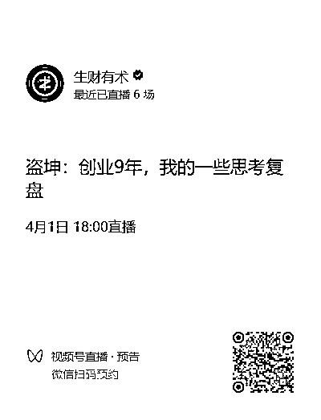

# (精华帖)(635 赞)做自己喜欢的，能力范围内，最大的梦！

> 原文：[`www.yuque.com/for_lazy/zhoubao/rhr26flubc4zhuru`](https://www.yuque.com/for_lazy/zhoubao/rhr26flubc4zhuru)

## (精华帖)(635 赞)做自己喜欢的，能力范围内，最大的梦！

作者： 盗坤

日期：2025-03-28

记得之前有人找亦仁哥咨询过商业、副业赛道的知识付费项目。亦仁哥当时的建议是不要去做这种项目，天花板太低了。

我相信这是亦仁哥的真心话，因为这是来自他自己的真实体感。

可以说，生财有术已经算副业、创业赛道知识付费的天花板了。可即使如此，和知识付费赛道的语文、数学、英语等类目比较起来，其天花板也是天差地别。

而即使和赛道更小一些的会计培训、人力资源培训等比较，生财有术也是难以望其项背。

其实都是知识付费，做副业类的知识付费和做英语科目的知识付费，其底层逻辑和方法论也都是一样的。但是，两者最终的收益，却在决定做哪一个赛道的时候就已经定格了。

“ 回顾来时路，走了许多歪路，犯了许多错误。不过最后悔的，还是自我矮化的认知，自我想象力的匮乏，受限于‘普通人’三字的封印。”

这是我敲在朋友圈的一段文字，也是我创业十年来最大的感悟，更是今天想和大家分享的主题。

今天，我将用三个关键词，把这个主题串联起来，分享给大家。

**1、go big market**

雷军在 2013 年接受采访的时候说过：“ **我觉得在创业的时候，要选择自己喜欢干的，能力能覆盖的领域里，市场规模最大的赛道，越大越好。** ”

并直言，这是他创办金山软件时“最大的后悔和总结”。

并用当年金山词典和金山毒霸的案例做解释。雷总当初选择做了金山词典而不是金山毒霸，而后者是前者 100 倍的规模。而这样的后悔，其实还不止对于金山词典和金山毒霸选择的区别，更是他对整个大赛道选择的区别。

1992 年，雷军加入金山软件。1998 年出任金山 CEO，全面执掌金山软件。2007 年，金山上市，上市首日市值 6 亿港币，目前市值 500 亿港币。

作为对比，马化腾 1998 年创办腾讯，2004 年上市，上市首日接近 600 亿港币，目前市值 4.7 万亿港币。李彦宏 2000 年创办百度，2005 年上市，上市首日市值接近 40 亿美金，目前市值 345 亿美金。

至于阿里巴巴、网易、UC 浏览器等等大多数和他同期甚至比他晚创业的，也都拿到比他大的结果。

如果说你幼稚地认为是雷军能力不行，他以一己之力把金山做上市。

而在处理完金山这个“包袱”以后，雷总开始了他的进阶之路。

2010 年创立小米，把小米手机带到全球前三的位置。2020 年，雷总又宣布亲自带队，开启“人生中最后一次重大的创业项目”，并押上“人生所有积累的战绩和声誉”，为小米汽车而战！

如今的小米，手机年营业额接近 2000 亿，新生的小米汽车也蓬勃向上，小米公司的市值更是突破万亿。

雷军后面曾说：“ **用战术上的勤奋，掩盖战略山的懒惰，是创业者最大的陷阱。** ”

某种意义上来说，金山软件确实在某些层面拖了雷总的后腿，耽误了雷总的时间。而我想这也是亦仁哥劝那个人不要做知识付费的原因。

如果说，你觉得这些离我们太远。那我们就聊聊离我们近一点的事情，聊聊生财的项目。

几年以前，我在做淘宝蓝海项目。算不上拼命，却也对得上勤奋二字。然而，无论我怎么努力，亦或是在运营技术层面、还是组织管理层面（虽然当时我的管理也很菜）的改变，都无法突破年利润 500 万的坎。

几年以后的今天，我做起了 MCN，干起了 IP 孵化、短视频带货、直播带货的事情。

有时候，一个娱乐主播一个月就可以创造以前淘宝蓝海一年的利润。而我可能其实啥都没干，只是选对了赛道，找对了人，仅此而已...

当然，我并不认为现在自己做的项目有多高级。相反，我甚至认为自己被捆绑在了现在的项目里。

当初成就我的，如今也终于束缚了我。

并且，不仅仅是对于公司，对于个人，赛道的选择同样。是选择送外卖，还是选择做房地产销售，两者天花板也是完全不同的。即使都是卖房子，在重庆卖房子还是深圳卖房子，其结果也是不一样的。

我自己的亲哥哥毕业以后选择的第一份工作就是房产中介，而且是去深圳做销售（我们是重庆的）。他现在的年收入在 200-300 万左右（带团队了），而我一个同学去他手底下做销售以后，一年也赚了 50 多万。

但同时，我也有一些在重庆做房地产中介的同学。他们在门店和商圈也都算比较优秀的了，单月收入平均下来也就一万多而已。

生财里面有很多项目的信息。我没有贬低任何项目的意思，但是，不可否认的是，不同的项目带来的产出就是会有很大区别。

其他的我不知道，淘宝蓝海我是真的带出来很多年入百万的学员（虽然我现在觉得淘宝蓝海也很一般）。但是你如果说想通过闲鱼带货，做到年入百万，很难很难...

又比如有人找我咨询 AI 代写的项目，我就想问一问，除了通过 AI 这个工具来提高了一下代写的效率以外，这和以前的枪手业务有啥区别？不都是出卖劳动力的活？

一篇小红书挂车笔记，有机会卖一万，也可能卖到十万甚至几十万，并且这篇的边际成本是递减的。而出卖劳动力的活，你的时间始终是有限的。

go big market，人生下半场，去做自己喜欢干的，能力范围内，最大的梦！

**2、祛魅**

想赚一千万，就要做能赚一千万的事。如果你做的是闲鱼卖货，想要赚一千万几乎是不可能的。

然而对许多人来说，go big
market，最难的不是发现一千万的 market，亦或是做好这个项目的能力。而是自我矮化的认知，是自我想象力的匮乏，是缺乏拥抱一千万的“勇气”，或者说野心。

**想要成功，就要敢于拥抱成功。觉得自己能干大事，才有机会干成大事！连想都不敢想，更妄说做，甚至是成功。**

我最开始做内容电商的时候，做的都是搬运、混剪、无人、半无人这些项目。那时候，我从来没有想过要去做原创短视频，就是从根上觉得自己“没资格”做这种要求很高的项目。

可做原创真有那么难吗，这些项目的项目要求真的很高吗？

在生财，我看到了许多一个人做原创自媒体账号，做得很好的案例。去外面参加培训，发现身边月销几十万、上百万的账号，也就是大学生、宝妈、自由职业者或者一对夫妻而已。

我比他们有钱，有资源，他们都能做好，为什么我做不好？因为我的自我设限，因为我一直都是干的无货源、搬运混剪的勾当，也是在和这样的圈子接触，所以我就认为自己也只能干这一类的事情。

**我缺的根本不是资源，是心中的成见，是自我矮化的认知！**

我们总是被这些毒性偏见所包围：“现在入场太晚了”“都是个例”“都是靠人脉”...

要做梦，但需要做能力范围内的梦。可是，这个能力的界定很重要，更重要的是我们不能被偏见禁锢思维。在脚踏实地的同时，更不要忘了仰望星空。

如果都被毒性偏见所禁锢，我们这个国家就走不出比亚迪、华为、deepseek 这些企业。

我出身在重庆最南边的秀山县下面的中平乡下面的中寨村。小时候，从我们那个县城到重庆主城要三天的时间，先坐车到酉阳，再从酉阳坐船到涪陵，再从涪陵坐车到重庆。而我们那个村到县城，还要换乘两次车！

我们那个地方，三省交界，民风彪悍，打架斗殴时有发生，许多人也是初高中还没毕业就开始在社会上行走。初中的时候，我还沾染了赌博的习惯，迷上了老虎机，差一点就读不了书了。

那时候，我的想法是去学理发或者在烧烤摊当学徒！

现在想想，还蛮后怕的，差一点，就差一点，我也认命了。后来，我有小学同学，在街头被人砍死。有同学赌博成性，妻离子散。还有的磨平了棱角，踏踏实实地过日子，但生活也过得颇为拮据和艰辛。

成功是没有终点的，但失败是有标准的，当你失去希望的那一刻，当你放弃的那一刻，认命的那一刻，你就真的是失败了。

能不能做，做不做得成，是另外一回事。但你连向上突破的勇气都没有，你就的一生就真正的定型了。

打破认知枷锁，打破自我设限的思维模式，对自己祛魅，也对这个世界祛魅 ！

加入生财以后，我开始从淘宝蓝海项目尝试起了其他项目。加入各个私董会以后，我发现这些能赚几千万、上亿的老板，也并不我们多个脑袋，多双眼，对他们的祛魅，让我真正有了做更大事情的野心。

**这个世界真的是个巨大的草台班子，别把任何人当神，当然也包括你自己** 。

只要你去近距离观察，你会发现每个人都不是完美无缺的，每个公司也都是漏洞重重。盗坤是个普通人，亦仁也是个普通人，即使刘强东，好多年前，他也是个上大学还要全村凑学费的农村娃。

你现在可能会在某些层面，认知落后于他们，技能落后于他们。但是认知可以去补，技能可以去学，唯有这个野心的觉醒需要靠你自己。

**不要用你当下的能力去决定未来的高度，而是用你的野心去定义未来的战场** 。

公元前 215 年，时年 39 岁的沛县泗水亭派出所所长（亭长）看到帝国一号位（秦始皇）出游，发出了“大丈夫当如是也”的感慨。

6 年后的 7 月，陈胜吴广在大泽乡起义，并宣布“王侯将相宁有种乎”。同年 9 月，刘邦带着他的好哥们樊哙（杀猪匠）和周勃（吹箫的）在芒砀山反秦起义，并在此后打下沛县，招揽了时任沛县县委书记秘书萧何以及副县长（县丞）曹参的加入，自封沛公。

公元前 206 年，刘邦攻入咸阳，把当时的大厂韩国高管张良挖过来，封汉王。此后，继续招揽韩信、陈平等高级人才，并收购彭越集团、英布集团等豪门，终于在公元前 202 年，垓下之围，干翻西楚集团的董事长项羽。

最终，刘邦带领着兄弟们成功 IPO，并一举打造出全球最高市值的汉朝集团。而跟着他混的兄弟也都飞黄腾达，萧何也从县委书记秘书成了国务院总理，曹参也从副县长成了国务院副总理...

我愿称之为，古代黑社会创业最高成就者。

刘邦是派出所所长，咱就是一普通老百姓。可人家的梦是打造一个汉朝集团的梦，我们的梦先定他个百万又如何？

当然，祛魅不是单单靠一篇文章，一个口号就可以改变，祛魅的过程是一个持续刷新认知的过程。而祛魅最好办法就是得到，得不到那就去看见。

为什么刘邦看到秦始皇巡游，会有大丈夫当如是也的想法？

因为刘邦年轻的时候也是一个放荡不羁，敢拼敢闯的游侠。他崇拜魏国信陵君，于是就从沛县跑到两百里外的魏国都城大梁想要投靠信陵君。到了大梁才发现信陵君都已经去世了，但是他在这里又结交了魏国贵族张耳，并成为他的门客
。

也就是说，刘邦是见过世面的。

而这之后，刘邦又是通过张耳认识了吕公，这就找到了最初的天使投资人以及整个吕氏集团的人脉助力。而刘邦礼贤下士，广聚人才的思路其实也是在模仿张耳的操作，信陵君的风格。这套思路放在现代来说，觉得耳熟能详，但是对于当时沛县的樊哙、周勃等人来说，绝对算得上降维打击。

包括此后拉拢英布、彭越打击项羽，也绝对有受“合纵连横”外交思路的影响。而这一切，肯定跟他在张耳当门客的经历，同信陵君的生平（战国时的五国联军攻秦就是信陵君的操作）也有抹不开的关系。

大家自己代入一下，放现在想想。远在重庆某区县的你，听说马云牛得一批，便想加入他的创业团队，于是单方奔赴上门。投奔未果，也没有气馁，来都难了，于是又在杭州认识了一个生财有术的老板，亦仁。

自此，命运的齿轮开始转动...

从书上学，向高人学，在事上练。尤其是信息传递超级便利的现在，咱都不需要奔赴 200 里以外，也不需要花啥大价钱，微信读书就可以看到名人传记，抖音视频就能看到名人采访，简直不要太方便！

**3、终局思维**

**  **知道要 go big market 了，也有了祛魅之后的勇气，但是我猜你依然会说有野心有屁用啊？做梦谁不会，关键是我没资源、没背景、没人脉啊。

且不说强东开局也是拿的普通人剧本，雷军加入金山软件的时候也只有 6 个人。就说亦仁生财有术的剧本就是一个人，应该近乎零投入吧?

**不要用当下的资源限制终局，而要用终局思维来思考你所需的资源配置。**

也就是说，看到一道题，不要上来就是“凭什么会是我”的沮丧，而要有“凭什么不能是我”的野心。不要上来就是“完全不可能”的直接否定，而是“怎么可以做到”的追本溯源。

能不能做是后面的事，先不要急于否定，大胆梦想，小心验证嘛！

前一段时间，一个做代账公司的朋友找我咨询增长的问题。他给我说了一下他们公司现在在抖音的一些运营数据，希望我能给出一些建议。

我没有直接回答他的问题，而是问他有没有想过一年签一万家客户，甚至是几万家客户。他当然是目瞪口呆、不敢想象，因为按照他现在的打法，尽情地发挥想象力，他觉得能通过抖音一个月签几百个客户就已经很了不起了。

然后我就给他举了几个他们行业的案例。

大部分房地产中介公司的经纪人同公司其实都不是严格的“雇佣关系”，而是“合作关系”。这些经纪人都自己办理了个体户执照或者是个人独资有限公司，当卖出去房子以后，公司把佣金打给他们，他们再用自己的执照给公司开发票。

以我哥他们公司为例，每一个经纪人第一次办理执照要收 4000 的地址费、代办费以及 2000 的代账费用，并且此后每年都要缴纳 2000 的代账费用。而他们公司在深圳有三万名这样的经纪人。

这个代账价格并不便宜，但是因为是公司规定的合作方，害怕税务有问题，公司打款麻烦等因素，大部分经纪人都选择找公司指定的合作机构代账。

也就是说，如果搞定了这个公司在深圳对这件事情有决策权的人，就搞定了三万个客户。

而类似有这样需求的公司还很多，美团外卖的骑手，天鹅到家的阿姨，以及最近兴起的“上门按摩”...同样是，搞定关键决策人，就可以搞定几百、几千、几万个客户。

我不知道这种专门做大客户的代账公司运营细节，但是我知道肯定是大客户销售逻辑，也主要是依赖大客户销售经理。那么接下来就是思考如何搞清楚这里面的销售细节、行业规则，以及找到靠谱的大客户经理，指定最终销售策略（比如优先和上门按摩这种新兴行业谈，蛋糕或许还没被分完）。

当然，我并不建议他一定要这么去做，就好像我并没有直接给他回答抖音获客应该怎么去优化一样。我想要告诉他的是终局思维，首先去找到那些真正有几万张执照甚至是更多的公司，然后去研究他们是怎么运营，怎么获客的。

神州租车的陆正耀用了 9 年的时间把神州租车做上市，此后用 6 年时间把瑞辛咖啡干到一万家店，被瑞辛踢出局以后，又用了两年的时间开了一万家店。

当然有资源的问题。但仅仅是资源的问题吗？假设陆正耀开一万家店用了十个亿，那么我给你二十亿，你可以在四年的时间开一万家店吗？

大部分的人思路是啥？自己先开一家店，模型跑通以后再开几家店，然后开始考虑加盟，比如，在抖音做一个个人招商 IP。靠做个人 IP，你觉得能在两年招商一万家店吗？

代账公司是一个轻资产行业，主要成本就是人力成本和营销成本。所以在我说完以后，问我朋友：“如果要你拿 50 万出来，或者把原本规划在抖音的预算，拿来招一批大客户经理，给他们公关预算，你给得起吗？”

事实上，我朋友一年买各种获客的课程、私董会都要花十几万，所以他当然是给得起这 50 万的。

而即使没办法一开始就高举高打，那先从几个销售跑起来了呢？

**4、均值回归**

**  **原本是想泛泛而谈一下，不知不觉，却在屏幕前已经敲下了接近六千字。

第四个关键词，也就和大家简单聊一聊吧，均值回归。

如果一个充满野心的人，即使在小县城里当了公务员，那种按部就班的日子也一样压抑不住他的野心，他仍然会辞职去做那种惊涛骇浪的事业。同理，一个向往岁月静好的人，即使在上海陆家嘴上班，那种高节奏的工作也会让他喘不过气，并最终“解甲归田”。

写这篇文章并不是希望岁月静好的朋友，也变得野心澎湃，而是希望让那些原本就有野心的人被激发，毕竟，这里是一个谈钱不伤感情的社群。

成功的方式只有一种，按自己喜欢的方式过一生。

人生下半场，去做你喜欢，且能做的，最大的梦！

我是盗坤，一位 9 年创业小兵，同时也是生财有术布道师。下周二（4 月 1 日），在生财有术视频号，同大家继续聊聊创业路上的一些思考，有兴趣的可以扫码预约，我们不见不散！

1.  创业如何选择适合自己的赛道

2.  Who not How，创业者的人才哲学

3.  直播 IP 孵化底层逻辑

4.  野心：创业者个人进化革命

* * *

评论区：

陈江河 : 太有感触了，不能以目前现有的能力去预判未来的结局，要以终为始，用目标去驱动自己构建所匹配的能力

白酱油 : 写的真好，有启发

百哥 : 🐮

路飞 : 看得热血沸腾[社会社会]

大脸猫 : 好有启发

忘忘不念 : 期待

Boom 哥 : 满腔热血，就要敢想敢干💪

Yankee 阳基 : 很有感触，做大的不做小的，做难而正确的事