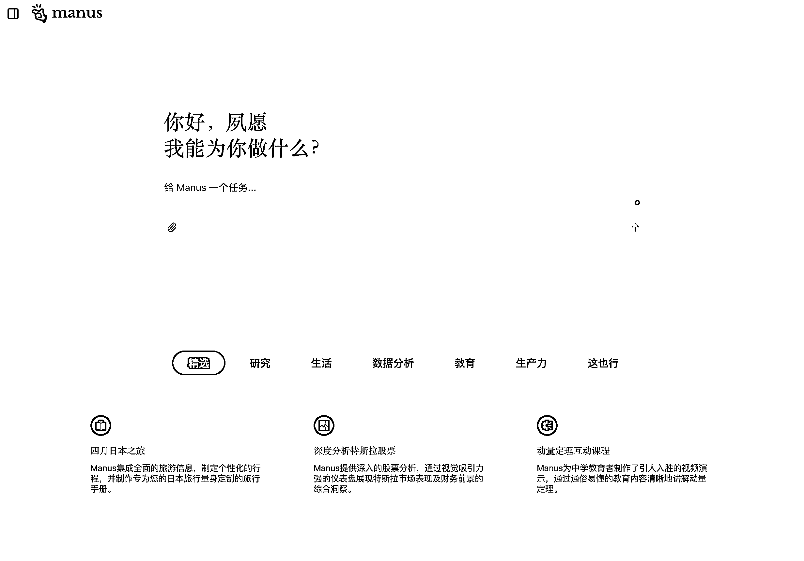
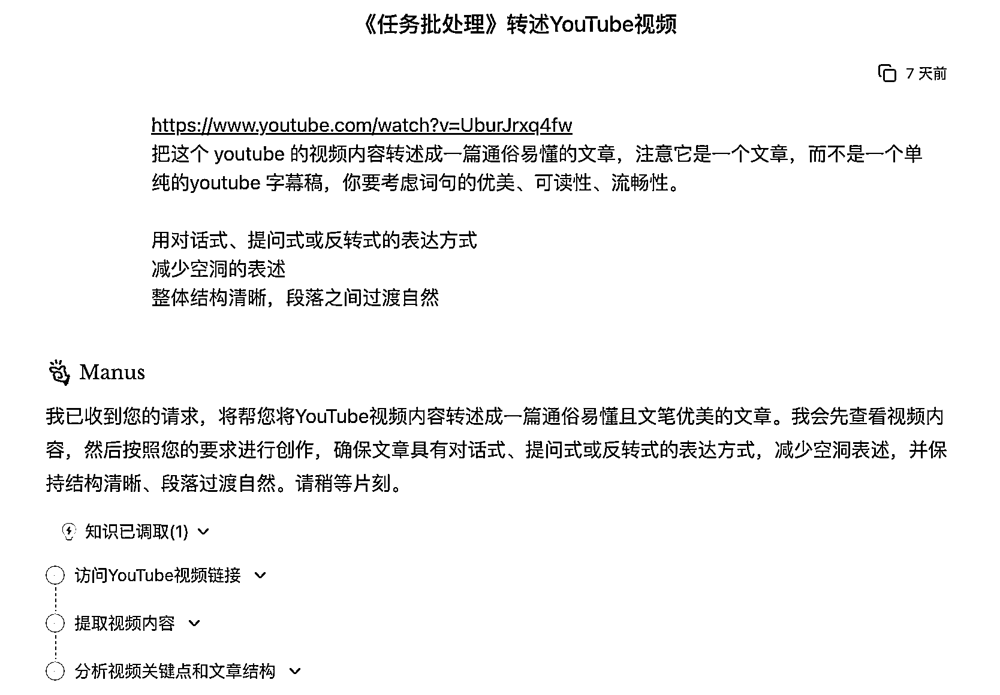
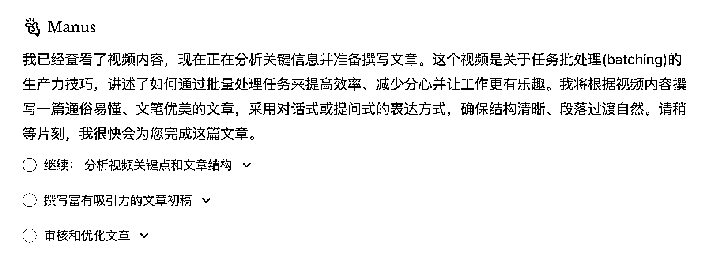
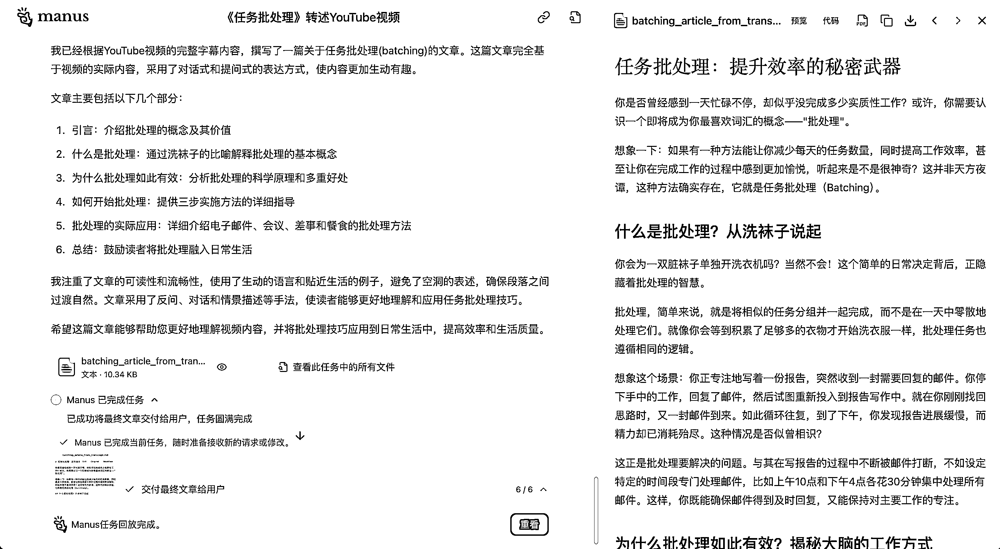
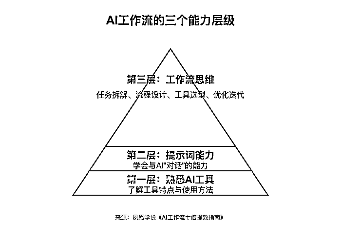
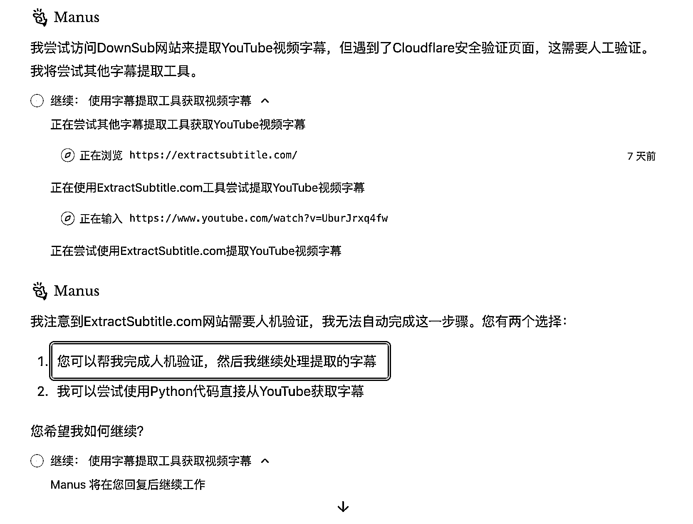
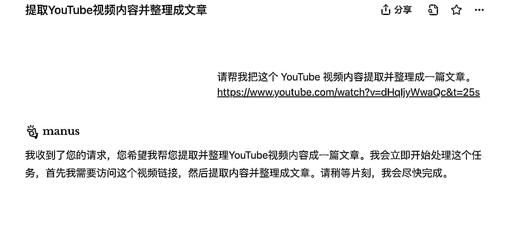
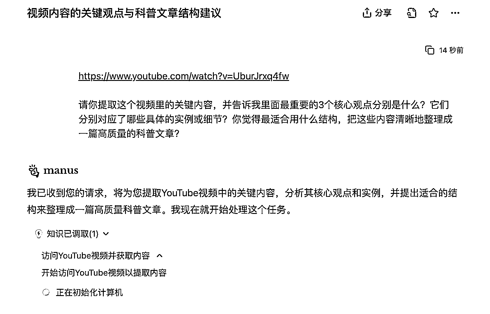

# (24 赞)AI 变得越来越聪明，底层工作流思维永存

> 原文：[`www.yuque.com/for_lazy/zhoubao/pwv0pol2rg8qc4o8`](https://www.yuque.com/for_lazy/zhoubao/pwv0pol2rg8qc4o8)

## (24 赞)AI 变得越来越聪明，底层工作流思维永存

作者： 夙愿学长

日期：2025-03-26

最近，AI 工具的迭代速度实在太快了，特别是各种所谓的“通用 AI Agent”，一出来就是“颠覆”“革命”这种大词。

前段时间我体验了上了 Manus ，它可以自己拆解任务、自动调用各种插件，甚至模拟人类操作电脑。

第一次用时，我的感受就是：**AI 工作流是不是要被干碎了？**

但几天前，我又在线下活动中，听李继刚老师分享了另一个视角。

他讲到：“**AI 再怎么进化，输入影响输出的逻辑永远不会变** 。”

我越想越觉得，这两件看似无关的事情，其实都在指向同一个问题：

**AI 时代，哪些东西正在改变？哪些东西，其实从未改变？**

今天我来分享一下我的思考。

# 一、Manus 把 AI 工作流给干碎了？

这里我就不再吹 Manus 的牛逼了，相信各位在前几周已经听腻了它的各种吹捧。

尝试用 Manus 做了几个任务后，我一度觉得 AI 工作流可能要被彻底干碎了。

**但冷静下来仔细想想，事情也没那么简单！**

我们来看一个具体案例：我让 Manus 帮我将 YouTube 视频内容转述成一篇文章。

我只需要发送一个简单的提示词，它便自动完成了这个任务的工作流拆解。

第一个大步骤：获取 YouTube 视频内容，具体又拆解成三个小步骤：

1.  访问 YouTube 视频链接

2.  提取视频内容

3.  分析视频关键点和文章结构

看到这里，我心头一凉，心中默念了一句“woc...这”，AI 连工作流的设计都能搞定了，而且拆解得甚至比很多人都清晰。

第二个大步骤：根据提取的视频内容写文章，具体再细分为：

1.  继续分析视频关键点和文章结构

2.  富有吸引力的文章初稿

3.  审核和优化文章

整个过程不到 10 分钟，一气呵成。

看到它如此“懂事”，我一度怀疑：“我们之前辛辛苦苦学的 AI 工作流设计、提示词编写、工具调用，是不是一夜之间都没用了？”

毕竟 Manus 已经能帮我们规划步骤、调用插件，甚至连手动搭建节点的过程都省了。

**但冷静下来后我发现：事情没那么简单。**

我后续做了更多测试，发现：

1.  **写作质量还是有限** ，比不上 GPT-4.5、Claude 3.7，Manus 的模型还没那么强。

2.  如果我想写得有“人味儿”、比如想用对话式、反转式、悬念式的结构，还是得我自己告诉它，不然它只会给我“普通作文”。

3.  某些任务，它做不了，比如打开带验证码的网站，或者某些“审美”和“用户体验”上的判断，还是得人来决定。

也就是说，**AI 再智能，也不是万能的** 。

我们人类依然需要：明确任务目标、判断哪些步骤 AI 可以做，哪些需要人来干预、验证最终结果是否合格。

**所以，AI 越厉害，人类思考的价值，反而更被凸显出来了。**

# 二、AI 时代，工作流思维真的会消失吗？

在之前的“AI 工作流”文章里，我曾经提到三大关键能力：

1.  AI 工具选型能力

2.  AI 提示词编写能力

3.  AI 工作流设计能力

从刚才的案例中我们看到，以往我们在扣子、Dify 等平台上手动搭建工作流、插入节点、调用插件的能力，似乎已经被 Manus 这种 AI 干碎了。

它不仅能自主拆解任务，还能自动调用插件、写代码，甚至可以通过操控电脑获取信息。

再说提示词能力，现在 AI 已经聪明到能够主动推测我们的意图了，我甚至不需要告诉它每一步具体怎么做，它就能主动完成。

至于 AI 工具选型能力，Manus 这样的通用 AI Agent 几乎无所不能，而 AI 本来就是设计给普通人用的，使用门槛本就应该很低。

**就像我们用百度搜索一样，谁会去专门学习“如何使用百度”？**

看起来，Manus 把这三样全干了。

**但事实是 AI 变得更智能，并不意味着工作流思维就会失效，相反，现在更考验的是：**

**1、工具选型还在**

如何巧妙结合自主代理（Manus）和最新大模型（如 GPT-4.5、Claude 3.7）？

比如 Manus 背后的模型并非目前最先进，在写作能力上仍有所欠缺。如果能搭配更强的 GPT-4.5，输出的内容质量将大幅提高。

所以，这不还是 AI 工具选型能力吗？

**2、提示词依然关键**

如何精准地定义任务目标、约束条件、验收标准？

就拿上面的案例来说，如果我不知道将 YouTube
视频内容可以转成一篇文章时可需要：用对话式、提问式或反转式的表达方式、减少空洞的表述、整体结构清晰，段落之间过渡自然。

那 AI 会按照这样的方式去输出吗？

不会，它只会按照默认的方式去写文章，或者就跟“抽盲盒”一样，有的时候是使用对话式来写、有的时候使用提问式来写，有的时候使用反转式来写。

我们的「输入」是会影响到 AI 的「输出」的。

所以，这不还是提示词能力吗？

**3、工作流设计更重要了**

如何设计可靠的 AI 结果验证机制、如何优化人机协作的边界？

在这个任务中，有些步骤 Manus 就无法独立完成，比如打开某些网站时涉及的人机验证环节，依然需要人为干预。

工作流中哪些步骤能完全交给 AI，哪些必须人机协作，哪些只能人工完成，这一能力在 AI 越来越智能的情况下反而更加重要。

这不还是工作流设计能力吗？

**所以，看似“AI 自己能干一切”，但真正用得好的，依然是那些有工作流思维的人。**

# 三、提示词会不会越来越不重要？

接下来说说我在李继刚老师线下活动里的一些收获，他提到一个观点，我觉得特别受用：

**“只要输入会影响输出，提示词就永远不会消失。”**

你得知道什么时候要“多说点”，什么时候“少说点”。

这就涉及一个很好用的沟通模型：**乔哈里视窗。**

### 1、乔哈里视窗模型

乔哈里视窗把人与人之间的信息分为四块：

1.  **公开区** ：你知道、我也知道

2.  **隐藏区** ：我知道、你不知道

3.  **盲区** ：你知道、我不知道

4.  **未知区** ：我们都不知道

**人与 AI 的沟通也是这样。**

**对“公开区”的内容，可以少说；对“隐藏区”，就要多说，甚至给例子。**

例如，“模仿鲁迅的写作风格”这句话足以让 AI 理解很多深层信息，因为在 AI 的大模型中，“鲁迅”背后就意味着特定的历史、写作技巧和思想批判性。

但如果是“隐藏区”——比如我要 AI 模仿一种只有我自己才了解的个人风格，比如“夙愿的表达方式”，AI
并没有相关训练数据，那我就要在提示词里“多说点”或给示例，只有这样 AI 才能抓住我想要的独特风格。

同理，“盲区”代表 AI 可能比我知道更多——我得懂得提问，才能让 AI 把它的知识挖出来；“未知区”就是双方都不知道的领域，可能需要进一步探索或创造。

### 2、提示词为何有时要“多说”，有时要“少说”

基于乔哈里窗，我们就能理解：

1.  **“少说”** ：在公开区，AI 已经具备足够多的常识和上下文，只需要扼要提示即可；说多了反而会限制 AI 的发挥。

2.  **“多说”** ：在隐藏区或未知区，AI 并没有先验信息，为确保结果更贴近我们的真实需求，就必须补充足够的上下文或示例。

这才是“提示词升级版”的精妙所在：与其一次性写得冗长，不如懂得何时补充信息、何时留白，同时利用“少样本示例”来给 AI 打补丁。

# 四、Manus 结合提示词思维的实操

简单回顾一下乔哈里视窗：

**公开区：** 提示词可以少说（因为 AI 知道的够多了）。

**隐藏区和未知区：** 提示词要多说（因为 AI 不清楚，需要我补充更多细节）。

**盲区：** 提示词要学会提问（因为 AI 懂更多，我要通过提问挖掘它的知识）**。**

接下来我们实际操作一下，还是之前的任务：

“将 YouTube 视频内容转成一篇高质量的文章。”

在用 Manus 做这个任务之前，先问自己两个问题：

**哪些部分 Manus 已经懂了（公开区），我可以少说？**

**哪些部分 Manus 不懂（隐藏区、未知区），我需要多说一点？**

以下是几个实操案例：

### 示例 1：提示词**少说** 的情况（公开区）

当我们只是想得到视频内容的常规总结时：

**示例提示词** ：

请帮我把这个 YouTube 视频内容提取并整理成一篇文章。

❌  **不要写成下面这样（太多了，没必要）** ：

请你打开 YouTube
网址：xxx，然后你访问这个链接之后，请先将视频的字幕提取下来，接着你再逐步分析视频的关键要点，完成之后你再对照视频内容组织文章，要求结构清晰，每个段落都要有小标题，全文字数 800 字左右。

为什么上面那个反而不好？

因为 Manus（作为一个 AI Agent）本来就知道要做哪些常规步骤：

打开链接 → 提取字幕 → 分析内容 → 输出文章

你“少说”，它也能很顺畅地完成任务。

### 示例 2：提示词**多说** 的情况（隐藏区、未知区）

如果你对最终文章有自己独特的偏好或风格（隐藏区），AI 并不清楚：

例如：

1.  文章必须用提问式的口吻；

2.  每段文字不能超过 200 字；

3.  结尾必须用“反转”让读者印象深刻。

**你就需要写成类似下面这样（提示词多说）** ：

把这个 youtube 的视频内容转述成一篇通俗易懂的文章，注意它是一个文章，而不是一个单

纯的 youtube 字幕稿，你要考虑词句的优美、可读性、流畅性。

用对话式、提问式或反转式的表达方式

减少空洞的表述

整体结构清晰，段落之间过渡自然

这时候就不能少说了。

**如果你只说一句“请帮我转成文章”，Manus 不可能知道你有这些特殊要求。**

### 示例 3：提示词需要提问的情况（盲区）

比如你拿到一个很专业的视频内容，自己完全不熟悉，但知道 Manus 应该懂（盲区），如何挖掘 AI 知识呢？

这时提示词可以设计成“向 AI 提问”的模式，比如：

请你提取这个视频里的关键内容，并告诉我里面最重要的 3 个核心观点分别是什么？它们分别对应了哪些具体的实例或细节？你觉得最适合用什么结构，把这些内容清晰地整理成一篇高质量的科普文章？

这个时候，我们需要的是 Manus 来告诉我它理解了什么、为什么这么理解、以及推荐我该怎么做。

而不是直接告诉它“你给我写一篇”，因为你其实不清楚里面的知识体系（盲区），需要 AI 告诉你。

下一次，你在类似 Manus 这样的 AI Agent 使用中遇到新任务时，先花 30 秒这样思考：

1.  我想做的这个事 Manus 肯定懂吗？懂 → 提示词少说。

2.  这是我的个人偏好、或 Manus 未必懂吗？不懂 → 提示词多说，给示例或说明。

3.  这是 Manus 更懂的领域吗？那我用提问式的方式，让它告诉我更多。

4.  这是新东西、双方都没底？和 Manus 一起探索，互相问答。

# 五、不变的，是思维与沟通

很多人以为，随着 AI 工具越来越智能，人们学习知识的门槛会越来越低，知识会更加“平权”。

然而，我认为：**“AI 的出现，可能会让知识的贫富差距更加拉大。”**

会用 AI 的人，懂得如何提问、如何借助 AI 在短时间内获取和处理海量信息，于是知识积累越来越深厚；

而不会用 AI 的人，则可能在短视频、娱乐信息的轰炸中越来越放弃“主动学习”，甚至连最基本的与 AI 沟通都懒得深入尝试。

久而久之，“知识贫富差距”只会越拉越大。

这是一个值得警醒的趋势。不是每个人都会想要提高提示词能力，也不是每个人都愿意挖掘 AI 的潜力。

就像很多人买了付费课程却很难完播，学习总是停留在“心理安慰”阶段，沉迷于短暂的娱乐刺激。

**只有那些主动学习、愿意深度思考、不断优化输入输出的人，才能借助 AI 真正加速。**

是，AI 工具确实变得越来越聪明，Manus、GPT-5、Claude-4 都在朝更强的方向演化。

以后我们用 AI 也许真的会越来越简单。

**但，越是简单，越考验的是我们背后的能力：**

1.  你有没有想清楚目标？

2.  你能不能清晰表达需求？

3.  你知道怎么让 AI 做得更好？

Manus 这样的 AI Agent 代表了 AI 工具的未来趋势，据说 GPT-5、Claude-4 等下一代模型也将达到这种 L3
级别，可以更自主地帮人类完成工作。

未来，我们在使用 AI 时，可能确实会越来越轻松，手动操作越来越少、需要输入的提示越来越简单、规划步骤的负担也越来越低。

但“变少”并不代表“不需要”。

**以不变应万变，这种长期积累的能力远比追逐短期的 AI 工具热点更具价值。**

以上，创作不易，既然看到这了，那就点个赞吧～

* * *

评论区：

暂无评论