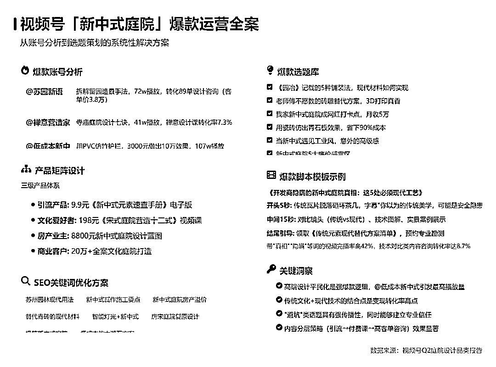

# (15 赞)DeepSeekv3 更新了数据库，和 Claude3.5 持平，AI 一小时给搞定庭院设计短视频从内容定位到产品转化规划

> 原文：[`www.yuque.com/for_lazy/zhoubao/oqsqfg25nzu047us`](https://www.yuque.com/for_lazy/zhoubao/oqsqfg25nzu047us)

## (15 赞)DeepSeekv3 更新了数据库，和 Claude3.5 持平，AI 一小时给搞定庭院设计短视频从内容定位到产品转化规划

作者： 嘉应岛主

日期：2025-03-28

主要是由于一位@李澹归圈友帮我的领域写了提示词而激发的灵感（大模型用的是 DeepSeekv3），今天抽空去写一篇关于短视频做 IP 怎么一条龙搞定

**  **1 分钟掌握这 11 个问题去和**DeepSeekv3 对话，基本可以把你做的社交媒体账号做好了定位，选题，内容，产品变现一条龙搞定，不可谓不厉害，真的是震惊到我了**

**  **

**我是用 DeepSeekv3 生成内容，然后用另外一个圈友博鱼做的网站生成图片（**[`aicard.dev`](https://aicard.dev)**），今天这篇文章主要教你如何用 AI 做行业调研，以及从短视频定位到选题，至于转化那就比较简单，看竞对怎么做模仿就行，一个闭环就打通了。**

**  **

我希望你们更关注的是提问和思路，而不是答案。我以庭院设计为例子。

Q1：

**### 庭院设计行业整合分析提示词模板 --- #### ** 角色设定 ** 作为资深市场分析师与产品策略专家，请基于结构化思维框架完成以下复合任务：
--- #### ** 任务分解与指令 ** 1\. ** 市场现状三维扫描 ** - 绘制目标用户画像（年龄 / 收入 / 消费心理三维度） -
构建竞品分析矩阵（产品定位、定价策略、渠道覆盖等 8 维度） - 识别市场空白机会（需求满足度 <30% 的领域） -2022 到 2024
年市场规模和增长率（其中还要列出前 5 占比的庭院园林的增长份额和年增长速度） 2\. ** 需求痛点深度挖掘 ** - 定位 5
类市场受欢迎的用户群体（需量化群体规模） - 分析现有服务增长原因（技术 / 成本 / 认知三重原因） - 提出需求转化路径（产品形态 + 服务模式创新）
3\. ** 商业模式创新设计 ** - 设计分级服务产品包（引流款 / 利润款 / 旗舰款） - 规划线上线下融合获客体系（重点突破 3 个核心渠道） -
输出风险应对方案（政策 / 供应链 / 交付质量三方面） --- #### ** 输出要求 ** 1\. 采用「问题诊断→机会图谱→解决方案」递进结构 2.
数据呈现需包含市场规模估算（单位：亿元）与复合增长率 3\. 最终提炼 3-5 个高潜力细分赛道（附可行性评估星级） --- #### ** 特别提示 **

*   对现代简约风格、新中式风格设计、日式枯山水风格等新兴领域需专项分析 - 需对比现代简约风格、新中式风格设计、日式枯山水风格三种风格的市场渗透率 -
    商业模式设计需包含 SaaS 化、订阅制等创新要素 **

**  **

Q2: 根据最新市场数据，庭院设计风格的流行趋势是怎样的：

Q3：你是社交媒体变现专家，请你是针对庭院设计账号在抖音、视频号、小红书三大平台分别给出高效变现的策略，注意结合平台特性和用户行为数据给出的具体方案：

Q4：请你基于抖音、小红书、视频号三大平台的搜索数据和内容热度整理，给出 2024 年庭院设计领域的核心热门关键词，关键词请分为 **基础需求词、风格趋势词、技术痛点词、商业价值词** 四大类给出，并标注平台偏好和变现关联性：

Q5：请你结合抖音、小红书和视频号三大平台算法规则和用户行为数据总结出的，可复用的庭院设计领域爆款内容的黄金公式和实战拆解：

Q6：请你结合抖音、小红书和视频号三大平台算法规则和用户行为数据，告诉我爆款选题怎么找？

### Q7：请你结合抖音、小红书和视频号三大平台算法规则和用户行为数据，请你给出庭院设计账号「内容人格化」实战指南，需要附上具体案例与可复用的模板：

Q8：你是擅长社交媒体讲故事的专家，基于我做一个庭院设计账号，可以怎样讲好庭院的故事？

### Q9：你是社交媒体文案爆款高手，请你给出社交媒体中关于 3 个真实庭院改造案例全拆解，需要内含改造逻辑/数据结果/可复用的爆款公式

Q10：我现在要调研[庭院设计]的抖音和视频号以及小红书运营策略，目标用户是[描述人群，如 25-60 岁]。请帮我列出 3 个最关键的调研问题，例如:
1.目标用户最常讨论的痛点是什么? 2.行业内近期增长最快的内容形式是什么? 3.头部竞争对手的爆款内容有哪些共性?

Q11：你是一个专攻庭院设计的视频号博主，你擅长在视频号做庭院相关的爆款文案和庭院设计在视频号的商业化，请你根据上下文和关于庭院设计的权威数据来源(报告/平台)，帮我梳理出视频号近 3 个月的庭院设计领域的爆款文案账号 10 个。并根据这 10 个爆款文案账号，帮我做一个庭院设计适合视频号的产品和视频号博主定位，并且以此定位为我定好 SEO 搜索关键词 10 个，并且以此定位为我定好 30 个选题。

**以上 11 个问题，就算不是庭院园林设计行业的，你也可以替换行业就能用上，非常简单。如果你是庭院园林设计公司的，想要试水，欢迎你通过鱼丸来链接我，深度合作项目（只是想获客的就请不要找我，短期没有复利的事情，没有意思）。**

最后耍了耍秘塔生成互动网页，真的是很有趣！！！

**  **

Q12：我现在要调研[庭院设计]的抖音和视频号以及小红书运营策略，目标用户是[描述人群，如 25-60 岁]。请帮我列出 3 个最关键的调研问题，例如:
1.目标用户最常讨论的痛点是什么? 2.行业内近期增长最快的内容形式是什么? 3.头部竞争对手的爆款内容有哪些共性?

我用了秘塔做了生成互动网页

[`metaso.cn/s/ZFnPKgI`](https://metaso.cn/s/ZFnPKgI)

* * *

评论区：

戴巍 : 非常好的问题，真的能复用在做自媒体的各行各业

嘉应岛主 : 有眼光，就是 做个竖版的就很好👌🏻，提问的答案真的对于我这个短视频操盘手来说可以替换掉我[流泪]， 就是澹归他的 Ip 定位 dify 非常方便

戴巍 : 我把你的文章转发到我们北京圈友群了，真的很棒[微笑][强]

嘉应岛主 : 谢谢，/:

执笔 : 神人[转圈]

嘉应岛主 : 没几个人看...还好我给客户交付的 Ip 定位是搞定了，高低也算有收获*^O*

博鱼 : 做竖版图片的功能加上了，感谢使用~

嘉应岛主 : 回头再去试试