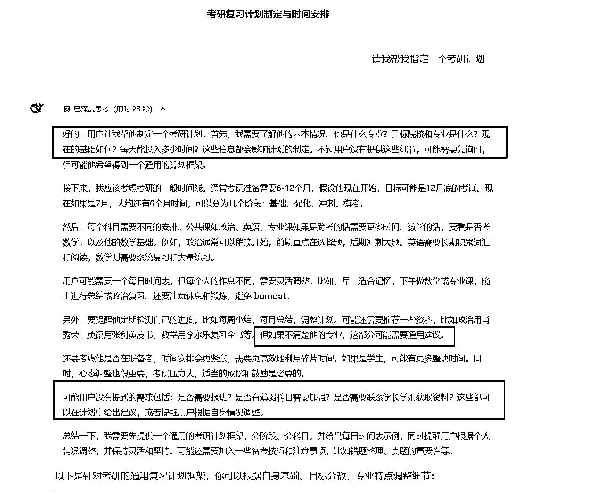

# (0 赞)写给 Deepseek 新手：只需三个技巧，轻松进阶 AI 对话

> 原文：[`www.yuque.com/for_lazy/zhoubao/is4idvxgm84wsr33`](https://www.yuque.com/for_lazy/zhoubao/is4idvxgm84wsr33)

## (0 赞)写给 Deepseek 新手：只需三个技巧，轻松进阶 AI 对话

作者： 瑛子 Adaaaaaa

日期：2025-03-24

不知道还有没有新手小伙伴，像曾经的我一样，对 DeepSeek 似懂非懂：面对 DeepSeek（简称 DS，下同）对话框仍略有惶恐，不知该从何下手；草草几轮对话下来，AI 废话一箩筐，可用信息寥寥无几~

借力 DS 航海项目，我快速自学了多项资料并结合自己的心路历程，梳理出 3 个重要但容易被新手忽略的技巧。希望能通过下文大白话的解释，能让还在入门的小伙伴早日享受 AI 工具带来的生产力提升！

# 技巧一：如何与 AI 沟通？

这里借用乔哈里视窗的逻辑说明。

第一象限，人知道+AI 知道：简单说，比如“生成一段代码”。

第二象限：人知道+AI 不知道，那就需要用户喂素材给 AI 分析，“你是一个漫画家，请请分析附件图片的特征，创作一幅以 XX 为主题的漫
画，要求风格/色彩/构图与附件相似”。

第三象限：人不知道+AI 知道，可直接提问，比如“请介绍机器学习的基本原理”。

第四象限：人不知道+AI 不知道，双方开放式探讨，比如”未来 10 年 AI 发展进程“。

## 1.基础提问：背景+需求+约束

比如：我要写一篇以“职场”为主题的公众号文章（背景），请帮我生成 10 个受欢迎的爆款标题（需求），每个标题在 20 字以内（约束）

定义好这 3 个要素，DS 能满足我们日常大部分基础需求。

## 2.进阶提问：多轮对话或者使用结构化提示词

结构话提示词的框架很多，比如**RTGO**(Role-Task-Goal-Objective)，又比如**CO-STAR**(Context-
Objective-Style-Tone-Audience-Response)，这里不再赘述，大家可以自行查阅。下面是一个简单的应用示例。

## 

## 3.高阶提问：形成自己的提示词模板。

如何形成自己的提示词模板呢？

分享一个技巧，先尝试一个模糊的问题，根据 DS 思考过程中的反馈，及时补充缺失的提示词（如红框处）。注重总结和归纳，就能形成好用且独一无二的提示词模板。

# 技巧二：如何应对答非所问的 AI？

### 1.可尝试优化提示词，比如补充上下文、提供更多背景信息。

比如，“怎么减肥”改为“作为健身教练，给 BMI 大于 30 的大基数肥胖人群推荐 3 种适合的运动方式。”

### 2.也可以增加约束条件，避免预期偏差或者 AI 幻觉。

比如“任何情况下不得捏造事实”，“不要展开讨论，只提供核心结论”，“不要把你的建议单独给出，而是融入在短视频脚本中”（感谢@教练-
辛亥，在航海中提供了非常生动且实用的分享）。

### 3.如果对话过多，AI 返回的信息开始混乱，则可以帮助 AI 理清上下文。

比如“根据我们之前讨论的【XX 方案】，请进一步讨论【XX 需求】”。
或者“让我们重新梳理下当前的讨论。1.已确认的信息：【】；2.待解决的问题：【】；3.下一步的重点【】”。

# 3. 如何选择模型？

选择适合的模型也能帮你更快实现目标，事倍功半。

常见模型分为**推理模型（DS-R1）** 和**非推理模型（DS-V3）** ，前者具有自主深度思考的能力，后者更适合轻量级任务。打个可能不恰当但生动的比方，**R1 像思维缜密的大学教授，善于推理** ；**V3 像打直球的体育生，问什么答什么，简单直接** 。

R1 模型看起来更厉害，并不意味着所有的任务都离不开 R1，有些情况 V3 的表现更好。那到底该选择哪个模型呢？这里用一个表格展示。

| DS-V3| DS-R1| 联网搜索  ---|---|---|---  基础问题| ✌胜出选手，擅长简单任务，高效直接| -| 联网状态可以搜索最新的参考信息，适合时效性较强的问题（例如实时新闻、最新政策等）  中级问题| 需拆解复杂问题，用**结构化提示词** 或者**多轮对话** 分步引导 AI 回答，避免一开始就提出复杂笼统的问题。| **不要再提示词中加步骤，除非作为约束词** ，推理模型通常能够根据上下文自主生成最优答案。  复杂问题| -| ✌胜出选手，善于解决复杂问题并给予高质量的分析过程

👇下图分享清华的一个图表，直观感受任务类型/模型选择/提示语之间的关系~

好的，如果上述 3 个讨论你都觉得很清晰，那恭喜您，至少是预备役的中高阶玩家了，可以开始享受 DS+公众号/小红书/海报/飞书多维表格……DS 无限叠叠乐！！！

* * *

评论区：

暂无评论