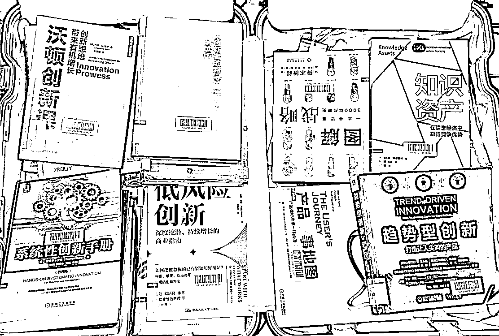
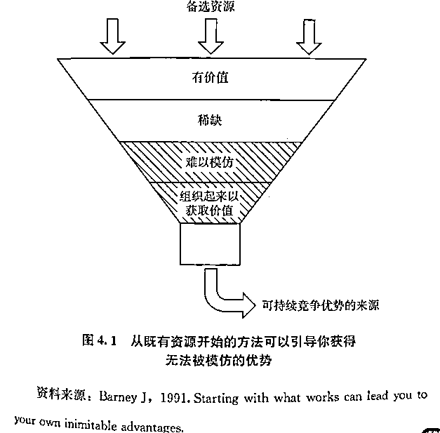

# (精华帖)(74 赞)新人如何跨界做项目-以亚马逊为例

> 原文：[`www.yuque.com/for_lazy/zhoubao/nqsgcvmxz6h3lqs2`](https://www.yuque.com/for_lazy/zhoubao/nqsgcvmxz6h3lqs2)

## (精华帖)(74 赞)新人如何跨界做项目-以亚马逊为例

作者： 老黄牛

日期：2025-03-28

最近 1 年半，聚焦亚马逊，很久没露面了。在航海家群提到“亚马逊第一个品开始盈利，后面没有品是亏的，成功率 80%”后，@黄小鱼 小鱼叫我分享一下，我就来了。

其实也没这么神，一个是 seven 指导得好，一个是自己开品不多，也慢（小孩刚出生，想平衡一下）。有运气，也有自己努力的地方。

不过这次分享相信还是能给大家一些启发。

# 一、师傅领进门。引路人很重要，也不重要。

## 引路人的重要性

我的引路人、师傅、贵人，是@SEVEN（龙珠榜 top1 大神）
，我开了一家公司的名字，是两个字，一个字是我女儿名字其中一个，一个和 SEVEN 有关的名字。嗯，可想这两个人对我的重要性。

有幸在 SEVEN 的 408 工作几个月，有 SEVEN 的手把手教学，也和小焦、蕣等 408 其他几位小伙伴一起交流，把跨境的基础流程打通，也掌握了选品。

第一个品，SEVEN 认为不会太差，就开始做。第一个品就开始盈利，无论是资金、信心方面，都为后续打下极大的基础。

## 引路人也不重要

大家听了，第一时间肯定在想，快快找到 SEVEN，逆转命运。

但如果你以为有 SEVEN 教过，就可以盈利，那就大错了。

后来了解到，去 SEVEN 哪里学的人不少，失败的也不少，亏个十几万再成功的更是多数，第一个品赚钱的可谓极少。

“师傅领进门，修行在个人”。高人的点醒都是一句话，不要想着保姆式喂饭。

“修行在个人”“修行在个人”“修行在个人”

文章下面我会讲讲，我在修行时的经历和思考（本文重点）

### 反事实思考

怎么能有“贵人指点”呢？首先，要感恩。

人，都喜欢把成功归于自己，把失败归于别人。

1.  贵人指点一句话，通过自己艰苦努力，成功了。你说“他就一句话，我的成功都是靠自己的，关他什么事。”

2.  “引路人”指点一句话，自己往这方向做，但方法错了，最后失败了，就把失败归功于“引路人”。以后谁敢给你建议？（没成功就是引路人，成功就还是贵人）

高人的点醒都是一句话，不要想着保姆式喂饭。

怎么判断一个人是否“引路人”，给大家推荐一个检查工具：

**反事实思考：**如果当时情况不同，结果会怎样

举例：

**这是引路人：**

1.  行业前辈指出一个新兴市场机会，并分享如何切入的具体策略。

2.  给你引荐了关键客户或合作伙伴

3.  师傅手把手教你一门手艺的关键技巧和窍门

**这不是引路人（但也应该谢谢帮助）**

1.  朋友建议你"要努力工作"或"多读书"等缺乏具体的指导

2.  网课老师教可以在公开渠道轻易获取的基础知识

（因为你朋友没有建议你“努力工作”，你也很可能会在书本、网上找到类似建议。）

没有生财，我会认识 SEVEN 吗？肯定不会，所以生财也是我的引路人。

但不是有了生财引路人，你就必然有收获。问问：自己是否有全程投入?例如不断输出获得信任？有无以诚相待？有无积极参加线下，积极链接？

总价：引路人很重要，没有它，要走多少弯路？但他也不是很重要，成不成功，修行还是靠自己。

# 二、找到什么是“不可行”

刚强说了“师傅领进门”

现在说说：“修行在个人”，我具体做了什么。

我认为任何领域都一样，要学会成功，首先要避免失败。

因为成功的方法各异，而且通常可行的未必会公开，所以首先是要找到怎么失败的，然后去避免。

## 失败一：成本过大

**机会到处都是，唯一的条件是：你还活着**

电商项目和网赚项目不同，就是需要实体资金投入。（这是劣势，也是优势，可以排除没有资金的人）

不少老板还没开始赚钱，就租场地、招人。每个月就固定成本就 1 万？能活多久？

赚美金汇率 7:1，赚钱是很爽的，但亏时，是极惨的。广告一个点击 1 美金（7 元），每天点几十下，不赚钱那就很快顶不住了。

很多现金流出现问题，供应链出现了断裂，无法留下。

我的成本是极度压缩，在家打包，书房当仓库（周转一下马上发货，不太占地方）。从 0-1 时期不找人，除了节省资金，还能摸清各个环节。

**不要拉长战线**

从 0-1 阶段，我不会去扩充市场，无论精力上和资金上，都不允许。

首先最聚焦的产品如何做好创新、研究平台、研究市场、研究透细分领域的受众。等技术成熟了，有一定团队可以分解压力的时候再去扩。因为每个市场的调性和客户的习惯不一样。你重新去研究，又会分散精力。

## 失败二：做大市场、做爆款

大部分人喜欢做爆款，都问“这市场容量大不大”。其实这不是初创个体/企业的选择。

刚开始应该做“成熟企业/大卖”不会做的事，越麻烦、空间越小越好。

先赚小钱，赚经验。积小胜为大胜，越过就会越好。

开始做爆款的风险是，哪怕产品开始有大流量，发大货时，很可能流量突然没了（或者违规或者被对手盯着攻击），挤压大量资金然后不得不退出市场。经我研究，这种情况很多。

## 解决方法：

**找弱的打**

战术只是解决怎么打的问题，战略才解决打不打、跟谁打、在哪儿打、何时打这些更为关键的问题。

当你在面对规模比你大得多、资源比你多得多的对手的时候，不要在需要投入大量资源的市场与领域跟对方较量。

比较好的办法是：选择相对狭窄的细分市场和业务，找到弱的对手（产品、运营都差），从而发挥优势（供应链+创新）

不做爆款，先找弱市场练手。

**侧面进攻，逐步扩大优势**

作为挑战者，不要从对方所在的主要市场发起正面进攻，至少一开始不要。你可以从对手防护不严密的边缘性市场迂回进入。

先占据边和角那些具有战略价值的地方，先立于不败之地，然后以此为根据地，依托这些边和角，寻找机会向中腹发展。得一寸是一寸，得一尺是一尺。

举例：蓝牙耳机是很大的市场，排名第一的肯定厉害，如果你直接打这个市场（正面进攻），必败无疑。

这时可以开发一款“儿童听书耳机”，再开发“儿童运动耳机”，“女性运动耳机”，然后围绕细分打造“耳机“名声，然后就形成优势了。

## 失败三：价格战，最下策。

很多人看到有爆品，而且利润可观。就会直接拿相同的产品，然后打价格战。

伐谋、伐交、伐兵、攻城，就是竞争的四个层面。最下策是进攻对手设防坚固的城池。_

大卖的爆款产品，广告贵，再也低利润，杀敌 1000，自损 800，打不打赢不一定，先亏是肯定的。

解决办法：

有三样我是必做。

①产品创新、功能上做出来的必须比对手有优势

②研究客户需求，找到客户必要的需求。

③研究竞争格局，只选弱的对手。

价格战我是坚决不打的，有时还比对手贵，卖得比对手好。

## 失败四：自己不下场，想招人解决

很多案例是，很多做国内的小老板，想通过组建团队来进军海外。

例如花个 100 万招人，找产品开发，找运营。这种失败的概率也是挺高的。

**盲人摸象**

根据我自己亲自下场的经验，选品和运营是不分开的。

我很多选品的数据是从广告报告获得，有几次选了品，开始没有流量，以为产品不行。但经过不断测试运营手段，产品又行了。

很多灵感，甚至从打包的时候获得。

所以我认为，在 0-1 阶段，自己必须最好下场，然后逐步搭建 SOP，逐步外包。

## 失败五：关注利润，不关注现金流

很多基金经理不是通过提高能力来提高收益，而是通过提高风险来提高收益——查理·芒格 _

**  **

**利润不等于现金**

一个误区：只要产品有利润，生意就能做下去。

库存不就现金：假设一件货成本 50 元，卖 250 元。高利润率，感觉一片大好。但在亚马逊这个生态里，这种想法极其危险。

亚马逊是重库存模式。你需要先垫付大笔资金采购货物，这些货躺在 FBA 仓库里，虽然是你“资产”的一部分，但它们不是现金。利润再高，如果货卖不出去或者周转极慢，现金就被“冻结”在库存里。

**增长陷阱：** 生意增长看似很好，但快速增长对现金流是巨大的考验。销量翻倍，意味你要准备可能不止双倍的库存。很多看似“成功”的店铺，正是死在扩张太快、现金流断裂的路上。

解决方案，和之前提到相似，资金不足不做爆款，做压大资金的产品（周转慢或者成本高）

# 三、找到“什么是可行的”

**关注源头知识**

很多人靠自媒体获取知识，而不是源头知识。这样在开头就错了。

以投资为例，很多人每天听“大 V”分析市场，就是自己不啃经典。

亚马逊有“卖家大学”，这里面基础知识是很完善的，但看的人不多，都去自媒体搜。

比如很多博主，会提到“刷单资源”，然后怎么找亲戚开多店（避免封店），怎么找律师解店。

其实本质从“刷单”开始就错了，因为他们没有研究平台，还用国内的打法。

**  **

**每个平台都有自己的调性**

例如“砍一刀”卖盗版书比较多，高价很难做。

但亚马逊是数据公司，做假和平台对着干，一个全球最厉害的数据公司能不知道你的伎俩？

## 1、多算胜，少算败

在开始做之前，要步步为营，边学边干。首先是大方向。

研究亚马逊平台调性、研究创始人。研究创业、研究创新。

这对我战略帮助是极大的。

**研究亚马逊平台时看的一些书**

 images.zsxq.com/FrSbuZdZVTS1k81nhB7uRVohqall) images.zsxq.com/FtE28cti-1zZFaeZ1U8tZUsKmZ7g)

研究创新、战略时看的书，批量阅读，对我帮助极大。

## 2、在自己身上，找到信息差

打仗经验是个慢慢积累的过程，所有经验和教训都不能白白浪费，他对韦岗伏击战进行了“复盘”，从地形选择、火力配备等十个方面，一个个细节抠，抠到手榴弹投掷量应提前多少米，都做了分析。——战神粟裕

### ①、从行动和反思中获得知识和一手信息

战略知识是可以从外面学到。信息差偶尔在外面也能听到。

但基于自己行动，是能产生大量知识和一手信息的。而一手信息就是信息差。

例如我就从广告报告，包装挖掘到很多外面没有的信息。这对开发产品和创新是极大帮助。

反思，不单单是复盘（做对什么，做错什么），应该是全面性的。

包括为什么会这样想(背后的信念），是什么导致：情境、性格、时机等等，越细致越好。

在创业学上，有一个反思表格，可以参考： images.zsxq.com/FpSFAHH2XbfL0SZxpQZGaHnRRWoo)

### ②、利用旧优势做组合创新

通常遇到问题，我们会寻求外部资源，想到的是去复制同行业或竞争对手的商业运作模式。

但一种更低风险和可行的，是“围绕自己的优势做组合”是很重要的

这样出来的创新，是对手很难复制的。

举例：我有一款产品好卖（例如女性运动耳机），我就开发周边产品（女性运动袜子）。那这就比一开始“女性运动袜子”的人有优势。

例如，我擅长写作、投资，我会开发更多涉及写作、涉及投资的产品。

例如我背靠生财，也是即刻出海圈的主理人，我就会多向亚马逊前辈请教。

这些都是别人复制不来的。

### ③、打造产品开发系统，而不是单个爆品

从追逐单品爆款到构建产品开发系统，也就是一次性成功 vs 持续性系统

从"做什么产品"到"如何持续找到好产品"的思维转变，因为产品开发不是孤立事件，而是一个可设计的系统。

所以每做一个产品，都要极致复盘，这是打磨系统的燃料。逐步优化自己开发系统。

### 后话

另外题外话，ai 对我的帮助极大。

亨利·福特有句名言，大意是在汽车发明之前，如果你问人们需要什么，答案是一匹更快的马 _。

现在我们不要提出“ai 时代，如何让马跑更快”。

很多人太过关注优化工作流，但其实很多几个月后也就是一句话的事。

ai 给我更大的作用是，我能批量阅读，利用优质信息/知识直接让 ai 指点，快速打通几个关键点，战略点。

好啦，这次分享这么多，希望对亚马逊或者新项目从 0-1 阶段有点帮助。也一样链接更多亚马逊前辈，一起交流。

* * *

评论区：

黄小鱼🐠 : 牛哥好快！从投资领域跨行做跨境电商，真的干一行成一行 [强][强][强]

老黄牛 : [抱拳][抱拳]

良辰美 : 非常珍贵的经验，对我过往失败的反思很有启发，太感谢分享了，这是不可多得的非常深入的亚马逊电商实践分析，希望后晚夜话畅聊

光年 : 牛哥太牛，系统化思维，既有战略又重细节[强]

老黄牛 : 好啊，提早聊聊啊

老黄牛 : [抱拳][抱拳]

三告 : 腻害腻害，我没做过，但是老婆在做亚马逊，有些观念很有启发，希望后面可以交流请教

追梦 : 错位竞争确实是个切入市场的好办法[强]