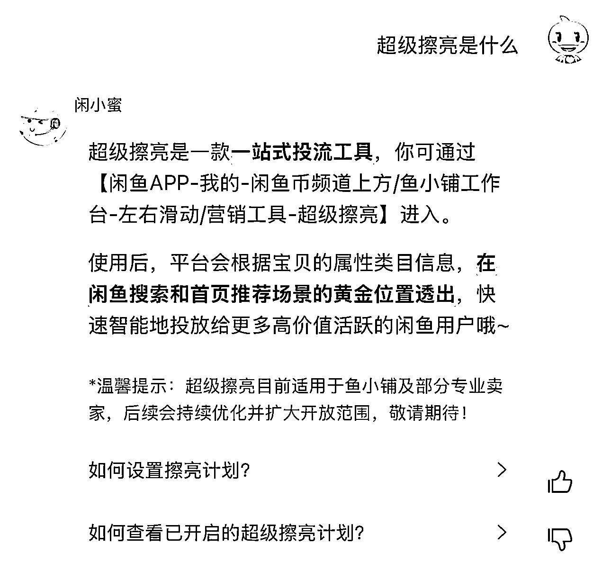
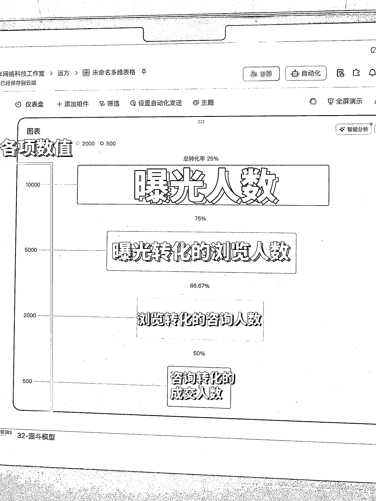
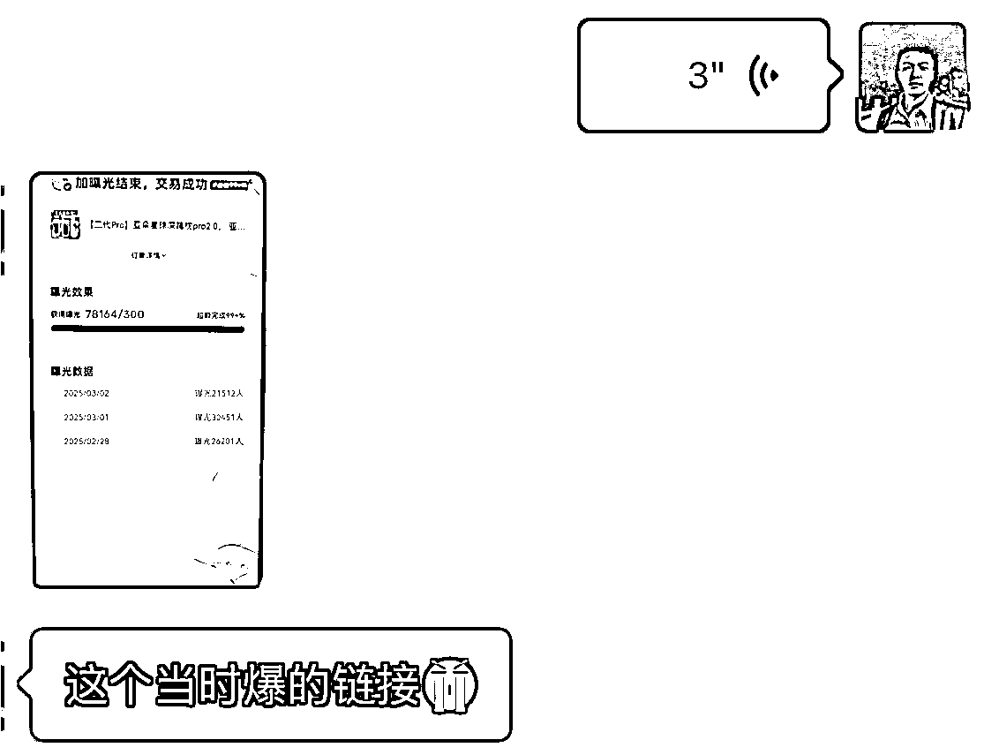
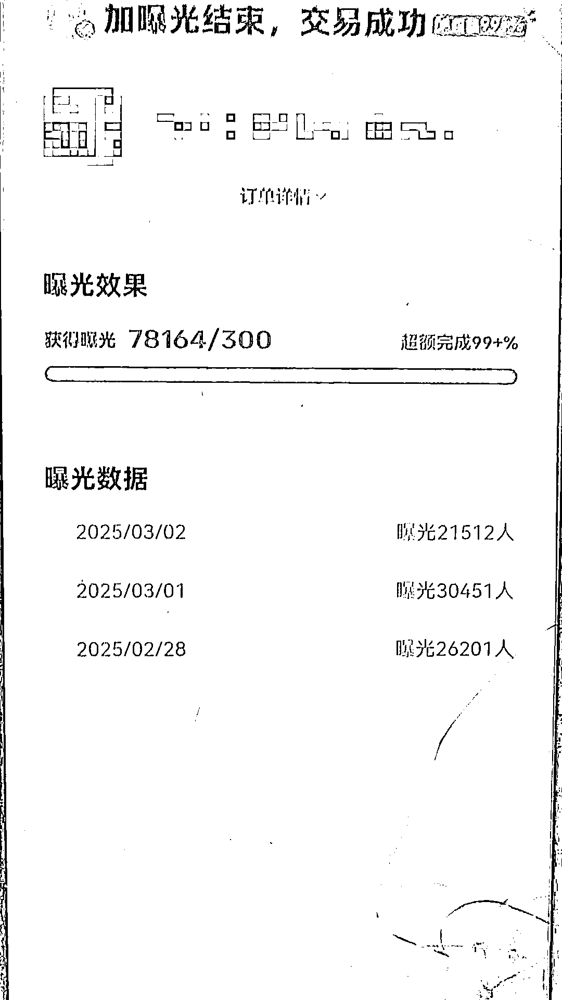
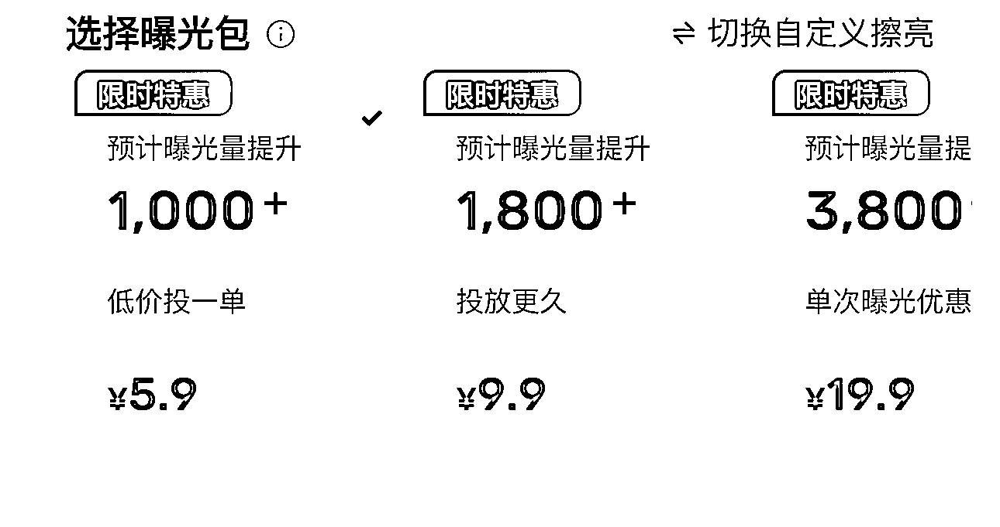

# (15 赞)闲鱼「超级擦亮」功能解析：曝光≠成交，如何避免被割韭菜？

> 原文：[`www.yuque.com/for_lazy/zhoubao/rlckx3ayk1wfopxu`](https://www.yuque.com/for_lazy/zhoubao/rlckx3ayk1wfopxu)

## (15 赞)闲鱼「超级擦亮」功能解析：曝光≠成交，如何避免被割韭菜？

作者： 远方玩电商

日期：2025-03-24

闲鱼 24 年底推出了「超级擦亮」功能，新出的这个功能可真是把大家伙给愁坏了！！

还有很多主播在抖音故意制造焦虑，就跟你讲现在闲鱼玩法变天了，要是再跟不上节奏你就要被淘汰了。

但是一场直播听了之后，从头看到尾认认真真的什么都听了，好像又是什么都没听。不知道大家有没有这种感觉。

有的朋友用了超级擦亮出单有增长，有的朋友用了就能蹭蹭往上涨哗哗爆单，有的朋友用了有出单但只是寥寥无几。

绝大多数用了超级擦亮效果不明显，自己的钱花出去了，但是没挣到钱。

### **搞得好像是被官方割韭菜了一样。**

其实不然，但是官方对这个超级擦亮的解释，也真是够简单的，没有详细介绍，也没有去讲超级擦亮怎么样用才会效果好。

我来简单介绍一下：

**就是你可以在闲鱼上自己掏钱买曝光量。**

**  **

你掏钱之后，你的商品更容易在首页和搜索中被人刷到，相当于是给你的加持，被人刷到了你就增加曝光了。

比如说你买 1000 个曝光，那么 1000 个人刷到你之后，你的这个加持就结束了，回归原来的水平。

**注意点：** 只负责给你达到承诺的曝光数量，不是说你开了超级擦亮一定能出单，只要曝光到了你购买的量就可以了。

哪怕你花了一万块钱，你买到的也只是曝光数量。

那么怎么样才能够出单呢？？

那么我们要明白曝光是什么？

**曝光 = 机会**

**  **

不是说 可以 _ 这样去理解，是你 必须 _ 要这样去理解!

曝光是你的链接被买家在「首页」和「搜索」刷到。

刷到之后会有两个结果：

1.  被买家刷到 → 点击浏览 → 咨询 → 成交

2.  被买家刷到 → 直接划走 → 点击别人 → 买别人的

大部分做的不好的新手都是第二种。

你店铺出单的步骤应该是：

链接被刷到 → 被点击 → 被咨询 → 成交

别人看见你链接之后就直接把你划走了，你哪门子成交去？

用抖音举个例子：

比方说我是个老头子，我拍了个自拍发了个抖音。

我花了 10000 块钱买了抖加，让 10000 个小姐姐刷到我，想让她们给我点赞评论，让这 10000 个小姐姐，让她们说喜欢我爱我。

她们会说吗？ 她们会给我点赞评论吗？ 她们会把我的自拍从头看完吗？

不会。

只能说，我能花钱让她们刷到我。

我花了钱她们看不看、买不买账是她们的事儿。

在闲鱼你能花钱让别人刷到你的商品，你能花钱让他们强制必须来找你下单吗？？

**一定是你这条被推广的链接本身内容要好！**

1.  推广是让你拿到机会、拿到曝光、让人能刷到你，然后一定是：

2.  让他想点开看看

3.  让他看完就想咨询

4.  让他咨询完就想买

5.  让他买了还能给你好评

6.  让他下次买的时候还想找你买！

这就是公域电商到私域电商的整个环节。

做好电商就这六句话。

这六句话玩明白，电商你就能玩到头了。

别小看这六句话，觉得很简单。

这里面每句话想做好，都能拿出来挑两三节课讲。

千万不要光埋头苦干，光知道每天懵懵的上链接，要思考你上链接的意义是啥，都有目的、作用的。

**看下面这张图，这是转化漏斗模型：**

从 10000 曝光人数逐步的往下筛：

**第一点：**

要让你的链接能给更多人刷到。

比如说你让链接被 10000 人刷到了，成功第一步了。

**第二点：**

要让这 10000 个刷到你链接的人点击链接。

比如说 10000 人中有 5000 人点击了，那你就成功了第二步了。

**第三点：**

要让这 5000 个点击浏览的来咨询。

比如说 5000 个点击的有 2000 个咨询的，成功第三步了。

**第四点：**

这 2000 人咨询你要能留住他能成交。

比如说 2000 个人成交了 500 人。

如果你的同行成交率 20%，你的成交率 25%，打败同行了，第四点，成功！

**第五点：**

让以上环节每个环节中，拿到更多数据，不断优化以上四个环节，就变得越来越强。

**内容不好的模型：**

10000 个曝光人数 = 10000 人看到你链接

10000 个人看到的 → 只有 200 个人点击浏览

200 人点击浏览的 → 只有 8 个咨询的

8 个找到你咨询的 → 只有 2 个下单购买的

所以！你推广之后，出单少！没有出单！

另外，

不要觉得付费才是效果最好。

免费的推广一样能打出很好的效果

闲鱼 6 块钱能买到 1000 个曝光次数。

免费推广，一分钱没花

推了 7.8 万人！

一分钱没花还比付费的效果好。

7.8 万曝光换成付费去买的话得 468 元。

没有这个免费推广的效果，就得多花 468、少挣 468 去买流量。

这都是活儿~

多看多研究多思考。

**点击下方关注我！我会持续更新！带大家清晰的玩懂闲鱼**

* * *

评论区：

暂无评论