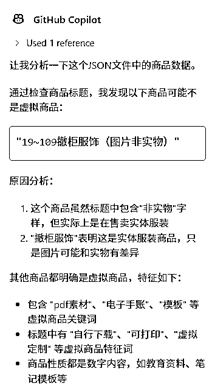

# (20 赞)小红书虚拟商品数据分享（目前数据条数： 1216）

> 原文：[`www.yuque.com/for_lazy/zhoubao/qhhv7tck6temitac`](https://www.yuque.com/for_lazy/zhoubao/qhhv7tck6temitac)

## (20 赞)小红书虚拟商品数据分享（目前数据条数： 1216）

作者： Rand0mWalk

日期：2025-03-26

1.  数据概况

2.  所有数据通过“基础关键词”搜索后的结果抓取，如果你有更多类似的关键词分享请留言

3.  可打印

4.  电子

5.  素材

6.  网盘发货

7.  清单

8.  合集

9.  可编辑

10.  模板

11.  源文件

12.  虚拟资料

13.  资源

14.  课

15.  应用

16.  软件

17.  app

18.  笔记

19.  自行下载

20.  ppt

21.  pdf

22.  手绘

23.  手抄报

24.  虚拟定制

25.  非实物

26.  抓取商品数据时，按销量排序，只抓取销量大于 3000 的商品

27.  销量大于 3000 可能会遗漏很多品，但只作为继续深挖的基础数据量应该也够了

28.  数据只经过 AI 的初步筛洗（通过商品标题简单判断），所以可能会有重复项或者小部分非虚拟商品

29.  其实可以根据商品标题和商品详情页里的预计发货时间结合起来让 AI 判断是否是虚拟品，毕竟大部分虚拟品发货速度都很快，但这一步我没有做，没有获取商品的预计发货时间

30.  有 AI 的初步清洗，应该可以节省一些后续人工洗数据的成本

31.  AI NB

33.  

34.  为什么做这个

35.  从近期的小红书中标风向标可以看到“趋势”，虚拟商品相关的很多，小红书也在扶持这一块

36.  亦仁在某次回答圈友的提问时，提到了本来想写一个关于小红书虚拟商品的超级标

37.  亦仁在传术师群里提到关于小红书虚拟商品相关数据的价值很大

38.  小红书没有统一的入口可以找到虚拟商品数据

39.  小红书的虚拟产品航海进行中，可以给航海圈友们一点点参考方向~

40.  我在参加 web 网站航海，索性把抓到的数据建个站，虽然数据量没那么大，但通过这些基础数据，可以深挖出不少相关店铺和关键词

想自己跑数据的，可以直接用这个 rpa：[`api.winrobot360.com/redirect/robot/share?inviteKey=adbfcbb6d1699901`](https://api.winrobot360.com/redirect/robot/share?inviteKey=adbfcbb6d1699901)

~~数据持续获取中（天气很热，RPA 快把电脑干冒烟了~~），可以随时来看看~~~~

更好的阅读体验移步飞书：[`fiazd3hbob.feishu.cn/docx/QoeGdG6XWoDYXBxIWt2cjLven4k`](https://fiazd3hbob.feishu.cn/docx/QoeGdG6XWoDYXBxIWt2cjLven4k)

* * *

评论区：

阿宝 : 能不能抓取出来都是放在哪个类目下的

Rand0mWalk : 小红书官方好像没有对外展示这个数据，一些第三方比如灰豚等有对商品展示类目。如果有统一的虚拟类目展示的话就更好抓了，去爬对应的类目就行。

花椒大王 : 能不能通过无物流发货来判断，这样大概率就是虚拟商品了

Rand0mWalk : 关键是拿不到是不是无物流发货的数据

PeterZEN : 感谢你的分享，大大节省了赛道选择的问题，同时也能快速从市场数据验证自己的赛道选择对不对。

Rand0mWalk : 把数据扔给 AI 帮着分析一下应该可以很有启发

Lucia : 谢谢大佬慷慨分享！很有价值