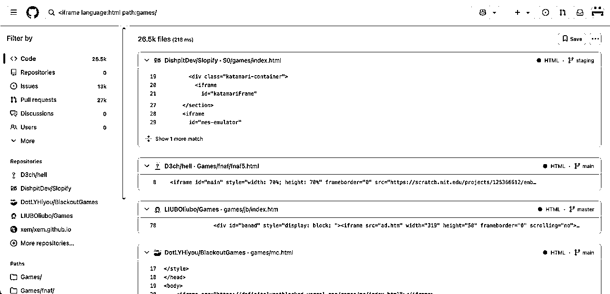
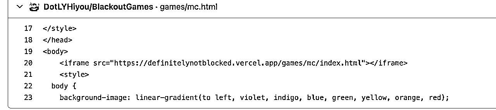
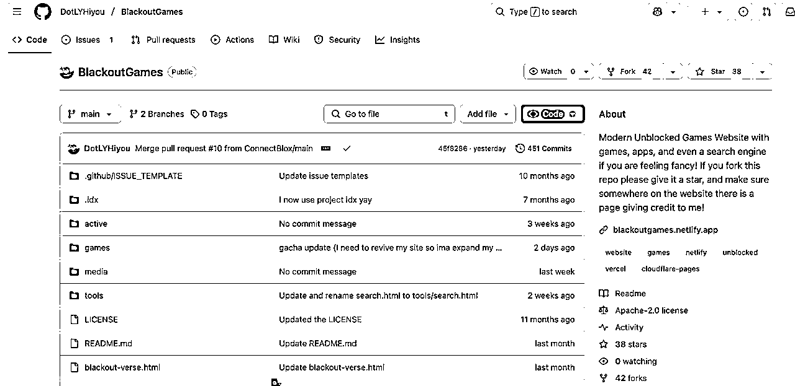
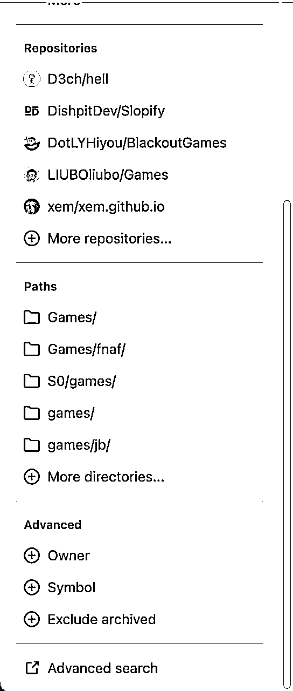
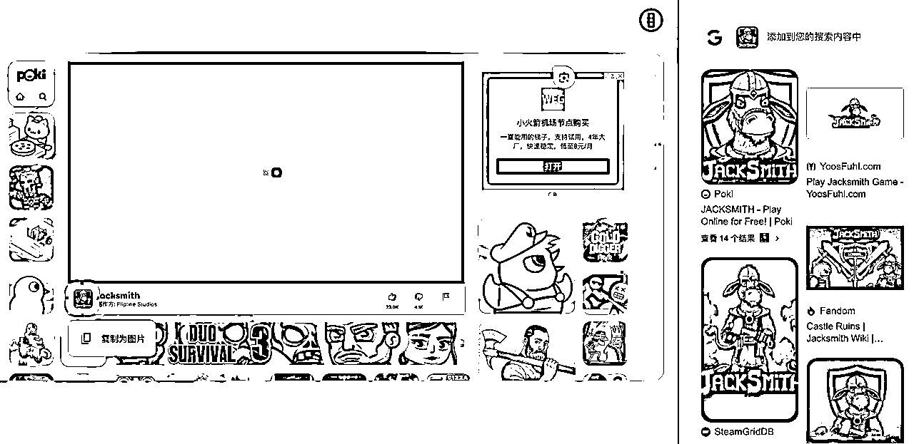
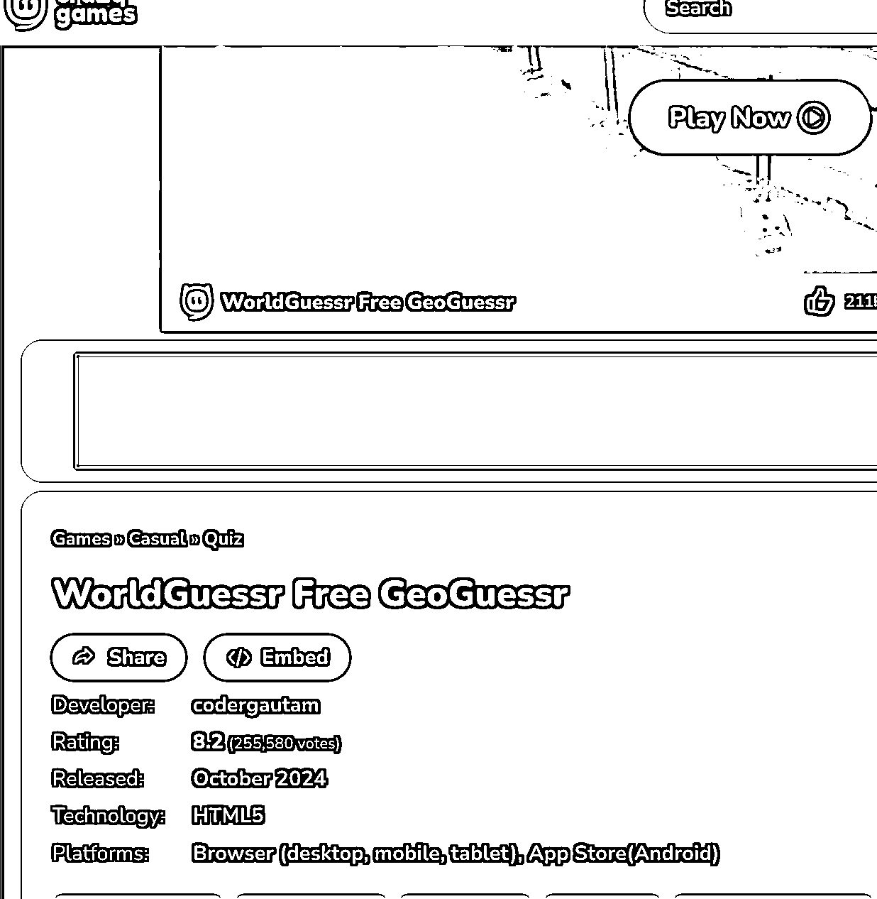
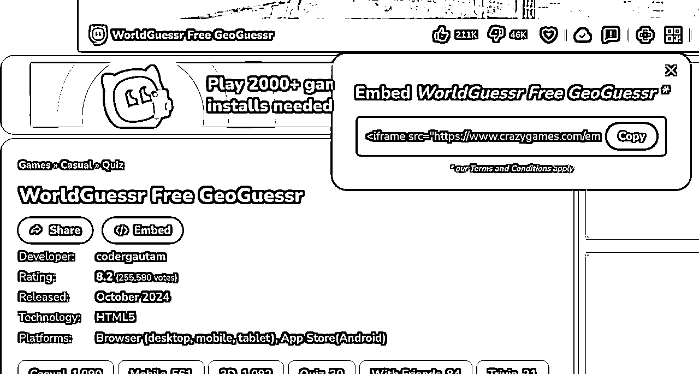

# 游戏网站如何获取更多游戏？7招助你拓展游戏库

> 来源：[https://ppn3f2zvoq.feishu.cn/docx/ASr6d3mTKoPEqCxcLCpcyVVun6g](https://ppn3f2zvoq.feishu.cn/docx/ASr6d3mTKoPEqCxcLCpcyVVun6g)

我是PeterZEN，从2023年8月期第一次参与【chatgpt+海外工具】航海以来，从需求挖掘到开发到推广获取流量到变现，赚到第一笔美元以来，已经一年多的时间了。

记得自己在那次航海和续航中完成了0-1，赚到了第一笔美元，当时的AI写代码效果还不太好，自己边学html/css/javasript，用着免费又不太聪明的chatgpt，做出了第一个网站，赚到了第一笔美元。

这一年多我做了十多个网站。游戏站，工具站，内容站，导航站，ai工具站。

最快8小时adsense审核通过，慢的两三天。新站，流量不多。从建站以来只有几百uv的也通过了adsense。

正在努力做1-10的工作。

最近几个月我也在做游戏站，也参加了本次的【AI 应用 - Web 网站】航海，分享一些自己对游戏站的经验体会。

## 先来谈谈手册中提到的iframe的方式？

### 什么是iframe？

iframe 是网页中的一种“小窗口”，可以在一个页面里直接显示另一个独立的网页或内容。它就像在墙上开了一扇窗，透过这扇窗能看到另一个房间的完整景象（比如视频、地图、表单等）。

iframe能够实现嵌入外部内容。例如，在博客中插入 YouTube 视频、或在地图应用中加载 Google 地图。这些内容看似在当前页面，实际是从其他网站加载的 。嵌入的内容与原网页互不影响，比如嵌入的地图功能崩溃出错了，不会影响自你的网站的正常访问。

了解更多可以去看：https://developer.mozilla.org/en-US/docs/Web/HTML/Element/iframe

具体的用法就是：

[目标网站网页的url](目标网站网页的url)

### iframe方式的优缺点：

优点：

-做网站非常快，能够大大节省时间。时间就是金钱，能让你抽出时间做更重要的事，比如搞流量。游戏站，工具站都可以用这样的方式。特别是在mvp阶段，不必浪费大量时间去做开发工作。

-能让你快速看到正反馈。新手只需要几十分钟就能上一个站，看到成果。

缺点：

-iframe的源头网站不可控。会出现各种情况，需要定期检查。比如失效的问题。

-iframe源头的网站会有广告影响用户体验。

-流量会流失。有的检测到iframe了，会提醒用户不要在你的网站游玩。带有别人网站的品牌。就比如itchio。

## 如何寻找网页游戏的资源？

在了解iframe的优缺点和如何使用后，该如何寻找游戏资源呢？

### 一。擅用搜索

*   通过谷歌等搜索引擎搜索关键词：

可以围绕这几个词搜索，iframe games, embed games, game distribution。叫ai帮你拓展词，然后去搜索。

*   Github搜索。这个是看到群里分享的，我以前也不知道，整理到这里。github搜索框输入指令"

像这种

[https://definitelynotblocked.vercel.app/games/mc/index.html](https://definitelynotblocked.vercel.app/games/mc/index.html)

可以直接访问的url：https://definitelynotblocked.vercel.app/games/mc/index.html。就粘贴到浏览器打开看一看，打开是能够直接游玩的就可以使用。

点击黑色加粗的文字进入到代码仓库，去看一看别人都放了什么游戏。

其实，Github也有高级搜索的功能，在左下角的【advanced search】，感兴趣的可以探索一下。

*   用好谷歌镜头搜索。

看上一款游戏不知道哪里找iframe资源？用好谷歌镜头搜索就能解决。

比如你看上poki上的一款游戏叫jacksmith，poki又不给提供iframe的链接。你可以通过游戏的图标去搜索，能够看到右侧结果中同样有游戏站，就进去看有没有提供iframe的链接。进入一个游戏网站，先看提供embed代码没有，没有的话看用浏览器开发者模式能不能找到。

仅仅用好搜索就能找到很多游戏资源！！！搜索+开发者模式，能够获取很多游戏iframe的链接。

*   用好带搜索功能的AI。

### 二。依托游戏相关的网站和平台

全球有非常多类似4399，crazygames的游戏站，有的提供embed的代码，也就是iframe的代码供你使用。

crazygames.com就是典型的的提供embed的网站。

航海手册中提到的itch.io平台，只有部分游戏允许你iframe的方式。

这里讲一下，如何在crazygames.com找到iframe代码，重点寻找embed这个关键词。

同时其他平台以及游戏框的互动组件，点赞功能附近多看一看。每一个提供embed的位置不一样。

比如https://www.crazygames.com/game/worldguessr 这个游戏。找到embed，点击。

你就会获得iframe的代码，复制下来。放到你的网页代码合适的地方。不会就叫AI帮你放。

你也许会惊讶的发现，crazygames这样的游戏平台居然也用iframe的方式提供游戏，而且还会把它iframe的游戏做一层iframe再提供给你并且带有它的品牌名。

几个月前，我看该游戏的时候，当你点击play后，crazygames是iframe的这个网站：https://www.worldguessr.com/。目前已经变了。

crazygames里面不是所有游戏提供embed，绝大多数会提供embed。

【更新】

现在crazygames有所改变，没有主动提供embed的代码了，测试发现crazygames大概7月份前的大部分游戏，只要把url当中的game更换为 embed依然是可以用于iframe的。

游戏网站提供embed供人iframe的好处有：1.获取外链。对于做SEO很有帮助。2.获得流量来源。别人用iframe的方式添加了游戏，用户可以通过你的链接到达你的网站。3.更多的收入。一些提供embed的网站，会在里面放广告。只要你iframe，有用户来你的网站玩游戏，你就是在帮对方赚钱。

类似crazygames能提供embed供你iframe的网站：

https://www.onlinegames.io/

https://gamedistribution.com/games/

https://www.twoplayergames.org/

这样的网站很多，就用之前提到的iframe games等几个关键词去搜索能找到一大堆。

即使有的游戏站没有提供embed供你iframe，但是有些网站没有设置跨域访问，可以通过开发者模式找到iframe的链接，可以拿来直接iframe。

这里分享一个我看到的小例子，几个月前很火的游戏stimulation clicker游戏，官方链接是：https://neal.fun/stimulation-clicker/。就有人注册了stimulationclicker.com 的域名，该网站最初尝试用iframe的方式提供游戏的，但是iframe的游戏方式行不通的，无法跨域访问。暂时用的跳转到官方的方式解决的。

游戏的开发者看到自己的网站搜索排名不是第一位，很生气那位站长抢了排名和大量流量，甚至向谷歌投诉，还在推特论坛上发文让用户抵制stimulationclicker.com网站的这种恶劣行为，后来网站站长和开发者沟通好了，允许它iframe了，就出现了用户可以在stimulationclicker.com上游玩游戏。跨域访问的限制不是绝对的，是可以沟通解决的。

有的游戏网站防盗做的很好。iframe是会被发现，给用户提醒的。比如itch.io，一些不支持iframe，有的就会提醒用户。

### 三。游戏源文件代码

游戏源代码文件，从GitHub上就能获取到很多。具体就不再多说了。

另外就是交易平台，比如

https://codecanyon.net/category/html5/games?sort=date

https://buy.html5games.com/

像国内的咸鱼某宝也可以买。

很多游戏你都能在ru地区的游戏站找到资源，有的手机游戏给你破解出来，能够让你在网页上游玩。

甚至，你还可以叫AI帮你写一个游戏。

## 另外，大家分享两种类型的游戏如何做到在浏览器上游玩？

dos游戏和flash游戏。得益于一些技术大神的贡献，能够在现代的浏览器上游玩过去流行的flash游戏，以及通过模拟脚本的方式游玩DOS游戏。

dos游戏：游戏文件资源+大神写的JS脚本。比如js-dos。

比如这个网站：https://dos.zone/ 能够实现在浏览器上游玩DOOM和GTA1。你是可以通过开发者模式看到对方用了什么方式获取游戏文件资源的，有的云文件的链接是可以直接拿来用的。

flash游戏：游戏资源文件+flash脚本。脚本比如ruffle。有的flash游戏游玩前会显示这个，你一定会很熟悉。很多网站都在用的ruffle。flash的游戏资源文件的格式为swf，当然可以本地也可以云存储。

有人围绕ruffle开发了插件，让用户实现在那些没有更新技术的flash游戏网站游玩。

如果不知道如何实现可以看一下这个代码仓库：

https://github.com/GeekGallifrey/GamesPlayOnWeb

这个仓库用html简单的实现在网页上游玩dos游戏和flash游戏。可以直接部署在vercel或cloudflare page上游玩。

其实，还有很多有意思的脚本，让你实现游玩过去的游戏，比如任天堂的许多游戏。去搜索关键词：emulator js, emulator game。

## 说在最后：

游戏供给的问题解决了，就是流量获取的问题。游戏网站做好了，才算刚刚开始。

流量才是重头戏，有流量变现怎么都好说。

变现方面，一开始申请不到Adsense可以用Monetag，自己的第一笔收入就是靠Monetag，申请秒过。在没有申请到adsense前，就用Monetag：monetag.com 或者 Adsterra。

流量玩法获取方面，

一种是从一开始就找有热度有流量的游戏。快速上站，推广，去抢流量。

另一种是先把游戏站做好，然后再推广做变现。不管是社媒引流，还是投放，还是靠SEO等方式。