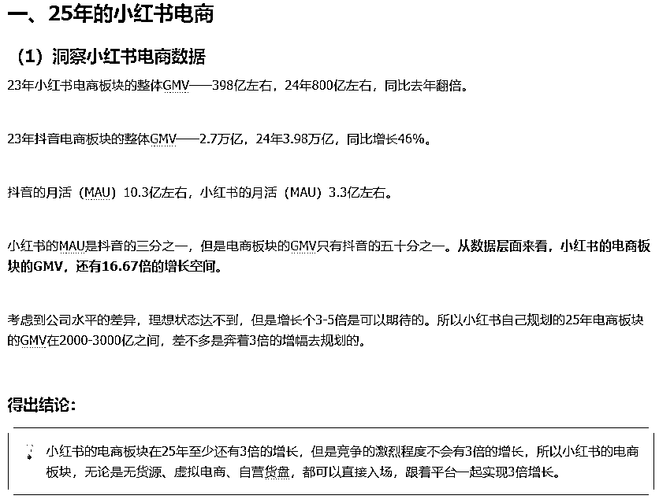
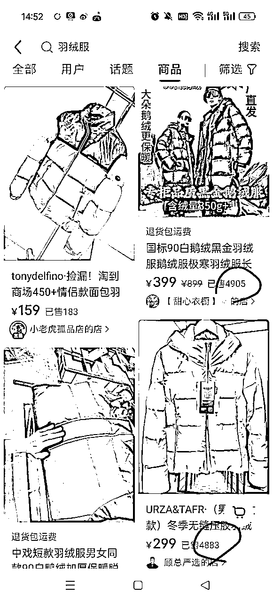
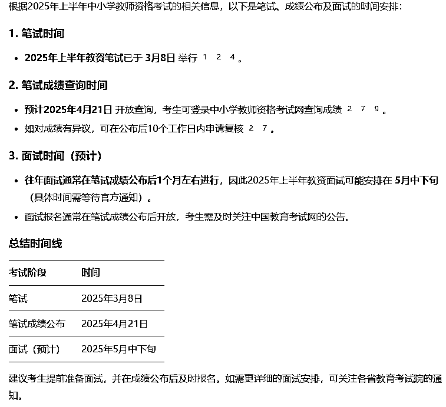

# 如何提高做小红书虚拟电商的成功概率？

> 来源：[https://qxgrvnd4nbk.feishu.cn/docx/BNCzdC8eJo6WvZx3RKfccxJanKh](https://qxgrvnd4nbk.feishu.cn/docx/BNCzdC8eJo6WvZx3RKfccxJanKh)

各位圈友好，我是更绪，十八线创业新手，也是本期小红书虚拟电商航海教练，3月27号晚上的直播，答应大家要写的帖子，今天来了，

过去半年在生财写了7篇文章，拿了6篇精华帖，顺便再用这篇挑战一下第7篇精华帖，

本文不谈一些细枝末节的操作，影响大家跑通这个项目的罪魁祸首，正是这些细枝末节的条条框框，它们会让你抓不住问题的本质，

不止小红书虚拟电商，只要你做小红书、做电商、做流量获客，我保证，这篇文章一定不会让你失望，

目录如下：

1.  小红书虚拟电商现状及未来趋势

1.  聊聊笔记的小眼睛很少这件事

1.  核心就2点，其他都不重要

1.  深度思考可以弄清楚问题的本质

# 一、小红书虚拟电商现状及未来趋势

项目好不好不是搞这个项目的培训的人吹出来的，更不是晒P图数据晒出来的，是需要通过数据分析和逻辑推理再加上自身实操去感受的，

## （1）先谈小红书电商

小红书虚拟电商，也是小红书电商的一个部分，

下面是我年前在星球发布的一篇精华帖👇，最终的结论就是，小红书的整个电商板块会在2025年迎来3倍增长，

虚拟电商也是小红书电商的一个板块，自然也会随之一起迎来至少3倍的增长，

这篇帖子是今年1月底发布的，2个月后的今天，从小红书平台针对电商板块，针对虚拟电商板块出台的各项政策，优化完善的各项功能，

足够证明我的判断是正确的，

## （2）再谈竞争

人的思维惯性的最难改变的，直到现在，大多数人的认知是觉得在小红书卖虚拟产品就得引流到私域，他们都觉得开店麻烦，你就算扯着耳朵告诉他们，开店的各种好处，他们也听不进去，这是人性，

然而开店从平台规则、转化率等多种层面来看，对引流私域就是一种降维打击，他们与我们都构不成竞争关系，

私域是租房逻辑，不是买房逻辑，用户不是加到微信去了，他就是你的人，就能产生复购，就有价值了，

但你却因此对抗了平台规则，丢失了巨大的订单转化率，

## （3）虚拟产品不是虚拟资料

从广义上来定义，只要不需要走实际物流的电商订单，都可以成为虚拟产品，也有人叫数字商品，并非狭隘的学习资料、教辅资料，

从这个视角去看，你会发现虚拟产品是一块巨大的冰山，而被大多数人认为卷到不行的“教辅资料”，都够呛能称得上是冰山一角，

虚拟产品明面上的好处是不需要发货，利润100%等等...

但实际上，尤其是在现在AI崛起的时间点，我们可以根据用户的需求，快速制作出解决他们需求的虚拟产品，这才是真正的好处，

就拿最近一年很火的AI代写这个项目，它本质也是一个虚拟产品，不过针对的需求是用户1对1的定制需求，

卖东西不是我们有什么，就去卖什么，应该是用户有什么需求，我们就用对应的产品去解决他的需求，然后获取回报，

## （4）结论

小红书虚拟电商这个项目至少还有一年半以上的红利期，这个红利程度是只要你肯一直发笔记，甚至不需要笔记质量太高，你就能赚钱，

作为一个资深小红书从业者，我更绪，

可以很负责任的说，不止小红书虚拟电商，只要是和小红书相关的所有项目，都可以无脑入场，

小红书这三个字，就是红利，

# 二、聊聊笔记的小眼睛很少这件事

笔记的小眼睛，本质其实就是流量，而平台分配流量，一定有它背后一套完整算法逻辑，是代码驱动的，不是人工驱动的，

那么我们今天就来说下小红书的流量分发机制，

看完之后，

再细想一下笔记的小眼睛很少这件事，

做成功这个项目难的地方压根不是什么技巧方法，难的是你是如何对待小眼睛很少这件事，

## （1）小红书的推荐流量

推荐流量，通俗点来说，就是你打开小红书，在发现页面，刷笔记，点击笔记产生的流量，记住了，它的核心动作是”刷“，是笔记主动来找你，主动跑到你面前来的。

推荐流量占小红书的总流量30%左右，

### 1.1 赛马机制

小红书，作为一个日活跃用户数量1.5亿左右的平台，每天有不计其数的笔记/视频在平台产生，在一天当中的任意时刻，都有大量的笔记发出来。

但是平台肯定不会给所有的笔记一样的曝光，平台会给高质量的、优秀的笔记更多的小眼睛，笔记越优质，小眼睛给得越多，笔记越垃圾，给的小眼睛越少。

### 1.2 笔记好坏用户说了算

平台会给优质的笔记推送更多的流量，那么平台判断这个笔记是否优质的标准是什么？

当然是平台的用户说了算，用户的平台的基石，小红书只有想尽办法给用户推送更多他们喜欢的内容，尽可能多让用户更多地在平台内停留，才能维持平台的竞争力。

所以当用户看到你发布的笔记之后，他会做出点赞、评论、收藏、关注、转发等等行为，这些行为在经过平台加权计算之后，会形成大量的数据，然后这些数据交给平台的算法。

最终由算法给你这个笔记打分，分高接着推，分低就此结束。

### 1.3 一篇笔记发出来的整个生命周期

我们来模拟一篇笔记从发布完成后的整个生命周期，

*   当你的笔记发布出来后，首先平台会审核你的内容安全性，只要测试投薯条，只要能投，就是正常的，否则就会直接被剔除，不给推流。

*   过了审核这关，平台就会给第一波基础的流量，根据你笔记的内容，去推送给可能会对这篇笔记感兴趣的用户，然后你的笔记就出现在了他们的主页，第一波大概会推送50-100人左右。

*   当笔记推送给第一波用户之后，他们会对这篇笔记做出反应，可能直接划走选择不看，可能会点进去，然后做出点赞、评论、收藏、关注、转发等行为，这些数据经过加权之后，会反馈给算法，然后算法通过这些数据，最终给到这篇笔记一个评分。

*   得分高的笔记，会进入到下一个流量层级，推送更多的流量，然后再根据第二轮的用户对笔记做出的行为数据，再次对这篇笔记评分，得分高就再进入下一个流量层级，推送更大的流量，一直到对应的人群推送完成结束，得分低就到此为止，平台不再推送更多的流量。

### 1.4 推荐流量充满了不确定性

#### 1.4.1 推送的人群充满不确定性

你的笔记能拿到多少流量，其实本质是由看到这篇笔记的用户决定的，所以算法推送的人群越准确，他们对你的笔记感兴趣的可能性越高，越容易做出点赞收藏关注等动作，笔记的流量就越容易起来。

但是，算法推送的人群是随机性的，即使是一模一样的两篇笔记，也没法保证每次推送到的人是完全一样的。

所以有些时候，两篇相似度很高的笔记，一篇爆了，一篇没流量就是这个原因，并不存在什么相似度过高被限流的说法，除非你的笔记被检测到违规，直接一开始就被剔除。

#### 1.4.2 同样的人也充满不确定性

退一万步说，即使算法能做到给你推送一模一样的人，但是同样的人，可能在不同的时间看到你的笔记，同一个人在不同的时间段，他关注的重点不一样，心情不一样。

所以同样的人，在不同的时间，在不同的场景下也可能会对同一篇笔记产生不同的行为，心情好就给你点个赞，心情不好懒得看，直接就划走了。

这也是一个巨大的不确定性，所以会导致同样的笔记，时而爆，时而发出来没流量。

#### 1.4.3 数量&投放对抗不确定性

想要对抗算法的不确定性，第一种方法就是加大笔记的数量，发了这么多篇笔记，总得有一篇推送的人群是准确的，推送的时间的准确。所以不要发了几篇笔记没流量，就说平台给你限流了。

第二种方法就是通过投放，去人为校准笔记推送的人群。

## （2）小红书的搜索流量

搜索流量，通俗点来说，就是你打开小红书，在搜索栏去搜索一个词，然后看到笔记，点击笔记产生的流量，记住了，它的核心动作是”搜“，是你去主动找笔记，找到能解决你需求的笔记。

搜索流量占小红书的总流量65%左右，

### 1.1 搜索流量的分配逻辑

想要在搜索渠道获取更多的流量，那必然要让我们的笔记出现在用户搜索后界面的前列，也就是我们笔记的搜索排名要足够高。

而小红书笔记的搜索排名主要取决于3个部分，关键词匹配度和搜索满意度和笔记发布时间。

关键词匹配度，也就是我们笔记当中出现的词和用户搜索的词的匹配程度，主要由我们布局的用户搜索长尾词来决定，

搜索满意度，也就是用户在搜索之后看到我们这篇笔记，是否会为我们的笔记停留、点赞、收藏、转发等等，主要由我们的笔记质量决定，笔记要做得好，用户喜欢，他才会做出这些行为，

笔记发布时间，平台要保证有源源不断的新内容的诞生，所以不能让原来的老笔记一直霸占全部的搜索流量，会给新笔记一定比例的曝光倾斜，所以我们可以过一段时间对以前发布的笔记重新编辑，进行二创，再重新发布，以优化笔记的发布时间权重，

所以搜索流量的确定性是相对比较高的，

### 1.2 千人千面机制

搜索排名不是一成不变的，每个人搜索出现的界面也会不一样，所以不要笔记一发布完，就拿号去搜索看自己的笔记，搜不到心态又出问题了，这其实没有任何意义，

只要我们优化好了关键词匹配度、搜索满意度、笔记发布时间这三个影响搜索权重的因素，在笔记没有违规的前提下，我们就一定能拿到搜索流量，

举个形象一点的例子，

你的笔记发出去后，有1000个人搜索该关键词，平台会随机分配50个人看到你这篇笔记，然后这50个人对你的笔记做出的动作汇集成数据，从而对你的笔记进行搜索排名，

这个过程可能只需要两三天，也可能需要一两个月，

### 1.3 搜索流量的滞后性

搜索流量的滞后性很强，一方面是因为搜索是被动的，是人去找内容，也就是说必须要有人去搜索，我们才会有流量，所以我们是被动的，流量就来得没有推荐流量这么快，

另外一个方面是平台对于笔记在搜索渠道的收录时间比较慢，从个人经验以及和其他人的交流得出的结论，小红书的搜索流量的趋势大概是这样，

在笔记刚刚发布一小段时间内，笔记会有推荐流量和搜索流量，这俩都有，但是主要是推荐流量，再然后就要1-3个月的时间，笔记的搜索流量才会再慢慢起来，

所以搜索流量具有较强的滞后性，需要提前做好心理准备，

然而小红书的流量大部分来源都是搜索流量，而搜索流量又是慢慢涨起来的，所以你觉得小眼睛少的根本原因就是分不清推荐流量和搜索流量，

甚至弄不清楚自己把产品卖出去的完整用户流程，

看到这，你可以去打开自己的小红书创作者中心，看看自己的流量来源组成，

## （3）小眼睛不等于小眼睛

说个反常识的认知，

笔记的小眼睛多，大多数时候并不是一件好事，甚至有很大可能是一件坏事，

在平台上面卖东西，无非就两种思路，

一种是想办法把流量尽可能变大，通过大基数的去博得更多的订单，

另外一种就是想办法把流量尽可能变精准，通过高转化率去博得更多的订单，

哪种更好？显然是第二种！

流量越大就意味着流量不精准，尤其是小红书图文这样比较简单的内容形式，想把流量拉爆，大部分情况都是需要走点擦边噱头的内容去博眼球，拉爆封面点击率这个数据指标，当流量逐步拉高的时候，你的笔记&账号也就容易违规了，

绝大部分小眼睛快速涨得很高的笔记，唯一的作用就是自嗨，看起来心里舒服，其背后并没有对应用户的真实需求，而赚钱是用产品解决用户需求之后的回报，

硬广商品笔记天生流量就低，但不代表价值低，除了你的目标受众用户没人对你的硬广商品笔记感兴趣，但是我只需要我的目标受众感兴趣就行了，

商品笔记的流量是你能拿到最精准最有价值的流量，比付费流量还要精准，一个小眼睛比一万个看起来多的“小眼睛”更有意义，

所以在我的视角里，笔记不挂商品，等流量起来了再挂商品链接，是一个没道理的操作，

# 三、核心就两点，其他都不重要

“更绪，我的账号需要一卡一机一号吗？”

“更绪，需要先用账号去刷几天进行养号操作吗？”

“更绪，一天能发多少条笔记？”

“更绪，发布笔记的时候要间隔多少时间？”

“更绪，一个WIFI下面能同时连2台设备吗？”

“更绪，笔记的小眼睛太少要不要删除或者隐藏？”

......

这些所谓的注意事项，就是阻碍你成功跑通这个项目的最大障碍，我不知道传播这类谣言的人是何居心，如果是人云亦云，一个传一个传变了味，我还可以理解，

如果是为了卖自己的培训课，制造各种不科学，无逻辑的噱头注意事项去博眼球，那我觉得简直太坏了，

“养号，以及类似养号的说法就是对智商的一种侮辱”，

脑海里要有个观念，我们是小红书电商的一个部分，在小红书开店卖东西是完全符合平台规则的，小红书现阶段又在冲刺电商的GMV，它恨不得求我们多开点店铺帮它冲GMV，

为什么要给我们这么多限制呢？为什么呢？没有道理的！你在做这个项目过程中的操作，自己怎么方便怎么来，平台并没有设置各种莫须有的规则限制你！

## （1）电商就2个动作，选品和测品

不管是虚拟电商，还是实体电商，除非是品牌或者IP路线的，核心的动作都是选品和测评，然后不断循环这两个动作，其他都是浮云，

## （2）不一样的选品视角

选品其实本质选的不是品，是用户的需求，我们不应该只是单纯去看某个品的销量数据或者搜索数据之类的已经固定的数据，这是死板的数据，

这些数据仅仅只能代表这个品在过去一段时间内有需求，而不能代表这个品在当下，或者接下来的一段时间有需求，一定要搞清楚我们选的品，其对应的用户对这个品的动态需求变化，

就像如今这个时间点，各大电商平台棉服&羽绒服的销量数据更高，但是我们会去选择在现在这个时间线去卖棉服和羽绒服吗？

显然不会，因为我们知道，虽然之前一段时间棉服和羽绒服的需求很高，销量很高，但是在当下和未来一段时间内用户对他并没有需求，所以是卖不掉的，对于实体产品，我们是可以通过生活常识去判断的，

举个例子，就拿虚拟产品来说，教资考试在近期是一个很热门的话题，3月8号进行了笔试，很多人就在笔试之后，开始布局教资面试的资料，发现不太能卖出去，

为什么呢？因为4月21号才出笔试的成绩，大家得知道笔试成绩了，才会去准备面试，否则如果笔试没过的话，准备面试就没有意义了，这就是最近教资面试相关的资料不好卖的原因，

如果没有挖掘清楚这个品背后用户的动态需求变化，就无法站在上帝视角去把控它的流量曲线，比较容易造成心态上的问题，

这里给大家一段DeepSeek的提示词，用来帮助大家挖掘每个品背后对应的用户的动态需求，帮助大家更好地选品：

“我现在做在小红书开店卖虚拟资料，看中一个品，是xxx。

现在我想知道四个问题，请你详细帮我分析一下，便于我去决定要不要选这个品，以及便于我后续去做内容。

第一个问题：什么样的人会来买这些资料？

第二个问题：他们买这些资料用来干什么？

第三个问题：他们在什么时候买这个资料的可能性最大？

第四个问题：他们对这个资料的需求是怎样随着时间线进行变化的?”

切记，选品不是在选品，是挖掘用户需求的一个过程。

## （3）少被笔记质量PUA

祥子到死都买不起人力三轮车，是他不够努力吗？你的卖不出去虚拟产品，是因为你的笔记质量不够好吗？

并不是，

切莫纠结自己的笔记质量，觉得这也不行，那也不行，这是一个非常错误的思想，

因为我们大部分情况下模仿同行做出来的笔记，质量都没有问题，如果质量有问题，你肯定不会发出来，细品这句话，

大部分时候笔记拿不到流量只有2种可能性：

第一种可能性就是，发得不够多，你看到同行的笔记数据很好，发一篇爆一篇，其实并不是你看到的表面现象，他们背后有成千上万个矩阵号，几十万，上百位篇笔记在小红书疯狂霸屏，最终才有了你所看到的发一篇爆一篇的结果，

所以抛开笔记的数量谈笔记的质量就是在耍流氓，你的笔记做得再好，数量少了，无法对冲算法的不确定性，也只能靠运气去拿流量，

第二种可能性就是，需要结合到前面选品来说，品和笔记是有关联性的，其实笔记就相当于是商品主图和详情图的外显形式，如果你选的品都没有需求，当下没热度，笔记怎么会有流量呢？

## （4）时间是最大的壁垒

“时间是最大的壁垒”，除了指代时间沉淀下来的东西形成壁垒之外，

也指代不同的人愿不愿意在一件事上押注时间，大多数人都不愿意，浅尝而止，只有少部分人会持续深耕，所以时间本身就是人与人之间的壁垒，

而时间，是会带给你惊喜的，

我给大家举个例子，我自己店铺的品，去年十月份我选了一个品，针对性做了一批笔记，当时卖得一般，偶尔有出单，一直不温不火，以至于我都忘了它的存在，直到前几天，这个品突然每天能卖很多，

从下面的曲线就能看出来，前几天突然一下就卖起来了，

然后我去看了当时做的一批笔记，当时的小眼睛发出来全是个位数，最多的一篇我记得是14个小眼睛，现在都慢慢涨到了大几百，上千的小眼睛，

随着近期这个品背后对应的用户需求起来了，自然而然就卖得很好，而我什么都没做，只是把它交给了时间，而并没有在它只有几个小眼睛的时候，就把它删了，

针对这个部分的一句话总结：

只要选品挖掘清楚了用户背后的动态需求，发的笔记不是自己想当然随便乱发的，发出去的笔记就不会白发，现在不出单，以后也一定会出单，

# 四、深度思考可以弄清问题的本质

## （1）多次实验取平均值

从上初中接触生物、物理、化学等自然科学的学科开始，涉及到需要做实验，最常见到的一句话就是“多次实验取平均值”，

因为实验次数太少的话，就容易出现偶然因素的影响，从而得出错误的结论，

做小红书，或者说做项目其实本质是一样的，很多时候你仅仅通过几篇笔记，一两个账号出现的特殊情况，就直接得出一个结论，

有人用普通的账号发了一篇笔记，小眼睛少点，用蓝V专业号发了一篇笔记，小眼睛多点，就直接得出结论，开了蓝V账号的权重更高，流量更高，

反过来，

有人用蓝V专业号发了一篇笔记，小眼睛少点，用普通的账号发了一篇笔记，小眼睛多点，直接就得出结论，蓝V账号是带有营销属性的，平台会限流，

真的很滑稽，我请求各位，要多次实验取平均值，不然你很难找到正确答案，

## （2）尊重世界运行的客观规律

挂了商品链接，笔记会被限流！

上面这个说法就是极度不尊重这个世界的客观规律的，不符合逻辑，没有道理的！

挂了商品链接为什么会被限流呢？有想过一个能够完全说服自己的理由？

挂了笔记确实会影响笔记的流量，但不一定是限流，甚至可能带来更多的流量，创造更大的收益！

小红书平台正在冲刺电商板块GMV，我挂商品链接就是在帮他冲刺GMV，如果我们单位流量卖出去的货更多，小红书凭什么限我的流？

# 五、最终总结

如果想提高做小红书虚拟电商这个项目的成功概率，

你需要弄清小红书平台的流量分发逻辑，正确看待小眼睛数很少这件事，并不断选品测品，然后再坚持一段时间，如果还卖不好，

可以直接回来骂我，

完结撒花，

看到这，如果觉得对你有一点启发，

给我点个赞，

谢谢你的慷慨！