# 想要无痛转行，做好小红书赛道的高客单，应该如何用好生财有术？

> 来源：[https://ncn18orsgwl2.feishu.cn/docx/BUnTdpDZrorgnwxdYbMcpLbbnxb](https://ncn18orsgwl2.feishu.cn/docx/BUnTdpDZrorgnwxdYbMcpLbbnxb)

你好，我是珍妮子。我借助生财有术实现了无痛转行，主要的业务是帮助已完成从0到1阶段的高客单IP解决流量与私域转化的问题，并从中获取签单提成。其中涉足了留学、旅游、房产、教育等多个高客单价赛道，

同时，我还带领着这样一批操盘手：他们擅长流量运作，但是他们找不到能实现复利增长的项目；他们厌倦了因为缺乏账号IP特色，总是陷入被客户比价的困境，每天得时刻秒回客户消息才有获客可能，还要耗费大量精力防止同行在评论区截流。

我引导他们告别那些没有IP赋能的项目，与我一起去放大「已经跑通从0到1」的高客单IP影响力，进而获取高客单IP的签单提成 。

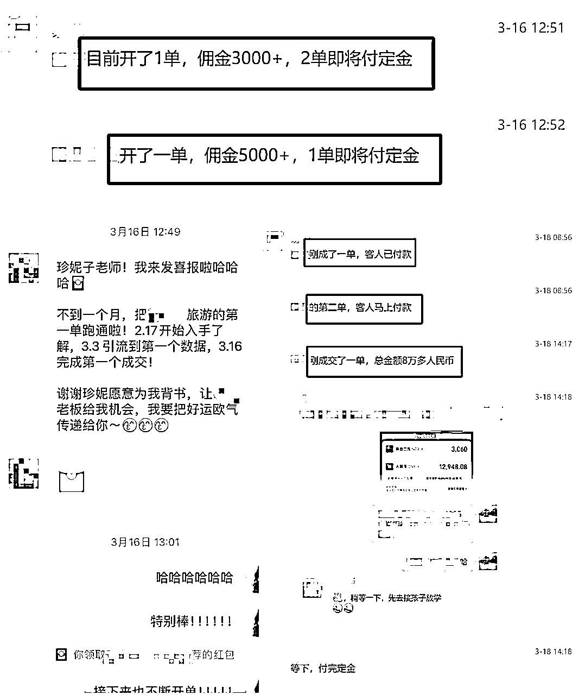

我还帮助那些「不会做流量，却渴望找到高客单项目实操赚钱的人」。我将自己24年精心总结的「小红书70+不同高客单赛道运营打法SOP」分享给他们，助力他们学会流量运营。

我会先引导他们从「我精心挑选的、相对简单易上手的小红书代运营项目」入手，让他们既能赚取基础代运营费用，又能拿到签单抽成，以此掌握「简单项目」的获客技巧。后续，再逐步引导他们挑战难度逐渐递增的高客单IP项目 。

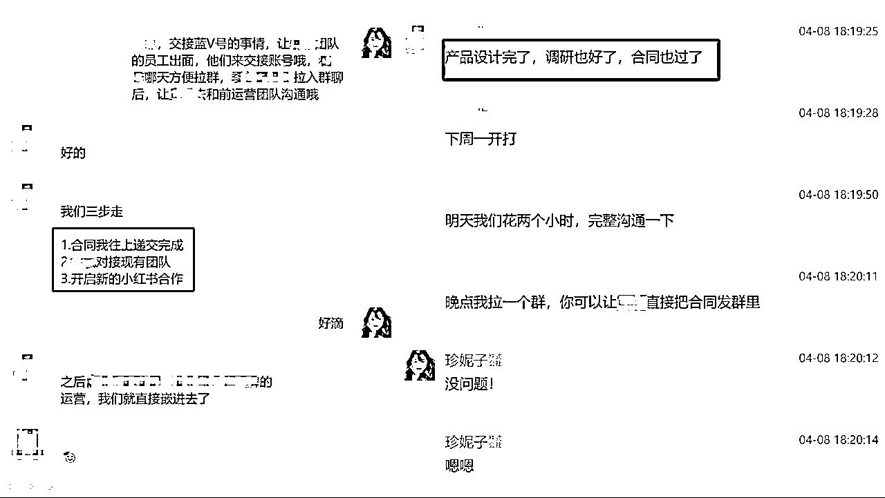

我在2022年加入生财有术，其间经历了创业成功，之后又因种种原因被迫提前转行。毫不夸张地说，我参与的所有项目都得益于生财有术。在这里，我不仅找到了优质项目，结识了志同道合的合伙人，还收获了一路相伴的同行者。每当运营过程中遇到疑惑，我都能在生财有术找到对应的文章，甚至联系到幕后的专业人士。

今天，我想和大家分享：如果想要无痛转行，投身小红书赛道开展高客单业务，应该怎样巧妙借助生财有术的力量。

# 生财新圈友你好，这是我的生财使用指南

## 适用于这样的你&能解决以下痛点:

想转行却不知从何下手：

如果你已经有了稳定的主业，但还想寻找更好的发展机会，这篇文章会教你如何实现无痛转行。

找合伙人毫无头绪：

要是你刚开始启动一个项目，但不知道怎样找到合适的合伙人，在这里，你能学到如何观察、吸引那些能和你并肩作战的伙伴。

项目遇瓶颈难以突破：

当你的项目已经成功从0做到了1，却想进一步放大势能，这篇文章会分享怎样结识更多志同道合的伙伴。

跟大佬合作有顾虑：

假如你遇到了愿意追随的大佬，却又担心自己在合作关系中被淘汰，这篇文章会告诉你怎样长期获得大佬的支持与帮助，让自己在发展道路上一路腾飞。

以下是本文目录：

1.  我的转行经历

1.  觉得主业在衰落，想要无痛转行，我们要怎样用好生财有术？

2.1 在生财，分享即受益

2.2 从生财找到合适的人：观察，观察，从各种细节观察

2.2.1 观察ta的生财足迹

2.2.2 观察ta在社群里的发言，他提出的问题

2.2.3 观察ta的实际行动

2.3 找对人，确定项目后，用上这套心法去转行

2.3.1 向人提供情绪价值/不索取情绪价值

2.3.2 向人提供实用价值

2.3.3 向人提供钱和资源

1.  附录1：我快速阅读生财文章的小技巧

1.  附录2：珍妮和合伙人的转行经历

# 我的转行经历

大家好，我是珍妮子。在2022 - 2023年期间，我通过自营以及代运营的模式，在小红书留学赛道实现了两年2700万的营收。但是好景不长，2023年，有幸听了贵人姐姐的IP课程，提前获知了“留学赛道即将下滑”的消息。

这个消息让我很焦虑，当即决定转行，但是转行过程中四处碰壁，一直没有理想的结果。那段时间，我在生财有术疯狂翻阅大量帖子，想要找到适合自己切入的行业。

好在2024年，我成功实现了转行，而这正是得益于生财有术这个平台。我从代运营起步，顺利转入小红书房产单边代理赛道。仅仅两个月，我就帮老板售出价值1个亿的房子。此后，越来越多生财有术的老板邀请我参与项目，一个项目圆满完成后，又被带入下一个项目。

在生财有术，我结识了众多优秀且靠谱的伙伴。就这样，我顺利完成转行，如今已成功进阶为高客单操盘手公司的创始人。现在，我带领着一群合伙人一同投身高客单赛道，主要为那些已经完成从0到1阶段的高客单IP解决流量与私域转化难题，并从中获取签单提成。

如果有朋友想了解我的转行历程，可以查看我和合伙人在生财有术发布的相关帖子，链接附在本文文末 。

# 觉得主业在衰落，期望无痛转行做好副业，我们要怎样用好生财有术？

## 在生财，分享即受益

我在2022年加入生财有术，整整一年我都没有冒过泡，我专注做自己的项目，培训团队新人。

那一年，我把生财当做专属的资料搜索库，每当对某个赛道产生兴趣，想要深入了解下，我就会在生财有术进行检索，从中学习新的技能。

到23年，我脑子突然开窍了，我想：我是不是也能在这个平台分享些有价值的东西呢？

于是那时候，我发布了第一篇帖子，把我和合伙人陈铭Ivy，如何从0到1搭建团队的方法分享出来。

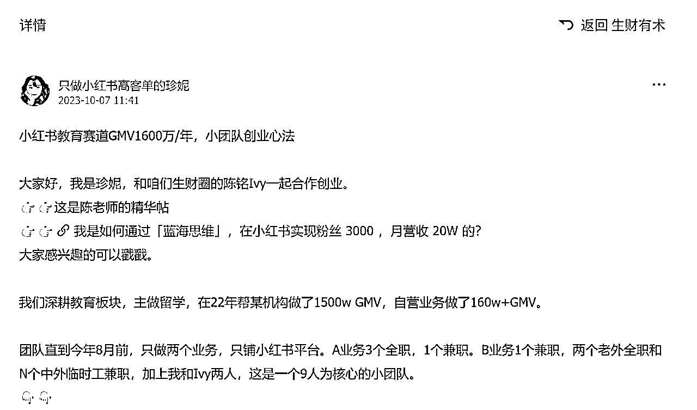

结果拿到了精华帖，被留学赛道的老板们加爆了微信，其中还有一些“平时我就想和对方合作的大厂”，

我没想到这么知名的大厂，他们的负责人竟然也在生财，后来我陆续和这些老板达成合作，和他们成为了利益共同体。

这一年，我还通过一些渠道，对留学行业几乎所有细分赛道都进行了测试。有的细分赛道只让我赚了点小钱，有的甚至还让我亏了钱。我把这些经验和教训整理成「老板避雷手册」，发布在生财有术上，没想到，火了。

而这篇手册，正是我后续顺利转行的关键要素。

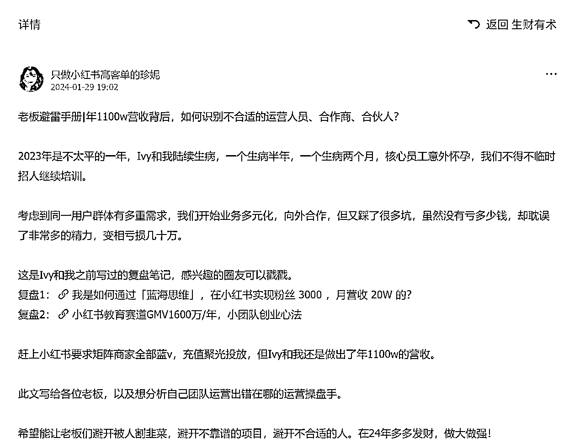

因为这篇文章爆火，我被邀请当生财直播嘉宾，被更多人看到，于是我在生财遇到了很多优秀的人，其中就有现在和我一起前行的合伙人。

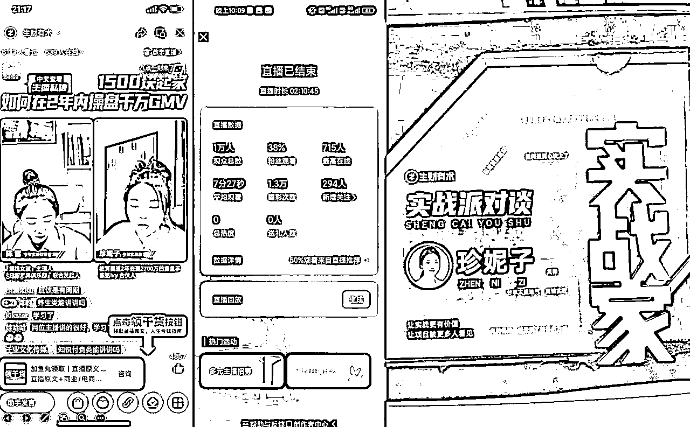

## 从生财找到合适的人：观察，观察，从各种细节观察

### 观察ta的生财足迹

当我在生财精华帖中发现一篇高质量帖子，我会去把对方过往发过的帖子都快速看一遍，看看他之前做过什么动作。

当我在一些其他圈子里遇到“所谓的大佬”，我只要一听到他说自己也在生财，我就会打开生财的知识星球，检索一遍对方的昵称，看看对方在生财里发过什么。

我还会观察一个人在生财帖子里的评论区中评论什么，如果一个人情绪稳定又很有礼貌，我就会去找对方聊聊。

### 观察ta在社群的发言，他提出的问题

通过生财知道了解这样一个人后，我就会继续下一步背景调查，比如通过生财传术师群、航海家群等社群，看对方平时冒泡时都说些啥。如果我和对方恰好还有一些重合的群聊，我也会观察他的说话风格与情绪稳定程度，以及看对方平时都会在社群里提什么样的问题。

比如某一年，有位朋友和我说：“XX的项目特别好，我想去参与，买他的服务”。

我阻止了他，然后把我观察到的“XX日常在社群中的对话聊天”转发给了他看，告诉他：“这人不靠谱，你试试别的。”

最后这位朋友没有去参与那个项目，反而机缘巧合接触到了下一个好项目，做出了业绩，实现了60W的佣金收益。

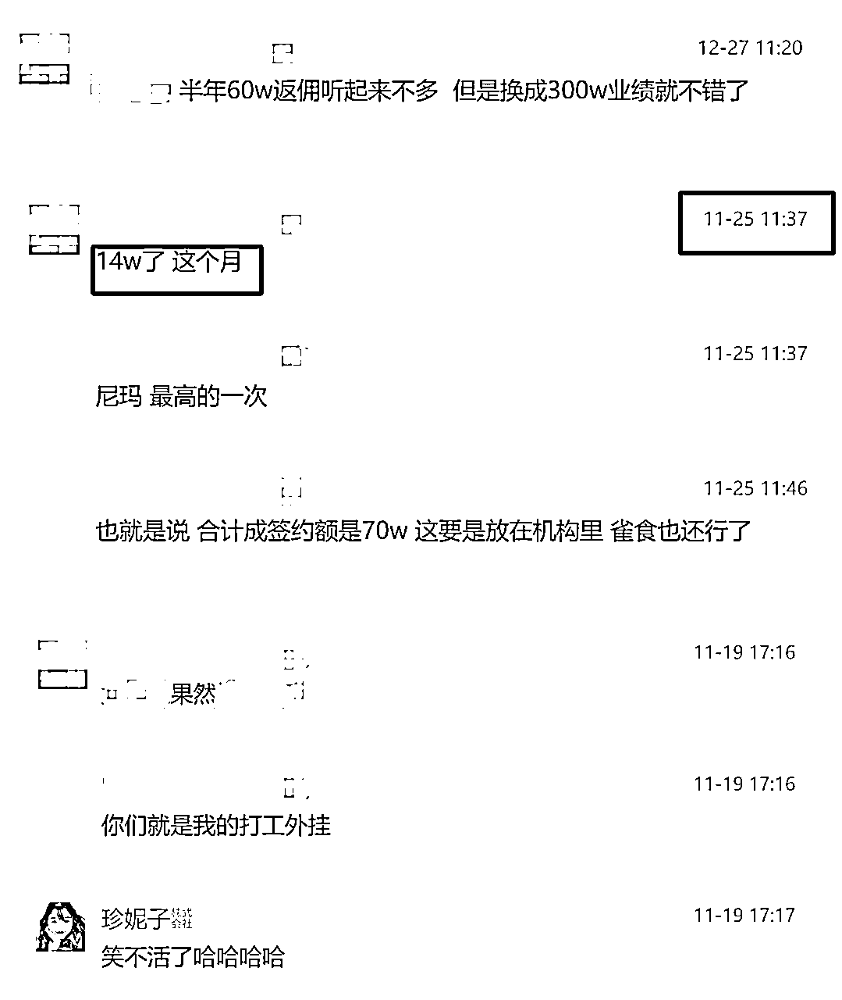

### 观察ta的实际行动

这里分为两步：

打钱，以及看实际行动。

举个例子，

我在生财有术遇到一泽的时候，

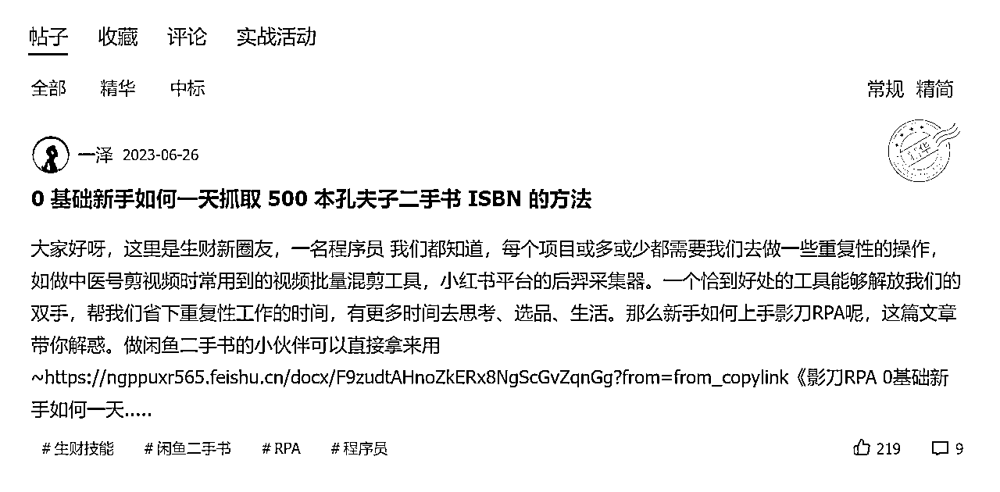

我看完他在生财发的帖子，马上我就按图索骥把他B站发的内容也看了个遍。

于是我知道：这位程序员很靠谱。

我开始了打钱操作。

我付费找他定制了一款专门符合【小红书运营人员】心理的扒数据软件，

这款软件去掉了很多不必要的功能，专门拿来小红书获客用的。

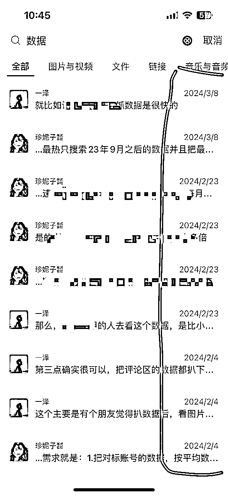

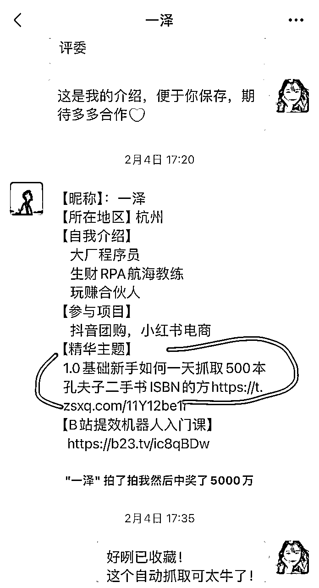

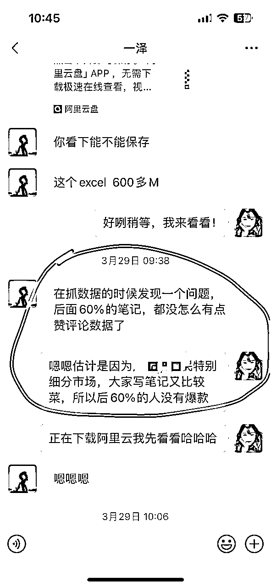

我是年前和一泽聊起这件事的，我没有想到他这么上心。

我当时只是需要一款软件而已，也不急着弄，但是他一直很积极的推进进度条，于是我们俩沟通好后，确定好了：

“对于老板和小红书运营新手而言，他们在「用于获客分析」的工具上，真正需要具备哪些功能？

在这些功能里，一泽能实现哪些？哪些功能可能会让使用变得不够便捷？”

我通过付费一泽的服务，进一步了解了一泽。

他真的是一个非常负责的人，这款软件是我见过市面上最便宜又最好使的软件了，

性价比真的拉满了，

别人的软件大几千一年，他的软件几百块一年。

我找他买完软件后我就没管了，没想到有天他告诉我：他又迭代了XX功能。

以下真的没有收一泽的广告费，也没有任何故意加价去帮他卖软件的意思，而是因为，他真的是一个非常非常良心的商家，是技术max的程序员。

这是24年年初那会我找他扒的数据列表，哪怕都压缩了，随便一个压缩包都有464MB。

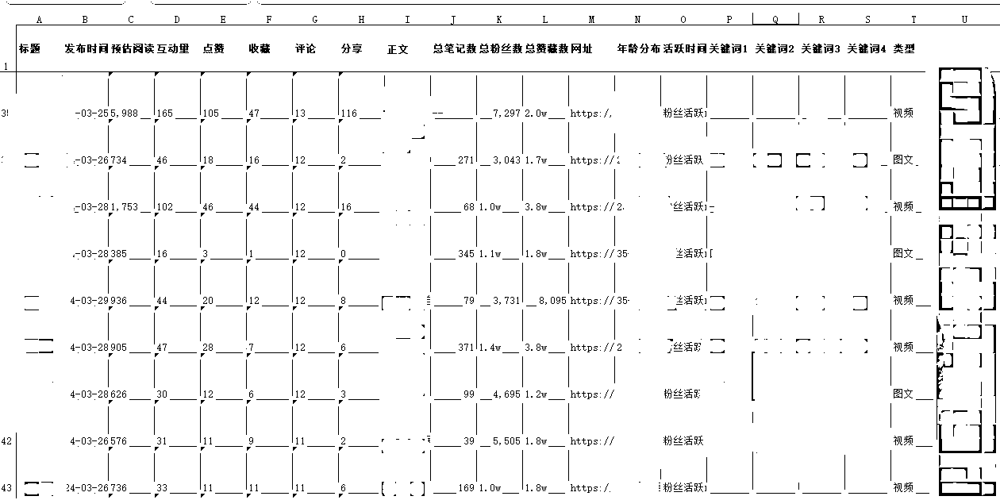

除了给人打钱以外，

我在生财遇到了很多很多人，我经常会默默观察他们的实际行动。

比如有些人和我说：

“珍妮我想好好学XXXX，珍妮我想做好XXXX”，

我说“好呀，那你先去尝试尝试 / 先学起来。”

然后我会观察他的实际行动。

有一些人：

1）说完上面的话后就不见了。

2）坚持了几天，摆烂了。

3）每干一会活就会开始抱怨。

4）今天做A项目，明天做B项目，永远都不聚焦。

当然，也有一些人特别优秀，

拿我观察易寒老板的实际行动来说吧。

易寒老板，也是我在生财遇到的，平时我们沟通，

他会和我分享从 211 大学事业编辞职后，在新西兰经营旅行社期间的种种经历，其中既有事业高峰时的经验，也有低谷时的困境。

我们最开始沟通那会，我和他说：

“旅游行业已经是要必须重新整顿交付端才能去获取更多客资的情况了，必须要打IP了。”

我只是这么提了一嘴，真的只是提了一嘴。

然后易寒老板真的把新西兰旅行社的交付端整顿了一遍。

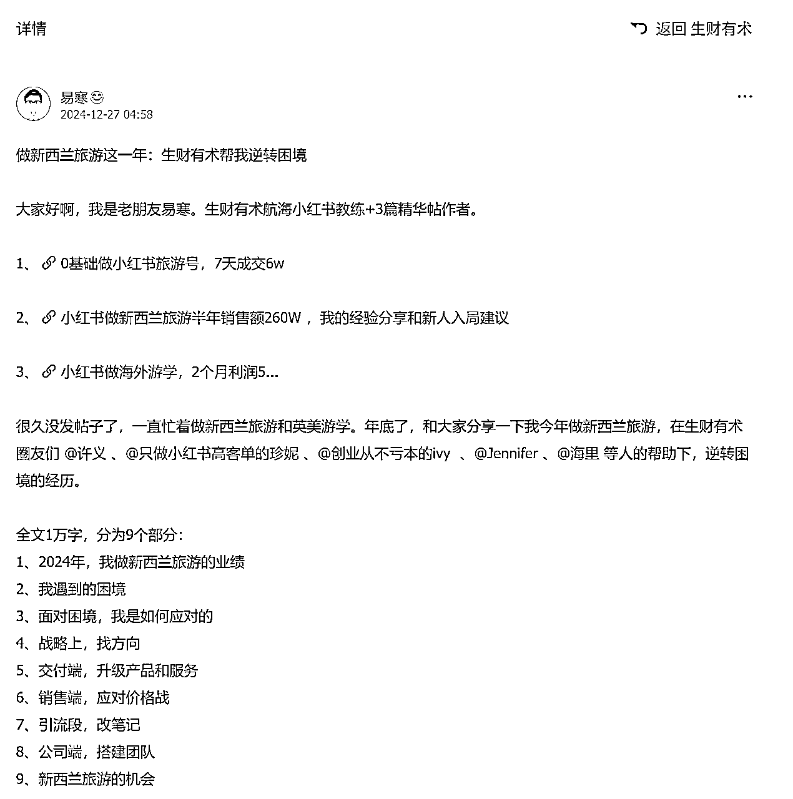

因为生财有术这个平台，我遇到了易寒老板，现在他在带我：和新西兰旅游行业的外国企业沟通，拿下新西兰当地商家的小红书代运营业务。

我通过“打钱”以及“观察别人的实际行动”这两种方式，找出我想要合作的人。

后来，我又认识了我的运营合伙人，这是我在开展房产单边代理业务期间的机缘。他为人特别踏实，执行力超强，还具备出色的风险把控能力，这些特质正是我一直以来苦苦寻觅的。

我一直在找这样的人。

我创业以来，一直试图培养出这样的人，但是我培养好几年了，我的效率也比不上，我直接从生财圈子，吸引到这样的人。

我能转行成功，遇到优秀的小伙伴一块前行，正是因为：

我通过生财有术，不断分享自身的经验，不断扩大个人影响力，从而吸引别人找我，然后，我再从中找对的人。

时间会代替我，帮我看清楚：这个人是不是，能和我一起前行的伙伴。

## 找对人，确定项目后，用上这套心法去转行

在你已经有确定的项目后，当你找对人，就可以开始转行了。

转行时咱们要注意什么？以下是一些心法，如果咱们没有这些心法，也很可能会转行失败的。

我将心法分为三块：

向人提供情绪价值/不索取情绪价值

向人提供实用价值

向人提供钱和资源

以下是转行时的正确做法和错误做法：

### 向人提供情绪价值/不索取情绪价值：

### 正确做法：

1）自己难过，别让跟随陪伴自己的人也一起难过。自己消化好情绪，消化不了就去看正版的石剪布理论（公众号搜索ayawawa，看她的大星球），降低自己心气，不要能力达不到，还既要又要还要，那当然日子难过啦。

2）如果有钱，就花钱去买心理咨询师的服务。

3）如果想要展示自己的成功，就给身边人打钱，请大家吃饭，给大家送礼。别自己炫耀完了，却只让大家听一下钱袋子的响声。

这里分享一个珍妮在转行时自己的例子吧：

我转行的时候，总是需要加班。我是没什么时间带小孩的，也没有那么多时间陪伴家里人，很多时候是我家人在付出，所以我才得以顺利转行。

转行很难也很辛苦，经常需要熬夜。我日常会泡在石剪布相关的娃粉星球，每次看到世界上有这么一群又漂亮又努力，明明已经很有财富很有学历很有地位，却还心气这么低的人，我就会反思自己：做的还不够好。

当我转行遇到困难，日子很难受的时候，我明白是我高攀了现有的行业，所以才会辛苦。

我会认为这些辛苦是理所当然的，是转行应该付出的代价。

任何一个行业，如果不曾在一个赛道深耕过，怎么可能赚到钱呢？

我能从留学转行到房产，甚至现在进一步有所成就，并不是我多么懂房产，而是我借了房地产老板的势能。

而我自己之所以转行速度会比别人快那么一点，也是因为我在新媒体平台玩过很多很多年了。

我2016年就自己写过公众号，开过斗鱼直播，写过知乎，陆续赚到过小钱。

一直到2022年，我才靠小红书真的创业成功，如果我从来没有培养过自己在新媒体平台的获客能力，我依旧没法转行成功。

转行会比较难，尤其是对于有孩子的女性创业者，更难，如果你真的遇到了什么难处，赶紧去找心理咨询师，不用自己强行挺过去。我也会有遇到难处非常痛苦的时候，我就赶紧花了500-700一小时去问咨询师，一般打个一两次电话，这个难处就自动消失了。

我是我同学里混的比较好的了，如果我喊大家出门聚聚，我就会请客吃饭，提前准备好礼物和礼品袋去送人，因为想要做到【不找人索取情绪价值】，就不要总是秀自己多么有钱，一定要把钱花出去。

总是「秀自己的钱袋子，享受周围人羡慕的声音，但从来不给周围人花钱」的人，都是在找别人索取情绪价值，是很惹人厌的行为。

### 错误做法：

1）对给自己打钱或者给资源的人倾吐负能量，还不给对方反手打钱，自己甚至好吃懒做还划水。

2）付的学费不够多，但想要贵人给自己包办终身，彻底改变自身命运。

3）天天抱怨：这活我干的很辛苦，你不给我涨钱吗？你这个钱也配得上我干这个活吗？如果不是干了你这个活，我现在不会这么辛苦。（实际上自己离开这个活之后，遇不到更好的活。因为如果真的能遇到，根本不会抱怨好嘛，会马上走人。）

4）受不了任何委屈，凡事都要讲个道理，讲究公平，一言不合就开怼，甚至把客户爸爸得罪，让领导层帮自己擦屁股。

5）推卸责任，事情没出结果，就都是别人的错。

6）怀疑质疑任何人，对每个人几乎都不信任。

7）我三天两头身体不舒服，你竟然不体谅我？你对我太狠心了。

8）家长里短天天拿去和别人说，把负能量全说给身边亲近的人，哪怕不熟的人，都把咱身上陈年烂谷子的事情全部摸熟了。

9）宁愿花时间撕逼抱怨，刷各种乱七八糟的负能量内容，也不愿意花时间提升自己。

10）质疑身边的人“你和我水平差不多，你凭什么说我/教我？就凭你也配来指点我吗？”

11）别人离开我，就是别人忘恩负义，不识好歹。

12）沉迷情绪价值，希望有人可以无条件爱自己、跟随自己、跪舔自己，从没想过自己可以和别人交换什么，从没想过自己能交换的东西是不是别人想要的。

13）某某某晒买了豪车/房子，我也想要。ta凭什么过得这么好啊，让我恶心ta几句。

14）疯狂炫耀给【现在没有自己成功的】身边人，希望身边人给自己提供情绪价值，但又不给对方钱，给对方花钱抠抠搜搜。

15）看不起比自己地位低的人。你是什么货色，也配和我用一样的等离子电视机？（不好意思这里乱入《狂飙》电视剧。）

16）朋友圈疯狂炫富，炫富的同时不忘拉踩比自己财富少的人，每天都有1万个牛逼要吹。

17）觉得自己很牛逼了，于是开始变得很高傲，很没有礼貌，说话态度咄咄逼人，让人感觉要么不好相处，要么像嘴里带刺。

珍妮角度：

我确实是在转行路上，遇到过以上17类人中的任意一种，有些人可能是17条里面占了很多很多条。

我们占据的条数越多，就代表我们越喜欢索取情绪价值。

一个经常问别人要情绪价值的人，是要做好给周围人打钱的准备的。

按照情价一天，价值3000来算，你，准备好，要给周围人打多少钱了吗？

如果付不起这个价格，还索取情绪价值，毫无疑问，身边的人会陆续离开我们。

我有时候会在自己一些小圈子里分享“如何把石剪布理论用在职场上”，或者分享“我如何管理外教员工”，其实我的目的并不是真的把我和外教相处时发生的事情记录下来。

而是我平时也会遇到很多人，其实犯的是和外教一样的错误，导致自己在职场或者情场都不怎么如意。

如果我和对方不熟，直接对人说大实话，说“你好索取情绪价值啊，你这样很损贵人运”，那人家也会打我的脸，觉得我管闲事。

如果我和对方很熟，对人说了这些大实话，也可能打了别人的脸，让熟人觉得我句句戳他心窝子，所以我就故意专门举外教员工的例子，借此影响我身边的人。这样我身边的人就会越来越正能量，我也过得越来越好。

### 向人提供实用价值：

### 正确做法：

1）能干活，能指哪打哪，身体好，执行力强。

2）积极汇报自己日常的工作，分析自己现在遇到的阻碍和想解决的问题，以及自己是怎么解决的。

3）把自己现有的资源梳理一下，问领导：有没有什么我能帮得上忙的？

这里也举珍妮本人的一个例子：

我确实是少数，能这么快转行成功的人了。

在转行的途中：

能干活，能指哪打哪，身体好，就是一个【转行人】必备的基础素质。

关于「能干活」，一般我除了执行力拉满，自己卷自己以外，还能在5分钟内秒回金主爸爸的信息。（除非真有什么特殊情况。）

我之所以被人看到「我是一个能干活」的人，是因为：当时我在生财发了文章，提到「留学行业两年做了2700万营收后，对留学赛道的趋势分析」，这篇文章爆火后，我被很多老板看到了。

地产老板就是其中一位，他就打钱买了我做的一个付费社群，那个社群的价格是同类品中非常有性价比的，是我专门用来在互联网上交朋友的产品。

恰好，我是在这个社群里一周六更分享我对小红书各个赛道的运营打法分析，地产老板看到了，觉得我们sop非常细致，是他所需要的，就给我打了代运营费，带我做房地产了。

关于「指哪打哪」，我一般是「指哪打哪」，但我也会有「不指哪打哪」的时候，这时候我往往觉得贵人的方法错了，我就想再试一个路子，于是我就去试了，果然撞了南墙。

撞完南墙我秒怂，赶紧给贵人转账送礼道歉三连。

关于「身体好」，我知道转行会需要时间，也很耗精力，所以我日常会花时间保养身体，每天晚上都要躺在砭石床垫上躺着，白天就坐在砭石坐垫上，有时候脚下再开一个足灸仪灸脚，定期回趟长沙做身体护理做正骨刮痧，因为我知道：只有我身体好，我才能提供别人需要的价值。

如果我身体垮了，那我对别人也没啥价值，还转个啥子行。

关于「积极汇报自己日常工作，分析自己现在遇到的阻碍和想解决的问题，以及自己是怎么解决的」。

这一点，是带我转行的房地产老板教我的。

他会给到我一个框架，教我复盘日常工作。（我自己以前从来没有这种框架思维。）

关于「问领导：有没有什么我能帮得上忙的？」，一般我会先梳理自己有啥资源和能力，然后再去提问。当然还有些事情是不需要提问的，要靠观察，能帮上忙的时候，要赶紧去帮忙。

### 错误做法：

1）遇到事情自己不好好解决，想要让贵人给自己兜底。

2）自己没学会就是贵人没有好好教我，人家作为贵人，凭什么就得好好教我们。想学东西，付学费回学校里去学。

3）我身体不好，请假，请假，请假，请假，三天两头请假。

4）这赛道不行，我再看看别的赛道。我去跳个槽，我去换个大腿。（最后折腾一年啥也没干出来个水花。）

5）我的过去很辉煌，没事的，摆烂也没关系，我还会东山再起的。

6）哇哦领导不管我，可以划水摆烂了。

7）这进度条好一般啊，算了，这关我什么事呢，这是别人的事。

8）这钱到手好舒服啊，想在这里养老一辈子，我每天都表现得自己挺努力的样子，别人应该也没法说我什么吧？（然后根本不继续提高自己的能力，直到出局那天都不知道自己为什么出局）

珍妮角度：

以上8条任意占到2条的人，其实要先去把自己的心态调整好，而不是用这样的心态去转行。

因为这种心态其实很危险，很损贵人运。

任何一个能地位比我们高，需要我们去向上社交的人，

往往都在某些方面有远远超过我们的地方，人家怎么可能会看不透我们在划水呢？

怎么会看不透我们提供的价值没啥用处呢？

一个人一旦需要向上社交，那就代表他是这段关系里的弱者。

一个弱者，还划水，还不忠诚，不好好提供价值，还想要别人给自己兜底，等等行为，那么弱者肯定是要出局的。

注：

弱者的忠诚并不值钱，因为弱者的忠诚是他们在一段关系里的安身立命之本。

只有强者的忠诚，才有价值。

### 向人提供钱和资源：

### 正确做法：

1）无论自己处境有多难，别给贵人添麻烦，除非我们给贵人打的钱足够多，带来的有效资源足够多，才能勉勉强强麻烦贵人帮帮我们的忙。

2）要打造自己的影响力，成为有资源的人。

3）赶紧给帮过我们的人送礼，以各种名义送礼。

4）能帮别人的地方顺手帮一把。达则兼济天下。

这里也举珍妮在转行时的一个例子吧：

我平时一般不找人帮忙，如果我找人帮忙，我会先评估下：我能和对方交换什么？我能给别人提供的东西，是对方需要的吗？

日常我也会花时间打造自己的影响力，因为任何一段关系，想要长久，至少要是并肩齐行的关系，而不是一方强一方弱的关系。如果想要把选择权拿在自己手里，那自己就要让对方多占咱们便宜才行。

但作为一个转行的人，作为一个需要抱别人大腿的人，我们才是那个弱者。弱者除了好好干活以外，也要积累自己影响力，慢慢变成强者，去回馈帮助我们的人，这样一段关系才会走的更加长远。

我平常赚到钱后，就会找一些机会给贵人送礼或者送钱，因为情谊的积累是在日常，而不是在「等到危机出没」的时候，才来亡羊补牢、临时抱佛脚啥的。

转行的时候我知道自己会很忙，所以面对我的家人，一旦我入账了一笔大额收入，我知道我公婆可能不好意思收我的钱，我就会找借口说自己收款码不能收款了，然后借机给公公打6万块钱。如果公公非要把这笔钱给到我和我老公，我和我老公就会说“现在收不了钱了，不急，放您那里。”

我婆婆过生日，我就会去老凤祥给她买金饰品。

（补充：因为一个人平时喜欢送我们什么东西，往往就是对方自己喜欢的东西。我还有些朋友会送我香水、彩妆、鞋子、养生品，所以我知道：这是她们自己也喜欢的东西。我婆婆喜欢送我金饰品，而且每次都是老凤祥这个牌子，所以我知道她喜欢老凤祥的金饰。所以我一旦买金饰，我不会买别的牌子，我就盯准老凤祥去买。）

我会长期在闲鱼9折回收家门口超市的购物卡，然后把回收到的卡片充值到我婆婆的超市账户里，方便她购物。

日常我会留意一些选品特别好的圈子（娃圈），只要那个圈子开始带货了，我就会买来送人，送贵人，送朋友，送团队。

为了能送礼时能找到合适的品类，我准备了以下内容：

1）入了一款大健康产品的代理人，这样可以用比较低的价格入手靠谱的产品，包括无烟艾灸仪，砭石坐垫，砭石床垫啥的，我经常买砭石坐垫拿去送给平时需要久坐的人，因为确实太好用了，而且不上火。

2）遇到送礼后可能会觉得我浪费钱的家人，我就统统送金条。除此以外再花几百块钱买对方平时喜欢的 东西，比如买一条烟。或者买对方需要的东西，比如买套秋衣秋裤。

3）遇到爱漂亮的女人，我就送化妆品，送饰品，送花等等。她们喜欢送我什么，我就按照那个品类去选。

达则兼济天下，这不仅能帮到别人，还能积累自己的好运气。好运气的积累是靠「我们给别人带来了多少好处」去积累的。这种好处也许是：我帮了对方一个忙，我给了对方更多钱，等等。

举个例子：

我在南山文体中心旁边听一首歌，我会给别人打200块钱，因为文体中心旁边听歌的人很多，而在那唱歌的歌手就那么几位。我虽然不是很大富大贵，但我的日子已经过的比很多人好了，所以我有时候就会在这些事情上花花钱，因为我也没给这个社会帮上太多的忙，那我给歌手打打钱，让大家听到更多歌，让深圳工作繁忙的人收获快乐，那总是可以的吧。

以前吃外卖，如果我的外卖地点填错了，外卖员竟然还帮我从错误地点拿了回来，我会给外卖员发红包，再给外卖平台打个电话，给平台说，XX外卖员真的太好了（虽然不知道这有没有用）

我在广州买房的时候，因为我急着把房子赶紧出租出去，但房子有些小细节没处理好，我自己又没时间弄，我就会拜托中介帮忙，然后我会给中介寄几百块的草莓，刻意寄到门店，让他和他同事一起尝，这样店长就会觉得“XXX服务真是不错啊，房东还给你寄礼物”。

做服务业的人都知道“我们服务业的人是很看重客户对我们评价的，因为方便我们去做宣传”，我就会给中介小哥写长长的好评，方便他拿去宣传。

我因为平时积累了这样的好运气，所以哪怕我在转行过程中有一次差点因为身体不好而缺氧完蛋，都恰好是生病在了正骨医生的床上，所以被及时救回来了。

而且每次，我遇到危机的时候，身边恰好都会出现帮我忙的人。

### 错误做法：

1) 你找我合作就是你有求于我，哪怕请我吃饭，我也依旧看不上你，就算我跌落凡间，我也曾经是人世间最亮的星，你算老几。

2）自己啥也不懂，仅仅因为现在日子不好过了，就给下面的人加KPI。最后钱浪费了，活没干成。日子越来越难过。

3）自己好吃懒做，就挥着鞭子让马去吃草，工资也涨不了几个，还嫌马儿不会跑。

4）自己多吃多占，不思进取，就说是下属不够努力。

5）日子好舒服呀，我拿着老板的钱去干别的，他应该看不出来吧？

6）完全不管钱和资源花在了哪里。

8）抠抠搜搜。钱到了自己口袋就不可能吐出去了。别人为我们花1万，我们为ta花100都心疼，恨不得钱都是自己的。

珍妮角度：以上8条占到2条，就很危险了，99%的概率，会转行失败。

# 附录1：我快速阅读生财文章的小技巧

## 快速阅读并理解生财有术的内容

我平时快速摘抄内容时，会依据以下框架进行，分享给友友们：

A. XX文章标题

B. 文章发布时间

C. 文章链接

D. 文章框架

E. 我觉的有用的观点

F. 我觉得有用的证据

为什么要这样分类呢？以下是细分原因：

1）记录文章标题：是方便我琢磨“别人的精华文都是怎么取标题的？”如果有天我也要写精华文，我可以怎样取标题？

2）记录文章发布时间：是方便我去判断：这篇文章有没有时效性？会不会有天内容过时？还是可以当做经典来看？

3）记录文章链接：是方便我有疑问的时候，能直接通过链接跳转回原文，进行详细查看。

4）记录文章框架：是方便我快速理出文章结构，从中精准找到重点内容。

5）记录【我觉的有用的观点】：便于提取出对我当前所在赛道有实际帮助的信息，方便将其运用到自己的工作中。

6）记录【我觉得有用的证据】：是方便把上方第五条中【有用信息】对应的文章正文内容粘贴上去，方便我随时回看，加深我对观点的理解和应用。

## 快速理解运营者背后的思路：

一定要深入了解运营者背后的思路，这样才培养出全局思维，更清楚自己该朝着什么方向使力。

举个例子，进入生财有术这个圈子后要干嘛？是赶紧搜内容吗？还是一屏一屏地滑动屏幕浏览呢？其实都不是。

作为一个圈子的创始人，一定经常被成员提问，为了避免反复回答同样的问题，生财一定会制定一份新手指南。

同时，社群里面一定生产出了很多精华内容，那么精华中的精华在哪里？不同的精华分别适合哪一类型的人？生财也肯定对这些进行了整理。

对于一个拥有几万名成员的圈子，每天都会产生海量的内容，那么如何把这些内容进行归类呢？归类的标准又是什么呢？生财也一定有讲清楚“每个版块里的按钮具体代表什么意思”。

所以，下图红圈，蓝圈，绿圈每个版块究竟有什么含义呢？就需要我们去仔细琢磨下。

想要快速理解这些版块含义的关键，就是在蓝圈的置顶内容部分。对于任何一个新手来说，都可以快速看完“置顶”内容来获取重要信息。

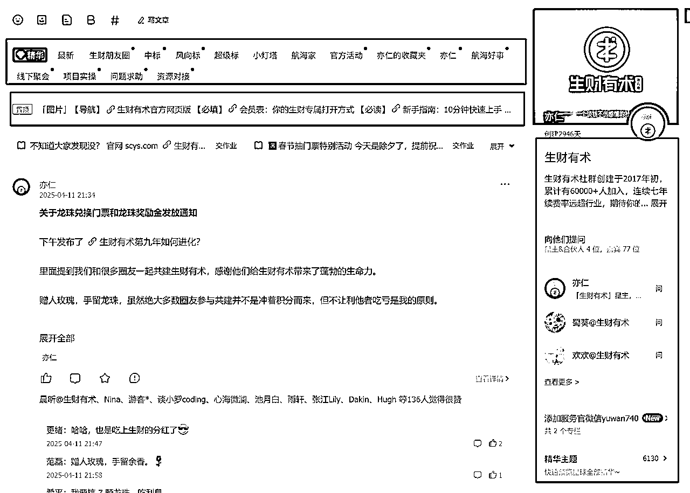

进入一个圈子后，第一件事，一定是先仔细看群规，查看置顶信息以及新人指南。

但是，有些人会直接把以上信息略过，马上开始提问，实际上，他们所问的问题在新人指南中已经有了明确的解答。

如果我们去反复提问，会导致自己的效率非常低下。

想要快速获得一些信息，可以把群规&置顶&新人指南看完。

# 附录2：珍妮和合伙人的转行经历

2022-2023涉足留学赛道：

小红书两年做了2700W营收后：我对「留学行业的趋势分析」

https://t.zsxq.com/DT1SJ

小红书教育赛道GMV1600万/年，小团队创业心法

https://t.zsxq.com/aPL7f

粉丝3000月营收20万，小红书低粉高变现的蓝海攻略分享

https://t.zsxq.com/XXl6X

2024涉足房产、旅游赛道：

留学从业者转行去「大蓝海」，2个月卖出1个小目标的产品❗（第一集）

https://t.zsxq.com/k8Nsa

2024，哪些赛道的人要「提桶跑路、去哪里找蓝海」❓留学赛道转行2个月卖出1个亿后的分析https://t.zsxq.com/SOgPV

未来10年普通人少有的、还能走的高利润赛道：房产单边代理的趋势分析

https://t.zsxq.com/Q0HDl

“二手房赛道之卖房单边代理”：赚钱环节简单拆解

https://t.zsxq.com/diiKG

卧底深圳房产中介：我发现了小红书房产获客的误区

https://t.zsxq.com/XOMZh

海外旅游赛道，天坑赛道中的清北，2024要怎么破局

https://t.zsxq.com/KeDG9

老板「有手就会」的心法：

老板避雷手册1：年1100w营收背后，如何识别不合适的运营人员、合作商、合伙人？

https://t.zsxq.com/Fvvr8

老板避雷手册2：运营端忽视这些细节，会让你血亏500万

https://t.zsxq.com/LhyXR

老板避雷手册3：如何识别不合适的运营人员、合作商、合伙人？

https://t.zsxq.com/2Wg9U

老板避雷手册4：卖「合伙人产品」要避开的雷区，2个半月卖122.98万后，我的观察

https://t.zsxq.com/r7CMz

老板避雷手册5：如何招聘、筛选小红书运营人员？

https://t.zsxq.com/qniLQ

老板识人大法：如何避免被人割韭菜？筛选运营、销售、与交付人员？

https://t.zsxq.com/RB6mX

老板家庭关系：如何和另一半&长辈相处，实现2700w营收的同时稳定家庭？

https://t.zsxq.com/49u9r

我是珍妮，很高兴能在生财与你相遇。

生财真的是一个：会开启你新的人生的地方。

如果你想转行/做好副业，期待你在生财圈子如鱼得水！