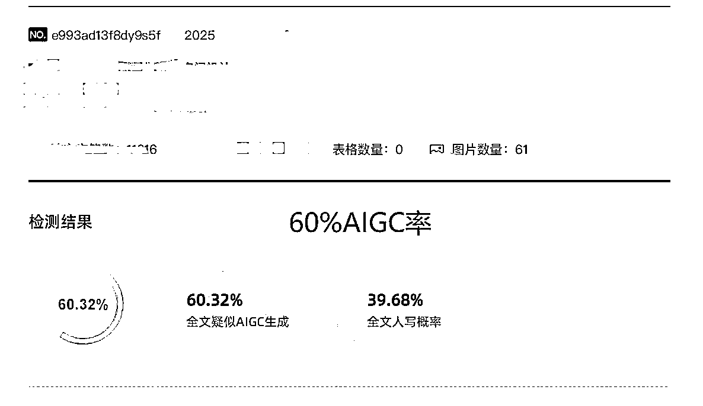
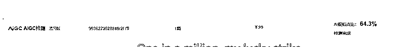
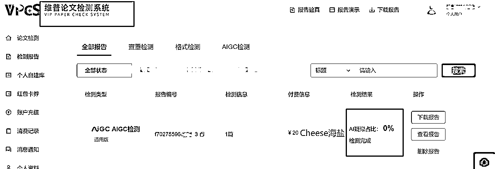
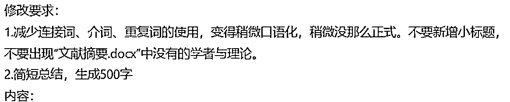
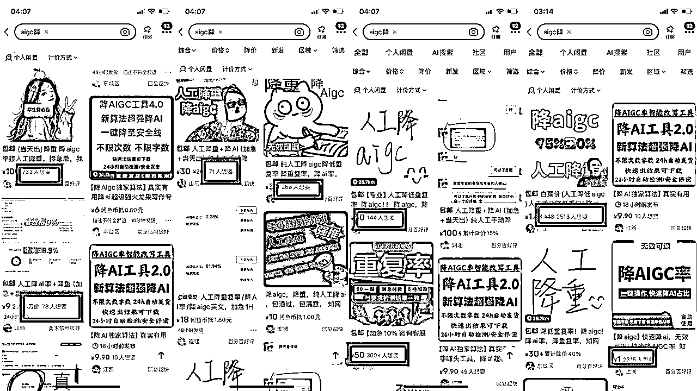

# 客户怒斥AI稿件都是垃圾要退款？3AI率检测报告一键跌破10%（AI写作一线最新实战经验分享）

> 来源：[https://atbs4xk1uw.feishu.cn/docx/BmJdd0etMoWbvlxO9yIcp2ZfnzU](https://atbs4xk1uw.feishu.cn/docx/BmJdd0etMoWbvlxO9yIcp2ZfnzU)

用实战数据打破偏见，让AI写作成为隐形生产力。近期AI检测平台频繁更新检测算法，到底有没有一键降AI解决方案？

# 一、业内乱象

在干AI写作服务的宝子们，是不是每天都被客户要求，知网、维普、格子达，超星大雅、万方，甚至看见就一万匹cn马在内心奔腾的paperpass AI检测要20%以下！不然就闹退款，说你拿AI写了个垃圾给他？

我们经常用很多话术轮番“洗脑”搞定客户，给他讲明白了残酷的AI检测现实。例如：

### 奉上我们一直在用的百用百灵关于AI检测客户质疑场景的客服话术

【客户需求】

我用paperpass检测了你们的稿件，AIGC率60%，你们是AI写的吗？这肯定不行的

【客服话术】

宝子，是这样的，目前全球AIGC检测技术都是不成熟的，误判率非常高，所以你用paperpass检测也是不准的，没有可信度。AIGC我们只能针对具体平台给你降。虽然检测都不准，但是为了满足你学校要求，我们会给你做，让你通过

建议等学校要求具体用哪个检测平台（一般会用付费的知网、维普等），具体的AI率降到多少时（和查重率要求是一回事，比如，学校要求知网平台、AI率15%以下），你拿着知网检测结果假设AI率30%，那不合格，来找我们降，我们只能根据已检测的报告结果找针对性的去降，基本降1-2次就OK了，如果检测平台是付费的，检测费用由客户出哈，一般学校可能会给几次免费检测机会的

不同平台检测都不准，结果也不一样，我们针对知网的给你降下去后，你用付费的维普去查，可能又是AI率高的。因为都不准，所以只能针对学校指定的网站降。如果我们帮你降了知网平台的，最后学校要格子达平台的，就白做了，需求变更，要根据工作量补差价的哈。

所以，如果学校没有AIGC具体平台的要求，就不需要关注哈，按照我们经验就可以，不用浪费这个钱哒

但，整个流程并不是你看起来的这么顺畅....

很多无脑客户，会和你撕逼扯皮800个回合....有这个时间撕逼，我们可以接完很多订单了....

这tm是在教育客户...教育市场...苦的一逼....

一顿骚操作，客户确实不闹退款了，但客服售后环节，效率低的一批....且扩张客服中心时，需要的是矩阵客服，并不是每个客户都有很牛的谈判斡旋能力，小客服经验不足，一个把控不住，就容易出问题....

就算搞定了客户，心里也非常难受！依旧觉得客户也是这套不合理AI检测机制下的受害者，一群老师要交征文，他们手搓完的稿子上传格子达，52%AI率...要降AI！客户自己手搓的稿子，也tmAI率很高！我们写手真的手搓的稿子，也tmAI率很高！完全随机发生事件....

AI时代，所有人一边要拥抱AI（包括客户！会拿自己写的AI搞，找我们降AI！），用AI赋能传统文案写作服务，一边无脑的被全世界都不准的AI检测机制搞心态！AI率超15-20%直接拒稿！投诉账号！差评！甚至退款！

新事物的出现，鱼龙混杂，规则不完善，处于混乱期。

但！机会来了兄弟们！这就是个巨大的异常值，商机

前几天测试阶段，降AI率工具分享，也中了亦仁哥的风向标啦~

AI写作，既要马儿跑，又要马儿不吃草....

你以为降AIGC率只是改几个词？不，无数人在此栽倒，看见太多人去真的手搓修改重写，一搞搞一天两天....然后一检测，80%...这是一场与算法的心理战....(搞人心态)

* * *

# 二、4大场景搞定一切AI检测需求

## 2.1 如果是知网/维普平台检测AI率

使用 香蕉降AIGC工具 https://banana.paperjai.com/#/ 来处理，一般可以一键降到10%以下，注意降后读一遍，人工核验必不可少

超级好用！

备胎：爽歪歪工具syypaper.com 也能一键降到10%以下，但是贵一些

## 2.2 如果是paperyy/paperpass免费平台检测AI率

也可以使用 香蕉降AIGC工具 http://banana.modifypaper.com/ 来处理，能降低不少

但无法完全保证降到10%

备胎：爽歪歪工具syypaper.com 也能降下来不少，实际测评下，也是无法没法保证降到10%，稍贵一点

## 2.3 如果是国外的turnitin平台检测AI率

只需要先写中文稿，按照之前海盐之前的精华帖的《一文讲透AI高质量写作底层方法论》教程，用任务拆解法+原子任务法，写出高质量、无AI结构、AI词汇的稿件

再用Google翻译为英文就好啦~屡试不爽！

核心要领是，中文稿件要无AI痕迹，按照方法论教程中知识点，去除AI词汇/AI结构要去的干净~

自动搞定！

## 2.4 如果是格子达平台检测AI

格子达相对麻烦一些，工具目前还没有能一键搞定的。

使用传统的降重工具“火龙果写作 https://www.mypitaya.com/”，经大量测试，目前只有火龙果写作，具备改变AI结构的效果（因为他真的改的一坨粑粑），能稳定搞定格子达。故！需要人机结合才能搞定！好，具体手法见历史贴《一文降透代写项目反AIGC检测的最佳实践》。

好啦~让大家头痛欲裂的这些AI检测网站，是不是都搞定啦！

# 三、3大工具横向测评分析

## 3.1 爽歪歪AI算法反向拆解

独创“逻辑重组+风格迁移”算法，进行语义重构，你会发现爽歪歪改出来的内容，人味很重，甚至会出现部分口水词~注意专业正式场合的稿件一定要人工修稿，一不小心，领导演讲稿变二狗脱口秀....

## 3.2 火龙果写作算法反向拆解

“句式变换+插词逻辑”双模式，就好像程序员的白绿格子衬衫...你写的是白色字，他改的是绿色字....500字，轻松改写成了1000字....所以一定要人工修稿，是最麻烦的，但可以搞定格子达！

## 3.3 香蕉降AIGC算法反向拆解

“类人族的全篇换词逻辑”算法，简单粗暴，把每个词（主谓宾定状补）都换位近义词，且句子通顺。采用的传统改写降重算法，但是真香！

工具选对，事半功倍；工具选错，熬夜改稿！

反向拆解了AI检测工具的算法逻辑，会发现，最后拼的还是语料库！想用AI算法打败AI检测，是真的难顶！他检测就不准，各平台结果差距大逻辑就不通....搞了1 6 13招，最后发现最好用的一直都是传统降重的人机算法！包括最早最早测试出来的火龙果，用的也不是它的降AI功能（真不稳定），而是用的它双重强力改写功能搞定的AI率！

# 四、降AI算法核心方法论拆解

测了太多平台，会发现降AI工具的有效算法共性：

语义层，打破AI模板化结构，拆分长句、调整段落逻辑顺序

词汇层，替换高概率AI词，如“综上所述”→“换句话说”，增加口语化表达

风格层，植入个人化表达，添加主观评论、行业黑话

相信大家也在用各种检测工具，例如朱雀大模型，实锤了，测了800遍了，真的不准....偶尔准一下，概率问题，真的偶尔

也相信大家经常使用各种提示词用AI来降AI率，试图用魔法打败魔法，例如，无数个宝子发了类似这种提示词给我：

哥，真不行，概率问题，真的偶尔。你用，你用就知道。

降AIGC率的本质就是走迷宫，检测的多了，这样改一下不行，碰壁了，撞墙了，拐个弯，再改改，继续撞南墙，直到发现需要全文替换近义词，持续打乱、替换，持续碰壁，最终走出一条康庄大道，欺骗检测算法，让AI真正的‘隐身’到幕后，然后拍着胸脯底气十足的和客户说“老子的稿子绝对不是AI写的”！（手搓是真的写不了这么好！）

教育行业需要善意的谎言。

手搓文案时代，1篇稿子改3天；AI赋能时代，1小时产出3篇合规稿（含AI率合规）！拒绝无效内卷，搞定行业乱象，让AI替我们打工，我们为客户服务，火龙果香蕉给我们AI检测的底气！

# 五、有点小异常值

弱弱说一句，从24年8月海盐搞出了第一波降AIGC教程后，发了《降AIGC能赚200块》帖，很多圈友去实操，喜报不断，最近听说的一个圈友，只做降AIGC，单兵作战月3-6w利润。素人是有点拼劳动力的，壁垒没有积累在自己这里，靠工具，但信息差足够赚很多钱了，天下武功，唯快不破。

只是和之前的帖子相比，现在价格基本打到了千字20-40了。

但，不重要。打开闲鱼app、“借鉴”就完了。搞它

