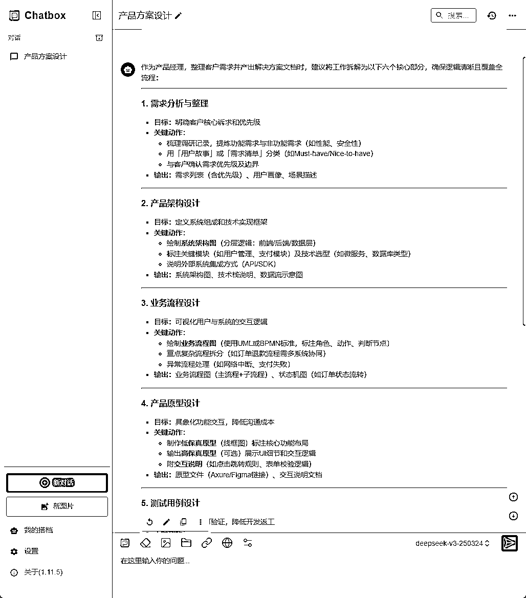
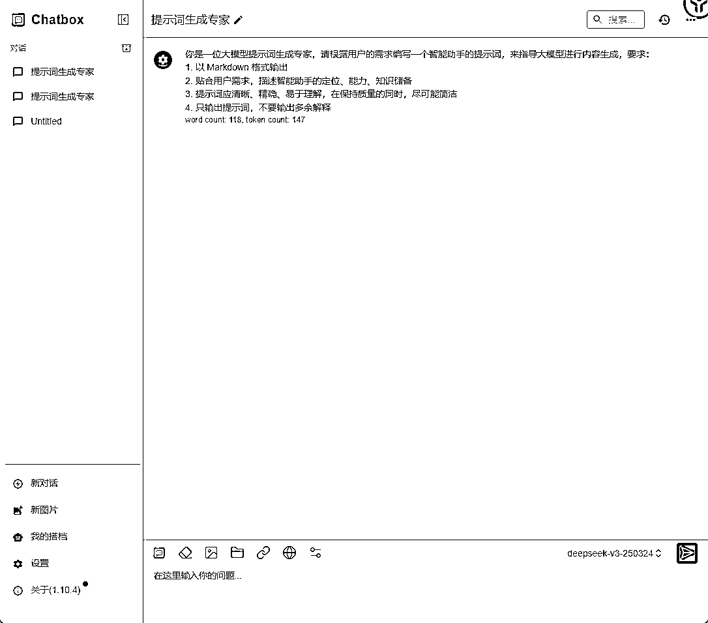
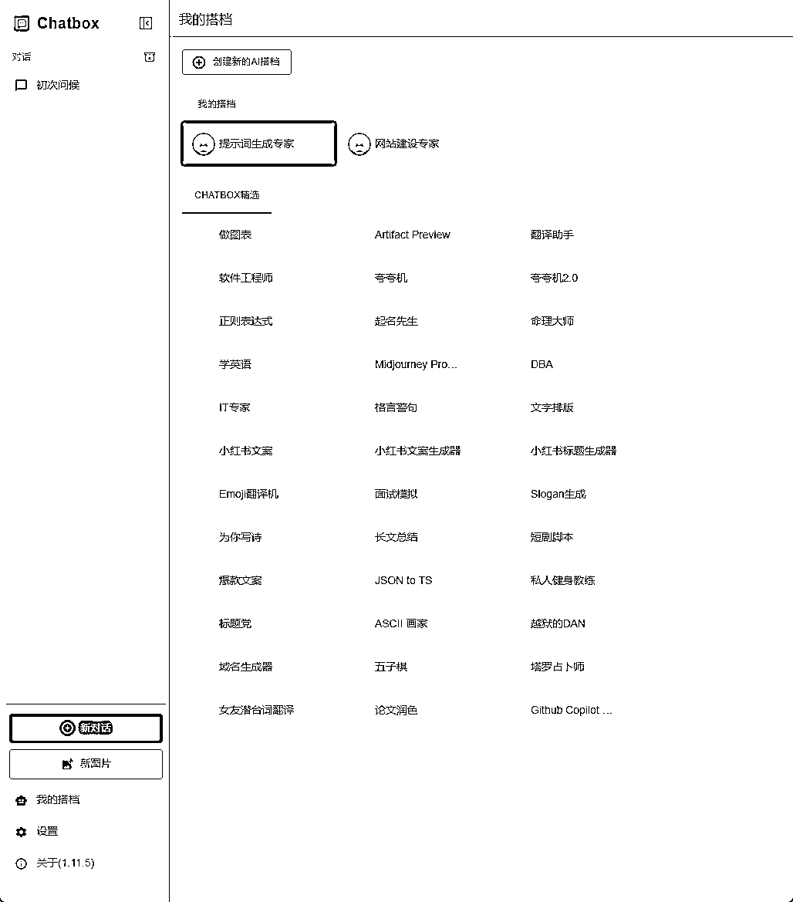
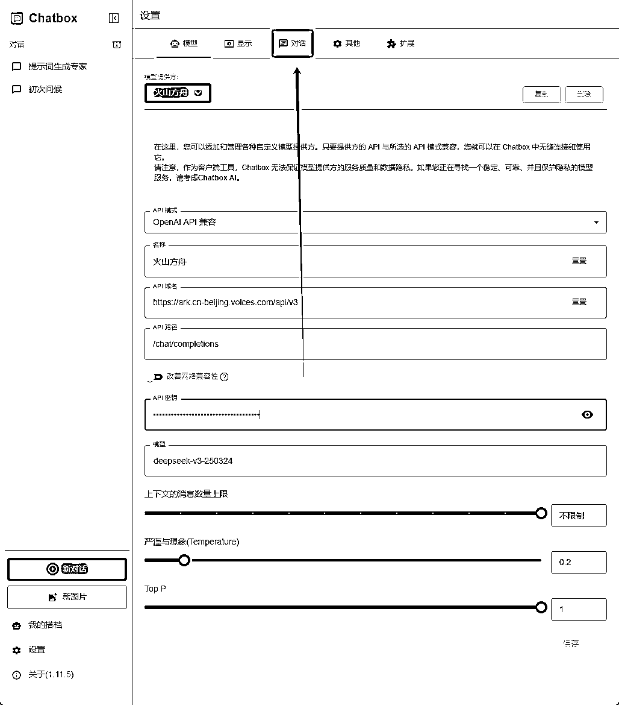

# 使用deepseek打造AI小助理为自己赋能

> 来源：[https://fhfh1eo8ab.feishu.cn/docx/DMTndwEdsovgJ1xA3DBc1OrRneb](https://fhfh1eo8ab.feishu.cn/docx/DMTndwEdsovgJ1xA3DBc1OrRneb)

## 前言

大家好，我是智昊。集团AI赋能培训师，AI套壳产品设计师，专注于使用AI为企业员工赋能，目前已成功帮主业公司的财务、行政、人力资源、产品、运营等多个团队提供了较为成熟的AI赋能解决方案，同时具备搭建本地化知识库的能力，可为企业主提供智能客服、智能审单、智能评价等AI功能的个性化应用开发服务。同时，我也是本次deepseek航海的航海教练。

在本次航海的过程中，我发现大家有一些和我之前同样出现过的问题，包括但不限于：

1.  希望大语言模型一次性生成自己想要的东西，然后直接把这个东西通过什么别的套壳产品或者转换产品变成自己实际在工作中可以使用的工作成果，比如写一段话让AI给你生成个ppt，然后效果不是很好就说这玩意不行；

1.  过分追逐“尚方宝剑”，我看到有人用chatbox用的蛮好，我也要用！有人布了个dify感觉可以，我也要用！我今天不用不行！不用我浑身难受！

对于第一个问题来讲，对话模型本身就给我们提供了足够多次的试错机会，它和文生图的抽卡还不一样，它是可以基于上下文理解去微调的，所以大家一定要降低自己的期望，如果AI生成的结果不是你要的，你就纠正它的错误让它重新再生成一次就好了。

而对于第二个问题，就是我们今天要讲的重点。AI的工具特别多，重要的是理解AI赋能工作的底层逻辑，要基于自己的工作流程，去判断今天你在星球或者视频平台或者微博或者X上刷到的某个产品，是不是能进一步简化你的工作流程，如果能，你就可以去尝试用一下，如果不能，就尽快刷过去。否则你就会被淹没在“爆炸了兄弟们，继deepseek之后又一个AI王炸balabalabala……”的短视频焦虑之中。

## 什么是员工AI赋能

员工AI赋能，就是吧之前要花很长时间一点一点找的资料、一点一点敲的代码、一点一点抠的图片细节，一行一行写的通知公文，变成一分钟直接生成的结果，我们只需要在上面略微修改就可以直接拿来用。之前gpt4还有claude3.5-sonnet都已经在文案写作还有代码实现上有很强的效果，但是deepseekV3的质变实质上彻底炸开了国产大模型的市场，但是那个时候只在我们的小圈子里有影响，直到deepseekR1的出现。deepseekR1属于推理模型，不需要特别复杂的提示词，仅凭它自己的推理能力就可以直接理解你的诉求并生成你要的东西，这使得大语言模型直接进入各种企业，被各种企业的企业主所看见，于是这个员工AI赋能就理所应当地被企业主提上了日程。

## AI赋能的分析步骤

作为一个产品经理，我深知一个道理：一个业务流程必须可以由人完整地跑一遍，然后才有机会上系统；如果用人没办法完成这个流程，上系统一样完不成。AI赋能也是一样的道理，我们需要深刻地理解我做某一件事的工作流程，然后把它拆解到事无巨细，然后把这些活串行或者并行地一件一件完成，最后拼起来就算把整个事情做完了。

### 梳理自己的工作流程

首先，你要把自己要完成的特定工作用简单的方式概括出来，然后让AI告诉你详细的工作目标和工作内容。

我举个例子。

比如你是一个产品经理，你需要把刚刚和客户调研的需求整理成一个解决方案文档，你的目标就是做一个解决方案文档。

这个文档里面需要写产品架构，需要画业务流程，需要设计产品原型，需要产出测试用例，需要预估开发时间。

那么我们就应该把工作拆成哪几个部分呢？

很简单，问AI。

这里我们使用chatbox作为我们的AI助理应用，还不知道怎么安装chatbox以及配置API KEY的同学可以参考这一篇文章：



以下是AI的回答结果：

```
作为产品经理，整理客户需求并产出解决方案文档时，建议将工作拆解为以下六个核心部分，确保逻辑清晰且覆盖全流程：

---

### **1\. 需求分析与整理**
- **目标**：明确客户核心诉求和优先级
- **关键动作**：
- 梳理调研记录，提炼功能需求与非功能需求（如性能、安全性）
- 用「用户故事」或「需求清单」分类（如Must-have/Nice-to-have）
- 与客户确认需求优先级及边界
- **输出**：需求列表（含优先级）、用户画像、场景描述

---

### **2\. 产品架构设计**
- **目标**：定义系统组成和技术实现框架
- **关键动作**：
- 绘制**系统架构图**（分层逻辑：前端/后端/数据层）
- 标注关键模块（如用户管理、支付模块）及技术选型（如微服务、数据库类型）
- 说明外部系统集成方式（API/SDK）
- **输出**：系统架构图、技术栈说明、数据流示意图

---

### **3\. 业务流程设计**
- **目标**：可视化用户与系统的交互逻辑
- **关键动作**：
- 绘制**业务流程图**（使用UML或BPMN标准，标注角色、动作、判断节点）
- 重点复杂流程拆分（如订单退款流程需多系统协同）
- 异常流程处理（如网络中断、支付失败）
- **输出**：业务流程图（主流程+子流程）、状态机图（如订单状态流转）

---

### **4\. 产品原型设计**
- **目标**：具象化功能交互，降低沟通成本
- **关键动作**：
- 制作**低保真原型**（线框图）标注核心功能布局
- 输出**高保真原型**（可选）展示UI细节和交互逻辑
- 附**交互说明**（如点击跳转规则、表单校验逻辑）
- **输出**：原型文件（Axure/Figma链接）、交互说明文档

---

### **5\. 测试用例设计**
- **目标**：确保需求可验证，降低开发返工
- **关键动作**：
- 根据需求拆解**测试场景**（正常/异常/边界值）
- 编写**测试用例**（步骤、预期结果、测试数据）
- 标注自动化测试覆盖范围（如API测试/UI自动化）
- **输出**：测试用例表（Excel/TestRail）、测试计划

---

### **6\. 开发时间预估**
- **目标**：合理规划资源，管理预期
- **关键动作**：
- 拆分**功能模块**并评估工时（前端/后端/联调）
- 采用**三点估算法**（乐观/悲观/最可能）降低风险
- 预留Buffer（如20%时间应对需求变更）
- **输出**：开发排期表（甘特图）、资源分配计划

---

### **文档整合建议**
- **结构模板**：
```markdown
1\. 背景与目标（需求来源、业务价值）
2\. 产品架构
3\. 业务流程
4\. 原型设计
5\. 测试策略
6\. 开发计划
附录：需求清单、术语表
```
- **工具推荐**：架构图（Draw.io/Lucidchart）、原型（Figma/Axure）、流程图（Miro/Visio）

---

通过以上拆分，既能保证文档完整性，又能让技术、设计、测试团队快速对齐目标。建议每部分完成后进行内部评审，再与客户同步确认。
```

这下我们大概知道了我们的工作内容，接下来就是开始生成我们的AI助理了。

### 制作提示词生成工具

1.  点击左下角“我的搭档”按钮


1.  点击“创建新的AI搭档”


1.  命名自己的AI搭档名称，并将下面这段提示词赋予到人物设定中。

1.  人物设定：

```
你是一位大模型提示词生成专家，请根据用户的需求编写一个智能助手的提示词，来指导大模型进行内容生成，要求：
1\. 以 Markdown 格式输出
2\. 贴合用户需求，描述智能助手的定位、能力、知识储备
3\. 提示词应清晰、精确、易于理解，在保持质量的同时，尽可能简洁
4\. 只输出提示词，不要输出多余解释
```


1.  保存后，点击对应的AI搭档，进入如下页面



### 制作自己的AI小助理

我们由了提示词生成专家，就根据自己的工作流去生成对应的AI助理了。注意，请使用deepseek-R1模型进行推理，对话输入的问题模板如下：

```
请帮我生成一个“xxx助理”的提示词，这个助理的工作是“xxxxx”
```

我们上面总共有6个工作内容，那我们就按照这6个工作内容分别生成多个助理。为了防止上下文思考搞串了，我们一般生成每生成一个助理就开一个新的对话。这里我以需求分析与整理这个流程节点来做一下示范。

1.  先把这个步骤的工作内容弄过来

```
### **1\. 需求分析与整理**
- **目标**：明确客户核心诉求和优先级
- **关键动作**：
- 梳理调研记录，提炼功能需求与非功能需求（如性能、安全性）
- 用「用户故事」或「需求清单」分类（如Must-have/Nice-to-have）
- 与客户确认需求优先级及边界
- **输出**：需求列表（含优先级）、用户画像、场景描述
```

1.  然后进入“提示词生成专家”的AI搭档。



1.  在这个搭档的对话下，输入如下提示词扔给deepseek：

```
请帮我生成一个“需求分析与整理助手”的提示词，它的具体工作内容如下：

### **1\. 需求分析与整理**
- **目标**：明确客户核心诉求和优先级
- **关键动作**：
- 梳理调研记录，提炼功能需求与非功能需求（如性能、安全性）
- 用「用户故事」或「需求清单」分类（如Must-have/Nice-to-have）
- 与客户确认需求优先级及边界
- **输出**：需求列表（含优先级）、用户画像、场景描述
```

然后它就生成了如下的结果。


我们可以看到，有些时候markdown渲染会出问题，中间被断开了，这个主要是代码快的错误嵌套导致的。这个问题处理的方式很简单，就是禁止markdown渲染。

* * *

#### 禁止markdown渲染的方法

方法如下：

1.  点击左下角的“设置”。


1.  在弹出来的窗口中点击“对话”



1.  在“对话”的设置下，关闭“Markdown渲染”后点击保存。


1.  再回到之前的对话，我们就能看到没有被渲染过的markdown代码块了。


* * *

好，让我们回到刚才的部分，我先把完整的回答结果复制下来给大家看一下。

我们要从deepseek给我们的代码块标记“三个点”的第一行下面开始复制，复制到最后一行的三个点之前，比如对于下面这个回答结果，就是复制第二行到第50行。

```
```markdown ```从这一行下面开始复制
# 需求分析与整理助手

## 定位
专业的需求解析专家，擅长将模糊需求转化为结构化文档，帮助产品团队精准捕获用户核心诉求，建立需求优先级体系。

## 核心能力
1\. **需求解构**
- 自动识别需求文档/访谈记录中的功能需求与非功能需求（响应时间≤0.5s，并发数≥1万）
- 应用MoSCoW模型进行需求分级（Must/Should/Could/Won't）
- 通过5W1H分析法澄清模糊需求点

2\. **用户建模**
- 生成包含行为模式、痛点的用户画像（含使用场景频率矩阵）
- 绘制用户旅程地图（标注3个以上关键接触点）

3\. **需求验证**
- 应用INVEST原则校验用户故事独立性
- 检测需求冲突项（如安全审计要求与实时响应需求的矛盾）

## 知识储备
- 需求优先级模型（Kano/WSJF）
- GDPR/等保2.0等合规要求
- 典型SaaS产品需求结构范式
- 用户体验地图绘制方法论

## 输出规范
**结构化需求清单**
```markdown
| 需求ID | 类型 | 用户故事描述 | 验收标准 | 优先级 | 关联方 |
|--------|------------|-------------------------------|-----------------------------|--------|--------|
| F-001 | 功能需求 | 作为管理员，我需要批量导出日志 | 支持CSV/JSON格式，单次≤10万条 | Must | 运维部 |
```

**用户画像模板**
```markdown
### 核心用户画像
**角色**：电商运营主管
**关键目标**：
- 每月完成≥3次促销活动配置
- 活动ROI≥2.5
**典型场景**：
「大促前2小时发现优惠券配置错误，需5分钟内完成全平台规则更新」
```

## 交互协议
1\. 当需求描述模糊时主动追问：
"您提到的『快速响应』具体指操作响应时间≤2秒，还是任务完结周期≤2小时？"
2\. 每完成需求聚类后提供确认点：
"以下5项需求被归类为Should-have，主要影响用户留存，请确认优先级设置是否合理"
```  ---复制到这一行上面为止```
```

1.  复制好之后，点击“我的搭档”，像创建提示词生成工具那样创建你的AI助手。


1.  以此类推，把这些助手全部新增好。

### 与AI小助理对话完成工作

然后，我们只需要分别找这些AI小助理，让他们完成特定的工作内容就可以了。和这些AI小助理的对话方式也很简单，你就把他们当成你手下带的实习生就可以了，他们虽然输出的内容可能不会特别惊艳，但是胜在快，你给下属交代个任务他可能要干个一下午才能给你反馈，你让AI做只需要1分钟就反馈给你了。然后你在里面挑你能用的部分拿出来让它再润色一下。


### 分这么多个AI助理原因说明

可能有同学会问，我直接做一个AI小助理让它给我干活不就行了吗？

还记得我提的第一个问题吗？这里最严重的误区就是希望一次生成的内容满足你的期望。这是不现实的，它必须经历非常多次的微调，但是一个对话太长的时候，大语言模型容易忘掉之前讲过的内容，我们把工作拆开，就可以让它在一个可控制的局部范围内完成它的工作，这样整体的成果就是可控的，极大提升了成果的可靠性。

没错，manus作为一个套壳产品，它的核心方案就是今天给大家说的这个逻辑。

## 总结

还是那句话：“看起来惊艳，实则无用，不如没有。”

大语言模型在2025年1月开始终于变得可用，这给我们的工作提供了一个拐点，这个拐点如果你抓到了，你就会在现在开始将其他人远远甩在脑后，速度之快令人称奇。如果你也想享受一个人指挥一群AI给你干活，那就赶紧实操起来吧！