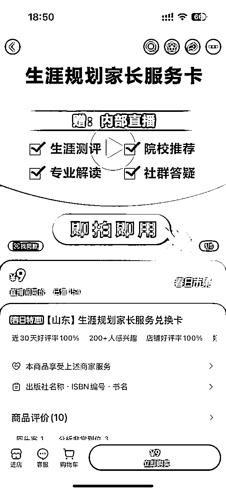
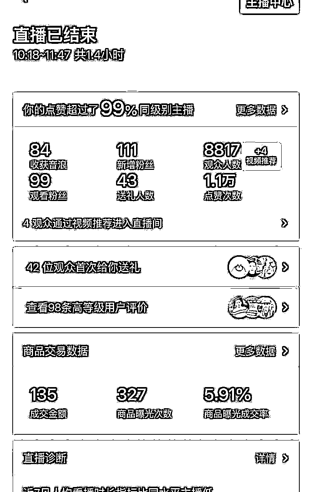
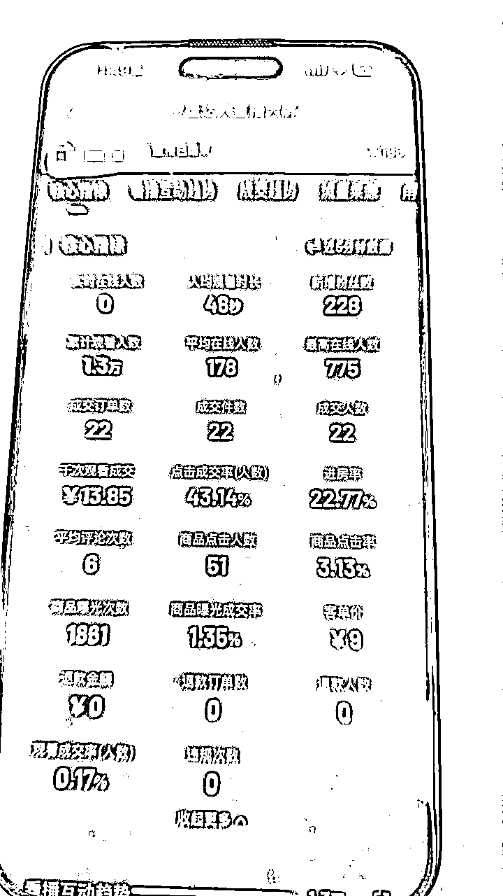
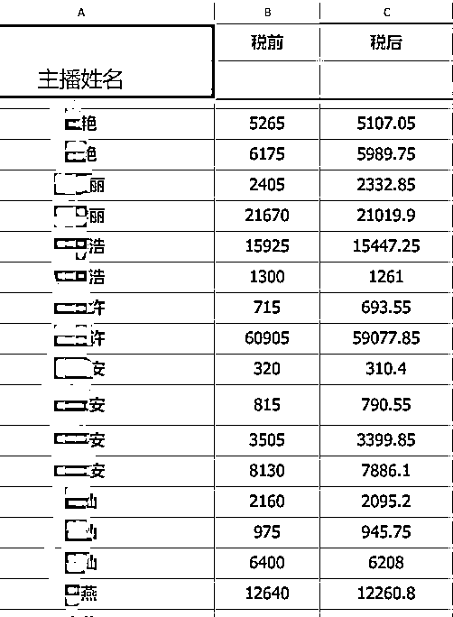
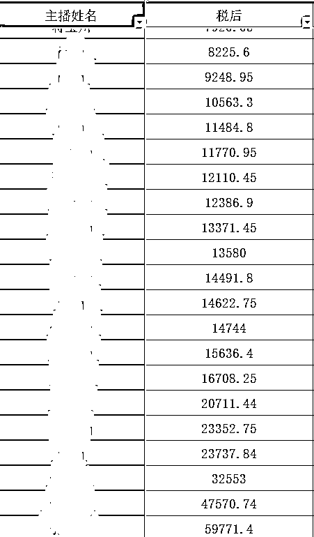

# 高考志愿填报直播获客航海

> 来源：[https://vfl52b71kz.feishu.cn/docx/EILidij07oMO8JxKamYcDjv9nCb](https://vfl52b71kz.feishu.cn/docx/EILidij07oMO8JxKamYcDjv9nCb)

大家好，我是 Lemon，熟悉的老圈友应该知道，近些年也一直在做教育直播相关业务：

从 20 年开始的考研直播，

到 21 年的少儿编程直播，

到 22 年开始深耕高中升学，

目前在教育获客 MCN 里也算做到了头部，一直专注于同城教育流量的获取。公司全部主播有 500 人左右，也帮助超千人通过教育流量变现 6 位数。

自 2023 年以来，除了直播业务外，我们基于自身专业优势延伸了【一对一高考报考指导】的业务（以下简称高报）。

其实最初做高报我们并没有什么大的想法，只是觉得家长找来了我们就接着吧，真正把高报单独拉出业务板块是在去年。一方面张雪峰老师的爆火让我们意识到，有 60% 的家长已经从传统的线下转移到了线上，而我们恰恰又拥有线上的天然优势；另一方面，在我们被市场推着接的这些单子的服务过程中我们发现家长对于孩子填报志愿这件事真的是一无所知，结合我自己过往的工作经历，我们确实打心里觉得志愿填报这件事不仅仅是一个生意，更是一件高于生意之外的有价值的事情。

# 项目到底在做什么

高考志愿填报作为高考延伸出的行业，随着高考人数的不断增加，新高考的普及，也被越来越多的家长需要和认可。据统计有近 7-8 成的家长，会选择志愿填报服务，来规避填报风险。也就造就了高报市场近 10 亿的市场空间。

原本我们之前只会基于自身优势，去服务部分本地家长，但随着近两年张雪峰老师的爆火，高考报考这个市场也渐渐从纯线下演变成了有 6 成家长愿意接受线上填报，于是自去年 9 月开始，我们着手培育了近 200 名高报规划师，2025 年开始我们全面用过往我们线上教培的模式去做高报业务。前端直播间卖低价获客课包（如下图），后端销售转化 1 对 1 志愿填报服务，主播只需要负责前端销售，我们按前端销售单结算佣金。

坦白说，2025 年是我们初次尝试把志愿填报，用教培课包的模式来获取客户，起初我们之所以这样操作只是为了迎合平台的合规性，大家都知道每个平台其实都在限制引流获客，而用订单的形式就让获客变得合规了，我一直认为，只有合规才能规模化，也只有合规才能走得更远，哪怕在订单到加微这个过程中会有所损耗。

3 月初我们刚推出这个产品的时候其实是卖得不太好的，一方面这些主播都是未经过筛选的新人，另一方面 3 月初确实家长的焦虑值还没上来。但我们坚信这个流程是没问题的，因为在去年 10 月我们还没有开始做引流品的时候我们纯销售 300+的前置志愿产品一场都能有 20 多单的销量。经过 3 月一整月的不停迭代优化，目前我们各个测试直播间的销量总算也相对稳定了，以下是我们该品在抖音的一些直播数据。

但从平台产出的角度来说，视频号肯定是远大于抖音的，并且我们自己抖音相对已经市场饱和，而视频号目前还有很大的市场缺口，所以这次我们全部精力都放在视频号。以下是我们在视频号的一些数据：

# 项目有哪些优势

## 能力复用

直播获客这个项目，本身就是一个相对低投入的项目，并且它是一个我认为能沉淀自己的项目，就算你在这个业务上没有拿到太大结果，但业务过程中沉淀下来的内容直播能力、高报专业等我认为都是可以为以后的一些业务赋能的。

## 设备简单

项目需要准备的设备也很简单，一张桌子，一台电脑，一部手机（最好是苹果），一个手机支架，一部平板或者一张纸，稳定的网络，安静的直播环境，就足够了，这对于大部分圈友来说，可能也不需要额外投入太多。

## 无需露脸

也不需要有直播焦虑，因为我们的直播形式采用的简单的手播，不需要漏脸，也不用脱稿，只需要熟练表达出话术就足够。

## 时间自由

稳定之后，每天固定时间开播即可，每场在 1.5 小时 -2 小时，每天 3-4 场，时间上较为宽松，可以根据自己的时间进行自由安排。

## 迎合趋势

恰逢到了高考志愿填报的旺季，无论是起号速度，还是引流的效果，都会更加容易。而且团队有整套的起号逻辑和方法，可以确保只要听话照做，几乎可以做到 100%起号，一般 10 天左右即可有正反馈。

团队也会给到完整的起号方法，直播话术，并且在航海中会有专门的运营老师进行帮扶，复盘。

## 可复制性强

一个人拿到结果，可能是巧合，但是团队从项目开始到现在，至少带领上千名同学变现超过 6 位数。目前还有近 500 名主播持续在播。

这里只是截图了部分主播老师的变现情况，有些老师可能会多账号一起直播，图一中会出现三位数是因为可能是新起账号。

项目收入也是非常直观好计算的，按照单条 leads 佣金 25 元，所以每天的进量，就可以估算出收益的情况。年变现 15-20 万。

## 可长期性

教育行业一直是一个非常值得深耕的行业，但是门槛确实较高，而高考志愿填报，市场大，门槛相对较低，而且无论是人口红利，还是政策红利，都在影响着这个行业。

而高报直播获客，则是我们去了解这个行业的一个切入点，也可以更快的拿到反馈，获得收益。

# 我们的优势

第一、完善的起号以及变现逻辑（可复制）

已经有上千名主播验证，通过项目变现超 6 位数，目前持续直播的老师，也保持在年收入 6 位数以上。

第二、先发优势，迭代能力

在行业内抄袭我们的同行不计其数，甚至有很多同行，一直盯着我们的账号进行抄袭，也给了我们更多的动力去迭代去更新。所以在内容上，我们一直保持在行业前列。

航海期间我们会不定期的进行内容迭代和培训，确保咱们签约老师能够第一时间跟进。

第三、对抗周期的方案

对于高考报考的淡旺季，会通过内容和产品的迭代，去对抗周期带来的影响，让签约老师在淡季也有一份可观的收入。

第四、及时靠谱的佣金结算

可能大家都听过行业的各种黑幕，各种克扣，在这里，统统不存在的，每月按时按量结算，是对每一个同学的保证。

# 项目的难点

正反馈没有及时出现

每一个项目，同样的方法，不同的人去执行，或者不同的账号，可能拿到的结果也会有差别，所以即便是有了方法，有了策略，也执行了，不代表每个人都能拿到一样的结果。

可能有些人慢一些，有些人快一些，有些人反馈更多，有些人反馈少，这都是非常正常的事情。

所以在以往的经验中，有些同学，很快拿到了反馈，但是看到同行有更大的结果，就开始焦虑，动作变形，慢慢失去了耐心。

也有一些同学可能起步慢了，厚积薄发，慢慢开始有了大的反馈，越做越好。

本来我们起号的过程，也是平台不断在测试你到底在做什么的一个过程，看你能不能够吸引住用户，这个过程，运气，直播能力，话术，甚至账号，都可能成为影响的因素。

所以，一定不要焦虑，不要被拿到结果的同学影响，同样不要沮丧，被落后的同学影响。

持续学习

教育直播本来就不是一蹴而就的一件事情，想要持续的进步，那就需要不断地加强自身专业知识，才能更自如的面对直播间的问询，拿到更多的结果。

这次把这个项目拿出来跟生财合作线下航海，一方面是希望帮助一些对教育行业感兴趣的圈友找到一份长期事业，另一方面也是希望借助生财伙伴的力量，一起快速抢占视频号市场，前面也提到视频号还有很大的市场缺口，本着“肥水不流外人田”的原则，我们促成了这期航海的合作。大家可能好奇具体怎么合作、怎么参与这期航海，下面会给大家做下介绍。

# 孵化计划

正如前面所说，很多同行也在疯狂抄我们，如果你打算自己一个人做，依然有机会，不过你要考虑自身的直播迭代能力、转单压力交付压力等等。我们合作，你只需要考虑怎么跟着我们的节奏把直播做好，转化以及交付全权交给我们。

## 1.合作模式

由我们提供直播培训陪跑、脚本内容迭代、直播运营指导以及后续的转单交付等，你只负责直播。我们按照直播间订单结算。

## 2.合作机制

付费机制：2980 元门槛费

签约机制：

*   加入航海 2 天之后需要同公司签订合约，绑定 MCN，两年内公司已有同类型产品下（高报引流课程包、高报引流服务包、k12 学科引流课包）只可销售我们提供的产品（人绑定不是账号绑定，同行勿扰）

*   合约期内的达人，享受公司长期孵化服务

高报是个季节性的业务，为确保整体收益，我们通常会在 7 月后上架下一年度志愿填报录播课程及工具包用来对冲引流淡季（类似下图产品），并将除产品成本外的全部费用作为佣金返给前端直播间（高于 60%）

写这篇帖子的时候生财伙伴问我：

“高报直播项目能做多久？随着市场空间被竞争对手抢占，2 年期间整体大盘会不会下滑？”

说实话，我也不知道。

大家都知道互联网的很多业务都是越做越卷，就像我们的另一个“学科小课包”业务，两年前大家就都在说卷到没法做了，但我这两年依然处于持续增长状态。我对“卷”的理解是浪潮退去后裸泳的人终会被淹死。但浪潮后的风平浪静恰好是游泳最舒适的时候。

我设计的所有合作约束机制都只是为了规避同行，创业本身就很累，实在没心力消耗在不重要的事情上。所以，任何时候你觉得不符合预期收入了都可以把在这里学习到的直播能力运用到其他所有知识直播领域，我相信这可能将会是你这次航海最大的收获。当然，如果哪天你不想做主播了，你学习到的高报专业知识也足以支持你在这个行业去找属于自己的其他支撑点。

退出机制：

*   2 天之内，达人可以无理由退出航海。

*   航海结束之后，对于不认真直播的达人，公司将清退，并解约解绑达人账号。

## 3.孵化流程

既然是孵化，那就是手把手，每天有会议有复盘，每个直播间都有一线运营老师跟进。我们只有两天的理论学习时间，第三天所有人都得上播，在干中持续学习成长直至拿到结果，在我这里这件事是 100%可复制的事情，不是一个概率事件的项目。

# 适合人群

*   愿意深扎高报行业，积极学习专业知识的同学

*   可以离开自己目前所在城市，4 月来济南线下学习的同学

*   时间较为宽松，可以稳定直播的同学

*   有一定抗压能力，愿意坚持照做的同学

*   具备一定沟通能力和学习能力的同学

*   感兴趣的圈友可以参考以下脚本，提前录制一段模拟直播视频（报名时会要求上传）

*   参考试播脚本：

说在最后：

我一直觉得我是个极度不擅长表达的人，跟生财合作这件事从去年一直找契机直到现在，我甚至都不知道到底需要在哪方面可以合作，但我唯一想要的就是靠近可以给我带来心力的组织、靠近一帮正向交流的朋友。我所经营的慧校教育这家公司从 20 年至今我们一直步步为营，女性创业也确实会相对谨慎，所以很骄傲的说我们这些年一直处于持续增长状态，我们在当今这个内卷严重的市场里不断向内求、跨越一个又一个的周期。我希望这一次的航海一方面能更加靠近生财，另一方面也能让我们从以往主播的“只培养不筛选”过渡到“可以筛选”的周期中。