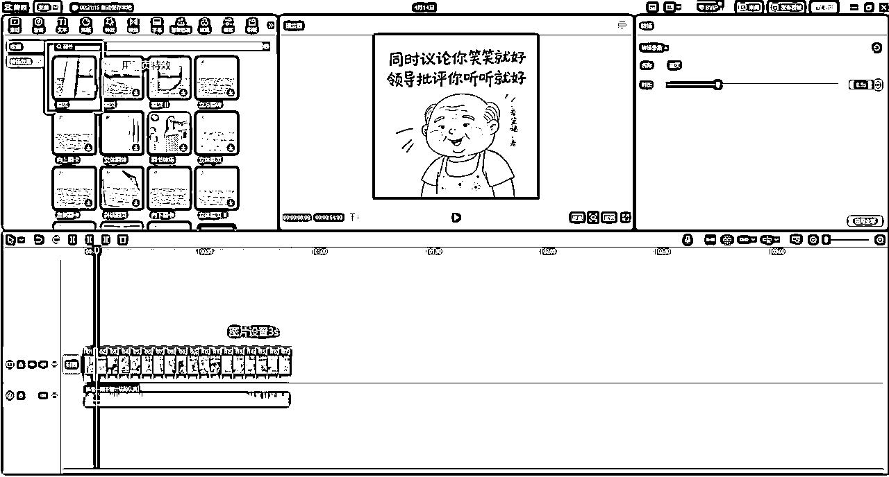

# 【喂饭教程】治愈系老爷爷/奶奶文案+ai生成插画+视频号广告分成项目

> 来源：[https://bcn7jh9fl49y.feishu.cn/docx/REG8d0y8gohOVqx7ajncg15PnAc](https://bcn7jh9fl49y.feishu.cn/docx/REG8d0y8gohOVqx7ajncg15PnAc)

# 一、项目背景与测试成果

## 1.入局契机

最近在测试热门视频二剪+ai生成动漫画+视频号广告分成项目，对抖音和视频号数据比较好的账号相对敏感

同时又看到圈友@浮生若梦分享的风向标：视频号上面这种非常治愈的老奶奶图文系列流量非常大

感觉这种方式的图文/视频原创度更高，批量图生有实现全流程自动化的可能，没有真人出镜不容易跳实名。

因此开始研究对标，进入实操测试环节。

## 2.案例展示

## 3.项目测试进展

4月1日开始研究绘画提示词，4月2号开始实操发作品，抖音视频号各2个账号，生成内容两个平台同步发。截至当前视频号目前跑出6条300w以上播放的视频【视频号是做的视频形式内容】，抖音数据要更好一些。

# 二、治愈系老爷爷/奶奶+ai生成插画项目实操

## 1.如何寻找文案

下载个小红书，搜索框搜索【治愈文案】，或者抖音搜索【人间清醒奶奶】系列都可以，同行对标账号也可以。

## 2.如何发布

抖音，快手，小红书都是图文形式发布，小红书不用添加音乐，抖音快手添加收藏好的音乐即可!视频号必须用剪映把图片做成视频上传！！！

视频制作模板参考：

1.图片默认时长3s

2.加一个翻页特效

3.配上一个治愈的背景音乐，背景音乐不知道加哪种，就抄同行，抄作业是最快的学习方式~

【在剪映电脑版设置-全局设置-剪辑-图片默认时长，可以自由调节图片默认时长。】

## 3.ai插画生成提示词分享

1.一位中国头发白花花的老爷爷，秃顶，手绘风笔触，胖嘟嘟，笑眯眯，微笑，慈祥，治愈插画，戴个近视眼镜，穿着黄色格格衬衣，穿着蓝色牛仔背带，大笑，穿着黄色背心，卡通，生动童趣，可爱，慈祥，图中文字要显著，chibi风格，极简主义，高清画面，画面文字要清晰，字体加粗加大，人物略带童趣，头上方挂着大横幅黑色字体配文“下班回家，能有个人一起吃饭”，童趣，可爱，和老婆一起吃饭

2，一位中国头发白花花的老爷爷，秃顶，手绘风笔触，胖嘟嘟，笑眯眯，微笑，慈祥，治愈插画，戴个近视眼镜，穿着黄色格格衬衣，穿着蓝色牛仔背带，大笑，穿着黄色背心，卡通，生动童趣，可爱，慈祥，图中文字要显著，chibi风格，极简主义，高清画面，画面文字要清晰，字体加粗加大，人物略带童趣，头上方挂着大横幅黑色字体配文“这是我听到的非常喜欢的一个答案了”，喝茶在客厅，童趣。可爱

3.一位中国头发白花花的老爷爷，秃顶，手绘风笔触，胖嘟嘟，笑眯眯，微笑，慈祥，治愈插画，戴个近视眼镜，穿着黄色格格衬衣，穿着蓝色牛仔背带，大笑，穿着黄色背心，卡通，生动童趣，可爱，慈祥，图中文字要显著，chibi风格，极简主义，高清画面，画面文字要清晰，字体加粗加大，人物略带童趣，双手拿着横幅黑色字体配“迷失自我去爱别人，挺没意思”，童趣，背景风景

4.一位中国头发白花花的老爷爷，秃顶，手绘风笔触，胖嘟嘟，笑眯眯，微笑，慈祥，治愈插画，戴个近视眼镜，穿着黄色格格衬衣，穿着蓝色牛仔背带，大笑，穿着黄色背心，卡通，生动童趣，可爱，慈祥，图中文字要显著，chibi风格，极简主义，高清画面，画面文字要清晰，字体加粗加大，人物略带童趣，双手拿着横幅黑色字体配“迷失自我去爱别人，挺没意思”，童趣，背景风景

5.一位中国头发白花花的老爷爷，秃顶，胖嘟嘟，手绘风笔触，笑眯眯，治愈插画，戴个眼镜，卡通，生动童趣，可爱，慈祥，吃饭，背景简单，头上的部黑色字体配文“慢慢你会发现，娘家不是那么好回得”线条插画，chibi风格，极简主义，高清画面

6.一位中国头发白花花的老奶奶，短发，手绘风笔触，笑眯眯，胖嘟嘟，治愈插画，穿着粉色毛衣，卡通，生动童趣，可爱，悠闲，戴眼镜，举着牌子，坐在书桌旁，配文加粗黑色字体“ 丫头啊，他为了睡你，假装很爱你“线条插画，chibi风格，极简主义，高清画面

## 4.提示词公式总结

### 1.公式总结

人物形象描述+穿着描述+背景描述词+动作描述词+文案描述词+绘画风格描述词

### 2.实战展示

示例:

人物形象{一位中国头发白花花的老爷爷，秃顶，胖嘟嘟，笑眯眯，微笑，慈祥，带个近视眼镜，卡通，生动童趣}

穿着{穿着黄色格格衬衣，穿着蓝色牛仔背带，大笑，穿着黄色背心}

背景{背景是室内场景，有木质结构，窗户，窗外透进蓝天，整体氛围温馨自在}

动作{双手举着一张白纸，上面写着}

文案{“有人说你好也摆，有人说你坏也摆”}

绘画风格{治愈插画，手绘风笔触，图中文字要显著，chibi风格，极简主义，高清画面，画面文字要清晰，字体加粗加大}

公式组合：一位中国头发白花花的老爷爷，秃顶，胖嘟嘟，笑眯眯，微笑，慈祥，带个近视眼镜，卡通，生动童趣，穿着黄色格格衬衣，穿着蓝色牛仔背带，大笑，穿着黄色背心，背景是室内场景，有木质结构，窗户，窗外透进蓝天，整体氛围温馨自在，双手举着一张白纸，上面写着，“有人说你好也摆，有人说你坏也摆”，治愈插画，手绘风笔触，图中文字要显著，chibi风格，极简主义，高清画面，画面文字要清晰，字体加粗加大

## 5.实操视频教程

## 6.实操工具

即梦传送门：https://m.jimeng.jianying.com/s/5krk4fASm3c/?t=-3

剪映传送门：https://www.capcut.cn/

视频号分成计划航海手册：3 月航海|视频号分成计划|实战手册

# 三、项目要点总结

## 1.封面图特别关键

这种类型的关键点就在封面图上，封面图非常关键，因为封面图属于图文类的推荐机制的一种。抖音是我给你推流封面图，特别关键，封面图有个点击率，观众的点击率，如果他点击率越多，有可能给你推的越火。

## 2.背景音乐

这种图文忧伤的配忧伤的，治愈的配治愈的，背景音乐要与文案风格搭配，背景音乐一定要选好！不会选的，就抄同行对标，同行是最好的老师。

## 3.文案

图片重要但是不是最重要的。图片做的好最好，做的没那么好也没关系，但是也不能做的太丑，新手不要有心理压力，文案的作用是大于图片的。人家看的是你的文案不是你的图，所以说文案一定要清晰，在你的图上文案跟图片，你的文案一定让人一目了然，文案不要过长，每个图片都让人一看就有想看的欲望，这样完播率才会好。如果说人家一看你的图。唉呀，这玩意写的啥呀，不好看，太乱了，咵的一下就划走了。这样你的完播率就低，数据就很难跑上去。

## 4.怎么找文案，找对标账号？

最近爆款的文案对标账号是什么？就是你的对标账号，你可以关注一些同类型的对标账号跟爆款。还是那句话，同行是最好的老师！

## 5.及时跟爆款

什么叫跟爆款？比如说看到对标上午 9 点发的，你注意到中午 11 点、 12 点，他作品五六千点赞这个作品文案马上要爆，赶紧跟，赶紧模仿！这就叫跟爆款！

## 6.换人物Ip跟爆款

跟对标爆过的文案的时候。对标做的是老爷爷，你就做老奶奶，对标是老奶奶，你就做老爷爷。爆过的还会再爆。

# 四、项目现阶段遇到的问题

## 1.遇到的问题

前些天即梦更新3.0模型，2.1模型暂时不能用。3.0模型出图，文字更加清晰，图片细节更加丰富，更写实。但是就漫画来说是负优化，没有2.1模型的漫画有质感。可以看下下方的对比图。

## 2.解决方案

感兴趣的小伙伴可以自己去看下同类型账号，近期出图质量都受到影响有所下降，后期即梦官方应该会优化，不是大问题，对项目没有影响，大家先用3.0就行。

【2.1模型官网虽然下架了，但是其实接口还在，可以自己搭服务器调用api，方法技术性太强对没有编程基础的小伙伴不友好，这里不再过多说明。大家先用3.0实操等官方优化就行。2.1模型我这边已经部署好api接口，本来想着通过coze做成小程序分享给圈友，奈何水平和精力都有限，只能暂时搁置了。有这方面开发经验的圈友可以通过鱼丸联系链接继续开发】

# 四、项目实操后续迭代方向

项目的要点在于文案和ai生图，ai生图的工作量最大的，比较耗费精力，所以后期要往自动化方向考虑。目前的想法是通过Coze工作流调用api实现文案搜集-ai出图,通过影刀rpa实现图片本地下载保存，多账号自动发布。欢迎有相关开发经验的圈友链接交流。

# 五、项目复盘总结

治愈系老爷爷/奶奶+ai生成插画是很容易上手实操的，对新手来说很容易跑出成果。与同时在测的热门视频二剪+ai生成漫画的方式对比，播放数据普遍要高一些，数据表现更好，同时没有非原创风险。试错成本很低，很容易拿到正反馈，有感兴趣的新手圈友尽快下场实操。同时欢迎已经跑出成果的圈友相互交流一起迭代操作方法。越分享越幸运，大家一起生财有术～

# 六、写在最后的话

大家有问题的在评论区留言，我会给大家答疑，3天时间有问必答，最后在此处做总结。