# 如何用 Claude+Cursor 整理群内消息、生成网页版本并快速部署上线

> 来源：[https://ccav9ey9jd.feishu.cn/docx/FcmLdfcjkoXdjVxmfJGcIelBnmh](https://ccav9ey9jd.feishu.cn/docx/FcmLdfcjkoXdjVxmfJGcIelBnmh)

大家好，我是亿舟。最近在 AI 开发网站这个航线当志愿者，群里消息太多，船员经常会漏掉一些很有用的问答消息，索性自己整理了一份文档方便大家阅读。看 Claude 3.7 生成的页面非常好看，心里也是蠢蠢欲动，快马加鞭生成了一份网页版，这样大家用电脑或者手机都方便观看。经过领队 @土豆君 提醒，写出了这篇文章，给其他的志愿者小伙伴作参考～时间比较仓促，写的有些简陋，如果文中内容有遗漏，大家可以在评论区讨论～

文档版：

网站版：

https://aimindmap.online/ （为了方便大家看整了个域名~）

# 收集群消息

因为也是想自己看看群消息，所以这一步我是手动整理的，也可以使用聊天记录多选——收藏，然后在收藏页面中点开聊天记录，点击右上角的菜单——转存为笔记，这样就可以获得完整的群聊消息。

# Claude 消息整理

拿到消息后交给 Claude 进行整理，因为群聊消息过长，最好是新建一个 Claude Project，一个 Project 可以包含多个对话，而且对话还有公共的知识库，更适合整理资料。

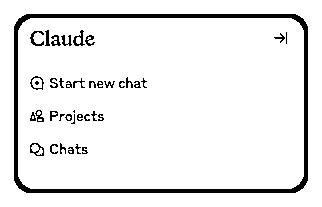

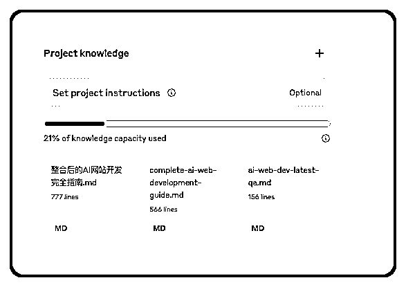

Claude 的提示词也很简单，我只写了我的诉求，但是 Claude 帮我把内容直接分类整理了。

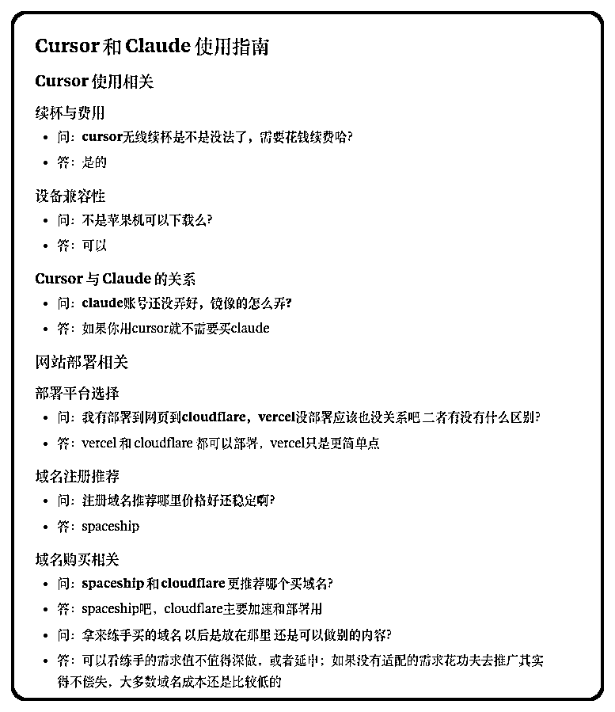

# Cursor 生成网页

接下来就是把整理好的文档下载下来，挪到 Cursor 的文件目录里。

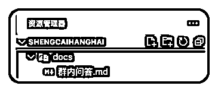

然后使用 @群内问答.md 这种方式，配合下面的提示词（来自群友@天辉，稍微做了些修改），等待页面的生成。

内容太多的时候 Cursor 可能会卡住，可以让它分段生成网页。

将其转化为美观漂亮的中文可视化网页：

内容要求

*   保持原文件的内容，不要做修改

*   标题为：生财 AI 网站开发 4 群群内问答

*   在页面底部添加作者信息区域，包含：

*   来源：生财 AI 网站开发 4 群

设计风格

*   整体风格参考 Linear App 的简约现代设计

*   使用清晰的视觉层次结构，突出重要内容

*   配色方案应专业、和谐，适合长时间阅读

技术规范

*   使用 HTML5、TailwindCSS 3.0+（通过 CDN 引入）和必要的 JavaScript

*   代码结构清晰，包含适当注释，便于理解和维护

响应式设计

*   页面必须在所有设备上（手机、平板、桌面）完美展示

*   针对不同屏幕尺寸优化布局和字体大小

*   确保移动端有良好的触控体验

图标与视觉元素

*   使用专业图标库如 Font Awesome 或 Material Icons（通过 CDN 引入）

*   根据内容主题选择合适的插图或图表展示数据

*   避免使用 emoji 作为主要图标

交互体验

*   添加适当的微交互效果提升用户体验：

*   按钮悬停时有轻微放大和颜色变化

*   卡片元素悬停时有精致的阴影和边框效果

*   页面滚动时有平滑过渡效果

*   内容区块加载时有优雅的淡入动画

性能优化

*   确保页面加载速度快，避免不必要的大型资源

*   图片使用现代格式（WebP）并进行适当压缩

*   实现懒加载技术用于长页面内容

输出要求

*   提供完整可运行的单一 HTML 文件，包含所有必要的 CSS 和 JavaScript

*   确保代码符合 W3C 标准，无错误警告

*   页面在不同浏览器中保持一致的外观和功能

请根据上传文件的内容类型（文档、数据、图片等），创建最适合展示该内容的可视化网页。

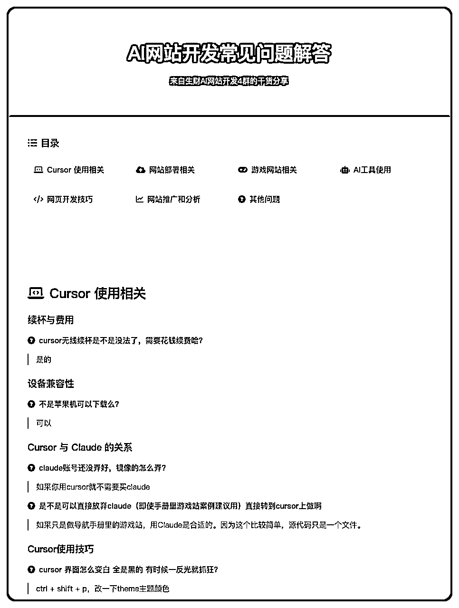

# Github 创建项目

接下来就是在 Github 新建项目，在 Github 首页点击 New，然后输入仓库的名字，我不想公开仓库所以选择的是“Private”，点击“Create repository”。

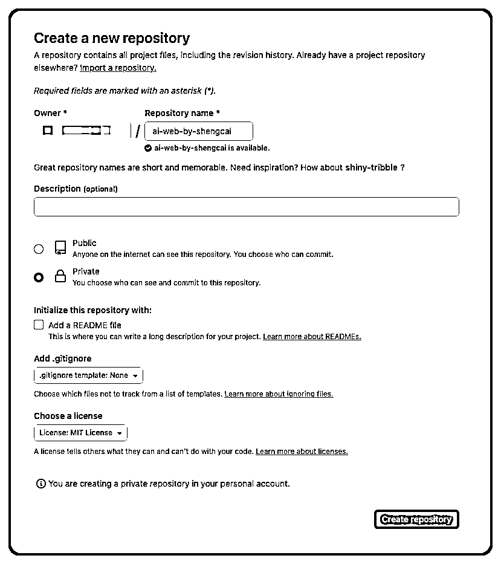

回到仓库页面，点击“Add file 添加文件”，然后选择“Upload files 上传文件”。

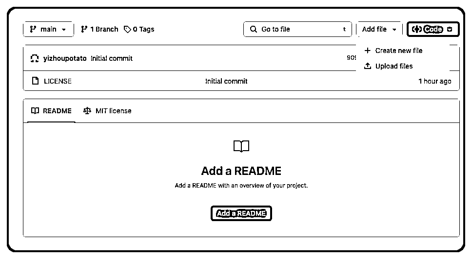

将 Cursor 生成的 html 文件拖动进来，注意文件名为“index.html”，点击“Commit changes 提交更改”。

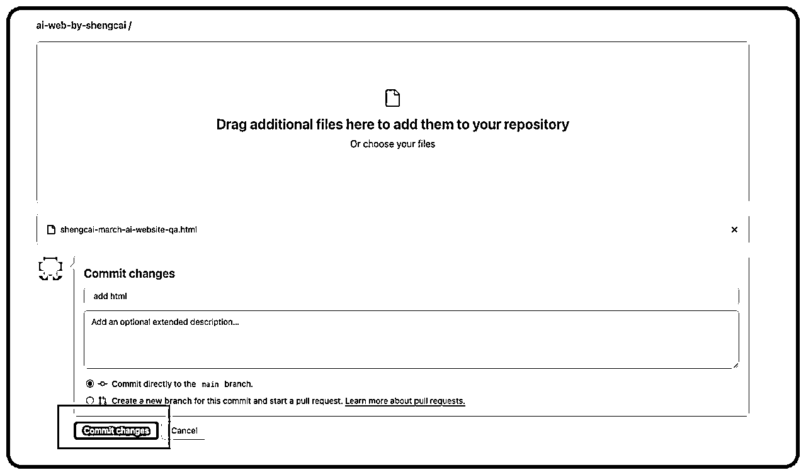

# Vercel 引入项目

在 Vercel 首页选择“Import”引入项目，选择“Only select repositories”，然后选择刚刚在 Github 创建的仓库，点击 Install。

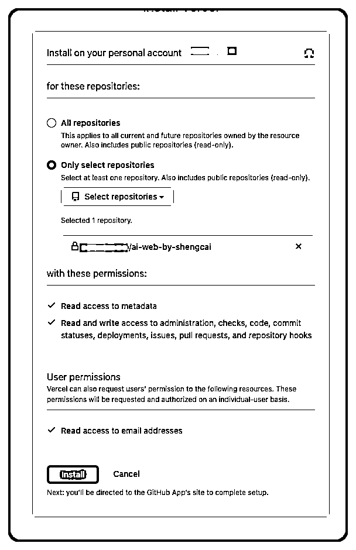

点击“Import”。

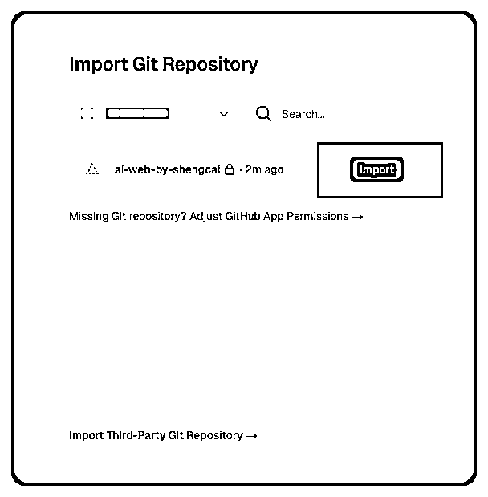

然后点击 “Deploy 部署”

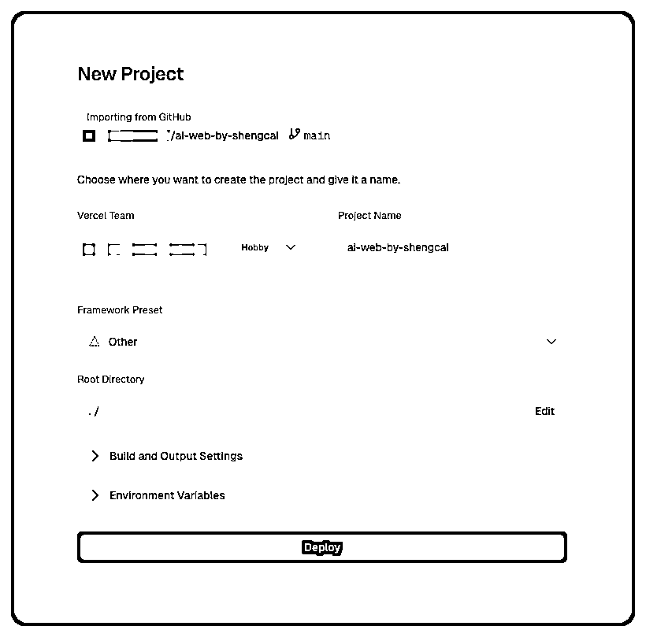

部署之后，回到项目页就能看到Vercel的域名了，点击就可以进入网站啦~

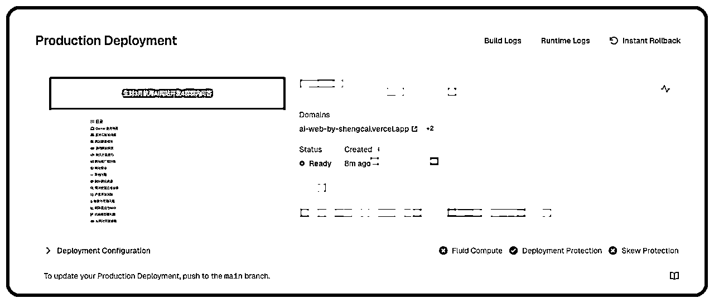