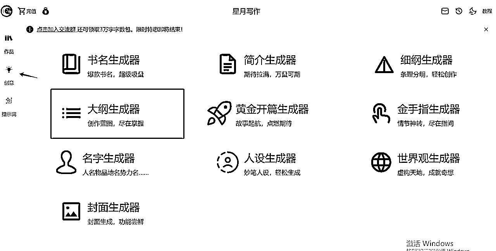
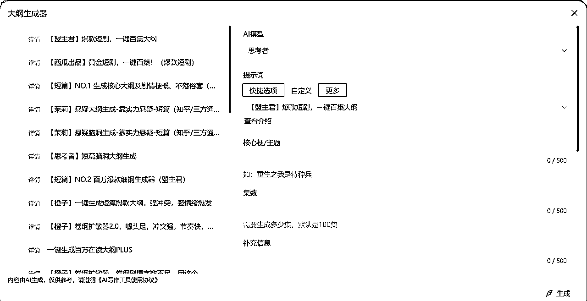
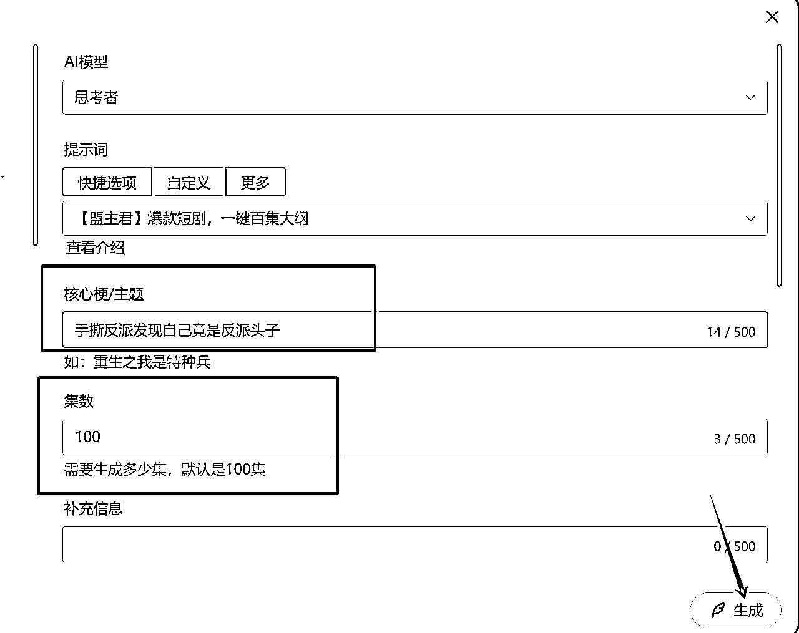
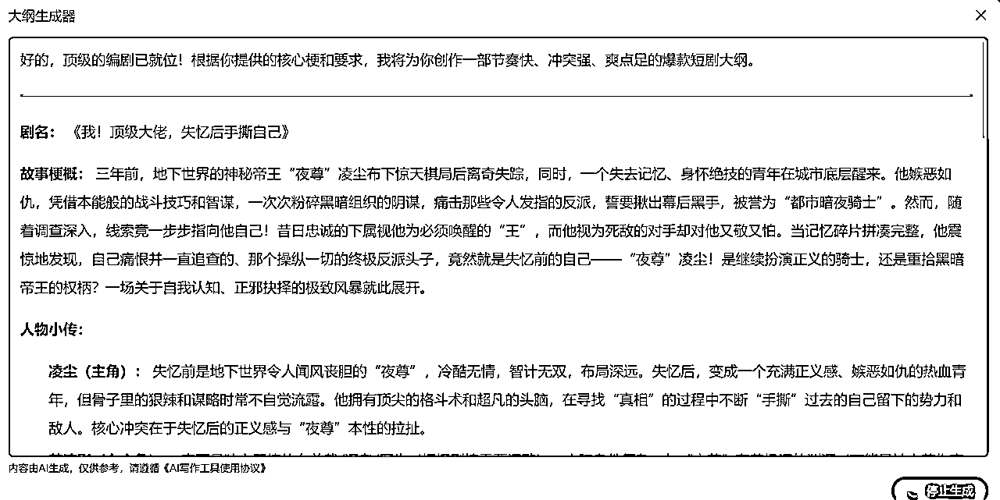
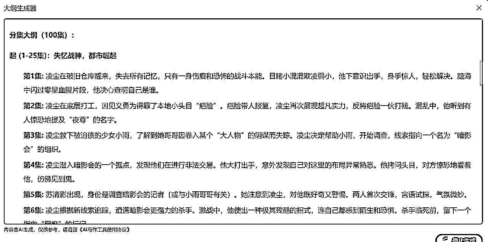
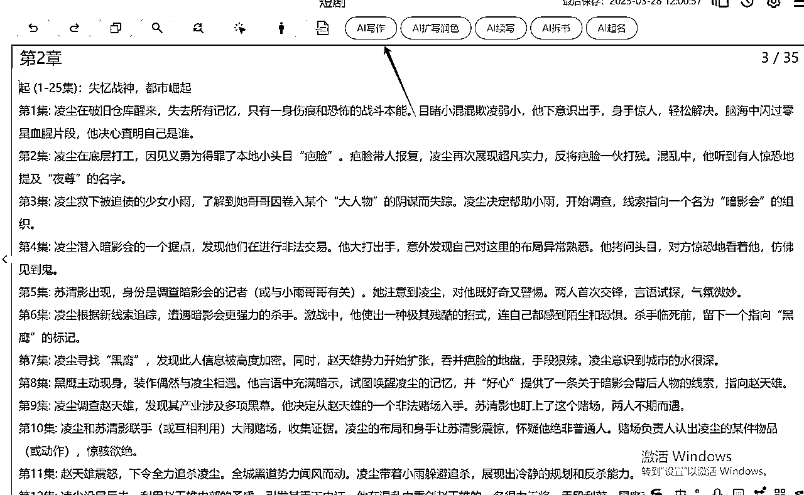
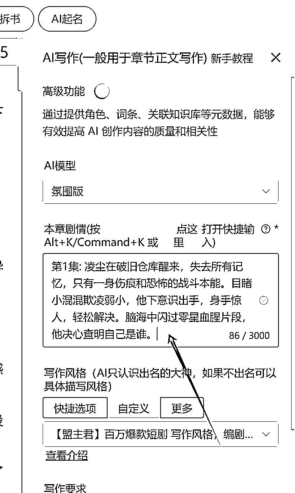
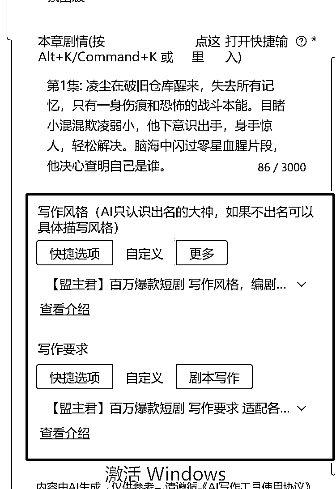
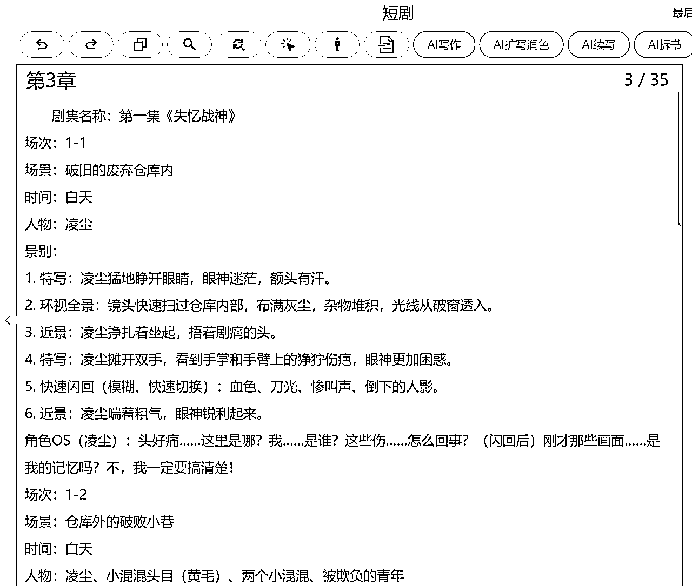

# 一键生成爆款短剧百集剧本工作流

> 来源：[https://rcn71rsvb3w5.feishu.cn/docx/RF4DdXcZYojtvLx0b0Hc2M05nLc](https://rcn71rsvb3w5.feishu.cn/docx/RF4DdXcZYojtvLx0b0Hc2M05nLc)

2025年最大的风口就是AI短剧，我做了一套工作流可以自动生成百集热门短剧的剧本。

先看看生成的剧本效果

剧集名称：第十六集《信号中断，叛徒惊魂》

场次：16-1

场景：敌方生化武器研究点内部通道

时间：夜晚

人物：林峰、赵天明、陈浩、高磊、其他队员、敌人

景别：快速切换的近景、特写、中景

（枪声激烈，火光闪烁，爆炸声不断。队员们在林峰的指挥下，利用地形优势与敌人激烈交火。）

【近景】林峰冷静射击，精准命中一个探头的敌人。

【中景】高磊背靠掩体，快速换弹匣，对林峰喊道：“林峰！左翼火力太猛，快压不住了！”

【林峰（通过耳麦，冷静）】：陈浩！侧翼迂回！高磊，手雷掩护！三秒后！

【陈浩（通过耳麦）】：收到！

【高磊（通过耳麦）】：明白！

（高磊扔出手雷，爆炸声起，烟雾弥漫。陈浩趁机快速移动。）

【近景】赵天明躲在一处断裂的管道后，眼神阴狠，悄悄拿出一部微型卫星通讯器。

【赵天明 OS】：林峰，你以为你算无遗策？只要把你们核心队员的位置发出去，外面的援军就能精准打击！你们都得死！

（赵天明快速按动按钮，试图发送加密信息。）

【特写】通讯器屏幕显示“信号搜索中…发送失败”。

【赵天明 OS】：怎么回事？！信号被屏蔽了？不可能！

（赵天明焦躁地再次尝试，屏幕依然显示失败。）

【近景】不远处，林峰在射击间隙，嘴角勾起一抹冰冷的弧度。

【林峰 OS】：赵天明，你的小动作，我早就等着了。想通风报信？做梦！

（林峰猛地朝赵天明藏身处附近射击，子弹打在管道上，火星四溅。）

【林峰（大喊）】：赵天明！发什么呆！敌人摸过来了！

（赵天明吓了一跳，连忙收起通讯器，慌乱地举枪还击，险些被流弹击中。）

【赵天明 OS】：他……他难道发现我了？不，不可能，只是巧合！但这信号……

场次：16-2

场景：研究点能源控制室附近（指定地点）

时间：夜晚

人物：陈浩

景别：近景、特写

（陈浩按照林峰之前的指示，避开交火，迅速来到一处布满线路的控制箱旁。）

【近景】陈浩从战术背心里拿出一个造型奇特的黑色装置（林峰给的强干扰装置）。

【特写】陈浩看了一眼手表，时间正好。

【陈浩 OS】：峰哥果然料事如神！就是现在！

（陈浩眼神坚定，将装置用力按在控制箱的特定接口上，按下启动按钮。）

【特写】装置发出轻微的嗡嗡声，指示灯亮起，一道无形的干扰波瞬间扩散开来。

场次：16-3

场景：敌方指挥所（可能在基地另一区域或外部临时据点）

时间：夜晚

人物：敌方指挥官、通讯兵

景别：中景、特写

（敌方指挥官焦躁地看着屏幕上的战场监控，画面混乱。）

【敌方指挥官】：怎么回事？为什么还没收到赵天明的位置信息？外面的火力支援呢？！

【通讯兵（焦急地操作设备）】：报告长官！所有对外通讯全部中断！强电磁干扰！我们和外界彻底失联了！连备用线路也……

【特写】通讯设备屏幕上全是雪花和乱码。

【敌方指挥官（震惊，愤怒）】：什么？！干扰？他们怎么可能做到？！该死！

场次：16-4

场景：敌方生化武器研究点内部通道

时间：夜晚

人物：林峰、赵天明、高磊、陈浩、队员

景别：中景、近景

（战场上，部分敌人的通讯耳机也传来滋滋的电流声，让他们阵脚微乱。）

【近景】林峰敏锐地捕捉到敌人的混乱。

【林峰（通过耳麦，果断下令）】：敌方通讯已被切断！全体注意，加大火力，分割围歼！高磊，带人突击右侧！陈浩，守住后路！

【高磊、陈浩（通过耳麦）】：收到！

（队员们士气大振，攻势更加凌厉。）

【近景】赵天明看着敌人出现的混乱，又看到林峰游刃有余的指挥，脸色变得惨白。

【赵天明 OS】：通讯……真的被完全切断了……连敌人的都……林峰！一定是你！你到底是什么怪物？！居然连这个都算到了！

（赵天明握紧拳头，眼神中充满了惊恐和不甘，但面对林峰冰冷的眼神扫过，他只能强压下内心的翻腾，继续投入战斗，掩饰自己的异常。）

【特写】林峰看着赵天明一闪而过的惊慌，眼神更加锐利。

【林峰 OS】：赵天明，你的死期不远了。

剧集名称、场景、场次、就连人物对白，他都给你生成好了，你就说厉害不厉害吧。

人人都是编剧的时代彻底到来了。

直接上干货。

首先我们需要打开AI写作网 https://xingyuexiezuo.com/?inviter=11011#/register

输入"AI联盟888" 免费兑换字数

第一步：生成百集短剧大纲内容

打开星月后台，点击创意，找到大纲生成器，在这可以一键生成百万播放的短剧大纲

在大纲生成器中选择 【盟主君】爆款短剧，一键百集

https://xingyuexiezuo.com/?shortcut=18854

填写核心梗和具体的集数，再点击生成

AI就会为我们生成一个百集短剧的大纲详情

这里包括剧名、故事梗概、人物小传

分集大纲剧情

第二步 创作剧本具体内容

把生成好的大纲复制到新建作品中。

点击 使用【AI写作】功能

把第一集内容复制到右侧AI写作的情节中

在写作风格选择 【盟主君】百万爆款短剧 写作风格，编剧亲自指导

https://xingyuexiezuo.com/?shortcut=18854

在写作要求选择 【盟主君】百万爆款短剧 写作要求 适配各种题材

https://xingyuexiezuo.com/?shortcut=18885

最后点生成。就会为我们生成一集完整的剧本

我们可以重复此流程，将100集完整剧本都写出来。

如何变现?

我们可以在投稿平台进行剧本投稿

还可以直接投给一些工作室。

甚至未来我们可以用AI工具自己做出一部短剧