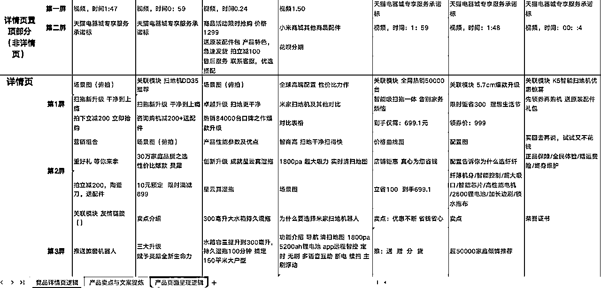

# 工业品无货源电商：从0到1的经验分享

> 来源：[https://pob104eb8b.feishu.cn/docx/GmZAdYXoRoiatgxAoXBc5FQ8n6c](https://pob104eb8b.feishu.cn/docx/GmZAdYXoRoiatgxAoXBc5FQ8n6c)

# 一、项目介绍

##### 1.1 我们在做什么？

一句话介绍：通过1688/京东等B2B平台（B2C，如淘天）无货源、一件代发的工业品电商，借助电商平台流量，与供货商合作为中小微企业客户用户提供一站式采购服务，通过产品差价、定制化服务和后端服务收费盈利。

盈利模式：

1.  基础差价：15%-35%的价差（比如2万的单子我们赚5千）

1.  定制化方案：帮客户优化设备方案，收设计服务费

1.  长期价值：设备运维年费（复购率超40%，有个客户去年买了89万设备，今年光运维就续了15万）

##### 1.2 收益里程碑

1.  启动期（2024.10-12）：项目初期可以说是还挺顺利，首单就成交了25000元，当月就跑通了第一步；前两月月均将近10万销售额；不过过年期间走了弯路；

1.  发展期（2025.3-4）：随着业务的3月销售近20万，成单率将近30%；4月第1天，成交44000元，截止清明，已成交8万；

1.  累计沉淀800+私域用户，目前新客户转化率20%；在谈合同标的合计超300万，已经在验厂阶段。（而传统渠道成本远超店铺推广成本），4月10号又付款了一单86万的合同。

客户终身价值 (CLV)= 流量 × 转化率 × 首次购买客单价 + Σ（流量 × 转化率 × 复购率ⁿ× 复购客单价）

# 二、赛道切入和调研

##### 2.1 为什么确定做工业品电商？

一句话总结：政策利好，市场规模庞大，增速可观。

我们公司是本身就做这行，所以不是选行也不是选品来的，这里从验证角度介绍一下。

（调研逻辑）企业的增长=宏观经济增长红利+产业增长红利+模式增长红利+运营增长红利

1.  政策利好​：

*   政策红利：国家“十四五”规划明确支持工业互联网与产业数字化，2024年国家推动“数据要素×”三年行动计划、工业互联网渗透率目标（2025年达45%），可能导致市场在2025年出现跳跃式增长，而非线性递增。（数据来源：工信部）

*   托比研究院​：工业品电商年增速14%，预计2025年达1.36万亿元，而MRO线上化率不足5%；

*   福建省商务厅​：《2023中国电商市场数据报告》显示，超7000万人从事电商，工业品是新增长点。

1.  市场有空间：

90%中小企业采购效率不到制造业平均水平的60%，在工业互联网与产业数字化政策驱动、企业供应链效率要求升级的背景下，形成巨大市场缺口，推动线上采购需求激增，进而带动平台服务（CAGR25%）、运维服务（毛利率50%+）等高增长赛道快速崛起

| 市场缺口 |  |  |  |
| 指标 | 2025年预测 | 年复合增长率（CAGR）​ | 数据来源 |
| 市场规模 | 1.36万亿元 | 20% | 赛迪顾问、工信部赛迪研究院 |
| 细分领域占比 |  |  |  |
| 平台服务 | 45%（约6750亿元） | 25% | 根据行业平均毛利率，硬件设备利润为2700×22%=594亿元 |
| 解决方案 | 32%（约4800亿元） | 18% |  |
| 硬件设备 | 18%（约2700亿元） | 10% |  |
| 数据服务 | 5%（约750亿元） | 50%* |  |

1.  行业客户有需求

*   核心客户

*   中小微企业​：贡献60%以上工业产值，但数字化渗透率低，采购流程依赖传统模式。

*   大型企业​：已基本完成采购线上化，但需更高效的供应链协同服务。

*   核心痛点

*   效率低​：长尾商品多、供应商分散，比价和寻源耗时长。

*   成本高​：库存积压、紧急采购溢价明显，供应链韧性不足。

*   质量风险​：假冒伪劣商品充斥市场，质检流程不透明。

*   数字化基础薄弱​：中小客户缺乏系统对接能力。

结论：政策与数据均指向工业品电商是万亿级蓝海，且增长率达到2位数，绝对利好

##### 2.2 入场验证：

核心逻辑：用钱买数据，用数据换答案。通过可控的推广投入，观察市场反馈的转化效率、复购意愿、投入产出比三大指标，快速验证市场需求真实性。

验证结果：推广后，17天获真实客户成交，拿下首单25000元。

1.  线上数据调研：

与南京头部电商公司合作，通过其数据系统验证行业数据：单系列产品年销2亿且增速40%，结合生意参谋的搜索量、成交量等分析，确认市场需求分散且未饱和，单店月均营收预估50-100万，验证商业模式可行。

我们的收款渠道比例

1.  线下业务评估：

行业头部电商年营收1-8亿但市占率不足1%。参考我们90%订单收款导流至了线下，单店保守月销100万~400万，规模化可复制；白牌店群模式轻资产、快迭代，精准匹配客户“重产品、轻品牌”需求，线上引流→线下购物和产品体验→复购闭环又可以增强粘性。

于是我们决定，以多店铺白牌模式快速抢占分散市场份额，短期验证单店模型，长期复制矩阵放大供应链与流量优势，通过规模化覆盖+复购循环实现持续增长。

1.  总结：

过程：2天研究完数据与竞品拆解，1周内上线10款产品，开通了两个推广计划（关键词+全站推），做了动销快速起量，验证了白牌模式可行性；

结果：淘宝C店，新开店7天获得真实咨询，，第16天开单25000。

* * *

# 三、从0到1，全流程拆解

##### 3.1 店铺运营（开店，投流）（1688/淘宝/京东）

开店简单，选品要选高频刚需品，上架细节抄竞品，微调即可

最小颗粒度拆竞品，扒评价问题，5118，生意参谋工具都用上，看同行头部卖家怎么解决这个问题的，抄和超。

参考如下：

详情页设计关键点： “吸引注意→激发兴趣→建立信任→促成转化”

▸ 痛点场景图（设备故障现场） ▸ 技术参数对比表（vs竞品） ▸ 客户见证视频（工厂实拍） ▸ 资质背书（需要获取供应商授权和打码） ▸ 售后承诺（物流、质保、服务、特殊说明等）

##### 3.2 流量和转化（团队）

第一批上了10款产品，开了两个推广计划，关键词和全站推。

首笔500元投放费用，带来了25000元销售收入，之后30天（10月10日至11月10日），15万曝光，2000多点击，5000多推广费，成交6万多，客单价平均3000。

销售额 = 曝光量 × 点击率 × 转化率 × 客单价

工具：5118，百度谷歌指数，微信指数也参考了，最核心的是生意参谋（现在只要开一单，隔天就可以免费使用）

测品的时候，为控制成本，我们将所有关键词分别建了最低预算的计划，跑不动就停止，逐步放大能跑动的推广计划，然后就是疯狂找供应商。

##### 3.3 供应商管理（货源寻找）

一件代发能让我们快速、低成本、低风险起步，我们前期新手期是按“资质→能力→成本→质量→服务”顺序逐步筛选的，优先测试小批量订单，逐步建立稳定合作。

*   供应商寻找：我们主要用的1688和爱采购，下面这是Ai搜索给的渠道表格

最高效也是最朴实的诀窍：货比三家、多找，我们的供货商，同样产品有价格差快十倍的，不一定是他在忽悠我，很多工艺的区别价格确实有差很多。借助 AI 可了解影响价格的关键因素，比如：我要买一个XX，价格参差不齐，影响价格的因素有哪些？

*   供应商准入机制：有个验厂小窍门，突击视频通话云参观厂区

*   目标与沟通：

此外，很多供应商很忙，体量很小的时候，不是很愿意积极沟通，这个时候就要靠我们的沟通能力，首先建立共同目标：我的业绩就是厂家销售的业绩。一般我们会跟厂家说，咱们前期辛苦一点，把基础对接好，后期我们直接带着订单来，而不是不断的无效咨询，浪费我们的时间精力。大多数销售是愿意配合的。另外，最好能找当地的供应商，这样可以上门沟通，效率更高。

比如：减轻他的工作量，你想要的资料，做好给他确认，让他填空，会比直接让他做高效很多，（尤其是在没有体量的时候）。

##### 3.4 沟通和转化方式

项目的顺利推进，离不开销售同事的谈单和跟进，转化率对于做业务来说至关重要，电商同样如此。

1\. 销售的核心是问对问题

客户分大小，需求不一样：

大客户更关心服务好不好、东西靠不靠谱。

小客户更在意价格便不便宜。

关键技巧：多问几句，搞清楚客户真正想要啥。

2\. 客户自己可能都不知道要啥，你得帮他想明白

很多人买产品时需求模糊，甚至说不清楚，所以要：

问透（业务痛点、目标、预算）

判断（哪些需求是真需求，哪些可以引导）

给方案（针对他的问题，推荐最合适的）

AI小技巧：如果不知道怎么问，直接问AI（比如：“客户要买智慧路灯，但啥信息都没给，我该问啥？”）

3\. 产品演示要“对症下药” 遇到比价的客户，别怂

别光讲功能，拼低价，要结合客户的实际工作场景，讲解决问题和长期成本：

4\. 后续升单靠案例和个性化服务

成功案例，是最好的广告，多给客户看类似行业的真实效果。

定期提供行业趋势或优化建议，自然带出增值服务。

（大家肯定都有更牛的经验，欢迎交流！）

# 四、业务的难点和困局

前端流量获客局限

行业头部的推广成本在5~8%，我们推广成本是比人家高很多，另外就是电商公司的运营管理，这是我们想要跟圈友交流学习的地方，最好是有做工业品电商的同学啦，感谢交流或合作。

# 五、新手入局极简建议

##### 1 工具推荐

1.  流量分析​：5118（长尾词）、生意参谋（监测）。

1.  客户管理​：企微SCRM（自动打标签）、Excel预测模型（采购需求），做好客户档案，如果是咱们个人做的没有CRM用多维表格，擅用提醒功能。

1.  供应链​：1688诚信通筛选器（找工厂）、物流时效地图（对比快递）。

##### 2 核心动作

1.  选品​：3个月吃透1个细分品类（如液压设备），了解所在行业的发展趋势、市场动态。

1.  竞品分析​：每周拆解1个竞品店铺（标题、主图、详情页、差评）。

1.  知识库​：建“产品手册+案例库+问答库”。

##### 3 执行重点

1.  每日必看​：UV、转化率、CVR（对比行业均值）。

1.  每周必做​：优化低效关键词。

1.  避坑​：不盲目铺货、不依赖自然流量（搭配付费推广）、差评24小时响应。

客户有很多，选好类目，远远没那么卷。入场选最了解的或者最简单的行业和产品起步，比如安全帽，工业品设备的客户群体相对特定，维护是重点，复购和增值服务是长期盈利的关键。

感谢生财，祝大家都找到自己的蓝海，一起生财有术。