# 10分钟搞定高德地图MCP！我用AI解决了约会地点选择难题

> 来源：[https://superhuang.feishu.cn/docx/OfB6dV40WorD4AxBOXYc22cKnff](https://superhuang.feishu.cn/docx/OfB6dV40WorD4AxBOXYc22cKnff)

你有没有过这样的尴尬经历：和朋友约好见面，结果双方跑到了不同的地方？

## 一个尴尬的咖啡约会

前段时间有个创始人约我喝咖啡，我在望京，他在中关村，我们说那找个中间点吧。早上10点，我悠哉地到了北辰荟，翘起二郎腿等他的时候，突然仔细一看微信，我去，约的是环宇荟！

这尴尬的场景，简直就像是喜剧电影里的桥段...

后来我细想了下，是因为看到他说约环宇荟（离北辰荟不远的另外一个商圈），我没细看，看到个"荟"字，就想着北辰荟有蔚来牛屋，顺口说那就牛屋见吧，他不熟也不知道环宇荟其实没有牛屋就答应了...我也不熟，都不知道北京还有一个同样带"荟"字还离得不远的商圈。

所以我就在想，如果有一个AI能够自动筛选两人中间点的咖啡馆，并让双方确认，是不是就能避免这种尴尬了呢？

## AI+MCP：解决约会地点选择难题

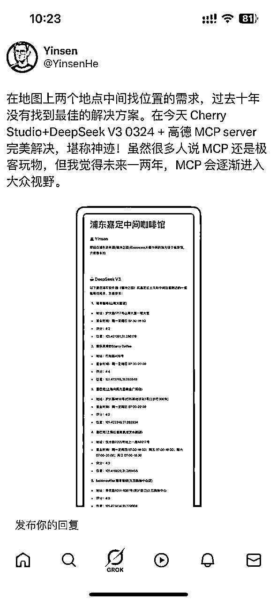

最近看到一张关于MCP的图，猛然让我想起了上面那个尴尬约会，于是我用Windsurf+高德MCP+32kw.com，只花了20分钟就完成了这个需求的验证！

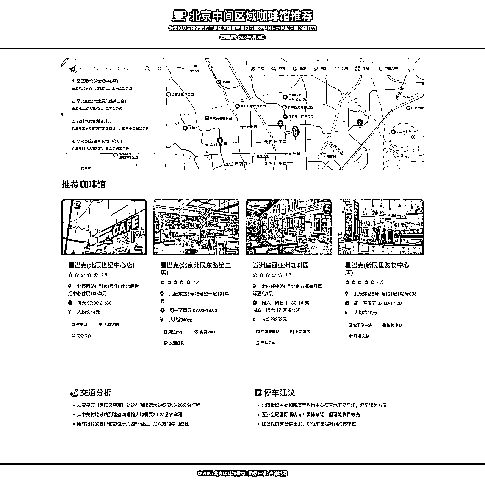

上图就是我用20分钟做出来的网页，是不是很酷？牛逼的是，头图位置直接呈现了我们两的坐标，以及中间选择的咖啡店坐标，真的就在中间。。。

https://www.32kw.com/view/b109136 你可以直接负责这个链接去查看。

下面我要给大家带来一个真·喂饭级教程，保证比市面上一大堆科普MCP的内容更接地气，让你秒懂！

## 如何实现？三步搞定！

我们先来看看整个实现流程：

1.  给Windsurf安装高德MCP

1.  直接说出你的需求

1.  一键生成可视化网页

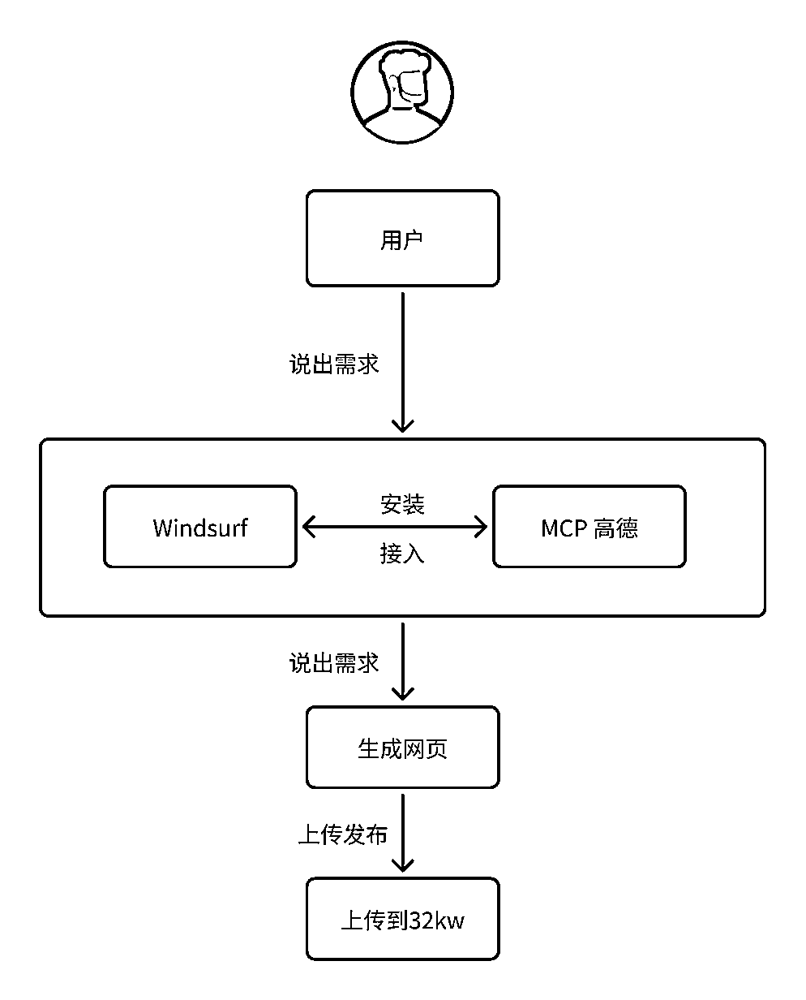

### 第一步：给Windsurf安装高德MCP

我们先打开idoubi开发的MCP.so，找到高德地图MCP Server（找不到也可以直接搜索"高德"）：

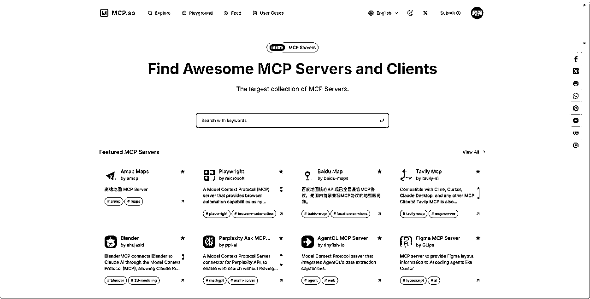

点击进去后，切换到"Content"标签，复制接入配置代码：

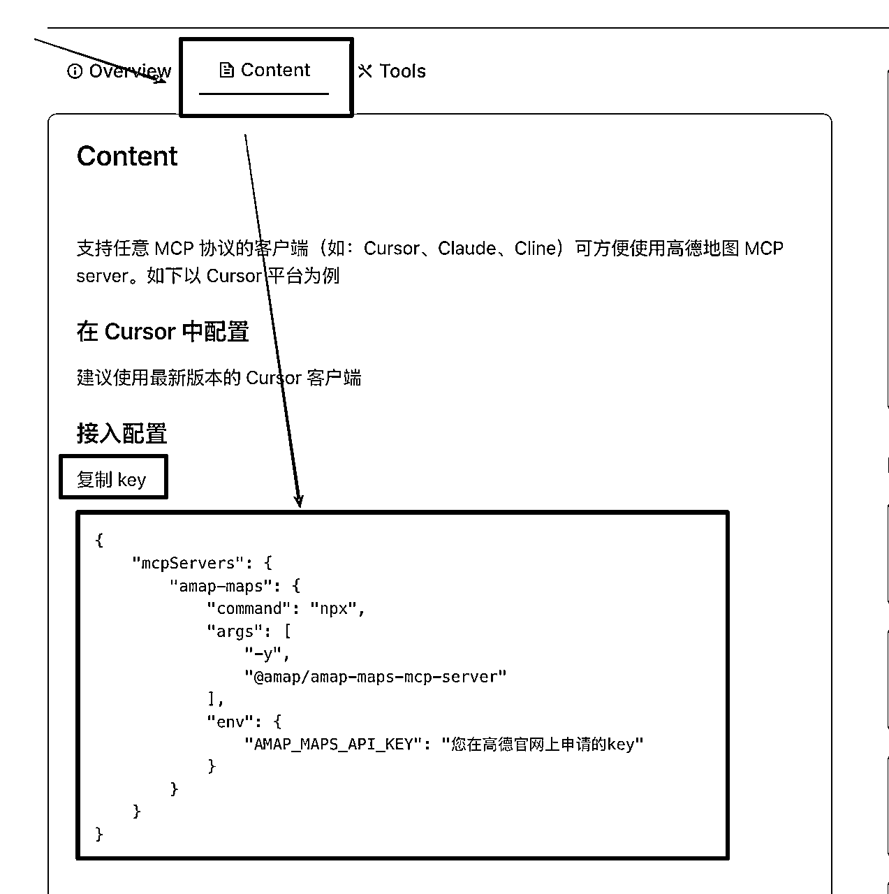

然后打开Windsurf，点击"Configure MCP"，把刚才复制的代码粘贴到左侧窗口，保存。

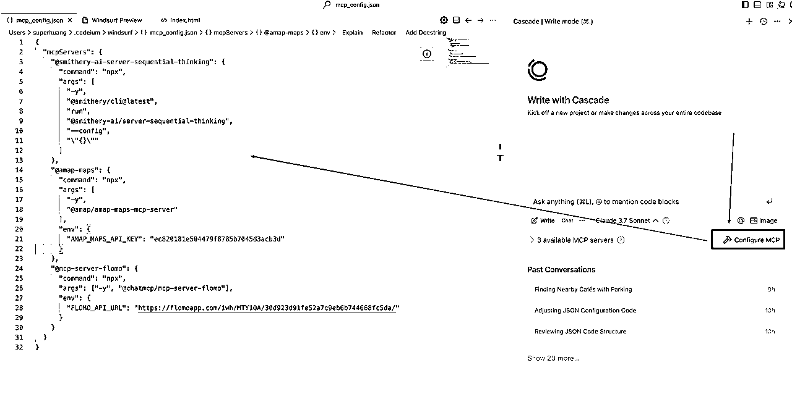

如果出现红色报错，别慌！直接把代码复制给Windsurf，让它帮你修复：

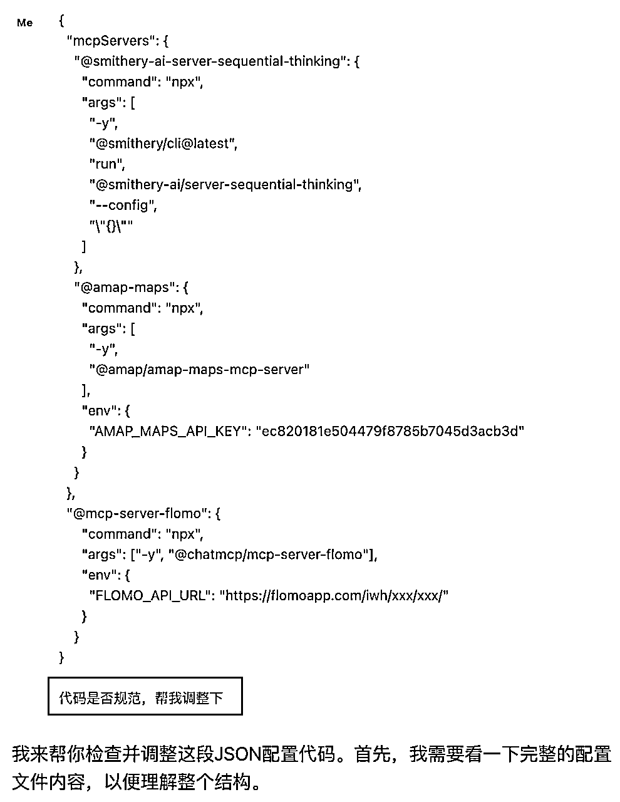

它会自动完成修复，但还有个关键步骤 —— 申请高德地图Key。在MCP.so的高德地图MCP Content页面有个"复制key"链接，点击后会有详细的申请流程：

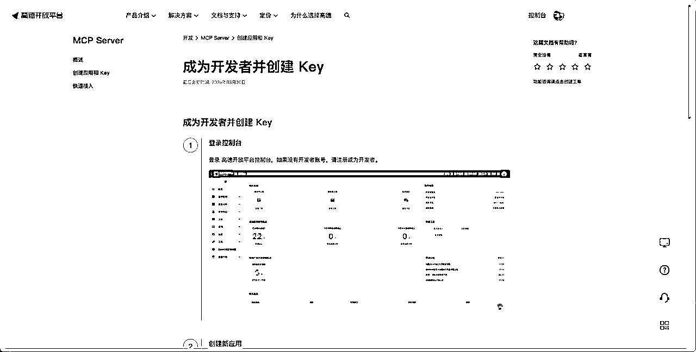

申请完Key后，填入Windsurf的MCP配置界面，保存，然后点击"Refresh servers"刷新。

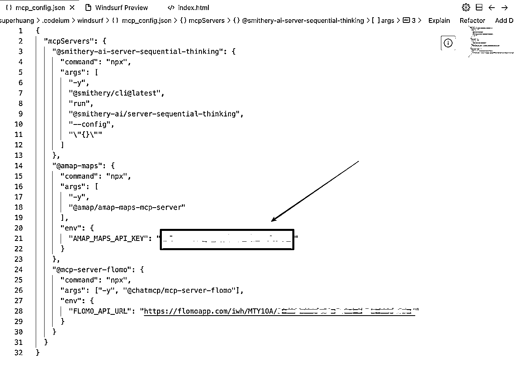

如果@amap-maps前面显示绿色灯，恭喜你，配置完成了！搞定这一步，你已经超过70%的人了，因为最难的其实就是配置MCP。

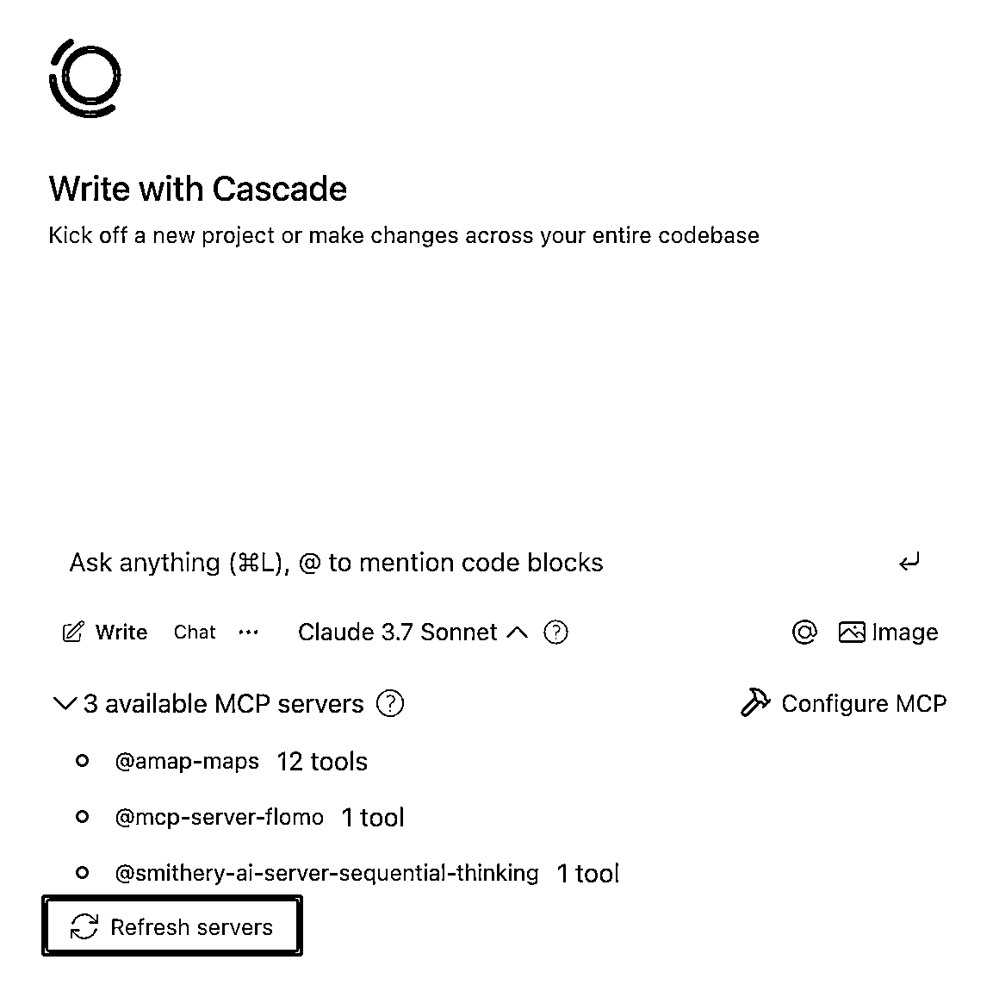

### 第二步：开始说出你的需求

配置好后，我直接在Windsurf里输入：

```
我住在北京朝阳区望京的宝星园，朋友在海淀中关村地铁站，帮我推荐几个离两个人比较近，方便停车的咖啡馆，并给出咖啡馆的具体信息。
```

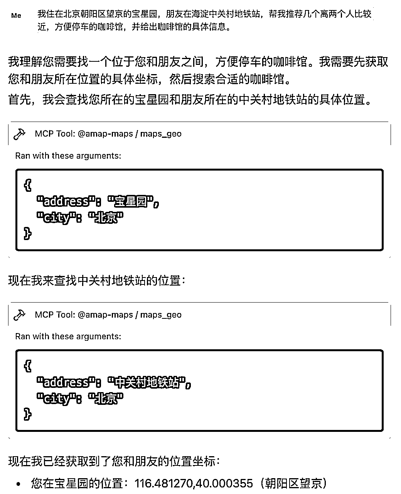

使用Claude 3.7，它立刻开始调用高德地图MCP的多个工具来解决我的问题。很快，就得出了结果！

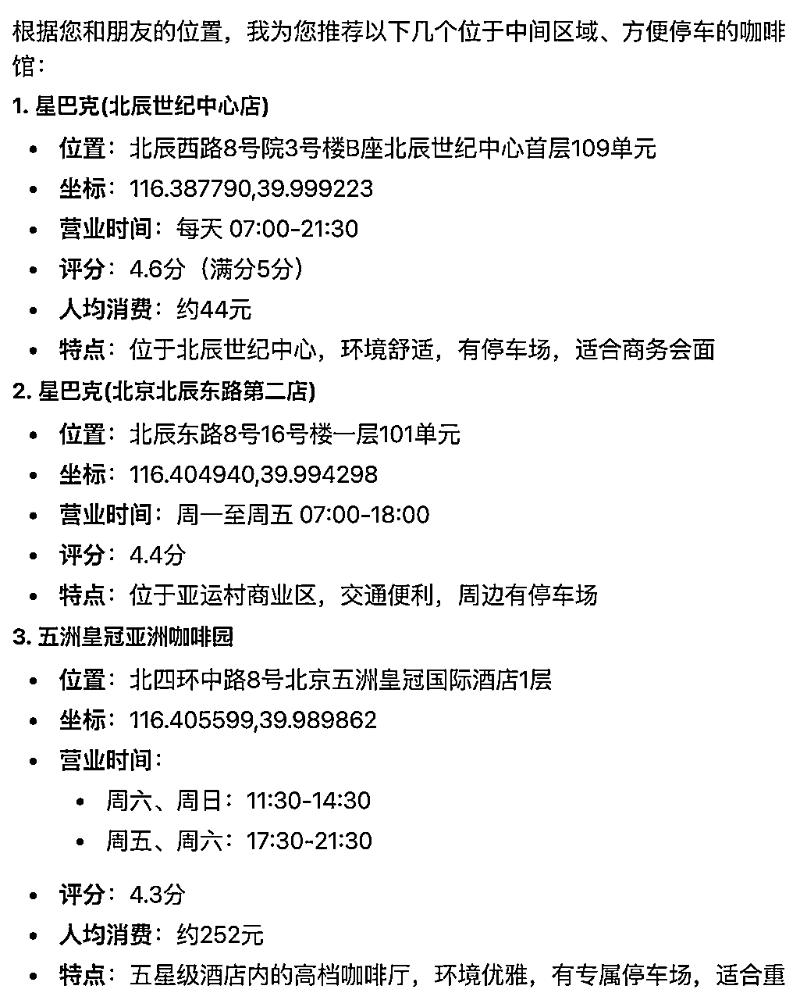

### 第三步：一键生成可视化网页

有了推荐结果后，我只需要对Windsurf说：

```
上面的推荐内容，能不能帮我生成一个html，用好看的图像化表达出来
```

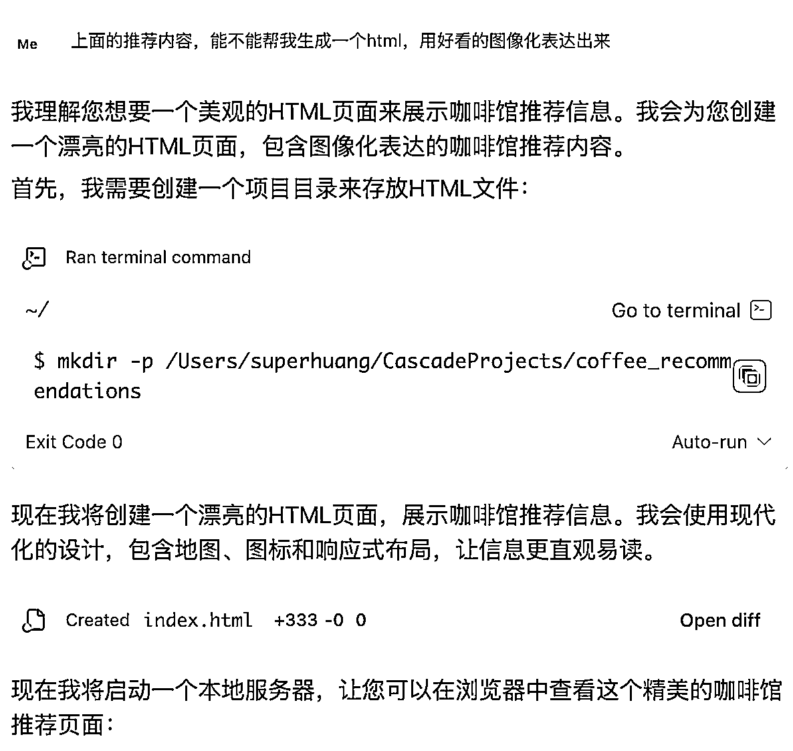

它立刻生成了一个HTML网页。我打开32kw.com，把网页代码复制粘贴上去，点击"生成链接"按钮，就获得了可以分享的网址。

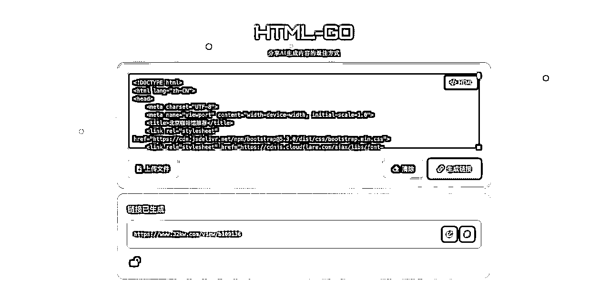

32kw.com 相当于免费把自己的网页部署到了网上，可以直接发链接给朋友看。这个链接就是本文开头大家看到的那个网页：https://www.32kw.com/view/b109136

## MCP到底解决了什么问题？

恭喜你看到这里，已经超过了绝大部分人！现在我们来总结一下MCP到底解决了什么问题。

我们都用过高德地图做导航、打车，但要找两人中间的聚会点，却不那么容易。因为两点之间会有很多商圈，不同商圈里还有不同的咖啡厅，在手机上面选择起来很麻烦。

但在给大模型加上MCP后，这一切变得简单了，为什么呢？

因为在高德地图App中，我们没法精确找到中间点坐标，但大模型+MCP可以：

1.  先找到我的坐标

1.  再找到对方的坐标

1.  计算出两个坐标的中点

1.  以中点为中心搜索咖啡馆

1.  把符合条件的咖啡馆罗列出来

1.  将文字转换为可视化网页呈现

再抽象一下，大模型+MCP对哪些需求更有价值？

1.  过去的产品本身不好解决，且大模型单独也不好解决的问题

1.  不能自动化解决的问题

后面黄叔会顺着这个思路，整理更多的MCP好案例给大家，记得关注黄叔的公众号

## AI+MCP：从工具到生产力的飞跃

MCP（Model Context Protocol）的出现，标志着AI应用进入了一个全新阶段。它不再是简单的文本对话工具，而是能够与各种外部系统无缝连接的智能助手。

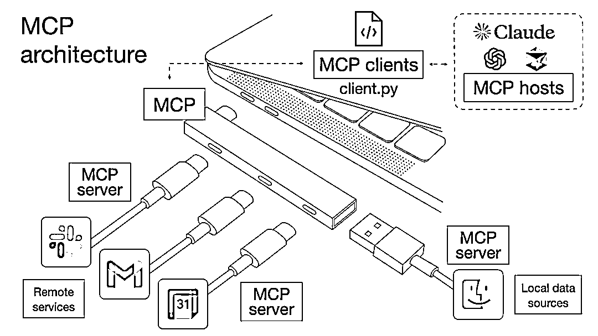

想象一下，当AI能够调用各种专业工具和数据源时，它的能力边界被极大拓展。这就像是从单打独斗的个体战士，一下子升级为指挥着各种专业团队的将军。无论是地图导航、数据分析、图像处理，还是内容创作，AI都能找到最合适的"专家"来完成任务。

在我看来，MCP技术将彻底改变我们与AI的交互方式。未来，我们不需要在不同应用间切换，只需要告诉AI我们想要什么，它就能自动调用最合适的工具来完成任务。这种"一站式"服务模式，将大大降低技术使用门槛，让更多人能够享受到AI带来的便利。

MCP就是给大模型装上了翅膀，让它能够飞得更高、看得更远，为我们解决更多实际问题。而这个咖啡馆选择的小例子，只是冰山一角。随着更多MCP的出现，我们将看到AI在更多领域展现出惊人的能力。

你有没有想过，如果把你常用的所有工具都接入AI，会发生什么？欢迎在评论区分享你的想法！

是的，后续黄叔会更新更多案例在AI编程蓝皮书，如果MCP足够颠覆的话，还会联合一些朋友，共同去创作一份MCP蓝皮书。