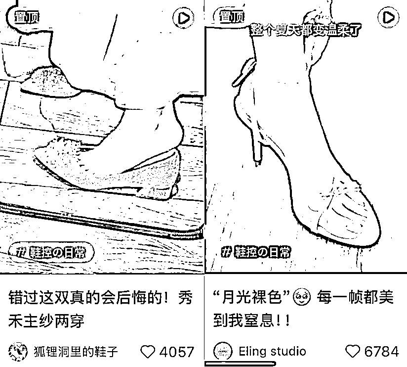
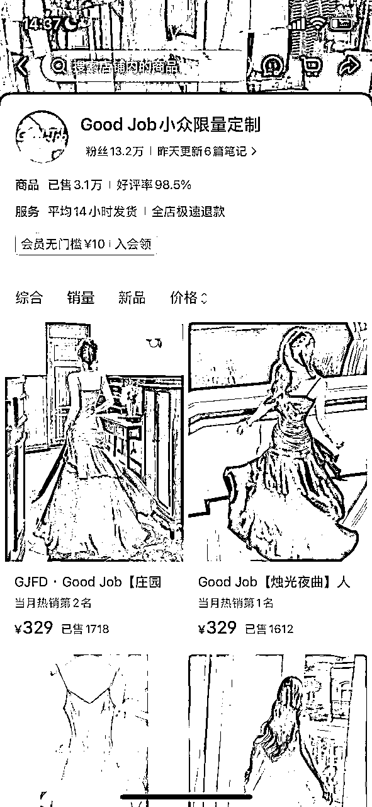
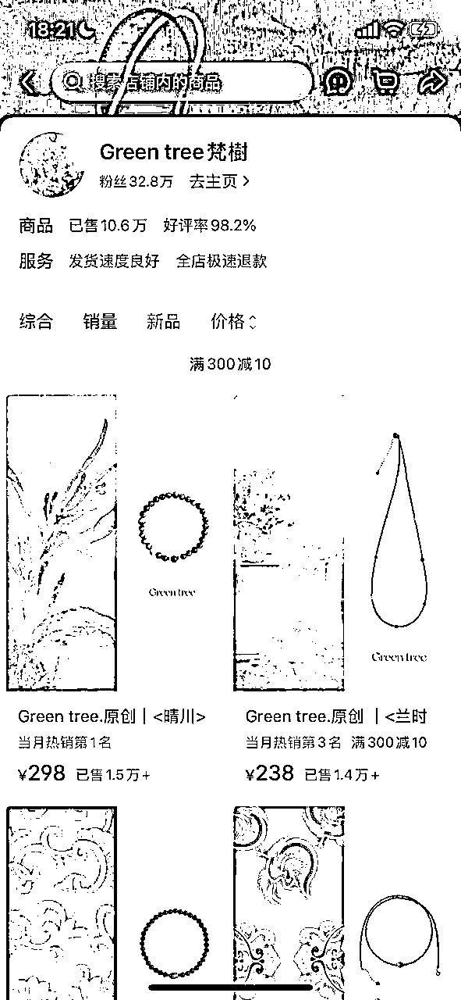
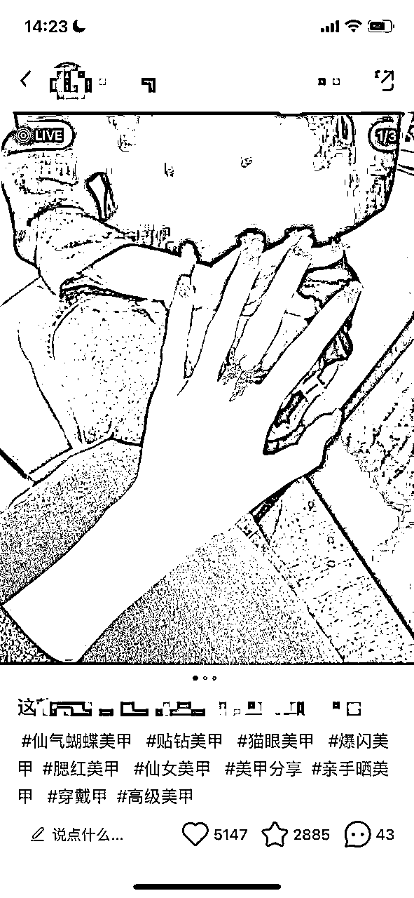

# 单月从0到18万GMV——小红书电商【爆款模板】深度剖析

> 来源：[https://hte5jh8fk0.feishu.cn/docx/HDzSdBgU9o9XU8xvuFpcQet6npb](https://hte5jh8fk0.feishu.cn/docx/HDzSdBgU9o9XU8xvuFpcQet6npb)

Hello大家好，我是温妮，98年的电商摄影师，大白话就是：“给淘宝/小红书商家拍图/视频的”，坐标杭州。

进入电商摄影行业的经历：《误入电商摄影赛道，大学毕业1年从0做到65W的全流程复盘》https://t.zsxq.com/JDqI0

ai电商摄影探索经历：《失业危机自救:AI模特项目7天跑通变现闭环的复盘实录 》

https://t.zsxq.com/19tzke75B

23年11月我搬到杭州，一边继续电商摄影的工作，一边探索小红书穿戴甲项目。

在24年4月做出了小红书【爆款模板】，并做出了几个浏览量1000W+的穿戴甲账号。

无直播，无投流，依靠【爆款模板】反复发的方式，于25年年前旺季做出了单账号单月18W+的GMV。

没有通过投流，直播放大，是因为供应链的限制，甚至我会因为担心发不出货，偶尔需要断更。

可以说，虽然我只用【爆款模板】做出了18W的月GMV，但这绝对不是【爆款模板】的上限。

所以，如果你有一定的供应链，产品优势，那么小红书【爆款模板】真的很适合你。

对小红书【爆款模板】感兴趣的圈友们，可以继续往下看。我将通过这篇文章，详细的给大家介绍小红书【爆款模板】。

## 一、 小红书电商破局之道——【爆款模板】的妙用

我们引入一个小红书的概念：【超级场景】。

通过深入挖掘用户在不同生活场景中的需求，结合平台内容生态，构建能够高效生产并转化用户的综合性场景策略。

说人话就是：

一个能让用户瞬间种草甚至产生下单冲动的画面。

### 1.鞋子赛道案例：

木质地板，穿着仙仙的裙子，放着一个黑色边框的镜子，拍摄镜子中穿着鞋子的场景。

这个场景就是超级场景，就是爆款模板。

我们看另一个账号：仍然是木质地板，穿着到了脚踝的仙女裙，拍摄鞋子特写的场景。

眼尖的圈友可能已经发现，上面两个【爆款模板】有较高的相似性：

都是木质地板，都搭配比较仙的裙子，同时这两家的鞋子也都是比较温柔的风格，用途像是日常/约会，搭配浅色系服装/裙子。

这也是【爆款模板】的重要定律：

和爆款模板相似的场景，更容易成为爆款模板。

同时这也是我们实现爆款模板的重要思路：

模仿中带着一点创新，重要的不是一比一复刻，而是追求对味。

黑白灰极简的风格，背景和搭配服饰都以无颜色为主，秩序感和优雅并存，用途像是日常/上班通勤/出席正式场合，可以搭配深色系服装。

我想眼尖的圈友又发现了：虽然都是鞋子赛道，但是这个【爆款模板】风格已经和上面两家有了明显的区别。

并且，场景和服装搭配都有明显的不同，前面浅色温柔，后面深色优雅。

而这也是【爆款模板】的重要定律：

【爆款模板】风格要和产品使用场景风格一致。

找对标的时候，要找和自己相似度尽可能高的产品的垂直场景模板。

如果我的鞋子风格是下面这样的，我就不能对标上面那种仙仙的风格，而需要对标下面这家黑白灰色系为主的极简风格。

### 2.服装赛道案例：

我想眼尖的圈友又看出来这两个账号的相似性了：

【爆款模板】的封面，都采用简单背景+人物穿戴图片放在画面左下角的形式。短视频的塑品逻辑也有一致性。

也就是说，所谓【爆款模板】：

场景，封面，塑品逻辑都属于【爆款模板】的一部分，并且，这些环节都有规律，都遵循一些基础的逻辑。

我想眼尖的圈友又发现了，上面两个账号是纯静物拍摄，没有出现模特的身影，也没有视频，只是纯图片展示。

甚至即使在服装，竞争这么激烈的赛道，下面的账号，连直播也没有，却有可观的销量。

所以，爆款模板的弹性非常大：

可以简单到无需模特出镜，单一场景拍摄即可。

也可以复杂到在笔记内容中加入塑品脚本内容，同一个账号使用多个爆款模板。

而这些差别取决于赛道的卷度，产品的特点，店铺创始人的目标等等。

如果是大众女装这样非常卷的赛道，那么对应制作的内容成本也会复杂一些，并且需要辅助直播，投放；

当然对应的，赛道的天花板，想象力也会很高。

而如果是更加垂直的赛道，并且产品有较强的风格，属于一个细分的市场：

那么有一个简单的【爆款模板】，几乎也就够用了，属于典型的“小而精”的生意。

是否属于“小而精”生意，不光取决于你的大赛道，更取决于你的垂直细分赛道。

比如虽然都是服装赛道，下面两个也有明确细分，一个风格为极简日常，一个风格为Vintage复刻，这两个都可以属于大赛道里面的细分小赛道。

像服装大赛道的细分小赛道还有很多，比如下面两个就是专门做较为日常的小礼裙的。

上面的两个案例，虽然垂直赛道也是一样的，但是前者以人台图的单一【爆款模板】为主，

后者同时用了人台图，模特视频。这其中区别在于创始人的目标，团队配置，发展阶段等等。

也就是说，【爆款模板】的复杂度，丰俭由人，可以分为阶段发展，比如最开始，单一图片场景即可，后面慢慢丰富等等。

### 3.饰品赛道案例：

饰品银饰赛道：

我想眼尖的圈友又看出来了：上面3家店铺，都同时使用了爆款模板，虽然视觉画面并不相同，但是风格是相似的。

在较有卷度，并看重视觉的赛道，且创始人目标较高的情况下。（若追求“小而精”，则可简化）

基于产品展示端口来说：

同样的产品需要不同的【爆款模板】，多层次地展现产品，比如纯产品展示，手拿展示，佩戴展示。

不同的产品需要适配不同的展现方式。比如水晶材质和银饰材质的呈现需要不同的打光方式。

基于内容和流量端口来说：

同一大框架（同风格），有多个不同的【爆款模板】。

而上面截图的笔记，虽然有不同的【爆款模板】，但是这些模板，都在一个大场景下，都可以流水线作业，此外仍然属于同样的风格。

即，这些爆款模板其实呈现出“同一大场景下，多个子模板”的特征。

但是，即使如此，上面的【爆款模板】仍然是有限的，仍是可以高效作业的。

并且，一些笔记的画面虽然不同，但是拍摄地点是一致的，只是由于角度的不同，导致了画面的不同。

下面我截取了穿戴甲对标账号的封面排列在了一起，大家也可以发现这个特点。

画框的4个封面画面略微不同（色温，氛围光线不同），但是可以清晰看出这是在同一地点拍摄的。

不知道，会不会有圈友疑惑：

【爆款模板】反复发，会不会导致内容过于同质化的问题？

而答案就在这里：

一个大场景下的画面，角度，背景，搭配，略微不同，就可以在画面上做出很多区别。

所以，这也保证了，即使在单一【爆款模板】下，也可以生产出大量看起来相似，但实际是有区分度的画面。

饰品新中式/水晶赛道：

我想眼尖的圈友又看出来了，这些饰品店铺的账号，除了几个常用的【爆款模板】之外，也会加入一些针对自己店铺，账号的个性化内容。

比如前面银饰的店铺账号，也会有主理人的介绍，下面新中式/水晶赛道的店铺内容，也会有水晶疗愈功能的介绍，有时也会分享产品的制作视频。

也就是说，同一个账号上的不同内容类型，是互不矛盾的。

并不是说，如果你发了【爆款模板】的内容，你就只能发这样的内容。

使用【爆款模板】，并不影响其他类型内容的发布，并且，这些内容是相辅相成的。

珍珠赛道：

对于最下面两张图，我相信眼尖的圈友又看出来了：【爆款模板】其实不光可以换配饰/美甲/角度等等，也可以通过换相似背景达到。

上面图片为实拍，但经过我的实践观察，通过Ai换背景也可以达到同样的效果，从这个维度，也可以增加内容素材差异化。（但一般前期能做的差异化处理已经足够使用。）

### 4.其他赛道案例：

同样应用【爆款模板】的赛道还有很多。

比如眼镜：

比如手表带：

比如手机壳：

比如手表：

比如护肤品：

像这样的场景就是超级场景，也被我称作【爆款模板】，下面我都用爆款模板这个词。

并且，不光商家会用【爆款模板】，带货达人也会使用【爆款模板】的视觉：

颜值博主也会使用【爆款模板】的视觉：

舞蹈博主也会使用【爆款模板】的视觉：

可以说爆款模板无处不在，不同领域的爆款模板实现难度不同，有些视觉容易实现，有些困难。

而爆款模板，对于诸如饰品，服装，鞋子等等重视觉的品类的商家来说，是不可或缺的。也是商家一定需要跨过的门槛。

## 二、以穿戴甲为例，讲述如何打造你的小红书【爆款模板】

好的爆款模板有哪些特征呢？

①投产比高，即生产效率高，带来的流量曝光和转化高

②辨识度高，有自己的特色，有记忆点

③让用户有使用代入感

④和产品风格契合度高，可长期使用

我不知道会不会有人觉得这样的笔记内容非常简单，认为这样的笔记就是随手一拍就出来了。

其实，自己没试过的老板反而会觉得这些笔记非常简单。

而已经玩了很久小红书的老板，会对这样的爆款模板产生一种敬畏之情，也不会抱着发几篇笔记就能爆的想法。

头部的视觉攻克，都是要花成本的，我听过最夸张的一个案例是：

一个客户的朋友前后花了600W+，去攻克某淘宝头部的视觉，结果失败了（但是后来找到了适合自己的打法）。

前段时间有个淘宝年营收几千万的饰品商家客户约我见面：

他们说自己小红书已经探索了3年，自己组建团队前后花了100W+来做小红书，但是仍然没有做起来。

现在解散了之前的小红书的内容团队，打算转变一些思路，重新探索。

电商的核心是产品，爆品自带流量，商家所有的活动，其实都是围绕爆品展开的。

爆款会反复成为爆款，基于爆款二创更容易成为爆款，这样的规律，大家都知道。

但是我想说的是，产品不光是产品能力的呈现，不光是单纯设计产品的能力比拼：

产品是需要市场数据反哺的。

而【爆款模板】不光有最终转化的作用，也能低成本测款/元素，拿到更多数据反哺产品能力。

有些供应链/商家的产品没打出来，不是产品不行，而是对应的内容能力没有跟上。

是没找到自己的【超级场景】，没打造出自己的【爆款模板】，从而拖了产品的后腿。

所以接下来，我会以自己探索穿戴甲【爆款模板】的经历作为案例，来讲述如何打造出属于自己的【爆款模板】。

### 1.确认对标店铺/账号

学习始于模仿，模仿始于模仿对象。

首先在你的赛道初筛出3-5个对标账号，分析对标账号的内容和店铺数据。

这样下来会有3，4个内容对标的方向，详细分析这3，4个内容形式，包括但不限于：

场景，灯光，搭配服装，搭配道具这几个环节。

接下来，我们需要运用拆商对这些组成要素一一拆解，并提炼出关键点，对应做一些准备工作。

最开始，我找到了这样的3个账号作为对标。

接下来，我们从场景，灯光，搭配服装，搭配道具这几个维度来进行一一拆解和准备。

### 2.根据对标账号进行内容准备

针对场景，灯光的解决方案有两个，一个是自己利用自己的现有场地调整，布置。

另外一个是外求，常见的拍摄地点，比如马路边，咖啡店，商场，地铁站，还有的就是收费的拍摄基地，会有一些拍摄场景提供作为选择。

比如马路边：

需要注意的是，外部场景很多时候需要自己再补一点光。

比如，上面的第一个穿戴甲案例，和第二个饰品案例，在手部的侧上方是有补光的。

第三个服装的案例则借助车灯从后方打了一个氛围光，所以有了逆光发丝和裙子飘渺的感觉（如果风不大，则有使用鼓风机）。

正面如果路灯光不够，则需要再补了一个光。

小红书内容很多看起来是“随便找一个很日常的场景，随便拍出来”，但事实上是精心找了地方，精心加灯光设计出来的视觉。

比如咖啡店：

如上，虽然是穿戴甲，手链，耳钉，戒指4个不同的产品，但是都是在咖啡店拍摄出片的。

在此，我选取了4个不同的账号，在相似感觉但不同场景下的拍摄视觉，也是在进一步强调模仿【爆款模板】时，“对味”的重要性。

我倾向的策略是，简单的场景自己通过布景布光实现，其余部分外求，也就是找场景，而不是“造场景”。

而等到场景验证为爆款模板，稳定盈利后，可以考虑在公司或家中仿照对应场景，复刻一个。

现在我们按照这样的思路再回过头来看一个上面我选取的3个穿戴甲对标账号。

从这张图上来看，推测是商场，宿舍走廊之类的地面，特征是背景简单，日常，干净的地面。

那么我们按着这个思路去找背景，最终，我找到了一个地铁站，同样符合简单，日常，干净的特点。

并且实践出来的数据如下：

当然，我肯定也不是一下子就能找对场景的，我也是经过不断地试错反馈，最终才找到的。

由于对方是暖黄色背景，我最终找到的场景是冷灰色背景，所以，对于具体的服装搭配，也选择了深色，更为简洁的服装进行搭配。

接下来，我们看下一个对标，这个对标是纯黑色背景，画面非常干净，穿戴甲很吸睛。

仔细看可以看出来是对着镜子拍摄，在镜子后面放置一块黑色的布，拍摄的是镜子中的成像。

最终实践结果如下，我也试了用对标的白色系衣服搭配，但是最终还是黑色的衣服在我这边效果更好，所以我也根据自己的具体情况做了一些改动。

我们在模仿对标的时候，只要“对味”就好，并且可以加入自己的风格。

不需要和对方一模一样，而且追求一样八成效果就比不上人家，还没有属于你自己的记忆点和风格。

再来看第三个对标，画面干净，放置了一面镜子作为视觉延伸：增加空间的同时达到了突出重点，简洁干净的视觉效果。

最终实践效果如下，不过这个模板的笔记爆款率要低于上面两个，所以最终被淘汰了。

（但并不是说明对镜做视觉延伸的拍摄效果不好，只是我在这一个维度上的视觉处理，还需要迭代提升，如果这是我唯一探索出来的爆款模板，则我的路径就是继续迭代优化它，但由于我有更好的可以用，那么就可以选择其他模板。）

这也是我们探索多个【爆款模板】的意义：

虽然【爆款模板】都能高效出“爆款笔记”，但是，不同的【爆款模板】效果有差异，最终我们需要根据市场数据进行进一步的筛选。

我后来又探索出来了一些爆款模板，但是发现：

以我目前店铺体量，有一个爆款模板就够用了

所以，大部分爆款模板我现在也没再继续用。

【爆款模板】的数量是根据店铺来定的，在体量不大的情况下，有一个【爆款模板】已经够用了。

像上面的两个【爆款模板】，现在也很少用。

而服装，道具，一方面，1V1的对照去买，但有时候很难买到一样的。

比如我自己用于拍摄的服装，有的就是特地买的vintage孤品，别人很难买到一样的。

这种情况，我们只能基于对标，去采购相似的服装，道具，同时加入自己的理解，进行一部分差异化处理。

对于这一部分，可以按照探索的阶段，陆续采购。

比起场景灯光，服装和道具搭配并不是难点，这里不再展开。

### 3.选择一个探索方向，并使用健康账号发布多篇笔记测试

结合自己的情况和条件，从自己认为最容易模仿的一个开始，拍摄对应20-30篇左右的内容，发布到笔记中，并观察对应的数据。

在这个环节中，有一个账号问题和发布数量问题，我需要特别强调下。

有时候不是爆款模板没有打出来，其实是账号的问题，以及发笔记的数量不够。

所以说，我们在搞定爆款模板之前，其实也需要去测试一下账号。

如果账号不行，那么怎么发笔记都是没用的（苦笑）。

一般而言，新注册的账号权重低，建议养号，违规引流过的账号权重低，发布过一些低质内容的账号权重低，建议弃号。

那么，我们应该如何检查账号是否正常呢？

一般而言，发布2-3篇正常质量内容，小眼睛能够＞150+，就可以判定账号正常。

这里也有一个技巧，如果你已经测试出了爆款模板，你就可以用爆款模板的内容在账号上进行发布，然后看数据反馈。

笔记数量就是说，我已经发了七八篇了，但是数据都很一般，那么这并不是说明是爆款模板不行，即使是爆款模板，它也不是发几篇就能火。

另外还有一种是产品的问题，也就是说不是你的爆款模板不行，也不是你的账号问题，是你的产品不是爆品。

这时候可以用一些同行的爆品进行测试，可以去买一些同行的爆品，一般买10个市面上现在正在火的款差不多能测试出来。（但是要求正在火）

如果有条件的话，可以买20-30款回来测试，也有竞品调研的作用，这样测试的结果也会更加准确。

最开始，我做竞品调研的时候，（不是供应链的货，而是优秀同行的货），主要的4，5家都买了几十款回来测试，这也让我对市场和产品有了更深入的理解。

其实，我最开始的时候也是一个一个的去测试的，账号，产品，爆款模板，这3个环节都做好，才会有最终好的效果。

这些下来探索出的爆款模板，如果数据还可以，继续优化，把精力重点聚焦在这个模板上，暂时不再探索其他的模板，可以进行一些小幅度的调整迭代。

如果对应的数据不好，继续优化第一个模板，同时开始探索第二个爆款模板，并根据对应的数据，不断反复调整。

爆款模板的形成，是一个动态的过程，爆款模板，离不开大量练习，从生疏到熟练会经历一个过程。

到了更后期的时候，你可能探索出了多个爆款模板，这些模板都可以一定程度上的出爆款，那么，是否全部都要保留呢？

因为虽然都是爆款模板，但是不同的爆款模板的流量，转化能力也是不一样的。

这个问题的答案也是市场反馈，由于我们的精力有限，只保留投产比最高的几个爆款模板，低的就淘汰掉，并在此基础上进行微创新。

一方面增加自己的辨识度，相当于建立一种品牌力，让用户看到这种视觉，风格，就下意识的反应是你。

另一方面是探索出投产比更高的爆款模板，即生产速率/流量曝光/转化能力更高的内容形式。

## 三、小红书【爆款模板】经典问题汇总

### 1.【爆款模板】流量不精准，要不要继续用？

流量≠转化，泛流量到底有没有意义？

流量和转化是两回事。

在成本不大，并且投产比还不错的情况下，我们是可以追求一部分的泛流量的。

比如说，我用【爆款模板】花了一下午拍摄了一周的素材，带动了上W的GMV。

虽然，其中90%都是泛流量，对方就是过来欣赏收藏一下，并不会下单，但是你仍然获得了实实在在的GMV和利润，那么这就是有意义的。

但是，如果只有流量，几乎没有转化，或者投产比过低，那么这个流量的方向就是不对的。

这样的【爆款模板】就可以淘汰掉。

内容反馈的本质是人性，人性的需求和弱点，其实都是明牌。

如果我们想要追求流量，那么就去踩一些情绪点，你一踩这些点，你就能拿到流量。

但是，这样，你吸引的是什么样的人呢？这样的流量，毫无意义。

### 2.达人逻辑和商家逻辑的区别在哪？

为何同样都用【爆款模板】，但是有的带来了可观的转化，有的没有？

达人逻辑和商家逻辑的最大区别是什么？

下面，我们来对比几个账号：

我们先看一个达人账号，我随便截几张图

我们再比对两个同品类的店铺账号，为了方便直接阅读到更多数据，我直接把店铺账号的笔记首图浓缩在了一起：

我们注意看每篇笔记上的款式：

达人的款，也就是品几乎每一篇都是不同的，而商家的笔记翻来覆去就是那么几个款。

这就是达人逻辑和商家逻辑的最主要区别：

达人：

发更多产品以获得更多流量，在这种策略下，流量高，转化低

商家：

反复推爆款以促成转化，在这种策略下，流量一般，转化高

而很幸运的一点是，大部分的【爆款模板】可以通用，也就是说，假如你有一个【爆款模板】，你可以选择做达人，也可以选择直接带货。

由于现在达人接广告越来越难，接下来我讲一下，有爆款模板的达人如何直接带货。

### 3.达人如何用【爆款模板】带货？

很显然，在比对上面的案例后，我们可以发现

准则一：爆品准则，把精力放在个别的爆品上，可以联系商家，直接进行带货，然后，使劲发这一个爆款的笔记。

准则二：选品准则，选择让用户有代入感而非单纯欣赏的产品。（如果欣赏的同时有下单可以选，判断指标为，不光有赞藏，也有下单）

其实和内容的距离感一样，商品也有这样两类，一类是大美但是离用户远，用户喜欢欣赏，点赞，但是很少购买，

另外一类是小美但是距离用户近，用户可能不太会点赞，收藏，但是容易下单购买。

其实通过我的观察，大部分的达人账号，前者的产品会占主流，后者的产品较少。

甚至，小红书有很多关于“这些穿搭博主是不是都没上过班”的吐槽，就是说有些博主的搭配虽然好看，但是，用户，真！的！穿！不！出！去！

上面就是流量逻辑，也就是达人逻辑。

这其实也是我早期踩的坑，当我一个月发几十款产品的时候，我的流量非常好，但是转化惨不忍睹。

但是，当我一个月，只发那么4，5个测试出来的爆品时候，虽然流量数据下滑了非常多，但是转化数据有了质的飞跃。

准则三：塑品准则，不光呈现产品的美，要强调产品的利他性，比如版型好，修饰腿型，身型。

比如颜色其实是有心机，精选出来的，非常显白，非常显气色，等等。

如果做短视频，可以把重点放在产品的利他性上面。

## 四、小红书，淘宝，抖音三个平台的比对分析

### 1.为何淘宝视觉在小红书平台失灵

从2018大一暑假开始，我进入了电商摄影赛道，我的第一批客户是淘宝商家。

2021年，有淘宝客户开始在小红书同步发布用于淘宝拍摄的图片/视频，我也在小红书分享一些客片。

那时候，偶尔会有“怎么买”，“求链接”的评论。但是同比淘宝带来的求购需求，可以说微乎其微。

而且，直接的商品图放上去，大部分反响平平，虽然少部分有数据，但是占比很低。

2022年，我的个别淘宝客户开始做小红书，我开始接到小红书的商拍单。

客户发我一个对标，让我按照上面的形式拍。

于是，我就按照客户的需求拍摄，虽然客户满意，但是我预感，如果发小红书的话，能火的概率不大。

我想，敏锐的人已经意识到背后的原因：

淘宝和小红书是完全不同的两个平台，并不适用于同样的一套打法。

两者无论是平台调性，用户画像，用户偏好，使用习惯，都存在巨大的不同：

淘宝的产品，策略，是无法直接复制到小红书上的。

虽然爆款各平台通吃，但是打法是不同的。

### 2.淘宝货架电商和小红书内容电商视觉要求区别

淘宝的货架电商和小红书的内容电商，很大的一个区别是：

货架电商的图片关系点击率和转化率，99分当然很好，但是达到90分也可以有不错的反馈，甚至达到80分也可以维持一个店铺的正常运转，无非是点击率低和高的差别，但是不至于无人问津。

也就是，淘宝的图片，你按照一张爆款图片，模仿到八九十分，这是完全有效的。

但是小红书的内容电商并非如此，小红书的模仿，即使看起来很像了但是“味不对”，你也达不到原作者十分之一的效果，甚至可能会无人问津。

也就是说，80分和90分在淘宝上是量的差别，但是在小红书就可以是质的差别。

而小红书的80分和0分差距并不大，或者说，小红书的内容，达不到90分，就几乎等于0分了。

在小红书平台上，“对味”就是一切，“对味”大于“形似”。

可以说，在小红书平台上，视觉要求更高，并且，用户更加偏爱更有场景化，活人感，距离用户更近的视觉。

两者当然是有交集的，当产品和视觉能够打动人心到一定程度，各平台通吃。

但是这属于比较理想的情况，大部分情况下：

我们还是需要针对不同平台的调性，进行一些差异化处理的。

这听起来，小红书好像难很多，但是实际上：

假如我淘宝开一家小店，和我小红书一样定价卖穿戴甲，也不投流，是没有人买的。（笑）

所以，在我看来，小红书的红利期当然存在，并且，我预计小红书的内容红利还能持续2-3年。

但是，这并不是说明，2-3年后，小红书的内容不重要了，而是：

2-3年后，商家的小红书内容能力，会有普遍提升：

那时候，小红书内容能力已经成为商家的基础能力，大部分的商家，都有了自己的【爆款模板】，也就是说，那时候的竞争更为激烈。

而对比现在小红书商家内容能力，面临的信息差：

其实相比较两三年后，现在的竞争是还不激烈的，现在也仍然是一个比较好的入局时机。

### 3.抖音直播电商和小红书内容电商区别

淘宝，小红书，抖音平台，虽然都有货架，内容，直播部分，但是对这些环节的权重在不同平台上权重不同：

淘宝以货架为中心，小红书以内容为中心，抖音以直播为中心。

抖音直播电商，大部分在直播的时候才有收入，直播停了几天，可能就没有营收了。

此外，抖音直播的不稳定性较高，每天的销量较难稳定。

抖音直播，很容易出现销量一下子上来，又一下子下去的情况，也就是说，抖音直播对于供应链的挑战是非常大的。

供应链的难点不在于产能的量级很大，而在于产能的不均衡，包括产品的不确定性，需求量的不确定性，需求时间的不确定性。

供应链追求可预测和稳定，而直播销量恰恰很难预测，谁都不能说我下周能把XX产品，每天卖出XX销量。

而小红书的内容电商相比较要稳定得多。这也是笔记流量和直播流量的可持续性区别。

### 4.延伸阅读：店铺为何会死于爆款？

#### 4.1供应链为什么是难点

一个很反常识的现象是：店铺常常不是死于没有销量，而是死于突如其来的销量。

前文说到：供应链的难点不在于产能的量级很大，而在于产能的不均衡，包括产品的不确定性，需求量的不确定性，需求时间的不确定性。

可以说，即使是旺季，产能紧缺的时候，但是假如，你能够提前两周，告诉对方确定款式，每日确定数量的需求量，那么，供应链极有可能是愿意承接的。

比如，在穿戴甲年前的时候，我有一个款的供应链已经不再对外供应（已经有10W单累计待发出）。

但是，我可以根据内容的数据，和对方预估未来2周大体每日需要的数量，所以，对方就可以根据我的确定性需求进行规划和安排，也愿意承接。

而在你没有和供应链做出确定性的需求，一下子出了很大的量，并且，只给对方一点点时间，虽然，事前，几乎对方都会和你说，“放心吧，我们承接能力很强的。”

但是，真的到了那样的场景，就是：“臣妾真的做不到啊。”

你就是堵在人家门口，人家也拿不出来货给你，我相信，经历过的商家深有体会。

并且，客观来说，这样也真的不能怪供应链。

因为，突如其来的爆款，不仅仅是直接生产这么简单，还会涉及到原材料的采购，其他订单的协调和变动，人力资源的调整和安排，来回运输的时间等等诸多环节。

#### 4.2爆款危机是如何产生的

我们前文说的，供应链的产能跟不上，这时候，商家有三条路：

1.和客户协商，让客户申请退款，并协商小额补偿

2.降低产品质量要求，以次充好

3.等待平台处罚

总之，无论选择哪条路，接下来都会有一系列联动危机。

比如，你的精力被这样的事情占用，从而没有精力再去卖货，（发不出货没法卖），于是就产生了流量浪费的问题，而你如果不想承受流量浪费的损失，你会进一步陷入更深的困境。

这样的经历，真的让人头皮发麻，我想经历过的人都不想再经历一次。

#### 4.3求稳大于爆发，小红书对比抖音的稳定性优势

小红书的内容电商相比较抖音的直播要稳定得多。

第一：爆款笔记具有一定持续性，一条爆款笔记少则几天，多则几周，长则几月，都是会陆续有流量的。

并且，即使后来没有流量，你还可以用投放续命。

第二：爆款笔记会反复成为爆款笔记，也就是说，你在爆款场景下拍出来的爆款笔记：

【爆款模板】发同样产品，角度/背景/搭配进行略微差异化处理，会有极大可能性再火一次，再再再火一次，并且会维持比较可观时间。

少则1-2月，多则，有小红书细分手链头部：

23年起号时的爆品，现在发的相似笔记还在小爆。

此外，小红书的直播风格相对也不会那么浮夸，并且相当比例流量是内容带来的精准流量。

所以，即使同样是直播，小红书销量的稳定性，也要比抖音高一些，同时，退货率也会低一些。

此外，小红书由于内容为核心，所以是可以不断占领用户心智，形成品牌积累，拥有品牌力的，但是抖音的品牌力积累，相比较会困难得多。

## 五、哪些人适合用【爆款模板】实现弯道超车？

其实，当我们大量地看过各种赛道的账号之后，我们会惊奇地发现很多共性。

背后的底层原因是现代社会的人们日常生活的场景都差不多：

比如，大家经常出入的地方，也就是宿舍/家中，电梯，停车场，地铁站，咖啡店，商场，马路边；

而在家中的时候，自己最经常看见自己的地方就是镜子前。

这些日常场景也是最能够让用户有代入感的地方。

对镜拍摄，模拟的就是用户自己在宿舍/家中照镜子的时候的场景，通过镜子的视角看见自己的衣服/鞋子/配饰。

在马路/地铁站/停车场这样的场景拍摄，除了让用户代入了自己用这样的商品；

也让用户代入了“当我使用同款的搭配，其他人看到我的样子/我在这个场景的样子。”

比如第一视角的手链，在咖啡店，装修不错的家中的第一视角拍摄的图片：

让用户代入的视角是“在咖啡店这种场景中，我伸出手看到带上这款产品时候的样子。”

人在看见美的画面的时候，内心会觉得很愉悦，这种美的画面，其实又分为两大类.

一类是“美，但是离用户的距离较远”，比如特别美的颜值博主，穿美丽但是用户日常很少会用得到的衣服时候；

这时候的愉悦就是单纯的对美的欣赏，用户也喜欢点赞这样的笔记，但主要是用户获得了一种“因为看到美而感到愉悦的情绪价值”。

而另外一种美的画面，“美，并且离用户的距离很近”，因为离用户距离近；

这种大概率属于小美而非大美的水准，非要类比的话，这种美的程度更像是漂亮的邻家妹妹，而非范冰冰这样现实中难得一见的顶级美人。

其实，这也解释了，为何，小红书很多受欢迎，转化好的内容，会常常给人一种“随手一拍就出来”，“日常生活记录一下”，没有很隆重的感觉：

这是因为，这种程度的美就是让用户最有自我代入感的，觉得自己能够得到的效果和生活。

当然我可以负责任的说，这些内容，并不是“随手一拍”，相反，这样内容是被精心策划出来的。

包括“看起来像随手一拍就出来”的感觉，也是被精心策划出来的要点之一。

那么，什么样的人适合用【爆款模板】实现弯道超车呢？

### 1.有供应链优势，产品能力的商家

电商的基础是产品，内容起到的作用是放大曝光和转化的作用。没有产品，也就没有内容。

所谓的供应链优势，不止是能够做货的能力，也包含产品的开发，迭代能力。

其实我虽然做电商摄影很久了，但是我并不认可一类产品：可以拍得很美，但现实生活中丑的产品。

关于这一点，我也想了很久，答案是：做减法。也就是说，对于有些上镜但不适合现实生活的产品，选择放弃。

但是，这有一个前提，那就是，商家能够拿出来更好的产品给到客户，让商家获得利润，用户获得真正适合自己的产品。

那么，其实就指向了更强的产品能力。所以，产品能力仍然是基础和核心能力。

而如果你有这样的供应链，产品优势，你就很适合用【爆款模板】放大你的项目。

### 2.有产品落地能力的设计师

其实在现代社会的产能下，是非常利好设计师这个职业的，就像我前文说的，产品是基础。

现在，将产品落地，比如一件衣服，一个首饰，已经不需要过去的昂贵成本了。

另外一个点就是，测款成本，比如，有一个爆款模板，发一篇笔记在小红书，也不需要投流，你就能看见这个款在市场的反馈。

第三点，其实是消费分级，或者说是细分人群。

你只需要有一小部分人非常喜欢你的产品，愿意为你买单，你就可以开启你的事业了。

而且，小红书，真的非常轻，不像淘宝，需要你建设一个店铺，也不需要抖音，需要你去直播。

你有产品能力，是完全可以在小红书上，开启一份副业的。并且，小红书店铺的运营也轻盈很多。

在我开小红书店铺的同时，我还有摄影项目，中间还上过大小周的班，但是这些都不影响小红书店铺运转。

### 3.对产品有一定了解能力的主播

直播和内容一样，其实都是产品的放大器，如果能够有靠谱的供应链，那么辅助内容，再通过自己的直播放大，真的可以说，是一条很好的第二曲线项目路径了。

## 六 、小红书【爆款模板】项目入局条件

### 1.手/耳朵/锁骨/身材等等优势，并有一定手机拍摄能力

其实，我们拆分一下，在第一个环节中，我对于爆款模板的介绍，以及需要出镜的部分：

如果你能够找到对标案例，而你恰好有这样的对应优势，那么在这个赛道，你就可以尝试。

比如手好看，就可以拍穿戴甲，戒指，手链，手镯，以及各种手拿图，比如手拿手机壳，手拿护肤品等等；

比如你的锁骨好看，你就可以拍摄一些项链；

比如你的下颌骨，耳朵好看，你就可以拍摄耳环；

比如你的腿型好看，你就可以拍摄一些裤子；

比如你的脚好看，你就可以拍摄鞋子，鞋子的风格也很多，可以按照自己的风格选择。

而且，现在的拍摄也不需要单反这样的投入，基本上一部手机就可以满足拍摄的需求了。

所以如果叠加一些手机拍摄的能力，你就可以去做这件事情。

### 2.审美能力好，有网感的摄影师

这里指的网感，并非天生，而是通过上面实现爆款模板流程的大量练习获得的能力。

如果你没有上文的优势，但你仍然可以依靠审美，找到自己的方向。

其实，我们可以看到，有一些小红书账号，是去模特的，也就是即使没有模特也是可以把账号做起来的，包括我上面也有这样的案例。

尤其在一些强调产品质感的领域，如何拍出又有氛围感，又很有质感的【爆款模板】，是一个很大的挑战，如果你的技术足够，完全可以试试这条路线。

### 3.对小红书有全流程了解，并拿到过一定结果的操盘手

其实，比起我的审美，内容能力，打造【爆款模板】的能力，我的运营能力并不算强。

至少可以说，我的运营能力比我的客户，甚至比起盗我图的商家，要弱很多。

所以，如果你擅长一些和内容环节互补的部分，有比较强的规划能力，对数据敏感，熟悉小红书电商的各个环节，并且对我的项目感兴趣，那么你可以过来找我聊聊。

## 七、产品电商新打法——如何用【爆款模板】实现多倍业绩？

爆款模板有快速测款和推款的作用。

测款，即把新产品用爆款模板编辑好，观察市场的数据反馈。

推款，即用测试出来的爆款反复用爆款模板去推，还可以通过直播承接，投放放大。

开款，主要基于历史的经典款和市面上的爆款创新，将自己的灵感进行落地。

下面我说一点我的简单思考，仅供参考，希望能够抛砖引玉，期待大家发表自己的讨论和观点。

### 为何跟了爆款，销量却上不去？

从爆款中去选款，几乎算是一个电商行业的常识。市面上教你用各种工具选款的教程也特别多。

但是，你是否疑惑，自己明明跟了爆款，销量却上不去？

首先，从爆款中选款并能够盈利，有3个隐藏条件：快速，质量在线，价格战。

这里的隐藏条件是运营能力在线（速度），产品能力在线，供应链能力在线（能撑得住价格战）。

很残忍的真相是：电商行业卷到今天，我们会发现难度越来越大，即使选择跟款，卷价格，也都很有门槛的事情。

而且，即使这样，也需要解决流量问题，需要有运营/内容/直播能力。

事实上，刚开始进入行业，跟款确实有一定用处，能够帮助我们快速摸清市场需求，但是跟了一段时间就会发现，这实在是太！累！了！

主动权完全在别人手里，自己只能被牵着鼻子走，有时候觉得自己好像一个没有感情的跟款机器，心里也很纠结。

虽然能够赚到小钱，但是不利于店铺的持续良性发展。所以，对此，到底应该怎么办呢？

### 1.建立系统而非局限单点

了解全平台流量趋势，什么季度流行哪种风格、元素、样式（季度款），什么款属于经久不衰，常年热度不减的（经典款）。

一个小技巧，不知道怎么找信息，可以直接去看优秀同行的数据，把对方的小红书账号，从头看到尾。

每研究一个赛道，我都会从头到尾看n个同行的笔记内容，几十个G的内容是有的。

在此，特别鸣谢 ，一泽老师制作的rpa采集小红书笔记内容的工具真的十分好用，非常高效的帮我收集了我所需要的各种【爆款模板】的对标数据。

当我把几十个同行内容从头到尾整理出来，我的感触不是一点点。

恐惧源于未知，当同行所做的动作你都研究过后，你会更清楚自己和对方的差距，知道自己要提升的地方。

与此同时我要提个醒，研究同行的时候，要研究同行动作的底层原因：

我听过不止一个商家和我说，他们的一些动作只是随便做的，结果误导了很多同行盲目跟随他们。

### 2.深挖规律，分析爆款成为爆款的原因

建立整体框架，分析爆款背后的底层规律；

比如这个款的爆点是什么？是具体的什么颜色么？是具体的什么元素么？背后的共性和原因是什么？

触碰到了用户的什么痛点？思考这些问题，形成可复制的方法论。

举个例子，穿戴甲的爆款底色，其实主要就两种：腮红（当然腮红内部也有分支，比如偏粉，偏橘，偏棕）和裸色。因为自然，显白，显气色。

那么我在开发产品的时候，主要这几个颜色就好，并且可以制定一些标准化规则。

穿戴甲的常见爆款元素：蝴蝶，鱼尾，蝴蝶结，菱格，法式等等。因为高级，美丽，自带氛围感，修饰手型。

那么我在二创的时候，就尽可能保留这些元素，或者针对这些元素进行创新。

### 3.有思考和积累的模仿：跟款+二创同步进行

可以按照1V1，1V2的比例去做，即跟款的时候不光要跟这个款，还要分析这个款的亮点，爆点；

在保留爆点的基础上加入新的元素，跟一个款就出一个二创款，这样一点一点形成自己风格。

### 4.用【爆款模板】赋能产品能力

基于爆款会反复成为爆款的规律，对过去的爆款，经典款进行局部创新（二创）。

并不断投入到市场上进行测试，用爆款模板不断测款，得到这些款的数据，并基于数据不断优化调整。

### 5.差异化竞争策略，小爆款也有意义

其实，大爆款的竞争尤为惨烈，并且你的运营，视觉，产品，供应链，投放能力八成都打不过头部，这时候，找到一些小爆款：

尤其是有一些转化数据，但是对方没有很努力推，视觉一般的品，你觉得自己优化优化，是能够超过对方的产品。

以上，就是这篇文章的全部内容，欢迎大家针对文章内容互相交流，共同探讨。