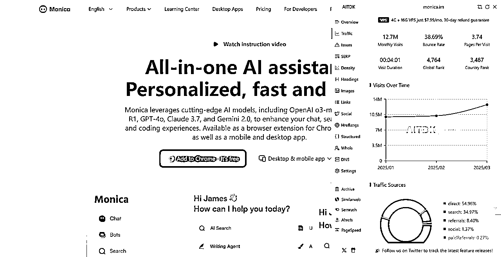
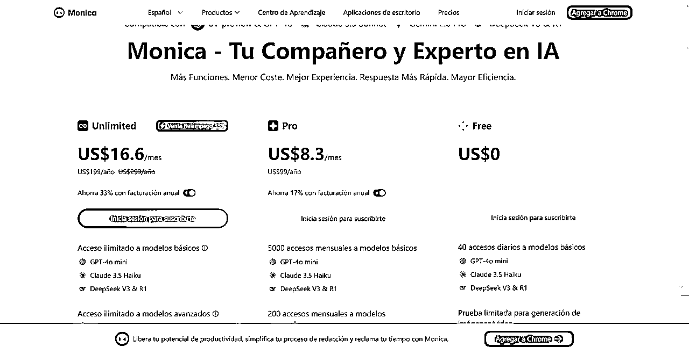
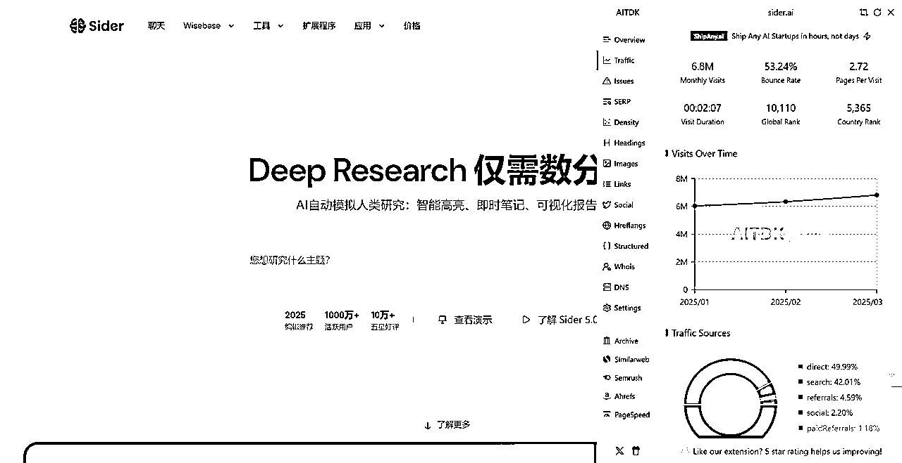
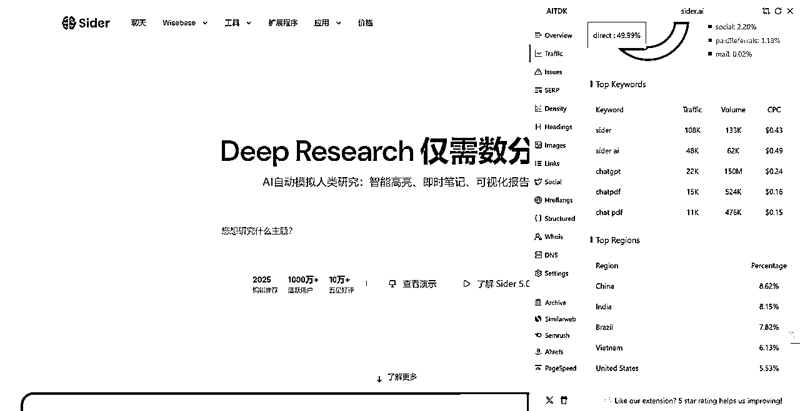
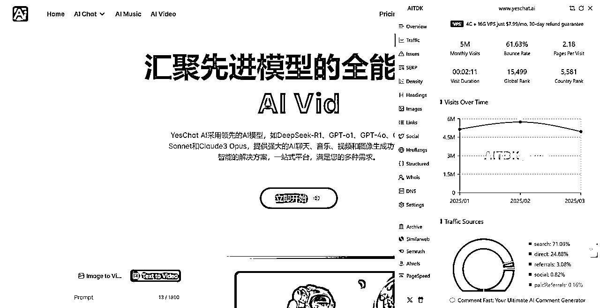
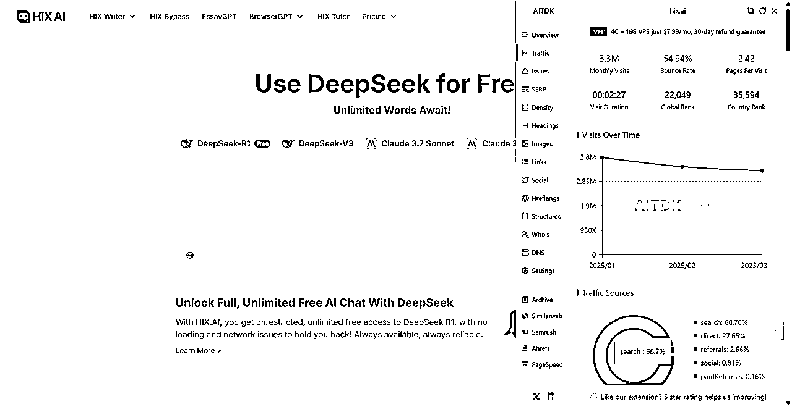
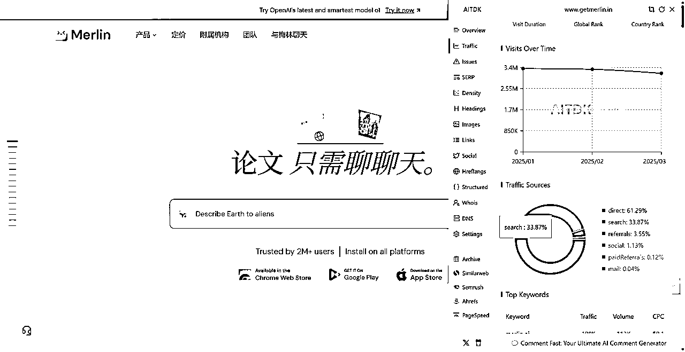

# All in one AI List 01

> 来源：[https://vz1gcav68m.feishu.cn/docx/HZvHdOKn6o78DFxZRVhcaXUCncd](https://vz1gcav68m.feishu.cn/docx/HZvHdOKn6o78DFxZRVhcaXUCncd)

## 重点产品分析 (Top 5 by Traffic)

### Monica.im

*   产品名称: Monica

*   产品官方网站链接: https://monica.im/

*   (可选) 其他相关链接: 通常在 Chrome Web Store, Edge Add-ons 等有插件页面。

#### 💡 产品价值：这个 SaaS 产品解决了什么核心问题？

*   核心价值: Monica 定位为用户的全能型 AI 助手（AI Copilot），通常以浏览器插件形式存在，旨在提升用户在网页浏览、内容创作、信息获取和处理等方面的效率。它集成了聊天、写作、阅读、翻译、搜索增强、图片生成等多种 AI 功能，让用户无需切换工具即可在当前页面完成多种任务。

*   细分市场: AI 助手 / AI Copilot / 浏览器增强工具 / 生产力工具。

#### 👤 目标用户：这款产品的典型用户是谁？

*   特征: 广泛覆盖需要频繁使用浏览器进行工作、学习或创作的用户。包括但不限于：知识工作者、学生、研究人员、市场营销人员、内容创作者、开发者、需要处理大量文本或进行跨语言交流的用户。覆盖个人用户和潜在的团队用户。

*   细分: 可以根据主要使用场景细分，如“写作增强型用户”、“信息处理/研究型用户”、“日常效率提升型用户”。

#### 🤔 用户需求：用户为什么需要这个产品？痛点是什么？

*   痛点:

*   在不同 AI 工具（如 ChatGPT、Claude、Midjourney）之间切换，流程繁琐。

*   处理网页长文、报告、邮件耗时。

*   写作时缺乏灵感、需要润色或改写。

*   需要快速翻译网页内容或进行跨语言沟通。

*   搜索信息效率不高。

*   满足方式: 通过浏览器插件将多种 AI 功能集成，提供一站式解决方案，减少上下文切换，提升工作流效率。提供快捷指令、预设模板等简化操作。

#### 🗣️ 用户评价：用户如何评价这款产品？（好评与差评）

*   (基于网络公开信息和插件商店评论的普遍反馈)

*   好评: 功能全面（All-in-One）、方便快捷（尤其插件形式）、集成多种大模型（GPT-4, Claude等）、模板丰富、能显著提升特定场景（如写作、阅读）的效率。

*   差评: 部分用户反馈 Bug 或稳定性问题、UI/UX 有待改进、免费额度有限、订阅价格相对较高、有时 AI 回复质量不稳定、对隐私的担忧（浏览器插件权限）。

#### 🔍 获客渠道：它是如何找到用户的？

*   主要渠道:

*   浏览器插件商店: Chrome Web Store, Edge Add-ons 等是核心入口，依赖商店排名和推荐。

*   SEO: 优化网站内容，吸引搜索 AI 助手、ChatGPT 插件等关键词的用户。

*   内容营销: 可能通过博客、社交媒体介绍产品功能和使用技巧。

*   口碑推荐: 用户体验好会带来自然增长。

*   流量巨大 (12.7M): 暗示其在插件商店表现优异，并且可能有较强的 SEO 或其他增长飞轮效应。

#### 💰 商业模式与收入：它如何赚钱？盈利状况可能如何？

*   商业模式: Freemium (免费增值)。提供免费套餐，有使用次数或高级功能限制；付费订阅套餐（月付/年付）提供更多用量、高级模型（如 GPT-4）、更快速度、优先支持等。通常分为多个付费等级。

*   收入估算 (MRR):

*   假设: 月访问量 ≈ 12.7M。假设免费用户到付费用户的转化率 (Conversion Rate) 为 1% (SaaS Freemium 的常见范围，考虑到 AI 工具竞争激烈，取相对保守值)。假设平均每付费用户收入 (ARPU) 为 $10/月 (基于类似工具的定价)。

*   估算: MRR ≈ 12.7M/2 × 1% × $10 ≈ $655,000/月。

*   声明: 这是非常粗略的估算，实际转化率和 ARPU 可能有很大差异。流量数据本身也有误差。未找到公开的融资或财报数据。

#### 🧠 学习借鉴：我从这个产品身上学到了哪些值得借鉴的点？

*   集成与便捷性: 将多种 AI 能力无缝集成到用户现有工作流（浏览器）中是巨大优势。

*   Freemium 模式: 有利于快速获取大量用户，形成网络效应和口碑传播。

*   功能全面性: "All-in-One" 策略能满足用户多样化需求，减少用户选择其他工具的必要。

#### 🚧 挑战与壁垒：分析该产品，有哪些做法是我难以复制或实现的？原因是什么？

*   技术整合能力: 同时稳定地集成和维护多种 AI 模型（GPT、Claude 等）的 API，并提供流畅体验，需要较强的工程能力。

*   浏览器插件开发与维护: 跨浏览器兼容性、性能优化、安全性、应对商店审核政策变化等有门槛。

*   先发优势与用户基数: 已积累的大量用户和品牌认知度是后来者难以快速复制的。

*   获客成本: 在竞争激烈的市场中，维持高流量可能需要持续投入营销费用。

#### 🤗 电梯演讲：如果我是产品创始人，如何用一句话向潜在用户推销它？

*   "Monica 是集成在您浏览器中的终极 AI 助手，让您在任何网页上都能即时聊天、写作、阅读和创作，效率倍增！"

#### 🚀 创新机会：如果我做同类产品，可以有哪些差异化策略？

*   更深度的垂直领域整合: 例如，专为开发者、医学研究者或法律专业人士定制功能和 Prompt 库。

*   极致的 UX/UI: 设计更简洁、直观、个性化的用户界面。

*   隐私优先: 强调本地处理或更透明的数据策略。

*   社区驱动: 建立强大的用户社区，共享 Prompt、工作流和最佳实践。

*   价格策略: 提供更具竞争力的定价或独特的计费模式（如按需）。

*   集成特定工作流软件: 如深度集成 Notion, Slack, Google Workspace 等。

#### 🎉 可行性评估：我（或我的团队）有能力做出类似或改进的产品吗？

*   资源需求: 经验丰富的全栈工程师、熟悉多种大模型 API 的 AI 工程师、优秀的 UX/UI 设计师、浏览器插件开发经验、市场营销资源、启动资金（API 调用成本、服务器、营销）。

*   资源匹配: （需根据实际情况评估） 是否拥有或能吸引到上述人才？是否有足够资金支持早期开发和冷启动？

#### 🧭 我的用户获取：如果我做这个产品，我将如何找到我的第一批用户？

*   专注利基市场: 从一个特定用户群体（如特定职业、特定语言用户）切入，解决他们的独特痛点。

*   内容营销: 撰写高质量博客文章/教程，解决目标用户使用 AI 时遇到的具体问题。

*   社区推广: 在相关论坛、社群（Reddit, Discord, 专业论坛）进行价值分享和产品介绍（避免硬广）。

*   早期用户计划/Beta 测试: 提供优惠或免费额度吸引种子用户，并收集反馈。

*   Product Hunt 等平台发布: 争取早期曝光。

#### ✨ 我的优势：为什么是我来做？我具备哪些独特优势？

*   (需根据实际情况回答) 例如：在某个垂直领域有深厚背景、独特的技术洞察、强大的社区资源、新颖的产品设计理念、对特定用户群体需求的深刻理解等。

#### ❤️ 热情与坚持：我对这个领域/产品方向有足够的热情吗？

*   (需自我评估) AI 助手领域变化快、竞争激烈，需要持续学习和迭代。是否能保持热情，倾听用户声音，并坚持至少半年到一年进行打磨？

* * *

## Sider.ai

*   产品名称: Sider

*   产品官方网站链接: https://sider.ai/

*   (可选) 其他相关链接: 同样在主流浏览器插件商店有页面。

#### 💡 产品价值：这个 SaaS 产品解决了什么核心问题？

*   核心价值: 与 Monica 类似，Sider 也是一个集成在浏览器侧边栏的 AI 助手，提供聊天、写作、阅读、代码解释、图像生成等功能，旨在提升用户浏览和工作效率。

*   细分市场: AI 助手 / AI Copilot / 浏览器增强工具 / 生产力工具。

#### 👤 目标用户：这款产品的典型用户是谁？

*   特征: 与 Monica 的目标用户高度重合，主要是需要利用 AI 提升浏览器内工作效率的个人和专业人士。

*   细分: 可能根据其宣传侧重点（如对开发者的友好度、特定写作模板）略有差异。

#### 🤔 用户需求：用户为什么需要这个产品？痛点是什么？

*   痛点: 与 Monica 类似，解决在不同 AI 工具间切换、处理信息效率低、内容创作困难等问题。

*   满足方式: 提供侧边栏插件，集成多种 AI 功能，实现一站式服务。

#### 🗣️ 用户评价：用户如何评价这款产品？（好评与差评）

*   (基于网络公开信息和插件商店评论的普遍反馈)

*   好评: 功能丰富、界面友好、响应速度快、集成了多种模型、支持自定义 Prompt。

*   差评: 免费额度有限、部分高级功能需付费、偶尔有 Bug、与其他同类产品功能同质化较高。

#### 🔍 获客渠道：它是如何找到用户的？

*   主要渠道: 浏览器插件商店、SEO、内容营销、口碑传播。6.8M 的流量说明其获客能力较强，可能在插件商店排名靠前或 SEO 效果显著。域名注册时间（2023/2/14）显示其是 ChatGPT 浪潮后快速发展起来的产品。

#### 💰 商业模式与收入：它如何赚钱？盈利状况可能如何？

*   商业模式: Freemium。提供免费版和多个付费订阅等级。

*   收入估算 (MRR):

*   假设: UV ≈ 6.8M /2 。转化率 ≈ 1%。ARPU ≈ $10/月。

*   估算: MRR ≈ 6.8M/2 × 1% × $10 ≈ $340,000/月。

*   声明: 粗略估算，仅供参考。

#### 🧠 学习借鉴：我从这个产品身上学到了哪些值得借鉴的点？

*   快速迭代与市场响应: 在 AI 浪潮兴起后迅速推出产品并获得可观流量。

*   用户体验: 通常此类产品会注重侧边栏的交互体验。

*   模型选择: 提供多种底层模型供用户选择，满足不同偏好。

#### 🚧 挑战与壁垒：分析该产品，有哪些做法是我难以复制或实现的？原因是什么？

*   快速获取大量用户: 在短时间内达到百万级流量，需要有效的增长策略和执行力。

*   技术栈与工程效率: 快速开发和迭代功能，保持产品竞争力。

*   品牌建立: 在众多同类产品中脱颖而出，建立用户认知。

#### 🤗 电梯演讲：如果我是产品创始人，如何用一句话向潜在用户推销它？

*   "Sider 是您浏览器里的智能侧边栏，集成了聊天、写作、阅读等 AI 超能力，让您的网络体验更快、更聪明！"

#### 🚀 创新机会：如果我做同类产品，可以有哪些差异化策略？

*   (同 Monica 分析中的策略，可根据 Sider 的具体特点微调) 例如，更强的代码辅助能力、更丰富的多模态支持、更开放的插件/集成生态。

* * *

## YesChat.ai

*   产品名称: YesChat.ai

*   产品官方网站链接: https://yeschat.ai/

#### 💡 产品价值：这个 SaaS 产品解决了什么核心问题？

*   核心价值: YesChat.ai 主要提供免费访问各种先进 AI 大模型的聊天界面，如 GPT-4、Claude 等，可能绕过了一些官方的限制或付费门槛（注意：这类服务的合规性和可持续性可能存疑）。核心是提供便捷、免费（或低成本）的先进 AI 对话体验。

*   细分市场: AI 聊天机器人聚合平台 / 免费 AI 模型访问入口。

#### 👤 目标用户：这款产品的典型用户是谁？

*   特征: 想要免费或低成本体验最新、最强大 AI 模型（如 GPT-4 Omni, Claude 3 Opus）的用户。对价格敏感，或者无法直接访问官方服务的用户（如地理限制、无信用卡等）。学生、AI 爱好者、需要大量调用但预算有限的开发者或小团队。

*   细分: "免费体验党"、"高阶模型探索者"、"特定区域用户"。

#### 🤔 用户需求：用户为什么需要这个产品？痛点是什么？

*   痛点:

*   官方先进模型（如 GPT-4）通常需要付费订阅。

*   部分地区用户无法正常访问 OpenAI 或 Anthropic 等官方服务。

*   希望在一个地方尝试和比较不同的大模型。

*   官方工具有使用限制（如消息数）。

*   满足方式: 提供一个集中的、免费或低门槛的界面来访问这些模型。

#### 🗣️ 用户评价：用户如何评价这款产品？（好评与差评）

*   (基于对此类服务的普遍认知)

*   好评: 免费使用 GPT-4/Claude 3 等高级模型、无需注册或登录（部分可能需要）、界面简洁、访问方便。

*   差评: 服务稳定性可能不高（依赖第三方 API 或非官方渠道）、响应速度可能较慢、存在隐私和安全风险、功能相对单一（主要集中在聊天）、可能面临版权或合规问题导致关停。

#### 🔍 获客渠道：它是如何找到用户的？

*   主要渠道:

*   SEO: 大量围绕 "free GPT-4", "Claude online free" 等关键词优化。

*   社交媒体/论坛传播: 在 Reddit, Discord, Telegram, 技术论坛等地方被提及和分享。

*   口碑: 用户发现可以免费使用高级模型后互相告知。

*   域名注册时间 (2023/10/11): 也是较新的产品，抓住了用户对免费使用高级模型的需求。5M 的流量说明这种需求非常旺盛。

#### 💰 商业模式与收入：它如何赚钱？盈利状况可能如何？

*   商业模式:

*   可能途径:

*   广告: 在网站上展示广告。

*   捐赠: 呼吁用户捐赠支持。

*   导流: 可能引导用户到付费服务或其他合作产品。

*   提供付费增值服务: 如更快的速度、更高的使用额度、API 访问等（但这与其免费定位有所冲突）。

*   部分此类服务可能通过非正规渠道获取 API key，成本结构不明，盈利模式存疑。

*   收入估算 (MRR): 很难估算。如果主要靠广告，CPM/CPC 不会太高；如果依赖捐赠，不稳定。如果存在灰色地带，则无法评估。其高流量主要是由“免费”驱动，用户付费意愿可能较低。

#### 🧠 学习借鉴：我从这个产品身上学到了哪些值得借鉴的点？

*   需求洞察: 精准抓住了用户希望免费体验先进 AI 模型的强烈需求。

*   流量获取: 利用 SEO 和社区传播，围绕核心痛点（免费）快速获取大量流量。

#### 🚧 挑战与壁垒：分析该产品，有哪些做法是我难以复制或实现的？原因是什么？

*   API 来源与合规性: 如果依赖非官方或灰色渠道获取模型访问权限，存在巨大的法律和运营风险，不可持续，不应复制。

*   服务稳定性: 依赖第三方接口，难以保证服务的持续稳定。

*   长期盈利能力: 纯免费模式难以持续覆盖成本（API 调用、服务器），需要找到合规且可持续的盈利模式。

#### 🤗 电梯演讲：如果我是产品创始人，如何用一句话向潜在用户推销它？

*   "YesChat.ai 让您免费、免注册畅快体验包括 GPT-4 和 Claude 在内的全球顶尖 AI 模型！" (需注意合规风险)

#### 🚀 创新机会：如果我做同类产品，可以有哪些差异化策略？

*   合规聚合平台: 与模型提供方建立正式合作，提供一个合规的、可以比较和切换不同模型的平台（可能需要付费）。

*   特定优化: 针对特定任务（如翻译、代码生成）优化不同模型的调用和 Prompt。

*   教育与引导: 在提供访问的同时，加入更多关于模型能力、局限性、最佳实践的教育内容。

*   与工具集成: 将多模型访问能力嵌入到其他生产力工具中。

#### 🎉 可行性评估：我（或我的团队）有能力做出类似或改进的产品吗？

*   资源需求: 前端开发（构建聊天界面）、后端开发（管理 API 调用）、可能的 API 合作谈判能力、法律顾问（确保合规）。如果走合规路线，需要资金支付 API 费用。

*   资源匹配: （需评估）

#### 🧭 我的用户获取：如果我做这个产品，我将如何找到我的第一批用户？

*   （如果走合规聚合路线）

*   内容营销: 对比不同模型的优劣势、适用场景。

*   开发者社区: 面向需要测试不同模型的开发者推广。

*   合作: 与 AI 教育者、博主合作。

#### ✨ 我的优势：为什么是我来做？我具备哪些独特优势？

*   (需评估) 例如：与多家 AI 公司有良好关系、对模型评测有深入研究、能设计出色的多模型交互界面。

#### ❤️ 热情与坚持：我对这个领域/产品方向有足够的热情吗？

*   (需评估) 对追踪和评测各种大模型保持热情。

* * *

## Hix.ai

*   产品名称: HIX.AI

*   产品官方网站链接: https://hix.ai/

#### 💡 产品价值：这个 SaaS 产品解决了什么核心问题？

*   核心价值: HIX.AI 定位为一个功能全面的 AI 写作助手和内容创作平台。它不仅提供类似聊天机器人的功能，更侧重于结构化的写作工具，如文章生成器、邮件撰写器、社交媒体帖子生成器、广告文案工具、改写工具、摘要工具等。旨在帮助用户克服写作障碍，提高内容创作的效率和质量。

*   细分市场: AI 写作助手 / 内容生成平台 / 营销文案工具。

#### 👤 目标用户：这款产品的典型用户是谁？

*   特征: 市场营销人员、SEO 专家、博主、内容创作者、文案撰稿人、需要撰写大量邮件或报告的商务人士、学生（用于论文或作业辅助）。

*   细分: 可以根据内容类型细分，如“博客写手”、“广告文案策划”、“社交媒体经理”等。

#### 🤔 用户需求：用户为什么需要这个产品？痛点是什么？

*   痛点:

*   写作效率低，耗时长。

*   缺乏写作灵感，难以开始（Writer's block）。

*   需要针对不同平台（博客、社媒、广告）创作不同风格和格式的内容。

*   需要进行 SEO 优化。

*   希望提升内容的吸引力和专业度。

*   需要快速改写或总结现有文本。

*   满足方式: 提供大量针对性的写作模板和工具，引导用户输入关键信息，快速生成结构化、符合特定需求的文本内容。提供 SEO 关键词建议、语法检查、风格调整等功能。

#### 🗣️ 用户评价：用户如何评价这款产品？（好评与差评）

*   (基于网络公开信息和评测网站)

*   好评: 写作模板非常丰富（覆盖场景广）、生成内容质量尚可、界面相对清晰、提供浏览器插件（HIX Everywhere）、集成了多种工具（如 AI 检测器、长文编辑器）。

*   差评: 生成内容的原创性和深度有时不足、部分模板效果一般、免费额度有限、订阅价格不低、AI 生成痕迹有时较重（需要人工修改）。

#### 🔍 获客渠道：它是如何找到用户的？

*   主要渠道:

*   SEO: 重点优化各种 "AI writer", "content generator", "copywriting tool" 相关关键词。网站结构和大量工具页面有利于 SEO。

*   内容营销: 通过博客、教程展示产品能力，吸引目标用户。

*   联盟营销: 可能与营销类博主或网站合作推广。

*   付费广告: 可能在 Google 或社交媒体投放广告。

*   浏览器插件: 扩展用户触达。

#### 💰 商业模式与收入：它如何赚钱？盈利状况可能如何？

*   商业模式: Freemium。提供有限的免费试用额度，付费订阅按月/年收费，根据功能、生成字数、高级模板等划分不同套餐。

*   收入估算 (MRR):

*   假设: UV ≈ 3.3M / 2 。转化率 ≈ 1.5% (写作工具目标用户付费意愿可能略高于通用助手)。ARPU ≈ $15/月 (写作工具定价通常略高)。

*   估算: MRR ≈ 1.65M UV × 1.5% × $15 ≈ $371,250 / 月

*   声明: 粗略估算，仅供参考。

#### 🧠 学习借鉴：我从这个产品身上学到了哪些值得借鉴的点？

*   工具化与场景化: 将 AI 能力封装成大量具体的、面向场景的工具（模板），降低用户使用门槛。

*   SEO 驱动增长: 网站结构和内容策略高度服务于 SEO 获客。

*   产品矩阵: 除了核心写作功能，还提供 AI 检测、聊天等辅助工具，形成生态。

#### 🚧 挑战与壁垒：分析该产品，有哪些做法是我难以复制或实现的？原因是什么？

*   大量模板的开发与优化: 设计、开发和持续优化上百种写作模板需要大量投入和对用户需求的理解。

*   强大的 SEO 能力: 达到高流量所需的 SEO 策略和执行非一日之功。

*   内容质量的平衡: 在追求生成速度和数量的同时，保证内容的质量和原创性是一个持续的挑战。

#### 🤗 电梯演讲：如果我是产品创始人，如何用一句话向潜在用户推销它？

*   "HIX.AI 是您的终极 AI 写作伙伴，提供 120+ 精准工具，帮您秒速生成高质量博客、广告、邮件和社媒内容！"

#### 🚀 创新机会：如果我做同类产品，可以有哪些差异化策略？

*   更强的品牌声音定制: 让 AI 生成的内容更符合特定品牌或个人的独特风格。

*   事实核查与引用: 集成事实核查功能，自动为生成内容添加可靠来源。

*   协作功能: 强化团队协作编辑和审阅 AI 生成内容的功能。

*   特定行业深度优化: 如专为金融、法律、医疗等专业领域定制的写作模型和模板。

*   工作流整合: 与 CMS（如 WordPress）、社交媒体管理工具等深度集成。

#### 🎉 可行性评估：我（或我的团队）有能力做出类似或改进的产品吗？

*   资源需求: AI 工程师（Prompt Engineering 很重要）、全栈工程师、UX 设计师、内容策略师/营销专家、可能的垂直行业专家。

*   资源匹配: （需评估）

#### 🧭 我的用户获取：如果我做这个产品，我将如何找到我的第一批用户？

*   专注细分写作场景: 例如，只做“AI 辅助学术写作”或“AI 生成电商产品描述”。

*   内容营销 + 免费工具: 提供高质量的写作技巧内容，并附带一个解决核心痛点的免费小工具来吸引早期用户。

*   合作: 与特定行业的意见领袖或社区合作。

#### ✨ 我的优势：为什么是我来做？我具备哪些独特优势？

*   (需评估) 例如：在内容营销领域有丰富经验、掌握独特的 Prompt Engineering 技术、能设计出色的写作流程。

#### ❤️ 热情与坚持：我对这个领域/产品方向有足够的热情吗？

*   (需评估) 对帮助人们更好地写作和创作内容充满热情。

* * *

## GetMerlin.in

*   产品名称: Merlin

*   产品官方网站链接: https://www.getmerlin.in/ (注意域名是 .in)

#### 💡 产品价值：这个 SaaS 产品解决了什么核心问题？

*   核心价值: Merlin 也是一个广泛使用的 AI 助手浏览器插件，与 Monica 和 Sider 非常相似。它提供网页上的即时 AI 访问，包括聊天、内容摘要、文本生成、邮件回复等功能，旨在整合 AI 能力到用户的日常浏览和工作中，提高生产力。

*   细分市场: AI 助手 / AI Copilot / 浏览器增强工具 / 生产力工具。

#### 👤 目标用户：这款产品的典型用户是谁？

*   特征: 与 Monica 和 Sider 的目标用户高度重合。任何希望在浏览器中便捷使用 AI 的个人用户、学生、专业人士。

*   细分: 可能通过特定功能（如 YouTube 视频摘要、特定平台集成）吸引细分用户。

#### 🤔 用户需求：用户为什么需要这个产品？痛点是什么？

*   痛点: 与 Monica 和 Sider 类似，解决多工具切换、信息处理耗时、内容创作辅助等问题。

*   满足方式: 通过浏览器插件提供一站式 AI 服务。

#### 🗣️ 用户评价：用户如何评价这款产品？（好评与差评）

*   (基于网络公开信息和插件商店评论的普遍反馈)

*   好评: 方便易用、功能集成度高、能提升浏览和写作效率、部分特色功能（如 YouTube 摘要）受欢迎。

*   差评: 免费额度限制严格、订阅价格较高、有时不稳定或响应慢、与其他同类产品差异化不明显、隐私担忧。

#### 🔍 获客渠道：它是如何找到用户的？

*   主要渠道: 浏览器插件商店（Chrome Web Store 是关键）、SEO、内容营销、口碑传播。.in 域名可能暗示其早期目标市场或创始团队与印度有关，但现在是全球性产品。3.2M 的流量也表明其有较强的获客能力。

#### 💰 商业模式与收入：它如何赚钱？盈利状况可能如何？

*   商业模式: Freemium。提供免费版和多个付费订阅等级。

*   收入估算 (MRR):

*   假设: UV ≈ 3.2M/2。转化率 ≈ 1%。ARPU ≈ $15/月。

*   估算: MRR ≈ 1.6M UV × 1% × $15 ≈ $240,000 / 月

*   声明: 粗略估算，仅供参考。

#### 🧠 学习借鉴：我从这个产品身上学到了哪些值得借鉴的点？

*   浏览器插件作为入口: 再次验证了浏览器插件是 AI 助手触达用户的有效形式。

*   快速跟进: 与 Sider 类似，在 AI 浪潮中快速推出产品并获取用户。

*   特定场景功能: 通过 YouTube 摘要等功能尝试差异化。

#### 🚧 挑战与壁垒：分析该产品，有哪些做法是我难以复制或实现的？原因是什么？

*   用户基数: 达到百万级月活用户需要时间和有效的增长策略。

*   持续创新: 在功能高度同质化的市场中保持竞争力，需要不断推出有价值的新功能或优化体验。

*   插件生态位竞争: Chrome 等商店中同类插件众多，获得高排名和曝光不易。

#### 🤗 电梯演讲：如果我是产品创始人，如何用一句话向潜在用户推销它？

*   "Merlin 把 ChatGPT 的魔法带到你浏览的每一个角落，随时随地帮你总结、写作和回复，让 AI 成为你的上网超能力！"

#### 🚀 创新机会：如果我做同类产品，可以有哪些差异化策略？

*   (同 Monica, Sider 分析中的策略) 例如，更强的多语言支持、专注于移动端浏览器体验、与特定软件的深度集成、更透明的隐私保护。

* * *

## 综合对比与反思

### 相同点 (Common Themes)

1.  AI 驱动核心价值: 所有产品都围绕 AI 技术提供核心价值，主要集中在提升效率（助手、自动化）、增强创造力（写作、设计、音视频）、改善信息获取与处理。

1.  主流产品形态:

*   AI 助手/Copilot (浏览器插件): 如 Monica, Sider, Merlin, MaxAI，通过集成到浏览器，成为高频使用的入口，市场竞争激烈。

*   AI 写作/内容生成平台: 如 Hix.ai, Easy-Peasy.ai，提供大量模板和工具满足特定内容创作需求。

*   AI 聊天聚合/访问平台: 如 YesChat.ai, t3.chat(?)，满足用户体验不同或免费使用先进模型的需求。

*   AIGC 创意工具: 如 BasedLabs(?), MaxStudio(?), Haiper，专注于图像、视频等生成。

1.  商业模式: Freemium 是绝对的主流，通过免费版本吸引大量用户，再通过付费订阅（按功能、用量分级）实现变现。

1.  获客渠道: SEO (尤其对于写作和聊天聚合类) 和 浏览器插件商店 (对于助手类) 是关键的有机增长渠道。内容营销和口碑传播亦十分重要。

1.  新近入局者众多: 大部分高流量产品的域名注册时间都在 2022 年底至 2024 年初，反映了 ChatGPT 引爆的 AI 应用创业浪潮。

1.  技术依赖: 产品能力很大程度上依赖于底层大模型（如 OpenAI, Anthropic, Google 的模型）的能力和 API 供应。

### 不同点 (Variations & Nuances)

1.  产品定位与功能侧重: 从全能型助手，到专项写作工具，再到聊天聚合、AIGC、自动化平台、甚至区域性/语言性服务，定位差异显著。

1.  目标用户细分: 虽然有广泛重叠，但不同产品会通过功能侧重吸引特定用户群（如 Hix 面向写手，Haiper 面向视频创作者，Araby 面向阿拉伯语用户）。

1.  成熟度与背景: 存在老牌公司转型（Vondy, Simplified）和大量新兴创业公司。域名注册时间跨度极大。

1.  流量规模: 从千万级到几十万级，差异巨大，反映了市场竞争格局和不同产品的生命周期阶段。

1.  地域/语言焦点: 出现了面向特定区域（Superai.id - 印尼）或语言（Araby.ai - 阿拉伯语）的产品，显示出市场细分的趋势。

1.  创新与差异化: 头部产品功能趋同，差异化主要体现在 UI/UX、特定小功能、支持的模型种类、定价策略以及可能的生态整合上。YesChat 这类则走了“免费”的差异化（但有风险）。

1.  域名策略: .ai 是主流，但也有 .com, .co, .in, .pro, .org, .id, .chat 等，反映了不同考量（可用性、定位、区域等）。

### 个人洞察与思考

1.  市场极度拥挤，但需求旺盛: AI 助手/工具市场已成红海，尤其在通用助手和写作领域。然而，巨大的流量表明用户对 AI 提效、创作的需求非常真实且庞大。

1.  浏览器插件是关键战场: 对于通用 AI 助手，浏览器插件提供了无缝集成用户工作流的最佳体验，是兵家必争之地。

1.  “免费”的诱惑与风险: YesChat 类产品的高流量显示了免费策略的强大吸引力，但也伴随着合规性、可持续性的巨大风险。这不是一条值得推荐的长期路径。

1.  差异化是生存之道: 新入局者或现有玩家需要找到明确的差异化策略：

*   垂直深耕: 针对特定行业、职业或任务流做深做透。

*   极致体验: 在 UI/UX、性能、可靠性上做到卓越。

*   技术创新: 利用新的 AI 模型能力或独特的数据/算法。

*   社区与生态: 构建用户社区或与其他工具深度集成。

*   区域/语言: 服务好特定的地理或语言市场。

1.  老牌公司转型潜力: 拥有老域名的公司（如 Vondy, Simplified）如果能有效整合 AI 到其现有业务和用户群中，具备一定优势（信任、用户基础、可能的数据）。

1.  AIGC (尤其是视频) 是增长点: Haiper 等产品的出现表明，超越文本的 AI 应用（图像、视频、音频）是重要的创新方向。

1.  变现仍是挑战: 虽然 Freemium 普遍，但如何有效提高付费转化率、设定合理的 ARPU，并覆盖高昂的 AI 调用成本和研发投入，是所有玩家面临的挑战。

1.  对创始团队的要求极高: 既要懂 AI 技术（或至少能很好地集成），又要懂产品设计和用户体验，还要擅长市场推广和增长，同时要应对快速变化的市场和技术。

总而言之，这个列表展示了一个充满活力但也竞争异常激烈的 AI 应用市场。对于想要进入或已经身处其中的玩家来说，清晰的定位、持续的创新、有效的获客以及健康的商业模式缺一不可。对于个人用户而言，这是一个幸福的烦恼——选择众多，但也需要仔细甄别，找到最适合自己需求的工具。