# MAC端 定时强制休息app Time Out，实现app图标和锁定弹窗icon修改

> 来源：[https://iik3odicycr.feishu.cn/docx/QgDed3FcBo71eUxbWAJc5zCsnib](https://iik3odicycr.feishu.cn/docx/QgDed3FcBo71eUxbWAJc5zCsnib)

## 背景

总是坐在那里一天不怎么起来，也不怎么动，对身体很不好，闹钟什么的又觉得不合适。

思来想去，想用一个app来控制一下，通过一番搜索问询，锁定了time out

但是吧，这个app 有点毛病，原来的图标很吓人。

小的时候没事。大了 特别是晚上 不合适。

给大家展示一下：

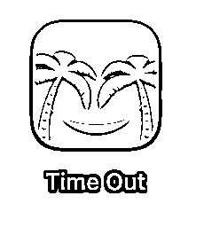

鉴于这兄弟，确实有点不是那么回事儿，那咱就换图标吧。

操作机型 ：MacBook Pro (13-inch, M1, 2020)

系统版本：macOS Monterey 12.7.6 (21H1320)

芯片：Apple M1

## 需求

那就需要换个图标了，说干就干。

## 实现过程

教程找一下，比较简单，找到替换的图片，command+c复制好，再打开find-应用程序-找到time out app图标，右键-显示简介，选中左上角的地方，command+v，把图片复制好，预览也就变化了。

注意：此操作可能导致app异常或不稳定，担心的可以先做个副本。

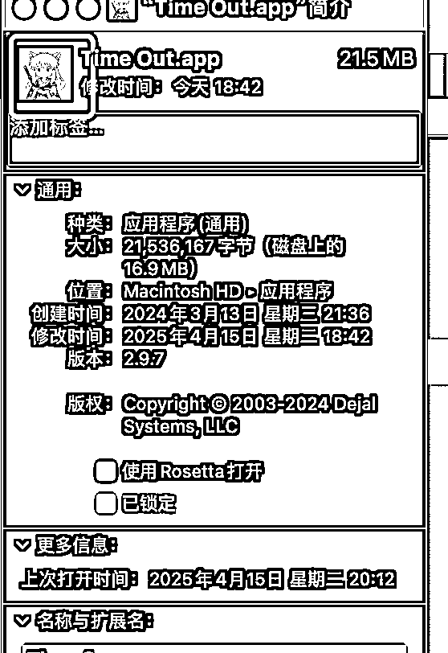

如果下面的预览变化了，也就变化了。

效果如图：

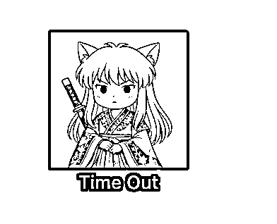

这一步还是非常成功的，但是，下一步还是弹出那个笑脸，这不行啊。那就到包里面去搞事情

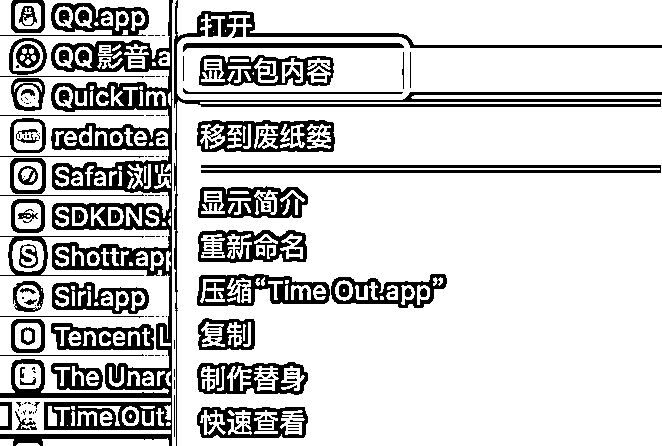

继续找icon替换，连xpc都替换了，

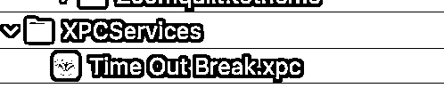

发现还是不对劲。在这里进去，显示包内容，继续换，还是不行，发现逻辑似乎不对，然后换回来了。

最后发现一个名为Themes的文件夹，嗯？这东西有主题？回到app，原来在appearance中，当前主题是Icon，开搞。

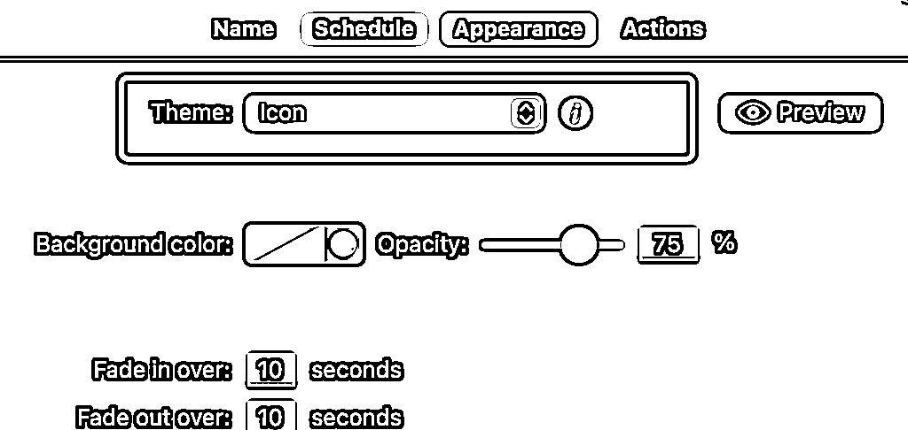

在icon v4 中操作，

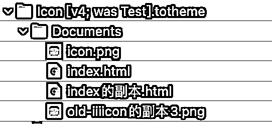

无法粘贴图标，哦，原来是没有权限，那就加权限

点上图右下角小锁，如果没有本用户就左边的+号，有就点权限变成读写。

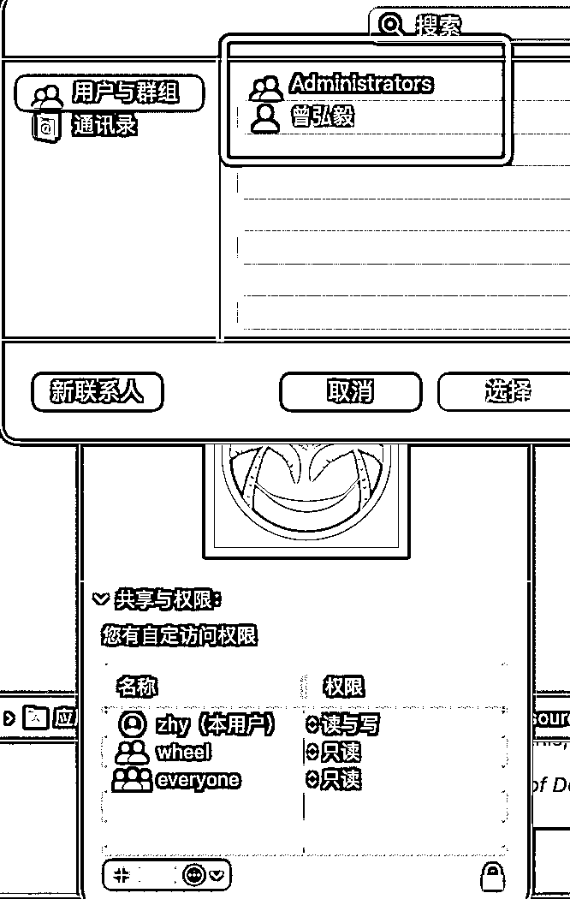

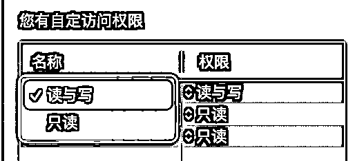

权限设置好了，继续复制图片，选中左上角替换

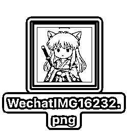

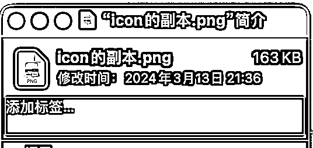

这样就是选中状态，command+v粘贴需要替换的图片

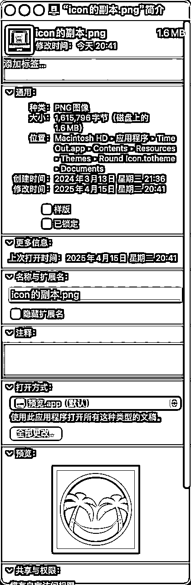

替换后，发现预览无变化。

搜索一下，说是需要重建缓存服务和一堆命令或重启，这显然可能是不对的。

那就看下json和html说明，发现确实是icon，

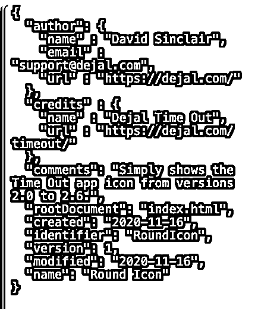

咦，问题在哪？

换了几波都不对劲，然后在time out.app中搜索，发现有多个icon，替换了不行，最后发现Themes中有多个主题，会不会是主题错了？

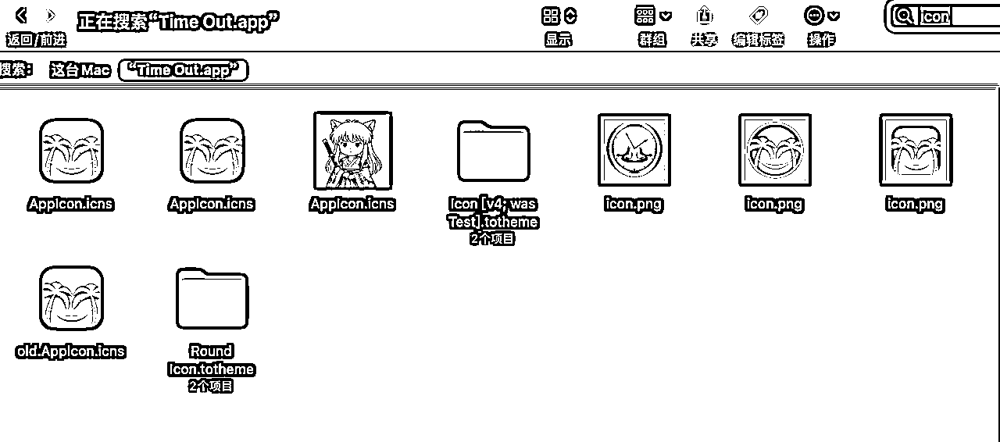

仔细核对，发现没有第二个 icon 主题。

没有比对到，那就扩大搜索范围。

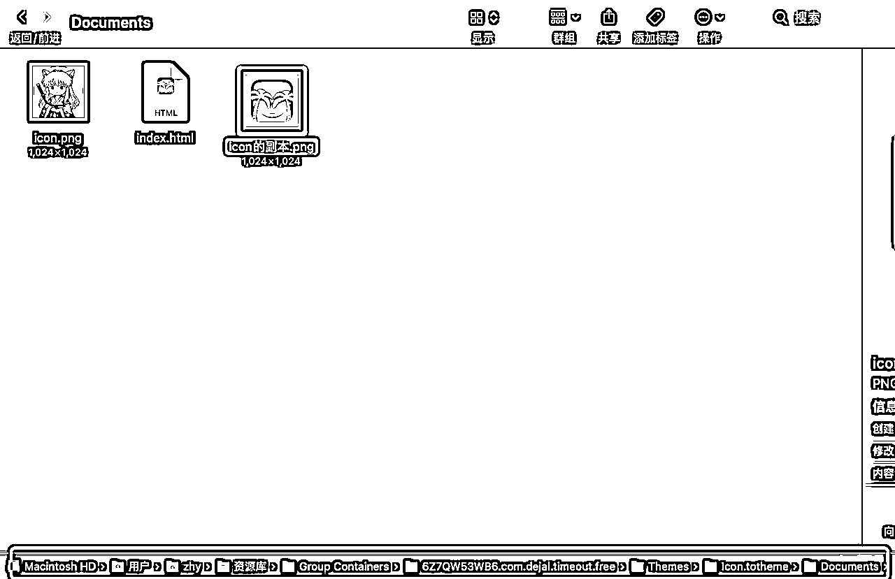

原来是在这个地方，上图是我已经按照之前的方法替换好的情况。

## 最终效果展示

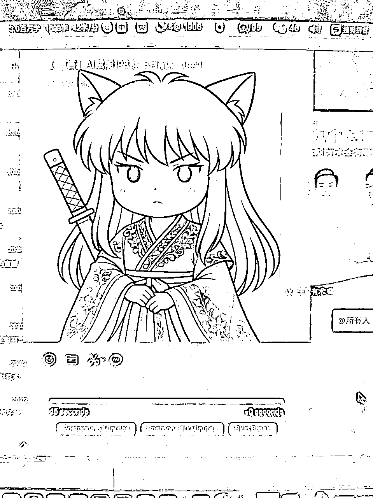

完结撒花

其他app同理，但是千万记得，玩自定义之前，备份备份再备份。