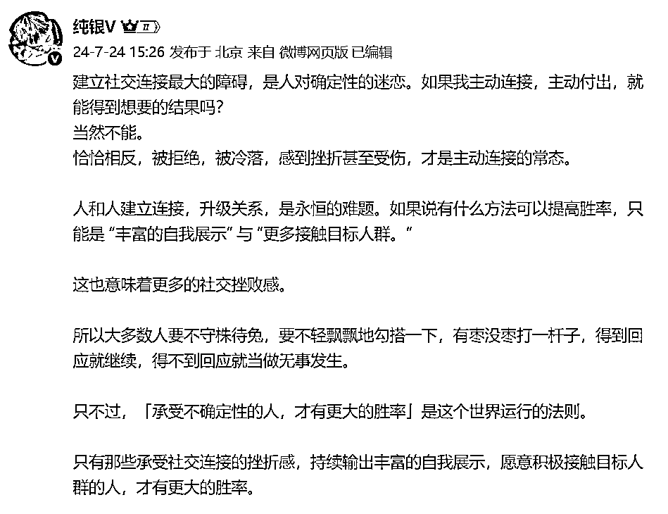
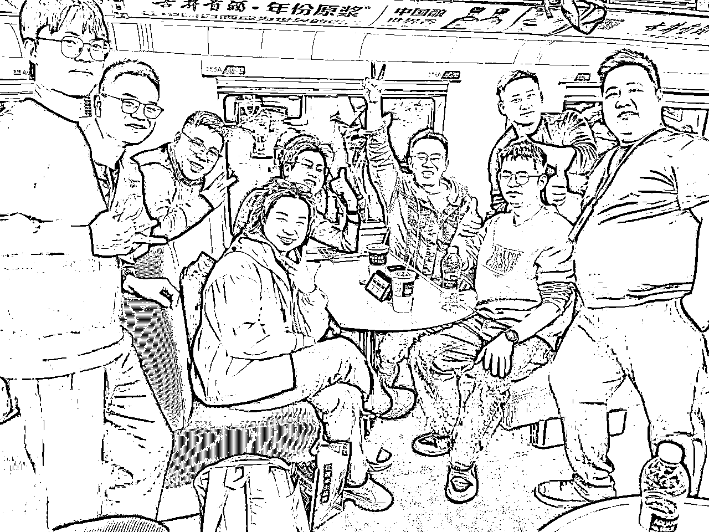

# 如何通过生财同城组局，找到你的互联网「生态位」？

> 来源：[https://shengcaiyoushu01.feishu.cn/docx/Lu9YdEs4Oo5O05x91EkcdfaBnaf](https://shengcaiyoushu01.feishu.cn/docx/Lu9YdEs4Oo5O05x91EkcdfaBnaf)

# 胖大魔自我介绍

嘿，朋友！我是胖大魔。看到你，就像看到两年前的自己。

还记得那时候，我就是个34岁的装修小老板，眼看传统行业增长乏力，天天被甲方爸爸怼到肝疼、被各种师傅折腾天天救火灭火，想转型轻资产，互联网这片海该怎么趟。

那个加入知识星球的夜晚，看到这么多——"这么多互联网项目看花眼，我该怎么做？"

尤其作为一个典型的大魔，每次想到要社交，我都恨不得钻进地缝。见人就傻笑，脑子空白，回家后躺尸三小时才能缓过来...这样的我，真的能玩转这个圈子。

答案是：可以。而且比你想象的容易。线上千百遍不如线下一面。

因为我发现了一个特别适合我们内向人的"低耗能、高连接"方法：同城组局。

它不是酒桌觥筹交错，而是让你用自己的节奏，在舒适的小范围内建立深度连接的场域。

以下是我在长沙组了50多场局后，踩着各种坑摸索出的六步进阶路径。希望能让你少走弯路，低能耗找到自己的那片天。

# 2.生财新圈友你好，这是我的生财使用指南

新人你好，我的生财使用说明书，请笑纳。适用于内向型人格(大魔)的朋友，

能解决你社交耗能巨大、难以突破温水煮青蛙怪圈、找不到方向的卡点。

分为几个步骤：

1.先做个积极营业的"沉浸式观察者"；

2.用你熟悉的方式，开启低频高质量连接；

3.参与小型组局，拿到正反馈；

4.每次组局后，用复盘找到自己的"热带雨林"；

5.打造属于你的深度价值名片；

6.确立你的标签，构成同城信任圈。

# 第一步：先做个积极营业沉浸式观察者

🔗关键词：融入与感知、激活你的观察力

🎯 行动建议：

加入你所在城市的生财同城群（或周边城市），进群自我介绍积极展现自己，告诉大家我是谁、我能提供什么资源我需要什么会有热血圈友出现的！

挑选1-2场小型线下组局（10人以下那种），摆正心态：你是"学习者"不是"社交选手"。

找到自己社交卡点。比如我发现自己最怕跟陌生人打招呼，就专门找群里活跃的E人（外向者）帮忙引荐，提前先做功课星球查查大家生财痕迹、加微信看看朋友圈。

大魔锦囊：

*   内向者的观察力是天赋，别低估这项能力！你可以把群内每位活跃者的性格、话题、节奏记得清清楚楚，为后续精准互动打好基础。生财是有表达者红利的！

*   被互联网黑话淹没很正常。我第一次听00后讲"私域""触达""精细化运营"时，整个人都是懵的。记住：不懂可以学，节奏可以调，但千万别因为"格格不入感"就放弃社交。

# 第二步：用你熟悉的方式，开启低频高质量连接

🔗 关键词：点对点深入交流、以文字为桥梁

🎯 行动建议：

自我介绍有门道：「以前我做装修做过建材卖过车，最近在琢磨AI怎么帮我们这种老行业赋能，想跟大家一起折腾」。提供共鸣点比炫耀经历重要。

做个"点赞小能手"：每天花15分钟给群里高质量内容点赞，偶尔认真讨论群里话题。这是最低成本的存在感建立方式。

每周主动约1-2个"同频者"喝咖啡：不求谈成什么，就是聊聊彼此在做什么，有什么困惑。

💡 大魔锦囊：

*   我当初就是「点赞狂魔」，默默点赞评论 + 用一句走心评论慢慢建立信任。找到自己独特优势，我可是除了亦仁以外评论圈友帖子最多的人，没有之一。

内向者通常在文字表达上更有优势，尽量在群里用字句展现你的理解力与诚意。

# 第三步：自己擅长领域参与组局、拿到组局正反馈

🌱 关键词：小规模交流、结构化组织

🎯 行动建议：

不必大张旗鼓！可以从"约4~5人吃个饭、聊一个主题"开始，比如老行业如何玩转流量？或AI小白互助会，同城圈友航海交流。

如果担心控场，可以联手一个外向朋友：你负责话题策划，对方负责气氛调动。

💡 大魔锦囊：

*   内向者不擅长寒暄，但特别擅长观察内容设计和细节引导。

*   小范围+结构清晰+议题明确，能大幅度降低能量消耗，提升参与感与掌控感。

*   小规模是关键！我第一次组30人以上的局简直要崩溃，我经历很多尝试，组过各种专门主题、一半老圈友一半新圈友、后来发现4-8人是我的舒适区，既有交流深度又不会能量消耗很大。

# 第四步：每次组局后，用复盘积累经验与直觉

🧘 关键词：反馈识别、内在感知

🎯 行动建议：

复盘清单：来了谁？他们为什么来？哪些话题被喜欢？我哪里被认可了？

感受自我能量变化：你是在哪个环节最轻松？哪段对话让你觉得「我有价值」？

💡 大魔锦囊：

*   复盘不是给别人看的，是帮你找到「哪里舒服、哪里累」的内在指南针。

*   我发现，自己擅长运营社群，我在群都很活跃，喜欢出主意，后面给有很多圈友提出建议，从这个细节出发，之后所有组局都围绕这一能力展开。

# 第五步：打造属于你的深度价值名片

💎 关键词：垂直定位、小而美实验

🎯 行动建议：

结合你原有经验，或者你正在钻研的新领域，发起一些更聚焦的主题局。

例如：你爱研究AI，就搞个「AI场景脑暴局」。

喜欢研究美食，就来一次长沙美食行，还要很多外地圈友来长沙玩。需要这样美食向导！

或者，用你的笔写点东西，把观察到的资源/问题/解决方法，整理成一份资料，作为你的价值输出锚点。

💡 大魔锦囊：

*   别想着当"全网大V"，找到你的"一亩三分地"就够了。我认识一位同样内向的女圈友，只专注分享"大学生微创业"，现在反而成了这个小领域的意见领袖。

*   深度胜过广度！一篇有思考、有干货的复盘，比十条朋友圈互动价值更高。

# 第六步：确立你的标签，构建同城信任圈

⚓ 关键词：生态位确认、影响力微循环

🎯 行动建议：

给自己贴标签：「我是胖大魔，专注于AI＋社群＋渠道，。这个标签不是为了炫耀，而是让别人记住你的价值定位。

主动让自己被看见：每次参加或组织活动后，写一篇小结发到星球、群里，配上活动照片和你的思考。不必长篇大论，只需真实记录和分享。

从兴趣爱好出发组局：我曾组织过一起爬山一起闲聊饭局这种轻松的兴趣局往往比严肃的商业局更容易建立真实连接。

建立固定节奏：比如每周五早上罗卜早茶会，固定节奏会让你逐渐成为这个领域的"锚点人物"。

主动链接资源：当你听到A需要什么，恰好B有这方面资源，大胆地牵线搭桥。这不是舔人脉，而是创造实际价值。

💡 大魔锦囊：

*   生态位不是喊出来的，而是日积月累建立的。我从最初群里的"点赞水军"，到偶尔分享组局心得的"组局者"，再到帮人搭建资源的"链接者"，最后聚焦"银发信息服务"这个垂直领域，每一步都是自然生长，而非刻意定位。

*   真正的社交不是短期利益交换，而是长期信任的建立。有时一次真诚的不求回报的帮助，胜过十次功利性的"资源对接"。

*   让别人知道你擅长什么很重要！我现在每周至少收到3-5个"这个适合你"的推荐，就是因为朋友们清楚我关注什么领域。

*   记住：生态位是你提供的独特价值与他人需求的交汇点。它不需要你面面俱到，只需要你在特定领域持续输出。

最关键的是，不要低估坚持的力量。我认识的几位生财大佬，都不是靠一夜爆红，而是通过这些持续的、小而精的互动和贡献，逐渐被生财社群"发现"邀请分享并认可的。你的价值，终将在合适的时机被看见。

# 写给内向转型者的几句心里话

1\. 别怕"low"：你的线下老本行经验逻辑是互通的，在很多互联网人眼里其实是稀缺的"真实世界案例"。

2\. 行动先于完美："想清楚再出手"是拖延的借口。我第一次组局，连话都说不利索，但就是那次笨拙的尝试让我找到了第一批同行者。

3\. 别放弃提升认知：不然组局只是热闹，不是价值。我每周至少读20＋篇互联网各种领域精华帖，就是为了保证自己有真东西可分享。

4\. 真诚最管用：在套路横行的时代，你不用很厉害，但你得很真。我最成功的一次链接，就是坦诚地说出"我不懂这个，但真的想学"。

5.别觉得自己「不适合」社交场域：你只是适合「深度连接」，不适合「泛泛之交」。我至今不会在酒桌上划拳，但能在小圈子里交真心。

6.能量管理是第一生产力：我每次组局前一天早睡，组局后必休息半天。这不是矫情，是让自己能持续在这条路上走下去的必要投资。

7.准备能显著降低焦虑：提前了解参与者背景、设计好讨论问题，会让你底气十足。我曾经为一次8人小局准备了整整3页纸的资料，结果发现这份准备让我的发言出奇地流畅。

8.同频伙伴比名片更重要：别盲目加微信，而是找到那几个真正懂你、能一起成长的人。我现在圈子不大，但每一个都能真正帮到彼此。

朋友，转型的路上没有旁观者，只有同行者。特别是对我们这些习惯了靠"做实事"说话的传统行业人，互联网的玩法确实有点陌生。但请相信：用对方式，借助生财这样的好场域，以组局为支点，你完全可以在互联网找到自己的生态位——不需要改变你是谁，只需要找到你能发光的方式。

你那些被贴上"传统土老板""不善言辞""跟不上时代"标签的特质，可能恰恰是你在新赛道上的独特优势。

期待有一天，在一场热闹的小局里，听你娓娓道来自己的转型成功故事。

我们慢慢来，但一定能到。

——胖大魔